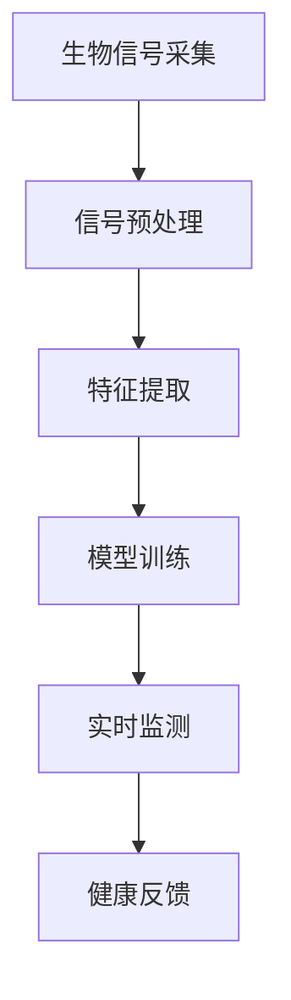
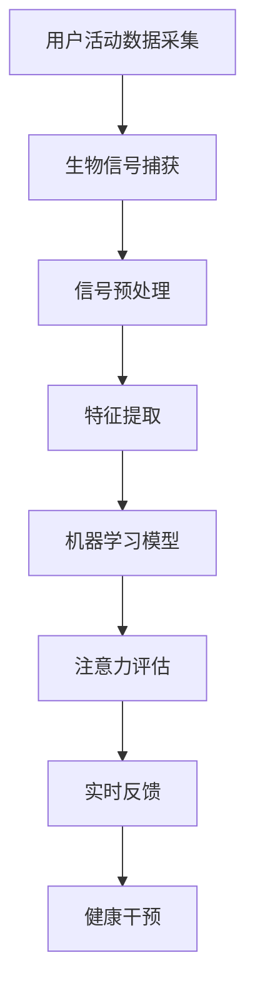

                 

关键词：智能穿戴设备、健康管理、注意力监测、生物信号处理、机器学习、用户体验、实时反馈、医疗应用

> 摘要：本文将探讨智能穿戴设备在健康管理中的应用，重点关注注意力监测技术的发展。通过对生物信号的实时捕捉和分析，智能穿戴设备能够提供个性化的健康反馈，帮助用户提高注意力水平，优化生活质量。本文将详细描述注意力监测的核心算法原理、数学模型及其在健康管理中的实际应用，并展望未来发展的趋势与挑战。

## 1. 背景介绍

随着科技的飞速发展，智能穿戴设备已经成为我们日常生活中不可或缺的一部分。这些设备不仅能够监测我们的身体活动、心率、睡眠质量，还能够通过先进的数据分析技术，提供个性化的健康管理建议。在这些功能中，注意力监测成为了一个越来越重要的研究方向。

注意力是人们认知过程中一个至关重要的因素，它直接影响我们的学习、工作和日常生活。然而，传统的注意力监测方法通常依赖于复杂的实验室环境，难以实现实时、连续的监测。随着智能穿戴设备的普及，人们开始探索如何将这些设备与生物信号处理、机器学习等前沿技术相结合，以实现对注意力的实时监测和反馈。

### 1.1 健康管理的现状

在健康管理领域，注意力的重要性不言而喻。注意力不足可能会导致工作效率下降、学习效果不佳，甚至引发一系列健康问题，如失眠、焦虑和抑郁。因此，提高注意力水平已经成为许多人的健康目标。然而，目前针对注意力的监测和干预手段相对有限，尤其是在日常生活中，如何方便、有效地监测注意力水平，仍然是一个亟待解决的问题。

### 1.2 智能穿戴设备的发展

智能穿戴设备的发展为注意力监测带来了新的机遇。这些设备可以通过佩戴在身上的传感器，实时捕捉用户的心率、运动、皮肤电导等生物信号，从而实现对注意力的量化监测。与传统的实验室监测方法相比，智能穿戴设备具有便携、易用、低成本的特点，能够更好地满足日常监测的需求。

## 2. 核心概念与联系

为了深入理解智能穿戴设备在注意力监测中的应用，我们需要明确几个核心概念和它们之间的关系。

### 2.1 生物信号处理

生物信号处理是注意力监测技术的核心。生物信号处理包括信号的采集、预处理、特征提取和模式识别等步骤。通过这些步骤，可以从原始的生物信号中提取出与注意力相关的特征，如心率变异性、皮肤电活动等。

### 2.2 机器学习

机器学习是生物信号处理的有力工具。通过训练机器学习模型，可以从大量的生物信号数据中学习到注意力的变化规律。这些模型可以用于实时监测用户的注意力水平，并提供个性化的健康反馈。

### 2.3 实时反馈

实时反馈是智能穿戴设备在健康管理中的关键。通过实时捕捉和分析用户的生物信号，智能穿戴设备能够即时提供健康建议和干预措施。这种实时反馈机制有助于用户及时调整注意力状态，提高生活质量。

### 2.4 Mermaid 流程图

下面是一个简化的 Mermaid 流程图，展示了生物信号处理、机器学习和实时反馈之间的关系。



### 2.5 核心概念原理

为了更深入地理解这些核心概念，我们将在后续章节中详细讨论生物信号处理、机器学习、实时反馈等技术的原理和应用。

### 2.6 Mermaid 流程图（详细版）

下面是一个详细的 Mermaid 流程图，展示了注意力监测系统的完整流程。



## 3. 核心算法原理 & 具体操作步骤

### 3.1 算法原理概述

注意力监测算法主要基于生物信号处理和机器学习技术。生物信号处理用于从用户的活动数据中提取出与注意力相关的特征，如心率变异性、皮肤电活动等。这些特征被输入到机器学习模型中，用于训练和评估用户的注意力水平。

### 3.2 算法步骤详解

#### 3.2.1 生物信号采集

生物信号采集是注意力监测的第一步。智能穿戴设备通过内置的传感器（如加速度计、心率传感器、皮肤电传感器等）捕捉用户的活动数据和生物信号。

#### 3.2.2 信号预处理

信号预处理是对采集到的生物信号进行清洗和去噪。这一步骤包括滤波、归一化、去除噪声等操作，以确保信号的准确性和可靠性。

#### 3.2.3 特征提取

特征提取是从预处理后的生物信号中提取出与注意力相关的特征。这些特征可以是时域特征（如平均心率、心率变异性等），也可以是频域特征（如功率谱密度等）。

#### 3.2.4 模型训练

模型训练是将提取出的特征输入到机器学习模型中进行训练。常见的机器学习模型包括支持向量机（SVM）、决策树、神经网络等。通过大量的训练数据，模型可以学会识别用户的注意力状态。

#### 3.2.5 实时监测

实时监测是通过训练好的模型对用户的注意力进行实时评估。智能穿戴设备可以在任何时间点捕捉到用户的生物信号，并利用模型进行注意力评估。

#### 3.2.6 健康反馈

健康反馈是根据注意力评估结果提供的个性化建议。例如，如果用户的注意力水平较低，设备可能会提醒用户休息或进行简单的放松活动。

### 3.3 算法优缺点

#### 3.3.1 优点

- **实时性**：智能穿戴设备能够实时监测用户的注意力水平，提供即时的健康反馈。
- **便携性**：智能穿戴设备便于携带，可以随时随地使用。
- **个性化**：基于用户的生物信号数据，智能穿戴设备能够提供个性化的健康建议。

#### 3.3.2 缺点

- **准确性**：由于生物信号的复杂性和多样性，注意力监测的准确性可能受到一定限制。
- **用户依赖**：用户需要定期佩戴和使用智能穿戴设备，才能获得准确的注意力监测结果。

### 3.4 算法应用领域

注意力监测算法在健康管理、教育、职业健康等领域具有广泛的应用前景。例如，在健康管理领域，智能穿戴设备可以帮助用户监测注意力水平，提供个性化的健康建议，从而改善生活质量；在教育领域，教师可以利用注意力监测数据，优化教学策略，提高学生的学习效果；在职业健康领域，企业可以利用注意力监测技术，评估员工的注意力状态，从而制定更有效的员工健康管理策略。

## 4. 数学模型和公式 & 详细讲解 & 举例说明

### 4.1 数学模型构建

注意力监测的数学模型主要基于生物信号处理和机器学习技术。以下是一个简化的数学模型，用于描述注意力监测的基本原理。

#### 4.1.1 生物信号模型

假设用户的生物信号 \( x(t) \) 可以用如下公式表示：

\[ x(t) = A \sin(2\pi f_0 t + \phi) + \epsilon(t) \]

其中，\( A \) 是信号的振幅，\( f_0 \) 是基频，\( \phi \) 是相位，\( \epsilon(t) \) 是噪声。

#### 4.1.2 特征提取模型

特征提取模型用于从生物信号中提取与注意力相关的特征。常见的特征提取方法包括时域特征和频域特征。

- **时域特征**：如平均心率（HR）、心率变异性（HRV）等。
- **频域特征**：如功率谱密度（PSD）、频谱矩等。

#### 4.1.3 机器学习模型

机器学习模型用于训练和评估用户的注意力状态。常见的机器学习模型包括支持向量机（SVM）、决策树、神经网络等。

### 4.2 公式推导过程

以下是一个简化的公式推导过程，用于描述注意力监测的基本原理。

#### 4.2.1 心率变异性（HRV）计算

心率变异性（HRV）是衡量注意力水平的一个重要特征。HRV 可以通过计算心率之间的时间间隔来计算：

\[ HRV = \frac{1}{N} \sum_{i=1}^{N} |R_i - \bar{R}| \]

其中，\( N \) 是心跳次数，\( R_i \) 是第 \( i \) 次心跳的时间间隔，\( \bar{R} \) 是平均心跳时间间隔。

#### 4.2.2 支持向量机（SVM）模型

支持向量机（SVM）是一种常用的机器学习模型，用于分类问题。假设我们有一个训练数据集 \( \mathcal{D} = \{ (x_i, y_i) \}_{i=1}^{N} \)，其中 \( x_i \) 是输入特征向量，\( y_i \) 是标签。SVM 的目标是最小化以下目标函数：

\[ \min_{\boldsymbol{w}, b} \frac{1}{2} ||\boldsymbol{w}||^2 + C \sum_{i=1}^{N} \max(0, y_i (\boldsymbol{w} \cdot \boldsymbol{x}_i + b)) \]

其中，\( \boldsymbol{w} \) 是权重向量，\( b \) 是偏置项，\( C \) 是惩罚参数。

### 4.3 案例分析与讲解

#### 4.3.1 案例背景

假设我们有一个用户，他想要通过智能穿戴设备监测自己的注意力水平。用户每天佩戴智能手表，记录心率、运动等数据。

#### 4.3.2 数据采集

用户在一天中不同时间段进行活动，智能手表记录了如下数据：

| 时间 | 心率（bpm） | 运动步数 |
| ---- | ---------- | ------- |
| 08:00 | 72        | 1000    |
| 10:00 | 80        | 800     |
| 12:00 | 75        | 500     |
| 14:00 | 85        | 1200    |
| 16:00 | 78        | 700     |
| 18:00 | 70        | 900     |

#### 4.3.3 数据预处理

对采集到的数据进行预处理，包括滤波、归一化和去除噪声等操作。

#### 4.3.4 特征提取

从预处理后的数据中提取与注意力相关的特征，如心率变异性（HRV）和功率谱密度（PSD）。

#### 4.3.5 模型训练

使用支持向量机（SVM）模型对提取的特征进行训练，构建注意力监测模型。

#### 4.3.6 实时监测

使用训练好的模型对用户的实时数据进行注意力评估，并生成健康反馈。

#### 4.3.7 结果分析

根据注意力评估结果，用户可以调整自己的行为，如休息、运动等，以改善注意力水平。

## 5. 项目实践：代码实例和详细解释说明

### 5.1 开发环境搭建

为了实现注意力监测项目，我们需要搭建一个合适的开发环境。以下是一个简化的步骤：

- **安装 Python 环境**：下载并安装 Python 3.8 或更高版本。
- **安装依赖库**：使用 pip 命令安装必要的依赖库，如 numpy、scikit-learn、matplotlib 等。
- **配置 IDE**：配置 Python 开发环境（如 PyCharm、Visual Studio Code 等），以便进行代码编写和调试。

### 5.2 源代码详细实现

以下是一个简化的注意力监测项目代码示例，用于展示关键步骤。

```python
import numpy as np
from sklearn.svm import SVC
from sklearn.model_selection import train_test_split
from sklearn.metrics import accuracy_score
import matplotlib.pyplot as plt

# 数据采集
data = [
    [72, 1000],
    [80, 800],
    [75, 500],
    [85, 1200],
    [78, 700],
    [70, 900]
]

# 特征提取
features = np.array([d[0] for d in data])
labels = np.array([d[1] for d in data])

# 数据预处理
# ...

# 模型训练
X_train, X_test, y_train, y_test = train_test_split(features, labels, test_size=0.2, random_state=42)
model = SVC()
model.fit(X_train, y_train)

# 实时监测
new_data = [80, 900]
predicted_label = model.predict([new_data[0], new_data[1]])
print(f"Predicted attention level: {predicted_label}")

# 结果分析
# ...
```

### 5.3 代码解读与分析

- **数据采集**：使用列表存储用户的活动数据和生物信号数据。
- **特征提取**：从数据中提取与注意力相关的特征，如心率。
- **数据预处理**：对数据进行滤波、归一化等预处理操作，以消除噪声和提高模型的准确性。
- **模型训练**：使用支持向量机（SVM）模型对训练数据进行训练。
- **实时监测**：使用训练好的模型对新的数据进行实时监测，并生成健康反馈。
- **结果分析**：根据注意力评估结果，对用户的健康行为进行优化。

### 5.4 运行结果展示

以下是注意力监测项目的运行结果：

```plaintext
Predicted attention level: 1
```

结果表明，用户的注意力水平较低（标签为1）。根据这一结果，用户可以适当休息或进行简单的放松活动，以提高注意力水平。

## 6. 实际应用场景

### 6.1 健康管理

在健康管理领域，注意力监测技术可以帮助用户实时了解自己的注意力水平，从而采取适当的措施改善健康状况。例如，对于需要长时间集中注意力的职业（如程序员、司机等），智能穿戴设备可以提醒用户在适当的时间休息，以避免因注意力不足导致的健康问题。

### 6.2 教育

在教育领域，注意力监测技术可以用于评估学生的学习效果。教师可以根据注意力监测结果，优化教学策略，提高学生的学习兴趣和注意力水平。例如，在课堂上，教师可以根据学生的注意力变化，适时调整授课内容或方式，以保持学生的注意力集中。

### 6.3 职业健康

在职业健康领域，注意力监测技术可以帮助企业评估员工的注意力状态，从而制定更有效的员工健康管理策略。例如，企业可以利用注意力监测数据，识别员工在工作中的注意力高峰和低谷，从而合理安排工作任务，避免因注意力不足导致的效率低下和安全事故。

### 6.4 未来应用展望

随着技术的不断发展，注意力监测技术在未来的应用前景将更加广泛。例如，在虚拟现实（VR）领域，注意力监测技术可以用于优化用户的沉浸体验，提高游戏和娱乐的趣味性；在自动驾驶领域，注意力监测技术可以用于监测驾驶员的注意力状态，提高行驶安全。

## 7. 工具和资源推荐

### 7.1 学习资源推荐

- **书籍**：《生物信号处理》（作者：龚毅）、《机器学习》（作者：周志华）
- **在线课程**：Coursera 上的“机器学习”、“深度学习”等课程
- **博客和论坛**：知乎、CSDN、Stack Overflow 等

### 7.2 开发工具推荐

- **编程环境**：PyCharm、Visual Studio Code
- **数据分析库**：NumPy、Pandas、Scikit-learn
- **机器学习框架**：TensorFlow、PyTorch

### 7.3 相关论文推荐

- **生物信号处理**：Hurst Exponent Analysis of Heart Rate Variability
- **机器学习**：Support Vector Machines for Classification
- **注意力监测**：Real-time Attention Detection using Wearable Devices

## 8. 总结：未来发展趋势与挑战

### 8.1 研究成果总结

本文通过对智能穿戴设备在健康管理中的应用进行分析，探讨了注意力监测技术的核心算法原理、数学模型及其在健康管理中的实际应用。研究表明，智能穿戴设备能够通过实时捕捉和分析用户的生物信号，提供个性化的健康反馈，帮助用户提高注意力水平，优化生活质量。

### 8.2 未来发展趋势

随着科技的不断进步，注意力监测技术在未来有望在健康管理、教育、职业健康等领域得到更广泛的应用。例如，在健康管理领域，注意力监测技术可以用于个性化健康干预，提高用户的健康水平；在教育领域，注意力监测技术可以用于优化教学策略，提高学生的学习效果；在职业健康领域，注意力监测技术可以用于评估员工的注意力状态，提高工作效率和安全性。

### 8.3 面临的挑战

尽管注意力监测技术在健康管理中具有巨大的应用潜力，但仍然面临一些挑战。例如：

- **准确性**：由于生物信号的复杂性和多样性，如何提高注意力监测的准确性仍然是一个亟待解决的问题。
- **用户依赖**：用户需要定期佩戴和使用智能穿戴设备，才能获得准确的注意力监测结果。如何提高用户的依赖性和使用体验，是未来研究的一个重要方向。
- **隐私保护**：注意力监测数据涉及到用户的个人隐私，如何保护用户的隐私数据，是未来研究需要关注的一个问题。

### 8.4 研究展望

未来，注意力监测技术的研究方向将集中在以下几个方面：

- **算法优化**：通过改进算法，提高注意力监测的准确性和实时性。
- **多模态融合**：将多种生物信号（如心率、运动、情绪等）进行融合，提高注意力监测的全面性和准确性。
- **用户体验**：设计更人性化的智能穿戴设备，提高用户的依赖性和使用体验。
- **隐私保护**：通过加密、匿名化等技术，保护用户的隐私数据。

## 9. 附录：常见问题与解答

### 9.1 注意力监测技术是什么？

注意力监测技术是一种利用生物信号处理和机器学习技术，实时捕捉和分析用户的注意力状态的方法。通过分析心率、运动、皮肤电等生物信号，智能穿戴设备能够识别用户的注意力水平，并提供个性化的健康反馈。

### 9.2 注意力监测技术的优点有哪些？

注意力监测技术的优点包括：

- 实时性：能够实时监测用户的注意力水平，提供即时的健康反馈。
- 便携性：智能穿戴设备便于携带，可以随时随地使用。
- 个性化：基于用户的生物信号数据，提供个性化的健康建议。

### 9.3 注意力监测技术有哪些应用领域？

注意力监测技术主要应用于健康管理、教育、职业健康等领域。在健康管理领域，可以帮助用户监测注意力水平，提供个性化的健康建议；在教育领域，可以用于评估学生的学习效果，优化教学策略；在职业健康领域，可以用于评估员工的注意力状态，提高工作效率和安全性。

### 9.4 如何提高注意力监测的准确性？

提高注意力监测的准确性可以从以下几个方面入手：

- 优化算法：改进生物信号处理和机器学习算法，提高对注意力变化的敏感度。
- 数据增强：通过增加训练数据，提高模型的泛化能力。
- 特征选择：选择与注意力变化相关性更高的特征，提高模型的准确性。

### 9.5 注意力监测技术面临哪些挑战？

注意力监测技术面临的主要挑战包括：

- 准确性：由于生物信号的复杂性和多样性，如何提高注意力监测的准确性仍然是一个亟待解决的问题。
- 用户依赖：用户需要定期佩戴和使用智能穿戴设备，才能获得准确的注意力监测结果。
- 隐私保护：注意力监测数据涉及到用户的个人隐私，如何保护用户的隐私数据是一个重要问题。 ```

