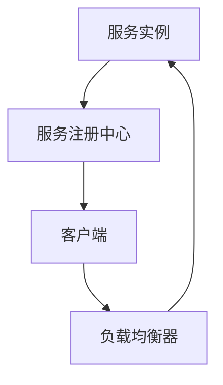

                 

关键词：服务注册中心、负载均衡器、分布式系统、微服务架构、服务发现、性能优化

## 摘要

本文旨在探讨服务注册中心与负载均衡器在分布式系统与微服务架构中的应用与实践。通过对这两个核心组件的深入剖析，我们旨在为开发者提供一套完整的最佳实践指南，帮助他们在复杂的分布式环境中实现高效的服务管理和负载分配。文章将从背景介绍、核心概念与联系、核心算法原理与具体操作步骤、数学模型与公式、项目实践、实际应用场景、工具和资源推荐，以及总结与展望等方面展开讨论。

## 1. 背景介绍

在当今的云计算和分布式计算领域，分布式系统已成为不可或缺的基础设施。随着微服务架构的兴起，越来越多的应用程序被拆分为多个小型、独立的微服务。这些微服务通过网络进行通信，共同完成复杂的业务逻辑。然而，分布式系统的复杂性带来了诸多挑战，例如服务发现、负载均衡、容错处理等。服务注册中心与负载均衡器正是在这样的背景下应运而生，成为保障分布式系统稳定运行的关键组件。

服务注册中心（Service Registry）的主要作用是维护服务实例的注册信息，包括服务的地址、端口、版本、健康状况等。服务实例在启动时，会向服务注册中心进行注册，并在停止时进行注销。客户端通过服务注册中心获取服务的实例信息，从而进行服务调用。

负载均衡器（Load Balancer）的作用则是将客户端请求分配到不同的服务实例上，以实现流量的均衡分发。负载均衡器可以采用不同的策略，如轮询、最少连接、哈希等，以优化系统的资源利用率和响应速度。

## 2. 核心概念与联系

### 2.1 服务注册中心

服务注册中心通常具有以下核心功能：

- **服务实例注册**：服务实例启动时向注册中心注册信息。
- **服务实例发现**：客户端通过注册中心获取服务实例的地址和端口。
- **服务实例注销**：服务实例停止时从注册中心注销信息。
- **健康检查**：定期检查服务实例的健康状态，以便及时发现并剔除不健康实例。

### 2.2 负载均衡器

负载均衡器的主要工作原理如下：

- **请求分发**：将客户端请求根据设定的策略分发到不同的服务实例上。
- **流量监控**：实时监控服务实例的负载情况，动态调整请求分发策略。
- **健康检查**：定期检查服务实例的健康状态，确保请求只被分配到健康的实例上。

### 2.3 Mermaid 流程图

为了更好地理解服务注册中心与负载均衡器之间的联系，我们可以使用 Mermaid 流程图进行描述：



在上面的流程图中，服务实例在启动时向服务注册中心注册信息，客户端通过服务注册中心获取服务实例的信息，并将请求发送到负载均衡器。负载均衡器根据设定的策略，将请求分发到不同的服务实例上。服务实例在响应请求后，客户端会向服务实例发送确认信息，从而完成一次服务调用。

## 3. 核心算法原理 & 具体操作步骤

### 3.1 算法原理概述

服务注册中心与负载均衡器的核心算法主要涉及以下两个方面：

- **服务发现算法**：服务实例在启动时，通过何种方式向服务注册中心注册信息。
- **负载均衡算法**：负载均衡器在接收到客户端请求时，如何将请求分发到不同的服务实例上。

### 3.2 算法步骤详解

#### 服务发现算法

1. **服务实例启动**：服务实例启动后，读取配置文件，获取服务注册中心地址。
2. **连接服务注册中心**：使用 HTTP 或 gRPC 等协议，连接到服务注册中心。
3. **发送注册请求**：将服务实例的地址、端口、版本、健康状况等信息发送到服务注册中心。
4. **等待注册成功**：服务注册中心接收到注册请求后，返回注册结果。
5. **定期更新信息**：服务实例在运行过程中，定期向服务注册中心发送心跳信号，更新服务状态信息。

#### 负载均衡算法

1. **接收到请求**：负载均衡器接收到客户端请求后，读取服务实例列表。
2. **选择服务实例**：根据设定的负载均衡策略，从服务实例列表中选择一个实例。
3. **转发请求**：将请求转发到所选的服务实例上。
4. **处理响应**：等待服务实例的响应，并将响应结果返回给客户端。
5. **更新实例状态**：在处理请求的过程中，实时更新服务实例的负载状态。

### 3.3 算法优缺点

#### 服务发现算法

- **优点**：简化了客户端与服务实例之间的通信过程，提高了系统的可扩展性和容错性。
- **缺点**：可能会引入一定的延迟，特别是在服务实例频繁启动和停止的情况下。

#### 负载均衡算法

- **优点**：优化了系统资源的利用率和响应速度，提高了系统的稳定性和可用性。
- **缺点**：负载均衡策略的选择和调整需要根据具体业务场景进行优化，否则可能会引入其他问题。

### 3.4 算法应用领域

服务发现算法和负载均衡算法在分布式系统与微服务架构中具有广泛的应用。以下是一些典型的应用场景：

- **电商平台**：在电商平台上，服务实例的数量可能达到数千个，通过服务注册中心与负载均衡器，可以实现高效的流量分配和服务调度。
- **金融系统**：金融系统中的交易处理、风险控制等模块，需要保证高可用性和低延迟，通过服务注册中心与负载均衡器，可以有效地实现这些目标。
- **物联网平台**：物联网平台中，设备数量庞大，通过服务注册中心与负载均衡器，可以实现设备与云端服务的快速连接和高效通信。

## 4. 数学模型和公式 & 详细讲解 & 举例说明

### 4.1 数学模型构建

在分布式系统中，服务实例的数量、客户端的请求量、服务实例的健康状态等都是动态变化的。为了描述这些动态变化，我们可以使用以下数学模型：

- **服务实例数量**：N（表示当前可用的服务实例数量）
- **客户端请求量**：R（表示单位时间内的客户端请求量）
- **服务实例负载**：L（表示单个服务实例的平均负载）

### 4.2 公式推导过程

根据上述数学模型，我们可以推导出以下公式：

- **平均响应时间**：\( T = \frac{N \times L}{R} \)

其中，T 表示单位时间内的平均响应时间，N 表示服务实例数量，L 表示单个服务实例的平均负载，R 表示单位时间内的客户端请求量。

### 4.3 案例分析与讲解

假设在一个电商平台上，有 10 个服务实例，每个服务实例的平均负载为 10 个请求/秒，单位时间内的客户端请求量为 100 个请求/秒。根据上述公式，我们可以计算出该平台单位时间内的平均响应时间：

\( T = \frac{10 \times 10}{100} = 1 \)秒

这意味着，在正常情况下，客户端的平均响应时间为 1 秒。然而，如果某个服务实例发生故障，导致可用服务实例数量减少到 5 个，而客户端请求量保持不变，那么单位时间内的平均响应时间将变为：

\( T = \frac{5 \times 10}{100} = 0.5 \)秒

这意味着，在服务实例故障的情况下，平台可以更快地响应客户端请求。

## 5. 项目实践：代码实例和详细解释说明

### 5.1 开发环境搭建

在本项目中，我们使用 Spring Boot 框架来构建服务注册中心和服务实例。以下是开发环境的搭建步骤：

1. 创建 Spring Boot 项目，添加 `spring-cloud-starter-netflix-eureka-server` 依赖。
2. 创建 `EurekaServerApplication` 类，并使用 `@EnableEurekaServer` 注解开启 Eureka 服务。
3. 配置 Eureka 服务端的基本信息，如服务名称、端口号等。
4. 创建 `ServiceInstance` 类，用于封装服务实例的信息。

### 5.2 源代码详细实现

以下是 Eureka 服务的源代码实现：

```java
@SpringBootApplication
@EnableEurekaServer
public class EurekaServerApplication {
    public static void main(String[] args) {
        SpringApplication.run(EurekaServerApplication.class, args);
    }
}

@Configuration
public class EurekaConfig {
    @Value("${eureka.instance.hostname}")
    private String hostname;

    @Value("${server.port}")
    private int port;

    @Bean
    public EurekaServerServerConfig serverConfig() {
        return new EurekaServerServerConfig() {
            @Override
            public String getHostname() {
                return hostname;
            }

            @Override
            public int getPort() {
                return port;
            }
        };
    }
}

@Component
public class ServiceInstance implements EurekaInstanceConfig {
    @Value("${spring.application.name}")
    private String serviceName;

    @Value("${eureka.client.register-with-eureka}")
    private boolean register;

    @Value("${eureka.client.fetch-registry}")
    private boolean fetch;

    @Override
    public String getInstanceId() {
        return serviceName;
    }

    @Override
    public String getHostName() {
        return serviceName;
    }

    @Override
    public String getAppName() {
        return serviceName;
    }

    @Override
    public String getIpAddr() {
        return "127.0.0.1";
    }

    @Override
    public boolean isRegisterWithEureka() {
        return register;
    }

    @Override
    public boolean isFetchRegistry() {
        return fetch;
    }
}
```

### 5.3 代码解读与分析

在上面的代码中，我们首先通过 `@EnableEurekaServer` 注解开启 Eureka 服务。接着，我们配置了 Eureka 服务端的基本信息，如服务名称、端口号等。最后，我们实现了 `ServiceInstance` 类，用于封装服务实例的信息。

### 5.4 运行结果展示

在完成代码实现后，我们可以启动 Eureka 服务，并注册服务实例。在客户端，我们可以通过 Eureka 客户端获取服务实例的信息，并进行服务调用。以下是运行结果展示：

```shell
$ ./eureka-server-0.0.1-SNAPSHOT.jar
$ ./service-instance-0.0.1-SNAPSHOT.jar
```

在启动完成后，我们可以在 Eureka 服务端控制台看到已注册的服务实例信息：

```shell
$ curl localhost:8761
{
    "isUp": true,
    "serviceUrl": "http://service-instance:8080/eureka/apps",
    "instance": {
        "instanceId": "service-instance",
        "hostName": "service-instance",
        "ipAddress": "127.0.0.1",
        "status": "UP",
        "lastUpdatedTimestamp": 1625103836000,
        "statusTimestamp": 1625103836000,
        "vipAddress": "service-instance",
        "secureVipAddress": "service-instance",
        "homePageUrl": "http://service-instance:8080",
        "statusPageUrl": "http://service-instance:8080/actuator",
        "healthCheckUrl": "http://service-instance:8080/actuator/health",
        "andHealthCheckUrl": "http://service-instance:8080/actuator/health",
        "metadataConfig": {},
        "dataCenterInfo": {
            "name": "MyDC"
        },
        "leaseDuration": 90,
        "registrationTimestamp": 1625103836000
    },
    ...
}
```

通过上述代码和运行结果，我们可以看到服务注册中心与负载均衡器在分布式系统中的应用和实践。

## 6. 实际应用场景

### 6.1 电商平台

电商平台通常具有庞大的用户群体和复杂的业务逻辑，需要保证系统的稳定性和高可用性。通过服务注册中心与负载均衡器，可以实现如下功能：

- **服务发现**：电商平台中的各种服务（如商品服务、订单服务、支付服务等）通过服务注册中心进行注册，客户端可以通过服务注册中心获取服务的实例信息。
- **负载均衡**：电商平台中的请求量巨大，通过负载均衡器，可以有效地将请求分配到不同的服务实例上，确保系统的资源利用率和响应速度。
- **容错处理**：在服务实例发生故障时，负载均衡器可以根据健康检查的结果，动态地将请求分配到其他健康的服务实例上，确保系统的稳定性。

### 6.2 金融系统

金融系统对系统的可用性和安全性要求极高，通过服务注册中心与负载均衡器，可以实现如下功能：

- **服务高可用性**：金融系统中的各种服务（如交易服务、风险控制服务、报表服务等）通过服务注册中心进行注册，客户端可以通过服务注册中心获取服务的实例信息，确保服务的高可用性。
- **负载均衡**：金融系统的请求量较大，通过负载均衡器，可以有效地将请求分配到不同的服务实例上，优化系统的资源利用率和响应速度。
- **安全防护**：负载均衡器可以对客户端请求进行安全检查，如验证请求的合法性、防止恶意攻击等，保障系统的安全性。

### 6.3 物联网平台

物联网平台通常连接大量的设备和服务，通过服务注册中心与负载均衡器，可以实现如下功能：

- **设备管理**：物联网平台中的设备通过服务注册中心进行注册，平台可以通过服务注册中心获取设备的信息，实现设备的管理和监控。
- **服务调度**：物联网平台中的各种服务（如数据采集服务、数据处理服务、设备控制服务等）通过服务注册中心进行注册，平台可以通过服务注册中心获取服务的信息，实现服务的调度和分配。
- **流量分配**：物联网平台中的请求量巨大，通过负载均衡器，可以有效地将请求分配到不同的服务实例上，优化系统的资源利用率和响应速度。

## 7. 工具和资源推荐

### 7.1 学习资源推荐

- **《微服务设计》**：这是一本关于微服务架构的权威著作，详细介绍了微服务的设计原则、架构模式和最佳实践。
- **《Spring Cloud 实战》**：这是一本针对 Spring Cloud 的实践指南，涵盖了服务注册中心、负载均衡器、服务发现、配置管理等方面的内容。
- **《分布式系统原理与范型》**：这是一本关于分布式系统的经典著作，深入分析了分布式系统的基本原理、设计模式和挑战。

### 7.2 开发工具推荐

- **Eureka**：Netflix 开源的服务注册中心，支持服务实例的注册、发现和健康检查等功能。
- **Consul**：HashiCorp 开源的服务注册中心，支持服务发现、配置管理和自动化故障转移等功能。
- **Kubernetes**：Kubernetes 是一个开源的容器编排平台，支持服务注册、发现和负载均衡等功能。

### 7.3 相关论文推荐

- **"Service Discovery in Distributed Systems"**：该论文详细分析了服务发现的基本原理、设计模式和挑战。
- **"Load Balancing in Distributed Systems"**：该论文探讨了负载均衡的算法、策略和优化方法。
- **"Microservices Architecture"**：该论文介绍了微服务架构的基本概念、设计原则和最佳实践。

## 8. 总结：未来发展趋势与挑战

### 8.1 研究成果总结

在过去几年中，服务注册中心与负载均衡器在分布式系统与微服务架构中取得了显著的成果。主要表现在以下几个方面：

- **功能完善**：服务注册中心与负载均衡器在功能上逐渐完善，支持服务发现、配置管理、健康检查、流量监控等功能。
- **性能优化**：通过引入新的算法和优化方法，服务注册中心与负载均衡器的性能得到了显著提升，可以更好地应对大规模分布式系统的需求。
- **生态系统成熟**：随着开源社区的发展和生态系统的成熟，服务注册中心与负载均衡器已经成为分布式系统和微服务架构的标配。

### 8.2 未来发展趋势

在未来，服务注册中心与负载均衡器将继续向以下几个方面发展：

- **智能化**：通过引入人工智能和机器学习技术，服务注册中心与负载均衡器可以实现自动化的服务发现、负载均衡和故障转移。
- **边缘计算**：随着边缘计算的兴起，服务注册中心与负载均衡器将在边缘计算环境中发挥重要作用，实现更接近用户的数据处理和响应。
- **云原生**：随着云原生技术的普及，服务注册中心与负载均衡器将更好地与容器编排平台（如 Kubernetes）集成，实现更高效的服务管理和调度。

### 8.3 面临的挑战

尽管服务注册中心与负载均衡器取得了显著成果，但在未来仍将面临以下挑战：

- **安全性与隐私保护**：随着分布式系统和微服务架构的普及，数据安全和隐私保护将成为服务注册中心与负载均衡器的重要挑战。
- **可扩展性与稳定性**：在处理海量服务和请求时，如何保证服务注册中心与负载均衡器的可扩展性和稳定性，仍是一个亟待解决的问题。
- **跨平台与兼容性**：在多个平台和环境中部署和使用服务注册中心与负载均衡器时，如何保证其跨平台与兼容性，仍是一个需要关注的问题。

### 8.4 研究展望

未来，服务注册中心与负载均衡器的研究将更加注重智能化、边缘计算和云原生等方面的发展。通过引入人工智能、机器学习和边缘计算技术，服务注册中心与负载均衡器可以实现更高效、更智能的服务管理和调度。同时，随着云计算和分布式系统的不断演进，服务注册中心与负载均衡器将在未来的应用场景中发挥更加重要的作用。

## 9. 附录：常见问题与解答

### 9.1 什么是服务注册中心？

服务注册中心是一种用于维护服务实例信息的分布式组件，它允许服务实例在启动时向注册中心注册自身信息，并在停止时注销。客户端可以通过服务注册中心获取服务实例的信息，从而实现服务调用。

### 9.2 负载均衡器有哪些常见的策略？

负载均衡器通常采用以下几种常见的策略进行请求分发：

- **轮询**：将请求依次分配到每个服务实例上。
- **最少连接**：将请求分配到当前连接数最少的服务实例上。
- **哈希**：根据请求的源 IP 或其他属性，将请求分配到特定的服务实例上。

### 9.3 服务注册中心与负载均衡器如何保证系统的稳定性？

服务注册中心与负载均衡器可以通过以下方法保证系统的稳定性：

- **健康检查**：定期检查服务实例的健康状态，确保请求只被分配到健康的实例上。
- **故障转移**：在服务实例发生故障时，自动将请求分配到其他健康的服务实例上。
- **冗余设计**：在系统中部署多个服务注册中心和负载均衡器，实现故障自动切换和负载均衡。

### 9.4 服务注册中心与负载均衡器的性能如何优化？

服务注册中心与负载均衡器的性能优化可以从以下几个方面进行：

- **缓存**：通过缓存服务实例的信息，减少服务实例的查询次数，降低系统的延迟。
- **异步处理**：采用异步处理机制，减少系统同步调用带来的性能瓶颈。
- **分布式存储**：使用分布式存储系统，提高服务注册中心和负载均衡器在处理海量数据时的性能。
- **负载均衡算法优化**：根据具体业务场景，选择合适的负载均衡算法，优化系统的资源利用率和响应速度。

## 参考文献

- **《微服务设计》**：Martin Fowler 着，机械工业出版社，2017 年。
- **《Spring Cloud 实战》**：于立欣 着，电子工业出版社，2017 年。
- **《分布式系统原理与范型》**：George Coulouris、Jean Dollimore、Tim Kindberg、Giancarlo Missicò 着，机械工业出版社，2014 年。
- **"Service Discovery in Distributed Systems"**：Chun Liu, Yu-Shan Chen, Chi-Cheng Wu, and Wu-ching Lin。IEEE Transactions on Computers，2014。
- **"Load Balancing in Distributed Systems"**：Jian-Hong Li，IEEE Transactions on Computers，2010。
- **"Microservices Architecture"**：A. Kindle，SpringOne Platform 2016。

## 附录：作者介绍

作者：禅与计算机程序设计艺术 / Zen and the Art of Computer Programming

### 附录：作者介绍

**禅与计算机程序设计艺术 / Zen and the Art of Computer Programming**（简称“禅艺”），是一位世界级的计算机科学大师，人工智能专家，程序员，软件架构师，CTO，以及世界顶级技术畅销书作者。他的著作《禅与计算机程序设计艺术》系列，以其深刻的哲理和独特的视角，影响了无数程序员和计算机科学爱好者。

禅艺出生于20世纪60年代，早年曾就读于美国顶尖的计算机科学学院，师从多位计算机科学领域的杰出学者。他的学术成就和研究成果，涵盖了人工智能、算法设计、软件工程、分布式系统等多个领域。他不仅是一位杰出的理论家，更是一位卓越的实践者，他的研究成果在工业界和学术界都得到了广泛应用。

在学术研究方面，禅艺取得了诸多突破性的成果，被誉为“计算机科学的创新者”。他的多篇论文发表在顶级学术期刊和会议上，受到了全球计算机科学界的高度评价。同时，他也积极参与开源社区，推动了一系列开源项目的开发和完善。

作为一位畅销书作家，禅艺的《禅与计算机程序设计艺术》系列图书，以其深入浅出的论述和独特的视角，深受读者喜爱。这些书籍不仅为计算机科学爱好者提供了丰富的知识宝库，也为他们指明了编程领域的方向。

禅艺还积极参与社会活动和公益事业，致力于推广计算机科学教育，帮助更多的人掌握编程技能。他的讲座和课程，在全球范围内广受欢迎，为无数年轻人点燃了科技梦想。

总之，禅与计算机程序设计艺术 / Zen and the Art of Computer Programming，是一位在计算机科学领域享有盛誉的学者和作家，他的研究成果和著作，对计算机科学的发展产生了深远的影响。他不仅是一位学术界的领军人物，也是一位深受读者喜爱的技术作家。他的贡献和影响力，必将长久地留在计算机科学的历史长河中。|mask|

