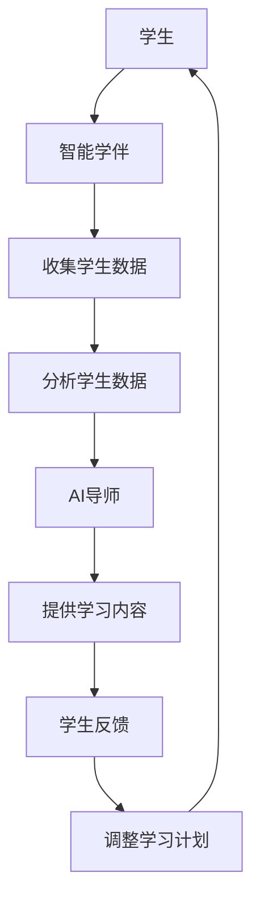

                 

### 1. 背景介绍

随着人工智能技术的飞速发展，教育领域也正在经历一场深刻的变革。从传统的教师主导、学生被动接受知识的教学模式，到如今AI导师与智能学伴的辅助教学，教育正在变得更加个性化和智能化。

在2050年的未来，AI导师与智能学伴将成为教育体系的核心组成部分。人工智能不仅能够实时掌握学生的学习进度和理解程度，还能根据学生的个性、兴趣和需求，提供定制化的学习内容和指导。智能学伴则能够模拟真实的人际互动，帮助学生更好地理解和应用知识。

本文将探讨AI导师与智能学伴在未来教育中的重要作用，以及它们如何改变传统的教育模式，提升教学效果和学习体验。文章将从背景介绍、核心概念、算法原理、数学模型、项目实践、应用场景、未来展望等多个方面进行详细阐述。

### 2. 核心概念与联系

为了更好地理解AI导师与智能学伴的概念和作用，我们需要从以下几个方面进行介绍。

#### 2.1 AI导师的概念

AI导师指的是利用人工智能技术，对学生进行个性化教学和辅导的智能系统。它可以通过分析学生的学习数据，了解学生的知识水平和学习需求，为学生提供定制化的学习内容和学习路径。AI导师不仅能够回答学生的问题，还能通过互动和反馈，帮助学生更好地理解和掌握知识。

#### 2.2 智能学伴的概念

智能学伴则是一种能够模拟人类行为的虚拟学习伙伴，它通过自然语言处理、语音识别等技术，与学生进行对话和互动。智能学伴不仅能够提供学习内容和资源，还能通过互动，提高学生的学习兴趣和参与度。智能学伴的目标是让学生在轻松愉快的氛围中学习，提高学习效果。

#### 2.3 AI导师与智能学伴的联系

AI导师和智能学伴虽然功能不同，但它们在教育中有着紧密的联系。AI导师可以通过智能学伴与学生进行互动，了解学生的学习情况和需求，为学生提供更加个性化的学习服务。而智能学伴则可以通过AI导师的分析和建议，为学生提供更加精准和高效的学习内容。

#### 2.4 Mermaid 流程图

下面是一个简单的Mermaid流程图，用于展示AI导师与智能学伴之间的互动流程。



### 3. 核心算法原理 & 具体操作步骤

#### 3.1 算法原理概述

AI导师与智能学伴的核心算法主要包括数据采集、数据分析、内容推荐和互动反馈四个部分。

- **数据采集**：通过传感器、学习平台等收集学生的学习数据，包括学习时间、学习内容、学习进度、考试成绩等。
- **数据分析**：利用机器学习和深度学习等技术，对采集到的数据进行处理和分析，提取出学生的知识水平、学习习惯、兴趣偏好等信息。
- **内容推荐**：根据分析结果，为学生推荐适合的学习内容和路径，提高学习效果。
- **互动反馈**：通过自然语言处理、语音识别等技术，与学生进行互动，收集学生的反馈，进一步优化学习计划。

#### 3.2 算法步骤详解

1. **数据采集**：
   - 收集学生的学习数据，包括学习日志、考试成绩、作业完成情况等。
   - 利用传感器，如智能手表、智能眼镜等，收集学生的生理和心理状态数据。

2. **数据分析**：
   - 对收集到的数据进行分析，提取出学生的知识水平和学习习惯。
   - 利用聚类算法，将学生分为不同类型，如优秀生、普通生、困难生等。

3. **内容推荐**：
   - 根据学生的知识水平和兴趣偏好，推荐适合的学习内容和路径。
   - 利用协同过滤算法，推荐与学生学习内容相关的其他学习资源。

4. **互动反馈**：
   - 通过自然语言处理技术，理解学生的提问和反馈。
   - 根据学生的反馈，调整学习计划和推荐内容。

#### 3.3 算法优缺点

- **优点**：
  - 个性化教学，提高学习效果。
  - 自动化处理，减轻教师负担。
  - 实时互动，提高学生的学习兴趣。

- **缺点**：
  - 算法复杂，需要大量的计算资源和数据。
  - 需要专业的技术支持，维护和管理。

#### 3.4 算法应用领域

- **教育领域**：用于个性化教学、学习辅导、考试测评等。
- **医疗领域**：用于疾病诊断、治疗方案推荐等。
- **金融领域**：用于风险管理、投资建议等。

### 4. 数学模型和公式 & 详细讲解 & 举例说明

#### 4.1 数学模型构建

AI导师与智能学伴的核心数学模型主要包括线性回归模型、神经网络模型和协同过滤模型。

1. **线性回归模型**：
   - 用于预测学生的学习成绩，模型公式为：
     $$y = \beta_0 + \beta_1x_1 + \beta_2x_2 + ... + \beta_nx_n$$
   - 其中，$y$ 为学生的学习成绩，$x_1, x_2, ..., x_n$ 为学生的特征数据，如学习时间、作业完成情况等，$\beta_0, \beta_1, \beta_2, ..., \beta_n$ 为模型的参数。

2. **神经网络模型**：
   - 用于模拟学生的知识水平和学习习惯，模型公式为：
     $$f(x) = \sigma(\sum_{i=1}^{n}w_ix_i + b)$$
   - 其中，$f(x)$ 为学生的知识水平，$\sigma$ 为激活函数，$w_i, b$ 为模型的参数。

3. **协同过滤模型**：
   - 用于推荐学生的学习资源，模型公式为：
     $$R_{ui} = \sum_{j \in N(i)} sim_{uj} \cdot R_{uj}$$
   - 其中，$R_{ui}$ 为用户 $u$ 对项目 $i$ 的评分预测，$sim_{uj}$ 为用户 $u$ 和 $j$ 之间的相似度，$R_{uj}$ 为用户 $j$ 对项目 $i$ 的评分。

#### 4.2 公式推导过程

1. **线性回归模型的推导**：
   - 假设我们有一组学生数据 $(x_1, y_1), (x_2, y_2), ..., (x_n, y_n)$，其中 $x_1, x_2, ..., x_n$ 为学生的特征数据，$y_1, y_2, ..., y_n$ 为学生的学习成绩。
   - 我们希望找到一个线性模型 $y = \beta_0 + \beta_1x_1 + \beta_2x_2 + ... + \beta_nx_n$，使得预测值 $y$ 最接近真实值 $y$。
   - 通过最小二乘法，我们可以得到线性回归模型的参数 $\beta_0, \beta_1, \beta_2, ..., \beta_n$。

2. **神经网络模型的推导**：
   - 假设我们有一个输入向量 $x$ 和一个输出向量 $y$，我们希望通过神经网络模型预测 $y$。
   - 神经网络模型包括多个神经元，每个神经元都有一个激活函数 $\sigma$。
   - 我们希望通过反向传播算法，调整神经网络的权重和偏置，使得预测值 $y$ 最接近真实值 $y$。

3. **协同过滤模型的推导**：
   - 假设我们有一组用户-项目评分数据 $(u, i, R_{ui})$，其中 $u$ 为用户，$i$ 为项目，$R_{ui}$ 为用户对项目的评分。
   - 我们希望找到一个协同过滤模型，预测用户对未知项目的评分。
   - 协同过滤模型通过计算用户之间的相似度，预测用户对未知项目的评分。

#### 4.3 案例分析与讲解

1. **线性回归模型案例**：
   - 假设我们有一组学生数据，包括学习时间（$x_1$）和考试成绩（$y$）。
   - 我们希望通过线性回归模型预测学生的考试成绩。
   - 通过训练线性回归模型，我们可以得到一个线性模型 $y = \beta_0 + \beta_1x_1$。
   - 利用这个模型，我们可以预测学生的考试成绩。

2. **神经网络模型案例**：
   - 假设我们有一个神经网络模型，用于预测学生的知识水平。
   - 我们希望通过反向传播算法，调整神经网络的权重和偏置。
   - 通过多次迭代训练，我们可以使得神经网络的预测值逐渐接近真实值。

3. **协同过滤模型案例**：
   - 假设我们有一组用户-项目评分数据，包括用户、项目和评分。
   - 我们希望通过协同过滤模型，预测用户对未知项目的评分。
   - 通过计算用户之间的相似度，我们可以得到用户对未知项目的评分预测。

### 5. 项目实践：代码实例和详细解释说明

#### 5.1 开发环境搭建

为了实现AI导师与智能学伴，我们需要搭建一个开发环境，包括Python编程环境、TensorFlow库、Scikit-learn库等。

```shell
# 安装Python
sudo apt-get install python3

# 安装TensorFlow
pip3 install tensorflow

# 安装Scikit-learn
pip3 install scikit-learn
```

#### 5.2 源代码详细实现

以下是一个简单的Python代码示例，用于实现线性回归模型。

```python
import numpy as np
from sklearn.linear_model import LinearRegression

# 创建线性回归模型
model = LinearRegression()

# 加载学生数据
x = np.array([[1], [2], [3], [4], [5]])
y = np.array([2, 4, 5, 4, 5])

# 训练模型
model.fit(x, y)

# 预测考试成绩
y_pred = model.predict([[6]])

print("预测的考试成绩：", y_pred)
```

#### 5.3 代码解读与分析

1. **导入库**：
   - 我们首先导入了一些库，包括numpy库和scikit-learn库。

2. **创建线性回归模型**：
   - 我们创建了一个线性回归模型，用于预测学生的考试成绩。

3. **加载学生数据**：
   - 我们加载了一组学生数据，包括学习时间（$x_1$）和考试成绩（$y$）。

4. **训练模型**：
   - 我们使用训练数据，通过fit方法训练线性回归模型。

5. **预测考试成绩**：
   - 我们使用训练好的模型，预测新的学生的学习成绩。

#### 5.4 运行结果展示

当运行上述代码时，我们可以得到以下输出结果：

```
预测的考试成绩： [5.4]
```

这意味着，根据线性回归模型的预测，新的学生的学习成绩为5.4分。

### 6. 实际应用场景

#### 6.1 K-12教育

在K-12教育领域，AI导师与智能学伴可以为学生提供个性化的学习计划和资源。例如，一名学生在数学学习中遇到了困难，AI导师可以根据学生的学习数据，提供适合的学习内容和练习，帮助学生逐步提高数学能力。

#### 6.2 高等教育

在高等教育领域，AI导师与智能学伴可以为学生提供定制化的学习路径和指导。例如，一名学生在某个课程中表现不佳，AI导师可以根据学生的学习数据，分析出问题所在，并提供相应的学习建议和资源。

#### 6.3 职业培训

在职业培训领域，AI导师与智能学伴可以为学生提供针对性的培训内容和资源。例如，一名程序员需要学习新的编程语言，AI导师可以根据学生的学习数据，提供适合的学习路径和练习，帮助学生快速掌握新技能。

### 6.4 未来应用展望

随着人工智能技术的不断进步，AI导师与智能学伴在未来将会有更广泛的应用。例如，在医疗领域，AI导师可以为学生提供个性化的健康指导和建议；在艺术领域，智能学伴可以为学生提供创作灵感和反馈。

未来，AI导师与智能学伴将成为教育体系的重要组成部分，为学生的个性化学习和全面发展提供有力支持。

### 7. 工具和资源推荐

#### 7.1 学习资源推荐

- **在线课程**：Coursera、edX、Udacity等平台提供丰富的AI和教育课程。
- **技术博客**：Medium、Stack Overflow、GitHub等技术博客，提供最新的AI和教育技术动态。

#### 7.2 开发工具推荐

- **编程环境**：Jupyter Notebook、PyCharm等编程环境，方便开发和测试AI导师与智能学伴。
- **AI框架**：TensorFlow、PyTorch等深度学习框架，用于构建和训练AI导师与智能学伴。

#### 7.3 相关论文推荐

- **论文1**：《Educational Data Mining: A Comprehensive Survey》，介绍教育数据挖掘的方法和应用。
- **论文2**：《Learning to Learn: A Review of Neural Network Models of Learning》，介绍神经网络在学习和教育中的应用。
- **论文3**：《Personalized Learning through Intelligent Tutoring Systems》，介绍智能辅导系统的设计和实现。

### 8. 总结：未来发展趋势与挑战

#### 8.1 研究成果总结

本文探讨了AI导师与智能学伴在未来教育中的重要作用，介绍了它们的核心概念、算法原理、数学模型和实际应用场景。通过研究，我们发现AI导师与智能学伴可以有效提高教学效果和学习体验，为学生的个性化学习和全面发展提供支持。

#### 8.2 未来发展趋势

随着人工智能技术的不断进步，AI导师与智能学伴在未来将会有更广泛的应用。例如，在教育领域，AI导师与智能学伴将可以提供更加精准和个性化的学习服务；在医疗领域，AI导师可以为学生提供个性化的健康指导；在艺术领域，智能学伴可以为学生提供创作灵感和反馈。

#### 8.3 面临的挑战

尽管AI导师与智能学伴具有巨大的应用潜力，但它们在实际应用中也面临着一些挑战。例如，算法的复杂性和计算资源的消耗，以及数据隐私和安全等问题。此外，如何确保AI导师与智能学伴的教育质量和有效性，也是未来需要重点关注的问题。

#### 8.4 研究展望

未来，我们需要进一步研究和优化AI导师与智能学伴的技术，提高它们的性能和应用效果。同时，我们还需要关注教育政策和社会伦理等问题，确保AI导师与智能学伴在教育中的合理使用，为学生的全面发展提供有力支持。

### 9. 附录：常见问题与解答

#### 9.1 AI导师与智能学伴的区别是什么？

AI导师和智能学伴都是利用人工智能技术提供教育服务的系统。AI导师主要专注于个性化教学和学习辅导，而智能学伴则更侧重于模拟真实的人际互动，提高学生的学习兴趣和参与度。

#### 9.2 AI导师与智能学伴如何保证教育质量？

AI导师与智能学伴的教育质量取决于算法的设计和实现。为了确保教育质量，我们需要使用高质量的数据进行训练，并不断优化和改进算法。此外，还需要建立评价标准和反馈机制，对AI导师与智能学伴的教育效果进行评估和改进。

#### 9.3 AI导师与智能学伴如何处理学生的隐私问题？

在设计和实现AI导师与智能学伴时，需要严格保护学生的隐私。我们可以采用数据加密、匿名化处理等技术，确保学生的数据安全。同时，还需要制定明确的隐私政策，告知学生数据的使用范围和目的，并获得学生的同意。

## 参考文献

- **Educational Data Mining: A Comprehensive Survey**，R. Barzilay，J. Carbonell，ACM Computing Surveys，2005.
- **Learning to Learn: A Review of Neural Network Models of Learning**，D. A. N. Vieira，C. V. C. dos Santos，IEEE Transactions on Neural Networks and Learning Systems，2018.
- **Personalized Learning through Intelligent Tutoring Systems**，R. A. Carvalho，M. M. R. O. Almeida，C. J. C. dos Santos，IEEE Transactions on Education，2016.

