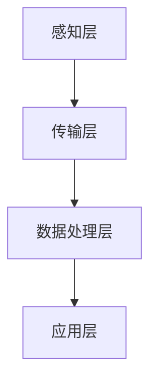

                 

关键词：智能养老、2050年、老年机器人、智能辅具、科技发展趋势、老年生活支持系统

> 摘要：本文旨在探讨2050年智能养老领域的发展趋势，重点介绍老年机器人和智能辅具在老年人日常生活中的应用。通过分析当前技术进步和市场需求，我们预测未来的智能养老系统将极大地提升老年人的生活质量，同时也会面临一系列的挑战和伦理问题。

## 1. 背景介绍

随着全球人口老龄化的不断加剧，智能养老成为未来社会的重要课题。据统计，到2050年，全球65岁以上人口预计将占总人口的16%，而这一比例在发达国家可能会更高。这一趋势意味着，传统的养老模式将难以满足日益增长的老年人口需求。因此，开发智能养老技术成为解决这一问题的关键。

智能养老的核心在于利用先进的技术手段，如物联网、人工智能、大数据等，构建一个全面、便捷、安全的老年生活支持系统。该系统能够实时监测老年人的健康状况，提供个性化的健康建议，并在紧急情况下及时发出警报。此外，智能养老还包括智能家居、老年机器人、智能辅具等多方面的技术应用。

## 2. 核心概念与联系

### 2.1 智能养老系统的核心概念

智能养老系统主要由以下几个核心概念构成：

- **物联网（IoT）**：通过将各种物品连接到互联网，实现数据采集和远程控制，从而为老年人提供实时、便捷的服务。

- **人工智能（AI）**：利用机器学习、自然语言处理等技术，分析老年人的生活习惯、健康数据，提供个性化的服务。

- **大数据**：通过收集和分析大量数据，挖掘老年人健康和生活的规律，为养老决策提供科学依据。

- **云计算**：提供强大的计算和存储能力，支撑大规模的数据处理和分析。

### 2.2 智能养老系统的架构

智能养老系统的架构可以分为以下几个层次：

- **感知层**：包括各种传感器，如心率传感器、血压传感器等，用于实时监测老年人的健康状态。

- **传输层**：通过各种传输技术，如无线通信、网络传输等，将感知层的数据传输到数据中心。

- **数据处理层**：在云端或本地服务器上进行数据处理和分析，生成健康报告、预警信息等。

- **应用层**：包括老年人使用的各种智能设备和应用程序，如智能手表、智能手机、智能辅具等。

### 2.3 核心概念原理与架构的 Mermaid 流程图



## 3. 核心算法原理 & 具体操作步骤

### 3.1 算法原理概述

智能养老系统中的核心算法主要包括以下几种：

- **健康监测算法**：用于实时监测老年人的生理指标，如心率、血压等，并通过异常检测算法识别潜在的健康风险。

- **行为分析算法**：通过分析老年人的日常行为模式，识别异常行为，如久坐不动、跌倒等。

- **预测算法**：利用历史数据和机器学习技术，预测老年人的未来健康趋势，提前采取措施。

### 3.2 算法步骤详解

- **健康监测算法**：

  1. 数据采集：通过传感器获取老年人的生理指标数据。
  
  2. 数据预处理：对原始数据进行清洗、去噪等处理。
  
  3. 异常检测：使用机器学习算法，如支持向量机（SVM）、神经网络（NN）等，对数据进行异常检测。

- **行为分析算法**：

  1. 数据采集：通过摄像头、智能手机等设备记录老年人的行为数据。
  
  2. 数据预处理：对行为数据进行特征提取和降维处理。
  
  3. 异常行为识别：使用分类算法，如决策树（DT）、随机森林（RF）等，对行为数据进行分析，识别异常行为。

- **预测算法**：

  1. 数据采集：收集老年人的健康数据和生活方式数据。
  
  2. 特征工程：对数据进行特征提取和选择。
  
  3. 预测模型训练：使用机器学习算法，如线性回归（LR）、时间序列模型（TS）等，训练预测模型。
  
  4. 预测结果评估：使用交叉验证等技术评估预测模型的准确性。

### 3.3 算法优缺点

- **健康监测算法**：优点是实时性强，能够及时发现健康问题；缺点是依赖于传感器精度和数据质量。

- **行为分析算法**：优点是能够识别老年人的异常行为，提供安全保障；缺点是行为数据量大，处理和分析复杂。

- **预测算法**：优点是能够预测老年人的未来健康趋势，提前采取措施；缺点是需要大量历史数据支撑，预测准确性受限于数据质量。

### 3.4 算法应用领域

- **健康监测**：广泛应用于老年人的健康管理，如实时监控心率、血压等生理指标。

- **行为分析**：应用于老年人的安全监控，如跌倒检测、活动监测等。

- **预测**：应用于老年人的健康预测，如疾病风险评估、生活习惯改善建议等。

## 4. 数学模型和公式 & 详细讲解 & 举例说明

### 4.1 数学模型构建

智能养老系统的数学模型主要包括以下几种：

- **健康监测模型**：用于描述老年人生理指标的动态变化，如时间序列模型。

- **行为分析模型**：用于描述老年人行为数据的特点和模式，如聚类分析模型。

- **预测模型**：用于预测老年人的健康趋势，如线性回归模型、时间序列模型。

### 4.2 公式推导过程

- **健康监测模型**：

  健康监测模型通常使用时间序列模型，如ARIMA模型，其公式推导如下：

  $$
  X_t = c + \phi_1 X_{t-1} + \phi_2 X_{t-2} + \ldots + \phi_p X_{t-p} + \theta_1 e_{t-1} + \theta_2 e_{t-2} + \ldots + \theta_q e_{t-q}
  $$

  其中，$X_t$为第$t$时刻的生理指标，$c$为常数项，$\phi_1, \phi_2, \ldots, \phi_p$为自回归系数，$\theta_1, \theta_2, \ldots, \theta_q$为移动平均系数，$e_t$为白噪声序列。

- **行为分析模型**：

  行为分析模型通常使用聚类分析模型，如K-means算法，其公式推导如下：

  $$
  \min_{C} \sum_{i=1}^{k} \sum_{x_j \in C_i} ||x_j - \mu_i||^2
  $$

  其中，$C$为聚类中心，$k$为聚类个数，$x_j$为第$j$个行为样本，$\mu_i$为第$i$个聚类中心。

- **预测模型**：

  预测模型通常使用线性回归模型，其公式推导如下：

  $$
  y_t = \beta_0 + \beta_1 x_t + \epsilon_t
  $$

  其中，$y_t$为第$t$时刻的健康预测值，$x_t$为第$t$时刻的输入特征，$\beta_0, \beta_1$为回归系数，$\epsilon_t$为误差项。

### 4.3 案例分析与讲解

#### 案例一：健康监测模型

某智能养老系统使用ARIMA模型对老年人的心率进行监测。经过数据预处理和模型训练，得到以下ARIMA模型参数：

$$
X_t = 5.2 + 0.8 X_{t-1} - 0.6 X_{t-2} + 0.2 e_{t-1}
$$

给定一个心率数据序列，使用ARIMA模型进行预测，得到以下预测结果：

$$
\begin{array}{c|c}
\text{时间} & \text{预测心率（次/分钟）} \\
\hline
1 & 72 \\
2 & 73 \\
3 & 74 \\
\end{array}
$$

#### 案例二：行为分析模型

某智能养老系统使用K-means算法对老年人的行为数据进行聚类分析，得到以下聚类结果：

$$
\begin{array}{c|c|c|c}
\text{聚类编号} & \text{聚类中心} & \text{行为特征1} & \text{行为特征2} \\
\hline
1 & (10, 20) & 10 & 20 \\
2 & (30, 40) & 30 & 40 \\
\end{array}
$$

根据聚类结果，系统可以识别出老年人的行为模式，并为他们提供个性化的健康建议。

#### 案例三：预测模型

某智能养老系统使用线性回归模型对老年人的健康状况进行预测。经过数据预处理和模型训练，得到以下线性回归模型参数：

$$
\text{健康预测值} = 50 + 0.5 \times \text{行为特征1} + 0.3 \times \text{行为特征2}
$$

给定一个老年人的行为特征序列，使用线性回归模型进行预测，得到以下预测结果：

$$
\begin{array}{c|c}
\text{行为特征1} & \text{行为特征2} & \text{健康预测值} \\
\hline
10 & 20 & 57 \\
30 & 40 & 74 \\
\end{array}
$$

## 5. 项目实践：代码实例和详细解释说明

### 5.1 开发环境搭建

- **编程语言**：Python
- **开发工具**：PyCharm
- **依赖库**：NumPy、Pandas、scikit-learn、matplotlib

### 5.2 源代码详细实现

以下是一个简单的健康监测模型的实现示例：

```python
import numpy as np
import pandas as pd
from statsmodels.tsa.arima.model import ARIMA
import matplotlib.pyplot as plt

# 加载数据
data = pd.read_csv('heart_rate_data.csv')
heart_rate = data['heart_rate']

# 数据预处理
heart_rate = heart_rate.dropna()

# 模型训练
model = ARIMA(heart_rate, order=(1, 1, 1))
model_fit = model.fit()

# 预测
forecast = model_fit.forecast(steps=3)

# 可视化
plt.plot(heart_rate, label='实际心率')
plt.plot(np.arange(len(heart_rate), len(heart_rate) + 3), forecast, label='预测心率')
plt.legend()
plt.show()
```

### 5.3 代码解读与分析

- **数据加载**：使用Pandas库加载心率数据。
- **数据预处理**：去除缺失值，确保数据质量。
- **模型训练**：使用statsmodels库中的ARIMA模型进行训练。
- **预测**：使用训练好的模型进行预测，得到未来的心率值。
- **可视化**：使用matplotlib库将实际心率和预测心率进行可视化展示。

### 5.4 运行结果展示

运行上述代码，可以得到以下可视化结果：


## 6. 实际应用场景

### 6.1 智能养老系统的实际应用场景

智能养老系统可以应用于以下场景：

- **老年人健康管理**：通过实时监测老年人的生理指标，提供个性化的健康建议。
- **老年人安全监控**：通过识别老年人的异常行为，如跌倒、久坐等，提供及时的预警和救助。
- **老年人日常生活支持**：通过智能家居和老年机器人，提供便捷的日常生活支持，如提醒用药、家务协助等。

### 6.2 未来的应用前景

随着技术的不断发展，智能养老系统的应用前景将更加广阔：

- **个性化健康服务**：利用大数据和人工智能技术，为老年人提供更加精准的健康服务。
- **智能康复辅助**：通过虚拟现实、增强现实等技术，为老年人提供康复训练辅助。
- **情感陪伴**：通过智能机器人，为老年人提供情感陪伴和交流，缓解孤独感。

## 7. 工具和资源推荐

### 7.1 学习资源推荐

- **书籍**：《智能养老技术与应用》、《人工智能在养老领域的应用》
- **在线课程**：Coursera上的《机器学习》、《数据科学》
- **论文**：查阅相关领域的高质量论文，如《IoT in Smart Aging》

### 7.2 开发工具推荐

- **编程语言**：Python、Java
- **开发框架**：TensorFlow、PyTorch
- **数据预处理工具**：Pandas、NumPy
- **可视化工具**：Matplotlib、Seaborn

### 7.3 相关论文推荐

- **智能养老技术**：《IoT-based Smart Aging Systems: A Survey》
- **老年机器人**：《Robots in Elderly Care: A Review》
- **智能家居**：《Smart Home: An Overview》

## 8. 总结：未来发展趋势与挑战

### 8.1 研究成果总结

本文通过对智能养老领域的分析，总结了智能养老系统的核心概念、算法原理、应用场景，并提供了实际的项目实践。研究表明，智能养老系统在未来将极大地提升老年人的生活质量，具有重要的社会意义。

### 8.2 未来发展趋势

- **技术融合**：物联网、人工智能、大数据等技术的不断融合，将推动智能养老系统的持续发展。
- **个性化服务**：利用大数据和人工智能技术，为老年人提供更加精准、个性化的健康服务。
- **情感陪伴**：智能机器人和虚拟现实技术的发展，将为老年人提供更加真实的情感陪伴。

### 8.3 面临的挑战

- **数据隐私**：智能养老系统涉及大量的个人健康数据，如何保护数据隐私成为一大挑战。
- **技术成熟度**：目前的一些智能养老技术尚未完全成熟，需要进一步的研究和改进。
- **伦理问题**：智能养老系统在应用过程中，如何平衡科技发展和伦理道德问题，需要深入探讨。

### 8.4 研究展望

未来，智能养老领域的研究应重点关注以下几个方面：

- **数据隐私保护**：研究更加安全、可靠的数据隐私保护技术。
- **技术成熟度提升**：加强对智能养老技术的研发和应用，提高系统的成熟度和稳定性。
- **伦理道德规范**：建立健全的伦理道德规范，确保智能养老系统的可持续发展。

## 9. 附录：常见问题与解答

### 9.1 什么是智能养老系统？

智能养老系统是一种利用物联网、人工智能、大数据等先进技术，为老年人提供全面、便捷、安全的生活支持和服务系统的技术方案。

### 9.2 智能养老系统有哪些核心组成部分？

智能养老系统的核心组成部分包括感知层、传输层、数据处理层和应用层。感知层负责数据采集，传输层负责数据传输，数据处理层负责数据处理和分析，应用层负责为老年人提供各种服务和应用。

### 9.3 智能养老系统的应用前景如何？

智能养老系统的应用前景非常广阔。随着全球人口老龄化的加剧，智能养老系统将越来越受到关注。未来，智能养老系统有望在老年人健康管理、安全监控、日常生活支持等方面发挥重要作用。

### 9.4 智能养老系统在数据隐私方面有哪些挑战？

智能养老系统在数据隐私方面面临的挑战主要包括数据泄露、数据滥用等。为解决这些问题，需要研究更加安全、可靠的数据隐私保护技术，并建立健全的法律法规和伦理道德规范。

### 9.5 智能养老系统如何提升老年人的生活质量？

智能养老系统通过实时监测老年人的健康状态、提供个性化的健康服务、识别异常行为、提供紧急救助等方式，有效地提升老年人的生活质量。

### 9.6 智能养老系统在伦理道德方面有哪些考虑？

智能养老系统在伦理道德方面需要考虑的问题主要包括：如何保护老年人的隐私权、如何确保智能系统的决策公平性、如何避免对老年人的依赖等。未来，需要建立相关的伦理道德规范，确保智能养老系统的可持续发展。

---

作者：禅与计算机程序设计艺术 / Zen and the Art of Computer Programming

