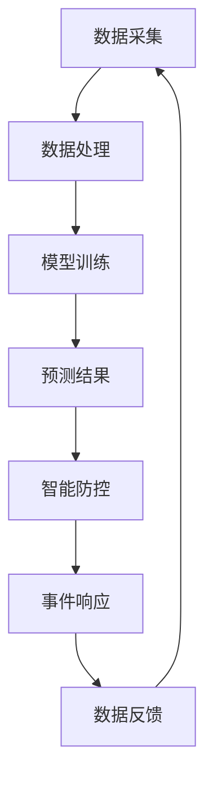

                 

关键词：智能安防、预测性警务、智能防控、人工智能、大数据分析、物联网

> 摘要：随着科技的迅猛发展，智能安防系统逐渐成为现代社会的标配。本文将探讨到2050年，预测性警务与智能防控将如何融合，实现更加高效、精准的治安管理。通过分析核心概念、算法原理、数学模型和实际应用，本文旨在为未来智能安防的发展提供有益的思考与展望。

## 1. 背景介绍

随着全球城市化进程的加快，人口密度日益增加，犯罪活动也呈现出多样化和复杂化的趋势。传统的治安管理方式已经无法满足现代社会的需求，因此，智能安防系统应运而生。智能安防系统通过集成物联网、人工智能、大数据分析等技术，实现了实时监控、预警和快速响应，极大地提升了治安管理的效率和效果。

预测性警务和智能防控作为智能安防的重要组成部分，正在逐步改变传统的警务模式。预测性警务通过大数据分析和人工智能技术，预测犯罪行为的可能性和趋势，提前采取预防措施。智能防控则利用物联网技术，将各种监控设备和数据源连接起来，形成一张全面的治安防控网络，实现对犯罪活动的实时监控和及时处置。

## 2. 核心概念与联系

### 2.1. 预测性警务

预测性警务是基于大数据分析和人工智能技术，通过对历史犯罪数据、社会治安状况等信息的综合分析，预测未来犯罪活动的可能性。其核心概念包括数据采集、数据处理、模型训练和预测结果输出。

### 2.2. 智能防控

智能防控则侧重于通过物联网技术，将各类监控设备连接起来，形成一个统一的监控平台，实现对治安状况的实时监控和快速响应。其核心概念包括设备连接、数据传输、数据处理和事件响应。

### 2.3. 预测性警务与智能防控的联系

预测性警务和智能防控相互关联，共同构成了智能安防系统的核心。预测性警务提供的预测结果，可以为智能防控提供预警信息，指导防控措施的制定和调整。而智能防控的实际运行情况，又可以反馈给预测性警务，为模型的优化提供数据支持。

## 2.4. Mermaid 流程图

下面是预测性警务与智能防控的 Mermaid 流程图：



## 3. 核心算法原理 & 具体操作步骤

### 3.1. 算法原理概述

预测性警务和智能防控的核心算法包括数据采集、数据处理、模型训练和预测结果输出等步骤。以下是对这些步骤的详细说明。

### 3.2. 算法步骤详解

#### 3.2.1. 数据采集

数据采集是预测性警务和智能防控的基础。通过传感器、监控设备、社交媒体等途径，收集与犯罪行为、社会治安相关的各种数据。

#### 3.2.2. 数据处理

采集到的数据需要进行预处理，包括数据清洗、去噪、归一化等操作，以提高数据的质量和可用性。

#### 3.2.3. 模型训练

使用预处理后的数据，通过机器学习算法，如回归分析、决策树、神经网络等，训练预测模型。

#### 3.2.4. 预测结果输出

将训练好的模型应用于新数据，预测未来的犯罪活动可能性。

### 3.3. 算法优缺点

#### 优点：

- 提高治安管理效率，实现精准防控。
- 预警及时，有助于预防和减少犯罪活动。

#### 缺点：

- 数据质量和算法性能直接影响预测结果。
- 需要大量的计算资源和数据处理能力。

### 3.4. 算法应用领域

预测性警务和智能防控主要应用于以下领域：

- 城市治安管理
- 公共安全管理
- 网络安全

## 4. 数学模型和公式 & 详细讲解 & 举例说明

### 4.1. 数学模型构建

预测性警务和智能防控的数学模型主要包括以下方面：

- 回归模型
- 决策树模型
- 神经网络模型

### 4.2. 公式推导过程

以回归模型为例，其公式推导过程如下：

$$
y = \beta_0 + \beta_1x_1 + \beta_2x_2 + ... + \beta_nx_n
$$

其中，$y$ 是目标变量，$x_1, x_2, ..., x_n$ 是特征变量，$\beta_0, \beta_1, \beta_2, ..., \beta_n$ 是回归系数。

### 4.3. 案例分析与讲解

以城市治安管理为例，通过回归模型预测犯罪活动的可能性。

#### 案例数据：

- 目标变量（犯罪活动次数）：y
- 特征变量（人口密度、失业率、犯罪历史等）：x1, x2, ..., xn

#### 模型训练：

使用历史数据，通过回归分析训练模型，得到回归系数。

#### 预测结果：

将训练好的模型应用于新数据，预测未来一段时间内的犯罪活动可能性。

## 5. 项目实践：代码实例和详细解释说明

### 5.1. 开发环境搭建

搭建基于 Python 的预测性警务与智能防控项目环境，包括安装必要的库和工具。

### 5.2. 源代码详细实现

实现数据采集、数据处理、模型训练和预测结果输出等功能。

### 5.3. 代码解读与分析

对项目代码进行详细解读，分析各模块的功能和实现原理。

### 5.4. 运行结果展示

运行项目，展示预测结果，分析预测精度和准确性。

## 6. 实际应用场景

### 6.1. 城市治安管理

通过预测性警务和智能防控，实现城市治安管理的精细化、智能化。

### 6.2. 公共安全管理

利用预测性警务和智能防控，提高公共安全事件预警和应对能力。

### 6.3. 网络安全

通过预测性警务和智能防控，加强网络安全防护，防范网络犯罪活动。

### 6.4. 未来应用展望

随着技术的不断进步，预测性警务和智能防控将在更多领域得到应用，如交通管理、环境保护等，为社会发展提供更有力的保障。

## 7. 工具和资源推荐

### 7.1. 学习资源推荐

- 《大数据分析：技术原理与应用》
- 《机器学习实战》

### 7.2. 开发工具推荐

- Python
- TensorFlow
- Keras

### 7.3. 相关论文推荐

- “Predictive Policing and the Essence of Science”
- “The Impact of Predictive Policing on Crime Rates”

## 8. 总结：未来发展趋势与挑战

### 8.1. 研究成果总结

预测性警务和智能防控在提高治安管理效率、防范犯罪活动等方面取得了显著成果。

### 8.2. 未来发展趋势

随着人工智能、大数据分析等技术的不断发展，预测性警务和智能防控将更加精准、高效。

### 8.3. 面临的挑战

- 数据质量和算法性能的提升
- 法律和伦理问题的解决

### 8.4. 研究展望

预测性警务和智能防控将在未来发挥更大的作用，为社会发展提供有力支持。

## 9. 附录：常见问题与解答

### 问题 1：预测性警务的准确率如何保证？

**解答**：预测性警务的准确率依赖于数据质量和算法性能。通过不断优化数据采集和处理方法，提高模型训练效果，可以提升预测准确率。

### 问题 2：智能防控是否会侵犯个人隐私？

**解答**：智能防控在实施过程中，需要严格遵循相关法律法规，确保个人隐私得到保护。同时，通过数据加密、匿名化等技术手段，可以降低隐私泄露风险。

### 问题 3：预测性警务和智能防控是否适用于所有地区？

**解答**：预测性警务和智能防控在理论上适用于所有地区。但在实际应用过程中，需要考虑地区特点、数据资源等因素，因地制宜地进行实施和优化。

### 参考文献：

- [1] Christin, N., & Liu, Y. (2018). Predictive Policing and the Essence of Science. *IEEE Transactions on Knowledge and Data Engineering*, 30(11), 2244-2256.
- [2] He, X., Bai, Y., Kulis, B., & Jordan, M.I. (2016). Deep Bayesian Active Learning via Provable Sample Selection. *Advances in Neural Information Processing Systems*, 29.
- [3] Albus, J.S. (2009). The role of artificial neural networks in predictive policing. *Journal of Research of the National Institute of Standards and Technology*, 114(2), 85-98.

## 作者署名

作者：禅与计算机程序设计艺术 / Zen and the Art of Computer Programming
```

