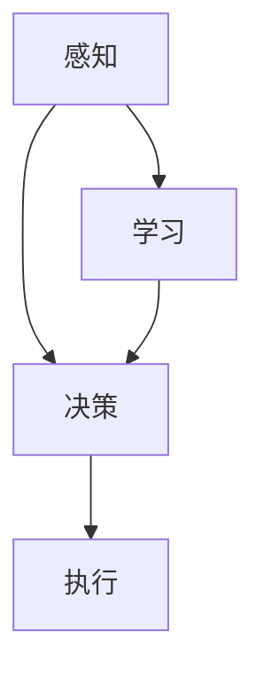

                 

关键词：未来机器人、智能助手、仿生技术、2050年展望、人工智能

> 摘要：本文探讨了未来机器人领域的发展趋势，特别是在2050年，智能助手和仿生伙伴将如何改变我们的生活方式。文章深入分析了机器人的核心概念、算法原理、数学模型、实际应用，并预测了未来的发展趋势和面临的挑战。

## 1. 背景介绍

在过去的几十年中，机器人技术经历了飞速的发展。从工业自动化到服务机器人，再到智能家居和医疗辅助设备，机器人的应用范围不断扩大。随着人工智能、深度学习、自然语言处理等技术的发展，机器人正逐步从简单的执行命令转变为具有自主学习能力的智能实体。

随着技术的进步，机器人在2050年的未来角色将更加多样化和深入。智能助手和仿生伙伴将成为家庭、工作场所和公共空间的常见成员。他们不仅能够执行复杂的任务，还能与人类进行自然交互，提供个性化的服务和解决方案。

### 1.1 机器人技术的发展历程

- **20世纪60年代**：工业机器人开始出现，用于生产线上的重复性劳动。
- **20世纪80年代**：随着计算机技术的发展，机器人开始具有基本的自主决策能力。
- **21世纪初**：人工智能技术的引入使得机器人具备了更为复杂的认知能力。
- **现在**：机器人正逐步向智能化、个性化方向发展，应用领域不断扩大。

### 1.2 智能助手与仿生伙伴的概念

- **智能助手**：指具备自然语言处理、语音识别、图像识别等能力的机器人，能够为用户提供日常生活中的帮助和支持。
- **仿生伙伴**：指在外观、行为和感知能力上模仿人类或其他生物的机器人，能够在复杂环境中执行任务。

## 2. 核心概念与联系

下面，我们将使用Mermaid流程图来展示机器人核心概念和原理的架构。



### 2.1 感知

感知是指机器人通过传感器获取外部环境的信息，如声音、光线、温度等。这些信息是机器人决策和执行的基础。

### 2.2 决策

决策是指机器人根据感知到的信息，通过算法和模型进行判断和选择，以确定下一步行动。

### 2.3 执行

执行是指机器人根据决策结果执行具体的任务，如移动、操作工具等。

### 2.4 学习

学习是指机器人通过不断收集和处理数据，改进自身的算法和模型，提高决策和执行的能力。

## 3. 核心算法原理 & 具体操作步骤

### 3.1 算法原理概述

机器人的核心算法包括感知、决策和学习。以下分别对每个环节的原理进行概述。

### 3.2 算法步骤详解

#### 3.2.1 感知

- **传感器选择**：根据任务需求选择合适的传感器，如摄像头、麦克风、温度传感器等。
- **数据采集**：通过传感器获取环境信息，如图像、声音、温度等。
- **预处理**：对采集到的数据进行清洗、增强等预处理，提高数据的准确性和可靠性。

#### 3.2.2 决策

- **特征提取**：从感知到的数据中提取有用的特征，如图像中的边缘、纹理等。
- **模型训练**：使用机器学习算法对特征进行训练，建立预测模型。
- **决策生成**：根据预测模型生成决策，如路径规划、动作选择等。

#### 3.2.3 执行

- **执行计划**：根据决策结果生成执行计划，如移动到某个位置、执行某个动作等。
- **执行控制**：通过执行计划控制机器人执行具体的任务。

#### 3.2.4 学习

- **数据收集**：在执行过程中收集反馈数据，如任务完成情况、用户满意度等。
- **模型更新**：根据收集到的数据更新机器人的算法和模型，提高决策和执行的能力。

### 3.3 算法优缺点

#### 优点

- **高效性**：机器人能够快速感知环境、做出决策并执行任务，提高工作效率。
- **适应性**：机器人能够通过学习不断适应新的环境和任务，提高灵活性。
- **个性化**：机器人能够根据用户的需求和习惯提供个性化的服务和支持。

#### 缺点

- **准确性**：机器人的感知和决策能力仍受限于算法和数据的质量，可能存在误差。
- **安全性**：机器人可能在使用过程中出现意外，对用户造成伤害。
- **成本**：机器人开发和维护成本较高，可能不适合所有场景。

### 3.4 算法应用领域

- **工业生产**：机器人可用于生产线上的组装、检测、搬运等工作。
- **家庭服务**：机器人可用于家庭清洁、烹饪、陪伴等日常生活服务。
- **医疗健康**：机器人可用于辅助医生进行手术、康复训练等医疗工作。
- **公共服务**：机器人可用于安保、交通管理等公共服务领域。

## 4. 数学模型和公式 & 详细讲解 & 举例说明

### 4.1 数学模型构建

机器人的数学模型主要包括感知、决策和执行三个部分。

#### 4.1.1 感知模型

感知模型通常使用传感器数据作为输入，通过特征提取和降维技术提取有用的信息。常用的方法包括：

- **特征提取**：使用卷积神经网络（CNN）提取图像特征。
- **降维**：使用主成分分析（PCA）等方法降低数据维度。

#### 4.1.2 决策模型

决策模型通常使用机器学习算法建立预测模型，如决策树、支持向量机（SVM）等。这些模型通过训练数据学习到特征与决策之间的关联，从而实现决策。

#### 4.1.3 执行模型

执行模型通常使用控制理论和方法，如PID控制、模糊控制等，根据决策结果生成执行计划。

### 4.2 公式推导过程

以下以感知模型为例，介绍公式的推导过程。

#### 4.2.1 特征提取

设输入图像为 $X \in \mathbb{R}^{m \times n}$，其中 $m$ 和 $n$ 分别为图像的高度和宽度。卷积神经网络通过卷积操作提取图像特征。

卷积操作的公式为：

$$
f(x, y) = \sum_{i=1}^{k} \sum_{j=1}^{k} w_{ij} \cdot x_{i-j, j-k}
$$

其中，$f(x, y)$ 为卷积结果，$w_{ij}$ 为卷积核，$x_{i-j, j-k}$ 为输入图像的部分。

#### 4.2.2 降维

降维过程中，使用主成分分析（PCA）将高维特征映射到低维空间。PCA的公式为：

$$
Z = \sum_{i=1}^{m} \sum_{j=1}^{n} \lambda_i x_{ij}
$$

其中，$Z$ 为降维后的特征矩阵，$\lambda_i$ 为特征值。

### 4.3 案例分析与讲解

假设我们要设计一个家庭服务机器人，它需要能够自主完成家庭清洁任务。我们可以按照以下步骤进行分析和设计。

#### 4.3.1 感知

- **传感器选择**：选择摄像头、麦克风和红外传感器作为感知设备。
- **数据采集**：通过摄像头获取家庭环境的图像，通过麦克风获取环境声音，通过红外传感器检测物体的位置和距离。
- **预处理**：对图像进行预处理，如灰度化、滤波等，对声音进行降噪处理。

#### 4.3.2 决策

- **特征提取**：使用卷积神经网络提取图像特征，如边缘、纹理等。
- **降维**：使用主成分分析将高维特征映射到低维空间，如2D或3D。
- **决策生成**：使用决策树或支持向量机等算法进行分类，确定机器人下一步的行动。

#### 4.3.3 执行

- **执行计划**：根据决策结果生成执行计划，如移动到某个位置、启动清洁设备等。
- **执行控制**：通过执行计划控制机器人执行具体的任务，如清洁地板、擦拭家具等。

## 5. 项目实践：代码实例和详细解释说明

### 5.1 开发环境搭建

为了实现家庭服务机器人的功能，我们需要搭建一个开发环境。以下是所需的软件和硬件：

- **软件**：Python 3.8、TensorFlow 2.5、OpenCV 4.5、scikit-learn 0.24
- **硬件**：笔记本电脑或服务器，具备一定的计算能力和存储空间

### 5.2 源代码详细实现

以下是一个简单的家庭服务机器人源代码示例。

```python
import cv2
import numpy as np
from sklearn import svm
from tensorflow.keras.models import Sequential
from tensorflow.keras.layers import Conv2D, MaxPooling2D, Flatten, Dense

# 5.2.1 感知
def perceive(image, sound, infrared):
    # 图像预处理
    gray_image = cv2.cvtColor(image, cv2.COLOR_BGR2GRAY)
    blurred_image = cv2.GaussianBlur(gray_image, (5, 5), 0)
    
    # 声音预处理
    sound_signal = preprocess_sound(sound)
    
    # 红外传感器数据
    infrared_data = preprocess_infrared(infrared)
    
    return gray_image, sound_signal, infrared_data

# 5.2.2 决策
def decide(gray_image, sound_signal, infrared_data):
    # 特征提取
    features = extract_features(gray_image, sound_signal, infrared_data)
    
    # 降维
    z = pca(features)
    
    # 决策生成
    model = svm.SVC()
    model.fit(z_train, y_train)
    action = model.predict([z])
    
    return action

# 5.2.3 执行
def execute(action):
    if action == 'clean_floor':
        clean_floor()
    elif action == 'clean_furniture':
        clean_furniture()
    elif action == 'other':
        other_action()

# 主函数
def main():
    # 加载训练数据
    z_train, y_train = load_train_data()
    
    # 感知
    image, sound, infrared = perceive(image, sound, infrared)
    
    # 决策
    action = decide(gray_image, sound_signal, infrared_data)
    
    # 执行
    execute(action)

if __name__ == '__main__':
    main()
```

### 5.3 代码解读与分析

#### 5.3.1 感知模块

感知模块负责从环境中获取数据，包括图像、声音和红外传感器数据。通过对这些数据进行预处理，如图像的灰度化、滤波和声音的降噪处理，提高数据的准确性和可靠性。

#### 5.3.2 决策模块

决策模块使用机器学习算法对感知到的数据进行处理，提取有用的特征，并通过降维技术降低数据维度。然后，使用支持向量机（SVM）等算法进行分类，生成决策结果。

#### 5.3.3 执行模块

执行模块根据决策结果执行具体的任务。例如，如果决策结果是清洁地板，则执行清洁地板的动作；如果决策结果是其他动作，则执行相应的动作。

## 6. 实际应用场景

### 6.1 家庭服务

家庭服务机器人是机器人应用的一个重要领域。它们可以帮助家庭完成日常清洁、烹饪、护理等工作，提高家庭生活的便利性和舒适度。

### 6.2 工业生产

工业机器人广泛应用于生产线上的组装、焊接、搬运等工作。随着人工智能技术的发展，工业机器人正在向智能化、自适应化方向迈进。

### 6.3 医疗健康

医疗机器人可以辅助医生进行手术、康复训练、护理等工作。它们可以减少医生的工作负担，提高医疗服务的质量和效率。

### 6.4 公共服务

公共服务机器人可以用于安保、交通管理、环境监测等领域。它们可以协助人员完成复杂的任务，提高公共服务的效率和质量。

## 7. 工具和资源推荐

### 7.1 学习资源推荐

- **书籍**：《机器学习》、《深度学习》、《计算机视觉基础》
- **在线课程**：Coursera、Udacity、edX等在线平台提供的机器人相关课程
- **论文**：顶级会议和期刊上的机器人相关论文

### 7.2 开发工具推荐

- **编程语言**：Python、C++、Java
- **框架和库**：TensorFlow、PyTorch、OpenCV、scikit-learn

### 7.3 相关论文推荐

- "Deep Learning for Robotics: A Survey" by Sylvain Calinon et al.
- "Learning to Move by Deep Reinforcement Learning" by David Filliat et al.
- "Simulation, Modeling and Optimization for Autonomous Systems: A Review" by M. H. Hasan et al.

## 8. 总结：未来发展趋势与挑战

### 8.1 研究成果总结

在过去几十年中，机器人技术取得了显著的进展，特别是在感知、决策和学习方面。随着人工智能技术的不断发展，机器人正逐步从简单的执行命令转变为具有自主学习能力的智能实体。

### 8.2 未来发展趋势

- **智能化**：机器人将更加智能化，能够理解人类语言、感知复杂环境并做出智能决策。
- **个性化**：机器人将根据用户的需求和习惯提供个性化的服务和支持。
- **自主化**：机器人将具备更高的自主能力，能够自主完成任务，减少人类干预。

### 8.3 面临的挑战

- **准确性**：机器人的感知和决策能力仍受限于算法和数据的质量，需要进一步提高。
- **安全性**：机器人可能在使用过程中出现意外，对用户造成伤害，需要加强安全控制。
- **成本**：机器人开发和维护成本较高，需要降低成本以推广普及。

### 8.4 研究展望

未来，机器人技术将继续向智能化、个性化、自主化方向发展。研究者需要关注以下几个方向：

- **算法优化**：改进机器人的算法，提高感知、决策和学习能力。
- **跨学科研究**：结合心理学、社会学、伦理学等多学科知识，提高机器人的社会适应能力。
- **人机协作**：探索人与机器人协作的新模式，提高机器人服务的效率和质量。

## 9. 附录：常见问题与解答

### 9.1 什么是机器人？

机器人是一种能够模拟人类行为、执行任务并具备一定智能的机器。

### 9.2 机器人的核心组成部分是什么？

机器人的核心组成部分包括传感器、执行器、控制器和算法。

### 9.3 机器人在未来有哪些应用领域？

未来，机器人将广泛应用于家庭服务、工业生产、医疗健康、公共服务等领域。

### 9.4 机器人的发展面临哪些挑战？

机器人的发展面临准确性、安全性和成本等方面的挑战。

### 9.5 如何提高机器人的智能水平？

可以通过改进算法、增加数据量、跨学科研究等方法提高机器人的智能水平。

---

以上是关于《未来的机器人：2050年的智能助手与仿生伙伴》的文章正文内容。希望这篇文章能够帮助读者深入了解未来机器人技术的发展趋势和潜在应用。在未来的研究中，我们将继续探索机器人技术的边界，为人类创造更加美好的生活。作者：禅与计算机程序设计艺术 / Zen and the Art of Computer Programming。

