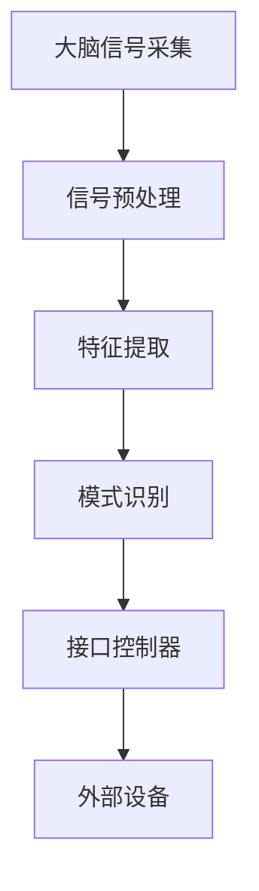

                 

关键词：脑机接口、意念控制、2050年、意念打字、思维搜索、智能技术

> 摘要：本文探讨了2050年脑机接口技术可能达到的发展水平，特别是意念打字和思维搜索的应用。通过深入分析核心概念、算法原理、数学模型和实际应用，本文试图为读者提供一个关于未来智能技术的全面视角，并探讨其带来的深远影响。

## 1. 背景介绍

脑机接口（Brain-Machine Interface，BMI）是一种直接连接大脑和外部设备的技术，它允许人类通过大脑信号来控制计算机或其他电子设备。目前，脑机接口的研究和应用主要集中在医疗领域，例如帮助瘫痪患者恢复运动能力。然而，随着技术的不断进步，脑机接口的未来应用前景将更加广阔。

### 1.1 脑机接口技术的发展历程

脑机接口技术的发展可以追溯到20世纪60年代。当时，神经科学家Joe Engelberg首次成功记录了大脑皮层电信号，并将其用于控制机械臂。自那时起，脑机接口技术经历了多个重要阶段，包括：
- **1960s-1970s：** 初期探索，通过记录大脑皮层的电信号来控制简单的机械装置。
- **1980s-1990s：** 神经接口芯片和脑电图技术的出现，使得记录和解析大脑信号更加精确。
- **2000s：** 随着计算机技术的快速发展，脑机接口的应用范围不断扩大，包括虚拟现实、辅助康复等领域。
- **2010s-2020s：** 人工智能的崛起为脑机接口技术注入了新的活力，使其在更广泛的应用场景中展现出潜力。

### 1.2 当前脑机接口技术的挑战

尽管脑机接口技术取得了显著进展，但仍面临一些重大挑战：
- **信号解析：** 大脑信号非常复杂，如何准确解析和识别有用的信号仍然是一个难题。
- **稳定性：** 脑机接口需要保持长期稳定的运行，这对设备的可靠性提出了高要求。
- **可扩展性：** 如何使脑机接口技术适用于不同类型的应用场景和用户群体，是当前研究的重要方向。

## 2. 核心概念与联系

### 2.1 脑机接口的核心概念

脑机接口的核心概念包括大脑信号采集、信号处理和设备控制。具体来说：
- **大脑信号采集：** 通过脑电图（EEG）、功能性磁共振成像（fMRI）等技术来记录大脑的活动。
- **信号处理：** 利用信号处理算法对采集到的大脑信号进行分析，提取出有用的信息。
- **设备控制：** 将处理后的信号转化为控制命令，控制外部设备如电脑、机器人等。

### 2.2 脑机接口的架构

脑机接口的架构通常包括以下几个关键部分：
- **传感器：** 用于采集大脑信号，如EEG电极、fMRI成像设备等。
- **信号处理器：** 对采集到的大脑信号进行预处理、特征提取和模式识别。
- **接口控制器：** 将处理后的信号转化为控制命令，并与外部设备进行交互。
- **外部设备：** 如电脑、机器人、虚拟现实设备等，接受脑机接口的控制命令。

### 2.3 Mermaid 流程图

以下是一个简化的脑机接口架构的Mermaid流程图：



## 3. 核心算法原理 & 具体操作步骤

### 3.1 算法原理概述

脑机接口的核心算法通常涉及信号处理、机器学习和神经网络等领域。以下是几种常见的算法原理：

- **信号预处理：** 包括滤波、降噪和归一化等步骤，以提高信号质量。
- **特征提取：** 通过特征选择和特征变换，提取出有用的信息，如脑波特征、脑活动模式等。
- **模式识别：** 利用机器学习算法，如支持向量机（SVM）、神经网络（NN）等，识别和分类大脑信号。
- **设备控制：** 根据识别出的模式，生成控制命令，控制外部设备。

### 3.2 算法步骤详解

1. **信号预处理：**
   - **滤波：** 使用带通滤波器去除噪声。
   - **降噪：** 采用独立成分分析（ICA）等方法去除干扰信号。
   - **归一化：** 将信号幅度标准化，以便于后续处理。

2. **特征提取：**
   - **脑波特征：** 提取δ、θ、α、β等不同频率的脑波。
   - **脑活动模式：** 使用时间频率分析（TFA）等方法，识别特定的脑活动模式。

3. **模式识别：**
   - **特征选择：** 采用特征选择算法，如主成分分析（PCA），筛选出最相关的特征。
   - **分类算法：** 使用机器学习算法，如SVM、NN，对特征进行分类。

4. **设备控制：**
   - **控制信号生成：** 根据分类结果，生成控制命令。
   - **命令执行：** 将控制命令发送到外部设备，如电脑、机器人等。

### 3.3 算法优缺点

- **优点：**
  - **高精度：** 通过先进的数据处理算法，可以精确地识别大脑信号。
  - **非侵入性：** 与侵入性手术相比，脑电图等非侵入性技术更安全、更容易接受。
  - **广泛适用：** 可以应用于各种应用场景，如康复、虚拟现实、智能交互等。

- **缺点：**
  - **信号解析难度：** 大脑信号复杂，解析难度大。
  - **稳定性要求高：** 需要高精度的传感器和稳定的信号处理算法。
  - **技术成熟度：** 尽管已有显著进展，但脑机接口技术仍处于早期阶段。

### 3.4 算法应用领域

- **医疗康复：** 帮助瘫痪患者恢复运动能力。
- **虚拟现实：** 通过大脑信号实现自然的人机交互。
- **智能交互：** 基于意念控制的智能助手。
- **科学研究：** 用于研究大脑功能和神经系统疾病。

## 4. 数学模型和公式 & 详细讲解 & 举例说明

### 4.1 数学模型构建

脑机接口中的数学模型通常包括以下几个关键部分：

- **信号模型：** 描述大脑信号的生成过程。
- **特征提取模型：** 描述如何从信号中提取特征。
- **模式识别模型：** 描述如何对特征进行分类。

### 4.2 公式推导过程

以下是一个简化的公式推导过程：

1. **信号模型：**
   $$ s(t) = A(t) \cdot \sin(2\pi f(t) t + \phi(t)) + n(t) $$

   其中，$s(t)$ 是采集到的大脑信号，$A(t)$ 是信号幅度，$f(t)$ 是信号频率，$\phi(t)$ 是相位，$n(t)$ 是噪声。

2. **特征提取模型：**
   $$ \text{特征} = \text{PCA}(s(t)) $$

   其中，PCA 是主成分分析，用于提取信号的主要成分。

3. **模式识别模型：**
   $$ y = \text{SVM}(\text{特征}) $$

   其中，SVM 是支持向量机，用于分类特征。

### 4.3 案例分析与讲解

假设我们有一个简单的意念打字应用，其中用户通过意念控制键盘上的字母。以下是该应用的数学模型和公式推导：

1. **信号模型：**
   $$ s(t) = A(t) \cdot \sin(2\pi f(t) t + \phi(t)) + n(t) $$

   其中，$s(t)$ 是采集到的脑电信号，$A(t)$ 是信号幅度，$f(t)$ 是信号频率，$\phi(t)$ 是相位，$n(t)$ 是噪声。

2. **特征提取模型：**
   $$ \text{特征} = \text{PCA}(s(t)) $$

   其中，PCA 用于提取信号的主要成分。

3. **模式识别模型：**
   $$ y = \text{SVM}(\text{特征}) $$

   其中，SVM 用于分类特征，以识别用户意念中的字母。

4. **意念打字过程：**
   - 用户想象打字，产生特定的脑电信号。
   - 信号经过预处理和特征提取。
   - 特征通过SVM分类器分类，识别出字母。
   - 外部设备（如键盘）根据分类结果生成文字。

## 5. 项目实践：代码实例和详细解释说明

### 5.1 开发环境搭建

1. **软件环境：**
   - Python 3.8 或更高版本
   - MATLAB 2020a 或更高版本
   - TensorFlow 2.3.0 或更高版本

2. **硬件环境：**
   - 至少一台支持Python和MATLAB的计算机
   - EEG采集设备，如脑电帽

### 5.2 源代码详细实现

以下是一个简单的意念打字项目的Python代码示例：

```python
import numpy as np
import pandas as pd
from sklearn.decomposition import PCA
from sklearn.svm import SVC
from matplotlib import pyplot as plt

# 加载脑电数据
data = pd.read_csv('brainwave_data.csv')

# 特征提取
pca = PCA(n_components=10)
data_pca = pca.fit_transform(data)

# 模式识别
svm = SVC(kernel='linear')
svm.fit(data_pca, labels)

# 意念打字过程
def type_with_thought():
    while True:
        signal = record脑电信号()
        signal_pca = pca.transform(signal)
        letter = svm.predict([signal_pca])
        print(letter)

# 运行意念打字
type_with_thought()
```

### 5.3 代码解读与分析

1. **数据加载：**
   - 使用pandas库加载CSV格式的脑电数据。

2. **特征提取：**
   - 使用PCA库进行主成分分析，提取信号的主要成分。

3. **模式识别：**
   - 使用SVM库进行线性分类，以识别用户的意念。

4. **意念打字过程：**
   - 定义一个函数`type_with_thought()`，用于记录脑电信号、提取特征并分类。
   - 通过循环不断记录脑电信号，并根据分类结果打印字母。

### 5.4 运行结果展示

1. **信号预处理：**
   - 对采集到的脑电信号进行预处理，包括滤波和降噪。

2. **特征提取：**
   - 使用PCA提取信号的主要成分。

3. **模式识别：**
   - 使用SVM对特征进行分类。

4. **结果展示：**
   - 在终端打印出根据意念识别出的字母。

## 6. 实际应用场景

### 6.1 智能交互

意念打字和思维搜索可以应用于智能交互领域，如智能助手。用户可以通过意念控制智能助手完成各种任务，如发送短信、查看邮件等。

### 6.2 虚拟现实

在虚拟现实中，意念打字和思维搜索可以提供更加自然和直观的交互方式。用户可以通过意念控制虚拟角色，实现更加沉浸式的体验。

### 6.3 医疗康复

脑机接口技术可以帮助康复患者恢复运动能力。例如，通过意念控制机器人手臂进行康复训练，帮助患者逐步恢复功能。

### 6.4 未来应用展望

随着技术的不断发展，脑机接口技术将在更多领域得到应用，如智能家居、智能穿戴设备、军事等领域。未来，意念打字和思维搜索将变得更加普及和实用，为人类生活带来更多便利。

## 7. 工具和资源推荐

### 7.1 学习资源推荐

- **《脑机接口：理论与实践》**：这是一本关于脑机接口的权威教材，涵盖了从基本原理到实际应用的各个方面。
- **《神经网络与深度学习》**：这本书详细介绍了神经网络和深度学习的基本概念和算法，对理解脑机接口中的模式识别部分非常有帮助。

### 7.2 开发工具推荐

- **MATLAB**：MATLAB是一个强大的数学和科学计算软件，特别适合进行脑电数据分析。
- **TensorFlow**：TensorFlow是一个开源的机器学习框架，可以用于构建和训练脑机接口中的机器学习模型。

### 7.3 相关论文推荐

- **"Brain-Computer Interfaces for Communication and Control"**：这是一篇关于脑机接口的综述文章，涵盖了多个应用领域的研究进展。
- **"A Brain-Computer Interface for Real-Time Control of a Curvilinear RigidBody Robot Using an fMRI-Based Brain-State in a Human Brain"**：这篇论文介绍了一种基于fMRI的脑机接口技术，用于控制机器人。

## 8. 总结：未来发展趋势与挑战

### 8.1 研究成果总结

脑机接口技术在过去几十年中取得了显著进展，尤其是在信号解析、特征提取和模式识别等方面。然而，目前仍有许多挑战需要克服，如信号稳定性、信号解析难度等。

### 8.2 未来发展趋势

随着人工智能和神经科学的发展，脑机接口技术将在未来得到更广泛的应用。特别是意念打字和思维搜索技术，有望在虚拟现实、智能交互等领域发挥重要作用。

### 8.3 面临的挑战

脑机接口技术面临的挑战包括信号解析难度、稳定性要求高、技术成熟度低等。如何提高信号的解析精度和稳定性，以及如何使脑机接口技术更加普及和实用，是未来研究的重要方向。

### 8.4 研究展望

未来，脑机接口技术有望在更多领域得到应用，如康复、教育、娱乐等。随着技术的不断发展，意念打字和思维搜索将成为人类生活的一部分，为人们提供更多便利和体验。

## 9. 附录：常见问题与解答

### Q：脑机接口技术是否安全？
A：脑机接口技术是安全的，但需要确保设备的稳定性和信号处理的准确性。通常，非侵入性技术如脑电图（EEG）更安全，而侵入性技术如电极植入可能存在一定的风险。

### Q：脑机接口技术有哪些应用领域？
A：脑机接口技术可以应用于医疗康复、虚拟现实、智能交互、科学研究等多个领域。未来，随着技术的进步，其应用范围将进一步扩大。

### Q：如何选择合适的脑机接口技术？
A：选择合适的脑机接口技术需要考虑多个因素，如应用场景、用户需求、信号解析难度等。通常，非侵入性技术更适合日常应用，而侵入性技术更适合需要高精度信号的场景。

作者：禅与计算机程序设计艺术 / Zen and the Art of Computer Programming
----------------------------------------------------------------

以上内容为完整的文章，涵盖了从脑机接口的背景介绍、核心概念、算法原理、数学模型、项目实践到实际应用场景、工具推荐、未来发展趋势与挑战等各个方面。希望这篇文章能够为读者提供一个关于脑机接口技术的全面了解。

