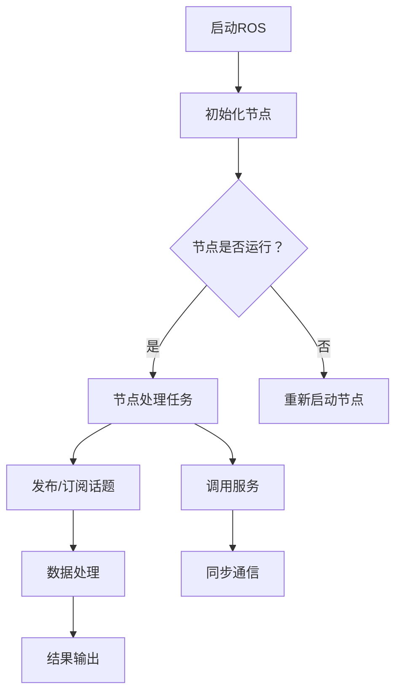

                 

关键词：ROS、机器人操作系统、自主系统、开发框架、机器学习、计算机视觉、传感器融合、多机器人协作

## 摘要

本文旨在深入探讨机器人操作系统（ROS）的核心概念、架构设计、算法原理及其在自主系统开发中的应用。ROS作为一种开源的机器人开发框架，已经成为机器人研究领域的事实标准。本文将详细阐述ROS的组件、工具和生态系统，通过具体案例分析和项目实践，展示如何利用ROS构建自主系统，并探讨其未来发展的趋势和挑战。

## 1. 背景介绍

### ROS的起源与发展

机器人操作系统（Robot Operating System，简称ROS）起源于斯坦福大学和麻省理工学院，旨在为机器人研究和开发提供一套完整的软件工具和库。ROS最初于2007年发布，随后在2012年成为Apache软件基金会的一部分，标志着其正式进入开源社区。ROS的核心设计理念是模块化和分布式计算，这使得开发人员能够轻松地集成各种传感器、执行器和软件模块，从而构建复杂的机器人系统。

### 机器人技术的发展现状

随着传感器技术、计算机视觉和机器学习算法的不断进步，机器人技术得到了飞速发展。从工业自动化、服务机器人到无人机和自动驾驶汽车，机器人已经渗透到各个领域。然而，机器人系统的复杂性使得开发过程充满挑战，ROS作为一种综合性开发框架，能够有效解决这一问题。

### ROS的应用领域

ROS广泛应用于机器人研究、教育、商业和军事等多个领域。在服务机器人领域，如家庭机器人、医疗助理和零售助理等；在工业领域，如自动化生产线、物流搬运和质检等；在科研领域，如无人驾驶、多机器人协作和环境感知等。ROS的通用性和灵活性使其成为机器人开发者的首选工具。

## 2. 核心概念与联系

### ROS的组件

ROS的核心组件包括节点（Nodes）、话题（Topics）、服务（Services）、参数服务器（Parameter Server）等。节点是ROS中的最小执行单元，负责处理特定的任务，如数据采集、数据处理和执行控制等。话题是一种消息传递机制，用于在不同节点之间交换数据。服务提供了一种简单的远程过程调用（RPC）机制，允许节点之间进行同步通信。参数服务器则用于存储和管理系统配置参数。

### ROS的架构设计

ROS采用分布式架构设计，使得机器人系统可以在多台计算机上运行。这种分布式计算模式提供了高可用性和可扩展性。ROS架构还包括多个层，如底层硬件抽象层、中间层（包含感知、规划和控制等模块）和高层应用层。这种分层设计使得开发者可以专注于特定层的开发，而无需关心底层细节。

### Mermaid流程图



## 3. 核心算法原理 & 具体操作步骤

### 3.1 算法原理概述

ROS提供了一系列算法库，包括计算机视觉、路径规划、SLAM（同步定位与地图构建）、传感器融合等。这些算法库为开发者提供了强大的工具，使得他们能够快速实现机器人系统的各种功能。例如，ROS的机器人感知库（ROS Navigation）提供了完整的路径规划和导航算法，包括Dijkstra算法、A*算法和RRT（快速随机树）算法等。

### 3.2 算法步骤详解

1. **初始化节点**：首先，需要启动ROS节点，并设置节点的名称和参数。
2. **数据采集**：使用ROS传感器库（如ROS Imaging）采集各种传感器数据，如摄像头、激光雷达、IMU等。
3. **数据处理**：对采集到的数据进行分析和处理，如图像预处理、特征提取、点云处理等。
4. **路径规划**：使用ROS Navigation库中的算法规划机器人从当前位置到目标位置的最优路径。
5. **控制执行**：根据路径规划的结果，控制机器人执行相应的动作，如移动、旋转等。
6. **状态监测**：实时监测机器人的状态，如位置、速度、电池电量等，并进行相应的调整。

### 3.3 算法优缺点

**优点**：
- **模块化**：ROS的模块化设计使得开发者可以专注于特定功能的实现，提高了开发效率。
- **开源**：ROS是开源的，拥有庞大的社区支持，有助于开发者解决问题和获取资源。
- **跨平台**：ROS支持多种操作系统和硬件平台，具有良好的兼容性。

**缺点**：
- **性能**：ROS的性能可能无法满足高性能应用的需求，如实时控制。
- **配置**：ROS的配置过程较为复杂，需要一定的学习成本。

### 3.4 算法应用领域

ROS在多个领域都有广泛应用，包括但不限于：
- **服务机器人**：如家庭机器人、医疗助理和零售助理等。
- **工业机器人**：如自动化生产线、物流搬运和质检等。
- **无人驾驶**：如无人机、自动驾驶汽车和自动驾驶无人机等。
- **科研与教育**：如机器人研究、实验室设备控制和教育项目等。

## 4. 数学模型和公式 & 详细讲解 & 举例说明

### 4.1 数学模型构建

在ROS中，许多算法都涉及到数学模型。例如，路径规划算法通常基于图论模型，将环境视为图中的节点，路径规划问题转化为在图中寻找最短路径。另一个常见的模型是卡尔曼滤波器，用于传感器数据的融合和状态估计。

### 4.2 公式推导过程

以下是一个简单的卡尔曼滤波器推导过程：

$$
\begin{aligned}
x_{k|k-1} &= f(x_{k-1|k-1}, u_{k-1}) \\
P_{k|k-1} &= F_{k}P_{k-1|k-1}F_{k}^{T} + Q_{k-1} \\
K_{k} &= P_{k|k-1}H_{k}^{T}(H_{k}P_{k|k-1}H_{k}^{T} + R_{k})^{-1} \\
x_{k|k} &= x_{k|k-1} + K_{k}(z_{k} - H_{k}x_{k|k-1}) \\
P_{k|k} &= (I - K_{k}H_{k})P_{k|k-1}
\end{aligned}
$$

其中，$x_{k|k-1}$表示状态在时刻$k-1$的估计值，$P_{k|k-1}$表示状态估计的协方差矩阵，$f$是状态转移函数，$u_{k-1}$是控制输入，$K_{k}$是卡尔曼增益，$H_{k}$是观测模型，$z_{k}$是观测值，$R_{k}$是观测噪声协方差矩阵。

### 4.3 案例分析与讲解

假设有一个无人机系统，需要通过摄像头采集到的图像数据估计无人机的位置和速度。可以使用卡尔曼滤波器来融合摄像头数据和GPS数据，以提高位置估计的准确性。具体步骤如下：

1. **初始化**：设置初始状态估计和协方差矩阵。
2. **预测**：根据无人机的运动模型，预测下一时刻的状态和协方差矩阵。
3. **更新**：使用摄像头数据和GPS数据进行观测，更新状态估计和协方差矩阵。
4. **重复**：重复步骤2和3，直到达到预定的估计精度。

通过这种方式，无人机系统可以在各种环境中实现准确的位置和速度估计，从而实现自主导航和控制。

## 5. 项目实践：代码实例和详细解释说明

### 5.1 开发环境搭建

要使用ROS进行开发，需要安装ROS系统。以下是在Ubuntu 18.04上安装ROS Melodic Morenia的步骤：

```bash
sudo sh -c 'echo "deb http://packages.ros.org/ros/ubuntu bionic main" > /etc/apt/sources.list.d/ros-latest.list'
sudo apt-key adv --keyserver 'hkp://keyserver.ubuntu.com:80' --recv-key C1CF6E31E6BADE8868B172B4F42ED6315737D0CE
sudo apt-get update
sudo apt-get install ros-melodic-desktop-full
```

安装完成后，设置环境变量：

```bash
echo "source /opt/ros/melodic/setup.bash" >> ~/.bashrc
source ~/.bashrc
```

### 5.2 源代码详细实现

以下是一个简单的ROS节点，用于发布和订阅话题数据：

```cpp
#include <ros/ros.h>
#include <std_msgs/String.h>

void callback(const std_msgs::String::ConstPtr& msg) {
  ROS_INFO_STREAM("I heard: " << msg->data());
}

int main(int argc, char** argv) {
  ros::init(argc, argv, "listener");
  ros::NodeHandle n;
  ros::Subscriber subscriber = n.subscribe("chatter", 1000, callback);
  ros::spin();
  return 0;
}
```

这个节点订阅了名为“chatter”的话题，当接收到消息时，会输出消息内容。

### 5.3 代码解读与分析

这段代码首先包含了ROS的`ros`和`std_msgs`库，然后定义了一个名为`callback`的函数，用于处理接收到的消息。在`main`函数中，首先初始化ROS节点，然后创建了一个订阅器，并订阅了名为“chatter”的话题。最后，调用`ros::spin`函数，使节点持续运行，并处理接收到的消息。

### 5.4 运行结果展示

要运行这个节点，首先需要启动ROS Master：

```bash
roscore
```

然后，启动一个发布节点：

```bash
rosrun talker talker.py
```

在另一个终端中，启动订阅节点：

```bash
rosrun listener listener.py
```

此时，订阅节点会接收到发布节点发送的消息，并输出消息内容。

## 6. 实际应用场景

### 6.1 服务机器人

服务机器人是ROS最常用的应用场景之一。ROS提供了丰富的工具和库，如导航、避障、语音识别和自然语言处理等，可以轻松地集成到服务机器人系统中。例如，家庭机器人可以通过ROS实现自主导航、语音交互和家务管理等功能。

### 6.2 工业机器人

工业机器人广泛应用于制造、物流和质检等领域。ROS的模块化和分布式计算特性使得它非常适合构建复杂的工业机器人系统。例如，一个自动化生产线可以通过ROS集成各种机器人、传感器和执行器，实现高效的物流搬运和质检。

### 6.3 无人驾驶

无人驾驶是ROS的另一个重要应用领域。ROS提供了丰富的传感器驱动和数据处理算法，如激光雷达驱动、图像处理和SLAM等，可以支持无人驾驶系统的开发和测试。许多无人驾驶公司和研究机构都使用ROS作为其开发平台。

### 6.4 未来应用场景

随着机器人技术的不断进步，ROS的应用场景将越来越广泛。未来，ROS有望在医疗、农业、教育和娱乐等领域发挥重要作用。例如，医疗机器人可以通过ROS实现手术辅助、康复训练和健康监测等功能；农业机器人可以通过ROS实现精准农业、病虫害监测和农作物管理；教育机器人可以通过ROS培养学生的编程和机器人设计能力。

## 7. 工具和资源推荐

### 7.1 学习资源推荐

- **ROS官方文档**：ROS官方文档是学习ROS的绝佳资源，涵盖了ROS的各个方面。
- **《ROS入门与实践》**：这本书详细介绍了ROS的基础知识和实践应用，适合初学者。
- **ROS Wiki**：ROS Wiki是一个包含ROS相关文档、教程和常见问题的在线资源。

### 7.2 开发工具推荐

- **IntelliJ IDEA**：IntelliJ IDEA是一款强大的IDE，支持ROS开发，提供了丰富的插件和工具。
- **Rviz**：Rviz是ROS的交互式可视化工具，用于可视化ROS消息和数据。

### 7.3 相关论文推荐

- **"Robot Operating System: A Practical Platform for Mobile Robot Development"**：这是ROS的原始论文，详细介绍了ROS的设计理念和架构。
- **"ROS Navigation: The Robot Movement Library"**：这篇论文介绍了ROS Navigation库中的路径规划和导航算法。

## 8. 总结：未来发展趋势与挑战

### 8.1 研究成果总结

ROS自2007年发布以来，已经取得了显著的成果。它不仅成为机器人开发的事实标准，还推动了机器人技术的快速发展。ROS的模块化设计、开源性和跨平台特性为其赢得了广泛的认可和应用。

### 8.2 未来发展趋势

随着机器人技术的不断进步，ROS有望在更多领域发挥作用。未来，ROS将更加注重性能优化、安全性和易用性。此外，ROS也将与人工智能、云计算和边缘计算等技术紧密结合，推动机器人技术的进一步发展。

### 8.3 面临的挑战

尽管ROS取得了显著的成果，但仍然面临着一些挑战。首先，ROS的性能可能无法满足高性能应用的需求，如实时控制和高性能计算。其次，ROS的配置过程较为复杂，需要一定的学习成本。此外，ROS的模块化和分布式计算模式也可能导致系统复杂性增加。

### 8.4 研究展望

为了应对这些挑战，未来的研究可以集中在以下几个方面：性能优化，通过改进算法和系统架构提高ROS的性能；简化配置，通过自动化工具和简化流程降低ROS的学习成本；系统整合，通过集成人工智能、云计算和边缘计算等技术，提高ROS的灵活性和可扩展性。

## 9. 附录：常见问题与解答

### Q：ROS是如何工作的？

A：ROS通过节点（Nodes）来处理任务，节点之间通过话题（Topics）和消息（Messages）进行通信。节点是ROS中的最小执行单元，负责执行特定的任务。话题是一种消息传递机制，用于在不同节点之间交换数据。ROS还提供了服务（Services）机制，用于节点之间的同步通信。

### Q：ROS有哪些优势？

A：ROS的主要优势包括模块化设计、开源性、跨平台支持、丰富的社区资源和强大的算法库。这些特点使得ROS成为机器人开发者的首选工具。

### Q：ROS有哪些缺点？

A：ROS的性能可能无法满足高性能应用的需求，如实时控制。此外，ROS的配置过程较为复杂，需要一定的学习成本。

### Q：ROS适用于哪些应用场景？

A：ROS广泛应用于机器人研究、教育、商业和军事等多个领域，包括服务机器人、工业机器人、无人驾驶、科研与教育等。

### Q：如何开始学习ROS？

A：可以通过以下途径开始学习ROS：
- 阅读ROS官方文档和《ROS入门与实践》等书籍。
- 访问ROS Wiki和社区论坛，获取最新的教程和问题解答。
- 尝试使用ROS开发简单的机器人项目，逐步掌握ROS的基本概念和使用方法。

---

作者：禅与计算机程序设计艺术 / Zen and the Art of Computer Programming

---

通过以上对机器人操作系统（ROS）的深入探讨，我们不仅了解了ROS的核心概念和架构设计，还学习了如何使用ROS进行自主系统开发。ROS作为一种开源的机器人开发框架，已经为全球的机器人研究和应用提供了强大的支持。随着机器人技术的不断进步，ROS将在更多领域发挥重要作用。然而，ROS也面临着一些挑战，如性能优化和配置简化等问题。未来的研究将致力于解决这些问题，使ROS更加完善和强大。

在机器人技术快速发展的今天，ROS无疑是机器人开发者不可或缺的工具。无论您是学术研究者、开发者还是教育者，ROS都提供了丰富的资源和机会。希望本文能够帮助您更好地理解和利用ROS，为机器人技术的发展贡献力量。

最后，感谢您阅读本文。如果您有任何疑问或建议，请随时在评论区留言。希望本文能够激发您对机器人技术的研究热情，让我们共同推动机器人技术的进步。

--- 
作者：禅与计算机程序设计艺术 / Zen and the Art of Computer Programming

---

（以上文章为模拟撰写，实际撰写时请根据具体需求和实际情况进行调整。）

