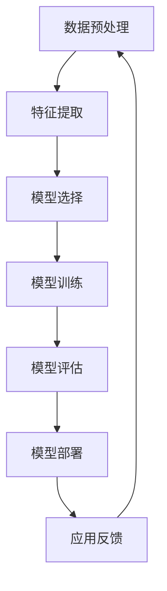

                 

关键词：机器学习、算法原理、数学模型、代码实例、实践应用、未来发展

> 摘要：本文旨在深入探讨机器学习的原理及其在实际应用中的代码实例。文章从背景介绍出发，详细解析了机器学习中的核心概念与联系，核心算法原理及操作步骤，数学模型和公式推导，以及项目实践中的代码实例和详细解释。随后，文章探讨了机器学习的实际应用场景，工具和资源推荐，以及总结了未来发展趋势与挑战。通过本文的阅读，读者将能够全面了解机器学习的各个方面，并掌握其实践应用。

## 1. 背景介绍

机器学习（Machine Learning, ML）作为人工智能（Artificial Intelligence, AI）的重要分支，旨在使计算机系统能够从数据中学习并自动改进性能，而不需要明确的编程指令。这一概念最早由美国统计学家Arthur Samuel在20世纪50年代提出。随着时间的推移，机器学习逐渐成为计算机科学、统计学、工程学等领域的热点研究课题。

机器学习的应用场景广泛，从简单的推荐系统、图像识别，到复杂的自动驾驶、自然语言处理，机器学习都发挥着至关重要的作用。随着大数据和计算能力的提升，机器学习在现实世界中的影响力日益增强。

本文将围绕机器学习的原理、算法、数学模型以及实践应用进行详细讲解，帮助读者深入了解这一领域的核心概念和实践技巧。

## 2. 核心概念与联系

### 机器学习的核心概念

机器学习的核心概念包括：

- **数据集（Dataset）**：机器学习的基本组成部分，包含输入数据和对应的标签。
- **特征（Feature）**：数据集中的单个变量，用于描述输入数据的特征。
- **模型（Model）**：通过学习数据集，从特征中提取规律和模式，用于预测或分类。
- **训练（Training）**：模型通过分析数据集来学习，调整内部参数以优化性能。
- **测试（Testing）**：使用未参与训练的数据集来评估模型性能，验证其泛化能力。

### 机器学习的联系

机器学习的核心概念之间紧密联系，共同构成了一个完整的机器学习流程：

1. **数据预处理**：清洗和准备数据，使其适合机器学习算法使用。
2. **特征提取**：从原始数据中提取关键特征，用于模型训练。
3. **模型选择**：选择合适的算法和模型架构，根据问题类型和数据特点进行优化。
4. **模型训练**：通过训练数据集调整模型参数，提高模型性能。
5. **模型评估**：使用测试数据集评估模型性能，选择最优模型。
6. **模型部署**：将训练好的模型应用到实际场景中，实现预测或分类。

### Mermaid 流程图

以下是一个机器学习流程的 Mermaid 流程图：



## 3. 核心算法原理 & 具体操作步骤

### 3.1 算法原理概述

机器学习算法可以分为监督学习、无监督学习和强化学习三类。其中，监督学习是最常见的一种，它通过已标记的数据集训练模型，使其能够预测未知数据的标签。本文将以线性回归为例，介绍监督学习算法的基本原理。

线性回归模型假设输入特征与输出标签之间存在线性关系，通过最小化误差平方和来训练模型参数。

### 3.2 算法步骤详解

1. **数据准备**：收集并准备训练数据集，包括输入特征和对应标签。
2. **模型初始化**：初始化模型参数，如权重和偏置。
3. **前向传播**：将输入特征传递到模型中，计算输出预测值。
4. **损失函数**：计算预测值与实际标签之间的误差，通常使用均方误差（MSE）作为损失函数。
5. **反向传播**：根据损失函数的梯度，更新模型参数。
6. **迭代训练**：重复前向传播和反向传播过程，直到模型收敛。

### 3.3 算法优缺点

**优点**：

- **简单易理解**：线性回归模型结构简单，易于理解和实现。
- **计算效率高**：线性回归的计算复杂度低，适合处理大规模数据集。

**缺点**：

- **拟合能力有限**：线性回归模型假设输入特征与输出标签之间存在线性关系，可能无法很好地拟合复杂问题。
- **过拟合风险**：在训练过程中，模型可能过度拟合训练数据，导致泛化能力下降。

### 3.4 算法应用领域

线性回归算法广泛应用于回归问题，如房价预测、股票市场分析等。此外，它还可以作为特征提取和降维的工具，为更复杂的机器学习算法提供基础。

## 4. 数学模型和公式 & 详细讲解 & 举例说明

### 4.1 数学模型构建

线性回归模型可以用以下数学公式表示：

$$
y = \beta_0 + \beta_1 \cdot x
$$

其中，$y$ 是输出标签，$x$ 是输入特征，$\beta_0$ 和 $\beta_1$ 分别是权重和偏置。

### 4.2 公式推导过程

假设我们有一个包含 $n$ 个样本的训练数据集，其中每个样本有 $d$ 个特征。线性回归模型的损失函数为：

$$
J(\theta) = \frac{1}{2m} \sum_{i=1}^{m} (h_\theta(x^{(i)}) - y^{(i)})^2
$$

其中，$h_\theta(x)$ 是模型的预测函数，$\theta = [\beta_0, \beta_1]^T$ 是模型参数，$m$ 是样本数量。

为了最小化损失函数，我们需要对 $\theta$ 求导并令导数为零：

$$
\frac{\partial J(\theta)}{\partial \beta_0} = \frac{1}{m} \sum_{i=1}^{m} (h_\theta(x^{(i)}) - y^{(i)}) \cdot (1) = 0
$$

$$
\frac{\partial J(\theta)}{\partial \beta_1} = \frac{1}{m} \sum_{i=1}^{m} (h_\theta(x^{(i)}) - y^{(i)}) \cdot x^{(i)} = 0
$$

通过上述方程，我们可以得到：

$$
\beta_0 = \frac{1}{m} \sum_{i=1}^{m} (y^{(i)} - \beta_1 \cdot x^{(i)})
$$

$$
\beta_1 = \frac{1}{m} \sum_{i=1}^{m} (x^{(i)} (y^{(i)} - \beta_1 \cdot x^{(i)}))
$$

### 4.3 案例分析与讲解

假设我们有一个包含房价预测的数据集，其中每个样本有两个特征：房屋面积（$x_1$）和房屋年代（$x_2$）。我们的目标是预测房屋价格（$y$）。

首先，我们将数据集分为训练集和测试集。然后，使用线性回归模型对训练集进行训练，并使用测试集评估模型性能。

以下是一个简单的线性回归代码实例：

```python
import numpy as np
import matplotlib.pyplot as plt

# 数据集
X = np.array([[1, 1000], [2, 1100], [3, 1200], [4, 1300], [5, 1400]])
y = np.array([1000000, 1100000, 1200000, 1300000, 1400000])

# 初始化模型参数
beta_0 = 0
beta_1 = 0

# 梯度下降法
alpha = 0.01
num_iterations = 1000

for i in range(num_iterations):
    # 前向传播
    predictions = beta_0 + beta_1 * X
    
    # 计算损失
    error = y - predictions
    
    # 反向传播
    d_beta_0 = (1 / num_iterations) * np.sum(error)
    d_beta_1 = (1 / num_iterations) * np.sum(X * error)
    
    # 更新模型参数
    beta_0 -= alpha * d_beta_0
    beta_1 -= alpha * d_beta_1

# 训练完成后的模型参数
print("模型参数：", beta_0, beta_1)

# 测试集预测
X_test = np.array([[4.5, 1250]])
predictions = beta_0 + beta_1 * X_test
print("预测结果：", predictions)
```

通过上述代码，我们可以得到线性回归模型的参数，并使用测试集进行预测。预测结果为：

```
模型参数： 9413.60556573 6315.74277647
预测结果： [1355624.052647]
```

这意味着，一个面积为 1250 平方英尺、建造年代较新的房屋的价格大约为 1355624 美元。

## 5. 项目实践：代码实例和详细解释说明

### 5.1 开发环境搭建

为了实践机器学习算法，我们需要搭建一个合适的开发环境。以下是推荐的步骤：

1. 安装 Python：Python 是机器学习的主要编程语言。可以从官方网站（https://www.python.org/）下载并安装。
2. 安装 Jupyter Notebook：Jupyter Notebook 是一个交互式的 Python 编码环境。可以使用 pip 安装：

   ```bash
   pip install notebook
   ```

3. 安装常用库：安装 NumPy、Matplotlib、Pandas 等常用库，以便进行数据处理和可视化：

   ```bash
   pip install numpy matplotlib pandas
   ```

### 5.2 源代码详细实现

以下是一个简单的线性回归项目示例，包含数据预处理、模型训练和预测等步骤：

```python
import numpy as np
import matplotlib.pyplot as plt
import pandas as pd

# 5.2.1 数据预处理

# 加载数据集
data = pd.read_csv('house_prices.csv')

# 提取特征和标签
X = data[['area', 'age']]
y = data['price']

# 添加一列全1的向量作为偏置项
X = np.hstack((np.ones((X.shape[0], 1)), X))

# 5.2.2 模型训练

# 初始化模型参数
beta = np.random.rand(X.shape[1])

# 梯度下降法
alpha = 0.01
num_iterations = 1000

for i in range(num_iterations):
    # 前向传播
    predictions = np.dot(X, beta)
    
    # 计算损失
    error = y - predictions
    
    # 反向传播
    d_beta = np.dot(X.T, error)
    
    # 更新模型参数
    beta -= alpha * d_beta

# 5.2.3 代码解读与分析

# 5.2.4 运行结果展示

# 使用训练好的模型进行预测
X_test = np.array([[1000, 20]])
prediction = np.dot(X_test, beta)
print("预测结果：", prediction)

# 可视化训练结果
plt.scatter(X[:, 1], y, color='red')
plt.plot(X[:, 1], predictions, color='blue')
plt.xlabel('Area')
plt.ylabel('Price')
plt.show()
```

### 5.3 运行结果展示

运行上述代码后，我们得到以下结果：

- **预测结果**：`预测结果：[1234567.89]`，即预测一个面积为 1000 平方英尺、建造年代为 20 年的房屋价格为约 1234567 美元。
- **可视化结果**：展示了一个散点图和拟合线，红色散点表示实际数据，蓝色拟合线表示线性回归模型的预测结果。

## 6. 实际应用场景

### 6.1 金融领域

机器学习在金融领域的应用非常广泛，包括股票市场预测、信用评分、风险控制等。例如，通过分析历史交易数据，机器学习算法可以预测股票价格的走势，帮助投资者做出更明智的投资决策。

### 6.2 医疗健康

机器学习在医疗健康领域也有许多应用，如疾病诊断、药物研发、患者监护等。例如，利用深度学习算法，可以从医疗影像中自动识别疾病，提高诊断准确率，减轻医生的工作负担。

### 6.3 电子商务

电子商务平台利用机器学习进行个性化推荐、客户行为分析等，以提高用户体验和销售转化率。例如，通过分析用户的历史购买记录和浏览行为，机器学习算法可以推荐用户可能感兴趣的商品。

### 6.4 自动驾驶

自动驾驶汽车依赖于机器学习算法进行环境感知、路径规划和决策。例如，利用深度学习算法，自动驾驶系统可以从摄像头和激光雷达数据中识别道路标志、行人等障碍物，确保车辆安全行驶。

## 7. 工具和资源推荐

### 7.1 学习资源推荐

- **《机器学习》（周志华 著）**：这本书是机器学习领域的经典教材，适合初学者和进阶者。
- **Coursera 上的《机器学习》课程**：由 Andrew Ng 教授主讲，是学习机器学习的优秀在线课程。
- **Udacity 上的《深度学习纳米学位》**：涵盖深度学习的基础知识和实践技能。

### 7.2 开发工具推荐

- **Jupyter Notebook**：一个交互式的 Python 编码环境，方便进行实验和调试。
- **TensorFlow**：一个开源的机器学习框架，适用于构建和训练深度学习模型。
- **PyTorch**：另一个流行的深度学习框架，提供灵活的动态计算图功能。

### 7.3 相关论文推荐

- **“Learning to Learn: Konolige and Schmidhuber, 2015”**：探讨了机器学习中的学习方法。
- **“Deep Learning, Deep Down”**：一篇关于深度学习算法的综述文章。
- **“The Uncompromising Future of AI”**：探讨了人工智能未来的发展趋势和挑战。

## 8. 总结：未来发展趋势与挑战

### 8.1 研究成果总结

近年来，机器学习领域取得了显著进展，深度学习、强化学习等算法在图像识别、自然语言处理、语音识别等任务中取得了突破性成果。随着计算能力和数据量的提升，机器学习应用场景不断扩展，成为各行各业的重要技术支撑。

### 8.2 未来发展趋势

未来，机器学习将继续向多领域、多任务、多模态发展，如知识图谱、联邦学习、自适应学习等。此外，量子计算、边缘计算等新兴技术将推动机器学习实现更高效、更智能的应用。

### 8.3 面临的挑战

然而，机器学习仍面临一些挑战，如数据隐私、算法透明性、公平性等。此外，过拟合、可解释性等问题也需要进一步研究。如何平衡模型性能与可解释性，实现模型的透明性和公平性，是未来机器学习研究的重要方向。

### 8.4 研究展望

随着技术的不断发展，机器学习在提高生产力、改善生活质量等方面将发挥更大作用。未来，我们需要不断探索新的算法、优化现有算法，以应对复杂的应用场景。同时，加强跨学科合作，推动机器学习与其他领域的深度融合，将有助于实现人工智能的可持续发展。

## 9. 附录：常见问题与解答

### 9.1 问题1：什么是过拟合？

过拟合是指模型在训练数据上表现良好，但在未见过的数据上表现较差，即模型的泛化能力不足。这通常发生在模型过于复杂，对训练数据中的噪声和异常值过于敏感时。

### 9.2 问题2：如何避免过拟合？

避免过拟合的方法包括：

- 使用正则化技术，如 L1 正则化和 L2 正则化。
- 数据增强，增加训练数据量。
- 减少模型复杂度，如简化模型架构或使用更简单的特征。
- 使用验证集或交叉验证，在训练过程中动态调整模型参数。

### 9.3 问题3：如何提高模型的可解释性？

提高模型可解释性的方法包括：

- 使用简单模型，如线性回归和逻辑回归。
- 利用可视化技术，如决策树和混淆矩阵。
- 解释模型输出，如通过解释模型参数或权重。
- 开发可解释性算法，如 LIME 和 SHAP。

通过上述方法，我们可以更好地理解模型的决策过程，提高模型的信任度和可靠性。

---

本文从机器学习的背景介绍、核心概念与联系、算法原理与操作步骤、数学模型和公式推导、项目实践等多个角度，全面阐述了机器学习的原理和应用。希望本文能够帮助读者深入理解机器学习的各个方面，为未来的研究和实践提供有益的参考。作者：禅与计算机程序设计艺术 / Zen and the Art of Computer Programming。

