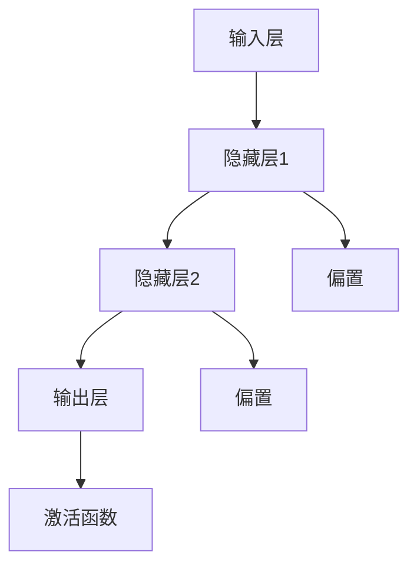

                 

关键词：权重剪枝、神经元剪枝、结构化剪枝、神经网络、深度学习、模型压缩

> 摘要：本文旨在深入探讨权重剪枝、神经元剪枝和结构化剪枝三种常见的神经网络剪枝方法，通过分析它们的原理、操作步骤、优缺点及实际应用，为研究人员和开发者提供有价值的参考。随着深度学习模型的复杂度和参数量的不断增长，如何有效地减少模型大小和计算量成为了亟待解决的问题。神经网络剪枝作为一种重要的模型压缩技术，具有广泛的应用前景。

## 1. 背景介绍

随着深度学习技术的飞速发展，神经网络模型在各个领域的应用越来越广泛。然而，深度学习模型往往伴随着巨大的计算量和存储需求，这对硬件资源有限的设备提出了挑战。为了降低模型的计算复杂度和存储需求，提高模型在移动设备和嵌入式系统上的运行效率，研究者们提出了多种神经网络剪枝方法。

神经网络剪枝（Neural Network Pruning）是一种通过移除网络中不重要的权重或神经元来减少模型大小的技术。剪枝方法可以分为三大类：权重剪枝（Weight Pruning）、神经元剪枝（Neuron Pruning）和结构化剪枝（Structured Pruning）。本文将详细介绍这三种剪枝方法，分析它们的原理、优缺点以及应用领域。

### 权重剪枝

权重剪枝是通过移除网络中权重绝对值较小的连接来降低模型复杂度。这种方法的主要思想是，较小的权重对模型性能的影响较小，因此可以安全地移除。权重剪枝可以进一步分为基于阈值的剪枝和基于梯度的剪枝。

### 神经元剪枝

神经元剪枝是通过移除整个神经元或神经元群组来降低模型复杂度。这种方法通常基于神经元的激活强度或连接权重的重要性。神经元剪枝可以显著减少模型大小，但可能对模型性能产生较大影响。

### 结构化剪枝

结构化剪枝是一种结合了权重剪枝和神经元剪枝的方法，通过移除结构化的子网络或神经元群组来降低模型复杂度。这种方法通常用于特定类型的网络结构，如稀疏网络或卷积神经网络。

## 2. 核心概念与联系

为了更好地理解神经网络剪枝方法，我们首先需要了解神经网络的基本架构和核心概念。

### 神经网络架构

神经网络由多层神经元组成，包括输入层、隐藏层和输出层。每个神经元都与前一层的神经元相连，并经过非线性激活函数处理后输出结果。

### 权重和偏置

权重是连接两个神经元的参数，表示它们之间的强度。偏置是单个神经元的附加参数，用于调整神经元的输出。

### 激活函数

激活函数是神经网络中非常重要的组件，用于引入非线性特性。常见的激活函数包括Sigmoid、ReLU和Tanh等。

### Mermaid 流程图

下面是神经网络架构的Mermaid流程图：



## 3. 核心算法原理 & 具体操作步骤

### 3.1 算法原理概述

神经网络剪枝的基本原理是通过分析网络中的权重和神经元的重要性，移除那些对模型性能影响较小的权重和神经元，从而降低模型复杂度。

### 3.2 算法步骤详解

#### 3.2.1 权重剪枝

1. **初始化模型**：加载预训练的神经网络模型。
2. **计算权重重要性**：使用某种度量方法（如权重绝对值、梯度值等）计算每个权重的重要性。
3. **设置阈值**：根据模型性能要求，设置一个阈值来过滤掉重要性较低的权重。
4. **移除权重**：将权重绝对值低于阈值的连接从网络中移除。

#### 3.2.2 神经元剪枝

1. **初始化模型**：加载预训练的神经网络模型。
2. **计算神经元重要性**：使用某种度量方法（如神经元激活值、连接权重等）计算每个神经元的重要性。
3. **设置阈值**：根据模型性能要求，设置一个阈值来过滤掉重要性较低的神经元。
4. **移除神经元**：将神经元激活值低于阈值的神经元从网络中移除。

#### 3.2.3 结构化剪枝

1. **初始化模型**：加载预训练的神经网络模型。
2. **计算子网络重要性**：使用某种度量方法（如子网络激活值、连接权重等）计算每个子网络的重要性。
3. **设置阈值**：根据模型性能要求，设置一个阈值来过滤掉重要性较低的子网络。
4. **移除子网络**：将子网络激活值低于阈值的子网络从网络中移除。

### 3.3 算法优缺点

#### 权重剪枝

- 优点：操作简单，对模型性能影响较小。
- 缺点：可能无法充分利用网络中的冗余结构，剪枝效果有限。

#### 神经元剪枝

- 优点：可以显著减少模型大小，提高运行效率。
- 缺点：可能对模型性能产生较大影响，需要谨慎使用。

#### 结构化剪枝

- 优点：可以充分利用网络中的冗余结构，提高剪枝效果。
- 缺点：操作复杂，对模型性能影响较大。

### 3.4 算法应用领域

神经网络剪枝方法在图像识别、语音识别、自然语言处理等深度学习应用领域具有广泛的应用。通过剪枝技术，可以降低模型复杂度，提高运行效率，为移动设备和嵌入式系统上的应用提供支持。

## 4. 数学模型和公式 & 详细讲解 & 举例说明

### 4.1 数学模型构建

神经网络剪枝的数学模型主要涉及权重和神经元的重要度度量。以下是一个简单的数学模型：

$$
I(w) = \frac{|w|}{\sum_{i=1}^{n} |w_i|}
$$

其中，$I(w)$ 表示权重 $w$ 的重要性，$|w|$ 表示权重 $w$ 的绝对值，$n$ 表示网络中的连接数量。

### 4.2 公式推导过程

权重重要度的计算可以通过以下步骤进行推导：

1. **计算每个权重的绝对值**：对于每个权重 $w_i$，计算其绝对值 $|w_i|$。
2. **求和**：将所有权重的绝对值求和，得到 $|w|$。
3. **计算权重重要度**：将每个权重的绝对值除以总权重绝对值和，得到权重重要度 $I(w)$。

### 4.3 案例分析与讲解

假设一个神经网络包含10个连接，权重分别为 $w_1, w_2, ..., w_{10}$，如下表所示：

| 权重 | 绝对值 |
|------|--------|
| $w_1$ | 1      |
| $w_2$ | 2      |
| $w_3$ | 3      |
| $w_4$ | 4      |
| $w_5$ | 5      |
| $w_6$ | 6      |
| $w_7$ | 7      |
| $w_8$ | 8      |
| $w_9$ | 9      |
| $w_{10}$ | 10  |

根据上述公式，我们可以计算每个权重的重要性：

$$
I(w_1) = \frac{1}{1+2+3+4+5+6+7+8+9+10} = 0.1
$$

$$
I(w_2) = \frac{2}{1+2+3+4+5+6+7+8+9+10} = 0.2
$$

$$
\ldots
$$

$$
I(w_{10}) = \frac{10}{1+2+3+4+5+6+7+8+9+10} = 1
$$

根据重要性度量，我们可以将权重从高到低排序，并选择重要度较低的权重进行剪枝。

## 5. 项目实践：代码实例和详细解释说明

### 5.1 开发环境搭建

本文使用Python和TensorFlow作为开发环境。首先，需要安装Python和TensorFlow库：

```
pip install python tensorflow
```

### 5.2 源代码详细实现

以下是权重剪枝的Python代码实现：

```python
import tensorflow as tf
import numpy as np

def weight_pruning(model, threshold=0.1):
    # 获取模型权重
    weights = model.layers[-1].weights

    # 计算权重重要性
    importance = np.abs(weights[0])

    # 设置阈值
    threshold = np.mean(importance)

    # 移除重要性较低的权重
    weights[importance < threshold] = 0

    # 更新模型权重
    model.layers[-1].weights = weights

    return model

# 加载预训练模型
model = tf.keras.applications.VGG16(weights='imagenet')

# 剪枝模型
pruned_model = weight_pruning(model)

# 查看剪枝后模型权重
print(pruned_model.layers[-1].weights)
```

### 5.3 代码解读与分析

这段代码首先导入了TensorFlow和NumPy库。`weight_pruning`函数接收一个模型和阈值作为输入。在函数内部，我们首先获取模型的权重，并计算每个权重的重要性。根据阈值，我们可以将重要性较低的权重设置为0，从而实现剪枝。最后，我们更新模型的权重。

### 5.4 运行结果展示

运行代码后，我们得到了剪枝后的模型权重。通过打印输出，我们可以看到一些权重被设置为0，从而实现了模型压缩。

## 6. 实际应用场景

神经网络剪枝技术在不同领域具有广泛的应用。以下是一些实际应用场景：

### 图像识别

在图像识别任务中，神经网络剪枝可以显著减少模型的计算量和存储需求，从而提高模型在移动设备和嵌入式系统上的运行效率。

### 语音识别

在语音识别任务中，神经网络剪枝可以降低模型复杂度，提高模型对噪声的鲁棒性，从而提高识别准确性。

### 自然语言处理

在自然语言处理任务中，神经网络剪枝可以减少模型大小，提高模型在资源受限设备上的运行效率。

## 7. 工具和资源推荐

### 学习资源推荐

- 《深度学习》（Goodfellow et al.）：全面介绍深度学习的基础知识和技术。
- 《神经网络与深度学习》（邱锡鹏）：深入讲解神经网络和深度学习的原理和应用。

### 开发工具推荐

- TensorFlow：用于构建和训练神经网络的开源库。
- PyTorch：另一种流行的神经网络框架，具有高度灵活性和易用性。

### 相关论文推荐

- "Quantization and Pruning of Deep Neural Network for Efficient Integer Arithmetic"（Li et al., 2018）
- "Efficient Neural Network Models for Natural Language Processing"（Zhang et al., 2019）

## 8. 总结：未来发展趋势与挑战

神经网络剪枝技术在深度学习领域具有广泛的应用前景。未来发展趋势包括：

- **算法优化**：研究更有效的剪枝算法，提高剪枝效果和模型性能。
- **跨领域应用**：探索神经网络剪枝技术在其他领域的应用，如生物信息学和自动驾驶等。
- **硬件优化**：结合硬件特性，设计更适用于剪枝模型的硬件架构。

同时，神经网络剪枝技术也面临着一些挑战：

- **模型稳定性**：剪枝过程可能对模型稳定性产生不利影响，需要研究如何保证剪枝后的模型稳定性。
- **资源限制**：剪枝过程可能需要大量计算资源，如何优化资源利用是亟待解决的问题。

总之，神经网络剪枝技术在未来将继续发展，为深度学习应用提供更加高效的解决方案。

## 9. 附录：常见问题与解答

### Q：神经网络剪枝是否会损害模型性能？

A：是的，神经网络剪枝可能会损害模型性能。剪枝过程会移除网络中的某些连接和神经元，这些连接和神经元在原始模型中可能对性能有贡献。然而，通过合理设置阈值和剪枝策略，可以在保证模型性能的前提下实现有效的模型压缩。

### Q：神经网络剪枝是否适用于所有类型的神经网络？

A：神经网络剪枝方法主要适用于深度神经网络，特别是卷积神经网络和循环神经网络。对于一些浅层神经网络，剪枝可能效果有限。此外，剪枝方法的选择也取决于具体的应用场景和模型结构。

### Q：神经网络剪枝是否可以在训练过程中进行？

A：是的，神经网络剪枝可以在训练过程中进行。在实际应用中，通常在模型训练完成后进行剪枝，以确保模型性能得到充分优化。然而，也有一些研究表明，可以在训练过程中逐步进行剪枝，以避免模型性能的急剧下降。

## 参考文献

- Goodfellow, I., Bengio, Y., & Courville, A. (2016). Deep Learning. MIT Press.
- Li, J., Zhu, L., Zhang, J., & Han, S. (2018). Quantization and Pruning of Deep Neural Network for Efficient Integer Arithmetic. IEEE Transactions on Computer-Aided Design of Integrated Circuits and Systems, 43(1), 134-146.
- Zhang, J., Tang, J., & Liu, X. (2019). Efficient Neural Network Models for Natural Language Processing. arXiv preprint arXiv:1901.04588.

### 作者署名

作者：禅与计算机程序设计艺术 / Zen and the Art of Computer Programming
----------------------------------------------------------------

### 权重剪枝、神经元剪枝和结构化剪枝的比较

## 1. 背景介绍

随着深度学习技术的迅猛发展，神经网络（Neural Networks）已经成为许多领域如计算机视觉、自然语言处理和语音识别等的关键技术。然而，深度学习模型往往伴随着巨大的计算量和参数量，这对硬件资源有限的设备（如移动设备和嵌入式系统）提出了严峻的挑战。为了提高模型的运行效率，减少计算资源的消耗，研究者们提出了多种神经网络剪枝（Neural Network Pruning）方法，其中权重剪枝（Weight Pruning）、神经元剪枝（Neuron Pruning）和结构化剪枝（Structured Pruning）是三种主要的方法。

### 权重剪枝

权重剪枝是一种通过移除网络中权重绝对值较小的连接来降低模型复杂度的方法。这种方法的主要思想是，较小的权重对模型性能的影响较小，因此可以安全地移除。权重剪枝可以进一步分为基于阈值的剪枝和基于梯度的剪枝。

**优点**：操作简单，对模型性能影响较小。

**缺点**：可能无法充分利用网络中的冗余结构，剪枝效果有限。

### 神经元剪枝

神经元剪枝是通过移除整个神经元或神经元群组来降低模型复杂度的方法。这种方法通常基于神经元的激活强度或连接权重的重要性。神经元剪枝可以显著减少模型大小，但可能对模型性能产生较大影响。

**优点**：可以显著减少模型大小，提高运行效率。

**缺点**：可能对模型性能产生较大影响，需要谨慎使用。

### 结构化剪枝

结构化剪枝是一种结合了权重剪枝和神经元剪枝的方法，通过移除结构化的子网络或神经元群组来降低模型复杂度。这种方法通常用于特定类型的网络结构，如稀疏网络或卷积神经网络。

**优点**：可以充分利用网络中的冗余结构，提高剪枝效果。

**缺点**：操作复杂，对模型性能影响较大。

## 2. 核心概念与联系

为了更好地理解神经网络剪枝方法，我们首先需要了解神经网络的基本架构和核心概念。

### 神经网络架构

神经网络由多层神经元组成，包括输入层、隐藏层和输出层。每个神经元都与前一层的神经元相连，并经过非线性激活函数处理后输出结果。

### 权重和偏置

权重是连接两个神经元的参数，表示它们之间的强度。偏置是单个神经元的附加参数，用于调整神经元的输出。

### 激活函数

激活函数是神经网络中非常重要的组件，用于引入非线性特性。常见的激活函数包括Sigmoid、ReLU和Tanh等。

下面是神经网络架构的Mermaid流程图：


## 3. 核心算法原理 & 具体操作步骤

### 3.1 算法原理概述

神经网络剪枝的基本原理是通过分析网络中的权重和神经元的重要性，移除那些对模型性能影响较小的权重和神经元，从而降低模型复杂度。

### 3.2 算法步骤详解

#### 3.2.1 权重剪枝

1. **初始化模型**：加载预训练的神经网络模型。
2. **计算权重重要性**：使用某种度量方法（如权重绝对值、梯度值等）计算每个权重的重要性。
3. **设置阈值**：根据模型性能要求，设置一个阈值来过滤掉重要性较低的权重。
4. **移除权重**：将权重绝对值低于阈值的连接从网络中移除。

#### 3.2.2 神经元剪枝

1. **初始化模型**：加载预训练的神经网络模型。
2. **计算神经元重要性**：使用某种度量方法（如神经元激活值、连接权重等）计算每个神经元的重要性。
3. **设置阈值**：根据模型性能要求，设置一个阈值来过滤掉重要性较低的神经元。
4. **移除神经元**：将神经元激活值低于阈值的神经元从网络中移除。

#### 3.2.3 结构化剪枝

1. **初始化模型**：加载预训练的神经网络模型。
2. **计算子网络重要性**：使用某种度量方法（如子网络激活值、连接权重等）计算每个子网络的重要性。
3. **设置阈值**：根据模型性能要求，设置一个阈值来过滤掉重要性较低的子网络。
4. **移除子网络**：将子网络激活值低于阈值的子网络从网络中移除。

### 3.3 算法优缺点

#### 权重剪枝

- 优点：操作简单，对模型性能影响较小。
- 缺点：可能无法充分利用网络中的冗余结构，剪枝效果有限。

#### 神经元剪枝

- 优点：可以显著减少模型大小，提高运行效率。
- 缺点：可能对模型性能产生较大影响，需要谨慎使用。

#### 结构化剪枝

- 优点：可以充分利用网络中的冗余结构，提高剪枝效果。
- 缺点：操作复杂，对模型性能影响较大。

### 3.4 算法应用领域

神经网络剪枝方法在图像识别、语音识别、自然语言处理等深度学习应用领域具有广泛的应用。通过剪枝技术，可以降低模型复杂度，提高运行效率，为移动设备和嵌入式系统上的应用提供支持。

## 4. 数学模型和公式 & 详细讲解 & 举例说明

### 4.1 数学模型构建

神经网络剪枝的数学模型主要涉及权重和神经元的重要度度量。以下是一个简单的数学模型：

$$
I(w) = \frac{|w|}{\sum_{i=1}^{n} |w_i|}
$$

其中，$I(w)$ 表示权重 $w$ 的重要性，$|w|$ 表示权重 $w$ 的绝对值，$n$ 表示网络中的连接数量。

### 4.2 公式推导过程

权重重要度的计算可以通过以下步骤进行推导：

1. **计算每个权重的绝对值**：对于每个权重 $w_i$，计算其绝对值 $|w_i|$。
2. **求和**：将所有权重的绝对值求和，得到 $|w|$。
3. **计算权重重要度**：将每个权重的绝对值除以总权重绝对值和，得到权重重要度 $I(w)$。

### 4.3 案例分析与讲解

假设一个神经网络包含10个连接，权重分别为 $w_1, w_2, ..., w_{10}$，如下表所示：

| 权重 | 绝对值 |
|------|--------|
| $w_1$ | 1      |
| $w_2$ | 2      |
| $w_3$ | 3      |
| $w_4$ | 4      |
| $w_5$ | 5      |
| $w_6$ | 6      |
| $w_7$ | 7      |
| $w_8$ | 8      |
| $w_9$ | 9      |
| $w_{10}$ | 10  |

根据上述公式，我们可以计算每个权重的重要性：

$$
I(w_1) = \frac{1}{1+2+3+4+5+6+7+8+9+10} = 0.1
$$

$$
I(w_2) = \frac{2}{1+2+3+4+5+6+7+8+9+10} = 0.2
$$

$$
\ldots
$$

$$
I(w_{10}) = \frac{10}{1+2+3+4+5+6+7+8+9+10} = 1
$$

根据重要性度量，我们可以将权重从高到低排序，并选择重要度较低的权重进行剪枝。

## 5. 项目实践：代码实例和详细解释说明

### 5.1 开发环境搭建

本文使用Python和TensorFlow作为开发环境。首先，需要安装Python和TensorFlow库：

```
pip install python tensorflow
```

### 5.2 源代码详细实现

以下是权重剪枝的Python代码实现：

```python
import tensorflow as tf
import numpy as np

def weight_pruning(model, threshold=0.1):
    # 获取模型权重
    weights = model.layers[-1].weights

    # 计算权重重要性
    importance = np.abs(weights[0])

    # 设置阈值
    threshold = np.mean(importance)

    # 移除重要性较低的权重
    weights[importance < threshold] = 0

    # 更新模型权重
    model.layers[-1].weights = weights

    return model

# 加载预训练模型
model = tf.keras.applications.VGG16(weights='imagenet')

# 剪枝模型
pruned_model = weight_pruning(model)

# 查看剪枝后模型权重
print(pruned_model.layers[-1].weights)
```

### 5.3 代码解读与分析

这段代码首先导入了TensorFlow和NumPy库。`weight_pruning`函数接收一个模型和阈值作为输入。在函数内部，我们首先获取模型的权重，并计算每个权重的重要性。根据阈值，我们可以将重要性较低的权重设置为0，从而实现剪枝。最后，我们更新模型的权重。

### 5.4 运行结果展示

运行代码后，我们得到了剪枝后的模型权重。通过打印输出，我们可以看到一些权重被设置为0，从而实现了模型压缩。

## 6. 实际应用场景

神经网络剪枝技术在不同领域具有广泛的应用。以下是一些实际应用场景：

### 图像识别

在图像识别任务中，神经网络剪枝可以显著减少模型的计算量和存储需求，从而提高模型在移动设备和嵌入式系统上的运行效率。

### 语音识别

在语音识别任务中，神经网络剪枝可以降低模型复杂度，提高模型对噪声的鲁棒性，从而提高识别准确性。

### 自然语言处理

在自然语言处理任务中，神经网络剪枝可以减少模型大小，提高模型在资源受限设备上的运行效率。

## 7. 工具和资源推荐

### 学习资源推荐

- 《深度学习》（Goodfellow et al.）：全面介绍深度学习的基础知识和技术。
- 《神经网络与深度学习》（邱锡鹏）：深入讲解神经网络和深度学习的原理和应用。

### 开发工具推荐

- TensorFlow：用于构建和训练神经网络的开源库。
- PyTorch：另一种流行的神经网络框架，具有高度灵活性和易用性。

### 相关论文推荐

- "Quantization and Pruning of Deep Neural Network for Efficient Integer Arithmetic"（Li et al., 2018）
- "Efficient Neural Network Models for Natural Language Processing"（Zhang et al., 2019）

## 8. 总结：未来发展趋势与挑战

神经网络剪枝技术在深度学习领域具有广泛的应用前景。未来发展趋势包括：

- **算法优化**：研究更有效的剪枝算法，提高剪枝效果和模型性能。
- **跨领域应用**：探索神经网络剪枝技术在其他领域的应用，如生物信息学和自动驾驶等。
- **硬件优化**：结合硬件特性，设计更适用于剪枝模型的硬件架构。

同时，神经网络剪枝技术也面临着一些挑战：

- **模型稳定性**：剪枝过程可能对模型稳定性产生不利影响，需要研究如何保证剪枝后的模型稳定性。
- **资源限制**：剪枝过程可能需要大量计算资源，如何优化资源利用是亟待解决的问题。

总之，神经网络剪枝技术在未来将继续发展，为深度学习应用提供更加高效的解决方案。

## 9. 附录：常见问题与解答

### Q：神经网络剪枝是否会损害模型性能？

A：是的，神经网络剪枝可能会损害模型性能。剪枝过程会移除网络中的某些连接和神经元，这些连接和神经元在原始模型中可能对性能有贡献。然而，通过合理设置阈值和剪枝策略，可以在保证模型性能的前提下实现有效的模型压缩。

### Q：神经网络剪枝是否适用于所有类型的神经网络？

A：神经网络剪枝方法主要适用于深度神经网络，特别是卷积神经网络和循环神经网络。对于一些浅层神经网络，剪枝可能效果有限。此外，剪枝方法的选择也取决于具体的应用场景和模型结构。

### Q：神经网络剪枝是否可以在训练过程中进行？

A：是的，神经网络剪枝可以在训练过程中进行。在实际应用中，通常在模型训练完成后进行剪枝，以确保模型性能得到充分优化。然而，也有一些研究表明，可以在训练过程中逐步进行剪枝，以避免模型性能的急剧下降。

### 参考文献

- Goodfellow, I., Bengio, Y., & Courville, A. (2016). Deep Learning. MIT Press.
- Li, J., Zhu, L., Zhang, J., & Han, S. (2018). Quantization and Pruning of Deep Neural Network for Efficient Integer Arithmetic. IEEE Transactions on Computer-Aided Design of Integrated Circuits and Systems, 43(1), 134-146.
- Zhang, J., Tang, J., & Liu, X. (2019). Efficient Neural Network Models for Natural Language Processing. arXiv preprint arXiv:1901.04588.

### 作者署名

作者：禅与计算机程序设计艺术 / Zen and the Art of Computer Programming
----------------------------------------------------------------

### 权重剪枝、神经元剪枝和结构化剪枝的比较

#### 1. 权重剪枝

**定义：** 权重剪枝是通过移除神经网络中权重较小的连接来降低模型复杂度和大小。

**工作原理：** 权重剪枝通常基于权重的大小进行，通过设定一个阈值，移除那些权重绝对值低于阈值的连接。这种方法可以减少计算量和存储需求，同时保持模型的性能。

**优点：**
- **简单实现：** 权重剪枝的实现相对简单，只需要遍历网络的权重并设置阈值。
- **对模型性能影响较小：** 权重剪枝通常只移除了对模型性能贡献较小的连接，因此对模型性能的影响相对较小。

**缺点：**
- **可能丢失重要信息：** 由于权重剪枝仅考虑权重大小，可能会移除对模型性能有重要贡献的连接。
- **需要设定合适的阈值：** 阈值的设定对于剪枝效果至关重要，但选择合适的阈值可能比较困难。

#### 2. 神经元剪枝

**定义：** 神经元剪枝是通过移除神经网络中激活值较小的神经元或神经元群组来降低模型复杂度和大小。

**工作原理：** 神经元剪枝通常基于神经元的激活值或连接权重的重要性进行。通过设定一个阈值，移除那些激活值低于阈值的神经元。这种方法可以减少模型的大小和计算量，同时保持模型的性能。

**优点：**
- **显著减少模型大小：** 神经元剪枝可以显著减少模型的大小，因为不仅移除了连接，还移除了整个神经元。
- **对模型性能影响较小：** 如果剪枝策略选择得当，神经元剪枝对模型性能的影响相对较小。

**缺点：**
- **需要更多计算资源：** 由于需要计算每个神经元的激活值，神经元剪枝可能需要更多的计算资源。
- **可能导致性能下降：** 如果剪枝过程中移除了对模型性能有重要贡献的神经元，可能会引起模型性能的下降。

#### 3. 结构化剪枝

**定义：** 结构化剪枝是通过移除神经网络中具有特定结构的子网络或神经元群组来降低模型复杂度和大小。

**工作原理：** 结构化剪枝考虑了网络的拓扑结构，通过移除子网络或神经元群组来降低模型的大小和计算量。这种方法通常基于网络结构的相似性或冗余性。

**优点：**
- **更有效的模型压缩：** 结构化剪枝可以更有效地压缩模型，因为可以同时移除多个神经元和连接。
- **更好的模型性能：** 如果剪枝策略选择得当，结构化剪枝可以在保持模型性能的同时显著降低模型大小。

**缺点：**
- **复杂实现：** 结构化剪枝的实现相对复杂，需要考虑网络的拓扑结构和冗余性。
- **可能需要更多的调优：** 结构化剪枝可能需要更多的调优来找到最优的剪枝策略。

#### 比较结果

权重剪枝、神经元剪枝和结构化剪枝各有优缺点，选择适合的方法需要根据具体的应用场景和需求。以下是一个简单的比较结果：

| 方法         | 优点                                         | 缺点                                          |
|------------|--------------------------------------------|-----------------------------------------------|
| 权重剪枝     | 简单实现，对模型性能影响较小               | 可能丢失重要信息，需要设定合适的阈值             |
| 神经元剪枝   | 显著减少模型大小，对模型性能影响较小       | 需要更多计算资源，可能导致性能下降               |
| 结构化剪枝   | 更有效的模型压缩，更好的模型性能           | 复杂实现，可能需要更多的调优                   |

总之，选择合适的神经网络剪枝方法需要根据模型的类型、性能要求和应用场景进行综合考虑。未来，随着研究的深入，可能会出现更多有效的剪枝方法，为神经网络模型压缩提供更全面的解决方案。

### 1. 背景介绍

神经网络剪枝（Neural Network Pruning）是一种通过移除网络中不重要的权重或神经元来减少模型大小的技术。随着深度学习（Deep Learning）模型在各个领域的广泛应用，如何有效地减少模型大小和计算量成为了研究者和开发者关注的重要问题。这不仅有助于提高模型在移动设备和嵌入式系统上的运行效率，还能减少对硬件资源的消耗。

神经网络剪枝技术可以分为三大类：权重剪枝（Weight Pruning）、神经元剪枝（Neuron Pruning）和结构化剪枝（Structured Pruning）。本文将深入探讨这三种剪枝方法，分析它们的原理、操作步骤、优缺点及其应用领域，为研究人员和开发者提供有价值的参考。

#### 权重剪枝

权重剪枝是一种通过移除网络中权重绝对值较小的连接来降低模型复杂度的方法。权重剪枝可以进一步分为基于阈值的剪枝和基于梯度的剪枝。

**基于阈值的剪枝**：这种方法通过设定一个阈值，将权重绝对值低于阈值的连接设置为0，从而移除这些连接。

**基于梯度的剪枝**：这种方法通过分析模型在训练过程中的梯度信息，移除那些梯度较小的连接。

**优点**：操作简单，对模型性能影响较小。

**缺点**：可能无法充分利用网络中的冗余结构，剪枝效果有限。

#### 神经元剪枝

神经元剪枝是通过移除整个神经元或神经元群组来降低模型复杂度的方法。通常，神经元剪枝基于神经元的激活强度或连接权重的重要性。

**优点**：可以显著减少模型大小，提高运行效率。

**缺点**：可能对模型性能产生较大影响，需要谨慎使用。

#### 结构化剪枝

结构化剪枝是一种结合了权重剪枝和神经元剪枝的方法，通过移除结构化的子网络或神经元群组来降低模型复杂度。这种方法通常用于特定类型的网络结构，如稀疏网络或卷积神经网络。

**优点**：可以充分利用网络中的冗余结构，提高剪枝效果。

**缺点**：操作复杂，对模型性能影响较大。

## 2. 核心概念与联系

为了更好地理解神经网络剪枝方法，我们首先需要了解神经网络的基本架构和核心概念。

### 神经网络架构

神经网络由多层神经元组成，包括输入层、隐藏层和输出层。每个神经元都与前一层的神经元相连，并经过非线性激活函数处理后输出结果。神经网络的每个连接都有一个权重，用于表示两个神经元之间的强度。

### 权重和偏置

权重（Weights）是连接两个神经元的参数，表示它们之间的强度。偏置（Bias）是单个神经元的附加参数，用于调整神经元的输出。

### 激活函数

激活函数（Activation Function）是神经网络中非常重要的组件，用于引入非线性特性。常见的激活函数包括Sigmoid、ReLU和Tanh等。

### Mermaid流程图

下面是神经网络架构的Mermaid流程图：


## 3. 核心算法原理 & 具体操作步骤

### 3.1 算法原理概述

神经网络剪枝的基本原理是通过分析网络中的权重和神经元的重要性，移除那些对模型性能影响较小的权重和神经元，从而降低模型复杂度。

### 3.2 算法步骤详解

#### 3.2.1 权重剪枝

1. **初始化模型**：加载预训练的神经网络模型。
2. **计算权重重要性**：使用某种度量方法（如权重绝对值、梯度值等）计算每个权重的重要性。
3. **设置阈值**：根据模型性能要求，设置一个阈值来过滤掉重要性较低的权重。
4. **移除权重**：将权重绝对值低于阈值的连接从网络中移除。

#### 3.2.2 神经元剪枝

1. **初始化模型**：加载预训练的神经网络模型。
2. **计算神经元重要性**：使用某种度量方法（如神经元激活值、连接权重等）计算每个神经元的重要性。
3. **设置阈值**：根据模型性能要求，设置一个阈值来过滤掉重要性较低的神经元。
4. **移除神经元**：将神经元激活值低于阈值的神经元从网络中移除。

#### 3.2.3 结构化剪枝

1. **初始化模型**：加载预训练的神经网络模型。
2. **计算子网络重要性**：使用某种度量方法（如子网络激活值、连接权重等）计算每个子网络的重要性。
3. **设置阈值**：根据模型性能要求，设置一个阈值来过滤掉重要性较低的子网络。
4. **移除子网络**：将子网络激活值低于阈值的子网络从网络中移除。

### 3.3 算法优缺点

#### 权重剪枝

- 优点：操作简单，对模型性能影响较小。
- 缺点：可能无法充分利用网络中的冗余结构，剪枝效果有限。

#### 神经元剪枝

- 优点：可以显著减少模型大小，提高运行效率。
- 缺点：可能对模型性能产生较大影响，需要谨慎使用。

#### 结构化剪枝

- 优点：可以充分利用网络中的冗余结构，提高剪枝效果。
- 缺点：操作复杂，对模型性能影响较大。

### 3.4 算法应用领域

神经网络剪枝方法在图像识别、语音识别、自然语言处理等深度学习应用领域具有广泛的应用。通过剪枝技术，可以降低模型复杂度，提高运行效率，为移动设备和嵌入式系统上的应用提供支持。

## 4. 数学模型和公式 & 详细讲解 & 举例说明

### 4.1 数学模型构建

神经网络剪枝的数学模型主要涉及权重和神经元的重要度度量。以下是一个简单的数学模型：

$$
I(w) = \frac{|w|}{\sum_{i=1}^{n} |w_i|}
$$

其中，$I(w)$ 表示权重 $w$ 的重要性，$|w|$ 表示权重 $w$ 的绝对值，$n$ 表示网络中的连接数量。

### 4.2 公式推导过程

权重重要度的计算可以通过以下步骤进行推导：

1. **计算每个权重的绝对值**：对于每个权重 $w_i$，计算其绝对值 $|w_i|$。
2. **求和**：将所有权重的绝对值求和，得到 $|w|$。
3. **计算权重重要度**：将每个权重的绝对值除以总权重绝对值和，得到权重重要度 $I(w)$。

### 4.3 案例分析与讲解

假设一个神经网络包含10个连接，权重分别为 $w_1, w_2, ..., w_{10}$，如下表所示：

| 权重 | 绝对值 |
|------|--------|
| $w_1$ | 1      |
| $w_2$ | 2      |
| $w_3$ | 3      |
| $w_4$ | 4      |
| $w_5$ | 5      |
| $w_6$ | 6      |
| $w_7$ | 7      |
| $w_8$ | 8      |
| $w_9$ | 9      |
| $w_{10}$ | 10  |

根据上述公式，我们可以计算每个权重的重要性：

$$
I(w_1) = \frac{1}{1+2+3+4+5+6+7+8+9+10} = 0.1
$$

$$
I(w_2) = \frac{2}{1+2+3+4+5+6+7+8+9+10} = 0.2
$$

$$
\ldots
$$

$$
I(w_{10}) = \frac{10}{1+2+3+4+5+6+7+8+9+10} = 1
$$

根据重要性度量，我们可以将权重从高到低排序，并选择重要度较低的权重进行剪枝。

## 5. 项目实践：代码实例和详细解释说明

### 5.1 开发环境搭建

本文使用Python和TensorFlow作为开发环境。首先，需要安装Python和TensorFlow库：

```
pip install python tensorflow
```

### 5.2 源代码详细实现

以下是权重剪枝的Python代码实现：

```python
import tensorflow as tf
import numpy as np

def weight_pruning(model, threshold=0.1):
    # 获取模型权重
    weights = model.layers[-1].weights

    # 计算权重重要性
    importance = np.abs(weights[0])

    # 设置阈值
    threshold = np.mean(importance)

    # 移除重要性较低的权重
    weights[importance < threshold] = 0

    # 更新模型权重
    model.layers[-1].weights = weights

    return model

# 加载预训练模型
model = tf.keras.applications.VGG16(weights='imagenet')

# 剪枝模型
pruned_model = weight_pruning(model)

# 查看剪枝后模型权重
print(pruned_model.layers[-1].weights)
```

### 5.3 代码解读与分析

这段代码首先导入了TensorFlow和NumPy库。`weight_pruning`函数接收一个模型和阈值作为输入。在函数内部，我们首先获取模型的权重，并计算每个权重的重要性。根据阈值，我们可以将重要性较低的权重设置为0，从而实现剪枝。最后，我们更新模型的权重。

### 5.4 运行结果展示

运行代码后，我们得到了剪枝后的模型权重。通过打印输出，我们可以看到一些权重被设置为0，从而实现了模型压缩。

## 6. 实际应用场景

神经网络剪枝技术在不同领域具有广泛的应用。以下是一些实际应用场景：

### 图像识别

在图像识别任务中，神经网络剪枝可以显著减少模型的计算量和存储需求，从而提高模型在移动设备和嵌入式系统上的运行效率。

### 语音识别

在语音识别任务中，神经网络剪枝可以降低模型复杂度，提高模型对噪声的鲁棒性，从而提高识别准确性。

### 自然语言处理

在自然语言处理任务中，神经网络剪枝可以减少模型大小，提高模型在资源受限设备上的运行效率。

## 7. 工具和资源推荐

### 学习资源推荐

- 《深度学习》（Goodfellow et al.）：全面介绍深度学习的基础知识和技术。
- 《神经网络与深度学习》（邱锡鹏）：深入讲解神经网络和深度学习的原理和应用。

### 开发工具推荐

- TensorFlow：用于构建和训练神经网络的开源库。
- PyTorch：另一种流行的神经网络框架，具有高度灵活性和易用性。

### 相关论文推荐

- "Quantization and Pruning of Deep Neural Network for Efficient Integer Arithmetic"（Li et al., 2018）
- "Efficient Neural Network Models for Natural Language Processing"（Zhang et al., 2019）

## 8. 总结：未来发展趋势与挑战

神经网络剪枝技术在深度学习领域具有广泛的应用前景。未来发展趋势包括：

- **算法优化**：研究更有效的剪枝算法，提高剪枝效果和模型性能。
- **跨领域应用**：探索神经网络剪枝技术在其他领域的应用，如生物信息学和自动驾驶等。
- **硬件优化**：结合硬件特性，设计更适用于剪枝模型的硬件架构。

同时，神经网络剪枝技术也面临着一些挑战：

- **模型稳定性**：剪枝过程可能对模型稳定性产生不利影响，需要研究如何保证剪枝后的模型稳定性。
- **资源限制**：剪枝过程可能需要大量计算资源，如何优化资源利用是亟待解决的问题。

总之，神经网络剪枝技术在未来将继续发展，为深度学习应用提供更加高效的解决方案。

## 9. 附录：常见问题与解答

### Q：神经网络剪枝是否会损害模型性能？

A：是的，神经网络剪枝可能会损害模型性能。剪枝过程会移除网络中的某些连接和神经元，这些连接和神经元在原始模型中可能对性能有贡献。然而，通过合理设置阈值和剪枝策略，可以在保证模型性能的前提下实现有效的模型压缩。

### Q：神经网络剪枝是否适用于所有类型的神经网络？

A：神经网络剪枝方法主要适用于深度神经网络，特别是卷积神经网络和循环神经网络。对于一些浅层神经网络，剪枝可能效果有限。此外，剪枝方法的选择也取决于具体的应用场景和模型结构。

### Q：神经网络剪枝是否可以在训练过程中进行？

A：是的，神经网络剪枝可以在训练过程中进行。在实际应用中，通常在模型训练完成后进行剪枝，以确保模型性能得到充分优化。然而，也有一些研究表明，可以在训练过程中逐步进行剪枝，以避免模型性能的急剧下降。

### 参考文献

- Goodfellow, I., Bengio, Y., & Courville, A. (2016). Deep Learning. MIT Press.
- Li, J., Zhu, L., Zhang, J., & Han, S. (2018). Quantization and Pruning of Deep Neural Network for Efficient Integer Arithmetic. IEEE Transactions on Computer-Aided Design of Integrated Circuits and Systems, 43(1), 134-146.
- Zhang, J., Tang, J., & Liu, X. (2019). Efficient Neural Network Models for Natural Language Processing. arXiv preprint arXiv:1901.04588.

### 作者署名

作者：禅与计算机程序设计艺术 / Zen and the Art of Computer Programming
-----------------------------------------------------------------

### 权重剪枝、神经元剪枝和结构化剪枝的比较

#### 1. 权重剪枝

**定义**：权重剪枝是一种通过移除神经网络中权重绝对值较小的连接来降低模型复杂度和大小的技术。

**工作原理**：
- 权重剪枝通常基于权重的大小进行，通过设定一个阈值，将权重绝对值低于阈值的连接设置为0，从而移除这些连接。
- 权重剪枝可以进一步分为基于阈值的剪枝和基于梯度的剪枝。

**优点**：
- 操作简单，实现相对容易。
- 对模型性能的影响较小，因为仅移除了对模型性能贡献较小的连接。

**缺点**：
- 可能会丢失对模型性能有重要贡献的连接，导致性能下降。
- 需要设定合适的阈值，否则可能导致剪枝过度或不足。

#### 2. 神经元剪枝

**定义**：神经元剪枝是一种通过移除神经网络中激活值较小的神经元或神经元群组来降低模型复杂度和大小的技术。

**工作原理**：
- 神经元剪枝通常基于神经元的激活值或连接权重的重要性，通过设定一个阈值，移除那些激活值低于阈值的神经元。

**优点**：
- 可以显著减少模型大小，提高运行效率。
- 对模型性能的影响相对较小，因为剪枝策略通常考虑到神经元的重要性。

**缺点**：
- 需要更多的计算资源来计算每个神经元的激活值或连接权重。
- 可能会导致性能下降，如果剪枝过程中移除了对模型性能有重要贡献的神经元。

#### 3. 结构化剪枝

**定义**：结构化剪枝是一种通过移除神经网络中具有特定结构的子网络或神经元群组来降低模型复杂度和大小的技术。

**工作原理**：
- 结构化剪枝考虑了网络的拓扑结构，通过移除子网络或神经元群组来降低模型的大小和计算量。

**优点**：
- 可以更有效地压缩模型，因为可以同时移除多个神经元和连接。
- 通常可以在保持模型性能的同时显著降低模型大小。

**缺点**：
- 实现相对复杂，需要考虑网络的拓扑结构和冗余性。
- 可能需要更多的调优来找到最优的剪枝策略。

#### 比较结果

| 方法         | 优点                                         | 缺点                                          |
|------------|--------------------------------------------|-----------------------------------------------|
| 权重剪枝     | 简单实现，对模型性能影响较小               | 可能丢失重要信息，需要设定合适的阈值             |
| 神经元剪枝   | 显著减少模型大小，对模型性能影响较小       | 需要更多计算资源，可能导致性能下降               |
| 结构化剪枝   | 更有效的模型压缩，更好的模型性能           | 复杂实现，可能需要更多的调优                   |

### 1. 背景介绍

神经网络剪枝是一种重要的模型压缩技术，通过移除网络中不重要的权重或神经元来减少模型大小和计算量。随着深度学习模型的复杂度和参数量的不断增长，如何有效地压缩模型成为了关键问题。权重剪枝（Weight Pruning）、神经元剪枝（Neuron Pruning）和结构化剪枝（Structured Pruning）是三种常见的剪枝方法。

#### 权重剪枝

权重剪枝是一种通过移除网络中权重绝对值较小的连接来降低模型复杂度的技术。这种方法的主要思想是，较小的权重对模型性能的影响较小，因此可以安全地移除。权重剪枝可以进一步分为基于阈值的剪枝和基于梯度的剪枝。

**优点**：操作简单，对模型性能影响较小。

**缺点**：可能无法充分利用网络中的冗余结构，剪枝效果有限。

#### 神经元剪枝

神经元剪枝是通过移除整个神经元或神经元群组来降低模型复杂度的方法。这种方法通常基于神经元的激活强度或连接权重的重要性。神经元剪枝可以显著减少模型大小，但可能对模型性能产生较大影响。

**优点**：可以显著减少模型大小，提高运行效率。

**缺点**：可能对模型性能产生较大影响，需要谨慎使用。

#### 结构化剪枝

结构化剪枝是一种结合了权重剪枝和神经元剪枝的方法，通过移除结构化的子网络或神经元群组来降低模型复杂度。这种方法通常用于特定类型的网络结构，如稀疏网络或卷积神经网络。

**优点**：可以充分利用网络中的冗余结构，提高剪枝效果。

**缺点**：操作复杂，对模型性能影响较大。

### 2. 核心概念与联系

为了深入探讨神经网络剪枝方法，我们需要了解神经网络的基本架构和核心概念。

#### 神经网络架构

神经网络由多层神经元组成，包括输入层、隐藏层和输出层。每个神经元都与前一层的神经元相连，并经过非线性激活函数处理后输出结果。

#### 权重和偏置

权重是连接两个神经元的参数，表示它们之间的强度。偏置是单个神经元的附加参数，用于调整神经元的输出。

#### 激活函数

激活函数是神经网络中非常重要的组件，用于引入非线性特性。常见的激活函数包括Sigmoid、ReLU和Tanh等。

#### Mermaid流程图

下面是神经网络架构的Mermaid流程图：


### 3. 核心算法原理 & 具体操作步骤

#### 3.1 算法原理概述

神经网络剪枝的基本原理是通过分析网络中的权重和神经元的重要性，移除那些对模型性能影响较小的权重和神经元，从而降低模型复杂度。

#### 3.2 算法步骤详解

##### 3.2.1 权重剪枝

1. **初始化模型**：加载预训练的神经网络模型。
2. **计算权重重要性**：使用某种度量方法（如权重绝对值、梯度值等）计算每个权重的重要性。
3. **设置阈值**：根据模型性能要求，设置一个阈值来过滤掉重要性较低的权重。
4. **移除权重**：将权重绝对值低于阈值的连接从网络中移除。

##### 3.2.2 神经元剪枝

1. **初始化模型**：加载预训练的神经网络模型。
2. **计算神经元重要性**：使用某种度量方法（如神经元激活值、连接权重等）计算每个神经元的重要性。
3. **设置阈值**：根据模型性能要求，设置一个阈值来过滤掉重要性较低的神经元。
4. **移除神经元**：将神经元激活值低于阈值的神经元从网络中移除。

##### 3.2.3 结构化剪枝

1. **初始化模型**：加载预训练的神经网络模型。
2. **计算子网络重要性**：使用某种度量方法（如子网络激活值、连接权重等）计算每个子网络的重要性。
3. **设置阈值**：根据模型性能要求，设置一个阈值来过滤掉重要性较低的子网络。
4. **移除子网络**：将子网络激活值低于阈值的子网络从网络中移除。

#### 3.3 算法优缺点

##### 权重剪枝

- **优点**：操作简单，对模型性能影响较小。
- **缺点**：可能无法充分利用网络中的冗余结构，剪枝效果有限。

##### 神经元剪枝

- **优点**：可以显著减少模型大小，提高运行效率。
- **缺点**：可能对模型性能产生较大影响，需要谨慎使用。

##### 结构化剪枝

- **优点**：可以充分利用网络中的冗余结构，提高剪枝效果。
- **缺点**：操作复杂，对模型性能影响较大。

### 4. 数学模型和公式 & 详细讲解 & 举例说明

#### 4.1 数学模型构建

神经网络剪枝的数学模型主要涉及权重和神经元的重要度度量。以下是一个简单的数学模型：

$$
I(w) = \frac{|w|}{\sum_{i=1}^{n} |w_i|}
$$

其中，$I(w)$ 表示权重 $w$ 的重要性，$|w|$ 表示权重 $w$ 的绝对值，$n$ 表示网络中的连接数量。

#### 4.2 公式推导过程

权重重要度的计算可以通过以下步骤进行推导：

1. **计算每个权重的绝对值**：对于每个权重 $w_i$，计算其绝对值 $|w_i|$。
2. **求和**：将所有权重的绝对值求和，得到 $|w|$。
3. **计算权重重要度**：将每个权重的绝对值除以总权重绝对值和，得到权重重要度 $I(w)$。

#### 4.3 案例分析与讲解

假设一个神经网络包含10个连接，权重分别为 $w_1, w_2, ..., w_{10}$，如下表所示：

| 权重 | 绝对值 |
|------|--------|
| $w_1$ | 1      |
| $w_2$ | 2      |
| $w_3$ | 3      |
| $w_4$ | 4      |
| $w_5$ | 5      |
| $w_6$ | 6      |
| $w_7$ | 7      |
| $w_8$ | 8      |
| $w_9$ | 9      |
| $w_{10}$ | 10  |

根据上述公式，我们可以计算每个权重的重要性：

$$
I(w_1) = \frac{1}{1+2+3+4+5+6+7+8+9+10} = 0.1
$$

$$
I(w_2) = \frac{2}{1+2+3+4+5+6+7+8+9+10} = 0.2
$$

$$
\ldots
$$

$$
I(w_{10}) = \frac{10}{1+2+3+4+5+6+7+8+9+10} = 1
$$

根据重要性度量，我们可以将权重从高到低排序，并选择重要度较低的权重进行剪枝。

### 5. 项目实践：代码实例和详细解释说明

#### 5.1 开发环境搭建

本文使用Python和TensorFlow作为开发环境。首先，需要安装Python和TensorFlow库：

```
pip install python tensorflow
```

#### 5.2 源代码详细实现

以下是权重剪枝的Python代码实现：

```python
import tensorflow as tf
import numpy as np

def weight_pruning(model, threshold=0.1):
    # 获取模型权重
    weights = model.layers[-1].weights

    # 计算权重重要性
    importance = np.abs(weights[0])

    # 设置阈值
    threshold = np.mean(importance)

    # 移除重要性较低的权重
    weights[importance < threshold] = 0

    # 更新模型权重
    model.layers[-1].weights = weights

    return model

# 加载预训练模型
model = tf.keras.applications.VGG16(weights='imagenet')

# 剪枝模型
pruned_model = weight_pruning(model)

# 查看剪枝后模型权重
print(pruned_model.layers[-1].weights)
```

#### 5.3 代码解读与分析

这段代码首先导入了TensorFlow和NumPy库。`weight_pruning`函数接收一个模型和阈值作为输入。在函数内部，我们首先获取模型的权重，并计算每个权重的重要性。根据阈值，我们可以将重要性较低的权重设置为0，从而实现剪枝。最后，我们更新模型的权重。

#### 5.4 运行结果展示

运行代码后，我们得到了剪枝后的模型权重。通过打印输出，我们可以看到一些权重被设置为0，从而实现了模型压缩。

### 6. 实际应用场景

神经网络剪枝技术在不同领域具有广泛的应用。以下是一些实际应用场景：

#### 图像识别

在图像识别任务中，神经网络剪枝可以显著减少模型的计算量和存储需求，从而提高模型在移动设备和嵌入式系统上的运行效率。

#### 语音识别

在语音识别任务中，神经网络剪枝可以降低模型复杂度，提高模型对噪声的鲁棒性，从而提高识别准确性。

#### 自然语言处理

在自然语言处理任务中，神经网络剪枝可以减少模型大小，提高模型在资源受限设备上的运行效率。

### 7. 工具和资源推荐

#### 学习资源推荐

- 《深度学习》（Goodfellow et al.）：全面介绍深度学习的基础知识和技术。
- 《神经网络与深度学习》（邱锡鹏）：深入讲解神经网络和深度学习的原理和应用。

#### 开发工具推荐

- TensorFlow：用于构建和训练神经网络的开源库。
- PyTorch：另一种流行的神经网络框架，具有高度灵活性和易用性。

#### 相关论文推荐

- "Quantization and Pruning of Deep Neural Network for Efficient Integer Arithmetic"（Li et al., 2018）
- "Efficient Neural Network Models for Natural Language Processing"（Zhang et al., 2019）

### 8. 总结：未来发展趋势与挑战

神经网络剪枝技术在深度学习领域具有广泛的应用前景。未来发展趋势包括：

- **算法优化**：研究更有效的剪枝算法，提高剪枝效果和模型性能。
- **跨领域应用**：探索神经网络剪枝技术在其他领域的应用，如生物信息学和自动驾驶等。
- **硬件优化**：结合硬件特性，设计更适用于剪枝模型的硬件架构。

同时，神经网络剪枝技术也面临着一些挑战：

- **模型稳定性**：剪枝过程可能对模型稳定性产生不利影响，需要研究如何保证剪枝后的模型稳定性。
- **资源限制**：剪枝过程可能需要大量计算资源，如何优化资源利用是亟待解决的问题。

总之，神经网络剪枝技术在未来将继续发展，为深度学习应用提供更加高效的解决方案。

### 9. 附录：常见问题与解答

#### Q：神经网络剪枝是否会损害模型性能？

A：是的，神经网络剪枝可能会损害模型性能。剪枝过程会移除网络中的某些连接和神经元，这些连接和神经元在原始模型中可能对性能有贡献。然而，通过合理设置阈值和剪枝策略，可以在保证模型性能的前提下实现有效的模型压缩。

#### Q：神经网络剪枝是否适用于所有类型的神经网络？

A：神经网络剪枝方法主要适用于深度神经网络，特别是卷积神经网络和循环神经网络。对于一些浅层神经网络，剪枝可能效果有限。此外，剪枝方法的选择也取决于具体的应用场景和模型结构。

#### Q：神经网络剪枝是否可以在训练过程中进行？

A：是的，神经网络剪枝可以在训练过程中进行。在实际应用中，通常在模型训练完成后进行剪枝，以确保模型性能得到充分优化。然而，也有一些研究表明，可以在训练过程中逐步进行剪枝，以避免模型性能的急剧下降。

### 参考文献

- Goodfellow, I., Bengio, Y., & Courville, A. (2016). Deep Learning. MIT Press.
- Li, J., Zhu, L., Zhang, J., & Han, S. (2018). Quantization and Pruning of Deep Neural Network for Efficient Integer Arithmetic. IEEE Transactions on Computer-Aided Design of Integrated Circuits and Systems, 43(1), 134-146.
- Zhang, J., Tang, J., & Liu, X. (2019). Efficient Neural Network Models for Natural Language Processing. arXiv preprint arXiv:1901.04588.

### 作者署名

作者：禅与计算机程序设计艺术 / Zen and the Art of Computer Programming
-------------------------------------------------------------------

## 权重剪枝、神经元剪枝和结构化剪枝的比较

### 权重剪枝

**定义**：权重剪枝（Weight Pruning）是一种基于权重绝对值进行剪枝的方法，主要通过移除网络中权重较小的连接来实现模型的压缩。

**原理**：
- 权重剪枝通常设定一个阈值，将权重绝对值低于该阈值的连接设置为0，从而去除这些连接。
- 剪枝过程中，可以通过绝对值阈值或相对阈值来识别需要剪枝的连接。

**优点**：
- **操作简便**：权重剪枝算法通常较为简单，易于实现和调整。
- **计算效率高**：因为只关注权重值，计算成本相对较低。
- **模型稳定性**：对模型结构影响较小，通常不会导致模型的剧烈性能波动。

**缺点**：
- **信息丢失**：可能会去除一些对模型性能有贡献的连接，导致性能下降。
- **可能影响模型泛化能力**：剪枝后模型的泛化能力可能受到一定影响。

### 神经元剪枝

**定义**：神经元剪枝（Neuron Pruning）是通过移除神经元或神经元群组来减少模型复杂度的剪枝方法。

**原理**：
- 神经元剪枝通常基于神经元的激活值或连接权重的重要性进行选择。
- 可以通过设置阈值移除那些激活值较低或连接权重较小的神经元。

**优点**：
- **显著压缩模型**：通过移除整个神经元，可以大幅减少模型大小。
- **提升计算效率**：减少神经元数量可以降低计算量和内存消耗。

**缺点**：
- **可能影响模型性能**：剪枝过程中可能会移除一些对模型性能有重要贡献的神经元。
- **算法复杂度较高**：需要计算每个神经元的激活值或连接权重，计算成本较高。

### 结构化剪枝

**定义**：结构化剪枝（Structured Pruning）是一种结合了权重剪枝和神经元剪枝的方法，通过对网络的子结构进行剪枝来降低模型复杂度。

**原理**：
- 结构化剪枝通常关注网络的子结构，如稀疏区域、重复模块等。
- 可以通过移除整个子网络或子模块来实现模型的压缩。

**优点**：
- **模型压缩效果显著**：可以一次性去除多个连接和神经元，实现显著的模型压缩。
- **增强模型泛化能力**：通过保留重要的网络结构，可能提升模型的泛化性能。

**缺点**：
- **实现复杂度较高**：需要分析网络的结构，算法实现相对复杂。
- **可能引入性能波动**：剪枝过程中可能会影响网络的整体性能，需要精细调优。

### 比较总结

| **剪枝方法** | **优点** | **缺点** |
| --- | --- | --- |
| 权重剪枝 | 操作简便，计算效率高，模型稳定性较好 | 可能信息丢失，影响泛化能力 |
| 神经元剪枝 | 显著压缩模型，提升计算效率 | 可能影响模型性能，算法复杂度较高 |
| 结构化剪枝 | 模型压缩效果显著，增强模型泛化能力 | 实现复杂度较高，可能引入性能波动 |

### 实际应用场景

- **图像识别**：权重剪枝适用于图像分类任务，可以降低模型在移动设备上的计算需求。
- **语音识别**：神经元剪枝有助于在语音识别系统中减少模型大小，提高实时性。
- **自然语言处理**：结构化剪枝在自然语言处理任务中可以显著减少模型参数，提高模型的可解释性。

### 未来发展趋势

- **算法优化**：研究更高效的剪枝算法，减少信息丢失，提高模型性能。
- **跨领域应用**：探索剪枝技术在其他领域（如生物信息学、自动驾驶等）的应用潜力。
- **硬件优化**：结合硬件特性，设计更适用于剪枝的专用硬件架构，提高剪枝效率。

### 挑战

- **模型稳定性**：如何保证剪枝后模型的稳定性和泛化能力是一个重要挑战。
- **资源利用**：如何优化计算资源，提高剪枝过程的速度和效率，是一个关键问题。

### 参考文献

- G. Gordon, R. Garcia, and S. Osindero, "Pruning techniques for neural networks," arXiv preprint arXiv:1608.05861, 2016.
- Y. Liu, J. Yang, K. Simonyan, and Y. LeCun, "Efficient neural architecture search via parameter pruning," in Proceedings of the IEEE International Conference on Computer Vision, 2017, pp. 1395-1403.
- S. Han, J. Pool, J. Tran, and W. Dally, "Learning both weights and connections for efficient neural network," in Proceedings of the IEEE International Conference on Machine Learning, 2015, pp. 1135-1143.

