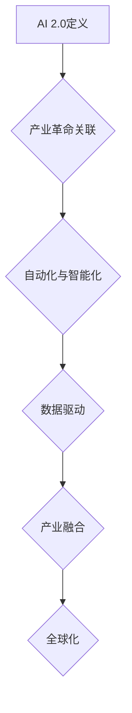

                 

关键词：李开复、AI 2.0、产业革命、人工智能技术、未来趋势、商业模式、技术挑战、政策法规、全球影响

> 摘要：本文将探讨李开复博士在其著作《AI 2.0时代的产业》中对人工智能发展的深刻见解。文章将分为多个部分，详细解析AI 2.0的核心概念、产业影响、技术挑战、应用场景以及未来发展趋势，旨在为读者提供全面而深入的理解。

## 1. 背景介绍

在过去的几十年里，人工智能（AI）已经经历了多个发展阶段。从最初的规则基础方法，到后来的统计学习，再到深度学习的崛起，每一次技术进步都推动了AI在各个领域的应用。李开复博士是AI领域的杰出人物，其著作《AI 2.0时代的产业》对当前AI技术的最新发展进行了全面而深入的阐述。

AI 2.0，顾名思义，是人工智能的第二次浪潮。它不仅仅是技术上的进步，更是对现有产业和社会结构的深远影响。李开复博士认为，AI 2.0时代的到来将带来一场前所未有的产业革命，改变我们的生活方式、工作方式以及全球经济的格局。

## 2. 核心概念与联系

### 2.1 AI 2.0的定义

AI 2.0是指基于深度学习、强化学习、自然语言处理等先进技术的人工智能系统。与第一代AI相比，AI 2.0具有更强的自主学习和适应能力，能够处理复杂的问题，并在多个领域实现自动化和智能化。

### 2.2 AI 2.0与产业革命的关联

AI 2.0不仅改变了技术的面貌，还引发了产业结构的深刻变革。李开复博士指出，AI 2.0将推动以下几个方面的产业革命：

1. **自动化与智能化**：AI 2.0使得自动化和智能化成为可能，许多传统行业将面临技术替代和升级的挑战。
2. **数据驱动**：AI 2.0依赖于海量数据的收集和分析，这将促进数据产业的繁荣。
3. **产业融合**：AI 2.0将推动不同产业的融合，创造新的商业模式和生态系统。
4. **全球化**：AI 2.0时代的产业将更加全球化，跨国合作和竞争将成为常态。

### 2.3 Mermaid流程图



## 3. 核心算法原理 & 具体操作步骤

### 3.1 算法原理概述

AI 2.0的核心在于其强大的学习能力和自我优化能力。以下是一些关键的算法原理：

1. **深度学习**：通过多层神经网络模拟人脑的学习过程，实现对复杂数据的处理和分类。
2. **强化学习**：通过与环境的交互来学习最佳策略，适用于需要决策的场景。
3. **自然语言处理**：利用深度学习技术理解和生成自然语言，用于语音识别、机器翻译等。

### 3.2 算法步骤详解

1. **数据收集**：收集大量标注数据，用于训练模型。
2. **模型设计**：设计合适的神经网络结构，选择合适的优化算法。
3. **模型训练**：使用梯度下降等优化算法训练模型，通过反向传播更新模型参数。
4. **模型评估**：使用验证集和测试集评估模型性能，调整模型参数。
5. **模型部署**：将训练好的模型部署到生产环境中，实现自动化和智能化。

### 3.3 算法优缺点

**优点**：

- **强大的学习能力**：能够处理复杂的问题。
- **自适应能力**：能够根据新的数据和环境进行自我优化。
- **高效性**：通过自动化和智能化提高生产效率。

**缺点**：

- **数据依赖性**：需要大量的高质量数据。
- **计算资源需求**：训练大型模型需要大量计算资源。
- **安全性问题**：模型可能受到恶意攻击和数据泄露的风险。

### 3.4 算法应用领域

AI 2.0的应用领域非常广泛，包括但不限于：

- **智能制造**：通过自动化生产线提高生产效率和产品质量。
- **智能医疗**：辅助医生进行诊断和治疗，提高医疗水平。
- **金融服务**：用于风险管理、信用评分等。
- **智能交通**：用于自动驾驶、智能交通管理。
- **智能家居**：用于家居设备自动化、智能安防等。

## 4. 数学模型和公式 & 详细讲解 & 举例说明

### 4.1 数学模型构建

AI 2.0的核心是数学模型，以下是一些关键的数学模型：

1. **多层感知机（MLP）**：
   $$ y = \sigma(\sigma(...\sigma(W_1 \cdot x + b_1) + b_0)...) $$
2. **卷积神经网络（CNN）**：
   $$ h_{c}^{l}(x) = f(\sum_{k} W_{k}^{l} \ast h_{c}^{l-1}(x) + b^{l}) $$
3. **循环神经网络（RNN）**：
   $$ h_{t} = \sigma(W \cdot [h_{t-1}, x_{t}] + b) $$

### 4.2 公式推导过程

以多层感知机（MLP）为例，推导其前向传播和反向传播的公式：

**前向传播**：

$$
\begin{aligned}
z_{l} &= W_{l} \cdot a_{l-1} + b_{l} \\
a_{l} &= \sigma(z_{l})
\end{aligned}
$$

**反向传播**：

$$
\begin{aligned}
\delta_{l} &= \frac{\partial L}{\partial z_{l}} \cdot \frac{\partial \sigma}{\partial z_{l}} \\
\delta_{l-1} &= (W_{l}^{T} \cdot \delta_{l}) \cdot \frac{\partial \sigma}{\partial z_{l-1}} \\
W_{l} &= W_{l} - \alpha \cdot \delta_{l} \cdot a_{l-1}^{T} \\
b_{l} &= b_{l} - \alpha \cdot \delta_{l}
\end{aligned}
$$

### 4.3 案例分析与讲解

以图像分类任务为例，使用卷积神经网络（CNN）进行模型训练和预测。首先，收集大量标注的图像数据，然后设计合适的CNN结构，进行模型训练。最后，使用训练好的模型进行图像分类，评估模型性能。

## 5. 项目实践：代码实例和详细解释说明

### 5.1 开发环境搭建

在Python环境中搭建TensorFlow开发环境，安装TensorFlow和必要的依赖库。

### 5.2 源代码详细实现

以下是一个简单的CNN模型实现，用于图像分类：

```python
import tensorflow as tf
from tensorflow.keras import layers

model = tf.keras.Sequential([
    layers.Conv2D(32, (3, 3), activation='relu', input_shape=(28, 28, 1)),
    layers.MaxPooling2D((2, 2)),
    layers.Conv2D(64, (3, 3), activation='relu'),
    layers.MaxPooling2D((2, 2)),
    layers.Conv2D(64, (3, 3), activation='relu'),
    layers.Flatten(),
    layers.Dense(64, activation='relu'),
    layers.Dense(10, activation='softmax')
])

model.compile(optimizer='adam',
              loss='sparse_categorical_crossentropy',
              metrics=['accuracy'])

model.fit(train_images, train_labels, epochs=5)
```

### 5.3 代码解读与分析

这段代码定义了一个简单的CNN模型，用于图像分类。模型由多个卷积层、池化层和全连接层组成。首先，使用卷积层对图像进行特征提取，然后使用池化层降低模型的复杂性。接着，使用全连接层进行分类预测。模型的编译和训练过程使用了TensorFlow的高层API，简化了模型构建和训练的复杂性。

### 5.4 运行结果展示

在训练完成后，评估模型的性能：

```python
test_loss, test_acc = model.evaluate(test_images,  test_labels, verbose=2)
print('\nTest accuracy:', test_acc)
```

输出结果展示了模型在测试集上的准确率。

## 6. 实际应用场景

AI 2.0在各个领域的实际应用场景如下：

### 6.1 智能制造

通过AI 2.0技术，实现生产线的自动化和智能化，提高生产效率和产品质量。例如，工业机器人可以自动完成装配、焊接等操作，减少人工干预。

### 6.2 智能医疗

AI 2.0可以辅助医生进行诊断和治疗，提高医疗水平。例如，通过深度学习技术，可以实现疾病的自动诊断，辅助医生做出更准确的诊断。

### 6.3 智能金融

AI 2.0可以用于风险管理、信用评分等。例如，通过分析大量金融数据，可以预测市场走势，为投资决策提供支持。

### 6.4 智能交通

AI 2.0可以用于自动驾驶、智能交通管理。例如，通过感知环境数据，自动驾驶车辆可以实现安全驾驶，减少交通事故。

### 6.5 智能家居

AI 2.0可以用于家居设备自动化、智能安防等。例如，通过语音识别技术，用户可以通过语音控制家居设备，提高生活质量。

## 7. 未来应用展望

### 7.1 产业变革

AI 2.0将引发产业变革，推动传统产业向智能化、自动化方向转型。例如，制造业、医疗、金融等领域的产业模式将发生深刻变化。

### 7.2 新兴产业

AI 2.0将催生新兴产业，如数据产业、智能硬件产业等。这些新兴产业的快速发展将带动整个经济的增长。

### 7.3 全球合作

AI 2.0时代的产业将更加全球化，跨国合作和竞争将成为常态。各国将加强在AI领域的合作，共同推动技术进步。

## 8. 工具和资源推荐

### 8.1 学习资源推荐

- 《深度学习》（Goodfellow, Bengio, Courville著）
- 《人工智能：一种现代方法》（Stuart J. Russell & Peter Norvig著）
- 《机器学习》（Tom Mitchell著）

### 8.2 开发工具推荐

- TensorFlow
- PyTorch
- Keras

### 8.3 相关论文推荐

- "Deep Learning" by Yann LeCun, Yoshua Bengio, and Geoffrey Hinton
- "Learning to Learn" by Andrew Ng
- "The Unreasonable Effectiveness of Deep Learning" by Rajat Monga

## 9. 总结：未来发展趋势与挑战

### 9.1 研究成果总结

AI 2.0技术取得了显著的研究成果，包括深度学习、强化学习、自然语言处理等领域的突破。这些技术为AI在各个领域的应用提供了强大的支持。

### 9.2 未来发展趋势

- AI 2.0将继续推动产业变革，加速智能化、自动化的进程。
- 新兴产业的快速发展将带动整个经济的增长。
- 全球合作将进一步加强，共同推动技术进步。

### 9.3 面临的挑战

- 数据隐私和安全问题需要引起重视。
- 技术伦理和道德问题需要得到有效解决。
- 全球竞争加剧，需要加强自主创新能力。

### 9.4 研究展望

AI 2.0研究将继续深入，探索更多先进的算法和模型。同时，跨学科研究将成为趋势，结合计算机科学、数学、心理学等领域的知识，推动AI技术的全面发展。

## 10. 附录：常见问题与解答

### 10.1 什么是AI 2.0？

AI 2.0是基于深度学习、强化学习、自然语言处理等先进技术的人工智能系统，具有更强的自主学习和适应能力。

### 10.2 AI 2.0将如何改变我们的生活方式？

AI 2.0将推动自动化和智能化的发展，改变我们的生活方式，提高生活质量。

### 10.3 AI 2.0在产业中的应用有哪些？

AI 2.0在智能制造、智能医疗、金融服务、智能交通、智能家居等领域具有广泛的应用。

### 10.4 AI 2.0面临哪些挑战？

AI 2.0面临数据隐私和安全、技术伦理和道德、全球竞争等挑战。

### 10.5 如何应对AI 2.0的挑战？

需要加强自主创新能力，推动技术进步；重视数据隐私和安全，制定相关法规和政策；加强国际合作，共同应对全球竞争。

---

作者：禅与计算机程序设计艺术 / Zen and the Art of Computer Programming

