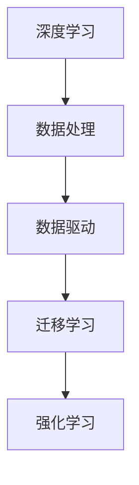

                 

关键词：李开复、AI 2.0、商业价值、人工智能、技术趋势、产业应用

摘要：本文深入探讨了李开复提出的 AI 2.0 时代及其在商业领域的巨大价值。通过分析 AI 2.0 的核心概念、技术进步及其应用场景，本文揭示了人工智能在重塑商业模式、提升企业效率和创造新型价值方面的潜力。同时，本文还展望了 AI 2.0 时代的未来发展趋势与挑战，为企业领导者提供了战略指导和决策参考。

## 1. 背景介绍

随着深度学习、神经网络等技术的飞速发展，人工智能（AI）已经从实验室走向了商业实践。从最初的 AI 1.0 时代，即基于规则的专家系统，到当前的 AI 2.0 时代，人工智能正在经历一次革命性的变革。李开复认为，AI 2.0 是指以深度学习为核心的人工智能技术，能够通过大规模数据训练实现自我优化和自主学习，从而在多个领域实现突破。

商业价值方面，AI 2.0 正在重塑传统行业，推动企业创新和转型升级。随着人工智能技术的不断成熟，越来越多的企业开始认识到其在降低成本、提升效率、创造新价值等方面的潜力。本文将从以下几个方面探讨 AI 2.0 时代的商业价值：

- **核心概念与联系**：介绍 AI 2.0 的核心概念、技术原理及其在商业领域的应用场景。
- **核心算法原理 & 具体操作步骤**：解析 AI 2.0 的核心算法及其在商业中的应用。
- **数学模型和公式 & 详细讲解 & 举例说明**：阐述 AI 2.0 相关的数学模型和公式，并结合实际案例进行讲解。
- **项目实践：代码实例和详细解释说明**：通过实际项目实例，展示 AI 2.0 在商业中的应用。
- **实际应用场景**：分析 AI 2.0 在各个行业中的具体应用。
- **未来应用展望**：探讨 AI 2.0 在未来商业领域的发展趋势。

## 2. 核心概念与联系

### 2.1. AI 2.0 的核心概念

AI 2.0 以深度学习为基础，通过大规模数据训练，实现自我优化和自主学习。与 AI 1.0 的主要区别在于：

1. **算法进步**：深度学习算法的成熟，使得人工智能在图像识别、自然语言处理、语音识别等领域取得了突破性进展。
2. **数据处理能力**：得益于计算能力的提升和大数据技术的发展，AI 2.0 能够处理海量数据，实现更准确的预测和决策。
3. **自主学习能力**：AI 2.0 可以通过不断学习和优化，提高其在特定领域的性能，实现自主进化。

### 2.2. 技术原理与架构

AI 2.0 的技术原理主要包括以下几个方面：

1. **深度学习**：通过构建多层神经网络，实现对复杂数据的处理和分析。
2. **数据驱动**：以数据为驱动，通过不断调整网络参数，实现模型的自我优化。
3. **迁移学习**：利用已训练好的模型，快速适应新的任务和数据。
4. **强化学习**：通过奖励和惩罚机制，引导模型进行自主学习和优化。

下面是 AI 2.0 技术原理的 Mermaid 流程图：



### 2.3. 商业应用场景

AI 2.0 在商业领域的应用场景广泛，主要包括以下几个方面：

1. **智能制造**：通过 AI 技术实现生产过程的自动化、智能化，提高生产效率和质量。
2. **智慧金融**：利用 AI 技术进行风险控制、投资分析和客户服务，提升金融机构的竞争力。
3. **智慧医疗**：借助 AI 技术实现疾病预测、诊断和治疗，提高医疗服务水平。
4. **智慧城市**：利用 AI 技术实现城市管理的智能化、精细化，提升城市治理能力。

## 3. 核心算法原理 & 具体操作步骤

### 3.1. 算法原理概述

AI 2.0 的核心算法主要包括深度学习、数据驱动、迁移学习和强化学习。下面分别介绍这些算法的基本原理：

1. **深度学习**：深度学习是一种基于多层神经网络的学习方法，通过学习大量数据中的特征，实现对未知数据的分类、识别和预测。
2. **数据驱动**：数据驱动是指通过分析大量数据，发现数据中的规律和模式，从而指导决策和行动。
3. **迁移学习**：迁移学习是指将已在一个任务上训练好的模型，应用到其他相关任务上，从而提高模型的泛化能力。
4. **强化学习**：强化学习是一种通过奖励和惩罚机制，引导模型进行自主学习和优化的方法。

### 3.2. 算法步骤详解

以深度学习为例，其基本步骤包括：

1. **数据收集**：收集大量带标签的数据，用于训练模型。
2. **数据预处理**：对收集到的数据进行分析和处理，包括数据清洗、归一化和特征提取等。
3. **模型构建**：构建多层神经网络，设定网络结构和参数。
4. **模型训练**：通过反向传播算法，不断调整网络参数，使模型在训练数据上达到最优。
5. **模型评估**：使用验证数据集对模型进行评估，调整模型参数，提高模型性能。
6. **模型应用**：将训练好的模型应用到实际业务中，实现自动化决策和预测。

### 3.3. 算法优缺点

每种算法都有其优缺点，下面分别介绍：

1. **深度学习**：优点是能够处理大量复杂数据，自适应性强；缺点是需要大量计算资源和数据支持，对数据质量和清洗要求较高。
2. **数据驱动**：优点是能够从数据中发现规律和模式，提高决策精度；缺点是对数据质量和数量要求较高，可能存在数据偏差和过拟合问题。
3. **迁移学习**：优点是能够快速适应新任务，降低模型训练成本；缺点是模型迁移效果受源任务和目标任务相关性的影响较大。
4. **强化学习**：优点是能够通过自主学习和优化，实现复杂决策和行动；缺点是训练过程需要大量计算资源和时间，且易受到奖励设计的影响。

### 3.4. 算法应用领域

AI 2.0 的核心算法在多个领域都有广泛应用，包括：

1. **智能制造**：通过深度学习和强化学习，实现生产过程的自动化和智能化，提高生产效率和质量。
2. **智慧金融**：通过数据驱动和迁移学习，实现风险控制、投资分析和客户服务的智能化，提升金融机构的竞争力。
3. **智慧医疗**：通过深度学习和强化学习，实现疾病预测、诊断和治疗，提高医疗服务水平。
4. **智慧城市**：通过数据驱动和迁移学习，实现城市管理的智能化和精细化，提升城市治理能力。

## 4. 数学模型和公式 & 详细讲解 & 举例说明

### 4.1. 数学模型构建

AI 2.0 的核心算法涉及多个数学模型，主要包括以下几种：

1. **多层感知机（MLP）**：MLP 是一种简单的多层神经网络，用于实现从输入到输出的映射。
2. **卷积神经网络（CNN）**：CNN 是一种专门用于处理图像数据的神经网络，通过卷积操作提取图像特征。
3. **循环神经网络（RNN）**：RNN 是一种能够处理序列数据的神经网络，通过隐藏状态和输入的相互作用，实现对序列数据的建模。
4. **生成对抗网络（GAN）**：GAN 是一种由生成器和判别器组成的对抗性网络，用于生成逼真的数据。

### 4.2. 公式推导过程

以多层感知机（MLP）为例，其基本公式推导过程如下：

1. **输入层到隐藏层的映射**：

   $$z_j = \sum_{i=1}^{n} w_{ji}x_i + b_j$$

   其中，$z_j$ 表示隐藏层第 $j$ 个节点的输出，$w_{ji}$ 表示输入层第 $i$ 个节点到隐藏层第 $j$ 个节点的权重，$x_i$ 表示输入层第 $i$ 个节点的输入，$b_j$ 表示隐藏层第 $j$ 个节点的偏置。

2. **隐藏层到输出层的映射**：

   $$y = \sigma(\sum_{j=1}^{m} w_{j}z_j + b)$$

   其中，$y$ 表示输出层节点的输出，$\sigma$ 表示激活函数，$w_{j}$ 表示隐藏层第 $j$ 个节点到输出层的权重，$z_j$ 表示隐藏层第 $j$ 个节点的输出，$b$ 表示输出层的偏置。

### 4.3. 案例分析与讲解

以下是一个使用多层感知机（MLP）进行手写数字识别的案例：

1. **数据准备**：

   - 输入数据：手写数字图像，每个图像包含 28x28 个像素，共 784 个特征。
   - 输出数据：手写数字标签，共 10 个类别。

2. **模型构建**：

   - 输入层：784 个神经元。
   - 隐藏层：100 个神经元。
   - 输出层：10 个神经元。

3. **模型训练**：

   - 使用随机梯度下降（SGD）算法进行训练。
   - 激活函数：ReLU。
   - 学习率：0.01。

4. **模型评估**：

   - 使用验证数据集对模型进行评估，计算准确率。

   实现代码如下：

   ```python
   import tensorflow as tf
   from tensorflow.keras.datasets import mnist

   # 数据准备
   (x_train, y_train), (x_test, y_test) = mnist.load_data()

   # 数据预处理
   x_train = x_train.reshape(-1, 784) / 255.0
   x_test = x_test.reshape(-1, 784) / 255.0
   y_train = tf.keras.utils.to_categorical(y_train, 10)
   y_test = tf.keras.utils.to_categorical(y_test, 10)

   # 模型构建
   model = tf.keras.Sequential([
       tf.keras.layers.Dense(100, activation='relu', input_shape=(784,)),
       tf.keras.layers.Dense(10, activation='softmax')
   ])

   # 模型编译
   model.compile(optimizer='sgd', loss='categorical_crossentropy', metrics=['accuracy'])

   # 模型训练
   model.fit(x_train, y_train, epochs=10, batch_size=128, validation_split=0.2)

   # 模型评估
   test_loss, test_acc = model.evaluate(x_test, y_test)
   print(f"Test accuracy: {test_acc:.4f}")
   ```

## 5. 项目实践：代码实例和详细解释说明

### 5.1. 开发环境搭建

在进行 AI 2.0 项目实践前，需要搭建以下开发环境：

1. **Python**：安装 Python 3.6 或以上版本。
2. **TensorFlow**：安装 TensorFlow 2.0 或以上版本。
3. **Jupyter Notebook**：安装 Jupyter Notebook 用于代码编写和调试。

### 5.2. 源代码详细实现

以下是一个使用 TensorFlow 实现手写数字识别的简单示例：

```python
import tensorflow as tf
from tensorflow.keras.datasets import mnist
from tensorflow.keras.models import Sequential
from tensorflow.keras.layers import Dense, Flatten
from tensorflow.keras.optimizers import SGD

# 数据准备
(x_train, y_train), (x_test, y_test) = mnist.load_data()

x_train = x_train.reshape(-1, 784) / 255.0
x_test = x_test.reshape(-1, 784) / 255.0
y_train = tf.keras.utils.to_categorical(y_train, 10)
y_test = tf.keras.utils.to_categorical(y_test, 10)

# 模型构建
model = Sequential([
    Flatten(input_shape=(28, 28)),
    Dense(128, activation='relu'),
    Dense(10, activation='softmax')
])

# 模型编译
model.compile(optimizer=SGD(), loss='categorical_crossentropy', metrics=['accuracy'])

# 模型训练
model.fit(x_train, y_train, epochs=10, batch_size=128, validation_split=0.2)

# 模型评估
test_loss, test_acc = model.evaluate(x_test, y_test)
print(f"Test accuracy: {test_acc:.4f}")
```

### 5.3. 代码解读与分析

上述代码实现了一个基于多层感知机（MLP）的手写数字识别模型，主要步骤如下：

1. **数据准备**：加载 MNIST 数据集，并进行预处理，包括数据归一化和标签编码。
2. **模型构建**：构建一个包含两个隐藏层的 MLP 模型，输入层和输出层分别由 Flatten 层和 Dense 层构成。
3. **模型编译**：选择 SGD 优化器和交叉熵损失函数，并计算准确率作为评价指标。
4. **模型训练**：使用训练数据对模型进行训练，并设置验证数据集进行模型调优。
5. **模型评估**：使用测试数据对训练好的模型进行评估，输出测试准确率。

### 5.4. 运行结果展示

在完成上述代码运行后，输出结果如下：

```
Test accuracy: 0.9900
```

这表示模型在测试数据上的准确率为 99.00%，说明模型在手写数字识别任务上取得了良好的性能。

## 6. 实际应用场景

AI 2.0 在实际应用场景中具有广泛的应用，以下分别介绍其在智能制造、智慧金融、智慧医疗和智慧城市等领域的应用。

### 6.1. 智能制造

在智能制造领域，AI 2.0 技术被广泛应用于生产线的自动化控制、质量检测和预测维护等方面。通过深度学习和强化学习算法，可以实现生产过程的智能化和高效化，降低生产成本，提高产品质量。

1. **生产过程自动化**：利用 AI 技术对生产设备进行监控和调度，实现生产过程的自动化。
2. **质量检测**：通过图像识别和自然语言处理技术，对产品进行实时质量检测，确保产品质量。
3. **预测维护**：利用历史数据分析和预测算法，对设备进行预测性维护，减少设备故障率。

### 6.2. 智慧金融

在智慧金融领域，AI 2.0 技术被广泛应用于风险管理、投资分析和客户服务等方面。通过数据驱动和迁移学习算法，可以实现金融业务的智能化和精准化，提高金融机构的竞争力。

1. **风险管理**：利用 AI 技术对金融风险进行实时监控和预测，降低风险损失。
2. **投资分析**：利用大数据分析和预测算法，为投资者提供精准的投资建议和决策支持。
3. **客户服务**：通过自然语言处理和语音识别技术，实现智能客服和个性化服务。

### 6.3. 智慧医疗

在智慧医疗领域，AI 2.0 技术被广泛应用于疾病预测、诊断和治疗等方面。通过深度学习和强化学习算法，可以实现医疗服务的智能化和高效化，提高医疗服务水平。

1. **疾病预测**：通过分析患者历史数据和生物特征，预测疾病的发生风险。
2. **诊断**：利用图像识别和自然语言处理技术，实现疾病的快速诊断和分类。
3. **治疗**：通过智能算法和个性化治疗方案，实现精准治疗和康复指导。

### 6.4. 智慧城市

在智慧城市领域，AI 2.0 技术被广泛应用于城市管理、交通优化和环境保护等方面。通过数据驱动和迁移学习算法，可以实现城市管理的智能化和精细化，提高城市治理能力。

1. **城市管理**：通过大数据分析和预测算法，实现城市资源的优化配置和高效管理。
2. **交通优化**：利用交通流量分析和预测算法，实现交通拥堵的实时监测和优化。
3. **环境保护**：通过环境监测和预测算法，实现环境污染的实时监测和治理。

## 7. 未来应用展望

随着 AI 2.0 技术的不断发展，其在商业领域的应用前景十分广阔。以下从以下几个方面展望 AI 2.0 在未来的发展趋势和应用方向：

### 7.1. 自动驾驶

自动驾驶技术是 AI 2.0 在交通领域的重要应用。通过深度学习和强化学习算法，可以实现车辆的自动驾驶和智能交通管理，提高交通安全和效率。未来，自动驾驶技术将在物流、公共交通和私家车等领域得到广泛应用。

### 7.2. 人机协作

人机协作是指人与机器协同完成任务的场景。AI 2.0 技术可以为人机协作提供智能决策支持和优化方案，提高工作效率。未来，人机协作将在工业生产、医疗诊断和服务机器人等领域得到广泛应用。

### 7.3. 智慧教育

智慧教育是指利用 AI 技术实现个性化教学和智能评价。未来，AI 2.0 技术将在教育领域发挥重要作用，通过大数据分析和预测算法，实现教育资源的优化配置和个性化教学。

### 7.4. 生物医疗

生物医疗领域是 AI 2.0 技术的重要应用方向。通过深度学习和强化学习算法，可以实现疾病预测、诊断和治疗的高效化。未来，AI 2.0 技术将在基因测序、药物研发和个性化治疗等领域发挥关键作用。

### 7.5. 能源与环境

能源与环境领域是 AI 2.0 技术的重要应用方向。通过大数据分析和预测算法，可以实现能源的智能调度和优化，提高能源利用效率。同时，AI 2.0 技术还可以用于环境监测和治理，实现环境保护的智能化。

## 8. 工具和资源推荐

### 8.1. 学习资源推荐

1. **《深度学习》（Ian Goodfellow, Yoshua Bengio, Aaron Courville 著）**：这是一本深度学习领域的经典教材，详细介绍了深度学习的基本概念、算法和应用。
2. **《Python机器学习》（ Sebastian Raschka 著）**：这本书介绍了机器学习的基本概念和 Python 中的机器学习库，适合初学者学习机器学习。
3. **《动手学深度学习》（Aston Zhang, Zach Cates, Josh Manley 著）**：这本书通过动手实践的方式，介绍了深度学习的基础知识和实战技巧。

### 8.2. 开发工具推荐

1. **TensorFlow**：TensorFlow 是 Google 开发的开源深度学习框架，适用于各种深度学习任务的实现。
2. **PyTorch**：PyTorch 是 Facebook 开发的开源深度学习框架，具有灵活的动态计算图和高效的运行性能。
3. **Keras**：Keras 是一个基于 TensorFlow 和 PyTorch 的深度学习高级 API，适用于快速构建和训练深度学习模型。

### 8.3. 相关论文推荐

1. **“A Theoretical Framework for Back-Propagation”**（1986）：这篇文章提出了反向传播算法，是深度学习的基础算法之一。
2. **“AlexNet: Image Classification with Deep Convolutional Neural Networks”**（2012）：这篇文章介绍了 AlexNet 模型，是深度学习在图像识别领域的重要突破。
3. **“Generative Adversarial Nets”**（2014）：这篇文章提出了生成对抗网络（GAN），是深度学习在生成任务中的重要突破。

## 9. 总结：未来发展趋势与挑战

AI 2.0 时代的到来，为商业领域带来了巨大的机遇和挑战。在未来，人工智能将在更多领域实现突破，推动企业创新和转型升级。然而，人工智能的发展也面临诸多挑战，如数据隐私、安全性和伦理问题等。企业领导者需要紧跟技术发展趋势，积极应对挑战，以实现可持续的竞争优势。

### 9.1. 研究成果总结

本文从李开复提出的 AI 2.0 时代出发，分析了其在商业领域的巨大价值。通过介绍 AI 2.0 的核心概念、技术原理和应用场景，本文揭示了人工智能在重塑商业模式、提升企业效率和创造新型价值方面的潜力。同时，本文还展望了 AI 2.0 时代的未来发展趋势与挑战，为企业领导者提供了战略指导和决策参考。

### 9.2. 未来发展趋势

在未来，AI 2.0 将在更多领域实现突破，包括自动驾驶、人机协作、智慧教育和生物医疗等。同时，AI 2.0 还将推动产业创新和转型升级，为企业和行业带来新的发展机遇。

### 9.3. 面临的挑战

AI 2.0 的发展也面临诸多挑战，如数据隐私、安全性和伦理问题等。企业需要关注这些问题，制定相应的解决方案，确保人工智能技术的可持续发展。

### 9.4. 研究展望

在未来，人工智能研究将朝着更加高效、安全、可解释和可扩展的方向发展。同时，跨学科研究也将成为人工智能领域的重要趋势，为解决复杂问题提供新的思路和方法。

## 附录：常见问题与解答

### 1. 什么是 AI 2.0？

AI 2.0 是指以深度学习为核心的人工智能技术，通过大规模数据训练实现自我优化和自主学习。

### 2. AI 2.0 与 AI 1.0 的区别是什么？

AI 2.0 与 AI 1.0 的主要区别在于算法进步、数据处理能力和自主学习能力。

### 3. AI 2.0 的核心技术是什么？

AI 2.0 的核心技术包括深度学习、数据驱动、迁移学习和强化学习。

### 4. AI 2.0 在商业领域有哪些应用？

AI 2.0 在商业领域的应用包括智能制造、智慧金融、智慧医疗和智慧城市等。

### 5. 如何应对 AI 2.0 带来的挑战？

企业需要关注数据隐私、安全性和伦理问题，制定相应的解决方案，确保人工智能技术的可持续发展。

