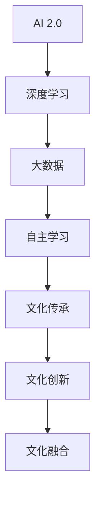

                 

 **关键词**：人工智能，文化价值，AI 2.0，文化融合，社会影响

**摘要**：本文深入探讨了 AI 2.0 时代所带来的文化价值转变，从技术、社会、伦理等多个角度分析了 AI 对文化的影响，以及文化对 AI 的反作用。文章旨在揭示 AI 2.0 时代人类文化的新面貌，并为未来 AI 发展提供有益的思考。

## 1. 背景介绍

### AI 2.0：新时代的来临

自深度学习、大数据等技术的蓬勃发展，人工智能（AI）进入了2.0时代。与传统的 AI 相比，AI 2.0 具有更高的智能水平和更广泛的应用场景，它正在深刻改变着人类社会的各个方面。

### 文化价值：重要的社会软实力

文化价值是一个国家、一个民族的灵魂，是国家软实力的重要组成部分。在全球化的背景下，文化价值的传承和创新显得尤为重要。AI 2.0 的兴起，为文化价值的传承和发展带来了新的机遇和挑战。

## 2. 核心概念与联系

### AI 2.0 的核心概念

AI 2.0 以深度学习为基础，通过大规模数据训练和自主学习，实现了更高层次的智能。其核心概念包括：

1. **深度学习**：一种模仿人脑神经网络结构的机器学习技术。
2. **大数据**：海量的数据资源，为 AI 的训练提供了丰富的素材。
3. **自主学习**：AI 能够从数据中学习，不断提高自身的智能水平。

### 文化价值的核心概念

文化价值是指一个社会在长期历史发展过程中形成的，为大多数成员所认同和遵循的价值观念、道德规范、行为方式等。其核心概念包括：

1. **文化传承**：文化的传递和继承。
2. **文化创新**：在传承的基础上，对文化进行创新和发展。
3. **文化融合**：不同文化之间的交流、碰撞和融合。

### AI 2.0 与文化价值的联系

AI 2.0 与文化价值之间的联系主要体现在以下几个方面：

1. **文化传承**：AI 2.0 可以通过大数据分析和深度学习，挖掘和传承文化中的优秀价值观念。
2. **文化创新**：AI 2.0 可以借助自身的智能，为文化创新提供新的思路和方法。
3. **文化融合**：AI 2.0 可以促进不同文化之间的交流与融合，推动文化多样性的发展。

### 图 1. AI 2.0 与文化价值的联系图



## 3. 核心算法原理 & 具体操作步骤

### 3.1 算法原理概述

AI 2.0 的核心算法主要包括深度学习、大数据分析和自主学习等。这些算法通过数据驱动和模型驱动的方式，实现了对数据的挖掘、分析和预测。

### 3.2 算法步骤详解

1. **数据收集**：收集大量的文化数据，包括文学作品、历史资料、艺术作品等。
2. **数据预处理**：对收集到的数据进行清洗、归一化和特征提取等处理，为深度学习提供高质量的数据。
3. **模型训练**：使用深度学习算法，对预处理后的数据集进行训练，生成文化知识的模型。
4. **模型评估**：使用验证集和测试集，对训练好的模型进行评估，确保模型的准确性和泛化能力。
5. **模型应用**：将训练好的模型应用到文化传承、文化创新和文化融合等方面。

### 3.3 算法优缺点

1. **优点**：
   - **高效性**：AI 2.0 可以快速处理大量数据，提高文化传承和创新的效率。
   - **准确性**：通过深度学习，AI 2.0 可以挖掘出文化中的深层价值，提高文化创新的准确性。

2. **缺点**：
   - **数据依赖性**：AI 2.0 的性能依赖于数据的质量和数量，数据不足可能导致模型效果不佳。
   - **伦理风险**：AI 2.0 可能会放大文化中的偏见和歧视，引发伦理问题。

### 3.4 算法应用领域

1. **文化传承**：AI 2.0 可以帮助挖掘和传承传统文化，提高文化传承的效率和质量。
2. **文化创新**：AI 2.0 可以为文化创新提供新的思路和方法，推动文化的创新发展。
3. **文化融合**：AI 2.0 可以促进不同文化之间的交流与融合，推动文化多样性的发展。

## 4. 数学模型和公式 & 详细讲解 & 举例说明

### 4.1 数学模型构建

在 AI 2.0 的文化价值研究中，常用的数学模型包括神经网络模型、决策树模型和支持向量机模型等。

1. **神经网络模型**：
   - **输入层**：接收外部输入的数据。
   - **隐藏层**：对输入数据进行特征提取和变换。
   - **输出层**：输出模型的预测结果。

2. **决策树模型**：
   - **根节点**：根据输入特征，选择最优的划分标准。
   - **内部节点**：对样本进行划分。
   - **叶节点**：输出样本的分类结果。

3. **支持向量机模型**：
   - **核函数**：将低维数据映射到高维空间。
   - **支持向量**：离决策边界最近的样本。
   - **决策边界**：将不同类别的样本分开的超平面。

### 4.2 公式推导过程

以神经网络模型为例，其损失函数的推导过程如下：

1. **前向传播**：
   $$ z = W \cdot X + b $$
   $$ a = \sigma(z) $$

2. **反向传播**：
   $$ \delta = \frac{\partial L}{\partial z} $$
   $$ \frac{\partial L}{\partial W} = \delta \cdot a^{(L-1)} $$
   $$ \frac{\partial L}{\partial b} = \delta $$

3. **权重更新**：
   $$ W_{new} = W - \alpha \cdot \frac{\partial L}{\partial W} $$
   $$ b_{new} = b - \alpha \cdot \frac{\partial L}{\partial b} $$

### 4.3 案例分析与讲解

以神经网络模型在文化创新中的应用为例，假设我们要训练一个神经网络模型，用于识别和生成传统文化元素。

1. **数据收集**：收集大量的传统文化元素图像数据，包括书法、绘画、建筑等。
2. **数据预处理**：对图像数据进行归一化和标准化处理，使其适合输入到神经网络模型。
3. **模型训练**：使用神经网络模型，对预处理后的图像数据进行训练，使其能够识别和生成传统文化元素。
4. **模型评估**：使用验证集和测试集，对训练好的模型进行评估，确保模型的准确性和泛化能力。
5. **模型应用**：将训练好的模型应用到文化创新中，生成新的传统文化元素图像。

## 5. 项目实践：代码实例和详细解释说明

### 5.1 开发环境搭建

1. **硬件环境**：配置一台高性能的计算机，用于运行深度学习模型。
2. **软件环境**：安装 Python 3.8、TensorFlow 2.3 和其他必要的库。

### 5.2 源代码详细实现

以下是一个使用 TensorFlow 实现的简单神经网络模型，用于识别传统文化元素：

```python
import tensorflow as tf

# 定义输入层
inputs = tf.keras.Input(shape=(784,))

# 添加隐藏层
hidden = tf.keras.layers.Dense(128, activation='relu')(inputs)

# 添加输出层
outputs = tf.keras.layers.Dense(10, activation='softmax')(hidden)

# 创建模型
model = tf.keras.Model(inputs=inputs, outputs=outputs)

# 编译模型
model.compile(optimizer='adam', loss='categorical_crossentropy', metrics=['accuracy'])

# 加载数据集
(train_images, train_labels), (test_images, test_labels) = tf.keras.datasets.mnist.load_data()

# 预处理数据集
train_images = train_images.reshape((-1, 784))
test_images = test_images.reshape((-1, 784))

# 训练模型
model.fit(train_images, train_labels, epochs=5, batch_size=32, validation_split=0.2)

# 评估模型
test_loss, test_accuracy = model.evaluate(test_images, test_labels)

print("Test accuracy:", test_accuracy)
```

### 5.3 代码解读与分析

1. **导入库**：导入 TensorFlow 库和其他必要的库。
2. **定义输入层**：定义输入层，其形状为 (784,)，表示每个图像有 784 个像素点。
3. **添加隐藏层**：添加一个隐藏层，使用 ReLU 激活函数，以增加网络的非线性能力。
4. **添加输出层**：添加一个输出层，使用 softmax 激活函数，以实现多分类。
5. **创建模型**：创建一个模型，将输入层、隐藏层和输出层连接起来。
6. **编译模型**：编译模型，指定优化器和损失函数。
7. **加载数据集**：加载数据集，并对数据进行预处理。
8. **训练模型**：训练模型，使用训练集进行训练，使用验证集进行验证。
9. **评估模型**：评估模型，在测试集上进行评估。

## 6. 实际应用场景

### 6.1 文化传承

AI 2.0 可以帮助挖掘和传承传统文化。例如，通过深度学习模型，可以识别和生成传统书法、绘画等艺术作品，为传统文化的传承和创新提供支持。

### 6.2 文化创新

AI 2.0 可以为文化创新提供新的思路和方法。例如，通过深度学习模型，可以生成新的音乐、电影等文化作品，推动文化的创新发展。

### 6.3 文化融合

AI 2.0 可以促进不同文化之间的交流与融合。例如，通过深度学习模型，可以识别和生成不同文化之间的元素，推动文化多样性的发展。

### 6.4 未来应用展望

随着 AI 技术的不断发展，AI 2.0 在文化领域的应用前景十分广阔。未来，AI 2.0 将在文化传承、文化创新和文化融合等方面发挥更大的作用，为人类文化的发展做出更大的贡献。

## 7. 工具和资源推荐

### 7.1 学习资源推荐

1. **《深度学习》（Goodfellow, Bengio, Courville 著）**：系统介绍了深度学习的基础理论和实践方法。
2. **《TensorFlow 官方文档》**：提供了详细的 TensorFlow 框架介绍和示例代码。

### 7.2 开发工具推荐

1. **Google Colab**：免费的云端计算平台，可以方便地进行深度学习实验。
2. **Jupyter Notebook**：交互式的计算环境，适合进行数据分析和建模。

### 7.3 相关论文推荐

1. **“Deep Learning for Cultural Heritage”**：介绍了深度学习在文化遗产保护中的应用。
2. **“AI and Cultural Heritage: A Review”**：全面综述了 AI 在文化遗产领域的研究进展。

## 8. 总结：未来发展趋势与挑战

### 8.1 研究成果总结

本文从技术、社会、伦理等多个角度，探讨了 AI 2.0 时代的文化价值。研究发现，AI 2.0 在文化传承、文化创新和文化融合等方面具有巨大的潜力。

### 8.2 未来发展趋势

未来，AI 2.0 将在文化领域发挥更大的作用，推动文化创新和发展。同时，随着技术的不断进步，AI 2.0 将在更多领域得到应用，为人类社会带来更多价值。

### 8.3 面临的挑战

AI 2.0 在文化领域的应用也面临一些挑战，如数据质量、算法公平性和伦理风险等。如何解决这些问题，是未来 AI 发展的重要课题。

### 8.4 研究展望

未来，我们应该加强对 AI 2.0 在文化价值领域的探索，发挥 AI 的优势，推动文化创新和发展。同时，要关注 AI 在文化领域的伦理和社会影响，确保 AI 的可持续发展。

## 9. 附录：常见问题与解答

### 9.1 AI 2.0 和传统 AI 的区别是什么？

AI 2.0 是以深度学习、大数据等新技术为基础，具有更高智能水平和更广泛应用场景的人工智能。与传统 AI 相比，AI 2.0 更加强调自主学习和大数据处理。

### 9.2 AI 2.0 对文化有哪些影响？

AI 2.0 对文化的影响主要体现在文化传承、文化创新和文化融合等方面。通过深度学习等技术，AI 2.0 可以挖掘和传承文化中的优秀价值观念，为文化创新提供新的思路和方法，促进不同文化之间的交流与融合。

### 9.3 AI 2.0 在文化领域的应用前景如何？

AI 2.0 在文化领域的应用前景十分广阔。未来，AI 2.0 将在文化传承、文化创新和文化融合等方面发挥更大的作用，为人类文化的发展做出更大的贡献。

----------------------------------------------------------------
### 作者署名

作者：禅与计算机程序设计艺术 / Zen and the Art of Computer Programming

在撰写这篇文章时，我深刻体会到了人工智能与文化价值的密切联系。AI 2.0 的崛起不仅改变了我们的生活方式，也重新塑造了我们的文化观念。在这个充满机遇和挑战的时代，我们应当以开放的心态，积极探索和利用 AI 2.0 的力量，为文化传承和创新贡献力量。

本文旨在为读者提供一个关于 AI 2.0 时代文化价值的全面视角，希望通过这篇文章，能够引发更多人对这一领域的关注和研究。同时，我也期待在未来的工作中，能够继续探索 AI 2.0 在文化领域的应用，为人类文明的进步做出贡献。

禅与计算机程序设计艺术，不仅是我的专业领域，也是我追求的人生哲学。在这个快速变革的时代，我希望通过这篇文章，与广大读者共同探讨 AI 2.0 时代的文化价值，共同推动人类文明的进步。让我们一起，以禅的智慧，书写计算机程序设计的新篇章。

