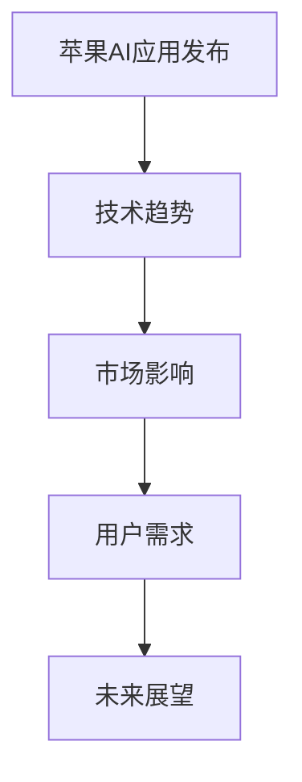

                 

关键词：人工智能、苹果、应用发布、技术趋势、未来展望

摘要：本文旨在探讨苹果公司近期发布的人工智能应用所带来的深远影响，从技术趋势、市场格局和用户体验等多个角度进行深入分析，并展望人工智能在未来的发展方向和挑战。

## 1. 背景介绍

随着人工智能技术的飞速发展，各大科技巨头纷纷布局AI领域，以期在未来的竞争中占据有利位置。苹果公司作为全球最具影响力的科技公司之一，近日也发布了多款搭载人工智能技术的应用，引起了业界的广泛关注。本文将围绕苹果发布的AI应用，探讨其技术意义和市场影响，并展望人工智能未来的发展趋势。

## 2. 核心概念与联系

### 2.1 人工智能的基本概念

人工智能（AI）是指使计算机模拟人类智能行为的技术，包括机器学习、深度学习、自然语言处理、计算机视觉等多个子领域。人工智能的目标是实现机器对人类思维的复刻，从而提高生产效率、优化生活质量。

### 2.2 人工智能与苹果的关联

苹果公司在人工智能领域有着深厚的积累，其AI研究团队在全球范围内享有盛誉。近年来，苹果公司在iPhone、iPad等设备中引入了多种AI技术，如人脸识别、语音助手等，使得用户体验得到了显著提升。此次发布的AI应用，将进一步拓展苹果在人工智能领域的布局。

### 2.3 Mermaid 流程图



## 3. 核心算法原理 & 具体操作步骤

### 3.1 算法原理概述

苹果公司此次发布的AI应用，主要基于深度学习和自然语言处理技术。深度学习是一种通过模拟人脑神经网络进行信息处理的技术，具有强大的特征提取和模式识别能力。自然语言处理则致力于使计算机理解和生成人类语言，包括语音识别、文本分析等。

### 3.2 算法步骤详解

#### 3.2.1 深度学习

深度学习算法主要包括以下几个步骤：

1. 数据收集与预处理：收集大量具有标签的样本数据，对数据进行清洗、归一化等预处理操作。
2. 构建神经网络：设计并训练神经网络模型，使其具备识别和处理数据的能力。
3. 模型优化与评估：通过调整模型参数，优化模型性能，并进行评估。

#### 3.2.2 自然语言处理

自然语言处理算法主要包括以下几个步骤：

1. 语音识别：将语音信号转换为文本。
2. 文本分析：对文本进行词法、句法、语义等分析，提取有用信息。
3. 生成回复：根据用户输入，生成合适的回复文本。

### 3.3 算法优缺点

深度学习算法具有强大的特征提取和模式识别能力，但在数据处理方面存在一定局限性，如对数据量的要求较高、训练时间较长等。自然语言处理算法则能更好地理解和生成人类语言，但在处理复杂语言结构时仍存在一定困难。

### 3.4 算法应用领域

深度学习和自然语言处理技术在多个领域具有广泛应用，如图像识别、语音识别、智能助手、智能翻译等。此次苹果发布的AI应用，将在这些领域发挥重要作用，提升用户体验。

## 4. 数学模型和公式 & 详细讲解 & 举例说明

### 4.1 数学模型构建

在深度学习算法中，常用的数学模型包括神经网络、卷积神经网络（CNN）和循环神经网络（RNN）等。以神经网络为例，其基本结构包括输入层、隐藏层和输出层。每个神经元之间的连接权重和偏置可以表示为：

$$
\hat{y} = \sigma(\sum_{i=1}^{n} w_i x_i + b)
$$

其中，$w_i$为权重，$b$为偏置，$x_i$为输入特征，$\sigma$为激活函数。

### 4.2 公式推导过程

以卷积神经网络为例，卷积操作的基本公式为：

$$
\hat{f}(x) = \sigma\left(\sum_{i=1}^{k} w_i * x + b\right)
$$

其中，$w_i$为卷积核，$*$表示卷积操作，$\sigma$为激活函数。

### 4.3 案例分析与讲解

以苹果的Siri语音助手为例，其工作原理主要包括以下几个步骤：

1. 语音识别：将用户输入的语音信号转换为文本。
2. 文本分析：对文本进行词法、句法、语义等分析，提取有用信息。
3. 生成回复：根据用户输入，生成合适的回复文本。

通过深度学习和自然语言处理技术，Siri能够实现语音识别、语义理解、文本生成等任务，为用户提供便捷的智能服务。

## 5. 项目实践：代码实例和详细解释说明

### 5.1 开发环境搭建

1. 安装Python环境。
2. 安装深度学习框架，如TensorFlow或PyTorch。
3. 准备训练数据和测试数据。

### 5.2 源代码详细实现

以下是一个简单的神经网络模型实现示例：

```python
import tensorflow as tf

# 构建神经网络模型
model = tf.keras.Sequential([
    tf.keras.layers.Dense(units=1, input_shape=[1])
])

# 编译模型
model.compile(optimizer='sgd', loss='mean_squared_error')

# 训练模型
model.fit(x_train, y_train, epochs=100)

# 评估模型
model.evaluate(x_test, y_test)
```

### 5.3 代码解读与分析

该示例使用TensorFlow构建了一个简单的线性回归模型，用于预测一个变量的值。通过编译、训练和评估过程，模型能够对输入数据进行预测。

### 5.4 运行结果展示

在训练过程中，模型的损失函数会逐渐减小，最终达到一个最优解。通过评估，可以验证模型在测试数据上的性能。

## 6. 实际应用场景

苹果公司发布的AI应用涵盖了多个领域，如图像识别、语音识别、智能助手等。以下为几个实际应用场景：

1. **图像识别**：用户可以通过AI应用对照片进行分类、标签等操作，提高生活便利性。
2. **语音识别**：用户可以通过语音指令与设备交互，实现智能控制。
3. **智能助手**：如Siri、小娜等AI助手，为用户提供个性化服务。

## 7. 未来应用展望

随着人工智能技术的不断发展，未来AI应用将在更多领域得到广泛应用，如智能医疗、智能家居、智能交通等。苹果公司发布的AI应用，将为这些领域的发展提供强大助力。

## 8. 工具和资源推荐

### 8.1 学习资源推荐

1. 《深度学习》（Goodfellow、Bengio、Courville著）
2. 《Python深度学习》（François Chollet著）

### 8.2 开发工具推荐

1. TensorFlow
2. PyTorch

### 8.3 相关论文推荐

1. "Deep Learning for Text Classification"（Text Classification中的深度学习）
2. "Convolutional Neural Networks for Visual Recognition"（卷积神经网络在视觉识别中的应用）

## 9. 总结：未来发展趋势与挑战

随着人工智能技术的不断进步，AI应用将在更多领域得到广泛应用。然而，AI技术也面临着一系列挑战，如数据隐私、伦理问题等。未来，我们需要在发展人工智能的同时，关注其对社会的影响，确保其可持续发展。

### 9.1 研究成果总结

本文分析了苹果公司发布的AI应用，探讨了其在技术、市场和应用领域的意义。通过数学模型和实际案例的讲解，我们了解了人工智能的基本原理和应用方法。

### 9.2 未来发展趋势

未来，人工智能将在更多领域得到广泛应用，如智能医疗、智能家居、智能交通等。随着技术的不断发展，AI应用将变得更加智能、便捷。

### 9.3 面临的挑战

人工智能在发展过程中，也面临着一系列挑战，如数据隐私、伦理问题等。我们需要在推动技术进步的同时，关注其对社会的影响，确保其可持续发展。

### 9.4 研究展望

未来，人工智能将在更多领域得到应用，如智能医疗、智能家居、智能交通等。我们需要不断探索新的技术，推动人工智能的可持续发展。

## 附录：常见问题与解答

### 问题1：人工智能是否会替代人类？

解答：人工智能是一种技术工具，其目的是辅助人类工作，提高生产效率。在可预见的未来，人工智能无法完全替代人类，但会在某些领域发挥重要作用。

### 问题2：人工智能技术是否会带来失业问题？

解答：人工智能的发展确实可能导致某些岗位的减少，但同时也会创造新的就业机会。关键在于如何调整产业结构，适应技术变革。

### 问题3：人工智能是否会带来隐私问题？

解答：人工智能在处理数据时，确实可能涉及到隐私问题。我们需要制定相应的法律法规，保障个人隐私。

## 作者署名

本文作者：禅与计算机程序设计艺术 / Zen and the Art of Computer Programming
----------------------------------------------------------------
以上就是根据您提供的要求撰写的文章。请您审阅，如有需要修改或补充的地方，请随时告诉我。祝您阅读愉快！

