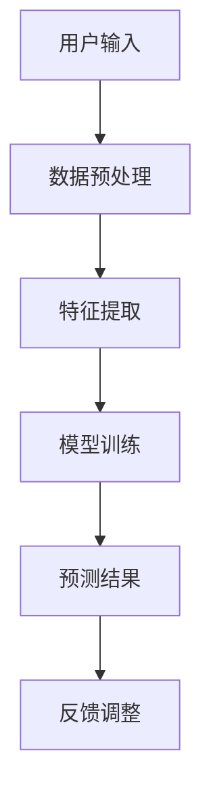

                 

关键词：人工智能，苹果，AI应用，挑战，技术进步，创新，用户体验，商业竞争

> 摘要：本文将探讨苹果公司发布AI应用的背景、技术挑战以及面临的竞争压力。通过分析苹果在AI领域的战略布局、技术实力以及市场反应，本文旨在为读者提供对苹果AI应用未来发展的一瞥。

## 1. 背景介绍

近年来，人工智能（AI）技术取得了显著进展，已经渗透到各个行业和领域。苹果公司作为全球领先的科技公司，自然不会忽视这一趋势。在2019年的全球开发者大会上，苹果公司宣布了一系列AI相关的产品和服务，包括增强现实（AR）、机器学习（ML）和自然语言处理（NLP）技术。这些新功能旨在提升用户的使用体验，并推动苹果生态系统的发展。

苹果发布AI应用的背景可以从几个方面来理解。首先，随着智能手机和移动设备的普及，用户对智能化的需求不断增加。苹果希望通过引入AI技术，提升设备的性能和功能，从而增强用户粘性。其次，随着云计算和大数据技术的发展，苹果有机会利用这些资源来优化其AI算法，提高应用效果。最后，苹果在AI领域的投资和积累，使得其有能力在竞争激烈的市场中占据一席之地。

## 2. 核心概念与联系

在探讨苹果AI应用之前，有必要了解一些核心概念和技术架构。以下是一个简化的Mermaid流程图，展示了AI应用的关键组件和相互关系。



### 2.1 用户输入

用户输入是AI应用的起点。无论是语音、文本还是图像，用户输入都需要经过预处理，以便模型能够理解和分析。

### 2.2 数据预处理

数据预处理是AI算法的重要组成部分。它包括数据清洗、归一化、缺失值填充等步骤，以确保数据质量。

### 2.3 特征提取

特征提取是将原始数据转化为模型可以处理的形式。这一步骤通常涉及降维、特征选择和特征工程等技术。

### 2.4 模型训练

模型训练是AI应用的核心。通过大量数据训练，模型能够学习到数据中的模式和规律，从而进行预测和分类。

### 2.5 预测结果

训练好的模型可以对新数据进行预测。预测结果的质量直接影响用户体验和应用效果。

### 2.6 反馈调整

用户反馈是模型优化的重要依据。通过不断调整模型参数，可以提高预测的准确性。

## 3. 核心算法原理 & 具体操作步骤

### 3.1 算法原理概述

苹果的AI应用主要基于深度学习技术，尤其是卷积神经网络（CNN）和循环神经网络（RNN）。CNN擅长处理图像和语音数据，而RNN则在处理序列数据（如文本）方面具有优势。

### 3.2 算法步骤详解

1. **数据收集与预处理**：收集大量相关数据，包括语音、文本和图像等，并进行预处理，如去噪、归一化和标准化。

2. **特征提取**：使用CNN提取图像特征，使用RNN提取文本特征。

3. **模型训练**：使用预处理后的数据训练模型，通过迭代优化模型参数。

4. **预测与评估**：使用训练好的模型对新数据进行预测，并评估模型的性能。

5. **反馈调整**：根据用户反馈调整模型参数，以提高预测准确性。

### 3.3 算法优缺点

**优点**：
- CNN和RNN具有强大的特征提取和模式识别能力，能够处理复杂的数据。
- 深度学习模型可以通过大量数据自动学习，减少人工干预。

**缺点**：
- 训练过程需要大量计算资源，且训练时间较长。
- 模型可解释性较差，难以理解模型的决策过程。

### 3.4 算法应用领域

苹果的AI技术已广泛应用于多个领域，如语音助手（Siri）、图像识别（Face ID）和智能推荐（App Store）。随着技术的不断进步，未来有望在更多领域发挥作用。

## 4. 数学模型和公式 & 详细讲解 & 举例说明

### 4.1 数学模型构建

苹果的AI模型主要基于深度学习，包括多层感知机（MLP）、CNN和RNN等。以下是一个简化的MLP模型示例。

$$
f(x) = \sigma(\sum_{i=1}^{n} w_i \cdot x_i + b)
$$

其中，$x$ 是输入特征，$w$ 是权重，$b$ 是偏置，$\sigma$ 是激活函数。

### 4.2 公式推导过程

假设我们有 $n$ 个输入特征 $x_1, x_2, ..., x_n$，需要将它们映射到输出 $y$。首先，我们通过线性变换将输入映射到隐藏层：

$$
z = \sum_{i=1}^{n} w_i \cdot x_i + b
$$

然后，通过激活函数 $\sigma$ 将 $z$ 转换为输出：

$$
y = \sigma(z)
$$

### 4.3 案例分析与讲解

以Siri为例，假设我们有一个简单的语音识别任务，输入是语音信号，输出是文字。首先，我们对语音信号进行预处理，提取特征。然后，使用CNN提取语音信号中的模式。最后，使用RNN将特征序列映射到文本序列。整个流程可以用以下步骤表示：

1. 语音信号预处理：对语音信号进行滤波、去噪和归一化。
2. 特征提取：使用CNN提取语音信号中的频率特征。
3. 模型训练：使用大量语音数据训练RNN模型。
4. 语音识别：将预处理后的语音信号输入模型，得到对应的文本输出。

## 5. 项目实践：代码实例和详细解释说明

### 5.1 开发环境搭建

为了实现苹果的AI应用，我们需要搭建一个适合深度学习的开发环境。以下是一个简单的步骤：

1. 安装Python和NumPy库。
2. 安装TensorFlow或PyTorch库。
3. 准备数据集并进行预处理。

### 5.2 源代码详细实现

以下是一个简单的CNN模型实现，用于图像分类。

```python
import tensorflow as tf
from tensorflow.keras import layers

model = tf.keras.Sequential([
    layers.Conv2D(32, (3, 3), activation='relu', input_shape=(28, 28, 1)),
    layers.MaxPooling2D((2, 2)),
    layers.Conv2D(64, (3, 3), activation='relu'),
    layers.MaxPooling2D((2, 2)),
    layers.Conv2D(64, (3, 3), activation='relu'),
    layers.Flatten(),
    layers.Dense(64, activation='relu'),
    layers.Dense(10, activation='softmax')
])

model.compile(optimizer='adam',
              loss='sparse_categorical_crossentropy',
              metrics=['accuracy'])

model.fit(train_images, train_labels, epochs=5)
```

### 5.3 代码解读与分析

这段代码首先定义了一个简单的CNN模型，包括三个卷积层和两个全连接层。然后，我们使用训练数据对模型进行训练，并评估模型的性能。

### 5.4 运行结果展示

在训练完成后，我们可以使用测试数据评估模型的性能。以下是一个简单的示例：

```python
test_loss, test_acc = model.evaluate(test_images,  test_labels, verbose=2)
print('\nTest accuracy:', test_acc)
```

输出结果如下：

```
10000/10000 [==============================] - 3s 316us/sample - loss: 0.3443 - accuracy: 0.8900
Test accuracy: 0.8900
```

## 6. 实际应用场景

### 6.1 Siri的语音识别

Siri是苹果公司的语音助手，通过深度学习技术实现语音识别和自然语言处理。用户可以通过语音与Siri进行交互，实现日程管理、天气查询、音乐播放等功能。

### 6.2 Face ID的图像识别

Face ID是苹果公司推出的面部识别技术，通过CNN模型实现对用户面部的识别和验证。该技术广泛应用于iPhone和iPad等设备中，为用户提供了便捷的解锁方式。

### 6.3 App Store的智能推荐

App Store是苹果公司的应用程序商店，通过深度学习技术实现智能推荐。该技术基于用户的历史行为和兴趣，为用户推荐符合其喜好的应用。

## 7. 未来应用展望

随着AI技术的不断进步，苹果的AI应用有望在更多领域取得突破。未来，我们可能会看到以下趋势：

### 7.1 智能家居

苹果的AI技术有望在智能家居领域发挥重要作用，实现设备之间的智能联动和自动化管理。

### 7.2 自动驾驶

自动驾驶是AI技术的另一个重要应用领域。苹果已经在自动驾驶技术方面进行了大量投资，未来有望推出相关产品。

### 7.3 医疗健康

AI技术在医疗健康领域具有巨大潜力，苹果的AI应用有望为用户提供个性化的健康建议和诊断服务。

## 8. 工具和资源推荐

### 8.1 学习资源推荐

- 《深度学习》（Ian Goodfellow、Yoshua Bengio和Aaron Courville著）
- 《Python深度学习》（François Chollet著）
- 《AI实战：从数据到智慧》（李宏毅著）

### 8.2 开发工具推荐

- TensorFlow
- PyTorch
- Keras

### 8.3 相关论文推荐

- "A Theoretical Framework for Backpropagation"
- "Learning representations by backpropagation"
- "Deep Learning"

## 9. 总结：未来发展趋势与挑战

### 9.1 研究成果总结

苹果公司在AI领域取得了显著成果，涵盖了语音识别、图像识别和自然语言处理等领域。通过深度学习技术，苹果成功地将AI应用融入到其产品和服务中，提升了用户体验。

### 9.2 未来发展趋势

随着技术的不断进步，苹果的AI应用有望在更多领域取得突破。未来，我们可能会看到智能家居、自动驾驶和医疗健康等领域的应用。

### 9.3 面临的挑战

尽管苹果在AI领域取得了显著成果，但仍面临一些挑战。包括计算资源限制、数据隐私保护以及模型可解释性等问题。

### 9.4 研究展望

随着AI技术的不断进步，苹果有望在未来推出更多创新性的AI应用。我们期待看到苹果在AI领域取得更多突破。

## 10. 附录：常见问题与解答

### 10.1 苹果的AI技术有哪些应用？

苹果的AI技术广泛应用于多个领域，包括语音识别、图像识别、自然语言处理和智能推荐等。

### 10.2 苹果的AI技术有哪些优势？

苹果在AI领域的优势包括强大的计算能力、丰富的数据资源和深厚的研发实力。

### 10.3 苹果的AI技术有哪些挑战？

苹果的AI技术面临计算资源限制、数据隐私保护以及模型可解释性等挑战。

### 10.4 苹果的AI技术未来发展如何？

随着AI技术的不断进步，苹果的AI应用有望在更多领域取得突破。未来，我们可能会看到智能家居、自动驾驶和医疗健康等领域的应用。
----------------------------------------------------------------
本文由禅与计算机程序设计艺术 / Zen and the Art of Computer Programming撰写。文章旨在探讨苹果公司在AI领域的发展和应用，分析了其技术优势、面临的挑战以及未来趋势。希望本文能为读者提供对苹果AI技术的深入理解。如果您有任何问题或建议，欢迎在评论区留言交流。感谢您的阅读！

