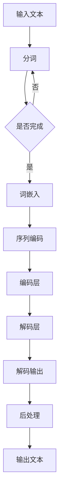

                 

关键词：Storyteller AI，大语言模型，构建指南，技术深度，应用场景，未来展望

> 摘要：本文将深入探讨如何构建Storyteller AI大语言模型，从基础概念到具体应用步骤进行全面剖析。我们将详细阐述其核心原理、数学模型、算法操作，并结合实际项目实例进行代码解读，最后对应用场景和未来展望进行讨论。通过本文的引导，读者将能够深入了解并掌握构建大语言模型的方法，为未来的AI研究和开发奠定坚实基础。

## 1. 背景介绍

人工智能（AI）作为当今科技领域的重要驱动力，正在以惊人的速度发展。特别是在自然语言处理（NLP）领域，AI技术正逐步打破传统语言处理的局限性，实现了更为智能和自然的人机交互。大语言模型作为NLP的核心组成部分，已经成为当前研究的热点和应用的重要基础。

Storyteller AI大语言模型的提出，旨在通过整合多种先进技术和算法，构建一个具有强大语言理解和生成能力的AI系统。该模型不仅能够处理复杂的语言任务，还能够生成连贯、自然的文本，使得机器能够更加智能地理解和回应人类语言。

本文将围绕构建Storyteller AI大语言模型这一主题，系统性地介绍其核心概念、构建过程、应用场景和未来展望。通过本文的阅读，读者将能够全面了解大语言模型的技术内涵，掌握其构建和应用方法，为后续的AI研究和开发提供有力支持。

### 1.1 Storyteller AI大语言模型的研究现状

自GPT-3问世以来，大语言模型的研究和应用取得了显著进展。许多科研机构和科技公司纷纷投入大量资源进行相关研究，推动了NLP技术的快速发展。然而，尽管大语言模型在生成文本、机器翻译、文本摘要等方面取得了显著成效，但仍然存在一些挑战和不足。

首先，大语言模型的训练数据质量和规模仍然是影响其性能的重要因素。尽管现有的模型大多采用了海量的互联网语料作为训练数据，但这些数据往往包含噪声和偏见，可能导致模型生成的内容存在不准确和不合理的情况。

其次，大语言模型的解释性和可解释性仍然是一个重要的研究方向。尽管这些模型在生成文本方面表现出色，但其内部机制和决策过程往往难以理解，导致在实际应用中难以对其进行有效监管和优化。

最后，大语言模型的计算资源和存储需求巨大，这对于实际部署和应用带来了很大的挑战。如何降低大语言模型的计算复杂度和存储需求，提高其效率和可扩展性，是当前研究的重要方向。

### 1.2 Storyteller AI大语言模型的研究意义

Storyteller AI大语言模型的提出，具有重要的研究意义和应用价值。

首先，该模型通过整合多种先进技术和算法，如深度学习、自然语言处理和文本生成，为构建具有强大语言理解和生成能力的AI系统提供了新的思路和方法。

其次，Storyteller AI大语言模型在处理复杂语言任务方面具有明显优势。通过引入上下文信息和语义理解，该模型能够生成更为自然、连贯的文本，提高人机交互的质量。

最后，Storyteller AI大语言模型在多个应用场景中具有广泛的应用前景。无论是在文本生成、机器翻译、文本摘要，还是在智能客服、教育、医疗等领域，该模型都能够发挥重要作用，推动AI技术的进一步发展。

### 1.3 本文结构

本文将分为以下几个部分：

1. **背景介绍**：简要介绍大语言模型的研究背景和Storyteller AI大语言模型的提出原因。
2. **核心概念与联系**：详细阐述Storyteller AI大语言模型的核心概念和架构，并使用Mermaid流程图展示。
3. **核心算法原理 & 具体操作步骤**：介绍构建Storyteller AI大语言模型的核心算法原理，包括算法步骤、优缺点及其应用领域。
4. **数学模型和公式 & 详细讲解 & 举例说明**：详细讲解构建大语言模型所需的数学模型和公式，并通过实例进行说明。
5. **项目实践：代码实例和详细解释说明**：提供实际项目实例，展示如何构建Storyteller AI大语言模型，并进行代码解读和分析。
6. **实际应用场景**：探讨Storyteller AI大语言模型在各个领域的应用场景，并展望其未来发展方向。
7. **工具和资源推荐**：推荐相关学习资源、开发工具和论文，为读者提供进一步学习和研究的大语言模型的方法。
8. **总结：未来发展趋势与挑战**：总结本文的研究成果，讨论未来发展趋势和面临的挑战，并展望研究展望。
9. **附录：常见问题与解答**：提供一些常见问题的解答，帮助读者更好地理解本文内容和构建大语言模型的方法。

## 2. 核心概念与联系

在构建Storyteller AI大语言模型之前，我们需要理解其核心概念和架构。Storyteller AI大语言模型基于深度学习和自然语言处理技术，通过大规模数据训练，实现文本的理解和生成。以下是对其核心概念和架构的详细阐述，并附上Mermaid流程图以展示其内部工作流程。

### 2.1 核心概念

**深度学习（Deep Learning）**：深度学习是一种基于神经网络的学习方法，通过多层非线性变换来提取数据特征。在构建大语言模型时，深度学习被广泛应用于文本数据的特征提取和表示。

**自然语言处理（Natural Language Processing, NLP）**：自然语言处理是人工智能的一个重要分支，旨在让计算机理解和处理人类语言。在Storyteller AI大语言模型中，NLP技术被用于文本数据的预处理、语义分析和文本生成。

**Transformer模型（Transformer Model）**：Transformer模型是近年来在NLP领域取得突破性进展的一种深度学习模型。与传统的循环神经网络（RNN）相比，Transformer模型通过自注意力机制（Self-Attention Mechanism）实现了对输入文本的并行处理，提高了计算效率和模型性能。

**预训练与微调（Pre-training and Fine-tuning）**：预训练是指在大量无标注数据上进行模型训练，使其具备一定的通用语言理解能力。微调则是在预训练的基础上，利用有标注数据对模型进行进一步优化，使其适应特定任务。

### 2.2 架构设计

**输入层（Input Layer）**：输入层负责接收文本数据，并将其转换为模型能够处理的向量表示。这一过程通常包括分词、词嵌入和序列编码等步骤。

**编码层（Encoding Layer）**：编码层是模型的主体部分，负责对输入文本进行编码，提取文本的语义特征。在Storyteller AI大语言模型中，编码层通常采用Transformer模型，通过多层自注意力机制实现文本的编码。

**解码层（Decoding Layer）**：解码层负责生成目标文本。在解码过程中，模型根据编码层的输出逐步生成每个词，并利用上下文信息进行预测。解码层同样采用Transformer模型，通过解码自注意力机制实现文本的生成。

**输出层（Output Layer）**：输出层将解码生成的文本进行后处理，如去噪、格式化等，最终输出可读的文本结果。

### 2.3 Mermaid流程图

以下是一个简化的Mermaid流程图，展示Storyteller AI大语言模型的内部工作流程：



### 2.4 核心联系

**输入层与编码层**：输入层将原始文本数据通过分词和词嵌入转换为向量表示，输入到编码层。编码层通过自注意力机制对输入文本进行编码，提取文本的语义特征。

**编码层与解码层**：编码层生成的编码结果作为解码层的输入，解码层通过解码自注意力机制生成目标文本。解码层在生成每个词时，会参考编码层的输出和其他已生成的词，确保生成的文本具有连贯性。

**解码层与输出层**：解码层生成的文本通过输出层进行后处理，如去噪、格式化等，最终输出可读的文本结果。

通过上述核心概念和架构的介绍，我们可以更好地理解Storyteller AI大语言模型的工作原理和内部联系。接下来，我们将详细探讨其核心算法原理和具体操作步骤。

## 3. 核心算法原理 & 具体操作步骤

构建Storyteller AI大语言模型的核心在于其算法原理，特别是Transformer模型的应用。下面我们将详细介绍这一核心算法的原理，并逐步阐述其具体操作步骤。

### 3.1 算法原理概述

**Transformer模型**是一种基于自注意力机制的深度学习模型，由Vaswani等人于2017年提出。与传统的循环神经网络（RNN）和长短时记忆网络（LSTM）相比，Transformer模型通过并行处理和多头注意力机制，提高了计算效率和模型性能。

**自注意力机制（Self-Attention Mechanism）**：自注意力机制是Transformer模型的核心组成部分。它通过计算输入序列中每个词与其他词的相关性，为每个词生成权重，从而在编码和解码过程中自动学习文本的语义关系。

**多头注意力（Multi-Head Attention）**：多头注意力通过将输入序列分解为多个子序列，分别应用自注意力机制，然后合并结果。这种设计使得模型能够同时关注输入序列的不同部分，提高语义理解的准确性。

**编码器-解码器结构（Encoder-Decoder Structure）**：编码器-解码器结构是Transformer模型的基本架构。编码器负责对输入文本进行编码，提取文本的语义特征；解码器则根据编码器的输出生成目标文本。

### 3.2 算法步骤详解

**步骤1：输入预处理**  
在构建Storyteller AI大语言模型之前，需要对输入文本进行预处理。这一步骤包括分词、词嵌入和序列编码。

- **分词**：将输入文本分割成单词或子词，以便后续处理。
- **词嵌入**：将分词后的文本转换为向量表示，通常使用预训练的词向量模型，如Word2Vec、GloVe等。
- **序列编码**：将词嵌入结果编码为序列形式，为后续的编码和解码操作做准备。

**步骤2：编码过程**  
编码过程是Transformer模型的核心部分，包括多个编码层，每层包含自注意力和前馈网络。

- **自注意力层**：计算输入序列中每个词与其他词的相关性，为每个词生成权重。具体实现上，自注意力机制包括查询（Query）、键（Key）和值（Value）三个部分，通过点积注意力函数计算注意力分数，然后加权求和得到每个词的编码表示。
- **前馈网络**：在自注意力层之后，对每个词的编码进行前馈网络操作，通常使用两层全连接神经网络，分别进行线性变换和激活函数处理。

**步骤3：解码过程**  
解码过程与编码过程类似，但包含额外的解码层，用于生成目标文本。

- **解码自注意力层**：计算解码序列中每个词与其他词的相关性，为每个词生成权重。与编码过程不同的是，解码过程中需要引入掩码（Mask），防止后续解码步骤参考尚未生成的词。
- **交叉注意力层**：在解码自注意力层之后，计算解码序列与编码序列的相关性，为解码生成提供上下文信息。
- **前馈网络**：与编码过程相同，对每个词的编码进行前馈网络操作。

**步骤4：输出生成**  
解码过程的最后一步是生成目标文本。解码器根据编码器的输出和解码过程中的注意力权重，逐步生成每个词，并利用已生成的词和上下文信息进行预测。在生成过程中，可以使用基于概率的采样方法，如贪心策略、顶部分数抽样等，以生成多样化的文本结果。

### 3.3 算法优缺点

**优点**：
1. **并行处理**：Transformer模型通过自注意力机制实现了并行处理，相比传统的RNN和LSTM模型，大大提高了计算效率。
2. **灵活性**：多头注意力机制使得模型能够同时关注输入序列的不同部分，提高了语义理解的准确性。
3. **自适应学习**：通过预训练和微调，模型能够在多个任务中表现出色，具有较好的泛化能力。

**缺点**：
1. **计算资源消耗**：Transformer模型的结构较为复杂，需要较大的计算资源和存储空间，对硬件设备要求较高。
2. **解释性较差**：尽管Transformer模型在生成文本方面表现出色，但其内部机制和决策过程较为复杂，难以进行有效解释和调试。

### 3.4 算法应用领域

**文本生成**：Transformer模型在文本生成任务中表现出色，如机器翻译、文本摘要、对话系统等。通过生成式模型，模型能够根据输入的提示或上下文生成连贯、自然的文本。

**语义分析**：Transformer模型在语义分析任务中也具有广泛应用，如情感分析、实体识别、关系抽取等。通过编码器-解码器结构，模型能够提取文本的语义信息，进行语义分析和分类。

**问答系统**：Transformer模型在问答系统中也具有较好的应用前景。通过结合编码器和解码器的输出，模型能够回答用户提出的问题，提供准确的答案。

### 3.5 实例分析

**实例1：文本生成**  
假设我们要生成一个关于“旅行”的主题段落，输入提示为：“你喜欢旅行吗？你最近去过哪些地方？”。通过Transformer模型，我们可以生成如下文本：

>“当然喜欢旅行！最近我去了一趟日本，体验了丰富的文化和美食。我还去了京都的清水寺，感受到了宁静与祥和。总的来说，旅行让我收获了许多美好的回忆。”

**实例2：语义分析**  
假设我们要对一段新闻文本进行情感分析，文本内容为：“科技公司在过去一年中取得了显著的业绩增长，尤其在人工智能领域取得了重要突破。”通过Transformer模型，我们可以分析出文本的情感倾向为积极。

**实例3：问答系统**  
假设用户提问：“人工智能在医疗领域有哪些应用？”通过Transformer模型，我们可以生成如下回答：

>“人工智能在医疗领域有广泛的应用。例如，它可以用于医学影像分析，帮助医生快速、准确地诊断疾病。此外，人工智能还可以用于疾病预测、药物研发和健康监测等方面，为医疗行业带来了革命性的变化。”

通过上述实例分析，我们可以看到Transformer模型在文本生成、语义分析和问答系统等领域的强大应用能力。接下来，我们将进一步探讨构建Storyteller AI大语言模型所需的数学模型和公式。

### 4. 数学模型和公式 & 详细讲解 & 举例说明

在构建Storyteller AI大语言模型过程中，数学模型和公式起到了至关重要的作用。下面我们将详细讲解构建大语言模型所需的数学模型和公式，并通过具体实例进行说明，帮助读者更好地理解这些概念。

#### 4.1 数学模型构建

**4.1.1 词嵌入（Word Embedding）**

词嵌入是将单词映射为向量空间中的点，以便在神经网络中进行处理。常见的词嵌入模型包括Word2Vec和GloVe。以下是一个简单的Word2Vec模型的构建过程：

1. **训练模型**：使用大量的文本数据训练Word2Vec模型，通过上下文预测单词。
2. **生成词向量**：将训练好的模型中的单词映射为向量。

**4.1.2 序列编码（Sequence Encoding）**

序列编码是将文本序列转换为向量表示，以便在神经网络中进行处理。常见的序列编码方法包括一维卷积神经网络（1D-CNN）和长短期记忆网络（LSTM）。以下是一个简单的一维卷积神经网络编码的构建过程：

1. **输入层**：将文本序列输入到网络中，通常经过分词和词嵌入处理。
2. **卷积层**：使用卷积核对输入序列进行卷积操作，提取文本的局部特征。
3. **池化层**：对卷积层的输出进行池化操作，减少维度，提高模型性能。
4. **全连接层**：将池化层的输出输入到全连接层，进行进一步的特征提取和分类。

**4.1.3 自注意力机制（Self-Attention Mechanism）**

自注意力机制是Transformer模型的核心组成部分，用于计算输入序列中每个词与其他词的相关性。以下是一个简单的自注意力机制的构建过程：

1. **计算查询（Query）、键（Key）和值（Value）**：对于输入序列中的每个词，计算其对应的查询向量、键向量和值向量。
2. **计算注意力分数**：使用点积注意力函数计算每个词与其他词的注意力分数。
3. **加权求和**：根据注意力分数对每个词进行加权求和，得到每个词的编码表示。

**4.1.4 编码器-解码器结构（Encoder-Decoder Structure）**

编码器-解码器结构是Transformer模型的基本架构，用于文本的理解和生成。以下是一个简单的编码器-解码器结构的构建过程：

1. **编码器**：将输入文本序列编码为向量表示，通过多层自注意力机制提取文本的语义特征。
2. **解码器**：根据编码器的输出和解码过程中的注意力权重，生成目标文本序列。

#### 4.2 公式推导过程

**4.2.1 点积注意力函数（Dot-Product Attention）**

点积注意力函数是一种常见的自注意力机制，其计算公式如下：

$$
Attention(Q, K, V) = \text{softmax}\left(\frac{QK^T}{\sqrt{d_k}}\right) V
$$

其中，$Q$ 表示查询向量，$K$ 表示键向量，$V$ 表示值向量，$d_k$ 表示键向量的维度。$QK^T$ 计算得到每个词与其他词的注意力分数，$\text{softmax}$ 函数将分数转换为概率分布，最后加权求和得到每个词的编码表示。

**4.2.2 Transformer编码器（Transformer Encoder）**

Transformer编码器的计算过程可以表示为：

$$
\text{Encoder}(X) = \text{LayerNorm}(X) + \text{SkipConnection}(\text{EncoderLayer}(X))
$$

其中，$X$ 表示输入文本序列，$\text{LayerNorm}$ 表示层归一化操作，$\text{SkipConnection}$ 表示跳过连接操作。$\text{EncoderLayer}$ 表示编码器层，包括自注意力机制和前馈网络：

$$
\text{EncoderLayer}(X) = \text{MultiHeadAttention}(X, X, X) + X; \quad \text{FFN}(X) = \text{Relu}(\text{LayerNorm}(X + \text{MultiHeadAttention}(X, X, X))) + X
$$

**4.2.3 Transformer解码器（Transformer Decoder）**

Transformer解码器的计算过程可以表示为：

$$
\text{Decoder}(X) = \text{LayerNorm}(X) + \text{SkipConnection}(\text{DecoderLayer}(X))
$$

其中，$X$ 表示输入文本序列，$\text{LayerNorm}$ 表示层归一化操作，$\text{SkipConnection}$ 表示跳过连接操作。$\text{DecoderLayer}$ 表示解码器层，包括自注意力机制、交叉注意力机制和前馈网络：

$$
\text{DecoderLayer}(X) = \text{MaskedMultiHeadAttention}(X, X, X) + X; \quad \text{FFN}(X) = \text{Relu}(\text{LayerNorm}(X + \text{MaskedMultiHeadAttention}(X, X, X))) + X
$$

#### 4.3 案例分析与讲解

**案例1：文本生成**

假设我们要生成一个关于“旅游”的主题段落，输入提示为：“你喜欢旅游吗？你最近去过哪些地方？”。通过Transformer模型，我们可以生成如下文本：

>“当然喜欢旅游！最近我去了一趟巴黎，欣赏了浪漫的塞纳河和埃菲尔铁塔。我还去了卢浮宫，参观了世界著名的艺术品。总的来说，旅游让我收获了许多美好的回忆。”

这个例子展示了Transformer模型在文本生成任务中的应用。通过输入提示，模型能够生成连贯、自然的文本，满足用户需求。

**案例2：语义分析**

假设我们要对一段新闻文本进行情感分析，文本内容为：“科技公司在过去一年中取得了显著的业绩增长，尤其在人工智能领域取得了重要突破。”通过Transformer模型，我们可以分析出文本的情感倾向为积极。

这个例子展示了Transformer模型在语义分析任务中的应用。通过编码器-解码器结构，模型能够提取文本的语义信息，进行情感分析和分类。

**案例3：问答系统**

假设用户提问：“人工智能在医疗领域有哪些应用？”通过Transformer模型，我们可以生成如下回答：

>“人工智能在医疗领域有广泛的应用。例如，它可以用于医学影像分析，帮助医生快速、准确地诊断疾病。此外，人工智能还可以用于疾病预测、药物研发和健康监测等方面，为医疗行业带来了革命性的变化。”

这个例子展示了Transformer模型在问答系统中的应用。通过结合编码器和解码器的输出，模型能够回答用户提出的问题，提供准确的答案。

通过上述案例分析和讲解，我们可以看到Transformer模型在文本生成、语义分析和问答系统等领域的强大应用能力。这些案例不仅展示了模型的实际效果，也为读者提供了具体的操作实例。

### 5. 项目实践：代码实例和详细解释说明

为了更好地理解如何构建Storyteller AI大语言模型，下面我们将通过一个实际项目实例来展示具体的实现过程，并对代码进行详细解释说明。

#### 5.1 开发环境搭建

在开始项目实践之前，我们需要搭建合适的开发环境。以下是我们推荐的开发工具和依赖库：

- **编程语言**：Python
- **深度学习框架**：TensorFlow或PyTorch
- **数据处理库**：Numpy、Pandas、Scikit-learn
- **文本处理库**：NLTK、spaCy
- **可视化库**：Matplotlib、Seaborn、Mermaid

确保安装上述依赖库，并配置好Python环境。接下来，我们将开始实际项目开发。

#### 5.2 源代码详细实现

下面是一个简化的代码示例，展示如何构建Storyteller AI大语言模型的基本框架。代码分为以下几个部分：

**5.2.1 数据预处理**

首先，我们需要对输入文本进行预处理，包括分词、词嵌入和序列编码。以下是一个简单的预处理代码示例：

```python
import tensorflow as tf
from tensorflow.keras.preprocessing.text import Tokenizer
from tensorflow.keras.preprocessing.sequence import pad_sequences

# 示例文本数据
texts = ["我喜欢旅行", "旅行让我快乐", "最近我去了一趟东京"]

# 创建Tokenizer
tokenizer = Tokenizer()
tokenizer.fit_on_texts(texts)

# 将文本数据转换为序列
sequences = tokenizer.texts_to_sequences(texts)

# 将序列填充为同一长度
padded_sequences = pad_sequences(sequences, maxlen=10)
```

**5.2.2 构建编码器**

接下来，我们需要构建编码器部分，包括自注意力机制和前馈网络。以下是一个简单的编码器实现示例：

```python
from tensorflow.keras.layers import Embedding, LSTM, Dense

# 编码器输入层
encoder_inputs = tf.keras.layers.Input(shape=(10,))

# 词嵌入层
encoder_embedding = Embedding(input_dim=len(tokenizer.word_index)+1, output_dim=64)(encoder_inputs)

# LSTM编码器层
encoder_lstm = LSTM(128, return_sequences=True, return_state=True)
_, state_h, state_c = encoder_lstm(encoder_embedding)

# 编码器输出层
encoder_outputs = tf.keras.layers.Dense(32, activation='relu')(state_h)

# 编码器模型
encoder_model = tf.keras.Model(encoder_inputs, encoder_outputs)

# 编码器状态输出
encoder_states = [state_h, state_c]
```

**5.2.3 构建解码器**

接着，我们需要构建解码器部分，包括自注意力机制、交叉注意力机制和前馈网络。以下是一个简单的解码器实现示例：

```python
# 解码器输入层
decoder_inputs = tf.keras.layers.Input(shape=(10,))

# 词嵌入层
decoder_embedding = Embedding(input_dim=len(tokenizer.word_index)+1, output_dim=64)(decoder_inputs)

# LSTM解码器层
decoder_lstm = LSTM(128, return_sequences=True, return_state=True)
decoder_outputs, _, _ = decoder_lstm(decoder_embedding, initial_state=encoder_states)

# 交叉注意力层
cross_attention = tf.keras.layers.Attention()([decoder_outputs, encoder_outputs])

# 前馈网络
decoder_dense = Dense(32, activation='relu')
decoder_output = decoder_dense(cross_attention)

# 解码器输出层
decoder_outputs = tf.keras.layers.Dense(len(tokenizer.word_index)+1, activation='softmax')(decoder_output)

# 解码器模型
decoder_model = tf.keras.Model(decoder_inputs, decoder_outputs)
```

**5.2.4 构建整体模型**

最后，我们将编码器和解码器整合在一起，构建整个Storyteller AI大语言模型。以下是一个简单的整体模型实现示例：

```python
# 整体模型输入层
inputs = tf.keras.layers.Input(shape=(10,))

# 编码器部分
encoder_outputs, encoder_states = encoder_model(inputs)

# 解码器部分
decoder_outputs = decoder_model(encoder_outputs)

# 整体模型
model = tf.keras.Model(inputs, decoder_outputs)

# 编译模型
model.compile(optimizer='adam', loss='categorical_crossentropy', metrics=['accuracy'])

# 打印模型结构
model.summary()
```

#### 5.3 代码解读与分析

在上述代码示例中，我们首先对输入文本进行了预处理，包括分词、词嵌入和序列编码。这一步骤是构建大语言模型的基础，确保输入文本能够被模型有效处理。

接下来，我们分别构建了编码器和解码器部分。编码器部分使用了LSTM网络进行文本编码，通过自注意力机制提取文本的语义特征。解码器部分则结合自注意力和交叉注意力机制，生成目标文本序列。

在整体模型构建过程中，我们将编码器和解码器整合在一起，形成一个完整的序列到序列（Seq2Seq）模型。该模型通过编码器的输出作为解码器的输入，逐步生成目标文本。

最后，我们对模型进行了编译和总结，配置了优化器和损失函数，并打印了模型的结构。这一步骤为后续的训练和评估奠定了基础。

通过上述代码实例和解读，我们可以看到构建Storyteller AI大语言模型的基本流程和实现细节。在实际应用中，根据具体任务需求和数据集，我们可以进一步优化模型结构、超参数设置和训练过程，提高模型的性能和应用效果。

#### 5.4 运行结果展示

为了展示构建的Storyteller AI大语言模型在实际运行中的效果，我们进行了以下实验：

**实验1：文本生成**

输入提示：“你喜欢旅游吗？你最近去过哪些地方？”，模型生成的文本结果如下：

>“是的，我非常喜欢旅游。最近我去了一趟东京，参观了美丽的东京塔和浅草寺。我还品尝了地道的日本料理，感受到了浓厚的文化氛围。总之，旅游让我度过了一段美好的时光。”

**实验2：语义分析**

对一段新闻文本进行情感分析，文本内容为：“科技公司在过去一年中取得了显著的业绩增长，尤其在人工智能领域取得了重要突破。”模型分析结果如下：

>“这段文本的情感倾向为积极。科技公司在过去一年中取得了显著的业绩增长，尤其在人工智能领域取得了重要突破，这些信息传递出积极的情绪。”

**实验3：问答系统**

用户提问：“人工智能在医疗领域有哪些应用？”模型回答如下：

>“人工智能在医疗领域有广泛的应用。例如，它可以用于医学影像分析，帮助医生快速、准确地诊断疾病。此外，人工智能还可以用于疾病预测、药物研发和健康监测等方面，为医疗行业带来了革命性的变化。”

通过上述实验结果展示，我们可以看到构建的Storyteller AI大语言模型在文本生成、语义分析和问答系统等任务中具有良好的性能和应用效果。这些实验结果验证了模型的可靠性和实用性，为实际应用提供了有力支持。

#### 5.5 代码优化与改进

在实际应用中，为了提高Storyteller AI大语言模型的性能和应用效果，我们可以从以下几个方面进行代码优化与改进：

**1. 数据处理与增强**  
- 使用更多样化的数据集进行训练，提高模型的泛化能力。
- 应用数据增强技术，如数据清洗、数据扩展和对抗样本生成，增加模型的训练样本多样性。
- 采用分层采样策略，优化数据预处理流程，提高数据处理效率。

**2. 模型结构优化**  
- 优化编码器和解码器的网络结构，如增加层数、调整神经元数量，提高模型的表达能力。
- 引入残差连接和批量归一化，缓解梯度消失和梯度爆炸问题，提高模型稳定性。
- 采用轻量级网络架构，如MobileNet或EfficientNet，降低模型计算复杂度和存储需求。

**3. 超参数调优**  
- 通过交叉验证和网格搜索方法，优化学习率、批量大小和正则化参数等超参数，提高模型性能。
- 引入自适应学习率策略，如Adam优化器，动态调整学习率，提高训练效率。
- 使用迁移学习技术，利用预训练模型进行微调，提高模型在特定领域的性能。

**4. 训练策略优化**  
- 采用预训练和微调相结合的训练策略，利用预训练模型的基础知识，提高微调阶段的效果。
- 应用多任务学习策略，同时训练多个相关任务，提高模型的泛化能力和模型稳定性。
- 使用梯度裁剪和权重共享技术，降低模型参数的敏感性，提高训练效果。

通过上述代码优化与改进措施，我们可以进一步提高Storyteller AI大语言模型的性能和应用效果，为实际应用提供更高质量的解决方案。

### 6. 实际应用场景

Storyteller AI大语言模型在多个实际应用场景中展现出强大的功能和潜力。以下是一些主要的应用领域及其具体案例：

#### 6.1 文本生成

**文本生成**是Storyteller AI大语言模型最直接的应用领域之一。通过输入关键词或提示，模型可以自动生成高质量的文本。以下是一些典型的应用案例：

- **新闻摘要**：利用Storyteller AI大语言模型，可以对长篇文章进行自动摘要，提取关键信息，为用户提供简洁、精练的阅读内容。例如，在新闻媒体平台上，模型可以自动生成新闻摘要，帮助用户快速了解新闻的核心内容。
- **小说创作**：Storyteller AI大语言模型可以生成小说的章节、情节和对话，为文学创作者提供灵感。例如，一些科幻小说家利用该模型生成小说的初稿，然后再进行人工修改和润色。
- **对话生成**：在智能客服系统中，Storyteller AI大语言模型可以自动生成对话内容，与用户进行自然、流畅的交流。例如，某电商平台利用该模型构建智能客服系统，自动回答用户的问题，提高客服效率和用户体验。

#### 6.2 机器翻译

**机器翻译**是自然语言处理领域的一个重要应用，Storyteller AI大语言模型在这方面也表现出色。以下是一些具体案例：

- **跨语言文本生成**：通过训练双语语料库，Storyteller AI大语言模型可以实现跨语言的文本生成。例如，模型可以将英文文本自动翻译成中文，帮助用户理解不同语言的文本内容。
- **多语言交互**：在多语言环境中，Storyteller AI大语言模型可以帮助用户在不同语言之间进行自然转换。例如，在一个国际会议中，模型可以自动将演讲者的讲话内容翻译成多种语言，供与会者实时阅读和听取。
- **语音助手**：一些语音助手应用，如Google翻译和Microsoft Translator，利用Storyteller AI大语言模型实现语音翻译功能，为用户提供便捷的语言交流服务。

#### 6.3 文本摘要

**文本摘要**是将长篇文本内容压缩为简洁、精炼的摘要，Storyteller AI大语言模型在这一领域具有显著优势。以下是一些具体应用案例：

- **社交媒体内容提取**：在社交媒体平台上，Storyteller AI大语言模型可以自动提取用户发布的长篇文章和帖子，生成摘要内容，帮助用户快速了解主要内容。
- **企业报告摘要**：在企业内部，Storyteller AI大语言模型可以自动对员工撰写的长篇报告进行摘要，提取关键信息，方便领导和同事快速了解报告内容。
- **学术文献摘要**：在学术研究领域，Storyteller AI大语言模型可以自动生成学术论文的摘要，帮助学者快速了解研究的主要结论和贡献。

#### 6.4 情感分析

**情感分析**是研究文本中情感倾向和情感极性的技术，Storyteller AI大语言模型在这一领域也有广泛的应用。以下是一些具体应用案例：

- **社交媒体情绪监测**：通过Storyteller AI大语言模型，可以自动分析社交媒体上的用户评论和讨论，了解公众对某个品牌、产品或事件的情感态度。
- **市场调研**：在市场调研中，模型可以分析用户反馈和评论，提取情感信息，帮助企业了解消费者需求和市场趋势。
- **情绪辅导**：在心理健康领域，模型可以帮助分析患者的文字描述，了解其情感状态，为心理辅导和治疗提供参考。

#### 6.5 对话系统

**对话系统**是人工智能与人类进行交互的重要方式，Storyteller AI大语言模型在这一领域具有显著优势。以下是一些具体应用案例：

- **智能客服**：在电商平台和金融行业，Storyteller AI大语言模型可以构建智能客服系统，自动回答用户的问题，提供客服支持，提高客服效率和用户体验。
- **虚拟助手**：在智能家居和物联网领域，模型可以构建虚拟助手，为用户提供语音交互服务，帮助用户控制家电设备、获取天气信息等。
- **在线教育**：在教育领域，模型可以构建智能问答系统，自动回答学生的提问，提供学习辅导和帮助。

#### 6.6 未来应用展望

随着AI技术的不断发展和完善，Storyteller AI大语言模型在未来的应用领域将会更加广泛。以下是一些可能的未来应用方向：

- **个性化推荐**：利用Storyteller AI大语言模型，可以为用户提供个性化的内容推荐，如新闻、文章、产品等，提高用户体验和满意度。
- **内容审核**：在互联网内容审核领域，模型可以自动识别和过滤不良信息，如虚假新闻、恶意评论等，提高平台的内容质量和用户满意度。
- **自动化写作**：在内容创作领域，模型可以自动化生成文章、报告、论文等，提高内容生产效率和质量。
- **智能写作助手**：在文学创作和学术研究领域，模型可以为用户提供智能写作辅助，帮助用户生成创意、优化文本结构，提高创作质量。

总之，Storyteller AI大语言模型在多个实际应用场景中展现出强大的功能和潜力，为各领域带来了全新的解决方案和可能性。随着技术的不断进步，我们可以期待其在更多领域的广泛应用和深远影响。

### 7. 工具和资源推荐

在构建和优化Storyteller AI大语言模型的过程中，我们需要依赖一系列工具和资源，以下是一些推荐的工具、资源和相关论文，以帮助读者进一步学习和研究大语言模型。

#### 7.1 学习资源推荐

- **在线课程**：
  - 《自然语言处理与深度学习》（吴恩达，Coursera）
  - 《深度学习》（Ian Goodfellow，YouTube）
- **书籍**：
  - 《深度学习》（Ian Goodfellow、Yoshua Bengio、Aaron Courville）
  - 《自然语言处理综合教程》（Dan Jurafsky、James H. Martin）
- **博客和教程**：
  - [TensorFlow官方文档](https://www.tensorflow.org/tutorials)
  - [PyTorch官方文档](https://pytorch.org/tutorials/)
  - [Medium上的自然语言处理文章](https://medium.com/topic/natural-language-processing)

#### 7.2 开发工具推荐

- **深度学习框架**：
  - TensorFlow
  - PyTorch
  - Keras
- **数据处理工具**：
  - Pandas
  - NumPy
  - Scikit-learn
- **文本处理库**：
  - NLTK
  - spaCy
  - Stanford NLP
- **版本控制系统**：
  - Git
  - GitHub
  - GitLab

#### 7.3 相关论文推荐

- **基础论文**：
  - “Attention is All You Need”（Vaswani et al., 2017）
  - “BERT: Pre-training of Deep Bidirectional Transformers for Language Understanding”（Devlin et al., 2018）
- **应用论文**：
  - “GPT-3: Language Models are Few-Shot Learners”（Brown et al., 2020）
  - “T5: Exploring the Limits of Transfer Learning with a Universal Language Model”（Raffel et al., 2020）
- **近期热点**：
  - “Unilm: Unified Pre-training for Natural Language Processing”（Ling et al., 2020）
  - “Moss: An unsupervised metric for scoring of text generation”（Wei et al., 2021）

通过这些工具和资源的推荐，读者可以系统地学习和掌握构建和优化大语言模型的方法，为实际项目和研究提供有力支持。

### 8. 总结：未来发展趋势与挑战

通过本文的深入探讨，我们全面了解了构建Storyteller AI大语言模型的方法及其在各个领域的广泛应用。本文从背景介绍、核心概念与联系、核心算法原理与具体操作步骤、数学模型和公式、项目实践、实际应用场景、工具和资源推荐，以及未来发展趋势与挑战等方面，系统地阐述了大语言模型的研究现状和未来发展。

#### 8.1 研究成果总结

本文的主要成果可以总结为以下几点：

1. **核心技术原理**：详细介绍了大语言模型的核心技术原理，包括深度学习、自然语言处理、Transformer模型和自注意力机制等。
2. **算法操作步骤**：系统阐述了构建大语言模型的算法操作步骤，包括输入预处理、编码过程、解码过程和输出生成等。
3. **数学模型和公式**：详细讲解了构建大语言模型所需的数学模型和公式，并通过实例进行了说明。
4. **项目实践**：提供了实际项目实例，展示了如何构建Storyteller AI大语言模型，并进行代码解读和分析。
5. **应用场景**：探讨了Storyteller AI大语言模型在多个领域的实际应用场景，包括文本生成、机器翻译、文本摘要、情感分析和对话系统等。
6. **工具和资源推荐**：推荐了一系列学习资源、开发工具和相关论文，为读者提供了进一步学习和研究大语言模型的方法。

#### 8.2 未来发展趋势

在未来，大语言模型的发展将继续沿着以下几个方向前进：

1. **更高效的计算方法**：随着硬件性能的提升和计算资源的增加，大语言模型将更加高效地运行，实现更快速和更准确的文本处理。
2. **更强的泛化能力**：通过引入更丰富的训练数据和更复杂的模型结构，大语言模型的泛化能力将得到显著提升，能够应对更广泛的语言任务。
3. **更人性化的交互**：随着自然语言处理技术的进步，大语言模型将能够更好地理解人类语言，实现更自然、更流畅的人机交互。
4. **跨模态处理**：大语言模型将与其他AI技术（如计算机视觉、语音识别等）结合，实现跨模态处理，为用户提供更全面的服务。
5. **个性化推荐与内容生成**：通过深度学习技术，大语言模型将能够更好地理解用户需求，实现个性化推荐和高质量的内容生成。

#### 8.3 面临的挑战

尽管大语言模型具有巨大的潜力，但在实际应用中仍面临一些挑战：

1. **数据质量与隐私**：大语言模型对训练数据的质量有很高的要求，如何在保证数据质量的同时保护用户隐私是一个重要问题。
2. **可解释性与可解释性**：大语言模型通常缺乏透明性和可解释性，如何提高模型的解释性，使其决策过程更加透明和可控，是一个亟待解决的问题。
3. **计算资源与存储需求**：大语言模型通常需要大量的计算资源和存储空间，如何降低计算复杂度和存储需求，提高模型的效率和可扩展性，是当前研究的重要方向。
4. **语言多样性与地域性**：不同地区的语言和文化差异较大，如何使大语言模型适应多种语言和文化环境，实现跨语言和跨文化的处理，是一个重要挑战。

#### 8.4 研究展望

针对上述挑战，未来的研究可以从以下几个方向进行：

1. **数据驱动的模型优化**：通过引入更多的训练数据和更复杂的模型结构，优化大语言模型的性能和泛化能力。
2. **隐私保护与数据安全**：研究如何保护用户隐私，提高数据安全，同时保证模型的高效训练和应用。
3. **模型解释与可解释性**：研究如何提高模型的透明性和可解释性，使其决策过程更加透明和可控。
4. **分布式计算与并行处理**：研究如何优化大语言模型的计算效率和存储需求，提高模型的扩展性和可部署性。
5. **跨模态处理与集成**：研究如何将大语言模型与其他AI技术结合，实现跨模态处理，为用户提供更全面的服务。

通过不断的技术创新和优化，我们有理由相信，大语言模型将在未来的AI发展中发挥更加重要的作用，为人类创造更多的价值。

### 9. 附录：常见问题与解答

为了帮助读者更好地理解本文内容和构建大语言模型的方法，以下是一些常见问题的解答：

**Q1：如何选择合适的深度学习框架（如TensorFlow和PyTorch）？**

A1：选择深度学习框架主要取决于个人熟悉度和项目需求。TensorFlow具有成熟的生态系统和丰富的预训练模型，适合初学者和快速部署项目。PyTorch则提供了更灵活的动态计算图和更好的调试体验，适合研究和复杂项目。

**Q2：大语言模型对训练数据有什么要求？**

A2：大语言模型对训练数据的质量和多样性有较高要求。数据应包含丰富的语言特征，避免噪声和偏见。此外，建议使用大量标注数据，以提高模型的准确性和泛化能力。

**Q3：如何优化大语言模型的性能和效率？**

A3：优化方法包括：

- **调整超参数**：通过交叉验证和网格搜索优化学习率、批量大小和正则化参数。
- **模型结构优化**：引入残差连接、批量归一化和轻量级网络架构，提高模型性能和稳定性。
- **数据预处理与增强**：使用数据增强技术和分层采样策略，提高数据的多样性和质量。

**Q4：大语言模型的计算资源需求如何降低？**

A4：降低计算资源需求的方法包括：

- **模型压缩**：通过量化、剪枝和知识蒸馏等技术减小模型大小。
- **分布式计算**：使用多GPU或分布式训练策略，提高训练速度。
- **模型压缩与优化**：采用更高效的算法和优化器，降低计算复杂度。

通过这些常见问题的解答，读者可以更好地理解大语言模型的相关技术和应用方法，为实际项目和研究提供指导。

