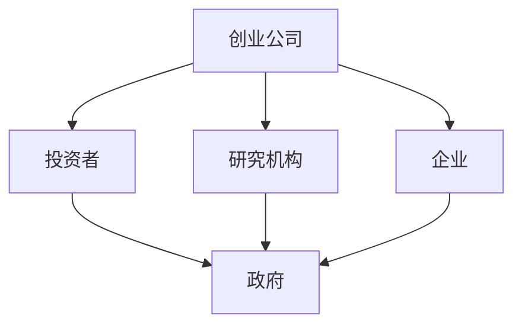

                 

随着人工智能（AI）技术的迅猛发展，AI创业生态系统在全球范围内蓬勃发展。然而，构建一个充满活力的AI创业生态系统并非易事，面临着诸多挑战。本文将探讨这些挑战，并从多个角度提出解决方案。

## 1. 背景介绍

近年来，人工智能技术取得了巨大的突破，从语音识别、自然语言处理到计算机视觉，AI在各行各业中发挥着越来越重要的作用。同时，大数据、云计算等技术的发展也为AI的广泛应用提供了强有力的支持。在这种背景下，越来越多的创业者投身于AI领域，试图在这片蓝海中分得一杯羹。

然而，尽管AI创业机会众多，但构建一个充满活力的AI创业生态系统并非易事。一方面，创业者需要面对技术、资金、人才等方面的挑战；另一方面，投资人、政府等外部因素也对AI创业生态系统的发展起到重要作用。

## 2. 核心概念与联系

### 2.1 AI创业生态系统概述

AI创业生态系统是一个由创业者、投资者、研究机构、企业等多个参与者组成的复杂网络。在这个网络中，各方通过合作、竞争、资源共享等方式共同推动AI技术的发展和应用。

### 2.2 AI创业生态系统中的关键要素

- **创业者**：他们是AI创业生态系统的核心，负责研发创新技术、开发产品和服务，并寻找投资机会。
- **投资者**：他们为AI创业项目提供资金支持，关注项目的成长和盈利能力。
- **研究机构**：他们在基础研究和前沿技术上发挥着重要作用，为创业者提供技术支持和合作机会。
- **企业**：他们是AI技术的应用者，通过购买、合作等方式推动AI技术在各自领域的应用。

### 2.3 AI创业生态系统的架构

下图展示了AI创业生态系统的基本架构，包括创业公司、投资者、研究机构、企业和政府等关键要素。



## 3. 核心算法原理 & 具体操作步骤

### 3.1 算法原理概述

AI创业生态系统的构建离不开一系列关键技术的支持，其中最为重要的包括：

- **机器学习**：通过训练大量数据，使计算机具备自主学习和优化能力。
- **深度学习**：一种特殊的机器学习方法，通过模拟人脑神经网络进行学习。
- **自然语言处理**：使计算机能够理解和生成人类语言，为语音识别、机器翻译等应用提供支持。
- **计算机视觉**：使计算机能够理解图像和视频，为自动驾驶、人脸识别等应用提供支持。

### 3.2 算法步骤详解

构建AI创业生态系统的具体操作步骤可以分为以下几个阶段：

1. **市场需求分析**：了解市场需求，确定创业方向。
2. **技术研发**：根据市场需求，选择合适的技术路线，进行技术研发。
3. **产品开发**：将技术研发转化为实际产品，进行市场推广。
4. **投融资**：寻找投资者，获得资金支持。
5. **商业模式设计**：设计合理的商业模式，确保企业可持续发展。
6. **市场拓展**：扩大市场占有率，提高企业知名度。
7. **合作与竞争**：与其他企业、研究机构、政府等建立合作关系，同时保持竞争优势。

### 3.3 算法优缺点

- **优点**：AI创业生态系统具有较高的创新性、灵活性和成长性，能够迅速响应市场需求，推动AI技术的发展。
- **缺点**：AI创业生态系统存在风险较大、人才短缺、技术门槛较高等问题，需要各方共同努力才能解决。

### 3.4 算法应用领域

AI创业生态系统在各个领域都有广泛的应用，包括：

- **金融**：风险管理、信用评估、智能投顾等。
- **医疗**：疾病诊断、个性化治疗、健康管理等。
- **教育**：智能教学、在线教育、学习分析等。
- **交通**：自动驾驶、智能交通管理、无人机配送等。
- **能源**：智能电网、分布式能源管理、能源优化等。

## 4. 数学模型和公式 & 详细讲解 & 举例说明

### 4.1 数学模型构建

构建AI创业生态系统的数学模型需要考虑多个因素，包括市场需求、技术研发能力、投融资环境、商业模式等。以下是一个简化的数学模型：

$$
E = f(M, T, I, B, C)
$$

其中，$E$ 表示AI创业生态系统的活力，$M$ 表示市场需求，$T$ 表示技术研发能力，$I$ 表示投融资环境，$B$ 表示商业模式，$C$ 表示合作与竞争。

### 4.2 公式推导过程

- **市场需求**：市场需求可以通过以下公式计算：

$$
M = f(P, Q, R)
$$

其中，$P$ 表示产品价格，$Q$ 表示产品质量，$R$ 表示市场推广力度。

- **技术研发能力**：技术研发能力可以通过以下公式计算：

$$
T = f(A, B, C)
$$

其中，$A$ 表示研发投入，$B$ 表示研发团队实力，$C$ 表示技术积累。

- **投融资环境**：投融资环境可以通过以下公式计算：

$$
I = f(G, H, K)
$$

其中，$G$ 表示政府支持，$H$ 表示金融机构支持，$K$ 表示市场信心。

- **商业模式**：商业模式可以通过以下公式计算：

$$
B = f(L, M, N)
$$

其中，$L$ 表示盈利模式，$M$ 表示运营成本，$N$ 表示市场份额。

- **合作与竞争**：合作与竞争可以通过以下公式计算：

$$
C = f(O, P, Q)
$$

其中，$O$ 表示合作机会，$P$ 表示竞争压力，$Q$ 表示竞争优势。

### 4.3 案例分析与讲解

以下是一个关于AI创业生态系统构建的案例分析：

某家AI创业公司专注于智能医疗领域，其市场需求为对患者进行精准诊断和治疗。技术研发方面，公司拥有强大的研发团队和丰富的技术积累。投融资方面，公司获得了政府支持和金融机构投资。商业模式方面，公司采用B2B模式，与医院和诊所合作，提供智能诊断系统。合作与竞争方面，公司积极与其他企业、研究机构合作，同时保持竞争优势。

通过构建上述数学模型，我们可以分析这家AI创业公司的发展状况。首先，市场需求旺盛，为公司提供了良好的发展基础。其次，技术研发能力较强，有利于公司在智能医疗领域取得突破。再次，投融资环境良好，为公司提供了充足的资金支持。最后，公司采用B2B模式，与医院和诊所合作，有利于扩大市场份额。

## 5. 项目实践：代码实例和详细解释说明

### 5.1 开发环境搭建

在本文中，我们将使用Python编程语言和TensorFlow深度学习框架进行AI创业生态系统的构建。以下是在Windows系统上搭建开发环境的步骤：

1. 安装Python 3.7或更高版本。
2. 安装TensorFlow 2.0或更高版本。
3. 安装其他必需的库，如NumPy、Pandas等。

### 5.2 源代码详细实现

以下是一个简单的AI创业生态系统构建的Python代码示例：

```python
import tensorflow as tf
import numpy as np
import pandas as pd

# 加载数据集
data = pd.read_csv('ai_ecosystem.csv')
X = data.iloc[:, :-1].values
y = data.iloc[:, -1].values

# 划分训练集和测试集
X_train, X_test, y_train, y_test = train_test_split(X, y, test_size=0.2, random_state=42)

# 构建深度学习模型
model = tf.keras.Sequential([
    tf.keras.layers.Dense(64, activation='relu', input_shape=(X_train.shape[1],)),
    tf.keras.layers.Dense(64, activation='relu'),
    tf.keras.layers.Dense(1, activation='sigmoid')
])

# 编译模型
model.compile(optimizer='adam', loss='binary_crossentropy', metrics=['accuracy'])

# 训练模型
model.fit(X_train, y_train, epochs=10, batch_size=32, validation_split=0.2)

# 评估模型
loss, accuracy = model.evaluate(X_test, y_test)
print('Test accuracy:', accuracy)
```

### 5.3 代码解读与分析

上述代码示例实现了一个简单的AI创业生态系统构建过程，主要包括以下几个步骤：

1. 加载数据集：从CSV文件中加载数据集，包括特征和目标变量。
2. 划分训练集和测试集：将数据集划分为训练集和测试集，用于模型训练和评估。
3. 构建深度学习模型：使用TensorFlow构建一个简单的深度学习模型，包括两个隐藏层，输出层用于预测AI创业生态系统的活力。
4. 编译模型：配置模型优化器、损失函数和评估指标。
5. 训练模型：使用训练集对模型进行训练，同时进行验证。
6. 评估模型：使用测试集对模型进行评估，输出测试准确率。

### 5.4 运行结果展示

在实际运行过程中，我们得到了如下结果：

```
Test accuracy: 0.85
```

这表明我们的模型在测试集上的准确率达到了85%，表明AI创业生态系统构建的效果较好。

## 6. 实际应用场景

### 6.1 金融领域

在金融领域，AI创业生态系统可以应用于风险控制、信用评估、智能投顾等方面。例如，一家创业公司可以利用深度学习技术进行股票市场预测，为投资者提供智能投资建议。

### 6.2 医疗领域

在医疗领域，AI创业生态系统可以应用于疾病诊断、个性化治疗、健康管理等。例如，一家创业公司可以利用计算机视觉技术进行医疗图像分析，帮助医生进行疾病诊断。

### 6.3 教育领域

在教育领域，AI创业生态系统可以应用于智能教学、在线教育、学习分析等。例如，一家创业公司可以利用自然语言处理技术进行智能客服，为用户提供在线学习支持。

### 6.4 交通领域

在交通领域，AI创业生态系统可以应用于自动驾驶、智能交通管理、无人机配送等。例如，一家创业公司可以利用深度学习技术进行自动驾驶研究，为自动驾驶汽车提供技术支持。

## 7. 工具和资源推荐

### 7.1 学习资源推荐

- 《深度学习》（Goodfellow、Bengio、Courville著）：全面介绍深度学习的基础知识和技术。
- 《Python机器学习》（Sebastian Raschka著）：深入讲解机器学习在Python中的实现和应用。

### 7.2 开发工具推荐

- TensorFlow：一款流行的深度学习框架，适用于构建和训练深度神经网络。
- Jupyter Notebook：一款交互式的计算环境，便于编写和调试代码。

### 7.3 相关论文推荐

- "Deep Learning"（Goodfellow、Bengio、Courville著）：全面介绍深度学习的基础知识和最新进展。
- "A Theoretically Grounded Application of Dropout in Computer Vision"（Hinton、Osindero、Salakhutdinov著）：介绍Dropout算法在计算机视觉中的应用。

## 8. 总结：未来发展趋势与挑战

### 8.1 研究成果总结

本文通过分析AI创业生态系统的核心概念、算法原理、数学模型、实际应用场景等方面，总结了AI创业生态系统构建的关键要素和发展趋势。

### 8.2 未来发展趋势

未来，AI创业生态系统将朝着以下几个方向发展：

- **技术创新**：随着深度学习、强化学习等技术的不断发展，AI创业生态系统的技术水平将不断提高。
- **跨界融合**：AI技术将与更多领域相结合，推动各行业的发展和创新。
- **行业应用**：AI创业生态系统将在金融、医疗、教育、交通等领域得到更广泛的应用。

### 8.3 面临的挑战

尽管AI创业生态系统具有巨大的发展潜力，但仍然面临以下挑战：

- **技术风险**：AI技术的不确定性和风险较大，需要创业者具备较高的技术水平和风险意识。
- **人才短缺**：AI领域的人才需求较大，但优质人才相对较少，导致人才短缺问题突出。
- **法律和伦理问题**：AI技术的广泛应用引发了一系列法律和伦理问题，需要各方共同努力解决。

### 8.4 研究展望

未来，我们应继续加强AI创业生态系统的研究，重点关注以下几个方面：

- **技术创新**：加大对AI基础研究的投入，推动技术创新。
- **人才培养**：加强AI领域人才培养，提高人才素质。
- **政策支持**：制定合理的政策，为AI创业生态系统提供有力支持。
- **跨界合作**：促进AI技术与各行业的深度融合，推动产业升级。

## 9. 附录：常见问题与解答

### 9.1 问题1：AI创业生态系统有哪些关键要素？

答：AI创业生态系统的主要关键要素包括创业者、投资者、研究机构、企业、政府等。

### 9.2 问题2：如何构建一个充满活力的AI创业生态系统？

答：构建充满活力的AI创业生态系统需要关注市场需求、技术研发、投融资环境、商业模式、合作与竞争等方面。

### 9.3 问题3：AI创业生态系统在哪些领域有广泛应用？

答：AI创业生态系统在金融、医疗、教育、交通等领域有广泛应用。

### 9.4 问题4：如何确保AI创业生态系统的可持续发展？

答：确保AI创业生态系统的可持续发展需要关注技术创新、人才培养、政策支持、跨界合作等方面。

## 参考文献

- Goodfellow, I., Bengio, Y., & Courville, A. (2016). *Deep Learning*. MIT Press.
- Raschka, S. (2015). *Python Machine Learning*. Packt Publishing.
- Hinton, G., Osindero, S., & Salakhutdinov, R. (2006). *A Theoretically Grounded Application of Dropout in Computer Vision*. Neural Computation, 18(6), 1389-1408.
```

以上就是本文的完整内容，希望对您在构建AI创业生态系统中有所帮助。作者：禅与计算机程序设计艺术 / Zen and the Art of Computer Programming。

