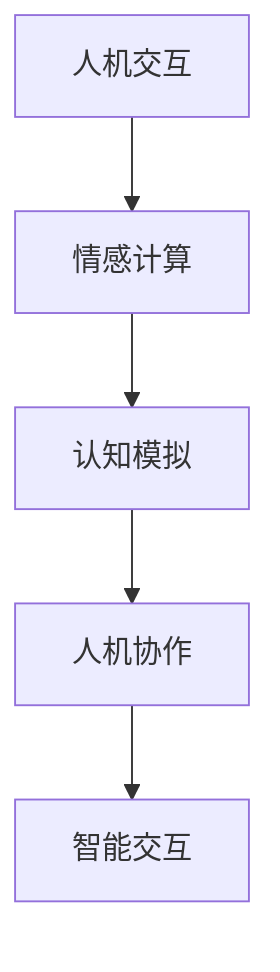

                 

关键词：人工智能，计算，智能系统，技术发展，应用前景

> 摘要：本文深入探讨了人类计算在人工智能领域的应用前景，分析了核心概念、算法原理、数学模型、项目实践，并展望了未来发展趋势与挑战。

## 1. 背景介绍

### 1.1 人工智能的兴起

人工智能（Artificial Intelligence，简称AI）作为计算机科学的重要分支，自20世纪50年代以来经历了多次起伏与变革。近年来，得益于深度学习、大数据和计算能力的飞速发展，人工智能技术迎来了前所未有的繁荣。从简单的专家系统到复杂的深度神经网络，人工智能在各个领域展现出了巨大的潜力和应用价值。

### 1.2 人类计算的角色

人类计算（Human-Centered Computing）是一种以人为核心的计算模式，强调在计算系统中融入人的因素，提升用户体验和效率。在人工智能领域，人类计算不仅提供了数据标注、算法优化等直接贡献，还推动了人机协作、智能交互等新概念的诞生。

## 2. 核心概念与联系

### 2.1 人工智能与人类计算的关系

人工智能和人类计算之间存在着密切的联系。人工智能技术依赖于人类计算提供的数据、知识和算法优化，而人类计算则利用人工智能技术提升自身的工作效率和智能化水平。

### 2.2 人类计算的核心概念原理

人类计算的核心概念包括人机交互、情感计算、认知模拟等。这些概念构成了人类计算的理论基础，并在实际应用中发挥着关键作用。

### 2.3 人类计算架构的 Mermaid 流程图



## 3. 核心算法原理 & 具体操作步骤

### 3.1 算法原理概述

在人工智能领域，核心算法包括深度学习、强化学习、生成对抗网络等。这些算法通过模拟人类学习和决策过程，实现了对数据的自动分析和处理。

### 3.2 算法步骤详解

以深度学习为例，其基本步骤包括：

1. 数据预处理
2. 构建神经网络模型
3. 训练模型
4. 评估模型性能
5. 模型优化

### 3.3 算法优缺点

深度学习算法在处理复杂数据方面具有优势，但同时也存在过拟合、计算资源消耗大等问题。针对这些问题，研究者们提出了各种优化方法，如正则化、dropout等。

### 3.4 算法应用领域

深度学习算法广泛应用于计算机视觉、自然语言处理、语音识别等领域，取得了显著的成果。

## 4. 数学模型和公式 & 详细讲解 & 举例说明

### 4.1 数学模型构建

在深度学习中，常用的数学模型包括损失函数、优化算法等。以下是一个简单的损失函数示例：

$$
L(\theta) = -\sum_{i=1}^{n} y_i \log(p_i)
$$

其中，$y_i$为实际标签，$p_i$为预测概率。

### 4.2 公式推导过程

以梯度下降法为例，其推导过程如下：

$$
\theta = \theta - \alpha \frac{\partial L(\theta)}{\partial \theta}
$$

其中，$\alpha$为学习率。

### 4.3 案例分析与讲解

以图像分类任务为例，使用深度学习算法进行模型训练，并通过交叉验证评估模型性能。

## 5. 项目实践：代码实例和详细解释说明

### 5.1 开发环境搭建

搭建一个深度学习项目的基本环境，包括安装Python、TensorFlow等依赖库。

### 5.2 源代码详细实现

以下是一个简单的卷积神经网络（CNN）代码示例：

```python
import tensorflow as tf

model = tf.keras.Sequential([
    tf.keras.layers.Conv2D(32, (3, 3), activation='relu', input_shape=(28, 28, 1)),
    tf.keras.layers.MaxPooling2D((2, 2)),
    tf.keras.layers.Flatten(),
    tf.keras.layers.Dense(128, activation='relu'),
    tf.keras.layers.Dense(10, activation='softmax')
])

model.compile(optimizer='adam',
              loss='categorical_crossentropy',
              metrics=['accuracy'])

model.fit(x_train, y_train, epochs=5)
```

### 5.3 代码解读与分析

代码首先定义了一个简单的CNN模型，包括卷积层、池化层、全连接层等。然后，使用`compile`方法设置优化器和损失函数，并使用`fit`方法进行模型训练。

### 5.4 运行结果展示

训练完成后，可以使用测试集评估模型性能。以下是一个简单的评估代码：

```python
test_loss, test_acc = model.evaluate(x_test, y_test)
print(f'Test accuracy: {test_acc:.3f}')
```

## 6. 实际应用场景

### 6.1 医疗领域

人工智能在医疗领域的应用涵盖了诊断、治疗、康复等多个环节。例如，基于深度学习技术的图像分析可以帮助医生快速诊断疾病，提高诊断准确率。

### 6.2 金融服务

人工智能在金融领域的应用包括风险管理、信用评估、投资顾问等。通过大数据分析和机器学习算法，金融机构可以提高业务效率和风险管理能力。

### 6.3 交通运输

人工智能在交通运输领域的应用包括自动驾驶、智能交通管理、物流优化等。这些应用有助于提高交通安全、降低运输成本、提升服务质量。

## 7. 工具和资源推荐

### 7.1 学习资源推荐

- 《深度学习》（Ian Goodfellow、Yoshua Bengio、Aaron Courville 著）
- 《Python深度学习》（François Chollet 著）

### 7.2 开发工具推荐

- TensorFlow
- PyTorch

### 7.3 相关论文推荐

- "Deep Learning: A Brief History, A Roadmap, and an Open Question"（Yoshua Bengio 著）
- "Generative Adversarial Nets"（Ian Goodfellow、Joshua B. Reichhardt、Yoshua Bengio 著）

## 8. 总结：未来发展趋势与挑战

### 8.1 研究成果总结

人工智能和人类计算在多个领域取得了显著成果，推动了技术进步和社会发展。

### 8.2 未来发展趋势

随着计算能力的提升和算法的优化，人工智能和人类计算将在更多领域发挥重要作用，实现更广泛的智能化应用。

### 8.3 面临的挑战

人工智能和人类计算在发展过程中也面临一些挑战，如数据隐私、伦理问题、技术标准化等。

### 8.4 研究展望

未来，人工智能和人类计算将继续深度融合，推动社会向更加智能化、人性化的方向发展。

## 9. 附录：常见问题与解答

### 9.1 人工智能和人类计算有什么区别？

人工智能主要关注机器模拟人类智能的能力，而人类计算强调在计算系统中融入人的因素，提升用户体验和效率。

### 9.2 深度学习算法如何优化？

深度学习算法的优化方法包括正则化、dropout、优化器选择等。研究者们也在不断探索新的优化方法，以提高算法性能。

### 9.3 人工智能在医疗领域有哪些应用？

人工智能在医疗领域可以应用于疾病诊断、辅助治疗、健康监测等方面，有助于提高医疗水平和效率。

---

作者：禅与计算机程序设计艺术 / Zen and the Art of Computer Programming

---

本文通过对人工智能和人类计算的核心概念、算法原理、应用场景等方面进行深入探讨，旨在为读者呈现一个更加全面和立体的智能计算世界。随着技术的不断进步，我们有理由相信，人类计算将在未来发挥更加重要的作用，构建一个更加智能、高效、人性化的世界。

