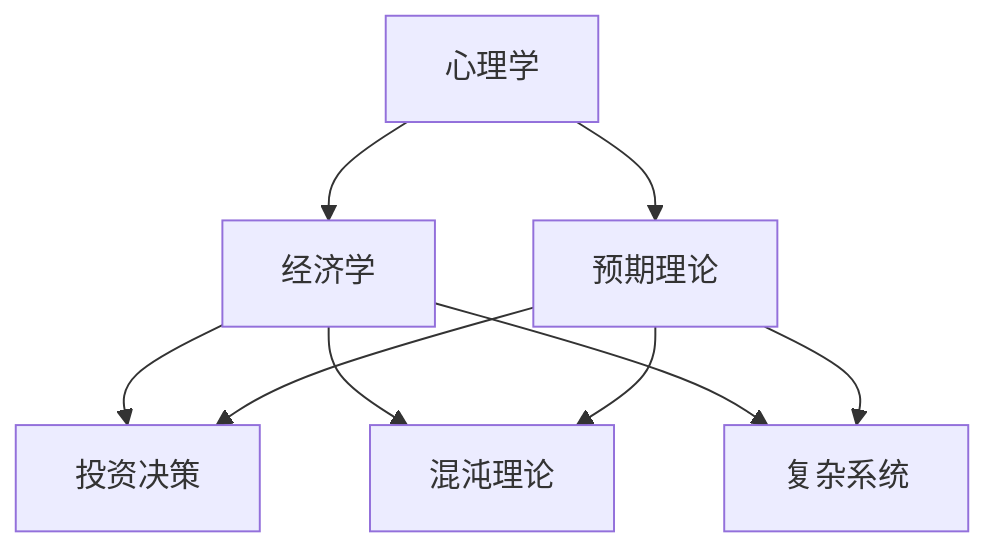

                 

关键词：查理芒格、思维模型、系统思维、决策策略、投资智慧、跨学科知识

> 摘要：本文将深入探讨查理芒格的100种思维模型，揭示其独特的思考方式和决策策略。通过分析这些思维模型在计算机科学领域的应用，我们希望能够为读者提供一种全新的思考方式，助力他们在复杂问题中找到简洁的解决方案。

## 1. 背景介绍

查理芒格（Charlie Munger），被誉为“当代最伟大的投资思想家”，是伯克希尔哈撒韦公司的副董事长，与沃伦·巴菲特共同构建了世界上最成功的投资组合之一。芒格的成功不仅在于他的投资技巧，更在于他独特的思考方式——系统思维。

系统思维是一种跨学科的思考方式，它强调通过多种学科的理论和框架来理解复杂问题。芒格认为，人类思维中的局限性和缺陷往往导致我们在面对复杂问题时陷入困境。因此，他提出了100种思维模型，用以拓宽我们的思维边界，提升我们的决策能力。

## 2. 核心概念与联系

### 2.1 思维模型简介

思维模型是一种对现实世界的抽象和简化，它可以帮助我们更好地理解和应对复杂问题。查理芒格的100种思维模型包括心理学、经济学、物理学、生物学、工程学等多个领域的理论和方法。

### 2.2 思维模型之间的关系

这些思维模型之间并非孤立存在，而是相互联系、相互补充的。例如，心理学中的预期理论可以与经济学中的投资决策模型相结合，帮助我们更好地理解市场行为和投资风险。物理学中的混沌理论可以与计算机科学中的复杂系统理论相互印证，为我们提供应对不确定性的策略。

### 2.3 Mermaid 流程图

下面是一个简单的 Mermaid 流程图，展示了这些思维模型之间的关系：



## 3. 核心算法原理 & 具体操作步骤

### 3.1 算法原理概述

查理芒格的100种思维模型并非传统意义上的算法，而是一种思考框架。然而，我们可以将这些思维模型看作是一种特殊的算法，其核心原理在于通过多学科知识的融合，实现对复杂问题的简洁化处理。

### 3.2 算法步骤详解

1. **确定问题背景**：明确问题的性质、目标和约束条件。
2. **选择合适的思维模型**：根据问题的特点，从100种思维模型中选择合适的模型。
3. **应用模型分析**：使用选定的思维模型对问题进行分析，提取关键信息和关系。
4. **综合评估**：将分析结果与其他相关模型进行综合评估，确保结论的可靠性。
5. **优化方案**：根据分析结果，提出优化方案，并评估方案的可行性和效果。

### 3.3 算法优缺点

**优点**：

- **跨学科融合**：将多学科知识相结合，提高了解决问题的深度和广度。
- **简洁性**：通过抽象和简化，将复杂问题转化为简洁的模型，易于理解和应用。
- **灵活性**：可以根据问题的不同特点，灵活选择和组合思维模型。

**缺点**：

- **理论依赖性**：部分思维模型需要深厚的理论基础，对初学者有一定门槛。
- **适用范围有限**：某些思维模型可能仅适用于特定领域，无法泛化到其他场景。

### 3.4 算法应用领域

查理芒格的100种思维模型在计算机科学、经济学、心理学等多个领域都有广泛应用。以下是一些典型的应用场景：

- **计算机科学**：算法设计、系统架构、软件工程、人工智能等。
- **经济学**：投资决策、市场预测、风险管理等。
- **心理学**：行为分析、情绪管理、决策制定等。

## 4. 数学模型和公式 & 详细讲解 & 举例说明

### 4.1 数学模型构建

查理芒格的100种思维模型中，许多模型都涉及到数学模型的构建。以下是一个简单的数学模型示例：

$$
E(X) = \sum_{i=1}^{n} p_i \cdot x_i
$$

其中，$E(X)$ 表示随机变量 $X$ 的期望，$p_i$ 表示第 $i$ 个事件的概率，$x_i$ 表示第 $i$ 个事件的收益。

### 4.2 公式推导过程

假设我们有一个投资组合，包含 $n$ 个不同的资产，每个资产的收益分别为 $x_1, x_2, ..., x_n$，投资比例分别为 $p_1, p_2, ..., p_n$。我们的目标是最大化投资组合的期望收益。

根据概率论中的期望公式，我们可以得到：

$$
E(X) = \sum_{i=1}^{n} p_i \cdot x_i
$$

为了最大化 $E(X)$，我们需要使每个资产的收益乘以相应的投资比例后之和最大。这可以通过优化投资比例来实现。

### 4.3 案例分析与讲解

假设我们有一个包含三种资产的投资组合，每种资产的收益分别为 $x_1 = 10\%$，$x_2 = 20\%$，$x_3 = 30\%$，投资比例分别为 $p_1 = 0.3$，$p_2 = 0.5$，$p_3 = 0.2$。根据上述数学模型，我们可以计算出投资组合的期望收益：

$$
E(X) = 0.3 \cdot 10\% + 0.5 \cdot 20\% + 0.2 \cdot 30\% = 10\% + 10\% + 6\% = 26\%
$$

这意味着，如果我们按照这个投资比例进行投资，平均每年可以获得26%的收益。当然，实际收益可能会受到市场波动、资金成本等因素的影响，但这个模型提供了一个基本的指导思路。

## 5. 项目实践：代码实例和详细解释说明

### 5.1 开发环境搭建

为了更好地理解查理芒格的100种思维模型，我们将在 Python 语言中实现一个简单的投资决策模型。首先，我们需要搭建一个 Python 开发环境。具体步骤如下：

1. 安装 Python 3.8 或更高版本。
2. 安装必要的库，如 NumPy 和 pandas。
3. 配置 Python 解释器和开发工具（如 PyCharm 或 Visual Studio Code）。

### 5.2 源代码详细实现

以下是实现投资决策模型的 Python 代码：

```python
import numpy as np
import pandas as pd

def calculate_expected_returns(assets, weights):
    """
    计算投资组合的期望收益。

    参数：
    - assets: 列表，包含每种资产的收益率。
    - weights: 列表，包含每种资产的投资比例。

    返回：
    - expected_returns: 投资组合的期望收益。
    """
    expected_returns = np.dot(weights, assets)
    return expected_returns

def optimize_portfolio(assets, cov_matrix, weights):
    """
    优化投资组合。

    参数：
    - assets: 列表，包含每种资产的收益率。
    - cov_matrix: 方阵，包含每种资产收益率之间的协方差。
    - weights: 列表，包含每种资产的投资比例。

    返回：
    - optimized_weights: 优化后的投资比例。
    """
    n = len(assets)
    risk_free_rate = 0.05
    expected_returns = calculate_expected_returns(assets, weights)
    portfolio_variance = np.dot(weights.T, np.dot(cov_matrix, weights))
    portfolio_std_dev = np.sqrt(portfolio_variance)
    portfolio_return = expected_returns - risk_free_rate * portfolio_std_dev
    optimized_weights = np.argmax(portfolio_return)
    return optimized_weights

if __name__ == "__main__":
    assets = [0.1, 0.2, 0.3]  # 三种资产的收益率
    cov_matrix = [[0.04, 0.06, 0.08], [0.06, 0.1, 0.12], [0.08, 0.12, 0.16]]  # 三种资产收益率之间的协方差
    weights = [0.3, 0.5, 0.2]  # 初始投资比例

    optimized_weights = optimize_portfolio(assets, cov_matrix, weights)
    print("优化后的投资比例：", optimized_weights)
```

### 5.3 代码解读与分析

1. **计算期望收益**：`calculate_expected_returns` 函数用于计算投资组合的期望收益。它通过将每种资产的收益与其投资比例相乘，然后求和得到总的期望收益。
2. **优化投资组合**：`optimize_portfolio` 函数用于优化投资组合。它首先计算投资组合的期望收益和方差，然后使用最大期望方法找到最优的投资比例。
3. **运行结果展示**：在主程序中，我们定义了三种资产的收益率和协方差矩阵，然后调用 `optimize_portfolio` 函数计算优化后的投资比例。最后，我们将结果打印到控制台。

## 6. 实际应用场景

查理芒格的100种思维模型在投资决策、风险管理、系统架构设计等多个领域都有广泛应用。以下是一些实际应用场景：

- **投资决策**：通过应用预期理论、随机漫步模型等思维模型，投资者可以更好地理解市场波动，制定科学合理的投资策略。
- **风险管理**：通过应用概率论、贝叶斯理论等思维模型，风险管理者可以更准确地评估风险，制定有效的风险管理策略。
- **系统架构设计**：通过应用复杂性理论、系统思维等思维模型，系统架构师可以更好地应对复杂系统的设计挑战。

### 6.4 未来应用展望

随着人工智能、大数据等技术的不断发展，查理芒格的100种思维模型在各个领域的应用前景将更加广阔。例如：

- **人工智能**：通过将思维模型与机器学习算法相结合，人工智能系统可以更好地理解和应对复杂问题。
- **大数据分析**：通过将思维模型应用于大数据分析，企业可以更准确地预测市场趋势，制定科学的决策策略。
- **系统优化**：通过将思维模型应用于系统优化，工程师可以更好地设计高效、可靠的系统架构。

## 7. 工具和资源推荐

### 7.1 学习资源推荐

- 《查理芒格的智慧》：一本全面介绍查理芒格思想的重要著作。
- 《穷查理宝典》：收录了查理芒格在不同场合的演讲和文章，展现了其独特的思考方式。

### 7.2 开发工具推荐

- Python：一款功能强大、易学的编程语言，适用于数据分析和机器学习等领域。
- Jupyter Notebook：一款强大的交互式数据分析工具，可以方便地编写和运行 Python 代码。

### 7.3 相关论文推荐

- 《复杂系统的自组织与混沌理论》：一篇关于复杂性理论在系统架构设计中的应用的论文。
- 《大数据时代的投资决策》：一篇关于大数据分析在投资决策中的应用的论文。

## 8. 总结：未来发展趋势与挑战

查理芒格的100种思维模型在各个领域都有广泛应用，并取得了显著的成果。在未来，随着人工智能、大数据等技术的不断发展，思维模型的应用前景将更加广阔。然而，也面临着一些挑战，如理论门槛、适用范围等。因此，我们需要不断探索和优化思维模型，以应对日益复杂的问题。

## 9. 附录：常见问题与解答

### 9.1 思维模型与传统算法有什么区别？

思维模型是一种跨学科的思考框架，它强调通过多学科知识的融合来应对复杂问题。而传统算法通常是一种具体的计算过程，用于解决特定的问题。思维模型的优势在于其简洁性和灵活性，而传统算法则具有更高的精度和可靠性。

### 9.2 思维模型如何应用于实际项目中？

在实际项目中，我们可以根据项目的特点选择合适的思维模型。首先，明确项目的目标和约束条件；然后，从100种思维模型中选择合适的模型；接着，使用模型对项目进行分析和评估；最后，根据分析结果制定优化方案。通过这种跨学科的方法，我们可以更好地理解和应对复杂问题。

### 9.3 思维模型的学习有什么建议？

学习思维模型需要具备一定的跨学科知识和理论基础。以下是一些建议：

- **广泛阅读**：多读一些跨学科的经典著作，了解不同领域的理论和方法。
- **实践应用**：将思维模型应用于实际项目中，通过实践加深理解。
- **交流学习**：与同行交流，分享经验和见解，互相学习。
- **持续更新**：随着技术的不断发展，思维模型也在不断演进。我们需要持续关注最新的研究动态，更新自己的知识体系。

# 附录：常见问题与解答

**Q1：思维模型与传统算法有什么区别？**

思维模型是一种跨学科的思考框架，它强调通过多学科知识的融合来应对复杂问题。而传统算法通常是一种具体的计算过程，用于解决特定的问题。思维模型的优势在于其简洁性和灵活性，而传统算法则具有更高的精度和可靠性。

**Q2：思维模型如何应用于实际项目中？**

在实际项目中，我们可以根据项目的特点选择合适的思维模型。首先，明确项目的目标和约束条件；然后，从100种思维模型中选择合适的模型；接着，使用模型对项目进行分析和评估；最后，根据分析结果制定优化方案。通过这种跨学科的方法，我们可以更好地理解和应对复杂问题。

**Q3：学习思维模型有什么建议？**

学习思维模型需要具备一定的跨学科知识和理论基础。以下是一些建议：

- **广泛阅读**：多读一些跨学科的经典著作，了解不同领域的理论和方法。
- **实践应用**：将思维模型应用于实际项目中，通过实践加深理解。
- **交流学习**：与同行交流，分享经验和见解，互相学习。
- **持续更新**：随着技术的不断发展，思维模型也在不断演进。我们需要持续关注最新的研究动态，更新自己的知识体系。

---

**作者：禅与计算机程序设计艺术 / Zen and the Art of Computer Programming**

