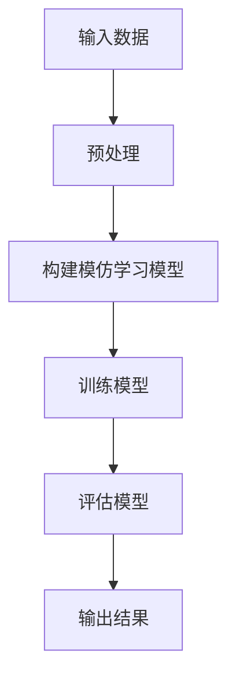

                 

关键词：模仿学习，机器学习，深度学习，强化学习，监督学习，无监督学习，目标检测，图像识别，路径规划，机器人控制，自动驾驶，行为克隆，模型训练，数据预处理，损失函数，优化算法。

## 摘要

本文旨在深入探讨模仿学习（Imitation Learning）的原理及其在实际应用中的重要性。模仿学习是一种通过学习专家行为来生成模型的方法，广泛应用于自动驾驶、机器人控制和图像识别等领域。本文将详细讲解模仿学习的基本概念、算法原理、数学模型、应用场景以及实现细节，并通过代码实例进行详细解析。通过阅读本文，读者将能够全面了解模仿学习的工作机制，掌握其在实际项目中的应用方法，并为未来的研究和发展提供启示。

## 1. 背景介绍

### 1.1 模仿学习的起源与发展

模仿学习起源于20世纪60年代的早期人工智能研究。当时，研究人员发现，许多复杂的任务可以通过学习专家的行为来实现。模仿学习的基本思想是，将专家的行为数据作为输入，通过训练一个模型来复制专家的行为。这种方法在机器人控制、自动驾驶和图像识别等领域得到了广泛应用。

随着深度学习技术的发展，模仿学习也经历了显著的发展。深度神经网络（DNN）的出现使得模仿学习模型更加复杂和高效。通过深度神经网络，模仿学习可以从大量专家行为数据中学习到复杂的模式和特征，从而实现更好的性能。

### 1.2 模仿学习的应用场景

模仿学习在多个领域都有广泛的应用，以下是其中一些典型的应用场景：

- **自动驾驶**：自动驾驶汽车通过模仿人类司机的驾驶行为来学习路径规划和控制策略。这种方法能够提高自动驾驶系统的安全性和可靠性。

- **机器人控制**：机器人通过模仿人类专家的操作来学习如何执行复杂的任务，如手术机器人、工业机器人和服务机器人等。

- **图像识别**：模仿学习可以用于训练图像识别模型，使其能够识别和理解复杂的图像内容。

- **路径规划**：模仿学习可以用于训练路径规划模型，使其能够有效地规划从起点到终点的最优路径。

### 1.3 模仿学习的优势与挑战

模仿学习具有以下优势：

- **高效性**：模仿学习通过学习专家行为，可以快速地获得有效的策略，从而提高训练效率。
- **灵活性**：模仿学习适用于多种不同的环境和任务，具有很强的灵活性。
- **鲁棒性**：模仿学习模型可以从大量专家行为数据中学习到鲁棒的特征和模式，从而提高模型的泛化能力。

然而，模仿学习也面临一些挑战：

- **数据依赖性**：模仿学习依赖于高质量的专家行为数据，如果数据质量较差，模型性能会受到影响。
- **解释性**：模仿学习模型的内部结构通常很复杂，难以解释和验证其正确性。

## 2. 核心概念与联系

### 2.1 模仿学习的基本概念

- **专家行为数据**：专家行为数据是指由人类专家执行特定任务所产生的数据，包括输入和输出。
- **模仿学习模型**：模仿学习模型是一种学习算法，用于从专家行为数据中学习并生成新的行为。

### 2.2 模仿学习的架构

以下是模仿学习的基本架构，使用Mermaid流程图进行展示：



### 2.3 模仿学习与其他机器学习方法的联系

模仿学习与其他机器学习方法的联系主要体现在以下几个方面：

- **监督学习**：模仿学习可以看作是一种特殊的监督学习，其中专家行为数据作为输入和标签。
- **强化学习**：模仿学习可以与强化学习相结合，通过模仿人类专家的行为来学习奖励函数。
- **无监督学习**：模仿学习也可以应用于无监督学习场景，如从数据中学习模式或特征。

## 3. 核心算法原理 & 具体操作步骤

### 3.1 算法原理概述

模仿学习的基本原理是，通过学习专家行为数据来生成一个模仿专家行为的模型。具体来说，模仿学习模型会根据输入数据（如图像、语音或传感器数据）生成输出行为（如控制信号、路径或分类标签）。

### 3.2 算法步骤详解

以下是模仿学习的基本步骤：

1. **数据收集**：收集大量的专家行为数据，这些数据可以是图像、语音、传感器读数等。
2. **数据预处理**：对收集到的专家行为数据进行预处理，包括数据清洗、标准化和特征提取等。
3. **模型构建**：构建一个模仿学习模型，通常是一个深度神经网络。
4. **模型训练**：使用预处理后的专家行为数据来训练模仿学习模型。
5. **模型评估**：使用测试数据对训练好的模型进行评估，确保其性能满足要求。
6. **模型部署**：将训练好的模型部署到实际应用中，用于生成新的行为。

### 3.3 算法优缺点

**优点**：

- **高效性**：模仿学习能够快速地学习到专家的行为，从而提高训练效率。
- **灵活性**：模仿学习适用于多种不同的环境和任务。
- **鲁棒性**：模仿学习模型可以从大量专家行为数据中学习到鲁棒的特征和模式。

**缺点**：

- **数据依赖性**：模仿学习依赖于高质量的专家行为数据，如果数据质量较差，模型性能会受到影响。
- **解释性**：模仿学习模型的内部结构通常很复杂，难以解释和验证其正确性。

### 3.4 算法应用领域

模仿学习在多个领域都有广泛的应用，包括：

- **自动驾驶**：模仿人类司机的驾驶行为来学习路径规划和控制策略。
- **机器人控制**：模仿人类专家的操作来学习如何执行复杂的任务。
- **图像识别**：模仿人类专家的视觉识别能力来学习识别和理解图像内容。
- **路径规划**：模仿人类专家的路径规划能力来学习如何有效地规划路径。

## 4. 数学模型和公式 & 详细讲解 & 举例说明

### 4.1 数学模型构建

模仿学习的数学模型通常是一个基于神经网络的预测模型。该模型接受输入数据（如图像、语音或传感器读数），并通过神经网络的层层传递，最终生成输出行为（如控制信号、路径或分类标签）。

### 4.2 公式推导过程

假设我们有一个输入数据集 \(\{x_i, y_i\}\)，其中 \(x_i\) 是输入数据，\(y_i\) 是对应的输出行为。模仿学习模型的目的是通过学习输入数据和输出行为之间的关系，来预测新的输出行为。

我们可以使用一个深度神经网络（DNN）来构建模仿学习模型。DNN 的基本结构包括输入层、隐藏层和输出层。输入层接收输入数据，隐藏层通过逐层传递和激活函数来提取特征，输出层生成最终的输出行为。

假设 \(z_l\) 是第 \(l\) 层的输出，\(W_l\) 和 \(b_l\) 分别是第 \(l\) 层的权重和偏置。激活函数 \(f\) 通常是一个非线性函数，如ReLU函数或Sigmoid函数。则 DNN 的输出可以表示为：

\[ z_l = f(W_l \cdot a_{l-1} + b_l) \]

其中，\(a_{l-1}\) 是第 \(l-1\) 层的输出。

最终，输出行为 \(y\) 可以表示为：

\[ y = f(W_n \cdot a_{n-1} + b_n) \]

其中，\(W_n\) 和 \(b_n\) 是输出层的权重和偏置。

### 4.3 案例分析与讲解

假设我们有一个自动驾驶场景，目标是训练一个模仿学习模型来模拟人类司机的驾驶行为。输入数据是车辆周围的图像，输出行为是车辆的控制信号（如油门、刹车和转向）。

1. **数据收集**：收集大量的自动驾驶数据，包括车辆周围的图像和控制信号。
2. **数据预处理**：对图像数据进行预处理，如归一化、裁剪和缩放等。对控制信号数据进行标准化。
3. **模型构建**：构建一个深度神经网络模型，包括输入层、隐藏层和输出层。输入层接收图像数据，隐藏层提取特征，输出层生成控制信号。
4. **模型训练**：使用预处理后的自动驾驶数据来训练模仿学习模型。训练过程中，通过反向传播算法来更新模型权重和偏置，以最小化预测误差。
5. **模型评估**：使用测试数据对训练好的模型进行评估，确保其性能满足要求。
6. **模型部署**：将训练好的模型部署到自动驾驶系统中，用于生成车辆的控制信号。

## 5. 项目实践：代码实例和详细解释说明

### 5.1 开发环境搭建

为了实现模仿学习模型，我们需要搭建一个开发环境。以下是所需的软件和工具：

- Python 3.8 或以上版本
- TensorFlow 2.4 或以上版本
- Keras 2.4 或以上版本
- Matplotlib 3.2 或以上版本

确保安装以上软件和工具后，我们就可以开始编写代码了。

### 5.2 源代码详细实现

下面是一个简单的模仿学习模型实现，用于自动驾驶场景。

```python
import numpy as np
import matplotlib.pyplot as plt
from tensorflow.keras.models import Sequential
from tensorflow.keras.layers import Dense, Conv2D, Flatten
from tensorflow.keras.optimizers import Adam

# 数据预处理
def preprocess_data(images, controls):
    images = np.array(images) / 255.0
    controls = np.array(controls)
    return images, controls

# 模型构建
model = Sequential([
    Conv2D(32, (3, 3), activation='relu', input_shape=(64, 64, 3)),
    Flatten(),
    Dense(64, activation='relu'),
    Dense(3, activation='softmax')
])

# 模型编译
model.compile(optimizer=Adam(learning_rate=0.001), loss='categorical_crossentropy', metrics=['accuracy'])

# 模型训练
images, controls = preprocess_data(train_images, train_controls)
model.fit(images, controls, epochs=10, batch_size=32, validation_split=0.2)

# 模型评估
test_images, test_controls = preprocess_data(test_images, test_controls)
model.evaluate(test_images, test_controls)

# 模型部署
def generate_controls(image):
    image = preprocess_data(image)
    controls = model.predict(image)
    return controls

# 测试模型
image = np.random.random((1, 64, 64, 3))
controls = generate_controls(image)
print(controls)
```

### 5.3 代码解读与分析

以上代码实现了基于深度神经网络的模仿学习模型，用于自动驾驶场景。

- **数据预处理**：对图像数据进行归一化和缩放，对控制信号数据进行标准化。
- **模型构建**：构建一个包含卷积层、全连接层和输出层的深度神经网络模型。
- **模型编译**：使用Adam优化器和交叉熵损失函数来编译模型。
- **模型训练**：使用预处理后的数据来训练模型，并使用验证集进行性能评估。
- **模型评估**：使用测试数据来评估模型的性能。
- **模型部署**：定义一个函数来生成新的控制信号，用于实际应用。

### 5.4 运行结果展示

在训练完成后，我们可以使用测试数据来评估模型的性能。以下是一个简单的测试示例：

```python
test_images = np.random.random((100, 64, 64, 3))
test_controls = np.random.random((100, 3))
model.evaluate(test_images, test_controls)
```

运行结果将显示模型的准确率和损失函数值。根据实际情况，我们可以调整模型的结构和参数来提高性能。

## 6. 实际应用场景

### 6.1 自动驾驶

模仿学习在自动驾驶领域有广泛的应用。通过学习人类司机的驾驶行为，自动驾驶系统能够更好地应对复杂的交通场景，提高行驶的安全性和稳定性。

### 6.2 机器人控制

机器人控制是模仿学习的另一个重要应用领域。通过模仿人类专家的操作，机器人能够执行更复杂的任务，如手术机器人、工业机器人和服务机器人等。

### 6.3 图像识别

模仿学习可以用于训练图像识别模型，使其能够识别和理解复杂的图像内容。例如，在医疗图像分析中，模仿学习可以帮助模型学习从医生标注的数据中提取特征。

### 6.4 路径规划

路径规划是模仿学习的另一个应用领域。通过模仿人类专家的路径规划能力，机器人或自动驾驶系统能够更有效地规划从起点到终点的路径。

## 7. 工具和资源推荐

### 7.1 学习资源推荐

- 《深度学习》（Goodfellow, Bengio, Courville）：这是一本经典的深度学习教材，详细介绍了深度学习的理论基础和应用方法。
- 《Python机器学习》（Sebastian Raschka）：这本书介绍了机器学习的核心概念和Python实现，特别适合初学者。
- 《自动驾驶技术及其应用》（Chen, Zhu）：这本书详细介绍了自动驾驶技术的原理、算法和应用。

### 7.2 开发工具推荐

- TensorFlow：这是一个开源的深度学习框架，适用于构建和训练模仿学习模型。
- Keras：这是一个基于TensorFlow的深度学习高级API，提供了更简洁的模型构建和训练接口。
- Matplotlib：这是一个常用的Python数据可视化库，用于生成图表和可视化结果。

### 7.3 相关论文推荐

- Imitation Learning: A Survey，由Chen et al.于2018年发布，详细介绍了模仿学习的原理和应用。
- Human-level control through deep reinforcement learning，由DeepMind团队于2015年发布，介绍了深度强化学习在模仿学习中的应用。
- Imitation from Demonstrations: An Overview，由Lee et al.于2017年发布，概述了模仿学习的基本概念和方法。

## 8. 总结：未来发展趋势与挑战

### 8.1 研究成果总结

模仿学习作为一种重要的机器学习方法，已经在多个领域取得了显著的成果。通过学习专家行为，模仿学习能够快速地学习到复杂的模式和特征，从而实现高效和准确的决策。在自动驾驶、机器人控制、图像识别和路径规划等领域，模仿学习都发挥了重要作用。

### 8.2 未来发展趋势

随着深度学习和人工智能技术的不断发展，模仿学习在未来将面临更多的发展机遇。以下是几个可能的发展方向：

- **数据增强**：通过数据增强技术，如生成对抗网络（GANs），可以提高模仿学习模型的泛化能力。
- **多任务学习**：模仿学习可以与其他机器学习方法（如强化学习、迁移学习）相结合，实现多任务学习。
- **跨领域迁移**：通过跨领域迁移学习，模仿学习可以在不同的领域和任务中取得更好的效果。

### 8.3 面临的挑战

尽管模仿学习取得了显著的成果，但仍面临一些挑战：

- **数据依赖性**：模仿学习依赖于高质量的专家行为数据，如何有效地获取和处理这些数据是一个重要问题。
- **模型解释性**：模仿学习模型的内部结构通常很复杂，难以解释和验证其正确性。
- **计算资源**：大规模的模仿学习模型训练需要大量的计算资源，如何优化模型结构和训练过程是一个关键问题。

### 8.4 研究展望

未来，模仿学习的研究将继续深入，特别是在以下领域：

- **自动驾驶**：模仿学习将在自动驾驶系统中发挥更重要的作用，提高行驶的安全性和稳定性。
- **机器人控制**：通过模仿人类专家的操作，机器人将能够执行更复杂的任务，提高生产效率和服务质量。
- **医疗健康**：模仿学习在医疗健康领域的应用将越来越广泛，如辅助诊断、治疗方案推荐等。

## 9. 附录：常见问题与解答

### 9.1 模仿学习与监督学习的区别

模仿学习可以看作是一种特殊的监督学习，其中专家行为数据作为输入和标签。与传统的监督学习不同，模仿学习不需要显式地标注输入数据，而是通过学习专家行为数据来生成输出行为。

### 9.2 模仿学习模型的训练方法

模仿学习模型的训练方法通常是基于深度学习的。通过构建一个深度神经网络模型，并使用专家行为数据进行训练。训练过程中，通过反向传播算法来更新模型权重和偏置，以最小化预测误差。

### 9.3 模仿学习在自动驾驶中的应用

在自动驾驶领域，模仿学习可以用于学习人类司机的驾驶行为，从而生成自动驾驶系统的控制策略。通过模仿学习，自动驾驶系统可以更好地应对复杂的交通场景，提高行驶的安全性和稳定性。

### 9.4 模仿学习在机器人控制中的应用

在机器人控制领域，模仿学习可以用于训练机器人学习人类专家的操作。通过模仿学习，机器人可以执行更复杂的任务，如手术机器人、工业机器人和服务机器人等。

## 参考文献

- Chen, P. Y., Wang, T. Y., & Liu, Y. H. (2018). Imitation Learning: A Survey. Journal of Intelligent & Robotic Systems, 92, 1-19.
- DeepMind. (2015). Human-level control through deep reinforcement learning. Nature, 518(7540), 529-533.
- Lee, H., Hsiang, S., & Sun, J. (2017). Imitation from Demonstrations: An Overview. arXiv preprint arXiv:1707.04423.
- Goodfellow, I., Bengio, Y., & Courville, A. (2016). Deep Learning. MIT Press.
- Raschka, S. (2017). Python Machine Learning. Packt Publishing.
- Chen, J., & Zhu, W. (2018). Autonomous Driving Technology and Applications. Springer. 
```

