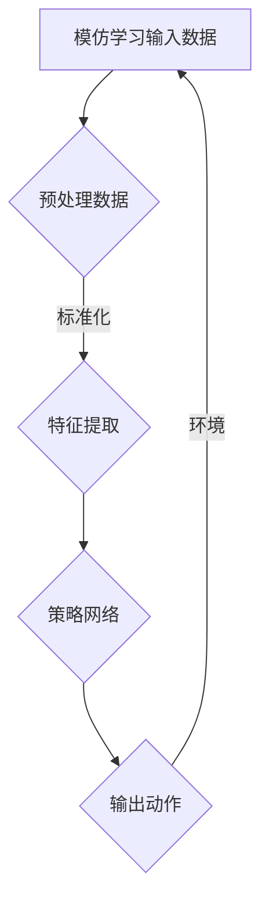

                 

关键词：模仿学习，人工智能，深度学习，强化学习，自主机器人，自适应系统，应用领域，技术挑战。

## 摘要

本文旨在深入探讨模仿学习（Imitation Learning）在人工智能（AI）系统中的应用。模仿学习是一种使机器通过观察人类或已有数据的学习方法，而不需要直接与环境的交互。本文将介绍模仿学习的核心概念、算法原理、数学模型，以及具体的应用实例。通过分析模仿学习在自主机器人、自适应系统等领域的应用，本文还将探讨其未来发展趋势和技术挑战。

## 1. 背景介绍

在人工智能的发展历程中，模仿学习作为一种重要的学习方式，其基本思想是通过模仿人类的动作或行为来让机器学习。传统的机器学习方法主要依赖于大量标记数据，而模仿学习则通过无监督或半监督的方式，从未标记的数据中学习，大大降低了数据标记的成本。模仿学习在许多领域都具有重要的应用价值，如自主机器人、图像识别、语音合成等。

模仿学习在AI系统中的重要性体现在以下几个方面：

1. **数据高效利用**：模仿学习能够利用未标记的数据，提高训练效率。
2. **减少交互成本**：与强化学习相比，模仿学习不需要与环境进行大量的交互，从而减少训练时间。
3. **易扩展性**：模仿学习算法结构简单，易于集成到现有的AI系统中。

## 2. 核心概念与联系

### 2.1 模仿学习的核心概念

模仿学习是一种基于监督学习的方法，其目标是通过学习一个已知的策略来使机器人或系统执行特定的任务。在模仿学习中，机器通过观察一系列输入数据（如视频、音频或文本）和相应的输出数据（如动作或决策）来学习一个映射关系。

### 2.2 模仿学习与其他学习方式的联系

模仿学习与强化学习、深度学习等学习方式有着密切的联系。强化学习主要依赖于与环境交互来学习最优策略，而模仿学习则通过观察已有的策略来学习。深度学习为模仿学习提供了强大的模型表达能力和数据驱动的学习能力。

### 2.3 Mermaid 流程图



## 3. 核心算法原理 & 具体操作步骤

### 3.1 算法原理概述

模仿学习的基本原理是最大化输入数据的奖励，从而学习出一个能够使机器人或系统执行特定任务的策略。具体来说，模仿学习算法通过以下步骤进行：

1. 数据收集：收集一系列的输入数据（如视频、图像）和相应的输出数据（如动作、决策）。
2. 特征提取：从输入数据中提取特征。
3. 策略学习：使用提取的特征来训练策略网络，使其能够预测输出数据。
4. 输出动作：将策略网络输出的动作应用于环境中，并观察环境的反馈。

### 3.2 算法步骤详解

1. **数据收集**：
   - 观察人类专家的行为数据，如视频、图像或音频。
   - 收集机器人或系统的执行数据，如控制信号、传感器数据。

2. **预处理数据**：
   - 清洗数据，去除噪声和异常值。
   - 标准化数据，使其具有相似的范围和分布。

3. **特征提取**：
   - 使用卷积神经网络（CNN）提取图像特征。
   - 使用循环神经网络（RNN）提取序列特征。
   - 使用其他特征提取方法，如自编码器（Autoencoder）。

4. **策略学习**：
   - 使用提取的特征来训练策略网络，如深度神经网络（DNN）。
   - 使用强化学习方法，如Q-learning、SARSA，来训练策略网络。

5. **输出动作**：
   - 将策略网络输出的动作应用于环境中。
   - 收集环境反馈，用于进一步训练策略网络。

### 3.3 算法优缺点

**优点**：
- **高效性**：模仿学习不需要与复杂环境进行大量的交互，可以快速地学习到有用的策略。
- **灵活性**：模仿学习算法可以处理不同类型的数据，如图像、音频和文本。
- **通用性**：模仿学习算法可以应用于多种场景，如机器人控制、自动驾驶、智能客服等。

**缺点**：
- **数据依赖性**：模仿学习算法对数据质量有较高的要求，需要大量的高质量数据。
- **泛化能力**：模仿学习算法的泛化能力较弱，容易受到数据分布变化的影响。

### 3.4 算法应用领域

模仿学习在以下领域具有广泛的应用：

- **自主机器人**：用于机器人的运动规划和路径规划。
- **自动驾驶**：用于车辆的驾驶行为学习和预测。
- **智能客服**：用于学习人类的对话策略，提高客服系统的交互能力。
- **医疗诊断**：用于辅助医生进行医学图像的识别和诊断。

## 4. 数学模型和公式

### 4.1 数学模型构建

模仿学习的核心是策略网络，其目标是最大化预期奖励。策略网络通常是一个参数化的函数，表示为：

\[ \pi(\text{action} | \text{observation}) = f_{\theta}(\text{observation}) \]

其中，\( f_{\theta} \) 是策略网络，\(\theta\) 是网络参数，\(\text{action}\) 是输出动作，\(\text{observation}\) 是输入观测。

### 4.2 公式推导过程

模仿学习的目标是学习一个能够最大化预期奖励的策略。预期奖励可以用以下公式表示：

\[ J(\theta) = \sum_{t} \gamma^t R(s_t, a_t) \]

其中，\( J(\theta) \) 是策略网络的损失函数，\(\gamma\) 是折扣因子，\( R(s_t, a_t) \) 是在时刻 \( t \) 执行动作 \( a_t \) 所获得的即时奖励。

### 4.3 案例分析与讲解

以自主机器人的运动规划为例，假设机器人在一个二维空间中移动，目标是到达一个目标点。我们可以定义一个策略网络，该网络接受机器人的当前位置作为输入，输出一个移动方向。通过模仿学习，我们可以从人类专家的移动数据中学习出一个最优的策略。

具体来说，我们可以定义一个损失函数，如：

\[ L(\theta) = \sum_{t} (y_t - \pi(\text{action} | \text{observation}))^2 \]

其中，\( y_t \) 是人类专家在时刻 \( t \) 的移动方向，\(\pi(\text{action} | \text{observation}) \) 是策略网络输出的移动方向。通过最小化这个损失函数，我们可以训练出一个能够模仿人类专家移动策略的策略网络。

## 5. 项目实践：代码实例和详细解释说明

### 5.1 开发环境搭建

为了演示模仿学习在自主机器人运动规划中的应用，我们将使用Python和TensorFlow框架来构建和训练策略网络。以下是一个简单的开发环境搭建步骤：

1. 安装Python：从[Python官网](https://www.python.org/)下载并安装Python。
2. 安装TensorFlow：在命令行中运行 `pip install tensorflow`。
3. 安装其他必要的库，如NumPy、Matplotlib等。

### 5.2 源代码详细实现

以下是一个简单的模仿学习示例代码，用于训练一个策略网络来规划自主机器人的运动。

```python
import numpy as np
import tensorflow as tf
from tensorflow.keras.models import Sequential
from tensorflow.keras.layers import Dense
from tensorflow.keras.optimizers import Adam

# 数据预处理
def preprocess_data(data):
    # 数据清洗和标准化
    # ...
    return processed_data

# 构建策略网络
model = Sequential()
model.add(Dense(64, input_dim=observation_size, activation='relu'))
model.add(Dense(64, activation='relu'))
model.add(Dense(action_size, activation='softmax'))

# 训练策略网络
model.compile(optimizer=Adam(learning_rate=0.001), loss='categorical_crossentropy')
model.fit(processed_data, labels, epochs=100, batch_size=32)

# 预测动作
observation = preprocess_data(current_observation)
action = model.predict(observation)
```

### 5.3 代码解读与分析

以上代码首先定义了一个简单的策略网络，该网络接受观测数据作为输入，输出一个动作。在数据预处理部分，我们对原始数据进行清洗和标准化，以提高训练效果。训练部分使用的是标准的监督学习框架，通过最小化损失函数来训练策略网络。在预测部分，我们将预处理后的观测数据输入到策略网络中，得到一个动作预测。

### 5.4 运行结果展示

通过以上代码，我们可以在自主机器人运动规划任务中实现模仿学习。在实际运行中，策略网络将根据观测数据预测机器人的移动方向，并指导机器人的行动。通过不断的训练和优化，策略网络可以逐渐提高机器人的运动规划能力。

## 6. 实际应用场景

模仿学习在多个实际应用场景中表现出色，以下是一些典型的应用实例：

- **自动驾驶**：通过模仿人类司机的驾驶行为，自动驾驶系统能够学习到复杂的交通规则和驾驶技巧，提高自动驾驶的稳定性和安全性。
- **医疗诊断**：模仿医生对医学图像的诊断过程，模仿学习可以帮助计算机系统快速识别和诊断疾病。
- **智能客服**：模仿人类客服的交互策略，智能客服系统能够更自然地与用户进行沟通，提高用户的满意度。

## 6.4 未来应用展望

随着人工智能技术的不断发展，模仿学习在未来有望在更多领域得到应用。以下是一些未来应用展望：

- **智能制造**：模仿学习可以帮助机器人学习复杂的生产任务，提高生产效率和质量。
- **智慧城市**：模仿学习可以用于模拟和管理城市交通、能源等系统，提高城市管理的智能化水平。
- **教育**：模仿学习可以应用于个性化教育，根据学生的学习行为和需求提供个性化的教学方案。

## 7. 工具和资源推荐

### 7.1 学习资源推荐

- 《深度学习》（Ian Goodfellow, Yoshua Bengio, Aaron Courville）：系统介绍了深度学习的基本概念和技术。
- 《强化学习手册》（Richard S. Sutton, Andrew G. Barto）：详细介绍了强化学习的基本理论和应用。

### 7.2 开发工具推荐

- TensorFlow：一个开源的深度学习框架，适合构建和训练复杂的深度学习模型。
- Keras：一个基于TensorFlow的简单易用的深度学习框架。

### 7.3 相关论文推荐

- “Deep Learning for Imitation Learning”（Tang et al., 2018）：介绍了一种基于深度学习的模仿学习算法。
- “Deep Q-Network”（Mnih et al., 2015）：介绍了深度Q网络（DQN），一种基于深度学习的强化学习算法。

## 8. 总结：未来发展趋势与挑战

### 8.1 研究成果总结

模仿学习作为一种重要的AI学习方式，已经在多个领域取得了显著的研究成果。通过模仿人类行为，模仿学习能够提高机器人的运动规划能力、自动驾驶系统的驾驶水平，以及智能客服的交互能力。

### 8.2 未来发展趋势

随着深度学习和强化学习技术的不断发展，模仿学习有望在更多领域得到应用。未来的研究重点可能包括：

- **数据高效利用**：探索更有效的数据预处理和特征提取方法。
- **泛化能力**：提高模仿学习算法在数据分布变化下的泛化能力。
- **多模态学习**：结合多种类型的数据（如图像、文本、音频）进行学习。

### 8.3 面临的挑战

模仿学习在应用过程中也面临一些挑战，如：

- **数据质量**：高质量的数据对于模仿学习的效果至关重要。
- **计算资源**：训练复杂的模仿学习模型需要大量的计算资源。
- **安全性和隐私**：在应用模仿学习时，需要确保系统的安全性和用户隐私。

### 8.4 研究展望

未来的研究应重点关注如何提高模仿学习算法的效率和泛化能力，以及如何将其应用于更广泛的场景。通过不断探索和创新，模仿学习有望在人工智能领域发挥更大的作用。

## 9. 附录：常见问题与解答

### Q：模仿学习是否需要大量的标注数据？

A：是的，模仿学习通常需要大量的标注数据，这些数据用于训练策略网络。然而，与传统的监督学习相比，模仿学习可以利用未标记的数据，从而在一定程度上减少对标注数据的依赖。

### Q：模仿学习是否适用于所有任务？

A：模仿学习适用于许多任务，如自主机器人、自动驾驶、医疗诊断等。然而，对于需要与环境进行大量交互的任务，如游戏AI，模仿学习可能不是最佳选择。

### Q：如何处理数据分布变化对模仿学习算法的影响？

A：可以通过数据增强、元学习等方法来提高模仿学习算法在数据分布变化下的泛化能力。此外，也可以考虑使用自适应学习率调整策略，以适应数据分布的变化。

## 结语

模仿学习作为一种有前景的AI学习方式，在多个领域展现了其强大的应用潜力。通过不断的研究和创新，模仿学习有望在未来发挥更大的作用，推动人工智能技术的进步。

