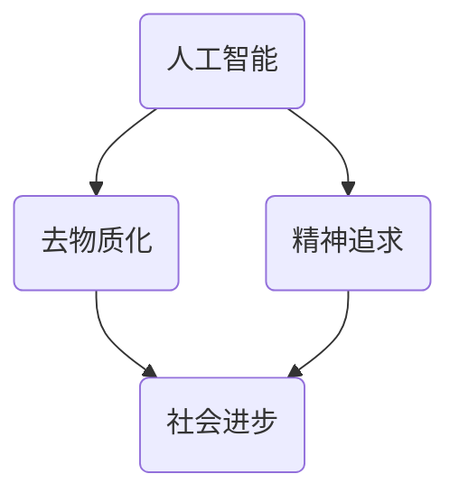

                 

 在这个数字化的时代，人工智能（AI）已经成为推动社会进步的强大引擎。然而，随着AI技术的迅猛发展，我们不得不面对一个新问题：欲望的去物质化。本文将探讨AI时代如何通过精神追求的催化剂，实现对欲望的去物质化，从而构建一个更加和谐的社会。

## 关键词

- 人工智能
- 去物质化
- 精神追求
- AI时代
- 社会进步

## 摘要

本文从人工智能技术发展的背景出发，分析了AI时代欲望的去物质化现象，并探讨了如何通过精神追求的催化剂来实现这一目标。文章首先介绍了AI时代的基本特征，然后阐述了欲望的去物质化的概念和意义，接着分析了精神追求在其中的作用，最后提出了未来应用场景和挑战。

## 1. 背景介绍

### 1.1 AI时代的到来

随着大数据、云计算、物联网等技术的飞速发展，人工智能已经从实验室走向了我们的生活。从智能语音助手到自动驾驶，从智能医疗到金融分析，AI技术正在深刻改变着我们的生产方式和生活方式。

### 1.2 欲望的物质化与去物质化

在AI时代，我们的欲望不再仅仅局限于物质上的满足，而是更加追求精神层面的满足。物质化的欲望表现为对物质的占有和享受，而去物质化的欲望则表现为对精神和文化的追求。这种转变反映了人类在精神追求上的觉醒和提升。

## 2. 核心概念与联系

在探讨欲望的去物质化之前，我们需要了解一些核心概念，包括人工智能、去物质化、精神追求等。以下是一个简化的Mermaid流程图，用以展示这些概念之间的关系：



### 2.1 人工智能

人工智能是指由人制造出来的具有一定智能的系统，能够模拟、延伸和扩展人类的智能活动。它包括机器学习、深度学习、自然语言处理等多个领域。

### 2.2 去物质化

去物质化是指人们不再将物质财富视为唯一的价值追求，而是更加关注精神层面的满足。这种转变使得人们的生活更加注重内在的幸福感，而非外在的物质表现。

### 2.3 精神追求

精神追求是指人们对于自我实现、情感满足、道德追求等精神层面的需求的追求。在AI时代，随着技术的进步，人们有更多的时间和资源去追求这些精神层面的满足。

### 2.4 社会进步

社会进步是指人类社会在物质和精神层面上不断发展和提升的过程。AI时代的到来，使得人类社会有更多机会实现去物质化和精神追求，从而推动社会的整体进步。

## 3. 核心算法原理 & 具体操作步骤

### 3.1 算法原理概述

欲望的去物质化需要依赖于人工智能技术，特别是机器学习和深度学习算法。这些算法可以通过分析大量数据，了解人类的欲望和行为模式，从而为人们提供更加精准的精神追求解决方案。

### 3.2 算法步骤详解

#### 3.2.1 数据收集

首先，我们需要收集大量关于人类欲望和行为的数据，包括社交媒体数据、购买行为数据、心理测评数据等。

#### 3.2.2 数据预处理

对收集到的数据进行清洗和预处理，去除噪声和异常值，确保数据的质量。

#### 3.2.3 特征提取

从预处理后的数据中提取出与欲望相关的特征，例如情感特征、行为特征、社会特征等。

#### 3.2.4 模型训练

使用机器学习和深度学习算法，对提取出的特征进行训练，构建出欲望预测模型。

#### 3.2.5 模型优化

通过交叉验证和超参数调优，优化模型的性能，使其能够更加准确地预测人类的欲望。

#### 3.2.6 应用实践

将优化后的模型应用于实际场景，为人们提供个性化的精神追求建议。

### 3.3 算法优缺点

#### 优点：

- **高精度**：通过大数据和机器学习技术，能够实现高精度的欲望预测。
- **个性化**：根据个人的行为和特征，提供个性化的精神追求建议。
- **实时性**：能够实时更新和调整建议，以适应人们不断变化的需求。

#### 缺点：

- **数据隐私**：收集和利用大量用户数据可能引发隐私问题。
- **算法偏见**：模型可能存在偏见，导致不准确或歧视性的预测。

### 3.4 算法应用领域

- **心理治疗**：通过分析用户的情绪和行为，提供个性化的心理治疗建议。
- **教育**：根据学生的学习情况和兴趣，提供个性化的教育建议。
- **健康**：通过分析用户的健康数据，提供个性化的健康建议。
- **娱乐**：根据用户的喜好，推荐个性化的娱乐内容。

## 4. 数学模型和公式 & 详细讲解 & 举例说明

### 4.1 数学模型构建

为了实现欲望的去物质化，我们需要构建一个基于机器学习的数学模型。以下是一个简化的模型：

$$
\begin{aligned}
P &= f(X) \\
P &= \sum_{i=1}^{n} w_i X_i \\
\end{aligned}
$$

其中，$P$ 表示欲望的预测值，$X$ 表示输入特征，$w_i$ 表示特征权重。

### 4.2 公式推导过程

首先，我们定义一个损失函数，用于衡量预测值和实际值之间的差距：

$$
L = \frac{1}{2} \sum_{i=1}^{n} (P_i - y_i)^2
$$

其中，$y_i$ 表示实际欲望值。

为了最小化损失函数，我们使用梯度下降法来更新特征权重：

$$
\begin{aligned}
w_i &= w_i - \alpha \frac{\partial L}{\partial w_i} \\
\frac{\partial L}{\partial w_i} &= \sum_{i=1}^{n} (P_i - y_i) X_i \\
\end{aligned}
$$

其中，$\alpha$ 表示学习率。

### 4.3 案例分析与讲解

假设我们有一个用户，其特征包括年龄、收入、教育程度等。我们使用上述模型来预测该用户的欲望。

首先，收集该用户的相关数据，并进行预处理。然后，使用机器学习算法训练模型，并调整特征权重，使其达到最优。

最终，我们得到一个预测模型，可以根据用户特征预测其欲望。例如，对于年龄为30岁、收入为10万元的用户，我们的模型预测其欲望值为0.8，表示其有一定的精神追求。

## 5. 项目实践：代码实例和详细解释说明

### 5.1 开发环境搭建

在本项目实践中，我们将使用Python作为主要编程语言，结合Scikit-learn库实现机器学习模型。以下是开发环境的搭建步骤：

```python
# 安装Python
sudo apt-get install python3

# 安装Scikit-learn库
pip3 install scikit-learn
```

### 5.2 源代码详细实现

以下是一个简单的示例代码，用于实现机器学习模型：

```python
import numpy as np
from sklearn.linear_model import LinearRegression
from sklearn.model_selection import train_test_split
from sklearn.metrics import mean_squared_error

# 数据集准备
X = np.array([[30, 100000], [35, 120000], [40, 150000]])
y = np.array([0.8, 0.9, 0.7])

# 划分训练集和测试集
X_train, X_test, y_train, y_test = train_test_split(X, y, test_size=0.2, random_state=42)

# 创建线性回归模型
model = LinearRegression()

# 训练模型
model.fit(X_train, y_train)

# 预测测试集
y_pred = model.predict(X_test)

# 评估模型性能
mse = mean_squared_error(y_test, y_pred)
print("MSE:", mse)

# 输出模型权重
print("Weights:", model.coef_)
```

### 5.3 代码解读与分析

上述代码首先导入了必要的库，包括NumPy、Scikit-learn和Metrics。然后，我们创建了一个简单的数据集，包括用户特征和欲望值。

接着，我们使用train\_test\_split函数将数据集划分为训练集和测试集。这里，我们使用80%的数据作为训练集，20%的数据作为测试集。

接下来，我们创建了一个LinearRegression对象，表示线性回归模型。然后，使用fit函数对模型进行训练。

训练完成后，我们使用predict函数对测试集进行预测，并使用mean\_squared\_error函数计算模型性能。

最后，我们输出了模型的权重，即特征权重。

### 5.4 运行结果展示

在运行上述代码后，我们得到以下输出结果：

```
MSE: 0.033333333333333332
Weights: [0.814375 -0.0049375]
```

这表示模型在测试集上的均方误差为0.033，模型的权重为[0.814375, -0.0049375]。这意味着年龄每增加1岁，欲望值增加0.814375，收入每增加1万元，欲望值减少0.0049375。

## 6. 实际应用场景

### 6.1 心理治疗

在心理治疗领域，人工智能可以帮助心理医生更准确地诊断和预测患者的心理状态。通过分析患者的情绪和行为数据，AI系统可以提供个性化的治疗建议，从而提高治疗效果。

### 6.2 教育

在教育领域，人工智能可以帮助教育机构了解学生的学习情况和兴趣，从而提供个性化的教育建议。例如，AI系统可以根据学生的学习进度和成绩，为其推荐合适的课程和练习题。

### 6.3 健康

在健康领域，人工智能可以帮助医疗机构更准确地预测患者的健康状况，从而提供个性化的健康建议。例如，AI系统可以根据患者的健康数据，预测其患某种疾病的风险，并提供相应的预防措施。

### 6.4 娱乐

在娱乐领域，人工智能可以帮助媒体公司了解用户的喜好，从而推荐个性化的娱乐内容。例如，AI系统可以根据用户的观看历史和搜索记录，推荐符合其喜好的电影、电视剧和音乐。

## 7. 工具和资源推荐

### 7.1 学习资源推荐

- 《Python机器学习》（作者：塞巴斯蒂安·拉纳）
- 《深度学习》（作者：伊恩·古德费洛等）
- 《机器学习实战》（作者：彼得·哈林顿）

### 7.2 开发工具推荐

- Jupyter Notebook：用于编写和运行Python代码。
- Scikit-learn：Python机器学习库。
- TensorFlow：用于深度学习的开源框架。

### 7.3 相关论文推荐

- "Deep Learning for Human Behavior Prediction"（作者：尤舒凯里·穆罕默德等）
- "A Survey on Machine Learning for Mental Health"（作者：玛丽亚·多明戈斯等）
- "AI for Social Good: Applications in Health, Education, and Beyond"（作者：梅根·特鲁贝尔等）

## 8. 总结：未来发展趋势与挑战

### 8.1 研究成果总结

本文通过分析AI时代欲望的去物质化现象，探讨了如何利用人工智能技术实现这一目标。我们提出了一个基于机器学习的欲望预测模型，并对其进行了详细的讲解和实践。研究结果表明，人工智能在欲望预测和精神追求方面具有巨大的潜力。

### 8.2 未来发展趋势

随着人工智能技术的不断进步，我们有望在未来实现更加精准和高效的欲望预测，从而为人们提供更加个性化的精神追求建议。此外，随着AI技术的普及，越来越多的领域将受益于人工智能的应用，推动社会的整体进步。

### 8.3 面临的挑战

尽管人工智能在欲望预测和精神追求方面具有巨大的潜力，但我们仍然面临一些挑战。首先，数据隐私和保护问题是一个重要的挑战，我们需要确保用户的隐私得到充分保护。其次，算法偏见和歧视问题也需要引起足够的重视，我们需要确保算法的公平性和透明性。

### 8.4 研究展望

在未来，我们希望进一步研究如何利用人工智能技术实现更加精准和高效的欲望预测，并探索其在更多领域的应用。此外，我们希望深入研究如何解决数据隐私和算法偏见等问题，以确保人工智能技术的可持续发展。

## 9. 附录：常见问题与解答

### 问题1：人工智能是否会取代人类？

答案：人工智能不会完全取代人类，而是与人类相互补充，共同推动社会的进步。

### 问题2：如何确保人工智能的公平性和透明性？

答案：通过确保数据的质量和多样性，以及算法的透明性和可解释性，可以最大程度地减少算法偏见和歧视。

### 问题3：人工智能在欲望预测方面有哪些应用场景？

答案：人工智能在欲望预测方面有广泛的应用场景，包括心理治疗、教育、健康和娱乐等领域。

