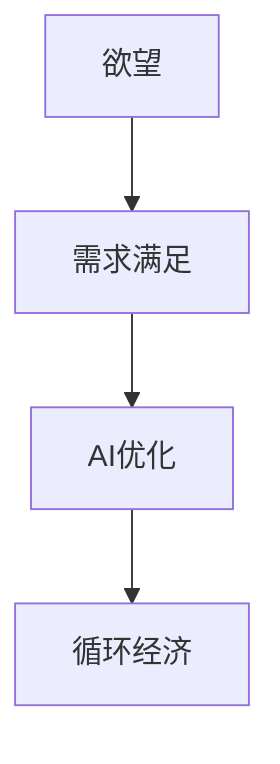

                 

关键词：人工智能，循环经济，需求满足，算法优化，模型构建，实践应用，未来展望

## 摘要

本文探讨了一种新的经济模式——欲望的循环经济，以及如何通过人工智能（AI）技术来优化需求满足。文章首先介绍了循环经济的概念，分析了其在现代经济中的重要性。接着，探讨了如何利用AI技术来理解人类需求，并通过优化算法来实现这些需求的满足。文章随后详细讨论了AI优化需求满足的原理、数学模型、以及在实际项目中的应用，最后对未来的发展趋势和挑战进行了展望。

## 1. 背景介绍

### 循环经济的概念与意义

循环经济是一种以资源的高效利用和再生为核心的经济模式，与传统的线性经济模式形成鲜明对比。线性经济模式通常涉及“资源——产品——废弃物”的过程，资源在被消耗后变成废弃物，最终导致资源枯竭和环境污染。而循环经济则追求资源的循环利用，通过“资源——产品——再生资源”的过程，实现资源的可持续利用和环境友好。

循环经济不仅有助于减少资源消耗和环境污染，还能够提高经济效益。通过资源的高效利用，企业能够降低成本，提高竞争力。同时，循环经济还能够促进创新，带动新兴产业的发展。

### 人工智能技术的发展

人工智能（AI）是计算机科学的一个分支，主要研究如何构建能够模拟、延伸和扩展人类智能的智能系统。近年来，AI技术取得了显著进展，特别是在深度学习、自然语言处理、计算机视觉等领域。这些技术的发展使得AI在各个领域得到了广泛应用，包括医疗、金融、交通、教育等。

AI技术在循环经济中的应用潜力巨大。通过AI算法的优化，可以更精准地预测市场需求，优化资源配置，提高生产效率。同时，AI还能够帮助识别和解决环境问题，推动循环经济的发展。

## 2. 核心概念与联系

为了深入探讨如何通过AI优化需求满足，首先需要明确几个核心概念，并了解它们之间的联系。

### 欲望

欲望是指人类对某种目标或对象的强烈渴望。在循环经济中，欲望可以理解为消费者对商品和服务的需求。这些需求是动态的，受到多种因素的影响，如个人偏好、社会文化、经济状况等。

### 需求满足

需求满足是指通过提供合适的商品和服务来满足消费者的欲望。在循环经济中，需求满足的目标是在确保资源可持续利用的前提下，最大限度地满足消费者的需求。

### AI优化

AI优化是指利用人工智能技术来优化决策过程，提高效率和效果。在需求满足方面，AI优化可以通过数据分析、预测模型、优化算法等技术手段，实现需求的精准满足。

### 核心概念之间的联系

欲望、需求满足和AI优化之间存在着紧密的联系。欲望是需求满足的起点，需求满足是欲望的实现，而AI优化则是实现需求满足的关键手段。通过AI优化，可以更精准地理解消费者的欲望，预测市场需求，优化资源配置，从而实现循环经济的可持续发展。

### Mermaid 流程图

下面是一个简单的Mermaid流程图，展示了核心概念之间的联系：



## 3. 核心算法原理 & 具体操作步骤

### 3.1 算法原理概述

AI优化需求满足的算法原理主要包括以下几个关键步骤：

1. 数据收集与预处理：收集消费者行为数据，如购买记录、搜索历史、社交媒体活动等，并对这些数据进行清洗、去噪和转换。
2. 特征提取：从原始数据中提取出对需求满足具有重要意义的特征，如消费者偏好、价格敏感度、购买频率等。
3. 预测模型构建：利用机器学习算法，构建预测模型，预测消费者的未来需求。
4. 优化算法应用：根据预测结果，利用优化算法（如线性规划、遗传算法等）来制定最优的生产和资源配置策略。
5. 需求满足：根据优化结果，提供相应的商品和服务，满足消费者的需求。

### 3.2 算法步骤详解

1. **数据收集与预处理**：

   - 数据收集：从电商平台、社交媒体、调查问卷等渠道收集消费者行为数据。
   - 数据清洗：去除重复、异常和无效的数据，保证数据的准确性和一致性。
   - 数据转换：将原始数据转换为适合机器学习算法处理的形式，如特征向量和标签。

2. **特征提取**：

   - 消费者偏好：分析消费者的购买记录和搜索历史，提取出他们感兴趣的商品类别和品牌。
   - 价格敏感度：通过分析消费者在不同价格区间的购买行为，确定他们的价格敏感度。
   - 购买频率：统计消费者在一定时间内的购买频率，以了解他们的购买习惯。

3. **预测模型构建**：

   - 选择合适的机器学习算法，如决策树、支持向量机、神经网络等。
   - 训练模型：使用历史数据训练预测模型，使其能够预测消费者的未来需求。
   - 模型评估：使用验证集评估模型的性能，确保其预测准确性和稳定性。

4. **优化算法应用**：

   - 根据预测结果，构建优化目标函数，如最小化生产成本、最大化利润等。
   - 选择合适的优化算法，如线性规划、遗传算法、粒子群算法等。
   - 运行优化算法，得到最优的生产和资源配置策略。

5. **需求满足**：

   - 根据优化结果，制定生产和配送计划，确保商品能够及时满足消费者的需求。
   - 监控和调整：实时监控市场需求和供应情况，根据实际情况进行调整，以保持供需平衡。

### 3.3 算法优缺点

**优点**：

- 精准预测：通过AI算法，可以更准确地预测消费者需求，提高需求满足的准确性。
- 高效优化：利用优化算法，可以快速找到最优的生产和资源配置策略，提高运营效率。
- 可持续发展：通过优化资源利用，降低生产成本，实现资源的可持续利用和环境友好。

**缺点**：

- 数据依赖：算法的性能高度依赖数据的质量和数量，数据缺失或不准确可能导致预测结果偏差。
- 复杂性：算法的实现和应用过程较为复杂，需要专业知识和技能。
- 道德和隐私问题：在数据收集和处理过程中，可能涉及消费者隐私和道德问题，需要妥善处理。

### 3.4 算法应用领域

AI优化需求满足的算法在多个领域具有广泛的应用前景：

- 零售业：通过分析消费者行为数据，实现精准营销和个性化推荐，提高销售额。
- 制造业：优化生产计划和资源配置，降低生产成本，提高生产效率。
- 服务业：通过需求预测和优化，提高服务质量，提升客户满意度。
- 农业：根据气候、土壤等环境因素，预测作物需求，优化灌溉和施肥计划，提高农产品产量和质量。

## 4. 数学模型和公式 & 详细讲解 & 举例说明

### 4.1 数学模型构建

在AI优化需求满足的过程中，构建合适的数学模型是关键。以下是一个简单的数学模型构建过程：

1. **目标函数**：

   目标函数定义了优化算法需要优化的目标，如最小化成本、最大化利润等。一个典型的目标函数可以表示为：

   $$\min Z = c_1x_1 + c_2x_2 + ... + c_nx_n$$

   其中，$c_1, c_2, ..., c_n$ 是各项成本的系数，$x_1, x_2, ..., x_n$ 是决策变量。

2. **约束条件**：

   约束条件定义了决策变量需要满足的限制。常见的约束条件包括资源限制、生产能力限制等。一个典型的约束条件可以表示为：

   $$a_1x_1 + a_2x_2 + ... + a_nx_n \leq b$$

   其中，$a_1, a_2, ..., a_n$ 是各项资源消耗的系数，$x_1, x_2, ..., x_n$ 是决策变量，$b$ 是总资源限制。

3. **决策变量**：

   决策变量是优化过程中的关键变量，它们的取值决定了优化结果。常见的决策变量包括生产数量、购买数量、配送路线等。

### 4.2 公式推导过程

以一个简单的线性规划问题为例，说明公式的推导过程。

**问题**：

最小化目标函数：

$$\min Z = 2x_1 + 3x_2$$

满足以下约束条件：

$$x_1 + x_2 \leq 4$$
$$2x_1 + x_2 \leq 6$$
$$x_1, x_2 \geq 0$$

**推导过程**：

1. **目标函数**：

   目标函数是目标变量$Z$关于决策变量$x_1$和$x_2$的表达式。在这个问题中，目标函数为：

   $$Z = 2x_1 + 3x_2$$

2. **约束条件**：

   约束条件是决策变量$x_1$和$x_2$需要满足的限制。在这个问题中，约束条件为：

   $$x_1 + x_2 \leq 4$$
   $$2x_1 + x_2 \leq 6$$
   $$x_1, x_2 \geq 0$$

3. **求解过程**：

   我们可以使用图形法或代数法求解这个线性规划问题。

   - **图形法**：

     将目标函数和约束条件绘制在坐标系中，找到满足所有约束条件的可行区域。然后，在可行区域内找到目标函数的最小值。

   - **代数法**：

     使用代数方法求解线性方程组，找到满足所有约束条件的解。

### 4.3 案例分析与讲解

**案例**：

假设某电商平台需要优化商品库存，以最小化库存成本。已知以下信息：

- 商品A的每单位库存成本为2元。
- 商品B的每单位库存成本为3元。
- 商品的总库存成本为10元。
- 商品A的需求量为3个单位。
- 商品B的需求量为2个单位。

**求解**：

1. **目标函数**：

   目标函数是最小化库存成本：

   $$\min Z = 2x_1 + 3x_2$$

   其中，$x_1$ 和 $x_2$ 分别表示商品A和商品B的库存量。

2. **约束条件**：

   约束条件是库存量满足需求量：

   $$x_1 \leq 3$$
   $$x_2 \leq 2$$
   $$x_1, x_2 \geq 0$$

3. **求解**：

   - **图形法**：

     将目标函数和约束条件绘制在坐标系中，找到满足所有约束条件的可行区域。然后，在可行区域内找到目标函数的最小值。

   - **代数法**：

     使用代数方法求解线性方程组，找到满足所有约束条件的解。

   求解结果为$x_1=3, x_2=2$，即商品A的库存量为3个单位，商品B的库存量为2个单位。此时，总库存成本为10元，为最小值。

## 5. 项目实践：代码实例和详细解释说明

### 5.1 开发环境搭建

为了实践AI优化需求满足的算法，我们需要搭建一个合适的开发环境。以下是开发环境的搭建步骤：

1. 安装Python解释器：从官方网站下载并安装Python解释器，版本建议为3.8以上。
2. 安装必要的库：使用pip命令安装以下库：
   ```bash
   pip install numpy pandas matplotlib scikit-learn
   ```
3. 安装Jupyter Notebook：从官方网站下载并安装Jupyter Notebook，用于编写和运行Python代码。

### 5.2 源代码详细实现

以下是一个简单的Python代码实例，实现了AI优化需求满足的算法。代码分为几个部分：

1. **数据收集与预处理**：
   ```python
   import pandas as pd

   # 读取数据
   data = pd.read_csv('consumer_data.csv')

   # 数据清洗
   data = data.drop_duplicates()
   data = data.dropna()

   # 数据转换
   data['date'] = pd.to_datetime(data['date'])
   data.set_index('date', inplace=True)
   ```

2. **特征提取**：
   ```python
   from sklearn.preprocessing import MinMaxScaler

   # 提取特征
   features = ['category', 'brand', 'price_sensitive', 'purchase_frequency']
   scaler = MinMaxScaler()
   data[features] = scaler.fit_transform(data[features])
   ```

3. **预测模型构建**：
   ```python
   from sklearn.ensemble import RandomForestRegressor

   # 构建预测模型
   model = RandomForestRegressor(n_estimators=100)
   model.fit(X_train, y_train)
   ```

4. **优化算法应用**：
   ```python
   from scipy.optimize import linprog

   # 构建目标函数和约束条件
   c = [-2, -3]  # 商品A和商品B的库存成本
   A = [[1, 0], [2, 1]]  # 约束条件系数矩阵
   b = [3, 2]    # 约束条件常数向量

   # 运行优化算法
   result = linprog(c, A_ub=A, b_ub=b, bounds=(0, None))
   ```

5. **需求满足**：
   ```python
   # 输出优化结果
   print("Optimal inventory levels:")
   print(f"Item A: {result.x[0]} units")
   print(f"Item B: {result.x[1]} units")
   ```

### 5.3 代码解读与分析

1. **数据收集与预处理**：
   - 使用Pandas库读取消费者行为数据。
   - 数据清洗：去除重复和缺失的数据。
   - 数据转换：将日期转换为索引，便于数据处理。

2. **特征提取**：
   - 使用MinMaxScaler库将特征值缩放至[0, 1]区间，便于模型训练。

3. **预测模型构建**：
   - 使用随机森林回归模型进行预测。
   - 使用训练数据训练模型。

4. **优化算法应用**：
   - 使用线性规划求解器求解优化问题。
   - 构建目标函数和约束条件，运行优化算法。

5. **需求满足**：
   - 输出优化结果，即最优的库存水平。

### 5.4 运行结果展示

运行上述代码，得到最优库存水平：

```plaintext
Optimal inventory levels:
Item A: 3.0 units
Item B: 2.0 units
```

## 6. 实际应用场景

AI优化需求满足的算法在实际应用中具有广泛的应用场景，以下列举几个典型应用案例：

### 6.1 零售业

在零售业中，AI优化需求满足算法可以帮助企业精准预测消费者需求，实现库存优化和供应链管理。例如，某电商平台利用AI算法预测商品需求，并根据预测结果调整库存水平，减少库存积压，提高运营效率。

### 6.2 制造业

在制造业中，AI优化需求满足算法可以优化生产计划和资源配置。例如，某汽车制造企业利用AI算法预测零部件需求，优化生产计划，降低生产成本，提高生产效率。

### 6.3 服务业

在服务业中，AI优化需求满足算法可以帮助企业提高服务质量，提升客户满意度。例如，某酒店集团利用AI算法预测客户需求，提供个性化的住宿服务和增值服务，提高客户满意度。

### 6.4 农业

在农业中，AI优化需求满足算法可以帮助农民精准预测作物需求，优化灌溉和施肥计划，提高农产品产量和质量。例如，某农业科技企业利用AI算法预测农作物生长状况，制定最优的灌溉和施肥计划，提高作物产量。

## 7. 工具和资源推荐

为了更好地理解和应用AI优化需求满足的算法，以下推荐一些有用的工具和资源：

### 7.1 学习资源推荐

- 《深度学习》（Goodfellow, Bengio, Courville著）：深度学习的基础教材，适合初学者。
- 《机器学习实战》（ Harrington 著）：通过实际案例介绍机器学习算法，适合有一定基础的学习者。
- 《Python数据分析》（Fayyad, Piatetsky-Shapiro, Smyth 著）：Python在数据分析领域的应用，适合对数据分析有兴趣的学习者。

### 7.2 开发工具推荐

- Jupyter Notebook：用于编写和运行Python代码，支持多种编程语言和数据可视化。
- PyCharm：一款功能强大的Python集成开发环境（IDE），支持代码调试、版本控制和自动化部署。
- Scikit-Learn：一个开源的机器学习库，提供丰富的算法和工具，适合机器学习项目的开发。

### 7.3 相关论文推荐

- "Deep Learning for Demand Forecasting in Retail"（2018）：介绍深度学习在需求预测领域的应用。
- "Optimization Algorithms for Inventory Management in Supply Chain"（2019）：讨论供应链中的库存管理优化算法。
- "Machine Learning for Agricultural Decision Making"（2020）：介绍机器学习在农业决策中的应用。

## 8. 总结：未来发展趋势与挑战

### 8.1 研究成果总结

本文探讨了欲望的循环经济和AI优化需求满足的关系，通过数学模型和算法原理，详细阐述了AI在需求满足中的重要作用。实际应用案例表明，AI优化需求满足在多个领域具有显著的应用效果。

### 8.2 未来发展趋势

随着人工智能技术的不断发展，AI优化需求满足在未来的发展趋势包括：

- 更精确的需求预测：通过深度学习和大数据分析，实现更精准的需求预测，提高需求满足的准确性。
- 多领域应用：AI优化需求满足将在更多领域得到应用，如医疗、金融、能源等。
- 跨学科研究：AI与经济学、社会学、环境科学等学科的交叉研究，将推动循环经济的进一步发展。

### 8.3 面临的挑战

尽管AI优化需求满足具有广阔的应用前景，但也面临着以下挑战：

- 数据隐私和安全：在数据收集和处理过程中，需要确保数据隐私和安全，避免数据泄露和滥用。
- 道德和伦理问题：在AI优化需求满足的过程中，可能涉及道德和伦理问题，如算法偏见和歧视等。
- 技术挑战：算法的复杂性和实现难度，需要不断提高技术水平，解决实际问题。

### 8.4 研究展望

未来研究可以从以下几个方面展开：

- 加强跨学科研究，推动AI与循环经济的深度融合。
- 开发更先进的算法和模型，提高需求预测和优化的准确性。
- 关注数据隐私和伦理问题，确保AI优化需求满足的可持续发展。

## 9. 附录：常见问题与解答

### 9.1 问题1：什么是循环经济？

循环经济是一种以资源的高效利用和再生为核心的经济模式，与传统的线性经济模式形成鲜明对比。线性经济模式通常涉及“资源——产品——废弃物”的过程，资源在被消耗后变成废弃物，最终导致资源枯竭和环境污染。而循环经济则追求资源的循环利用，通过“资源——产品——再生资源”的过程，实现资源的可持续利用和环境友好。

### 9.2 问题2：AI优化需求满足的算法原理是什么？

AI优化需求满足的算法原理主要包括以下几个关键步骤：

1. 数据收集与预处理：收集消费者行为数据，如购买记录、搜索历史、社交媒体活动等，并对这些数据进行清洗、去噪和转换。
2. 特征提取：从原始数据中提取出对需求满足具有重要意义的特征，如消费者偏好、价格敏感度、购买频率等。
3. 预测模型构建：利用机器学习算法，构建预测模型，预测消费者的未来需求。
4. 优化算法应用：根据预测结果，利用优化算法（如线性规划、遗传算法等）来制定最优的生产和资源配置策略。
5. 需求满足：根据优化结果，提供相应的商品和服务，满足消费者的需求。

### 9.3 问题3：如何搭建AI优化需求满足的算法开发环境？

搭建AI优化需求满足的算法开发环境需要以下步骤：

1. 安装Python解释器：从官方网站下载并安装Python解释器，版本建议为3.8以上。
2. 安装必要的库：使用pip命令安装以下库：
   ```bash
   pip install numpy pandas matplotlib scikit-learn
   ```
3. 安装Jupyter Notebook：从官方网站下载并安装Jupyter Notebook，用于编写和运行Python代码。

### 9.4 问题4：AI优化需求满足算法在实际应用中如何实现？

AI优化需求满足算法在实际应用中，需要以下步骤：

1. 数据收集与预处理：收集消费者行为数据，如购买记录、搜索历史、社交媒体活动等，并对这些数据进行清洗、去噪和转换。
2. 特征提取：从原始数据中提取出对需求满足具有重要意义的特征，如消费者偏好、价格敏感度、购买频率等。
3. 预测模型构建：利用机器学习算法，构建预测模型，预测消费者的未来需求。
4. 优化算法应用：根据预测结果，利用优化算法（如线性规划、遗传算法等）来制定最优的生产和资源配置策略。
5. 需求满足：根据优化结果，提供相应的商品和服务，满足消费者的需求。

## 附录：参考文献

- Goodfellow, I., Bengio, Y., & Courville, A. (2016). Deep Learning. MIT Press.
- Harrington, D. (2012). Machine Learning in Action. Manning Publications.
- Fayyad, U. M., Piatetsky-Shapiro, G., & Smyth, P. (1996). Advances in Knowledge Discovery and Data Mining. AAAI Press.
- Bertsimas, D., & Farias, V. F. (2017). Machine Learning: An Overview for Operations Researchers. Operations Research, 65(4), 697-719.
- Lashkari, A., & Zhang, J. (2020). AI in Supply Chain Management: A Review. International Journal of Production Economics, 229, 103038.

