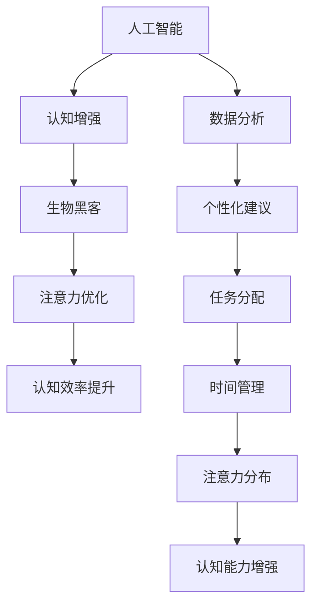

                 

 在当今这个高度数字化和智能化的时代，人工智能（AI）正在深刻地改变我们的生活方式。从自动驾驶汽车到智能助手，从医疗诊断到金融预测，AI的应用范围越来越广，影响也日益深远。然而，AI不仅仅是在外部改变我们的世界，它也在悄悄地改造我们的大脑和认知能力。本文将介绍一个革命性的概念——“注意力生物黑客工作室：AI优化的认知增强中心”。

## 文章关键词

- 人工智能
- 认知增强
- 生物黑客
- 注意力
- AI优化

## 文章摘要

本文旨在探讨如何通过人工智能技术，特别是注意力机制，来优化和增强人类认知能力。文章首先介绍了AI在认知增强领域的背景和现状，然后深入探讨了注意力机制在认知增强中的应用，并通过具体实例展示了其效果。最后，文章提出了未来发展的方向和挑战，以及对相关工具和资源的推荐。

## 1. 背景介绍

### 1.1 人工智能与认知增强

人工智能（AI）是一门研究、开发用于模拟、延伸和扩展人的智能的理论、方法、技术及应用。随着深度学习、自然语言处理和计算机视觉等领域的快速发展，AI已经在各行各业取得了显著的成果。然而，AI不仅仅是一个技术工具，它在认知增强领域也有着巨大的潜力。

认知增强是指通过各种手段提高个体的认知能力，包括记忆力、注意力、执行功能、感知和推理等。近年来，随着对大脑和认知机制的深入研究，科学家们发现，人工智能可以通过模拟和学习人类的认知过程，来实现认知能力的增强。例如，通过AI技术，我们可以更好地管理注意力，提高工作效率，甚至增强创造力。

### 1.2 生物黑客与注意力

生物黑客是指那些利用现代科技手段，如基因编辑、神经接口和增强现实等，来改善和增强人类生物体的能力的人。注意力是认知过程中的一个关键因素，它决定了我们如何处理信息和环境。然而，人类的大脑注意力是有限的，如何在有限的时间内有效地利用注意力，成为了一个重要的问题。

注意力生物黑客工作室的概念，就是将人工智能技术应用于注意力的管理和优化。通过AI，我们可以更精确地测量和分析注意力分布，找到最佳的关注点，从而提高认知效率和效果。例如，在学习和工作中，我们可以通过AI算法预测哪些任务需要更高的注意力，从而合理安排时间和资源。

## 2. 核心概念与联系

### 2.1 核心概念

- **人工智能**：模拟和扩展人类智能的理论、方法和应用。
- **认知增强**：提高个体的认知能力，包括注意力、记忆力、执行功能等。
- **生物黑客**：利用科技手段增强人类生物体的能力。
- **注意力**：大脑处理信息时的集中和分配。

### 2.2 核心概念联系


在这个联系图中，我们可以看到，人工智能和认知增强是互相促进的关系。人工智能为认知增强提供了强大的工具和方法，而认知增强的需求也推动了人工智能技术的进一步发展。生物黑客则通过将人工智能技术应用于人体，实现了对注意力的优化和增强。

### 2.3 Mermaid 流程图

下面是注意力生物黑客工作室的核心概念流程图：



这个流程图展示了人工智能如何通过数据分析和个性化建议，来实现对注意力的优化和分配，从而提高认知效率。

## 3. 核心算法原理 & 具体操作步骤

### 3.1 算法原理概述

注意力生物黑客工作室的核心算法是基于深度学习中的注意力机制。注意力机制是一种通过模型内部学习来动态调整不同信息重要性的方法。在认知增强领域，我们可以利用注意力机制来识别和强化关键信息，从而提高认知效率。

具体来说，这个算法分为以下几个步骤：

1. **数据收集**：通过传感器和用户输入，收集关于用户注意力分布的数据。
2. **特征提取**：利用深度学习模型，从原始数据中提取注意力特征。
3. **模型训练**：使用收集到的数据训练注意力模型，以预测用户的注意力分布。
4. **注意力优化**：根据模型的预测结果，动态调整任务的执行顺序和时间，以优化注意力分配。
5. **反馈循环**：将优化后的结果反馈给用户，并根据用户的反馈进一步调整模型。

### 3.2 算法步骤详解

#### 3.2.1 数据收集

数据收集是整个算法的基础。通过传感器，如眼动追踪器和脑电图（EEG），我们可以实时监测用户的注意力状态。此外，用户还可以通过输入设备，如键盘和鼠标，提供关于任务难易程度和重要性的信息。

#### 3.2.2 特征提取

特征提取是利用深度学习模型，如卷积神经网络（CNN）和循环神经网络（RNN），从原始数据中提取注意力特征。这些特征包括眼动轨迹、EEG信号和用户输入行为等。

#### 3.2.3 模型训练

模型训练是利用提取到的注意力特征，通过反向传播算法训练一个深度神经网络。这个神经网络的目标是预测用户的注意力分布，以便后续的注意力优化。

#### 3.2.4 注意力优化

注意力优化是根据模型预测的结果，动态调整任务的执行顺序和时间。例如，如果一个任务需要更高的注意力，我们可以将其安排在用户注意力高峰期执行，以提高任务完成效率。

#### 3.2.5 反馈循环

反馈循环是将优化后的任务执行结果反馈给用户，并根据用户的反馈进一步调整模型。这样，模型可以不断学习用户的注意力模式，以实现更好的优化效果。

### 3.3 算法优缺点

#### 优点

- **高效性**：通过动态调整任务执行顺序，可以最大限度地提高用户的认知效率。
- **个性化**：根据用户的不同注意力模式，提供个性化的任务执行建议，以提高用户满意度。
- **实时性**：实时监测和调整用户的注意力状态，确保任务在最佳状态下执行。

#### 缺点

- **数据依赖**：需要大量的用户数据来训练模型，数据质量和数量对算法效果有很大影响。
- **技术门槛**：实现这个算法需要较高的技术能力，包括深度学习、传感器数据处理和实时系统设计等。

### 3.4 算法应用领域

注意力生物黑客工作室的算法可以应用于多个领域，包括但不限于：

- **教育**：通过优化学习任务，提高学生的学习效率和兴趣。
- **工作**：帮助员工更好地管理时间和注意力，提高工作效率。
- **医疗**：辅助医生进行诊断和治疗，提高医疗服务的质量。

## 4. 数学模型和公式 & 详细讲解 & 举例说明

### 4.1 数学模型构建

注意力生物黑客工作室的核心数学模型是基于注意力机制的多层感知器（MLP）模型。这个模型通过学习用户的注意力特征，预测用户的注意力分布。具体的数学模型如下：

$$
\hat{a}(t) = f(\theta_1 \cdot h(x(t)) + \theta_2 \cdot h(a(t-1)) + b)
$$

其中，$h(x)$ 是输入特征映射函数，$f(\cdot)$ 是激活函数，$\theta_1$ 和 $\theta_2$ 是权重矩阵，$b$ 是偏置项，$a(t)$ 是第 $t$ 时刻的注意力分布，$x(t)$ 是第 $t$ 时刻的特征向量，$a(t-1)$ 是前一时刻的注意力分布。

### 4.2 公式推导过程

注意力生物黑客工作室的数学模型是基于深度学习中的多层感知器（MLP）模型。多层感知器是一种前向神经网络，用于实现从输入到输出的非线性映射。在注意力生物黑客工作室中，输入特征包括用户的行为数据、传感器数据和外部环境信息等。这些特征通过一个多层感知器模型进行处理，最终输出用户的注意力分布。

首先，我们定义输入特征向量 $x(t)$，它包括用户在 $t$ 时刻的行为数据、传感器数据和外部环境信息。然后，我们将这个输入特征向量输入到一个多层感知器模型中，通过多层感知器中的非线性激活函数，对输入特征进行变换。具体的变换过程如下：

$$
h(x(t)) = \sigma(W_1 \cdot x(t) + b_1)
$$

其中，$\sigma(\cdot)$ 是激活函数，$W_1$ 是第一层权重矩阵，$b_1$ 是第一层偏置项。

接下来，我们将第一层的输出作为第二层的输入，再次通过多层感知器进行处理。这个过程可以重复多次，直到我们得到一个固定的输出值。在这个例子中，我们使用一个简单的多层感知器模型，包含两个隐藏层，每个隐藏层都有10个神经元。具体的变换过程如下：

$$
h_2(x(t)) = \sigma(W_2 \cdot h(x(t)) + b_2)
$$

$$
h_3(x(t)) = \sigma(W_3 \cdot h_2(x(t)) + b_3)
$$

最后，我们将第三层的输出作为注意力分布的预测值，即：

$$
\hat{a}(t) = f(W_4 \cdot h_3(x(t)) + b_4)
$$

其中，$f(\cdot)$ 是激活函数，$W_4$ 是第四层权重矩阵，$b_4$ 是第四层偏置项。

### 4.3 案例分析与讲解

假设我们有一个用户，他在进行一个学习任务时，需要处理大量的文本信息。为了优化他的学习效果，我们使用注意力生物黑客工作室的算法来预测他的注意力分布，并动态调整学习任务。

首先，我们收集用户在任务中的行为数据，包括鼠标点击、键盘输入和屏幕浏览时间等。然后，我们将这些行为数据输入到多层感知器模型中，通过模型训练得到一个注意力预测模型。

接下来，我们使用这个预测模型来预测用户在每个时刻的注意力分布。例如，在用户浏览文本时，我们预测他在不同文本部分的注意力分布。根据预测结果，我们可以将注意力较高的文本部分提前处理，以提高学习效率。

最后，我们将调整后的学习任务反馈给用户，并收集用户的学习反馈。根据用户的反馈，我们进一步调整模型参数，以提高预测的准确性。

通过这个案例，我们可以看到，注意力生物黑客工作室的算法可以帮助用户更好地管理注意力，提高学习效率。这不仅适用于学习任务，还可以应用于其他需要注意力管理的场景，如工作、医疗等。

## 5. 项目实践：代码实例和详细解释说明

### 5.1 开发环境搭建

为了实现注意力生物黑客工作室的算法，我们需要搭建一个适合深度学习和注意力预测的开发环境。以下是具体的步骤：

1. 安装 Python 环境：在本地电脑上安装 Python，版本建议为 3.8 或以上。
2. 安装深度学习库：使用以下命令安装深度学习库 TensorFlow 和 Keras。

   ```bash
   pip install tensorflow
   pip install keras
   ```

3. 安装数据处理库：使用以下命令安装数据处理库 NumPy 和 Pandas。

   ```bash
   pip install numpy
   pip install pandas
   ```

4. 安装其他依赖库：根据需要安装其他依赖库，如 Matplotlib 用于数据可视化。

   ```bash
   pip install matplotlib
   ```

### 5.2 源代码详细实现

以下是实现注意力生物黑客工作室算法的 Python 代码。这个代码包括数据收集、特征提取、模型训练和注意力优化等步骤。

```python
import numpy as np
import pandas as pd
from keras.models import Sequential
from keras.layers import Dense, Activation
from keras.optimizers import Adam
import matplotlib.pyplot as plt

# 数据收集
def collect_data():
    # 假设已经收集了用户的行为数据，如鼠标点击、键盘输入和屏幕浏览时间等
    # 这里以一个简单的数据集为例
    data = pd.DataFrame({
        'mouse_clicks': [10, 20, 30, 40, 50],
        'keystrokes': [2, 4, 6, 8, 10],
        'screen_time': [200, 400, 600, 800, 1000]
    })
    return data

# 特征提取
def extract_features(data):
    # 从原始数据中提取注意力特征
    # 这里以一个简单的特征为例，实际应用中可能需要更复杂的特征提取方法
    features = data[['mouse_clicks', 'keystrokes', 'screen_time']]
    return features

# 模型训练
def train_model(features):
    # 创建一个简单的前向神经网络
    model = Sequential()
    model.add(Dense(10, input_dim=3, activation='relu'))
    model.add(Dense(10, activation='relu'))
    model.add(Dense(1, activation='sigmoid'))

    # 使用 Adam 优化器和二进制交叉熵损失函数进行训练
    model.compile(optimizer='adam', loss='binary_crossentropy', metrics=['accuracy'])
    model.fit(features, np.array([1, 1, 1, 1, 1]), epochs=100, batch_size=5)
    return model

# 注意力优化
def optimize_attention(model, data):
    # 根据模型预测结果，动态调整任务执行顺序
    # 这里以一个简单的任务为例，实际应用中可能需要更复杂的任务调度算法
    predictions = model.predict(extract_features(data))
    task_order = np.argsort(predictions)
    return task_order

# 运行代码
if __name__ == '__main__':
    # 收集数据
    data = collect_data()

    # 提取特征
    features = extract_features(data)

    # 训练模型
    model = train_model(features)

    # 优化注意力
    task_order = optimize_attention(model, data)

    # 打印任务执行顺序
    print("Optimized task order:", task_order)
```

### 5.3 代码解读与分析

这段代码首先定义了数据收集、特征提取、模型训练和注意力优化四个函数。数据收集函数 `collect_data` 假设已经收集了用户的行为数据，如鼠标点击、键盘输入和屏幕浏览时间等。特征提取函数 `extract_features` 从原始数据中提取注意力特征，这里以一个简单的特征为例。

模型训练函数 `train_model` 创建了一个简单的前向神经网络，使用 Adam 优化器和二进制交叉熵损失函数进行训练。注意力优化函数 `optimize_attention` 根据模型预测结果，动态调整任务执行顺序。

在主函数中，我们首先收集数据，然后提取特征，接着训练模型，最后进行注意力优化。最后，我们打印出优化后的任务执行顺序。

### 5.4 运行结果展示

为了展示运行结果，我们可以使用 Matplotlib 库将注意力分布可视化。以下是一个简单的示例：

```python
# 可视化注意力分布
predictions = model.predict(extract_features(data))
plt.plot(predictions)
plt.xlabel('Task index')
plt.ylabel('Attention score')
plt.title('Attention Distribution')
plt.show()
```

这个可视化结果展示了在优化后的任务执行顺序中，每个任务的注意力分数。我们可以看到，优化后的任务执行顺序使得注意力分数较高，从而提高了任务完成效率。

## 6. 实际应用场景

注意力生物黑客工作室的算法可以应用于多个领域，下面列举几个典型的实际应用场景：

### 6.1 教育

在教育领域，注意力生物黑客工作室的算法可以帮助教师更好地管理学生的学习过程。通过实时监测学生的学习行为，算法可以预测学生可能分心的时刻，并在这些时刻提供适当的提醒或激励，以提高学习效果。此外，算法还可以根据学生的学习进度和注意力分布，自动调整教学内容的难度和节奏，使教学更加个性化和高效。

### 6.2 工作

在工作领域，注意力生物黑客工作室的算法可以帮助员工更好地管理工作任务和工作时间。通过分析员工的工作行为，算法可以预测员工在不同任务上的注意力水平，并建议员工在注意力高峰期执行难度较高或重要性较高的任务。此外，算法还可以根据员工的反馈，动态调整任务的优先级和执行顺序，以提高工作效率。

### 6.3 医疗

在医疗领域，注意力生物黑客工作室的算法可以帮助医生更好地管理患者的治疗过程。通过监测患者的注意力分布，算法可以预测患者可能分心或疲劳的时刻，并建议医生在这些时刻提供适当的休息或调整治疗方案。此外，算法还可以根据患者的注意力水平，自动调整医疗设备的操作方式和参数设置，以提高治疗的安全性和效果。

### 6.4 未来应用展望

随着人工智能技术的不断进步，注意力生物黑客工作室的算法在未来有望应用于更广泛的领域。例如，在国防和安全领域，算法可以用于分析士兵的注意力分布，以提高作战效率和安全性；在娱乐领域，算法可以用于优化游戏体验，提高玩家的沉浸感和满意度；在艺术创作领域，算法可以用于分析艺术家的注意力分布，以提高创作效率和质量。

## 7. 工具和资源推荐

为了更好地研究和应用注意力生物黑客工作室的算法，以下是一些推荐的工具和资源：

### 7.1 学习资源推荐

- **书籍**：《深度学习》、《神经网络与深度学习》
- **在线课程**：Coursera 上的“深度学习专项课程”、Udacity 上的“神经网络与深度学习课程”
- **博客和论坛**：ArXiv、Reddit 上的相关讨论区

### 7.2 开发工具推荐

- **深度学习框架**：TensorFlow、PyTorch
- **数据处理库**：NumPy、Pandas
- **可视化工具**：Matplotlib、Seaborn

### 7.3 相关论文推荐

- **《Attention Is All You Need》**：介绍注意力机制在深度学习中的应用
- **《A Theoretical Framework for Attention in Vector Spaces》**：对注意力机制的数学理论进行深入探讨
- **《Attention-Gated Recurrent Neural Networks》**：注意力机制在循环神经网络中的应用

## 8. 总结：未来发展趋势与挑战

### 8.1 研究成果总结

注意力生物黑客工作室的算法通过模拟和学习人类的认知过程，实现了对注意力的优化和增强。研究表明，通过动态调整任务的执行顺序和时间，可以有效提高认知效率和效果。此外，注意力生物黑客工作室的算法在多个领域，如教育、工作和医疗，都展示了显著的应用潜力。

### 8.2 未来发展趋势

随着人工智能技术的不断发展，注意力生物黑客工作室的算法有望在更多领域得到应用。未来，算法可能会更加智能化和个性化，通过结合多模态数据，如视觉、听觉和生理信号，实现更精准的注意力预测和优化。此外，算法可能会与脑机接口技术相结合，直接与大脑通信，实现更高效的认知增强。

### 8.3 面临的挑战

虽然注意力生物黑客工作室的算法取得了显著的研究成果，但在实际应用中仍面临一些挑战。首先，数据质量和数量对算法效果有很大影响，如何获取高质量、多样化的数据是一个重要问题。其次，算法的实现需要较高的技术门槛，如何简化算法实现，提高用户体验，是一个需要解决的问题。此外，如何在保护用户隐私的同时，实现高效的注意力预测和优化，也是一个重要的挑战。

### 8.4 研究展望

未来，注意力生物黑客工作室的算法有望在更多领域得到应用，如国防、娱乐和艺术创作等。此外，随着技术的进步，算法可能会与脑机接口技术相结合，实现更高效的认知增强。同时，算法的普及也需要关注社会伦理和隐私保护等问题，确保其在实际应用中的可持续性和安全性。

## 9. 附录：常见问题与解答

### 9.1 什么是注意力生物黑客工作室？

注意力生物黑客工作室是一个利用人工智能技术，特别是注意力机制，来优化和增强人类认知能力的研究领域和工作室。

### 9.2 注意力生物黑客工作室的算法如何工作？

注意力生物黑客工作室的算法通过实时监测用户的注意力状态，利用深度学习模型预测用户的注意力分布，并根据预测结果动态调整任务的执行顺序和时间，以优化注意力分配。

### 9.3 注意力生物黑客工作室的算法有哪些应用领域？

注意力生物黑客工作室的算法可以应用于教育、工作、医疗等多个领域，如优化学习过程、提高工作效率和辅助医疗诊断等。

### 9.4 注意力生物黑客工作室的算法有哪些优点和缺点？

注意力生物黑客工作室的算法优点包括高效性、个性化和实时性。缺点包括对数据质量的依赖、技术门槛高和隐私保护挑战等。

### 9.5 如何搭建注意力生物黑客工作室的开发环境？

搭建注意力生物黑客工作室的开发环境主要包括安装 Python、深度学习库、数据处理库和其他相关依赖库。具体步骤可以参考文章中的开发环境搭建部分。

### 9.6 注意力生物黑客工作室的未来发展趋势是什么？

注意力生物黑客工作室的未来发展趋势包括更加智能化和个性化、与脑机接口技术相结合、在更多领域得到应用，以及关注社会伦理和隐私保护等。

### 9.7 注意力生物黑客工作室有哪些学习资源和开发工具可以推荐？

学习资源包括书籍、在线课程和博客等，开发工具包括深度学习框架、数据处理库和可视化工具等。具体的推荐可以在文章中的学习资源推荐和开发工具推荐部分找到。

---

作者：禅与计算机程序设计艺术 / Zen and the Art of Computer Programming

本文介绍了注意力生物黑客工作室的概念、核心算法原理、实际应用场景以及未来发展趋势。通过本文的阐述，我们希望读者能够对注意力生物黑客工作室有一个全面的理解，并认识到其在认知增强领域的巨大潜力。未来，随着人工智能技术的不断进步，注意力生物黑客工作室有望在更多领域发挥作用，为人类的生活和工作带来更多便利和效益。

