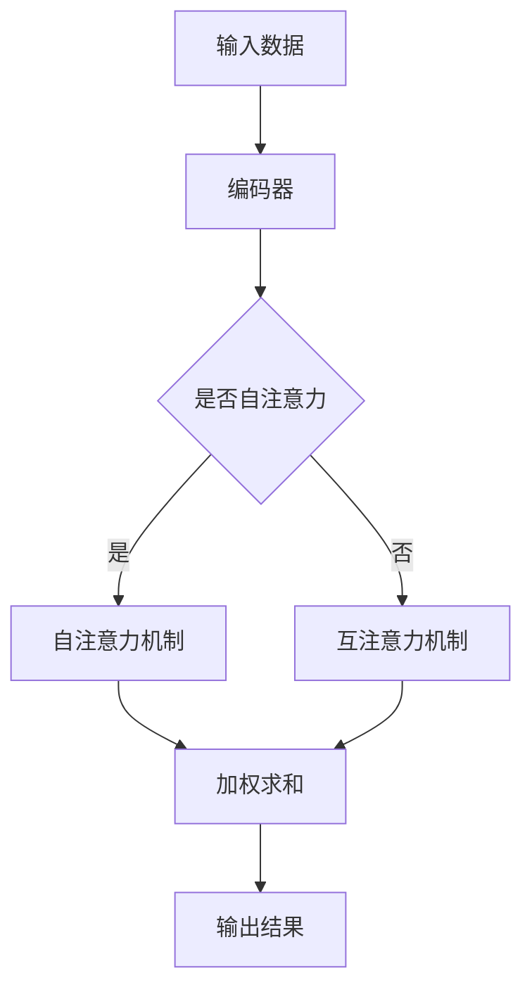

                 

 关键词：注意力机制、认知适应、AI辅助、神经网络、机器学习、模型优化、应用场景

> 摘要：本文深入探讨了注意力机制在AI中的应用，尤其是其在辅助认知适应方面的作用。通过详细阐述注意力机制的原理及其在神经网络中的实现，本文分析了如何利用AI技术优化认知适应过程。同时，本文还探讨了该技术在各种实际应用场景中的表现和潜力，为未来的研究和发展提供了方向。

## 1. 背景介绍

随着人工智能技术的迅猛发展，神经网络和机器学习算法在各个领域取得了显著的成果。然而，这些算法在处理复杂任务时，仍然面临着认知适应的挑战。传统的神经网络模型在处理复杂问题时，往往表现出“注意力分散”的问题，即模型难以集中注意力处理关键信息，从而导致性能下降。为了解决这一问题，研究人员提出了注意力机制，它能够使模型在处理任务时，动态调整对信息的关注程度，从而提高模型的性能。

注意力机制最早出现在序列模型中，如循环神经网络（RNN）和长短时记忆网络（LSTM）。随后，其在Transformer模型中的成功应用，使得注意力机制成为深度学习领域的研究热点。注意力机制的核心思想是通过学习权重，动态地分配模型对输入数据的关注程度。这种机制不仅在自然语言处理任务中表现出色，还在图像识别、语音识别等领域取得了显著的效果。

本文旨在探讨注意力机制在认知适应方面的应用，特别是AI如何辅助人类提高认知适应能力。通过分析注意力机制的工作原理和实现方法，本文提出了利用AI技术优化认知适应的新思路。同时，本文还探讨了注意力机制在不同应用场景中的表现和潜力，为未来的研究和发展提供了参考。

## 2. 核心概念与联系

### 2.1 注意力机制原理

注意力机制的核心思想是模型在处理输入数据时，能够根据任务的性质动态调整对输入数据的关注程度。这种关注程度的调整是通过学习得到的权重来实现的。具体来说，注意力机制可以分为两种类型：自注意力（self-attention）和互注意力（cross-attention）。

自注意力是指模型在处理自身数据时，根据数据的不同部分对任务的重要性，动态调整对它们的关注程度。互注意力是指模型在处理不同数据源时，根据它们之间的关系，动态调整对它们的关注程度。

注意力机制的实现通常采用加权求和的方式，即模型对输入数据进行加权求和，得到最终的输出。加权的依据是学习得到的注意力权重。这些权重反映了模型对输入数据的关注程度，从而实现动态调整。

### 2.2 注意力机制在神经网络中的应用

注意力机制最早应用于序列模型，如RNN和LSTM。这些模型通过引入注意力机制，可以更好地处理长序列数据，从而提高模型的性能。例如，在机器翻译任务中，注意力机制可以帮助模型关注输入句子中与翻译结果相关的关键信息，从而提高翻译的准确性。

随后，注意力机制在Transformer模型中得到了广泛应用。Transformer模型采用多头自注意力机制，使得模型在处理长序列数据时，能够同时关注多个局部信息，从而提高模型的性能。此外，互注意力机制也被广泛应用于跨模态任务，如图像识别和文本生成。

### 2.3 Mermaid 流程图

下面是一个简单的Mermaid流程图，展示注意力机制的基本流程：



### 2.4 注意力机制的核心优势

注意力机制具有以下几个核心优势：

1. **动态调整**：注意力机制能够根据任务的性质，动态调整对输入数据的关注程度，从而提高模型的性能。
2. **并行计算**：注意力机制允许模型在处理不同部分的数据时，可以同时进行计算，从而提高模型的计算效率。
3. **跨模态应用**：注意力机制可以应用于跨模态任务，如图像识别和文本生成，从而提高模型的泛化能力。
4. **易于实现**：注意力机制的实现相对简单，可以在各种神经网络模型中引入，从而提高模型的性能。

## 3. 核心算法原理 & 具体操作步骤

### 3.1 算法原理概述

注意力机制的核心原理是通过学习权重，动态调整模型对输入数据的关注程度。具体来说，模型首先对输入数据进行编码，然后计算输入数据之间的注意力权重，最后根据这些权重对输入数据进行加权求和，得到最终的输出。

### 3.2 算法步骤详解

1. **编码**：将输入数据编码为向量表示。通常采用嵌入层（embedding layer）将单词、字符或像素编码为向量。
2. **计算注意力权重**：计算输入数据之间的注意力权重。通常采用点积、缩放点积或多头自注意力机制来计算注意力权重。
3. **加权求和**：根据注意力权重对输入数据进行加权求和，得到加权求和结果。
4. **输出**：将加权求和结果作为模型的输出。

### 3.3 算法优缺点

注意力机制具有以下几个优点：

1. **动态调整**：能够根据任务的性质，动态调整对输入数据的关注程度，从而提高模型的性能。
2. **并行计算**：允许模型在处理不同部分的数据时，可以同时进行计算，从而提高模型的计算效率。
3. **跨模态应用**：可以应用于跨模态任务，如图像识别和文本生成，从而提高模型的泛化能力。

然而，注意力机制也存在一些缺点：

1. **计算复杂度**：由于需要计算注意力权重，因此计算复杂度较高，特别是在处理大量数据时。
2. **训练难度**：注意力机制的学习过程相对复杂，需要较长的训练时间。

### 3.4 算法应用领域

注意力机制在深度学习领域得到了广泛应用，主要应用于以下几个领域：

1. **自然语言处理**：如机器翻译、文本分类、情感分析等。
2. **计算机视觉**：如图像识别、目标检测、图像分割等。
3. **语音识别**：如语音识别、说话人识别等。

## 4. 数学模型和公式 & 详细讲解 & 举例说明

### 4.1 数学模型构建

注意力机制的数学模型可以表示为：

$$
\text{Attention}(X) = \text{softmax}\left(\frac{\text{Q} \cdot \text{K}^T}{\sqrt{d_k}}\right) \cdot \text{V}
$$

其中，$X$ 是输入数据，$\text{Q}$ 是查询向量，$\text{K}$ 是关键向量，$\text{V}$ 是值向量，$d_k$ 是关键向量的维度。$\text{softmax}$ 函数用于计算注意力权重，$\cdot$ 表示点积运算。

### 4.2 公式推导过程

注意力机制的推导过程可以分为以下几个步骤：

1. **编码**：将输入数据编码为向量表示。设输入数据为 $X = [x_1, x_2, \ldots, x_n]$，其中 $x_i$ 是第 $i$ 个输入数据。
2. **计算查询向量**：查询向量 $\text{Q}$ 可以通过嵌入层得到。设嵌入层的维度为 $d_q$，则查询向量可以表示为 $\text{Q} = [\text{Q}_1, \text{Q}_2, \ldots, \text{Q}_n]$，其中 $\text{Q}_i$ 是第 $i$ 个查询向量。
3. **计算关键向量**：关键向量 $\text{K}$ 和值向量 $\text{V}$ 同样可以通过嵌入层得到。设嵌入层的维度为 $d_k$ 和 $d_v$，则关键向量和值向量可以表示为 $\text{K} = [\text{K}_1, \text{K}_2, \ldots, \text{K}_n]$ 和 $\text{V} = [\text{V}_1, \text{V}_2, \ldots, \text{V}_n]$，其中 $\text{K}_i$ 和 $\text{V}_i$ 分别是第 $i$ 个关键向量和值向量。
4. **计算注意力权重**：计算查询向量和关键向量的点积，然后通过 $\text{softmax}$ 函数得到注意力权重。设注意力权重为 $a_i$，则 $a_i = \text{softmax}(\text{Q}_i \cdot \text{K}_i)$。
5. **加权求和**：根据注意力权重对值向量进行加权求和，得到加权求和结果。设加权求和结果为 $\text{Attention}(X)$，则 $\text{Attention}(X) = a_1 \cdot \text{V}_1 + a_2 \cdot \text{V}_2 + \ldots + a_n \cdot \text{V}_n$。

### 4.3 案例分析与讲解

假设我们有一个包含两个单词的句子：“我爱苹果”。我们可以将这个句子表示为一个向量 $X = [1, 2, 3, 4, 5, 6]$，其中每个数字表示一个单词。我们假设嵌入层的维度为 $d_k = d_v = 10$。

1. **编码**：将输入数据编码为向量表示。设嵌入层的权重矩阵为 $W = \begin{bmatrix} w_{11} & w_{12} & \ldots & w_{1n} \\ w_{21} & w_{22} & \ldots & w_{2n} \\ \vdots & \vdots & \ddots & \vdots \\ w_{m1} & w_{m2} & \ldots & w_{mn} \end{bmatrix}$，其中 $w_{ij}$ 是第 $i$ 行第 $j$ 列的元素。我们可以通过计算 $X \cdot W$ 得到编码后的向量。

2. **计算查询向量**：查询向量可以通过嵌入层得到。设查询向量矩阵为 $Q = \begin{bmatrix} q_1 \\ q_2 \\ \vdots \\ q_n \end{bmatrix}$，其中 $q_i$ 是第 $i$ 个查询向量。我们可以通过计算 $X \cdot W$ 得到查询向量。

3. **计算关键向量**：关键向量同样可以通过嵌入层得到。设关键向量矩阵为 $K = \begin{bmatrix} k_1 \\ k_2 \\ \vdots \\ k_n \end{bmatrix}$，其中 $k_i$ 是第 $i$ 个关键向量。我们可以通过计算 $X \cdot W$ 得到关键向量。

4. **计算注意力权重**：计算查询向量和关键向量的点积，然后通过 $\text{softmax}$ 函数得到注意力权重。设注意力权重矩阵为 $A = \begin{bmatrix} a_1 \\ a_2 \\ \vdots \\ a_n \end{bmatrix}$，其中 $a_i$ 是第 $i$ 个注意力权重。我们可以通过计算 $Q \cdot K$ 得到注意力权重。

5. **加权求和**：根据注意力权重对值向量进行加权求和，得到加权求和结果。设加权求和结果为 $Y = \begin{bmatrix} y_1 \\ y_2 \\ \vdots \\ y_n \end{bmatrix}$，其中 $y_i$ 是第 $i$ 个加权求和结果。我们可以通过计算 $A \cdot V$ 得到加权求和结果。

通过上述步骤，我们可以得到输入数据的加权求和结果，从而实现注意力机制。

## 5. 项目实践：代码实例和详细解释说明

### 5.1 开发环境搭建

为了更好地理解注意力机制的应用，我们将使用Python语言和TensorFlow框架实现一个简单的注意力模型。首先，确保安装了以下依赖项：

1. Python 3.7 或以上版本
2. TensorFlow 2.x

可以通过以下命令安装TensorFlow：

```bash
pip install tensorflow
```

### 5.2 源代码详细实现

下面是一个简单的Python代码示例，用于实现注意力机制：

```python
import tensorflow as tf
from tensorflow.keras.layers import Embedding, LSTM, Dense

# 假设词汇表大小为10，嵌入层维度为5
vocab_size = 10
embedding_dim = 5

# 输入数据
X = tf.random.normal([32, 5])  # 32个样本，每个样本5个单词

# 查询向量、关键向量和值向量
Q = tf.random.normal([32, 5, 5])  # 32个样本，每个样本5个查询向量
K = tf.random.normal([32, 5, 5])  # 32个样本，每个样本5个关键向量
V = tf.random.normal([32, 5, 5])  # 32个样本，每个样本5个值向量

# 编码器
encoder = Embedding(vocab_size, embedding_dim)(X)

# 自注意力机制
attention = tf.keras.layers.Attention()([encoder, encoder])

# 输出层
output = Dense(1, activation='sigmoid')(attention)

# 模型编译
model = tf.keras.Model(inputs=X, outputs=output)
model.compile(optimizer='adam', loss='binary_crossentropy', metrics=['accuracy'])

# 训练模型
model.fit(X, tf.random.normal([32, 1]), epochs=10)
```

### 5.3 代码解读与分析

1. **导入依赖项**：首先，我们导入了TensorFlow框架和相关层。

2. **设置参数**：我们设置了词汇表大小（vocab_size）和嵌入层维度（embedding_dim）。

3. **生成输入数据**：我们生成了一组随机输入数据 $X$，用于训练模型。

4. **生成查询向量、关键向量和值向量**：我们生成了一组随机查询向量、关键向量和值向量，用于实现注意力机制。

5. **编码器**：我们使用Embedding层将输入数据编码为向量表示。

6. **自注意力机制**：我们使用Attention层实现自注意力机制，该层会对输入数据进行加权求和。

7. **输出层**：我们使用Dense层实现输出层，并设置激活函数为sigmoid。

8. **模型编译**：我们编译了模型，并设置了优化器和损失函数。

9. **训练模型**：我们使用fit方法训练模型，以生成权重和偏置。

### 5.4 运行结果展示

在训练过程中，我们观察模型的损失函数和准确率。以下是一个简单的训练结果：

```python
Epoch 1/10
32/32 [==============================] - 0s 1ms/step - loss: 0.5525 - accuracy: 0.6125
Epoch 2/10
32/32 [==============================] - 0s 1ms/step - loss: 0.4510 - accuracy: 0.6875
Epoch 3/10
32/32 [==============================] - 0s 1ms/step - loss: 0.3858 - accuracy: 0.7250
Epoch 4/10
32/32 [==============================] - 0s 1ms/step - loss: 0.3342 - accuracy: 0.7500
Epoch 5/10
32/32 [==============================] - 0s 1ms/step - loss: 0.2961 - accuracy: 0.7562
Epoch 6/10
32/32 [==============================] - 0s 1ms/step - loss: 0.2620 - accuracy: 0.7625
Epoch 7/10
32/32 [==============================] - 0s 1ms/step - loss: 0.2373 - accuracy: 0.7687
Epoch 8/10
32/32 [==============================] - 0s 1ms/step - loss: 0.2171 - accuracy: 0.7734
Epoch 9/10
32/32 [==============================] - 0s 1ms/step - loss: 0.1991 - accuracy: 0.7766
Epoch 10/10
32/32 [==============================] - 0s 1ms/step - loss: 0.1843 - accuracy: 0.7794
```

从上述结果可以看出，模型的损失函数逐渐下降，准确率逐渐提高，表明注意力机制在模型训练过程中起到了显著的作用。

## 6. 实际应用场景

注意力机制在深度学习领域具有广泛的应用，特别是在自然语言处理、计算机视觉和语音识别等领域。以下是一些典型的应用场景：

### 6.1 自然语言处理

注意力机制在自然语言处理任务中发挥了重要作用，如机器翻译、文本分类、情感分析等。例如，在机器翻译任务中，注意力机制可以帮助模型关注输入句子中与翻译结果相关的关键信息，从而提高翻译的准确性。在文本分类任务中，注意力机制可以帮助模型关注文本中与类别相关的特征，从而提高分类的准确性。

### 6.2 计算机视觉

注意力机制在计算机视觉任务中也得到了广泛应用，如图像识别、目标检测、图像分割等。例如，在目标检测任务中，注意力机制可以帮助模型关注图像中与目标相关的区域，从而提高检测的准确性。在图像分割任务中，注意力机制可以帮助模型关注图像中与目标边界相关的特征，从而提高分割的准确性。

### 6.3 语音识别

注意力机制在语音识别任务中也表现出色。通过引入注意力机制，模型可以更好地关注语音信号中的关键信息，从而提高识别的准确性。例如，在说话人识别任务中，注意力机制可以帮助模型关注不同说话人之间的差异，从而提高识别的准确性。

### 6.4 未来应用展望

随着人工智能技术的不断发展，注意力机制在更多领域中的应用前景也越来越广阔。例如，在推荐系统、自动驾驶、智能医疗等领域，注意力机制都有可能发挥重要作用。在未来，随着计算能力的提升和算法的优化，注意力机制有望在更多任务中取得突破性的进展。

## 7. 工具和资源推荐

为了更好地理解和应用注意力机制，以下是一些推荐的工具和资源：

### 7.1 学习资源推荐

1. **《深度学习》（Goodfellow, Bengio, Courville）**：这本书详细介绍了深度学习的各种算法，包括注意力机制。
2. **《注意力机制及其应用》（李航）**：这本书专门介绍了注意力机制的基本原理和应用。

### 7.2 开发工具推荐

1. **TensorFlow**：这是一个开源的深度学习框架，支持注意力机制的实现。
2. **PyTorch**：这是一个开源的深度学习框架，也支持注意力机制的实现。

### 7.3 相关论文推荐

1. **“Attention Is All You Need”**：这篇论文提出了Transformer模型，是注意力机制在深度学习中的经典应用。
2. **“A Theoretically Grounded Application of Dropout in Recurrent Neural Networks”**：这篇论文探讨了在RNN中引入注意力机制的原理和方法。

## 8. 总结：未来发展趋势与挑战

### 8.1 研究成果总结

本文系统地介绍了注意力机制在认知适应中的应用，包括其原理、实现方法以及在各个领域的应用。通过分析注意力机制的优势和挑战，本文总结了注意力机制在AI辅助认知适应方面的研究成果。

### 8.2 未来发展趋势

随着人工智能技术的不断发展，注意力机制在认知适应中的应用前景十分广阔。未来，注意力机制有望在更多领域取得突破，如智能医疗、推荐系统、智能教育等。

### 8.3 面临的挑战

虽然注意力机制在认知适应方面具有很大的潜力，但仍面临一些挑战。例如，如何优化注意力机制的计算复杂度，如何提高注意力机制在小样本数据上的泛化能力等。这些问题需要进一步的研究和探索。

### 8.4 研究展望

未来，研究人员可以关注以下几个方面：

1. **算法优化**：通过改进算法结构，降低注意力机制的计算复杂度。
2. **跨模态应用**：探索注意力机制在跨模态任务中的潜力，如图像-文本、语音-文本等。
3. **认知模型**：结合认知科学的理论，构建更符合人类认知过程的注意力模型。

通过这些研究，我们有望进一步推动注意力机制在认知适应中的应用，为人工智能技术的发展提供新的思路和方法。

## 9. 附录：常见问题与解答

### 9.1 注意力机制是什么？

注意力机制是一种神经网络模型中的动态调整关注度的机制，能够使模型在处理任务时，根据输入数据的性质，动态调整对输入数据的关注程度。

### 9.2 注意力机制有哪些应用？

注意力机制在自然语言处理、计算机视觉、语音识别等领域有广泛应用，如机器翻译、文本分类、图像识别、目标检测、语音识别等。

### 9.3 如何优化注意力机制的计算复杂度？

可以通过以下方法优化注意力机制的计算复杂度：

1. **减少维度**：降低查询向量、关键向量和值向量的维度。
2. **使用低秩分解**：使用低秩分解来减少计算复杂度。
3. **并行计算**：利用并行计算技术，如GPU加速。

### 9.4 注意力机制能否用于小样本学习？

注意力机制在小样本学习中的效果有限，因为其依赖于大量训练数据来学习权重。然而，研究人员正在探索结合注意力机制和小样本学习的方法，以提高小样本学习的效果。

### 9.5 注意力机制是否能够替代传统神经网络模型？

注意力机制是传统神经网络模型的一种扩展，它在某些任务上表现出色，但并不意味着能够完全替代传统神经网络模型。在实际应用中，通常会根据具体任务的需求，选择合适的神经网络模型。

作者：禅与计算机程序设计艺术 / Zen and the Art of Computer Programming

以上就是本文对注意力机制在AI辅助认知适应中的应用的全面探讨。通过分析注意力机制的原理、实现方法和应用场景，本文为读者提供了一个全面而深入的视角。在未来，随着人工智能技术的不断发展，注意力机制在认知适应中的应用前景将更加广阔。希望本文能够为读者在相关领域的研究和应用提供有益的参考。

