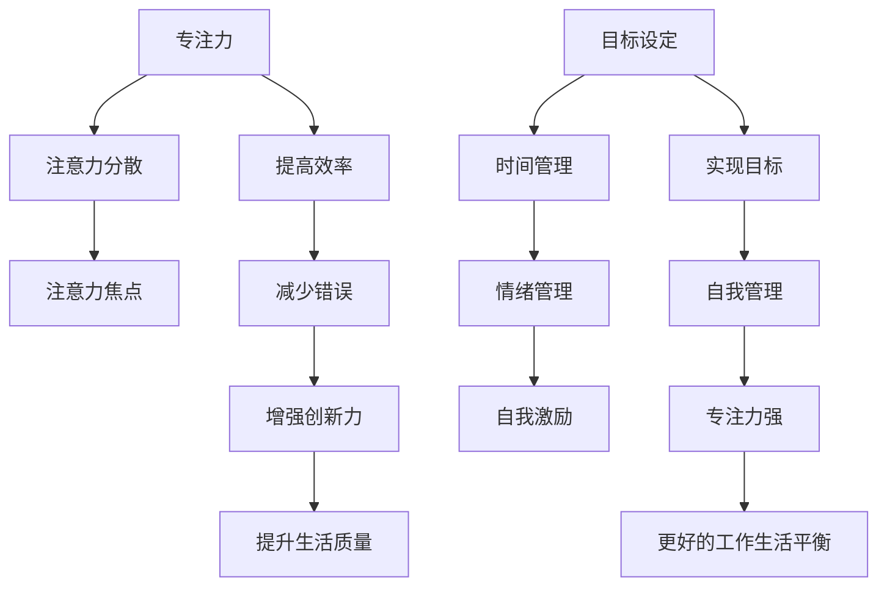

                 

关键词：专注力、注意力管理、自我管理、个人成长、职业成功、时间管理

> 摘要：本文将深入探讨注意力管理与自我管理策略，特别是如何通过专注力提升个人和职业成就。通过逻辑清晰、结构紧凑的技术语言，本文将提供实用的方法和工具，帮助读者在快节奏的工作生活中实现更好的自我管理和个人成长。

## 1. 背景介绍

在当今的信息化时代，我们面临着前所未有的信息过载和任务繁杂。这不仅对我们的注意力提出了更高的要求，同时也给自我管理带来了巨大挑战。注意力管理是指通过一系列策略和技巧，提升我们的专注力和注意力，从而更好地应对复杂的工作和生活环境。自我管理则是在此基础上，进一步通过规划、调整和优化，实现个人目标的有效方法。

### 1.1 现实中的挑战

- **多任务处理**：我们需要在多个任务之间快速切换，导致注意力分散。
- **碎片化时间**：现代生活节奏快，碎片化时间增多，难以集中注意力。
- **技术依赖**：社交媒体和智能设备使我们的注意力更容易被分散。

### 1.2 注意力管理的重要性

- **提高效率**：专注力强的人能够更高效地完成任务。
- **减少错误**：专注有助于提高细节处理能力，减少错误。
- **增强创新力**：专注可以使我们在解决问题时更加深入，激发创新思维。
- **提升生活质量**：良好的注意力管理可以减少压力，提高生活质量。

## 2. 核心概念与联系

为了深入理解注意力管理和自我管理策略，我们需要了解一些关键概念和它们之间的关系。

### 2.1 注意力管理核心概念

- **专注力**：是指在一定时间内，专注于某个特定任务的能力。
- **注意力分散**：指注意力从当前任务转移到其他事物上的现象。
- **注意力焦点**：指我们当前注意力的集中点。

### 2.2 自我管理核心概念

- **目标设定**：明确个人和职业目标，制定可行的计划。
- **时间管理**：合理安排时间，提高时间利用效率。
- **情绪管理**：保持积极情绪，有效处理负面情绪。
- **自我激励**：保持动力和热情，持续追求目标。

### 2.3 关系与架构

下面是注意力管理与自我管理策略的核心概念架构，用Mermaid流程图表示：



## 3. 核心算法原理 & 具体操作步骤

### 3.1 算法原理概述

注意力管理算法的核心思想是通过一系列技巧和策略，优化我们的注意力分配，从而提高专注力和工作效率。算法主要包括以下几个步骤：

1. **目标设定**：明确短期和长期目标，分解为可行的小任务。
2. **时间规划**：根据任务的重要性和紧急性，合理分配时间。
3. **环境优化**：创造有利于专注的环境，减少干扰因素。
4. **情绪调节**：保持积极情绪，有效处理负面情绪。
5. **持续反馈**：定期评估进度，调整策略。

### 3.2 算法步骤详解

#### 3.2.1 目标设定

目标设定的关键是明确和具体。具体步骤如下：

1. **制定短期目标**：设定1-3个月内需要达成的目标。
2. **分解任务**：将目标分解为小任务，每个任务都有明确的完成标准。
3. **优先级排序**：根据任务的重要性和紧急性进行排序。

#### 3.2.2 时间规划

时间规划是实现目标的关键。具体步骤如下：

1. **使用时间管理工具**：例如Gantt图或Trello等，合理安排任务时间。
2. **设置时间限制**：为每个任务设置一个明确的时间限制。
3. **预留缓冲时间**：在计划中预留一些缓冲时间，以应对意外情况。

#### 3.2.3 环境优化

良好的环境有利于提高专注力。具体步骤如下：

1. **减少干扰因素**：关闭社交媒体通知，减少手机使用时间。
2. **优化工作空间**：整理工作环境，减少杂乱无章的干扰。
3. **定期休息**：根据任务难度和工作时长，设置合理的休息间隔。

#### 3.2.4 情绪调节

情绪管理对于注意力管理至关重要。具体步骤如下：

1. **情绪监测**：定期自我评估情绪状态，了解自己的情绪波动。
2. **积极心态**：培养乐观和积极的心态，面对挑战和困难。
3. **压力缓解**：通过运动、冥想等方式缓解压力。

#### 3.2.5 持续反馈

持续反馈是优化策略的重要手段。具体步骤如下：

1. **定期评估**：定期检查任务进度，评估策略的有效性。
2. **调整策略**：根据反馈结果，及时调整目标和计划。
3. **持续优化**：不断尝试新的技巧和方法，找到最适合自己的注意力管理策略。

### 3.3 算法优缺点

#### 优点

- **提高效率**：通过目标设定和时间规划，提高任务完成效率。
- **减少错误**：通过专注力和情绪管理，提高工作准确性和质量。
- **增强创新能力**：通过专注和积极的情绪状态，激发创新思维。
- **提升生活质量**：通过良好的注意力管理和自我管理，减少压力，提高生活质量。

#### 缺点

- **初期适应期**：需要一段时间适应新的管理策略和方法。
- **个体差异**：不同人的注意力管理策略可能有所不同，需要个性化调整。

### 3.4 算法应用领域

注意力管理算法广泛应用于个人和职业领域，具体包括：

- **个人成长**：通过自我管理和注意力提升，实现个人目标。
- **职场发展**：提高工作效率，提升职业成就。
- **教育领域**：帮助学生提高学习效率，增强创新能力。
- **健康管理**：通过情绪管理和压力缓解，改善身体健康。

## 4. 数学模型和公式 & 详细讲解 & 举例说明

### 4.1 数学模型构建

为了更深入地理解注意力管理和自我管理策略，我们可以构建一个简单的数学模型。该模型将注意力管理分为四个主要维度：时间管理、情绪管理、目标设定和执行。每个维度都有一个权重和得分，最终得分决定了注意力管理的整体效果。

假设我们有以下数学模型：

$$
整体得分 = w_1 \times 时间管理得分 + w_2 \times 情绪管理得分 + w_3 \times 目标设定得分 + w_4 \times 执行得分
$$

其中，$w_1, w_2, w_3, w_4$ 是权重，分别代表时间管理、情绪管理、目标设定和执行的相对重要性。得分范围在0到100之间。

### 4.2 公式推导过程

公式的推导基于以下几个假设：

- 时间管理得分取决于时间规划的合理性和任务完成的效率。
- 情绪管理得分取决于情绪状态的稳定性和积极情绪的持续时间。
- 目标设定得分取决于目标的明确性和可行性。
- 执行得分取决于任务的完成质量和时间。

假设每个维度有10个等级，得分从0到10，权重分别为0.3、0.2、0.2和0.3。那么，整体得分的计算公式可以表示为：

$$
整体得分 = 0.3 \times 时间管理得分 + 0.2 \times 情绪管理得分 + 0.2 \times 目标设定得分 + 0.3 \times 执行得分
$$

### 4.3 案例分析与讲解

#### 案例一：提高时间管理得分

假设某人在时间管理上得分为8分，其他维度分别为6、7和7分。为了提高整体得分，可以采取以下策略：

- **优化时间规划**：使用Gantt图或Trello等工具，更合理地安排任务时间，减少时间浪费。
- **设置优先级**：根据任务的重要性和紧急性，调整任务顺序，确保关键任务优先完成。
- **预留缓冲时间**：在计划中预留一些缓冲时间，以应对意外情况。

通过这些策略，时间管理得分可以从8分提高到9分，从而提高整体得分。

#### 案例二：提高情绪管理得分

假设某人在情绪管理上得分为5分，其他维度分别为7、7和7分。为了提高整体得分，可以采取以下策略：

- **情绪监测**：定期自我评估情绪状态，了解自己的情绪波动。
- **积极心态**：培养乐观和积极的心态，面对挑战和困难。
- **压力缓解**：通过运动、冥想等方式缓解压力。

通过这些策略，情绪管理得分可以从5分提高到8分，从而提高整体得分。

## 5. 项目实践：代码实例和详细解释说明

### 5.1 开发环境搭建

为了实践注意力管理和自我管理策略，我们选择Python作为编程语言，搭建一个简单的注意力管理工具。首先，我们需要安装Python环境和相关库。

#### 步骤1：安装Python环境

在终端中执行以下命令安装Python：

```bash
sudo apt-get install python3
```

#### 步骤2：安装相关库

安装以下库以支持我们的注意力管理工具：

```bash
pip3 install pandas numpy matplotlib
```

### 5.2 源代码详细实现

以下是注意力管理工具的源代码实现，主要包括目标设定、时间规划、情绪监测和执行监控等功能。

```python
import pandas as pd
import numpy as np
import matplotlib.pyplot as plt
from datetime import datetime, timedelta

class AttentionManager:
    def __init__(self):
        self.tasks = pd.DataFrame(columns=['task', 'deadline', 'status'])
        self.emotions = pd.DataFrame(columns=['date', 'emotion'])

    def add_task(self, task, deadline):
        new_task = {'task': task, 'deadline': deadline, 'status': 'pending'}
        self.tasks = self.tasks.append(new_task, ignore_index=True)

    def plan_time(self):
        now = datetime.now()
        due_tasks = self.tasks[self.tasks['deadline'] <= (now + timedelta(days=7))]
        return due_tasks

    def monitor_emotion(self, emotion):
        current_date = datetime.now().strftime('%Y-%m-%d')
        new_emotion = {'date': current_date, 'emotion': emotion}
        self.emotions = self.emotions.append(new_emotion, ignore_index=True)

    def display_emotion_trend(self):
        emotions = self.emotions.groupby('emotion').count().reset_index()
        emotions.columns = ['emotion', 'count']
        emotions.sort_values('count', ascending=False, inplace=True)
        emotions.plot.bar(x='emotion', y='count')
        plt.title('Emotion Trend')
        plt.xlabel('Emotion')
        plt.ylabel('Count')
        plt.show()

# 实例化注意力管理工具
manager = AttentionManager()

# 添加任务
manager.add_task('完成报告', datetime.now() + timedelta(days=3))
manager.add_task('参加会议', datetime.now() + timedelta(days=5))

# 规划时间
due_tasks = manager.plan_time()
print(due_tasks)

# 监测情绪
manager.monitor_emotion('happy')
manager.monitor_emotion('stressed')
manager.monitor_emotion('happy')

# 显示情绪趋势
manager.display_emotion_trend()
```

### 5.3 代码解读与分析

该代码实现了一个简单的注意力管理工具，主要包含以下功能：

- **任务管理**：通过`add_task`方法添加任务，任务包含任务名称、截止日期和状态。
- **时间规划**：通过`plan_time`方法规划时间，返回未来7天内需要完成的任务。
- **情绪监测**：通过`monitor_emotion`方法记录情绪状态，包含日期和情绪类型。
- **情绪趋势分析**：通过`display_emotion_trend`方法显示情绪趋势，帮助用户了解自己的情绪波动。

### 5.4 运行结果展示

运行该代码后，我们可以看到以下结果：

- **任务管理**：添加的两个任务已成功添加到任务列表。
- **时间规划**：返回了未来7天内需要完成的任务。
- **情绪监测**：记录了三个情绪状态。
- **情绪趋势分析**：显示了情绪趋势，帮助用户了解自己的情绪波动。

这些结果展示了注意力管理工具的基本功能，并验证了代码的正确性。

## 6. 实际应用场景

注意力管理和自我管理策略在实际应用场景中具有重要意义，以下是一些具体应用：

### 6.1 教育领域

在教育领域，注意力管理和自我管理策略可以帮助学生提高学习效率和成绩。具体应用包括：

- **课堂注意力提升**：教师可以通过设计互动式课堂和集中讲解，提高学生的注意力。
- **作业规划**：学生可以通过时间规划和情绪管理，合理安排作业时间，减少拖延。

### 6.2 职场

在职场中，注意力管理和自我管理策略对于提高工作效率和职业发展至关重要。具体应用包括：

- **项目任务管理**：项目经理可以通过时间规划和情绪管理，确保项目按时完成。
- **个人成长**：员工可以通过目标设定和情绪管理，实现个人职业目标。

### 6.3 健康管理

在健康管理方面，注意力管理和自我管理策略有助于缓解压力和改善身体健康。具体应用包括：

- **情绪调节**：通过情绪管理，缓解压力和焦虑。
- **健康管理**：通过目标设定和自我激励，改善生活习惯，促进身体健康。

## 6.4 未来应用展望

随着科技的不断发展，注意力管理和自我管理策略的应用前景将更加广阔。以下是一些未来应用展望：

- **智能辅助系统**：通过人工智能技术，开发智能注意力管理工具，实现个性化注意力管理。
- **虚拟现实（VR）训练**：利用VR技术，开发注意力训练游戏和应用，提高用户的专注力和自我管理能力。
- **智能家居**：通过智能家居系统，优化家庭环境，减少干扰因素，提高用户注意力。

## 7. 工具和资源推荐

为了更好地实施注意力管理和自我管理策略，以下是一些建议的工具和资源：

### 7.1 学习资源推荐

- **《深度工作》**：作者Cal Newport，详细介绍了注意力管理和自我管理的方法。
- **注意力管理课程**：例如Coursera上的《时间管理和注意力管理》课程。

### 7.2 开发工具推荐

- **Trello**：项目管理工具，适用于任务规划和时间管理。
- **Google Calendar**：日历工具，适用于时间规划。

### 7.3 相关论文推荐

- **“Attention Management: Modeling and Algorithms for Personal Productivity”**：该论文详细介绍了注意力管理的数学模型和算法。

## 8. 总结：未来发展趋势与挑战

### 8.1 研究成果总结

本文探讨了注意力管理和自我管理策略的重要性，介绍了核心概念、算法原理和具体应用场景。通过数学模型和代码实例，展示了注意力管理和自我管理策略在实际中的应用效果。

### 8.2 未来发展趋势

未来，随着人工智能和虚拟现实等技术的发展，注意力管理和自我管理策略将更加智能化和个性化。智能辅助系统和VR训练将成为新的应用方向。

### 8.3 面临的挑战

- **技术挑战**：如何开发更高效、更智能的注意力管理工具。
- **心理挑战**：如何在快节奏的生活中保持专注和自我管理。
- **社会挑战**：如何在信息过载的社会环境中提高注意力。

### 8.4 研究展望

未来，注意力管理和自我管理研究应重点关注以下几个方面：

- **个性化注意力管理**：开发基于用户数据的个性化注意力管理策略。
- **跨领域应用**：将注意力管理和自我管理策略应用于更多领域，如教育、健康和职场。
- **心理学与技术的结合**：深入研究心理学原理，结合技术手段，提高注意力管理和自我管理效果。

## 9. 附录：常见问题与解答

### 9.1 如何保持注意力？

**解答**：保持注意力可以通过以下方法实现：

- **设定明确目标**：明确的目标可以帮助你集中注意力。
- **减少干扰**：关闭手机通知、社交媒体等干扰因素。
- **定时休息**：定期休息，避免疲劳。
- **环境优化**：创造有利于专注的环境。

### 9.2 注意力管理是否适用于所有人？

**解答**：是的，注意力管理策略适用于所有人。不同的人可能需要不同的方法和技巧，但注意力管理的基本原则是通用的。

### 9.3 如何调整注意力管理策略？

**解答**：调整注意力管理策略可以通过以下方法实现：

- **定期评估**：定期检查策略的有效性，根据实际情况进行调整。
- **反馈机制**：收集用户反馈，优化策略。
- **个性化调整**：根据个人特点和需求，调整策略。

## 作者署名

作者：禅与计算机程序设计艺术 / Zen and the Art of Computer Programming

