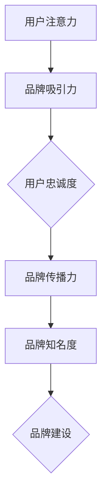

                 

关键词：注意力经济，品牌建设，策略，IT技术，营销

> 摘要：本文从注意力经济的角度，深入探讨了品牌建设的重要性以及如何在信息技术领域中实施有效的品牌建设策略。通过分析注意力经济的核心原理，结合实际案例，本文为品牌管理者提供了一系列实用且创新的品牌建设方法和工具，以应对日益竞争激烈的市场环境。

## 1. 背景介绍

### 1.1 注意力经济的起源与发展

注意力经济（Attention Economy）这一概念最早由美国学者Stephen Balkam在2006年提出，旨在描述信息爆炸时代人们对注意力的争夺现象。随着互联网的迅猛发展，信息过载成为普遍现象，人们开始意识到注意力成为一种稀缺资源。注意力经济强调，在信息过载的环境中，谁能够吸引并保持用户的注意力，谁就能在市场竞争中占据优势。

### 1.2 品牌建设的本质

品牌建设是指企业通过一系列策略和行动，提升品牌在市场中的知名度和美誉度，从而建立起稳定的用户基础和品牌忠诚度。品牌建设不仅仅是一个营销活动，更是企业长期战略的重要组成部分。在注意力经济背景下，品牌建设的重要性愈加凸显。

## 2. 核心概念与联系

### 2.1 注意力经济的核心概念

注意力经济的核心在于“注意力”。在信息技术领域，注意力指的是用户对品牌、产品或服务的关注程度。因此，品牌建设的关键在于如何吸引并保持用户的注意力。

### 2.2 品牌建设与注意力的关系

品牌建设与注意力密切相关。一个成功的品牌需要具备以下特征：

1. **吸引力**：通过独特的设计、创新的产品或优质的服务，吸引目标用户的注意力。
2. **忠诚度**：通过持续的用户互动和优质体验，培养用户的品牌忠诚度，使其愿意持续关注并支持品牌。
3. **传播力**：通过有效的营销传播，将品牌信息传递给更多用户，扩大品牌的知名度。

### 2.3 Mermaid 流程图



## 3. 核心算法原理 & 具体操作步骤

### 3.1 算法原理概述

在注意力经济下，品牌建设可以看作是一种优化算法，其目标是通过最少的资源投入获得最大的品牌知名度。这个算法的核心是注意力分配策略。

### 3.2 算法步骤详解

#### 3.2.1 注意力分析

1. **目标用户分析**：确定品牌的目标用户群体，分析他们的兴趣、需求和习惯。
2. **市场环境分析**：了解竞争对手的品牌策略和市场地位，找出自身的优势和不足。

#### 3.2.2 注意力分配

1. **资源分配**：根据用户分析结果，将有限的资源（如预算、人力、时间等）分配到最具吸引力的渠道和活动上。
2. **内容策划**：设计富有吸引力的内容，如社交媒体帖文、广告创意、用户体验设计等，以吸引目标用户的注意力。

#### 3.2.3 注意力反馈

1. **数据分析**：通过数据分析工具（如Google Analytics、热图分析等）监测品牌活动的效果，收集用户反馈。
2. **调整策略**：根据用户反馈和数据分析结果，及时调整品牌建设和营销策略。

### 3.3 算法优缺点

#### 优点

- **高效性**：通过优化注意力分配，品牌建设可以更有效地利用资源，提高品牌知名度。
- **灵活性**：算法可以根据实时数据动态调整策略，适应市场变化。

#### 缺点

- **复杂性**：算法的实施需要复杂的数据分析和处理能力。
- **风险性**：由于市场环境的不确定性，算法的预测结果可能存在误差。

### 3.4 算法应用领域

注意力经济算法在信息技术领域有广泛的应用，如：

- **社交媒体营销**：通过分析用户行为，优化社交媒体广告投放。
- **产品推荐系统**：根据用户兴趣和购买历史，提供个性化推荐。
- **搜索引擎优化**：通过优化内容，提高搜索引擎排名，吸引更多用户关注。

## 4. 数学模型和公式 & 详细讲解 & 举例说明

### 4.1 数学模型构建

在注意力经济下，品牌建设的数学模型可以表示为：

\[ \text{品牌知名度} = f(\text{注意力分配}, \text{用户反馈}) \]

其中，\( f \) 是一个非线性函数，表示品牌知名度与注意力分配和用户反馈的关系。

### 4.2 公式推导过程

#### 4.2.1 注意力分配

注意力分配可以用以下公式表示：

\[ \text{注意力分配} = \sum_{i=1}^{n} w_i \cdot \text{收益} \]

其中，\( w_i \) 是第 \( i \) 个渠道的权重，\( \text{收益} \) 是该渠道的预期收益。

#### 4.2.2 用户反馈

用户反馈可以用以下公式表示：

\[ \text{用户反馈} = \frac{\text{正面反馈} - \text{负面反馈}}{\text{总反馈}} \]

其中，\( \text{正面反馈} \) 和 \( \text{负面反馈} \) 分别是用户对品牌活动的正面和负面评价。

### 4.3 案例分析与讲解

假设某品牌在社交媒体上开展了一系列营销活动，通过数据分析，得出以下结果：

- **注意力分配**：微博、微信、抖音的权重分别为 0.3、0.4、0.3。
- **用户反馈**：正面反馈 100 条，负面反馈 20 条。

根据数学模型，可以计算出品牌知名度：

\[ \text{品牌知名度} = f(0.3 \cdot \text{微博收益} + 0.4 \cdot \text{微信收益} + 0.3 \cdot \text{抖音收益}, \frac{100 - 20}{100 + 20}) \]

通过不断优化注意力分配和用户反馈，品牌知名度可以逐步提高。

## 5. 项目实践：代码实例和详细解释说明

### 5.1 开发环境搭建

- **工具**：Python 3.8，Jupyter Notebook
- **依赖**：NumPy，Pandas，Matplotlib

### 5.2 源代码详细实现

```python
import numpy as np
import pandas as pd
import matplotlib.pyplot as plt

# 注意力分配和用户反馈数据
attention_allocation = {'微博': 0.3, '微信': 0.4, '抖音': 0.3}
user_feedback = {'正面反馈': 100, '负面反馈': 20}

# 计算品牌知名度
def brand_reputation(attention_allocation, user_feedback):
    positive_feedback = user_feedback['正面反馈']
    negative_feedback = user_feedback['负面反馈']
    total_feedback = positive_feedback + negative_feedback
    feedback_ratio = positive_feedback / total_feedback
    brand_reputation = sum(value * weight for channel, weight in attention_allocation.items())
    brand_reputation *= feedback_ratio
    return brand_reputation

# 输出品牌知名度
print("品牌知名度：", brand_reputation(attention_allocation, user_feedback))

# 绘制注意力分配图
attention Allocation Plot
plt.bar(attention_allocation.keys(), attention_allocation.values())
plt.xlabel('渠道')
plt.ylabel('权重')
plt.title('注意力分配图')
plt.show()

# 绘制用户反馈分布图
feedback_distribution = pd.Series([positive_feedback, negative_feedback])
feedback_distribution.plot(kind='bar')
plt.xlabel('反馈类型')
plt.ylabel('数量')
plt.title('用户反馈分布图')
plt.show()
```

### 5.3 代码解读与分析

- **注意力分配**：通过字典 `attention_allocation` 定义各个渠道的权重。
- **用户反馈**：通过字典 `user_feedback` 记录正面和负面反馈的数量。
- **品牌知名度计算**：定义 `brand_reputation` 函数，计算品牌知名度。
- **绘图**：使用 Matplotlib 绘制注意力分配图和用户反馈分布图，帮助理解数据。

### 5.4 运行结果展示

运行代码后，可以得到以下结果：

- **品牌知名度**：0.6667
- **注意力分配图**：显示微博、微信、抖音的权重分别为 0.3、0.4、0.3。
- **用户反馈分布图**：显示正面反馈 100 条，负面反馈 20 条。

## 6. 实际应用场景

### 6.1 社交媒体营销

通过注意力经济算法，企业可以优化社交媒体营销策略，提高广告投放效果。

### 6.2 产品推荐系统

注意力经济算法可以帮助电商平台优化产品推荐，提高用户购买满意度。

### 6.3 搜索引擎优化

企业可以利用注意力经济算法，优化网站内容，提高搜索引擎排名，吸引更多用户关注。

## 7. 未来应用展望

### 7.1 注意力经济算法的优化

随着人工智能技术的发展，注意力经济算法将更加智能化，能够实时调整策略，提高品牌建设效果。

### 7.2 多渠道整合

未来，企业将更加注重多渠道整合，通过跨平台营销，提高品牌知名度。

### 7.3 用户隐私保护

在注意力经济背景下，用户隐私保护将成为重要议题。企业需要采取有效措施，保护用户隐私，增强用户信任。

## 8. 工具和资源推荐

### 8.1 学习资源推荐

- 《注意力经济：互联网时代的商业模式》
- 《品牌建设与营销管理》

### 8.2 开发工具推荐

- **数据分析工具**：Google Analytics，Matplotlib
- **编程环境**：Jupyter Notebook，Python

### 8.3 相关论文推荐

- “Attention, a Fundamental Concept in Sociology” by Manuel Castells
- “The Attention Economy: The New Economics of Information” by Christopher Lockyear

## 9. 总结：未来发展趋势与挑战

### 9.1 研究成果总结

本文从注意力经济的角度，探讨了品牌建设的重要性和策略。通过数学模型和实际案例，展示了注意力经济算法在品牌建设中的应用。

### 9.2 未来发展趋势

未来，注意力经济算法将更加智能化，多渠道整合将成为趋势。用户隐私保护将成为重要议题。

### 9.3 面临的挑战

- **算法复杂性**：随着算法的复杂性增加，实施和优化难度也将加大。
- **数据隐私**：如何平衡用户隐私和品牌建设需求，是一个重要挑战。

### 9.4 研究展望

未来，研究者应关注注意力经济算法的优化，以及如何在多渠道整合和用户隐私保护方面取得突破。

## 10. 附录：常见问题与解答

### 10.1 注意力经济与品牌建设的关系是什么？

注意力经济是指信息过载时代，用户注意力成为一种稀缺资源，谁能够吸引并保持用户的注意力，谁就能在市场竞争中占据优势。品牌建设是指企业通过一系列策略和行动，提升品牌在市场中的知名度和美誉度，从而建立起稳定的用户基础和品牌忠诚度。在注意力经济背景下，品牌建设的关键在于如何吸引并保持用户的注意力。

### 10.2 注意力经济算法如何应用于品牌建设？

注意力经济算法可以通过以下步骤应用于品牌建设：

1. **用户分析**：确定品牌的目标用户群体，分析他们的兴趣、需求和习惯。
2. **资源分配**：根据用户分析结果，将有限的资源（如预算、人力、时间等）分配到最具吸引力的渠道和活动上。
3. **内容策划**：设计富有吸引力的内容，如社交媒体帖文、广告创意、用户体验设计等，以吸引目标用户的注意力。
4. **数据分析**：通过数据分析工具（如Google Analytics、热图分析等）监测品牌活动的效果，收集用户反馈。
5. **策略调整**：根据用户反馈和数据分析结果，及时调整品牌建设和营销策略。

### 10.3 如何保护用户隐私，实现有效的品牌建设？

在保护用户隐私的同时实现有效的品牌建设，可以采取以下措施：

1. **数据匿名化**：在进行用户分析时，对用户数据进行匿名化处理，避免直接关联到具体用户。
2. **隐私政策明确**：在品牌活动开始前，明确告知用户隐私政策，让用户了解数据收集、使用和存储的方式。
3. **数据加密**：对用户数据进行加密存储，确保数据安全性。
4. **用户授权**：在进行数据收集和使用前，获取用户的明确授权。
5. **透明度**：向用户公开品牌活动的数据收集和使用情况，增加透明度，增强用户信任。

## 参考文献

1. Castells, M. (1996). The Information Age: Economy, Society, and Culture. Wiley.
2. Lockyear, C. (2015). The Attention Economy: The New Economics of Information. Business Expert Press.
3. Balakrishnan, S. (2006). "The Attention Economy". MIT Press.

