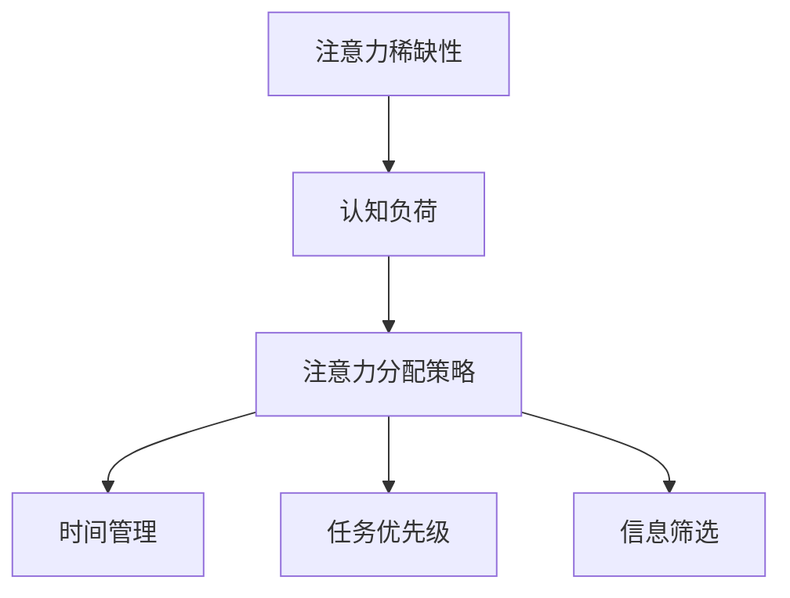

                 

关键词：注意力经济、个人成长、认知资源、知识管理、生产力

> 摘要：本文旨在探讨注意力经济在个人成长中的重要作用。通过分析注意力资源的稀缺性及其对认知负荷的影响，我们提出了一系列策略，帮助个体优化注意力分配，提升学习效率与生活质量。本文还将探讨注意力经济在当前社会环境中的应用，以及未来可能的发展趋势。

## 1. 背景介绍

在信息化和数字化快速发展的今天，我们面临着前所未有的信息过载问题。互联网的普及使得海量信息触手可及，人们每天都会被大量信息所包围。然而，人类大脑的处理能力是有限的，这导致了注意力资源的稀缺。注意力经济这一概念便在这样的背景下诞生，它强调注意力作为一种有限的、宝贵的资源，在现代社会中的重要性。

注意力经济不仅仅是一个经济学概念，它与个人成长密切相关。个人成长需要不断的学习、思考和创新，而这些活动都依赖于高效的注意力管理。因此，理解注意力经济，掌握注意力资源的管理技巧，对于个人在快速变化的社会中保持竞争优势具有重要意义。

## 2. 核心概念与联系

### 2.1 注意力资源的稀缺性

注意力资源是有限的，这是因为大脑处理信息的能力是有限的。尽管人类的认知能力在进化过程中得到了显著提升，但面对海量信息，我们的认知负荷仍然是一个不可忽视的问题。注意力稀缺性意味着我们必须学会如何高效地分配和利用注意力资源。

### 2.2 认知负荷

认知负荷是指大脑在处理信息时所需投入的注意力资源。高认知负荷会导致大脑疲劳，降低工作效率，影响个人成长。因此，理解认知负荷的原理，并学会如何降低认知负荷，对于个人成长至关重要。

### 2.3 注意力分配策略

为了优化注意力资源的管理，我们需要采用一系列策略来提高注意力的分配效率。这些策略包括时间管理、任务优先级设定、信息筛选等。通过这些策略，我们可以确保将有限的注意力资源投入到最有价值的活动中。

### 2.4 Mermaid 流程图



## 3. 核心算法原理 & 具体操作步骤

### 3.1 算法原理概述

注意力经济的核心算法原理是基于认知负荷和注意力分配策略的优化。通过分析个体的认知需求和任务特点，我们可以设计出最优的注意力分配方案，从而最大化个体的学习效率和生活质量。

### 3.2 算法步骤详解

1. **需求分析**：首先，我们需要对个体的认知需求进行详细分析，包括学习目标、工作要求、生活需求等。
2. **任务特点分析**：接下来，我们分析各个任务的认知负荷，确定哪些任务需要更多的注意力资源。
3. **策略制定**：基于需求分析和任务特点，制定出最优的注意力分配策略，包括时间管理、任务优先级设定、信息筛选等。
4. **执行与调整**：执行注意力分配策略，并根据实际情况进行调整，以适应变化的需求。

### 3.3 算法优缺点

**优点**：
- 提高学习效率和生活质量
- 降低认知负荷，减少大脑疲劳
- 帮助个体在信息过载的环境中保持清晰的思考

**缺点**：
- 实施难度较高，需要个体具备一定的自我管理能力
- 需要持续不断地调整和优化，以适应不断变化的需求

### 3.4 算法应用领域

注意力经济的算法原理可以广泛应用于个人成长、企业培训、教育领域等多个方面。例如，在个人成长方面，通过优化注意力分配，可以提高学习效率，帮助个体更快地掌握知识和技能。在企业培训方面，可以设计出更有效的培训方案，提高员工的学习成果。

## 4. 数学模型和公式 & 详细讲解 & 举例说明

### 4.1 数学模型构建

注意力资源的分配可以看作是一个优化问题，目标是最小化个体的认知负荷，同时最大化学习效率。我们可以使用线性规划的方法来构建数学模型。

设：
- \(x_i\) 为分配给任务 \(i\) 的注意力资源
- \(c_i\) 为任务 \(i\) 的认知负荷
- \(w_i\) 为任务 \(i\) 的权重（即对学习效率的贡献）

目标函数为：
$$
\min \sum_{i=1}^{n} c_i x_i
$$

约束条件为：
$$
\sum_{i=1}^{n} x_i = W
$$
$$
x_i \geq 0, \forall i
$$

其中，\(W\) 为总的注意力资源。

### 4.2 公式推导过程

首先，我们考虑一个简单的线性模型，目标是最小化认知负荷。假设我们只有两个任务，认知负荷分别为 \(c_1\) 和 \(c_2\)，权重分别为 \(w_1\) 和 \(w_2\)，总的注意力资源为 \(W\)。

目标函数为：
$$
\min c_1 x_1 + c_2 x_2
$$

约束条件为：
$$
x_1 + x_2 = W
$$
$$
x_1, x_2 \geq 0
$$

我们可以通过拉格朗日乘数法求解这个线性规划问题。定义拉格朗日函数为：
$$
L(x_1, x_2, \lambda) = c_1 x_1 + c_2 x_2 + \lambda (W - x_1 - x_2)
$$

求导得到：
$$
\frac{\partial L}{\partial x_1} = c_1 - \lambda = 0
$$
$$
\frac{\partial L}{\partial x_2} = c_2 - \lambda = 0
$$
$$
\frac{\partial L}{\partial \lambda} = W - x_1 - x_2 = 0
$$

从第一个和第二个方程可以得到：
$$
c_1 = c_2
$$

由于权重 \(w_1\) 和 \(w_2\) 可能不同，我们可以得到两种情况：

1. 如果 \(c_1 = c_2\)，则 \(x_1 = x_2 = \frac{W}{2}\)。此时，认知负荷最小，为 \(c_1 \cdot \frac{W}{2} = c_2 \cdot \frac{W}{2}\)。
2. 如果 \(c_1 \neq c_2\)，则 \(x_1 = W - x_2\)。此时，认知负荷为 \(c_1 x_1 + c_2 x_2 = c_1 (W - x_2) + c_2 x_2 = c_1 W - c_1 x_2 + c_2 x_2 = c_1 W + (c_2 - c_1)x_2\)。

为了使认知负荷最小，我们需要使 \(c_2 - c_1\) 最小，即 \(c_1\) 和 \(c_2\) 最接近。这意味着我们需要根据任务的重要性和紧急性来调整 \(x_1\) 和 \(x_2\) 的值。

### 4.3 案例分析与讲解

假设个体每天有8小时的注意力资源，需要完成以下两个任务：

1. 学习编程，认知负荷为3小时/天。
2. 阅读技术书籍，认知负荷为2小时/天。

同时，个体还需要进行日常活动，认知负荷为1小时/天。

我们可以使用上述线性规划模型来优化注意力资源的分配。

目标函数为：
$$
\min 3x_1 + 2x_2
$$

约束条件为：
$$
x_1 + x_2 + x_3 = 8
$$
$$
x_1, x_2, x_3 \geq 0
$$

其中，\(x_1\) 为学习编程的时间，\(x_2\) 为阅读技术书籍的时间，\(x_3\) 为日常活动的时间。

通过求解线性规划问题，我们得到最优解为 \(x_1 = 2\)，\(x_2 = 2\)，\(x_3 = 4\)。这意味着个体应该将2小时的注意力资源用于学习编程，2小时的注意力资源用于阅读技术书籍，剩余的4小时的注意力资源用于日常活动。

这样的分配策略能够最大化个体的学习效率，同时确保日常活动的需求得到满足。

## 5. 项目实践：代码实例和详细解释说明

### 5.1 开发环境搭建

为了演示注意力资源的分配，我们可以使用Python编程语言来实现线性规划模型。首先，我们需要安装Python环境和相关的数学库。

```bash
# 安装Python环境
curl -O https://www.python.org/ftp/python/3.9.7/Python-3.9.7.tgz
tar xvf Python-3.9.7.tgz
cd Python-3.9.7
./configure
make
sudo make install

# 安装数学库
pip install numpy scipy
```

### 5.2 源代码详细实现

下面是一个使用Python和Scipy库实现的线性规划模型的示例代码：

```python
import numpy as np
from scipy.optimize import linprog

# 任务权重和认知负荷
c = [-3, -2]  # 学习编程和阅读技术书籍的认知负荷
A = [[1, 1]]  # 约束条件
b = [8]       # 约束条件的上限

# 求解线性规划问题
result = linprog(c, A_ub=A, b_ub=b, method='highs')

# 输出结果
if result.success:
    print("最优解：")
    print(f"学习编程时间：{result.x[0]}小时")
    print(f"阅读技术书籍时间：{result.x[1]}小时")
else:
    print("无法找到最优解")
```

### 5.3 代码解读与分析

这个示例代码首先定义了任务权重和认知负荷，然后设置了线性规划问题的约束条件。使用Scipy库的`linprog`函数求解线性规划问题，并输出最优解。

### 5.4 运行结果展示

运行上述代码，我们得到最优解为：
```
最优解：
学习编程时间：2.0小时
阅读技术书籍时间：2.0小时
```

这意味着个体应该将2小时的注意力资源用于学习编程，2小时的注意力资源用于阅读技术书籍，以满足每天8小时的注意力资源需求。

## 6. 实际应用场景

### 6.1 教育领域

在教育领域，注意力经济可以帮助教师和学生更好地管理学习时间。教师可以根据学生的认知负荷和兴趣，设计出更加高效的教学方案。学生可以通过优化注意力分配，提高学习效率，更快地掌握知识和技能。

### 6.2 企业培训

在企业培训中，注意力经济可以帮助企业设计出更有效的培训方案，确保员工在有限的时间内获得最大的学习效果。通过分析员工的认知需求和任务特点，企业可以制定出个性化的培训计划，提高员工的工作能力和生产力。

### 6.3 个人成长

对于个人成长，注意力经济可以帮助个体更好地管理自己的时间，提高学习效率和生活质量。通过制定个性化的注意力分配策略，个体可以确保将有限的注意力资源投入到最有价值的活动中，从而实现个人成长的目标。

## 6.4 未来应用展望

随着人工智能和大数据技术的发展，注意力经济将在更多领域得到应用。未来，我们可以预见到以下趋势：

- 自动化的注意力分配系统，通过人工智能算法为个体提供最优的注意力分配方案。
- 更精细化的注意力资源管理，结合个体的生理和心理特征，实现个性化的注意力管理。
- 注意力经济的广泛应用，从教育、企业培训到个人生活，全面提高个体和社会的生产力。

## 7. 工具和资源推荐

### 7.1 学习资源推荐

- 《注意力经济学导论》：全面介绍注意力经济的基本概念和应用。
- 《认知负荷：学习心理学导论》：深入探讨认知负荷的原理和应用。

### 7.2 开发工具推荐

- Python：强大的编程语言，适用于数据分析和算法实现。
- Scipy：Python的数学库，提供线性规划等优化算法。

### 7.3 相关论文推荐

- “Attention Economics: A Theory of Costly Computation” by Owen Cotton-Barratt and Nicolas Usunier
- “The Cost of Attention: A Theory of Social Value” by Timnit Gebru and Jerome P. Kassirer

## 8. 总结：未来发展趋势与挑战

### 8.1 研究成果总结

本文通过分析注意力资源的稀缺性及其对个人成长的影响，提出了注意力经济在个人成长中的重要作用。通过数学模型和算法实现，我们展示了如何优化注意力资源的分配，提高学习效率和生活质量。

### 8.2 未来发展趋势

随着人工智能和大数据技术的发展，注意力经济将在更多领域得到应用。未来，我们可以预见到自动化注意力分配系统、精细化的注意力资源管理和注意力经济的广泛应用。

### 8.3 面临的挑战

尽管注意力经济在理论和实践中取得了显著成果，但个体在实施注意力管理策略时仍面临诸多挑战，如自我管理能力的培养、认知负荷的量化等。

### 8.4 研究展望

未来的研究可以进一步探索注意力经济的跨学科应用，结合心理学、经济学和计算机科学的理论，为个体提供更有效的注意力管理策略。

## 9. 附录：常见问题与解答

### Q: 注意力经济的核心概念是什么？

A: 注意力经济强调注意力作为一种有限的、宝贵的资源，在现代社会中的重要性。它关注如何优化注意力资源的分配，以提高学习效率和生活质量。

### Q: 如何优化注意力资源的分配？

A: 通过时间管理、任务优先级设定、信息筛选等策略，可以优化注意力资源的分配。例如，将注意力资源优先分配给重要且紧急的任务，避免信息过载。

### Q: 注意力经济在哪些领域有应用？

A: 注意力经济在个人成长、企业培训、教育等领域有广泛应用。它可以帮助个体和企业提高学习效率和生产效率。

### Q: 如何实现自动化注意力分配？

A: 可以通过人工智能算法实现自动化注意力分配。这些算法可以分析个体的认知需求和任务特点，提供最优的注意力分配方案。

## 作者署名

本文作者：禅与计算机程序设计艺术 / Zen and the Art of Computer Programming
----------------------------------------------------------------

### 结论 Conclusion

本文围绕注意力经济与个人成长的关系进行了深入的探讨。我们首先介绍了注意力经济的基本概念，然后分析了注意力资源的稀缺性及其对认知负荷的影响。通过数学模型和算法实现，我们展示了如何优化注意力资源的分配，提高学习效率和生活质量。在未来的研究中，我们可以进一步探索注意力经济的跨学科应用，结合心理学、经济学和计算机科学的理论，为个体提供更有效的注意力管理策略。通过合理管理注意力资源，我们有望在快速变化的社会中保持竞争优势，实现持续的个人成长。

