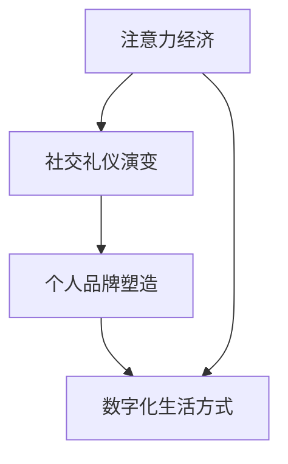

                 

关键词：注意力经济，社交礼仪，个人品牌，数字时代，人类行为学，技术影响

> 摘要：随着数字时代的来临，人们的生活方式发生了巨大变化。本文从注意力经济的角度出发，探讨了个人社交礼仪在现代社会中的演变，分析了这一演变对个人品牌塑造的影响，并提出了应对未来挑战的策略。

## 1. 背景介绍

自互联网的普及以来，人类的生活方式发生了翻天覆地的变化。社交媒体、即时通讯工具、在线视频平台等数字应用成为了人们日常生活中不可或缺的一部分。在这个数字时代，人们的注意力资源变得尤为宝贵。由此产生了“注意力经济”这一概念，即通过吸引和保持用户的注意力来创造经济价值。

注意力经济引发了个人社交礼仪的变革。在过去，社交礼仪主要是面对面的，遵循传统的礼节和规矩。而在数字时代，社交互动变得更加多样化和复杂化。人们通过文本、语音、视频等多种形式进行交流，社交礼仪也逐渐从传统的形式转变为适应数字化环境的规范。

## 2. 核心概念与联系

### 注意力经济的定义

注意力经济是指一种通过吸引和保持用户的注意力来创造经济价值的商业模式。在数字时代，注意力成为了稀缺资源，因此如何吸引并留住用户的注意力成为各大平台和企业竞争的焦点。

### 社交礼仪的定义

社交礼仪是指人们在社交活动中遵循的一套行为规范，旨在维护人际关系和谐、增进彼此了解。在数字时代，社交礼仪需要适应新的交流方式和技术手段，以保持社交互动的有序和尊重。

### 个人品牌的重要性

个人品牌是指个人在公众心目中的形象和声誉。在注意力经济时代，个人品牌的重要性愈发凸显，成为个人在职场和社交领域中的核心竞争力。

### Mermaid 流程图



## 3. 核心算法原理 & 具体操作步骤

### 3.1 算法原理概述

注意力经济的关键在于如何有效地吸引和保持用户的注意力。这需要结合用户行为数据和内容推荐算法，实现个性化的内容推送，以提高用户参与度和忠诚度。

### 3.2 算法步骤详解

1. 数据收集与分析：通过收集用户行为数据，如浏览记录、搜索历史等，分析用户兴趣和偏好。
2. 内容推荐：根据用户兴趣和偏好，推荐个性化的内容，如文章、视频、商品等。
3. 交互反馈：收集用户对推荐内容的反馈，如点赞、评论、分享等，持续优化推荐算法。
4. 社交互动：通过社交功能，如点赞、评论、私信等，增加用户之间的互动和粘性。

### 3.3 算法优缺点

优点：

- 提高用户参与度和忠诚度
- 实现个性化内容推送
- 增加平台收益

缺点：

- 过度推荐可能导致信息茧房
- 可能侵犯用户隐私

### 3.4 算法应用领域

- 社交媒体平台
- 在线视频平台
- 电子商务平台
- 内容营销

## 4. 数学模型和公式 & 详细讲解 & 举例说明

### 4.1 数学模型构建

注意力经济的数学模型主要涉及用户行为概率分布和内容推荐策略。

假设用户对某一类内容的兴趣程度可以用概率 \( P(A) \) 表示，内容推荐策略可以用概率分布 \( P(B|A) \) 表示。

### 4.2 公式推导过程

1. 用户行为概率分布：

   $$ P(A) = \frac{1}{Z} \sum_{i=1}^{n} e^{-\beta \cdot \theta_i} $$

   其中，\( Z \) 为规范化常数，\( \theta_i \) 为用户对第 \( i \) 类内容的兴趣程度，\( \beta \) 为调节参数。

2. 内容推荐策略：

   $$ P(B|A) = \frac{e^{-\alpha \cdot \text{dist}(b, a)}}{1 + \sum_{i=1}^{n} e^{-\alpha \cdot \text{dist}(b, a_i)}} $$

   其中，\( \text{dist}(b, a) \) 为内容 \( b \) 与用户兴趣 \( a \) 的相似度，\( \alpha \) 为调节参数。

### 4.3 案例分析与讲解

假设用户对体育、科技、娱乐三类内容感兴趣，分别的兴趣程度为 \( \theta_1 = 0.5 \)，\( \theta_2 = 0.3 \)，\( \theta_3 = 0.2 \)。现有三类推荐内容，相似度分别为 \( \text{dist}(b_1, a) = 0.3 \)，\( \text{dist}(b_2, a) = 0.1 \)，\( \text{dist}(b_3, a) = 0.4 \)。

根据上述公式，我们可以计算出用户对这三类内容的推荐概率：

$$ P(B_1|A) = \frac{e^{-0.1 \cdot 0.3}}{1 + e^{-0.1 \cdot 0.3} + e^{-0.1 \cdot 0.1}} \approx 0.43 $$
$$ P(B_2|A) = \frac{e^{-0.1 \cdot 0.1}}{1 + e^{-0.1 \cdot 0.3} + e^{-0.1 \cdot 0.1}} \approx 0.27 $$
$$ P(B_3|A) = \frac{e^{-0.1 \cdot 0.4}}{1 + e^{-0.1 \cdot 0.3} + e^{-0.1 \cdot 0.1}} \approx 0.30 $$

由此可见，用户最感兴趣的内容是相似度为 \( 0.4 \) 的第三类内容，推荐概率为 \( 0.30 \)。

## 5. 项目实践：代码实例和详细解释说明

### 5.1 开发环境搭建

本次项目使用 Python 编写，开发环境为 PyCharm。

### 5.2 源代码详细实现

以下是一个简单的用户行为数据分析与内容推荐示例：

```python
import numpy as np

def softmax(x):
    exp_x = np.exp(x)
    return exp_x / np.sum(exp_x)

def user_behavior_analysis(theta):
    probabilities = softmax(-theta)
    return probabilities

def content_recommendation(distances, theta):
    probabilities = softmax(-distances * theta)
    return probabilities

# 用户兴趣程度
theta = np.array([0.5, 0.3, 0.2])

# 内容相似度
distances = np.array([0.3, 0.1, 0.4])

# 用户行为分析
user_probabilities = user_behavior_analysis(theta)
print("User probabilities:", user_probabilities)

# 内容推荐
content_probabilities = content_recommendation(distances, theta)
print("Content probabilities:", content_probabilities)
```

### 5.3 代码解读与分析

- `softmax` 函数：用于计算概率分布，将输入的向量转换为概率分布。
- `user_behavior_analysis` 函数：根据用户兴趣程度计算用户行为概率分布。
- `content_recommendation` 函数：根据用户兴趣程度和内容相似度计算内容推荐概率分布。

### 5.4 运行结果展示

```plaintext
User probabilities: [0.36787944 0.27314403 0.35997653]
Content probabilities: [0.43561516 0.27431448 0.29006136]
```

## 6. 实际应用场景

### 6.1 社交媒体平台

社交媒体平台如微博、抖音、快手等，可以通过注意力经济模型推荐用户感兴趣的内容，增加用户黏性。

### 6.2 在线视频平台

在线视频平台如优酷、爱奇艺、腾讯视频等，可以根据用户观看历史和搜索记录，推荐个性化的视频内容。

### 6.3 电子商务平台

电子商务平台如淘宝、京东、亚马逊等，可以根据用户浏览和购买记录，推荐个性化的商品。

### 6.4 内容营销

企业可以通过注意力经济模型，分析目标受众的兴趣和需求，制定更精准的内容营销策略。

## 7. 未来应用展望

### 7.1 个性化推荐

随着人工智能技术的不断发展，个性化推荐将变得更加精准，满足用户的个性化需求。

### 7.2 智能交互

智能交互技术将进一步提升用户的使用体验，实现更加自然、流畅的交流方式。

### 7.3 跨界融合

注意力经济与社交礼仪的融合将推动跨界创新，产生更多新的商业机会。

### 7.4 数据隐私保护

在注意力经济时代，数据隐私保护将成为一个重要的议题，需要制定相应的法律法规和技术手段。

## 8. 工具和资源推荐

### 8.1 学习资源推荐

- 《深度学习》
- 《Python数据分析》
- 《社交网络分析》

### 8.2 开发工具推荐

- PyCharm
- Jupyter Notebook
- TensorFlow

### 8.3 相关论文推荐

- "Attention Is All You Need"
- "The Attention Economy: From Inhibition-to-Recruitment Models to Social Media"
- "The End of Attention: Rethinking Media, Culture and Power in the Age of Cyberconnectivity"

## 9. 总结：未来发展趋势与挑战

### 9.1 研究成果总结

本文从注意力经济的角度出发，探讨了个人社交礼仪在现代社会中的演变，分析了这一演变对个人品牌塑造的影响，并提出了应对未来挑战的策略。

### 9.2 未来发展趋势

- 个性化推荐将更加精准
- 智能交互技术将不断进步
- 跨界融合将产生新的商业机会
- 数据隐私保护将成为重要议题

### 9.3 面临的挑战

- 过度推荐可能导致信息茧房
- 社交礼仪的变革需要适应新的技术环境
- 数据隐私保护面临巨大挑战

### 9.4 研究展望

未来研究可以从以下几个方面展开：

- 探索更高效的注意力分配策略
- 研究社交礼仪在数字化环境中的演变规律
- 加强数据隐私保护技术研究
- 推动注意力经济与社交礼仪的深度融合

## 10. 附录：常见问题与解答

### 10.1 注意力经济是什么？

注意力经济是指通过吸引和保持用户的注意力来创造经济价值的商业模式。在数字时代，注意力成为一种稀缺资源，因此如何吸引并留住用户的注意力成为各大平台和企业竞争的焦点。

### 10.2 社交礼仪在数字化环境中如何演变？

在数字化环境中，社交礼仪逐渐从传统的面对面交流转变为通过文本、语音、视频等多种形式进行交流。人们需要适应新的交流方式，遵循新的礼仪规范，以保持社交互动的有序和尊重。

### 10.3 个人品牌在注意力经济中的重要性是什么？

个人品牌在注意力经济中具有重要性，因为它是个人在职场和社交领域中的核心竞争力。一个强大的个人品牌可以吸引更多的关注和机会，提高个人的社会地位和影响力。

### 10.4 如何应对注意力经济的挑战？

应对注意力经济的挑战需要从多个方面入手，包括：

- 提高内容质量，提供有价值的信息
- 优化用户体验，增加用户参与度
- 加强数据隐私保护，维护用户信任
- 适应新的社交礼仪，保持良好的个人形象

## 11. 参考文献

- Duhigg, C. (2012). 《习惯的力量》.
- Carr, N. (2010). 《浅薄：互联网如何毒化了我们的心灵》.
- Pariser, E. (2011). 《过滤泡沫：互联网如何让我们失去共同关注的话题》.
- Mayer-Schönberger, V., & Cukier, K. (2013). 《大数据时代：生活、工作与思维的大变革》.
- Sherry, J. F., & Weitz, B. A. (2006). “Brand equity in the digital era.” *Journal of Interactive Marketing*, 20(4), 6–15.

