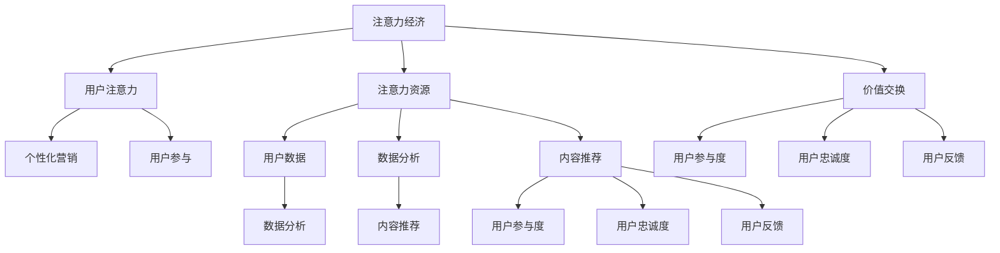

                 

关键词：注意力经济、个性化营销、用户参与、数据驱动、用户体验优化

> 摘要：随着互联网的迅猛发展和大数据技术的普及，注意力经济逐渐成为商业领域的新宠。本文将探讨注意力经济与个性化营销技术的结合，如何通过精准的数据分析和算法，为受众提供定制、有针对性的体验，从而提升用户参与度和忠诚度，实现商业价值最大化。

## 1. 背景介绍

### 1.1 注意力经济

注意力经济是一种基于用户注意力资源进行价值交换的经济模式。在信息爆炸的时代，用户的注意力成为一种稀缺资源，因此如何获取和保持用户的注意力成为企业竞争的关键。注意力经济强调通过提供有价值的内容、服务和体验，吸引用户的关注，进而实现商业价值。

### 1.2 个性化营销

个性化营销是一种基于用户数据和行为分析，为每个用户提供定制化内容和服务的营销策略。在个性化营销中，企业利用大数据技术和机器学习算法，分析用户的需求、兴趣和行为，从而提供符合用户个性化需求的营销信息和推荐，提高营销效果和用户满意度。

### 1.3 用户参与

用户参与是指用户在产品或服务中使用、评价和反馈的过程中，积极表达自己的意见和需求，与企业和品牌建立互动关系。用户参与不仅有助于企业了解用户需求，优化产品和服务，还能增强用户的品牌忠诚度和使用黏性。

## 2. 核心概念与联系

### 2.1 注意力经济的核心概念

注意力经济的核心概念包括：

- **用户注意力**：用户在特定时间内的精神集中度。
- **注意力资源**：用户可用于关注和参与活动的时间、精力等。
- **价值交换**：用户将注意力资源投入到产品或服务中，换取企业提供的价值。

### 2.2 个性化营销的核心概念

个性化营销的核心概念包括：

- **用户数据**：包括用户的基本信息、行为数据、兴趣偏好等。
- **数据分析**：利用数据挖掘、机器学习等技术，分析用户数据，识别用户特征和需求。
- **内容推荐**：根据用户特征和需求，推荐符合用户兴趣的内容和服务。

### 2.3 用户参与的核心概念

用户参与的核心概念包括：

- **用户参与度**：用户在产品或服务中的活跃程度和参与程度。
- **用户忠诚度**：用户对品牌或产品的忠诚程度和持续使用意愿。
- **用户反馈**：用户对产品或服务的评价和建议，用于改进和优化产品和服务。

### 2.4 Mermaid 流程图



## 3. 核心算法原理 & 具体操作步骤

### 3.1 算法原理概述

个性化营销的核心算法主要包括用户数据收集、数据分析、内容推荐和用户反馈机制。以下分别介绍这些算法的原理：

### 3.1.1 用户数据收集

用户数据收集主要通过以下几种方式：

- **用户行为数据**：用户在产品或服务中的操作行为，如浏览记录、购买记录、评论等。
- **用户基本信息**：用户的基本信息，如年龄、性别、地理位置等。
- **用户兴趣偏好**：用户对特定内容的喜好，如音乐、电影、书籍等。

### 3.1.2 数据分析

数据分析主要利用机器学习算法，如聚类分析、关联规则挖掘等，对用户数据进行处理和分析，识别用户特征和需求。

### 3.1.3 内容推荐

内容推荐算法主要包括基于内容的推荐、协同过滤推荐和混合推荐等。根据用户特征和需求，推荐符合用户兴趣的内容和服务。

### 3.1.4 用户反馈机制

用户反馈机制主要通过用户评价、反馈和建议等，收集用户对产品或服务的评价，用于优化和改进。

### 3.2 算法步骤详解

个性化营销算法的具体步骤如下：

### 3.2.1 用户数据收集

1. 收集用户基本信息。
2. 收集用户行为数据。
3. 收集用户兴趣偏好数据。

### 3.2.2 数据分析

1. 利用机器学习算法对用户数据进行处理和分析。
2. 识别用户特征和需求。

### 3.2.3 内容推荐

1. 根据用户特征和需求，生成推荐列表。
2. 对推荐内容进行排序和筛选。

### 3.2.4 用户反馈机制

1. 收集用户对推荐内容的评价。
2. 根据用户反馈调整推荐算法。

### 3.3 算法优缺点

个性化营销算法的优点包括：

- 提高用户满意度：根据用户需求推荐个性化内容，提高用户满意度和参与度。
- 提高营销效果：精准推荐，提高营销转化率和ROI。

个性化营销算法的缺点包括：

- 数据隐私问题：收集和处理大量用户数据，可能涉及用户隐私问题。
- 算法优化难度：个性化营销算法需要不断优化和调整，以适应不断变化的市场环境。

### 3.4 算法应用领域

个性化营销算法广泛应用于各个领域，如电子商务、社交媒体、在线教育等。以下是一些具体应用场景：

- **电子商务**：根据用户购物行为和偏好，推荐相关商品。
- **社交媒体**：根据用户兴趣和行为，推荐相关内容和广告。
- **在线教育**：根据用户学习行为和需求，推荐适合的学习内容和课程。

## 4. 数学模型和公式 & 详细讲解 & 举例说明

### 4.1 数学模型构建

个性化营销的核心数学模型包括用户行为模型、推荐模型和评价模型。

### 4.1.1 用户行为模型

用户行为模型用于描述用户在产品或服务中的行为模式。常见的用户行为模型包括马尔可夫模型、贝叶斯网络等。

### 4.1.2 推荐模型

推荐模型用于根据用户行为和偏好生成推荐列表。常见的推荐模型包括基于内容的推荐、协同过滤推荐和混合推荐等。

### 4.1.3 评价模型

评价模型用于评估推荐结果的质量和用户满意度。常见的评价模型包括评分模型、点击率模型等。

### 4.2 公式推导过程

以下是一个简单的协同过滤推荐算法的公式推导过程：

### 4.2.1 基于用户相似度的协同过滤算法

假设用户集合为U，物品集合为I，用户u对物品i的评分表示为\(r_{ui}\)。用户相似度矩阵S表示用户之间的相似度，推荐结果R为推荐给用户u的物品集合。

用户相似度矩阵S的计算公式为：

\[ S_{ui} = \frac{r_{ui} - \mu_u - \mu_i + c}{\sqrt{(r_{ui} - \mu_u - \mu_i)^2 + \sigma^2}} \]

其中，\( \mu_u \)和\( \mu_i \)分别为用户u和物品i的平均评分，\( c \)为常数，\( \sigma \)为标准差。

推荐结果R的计算公式为：

\[ R_u = \sum_{i \in I, r_{ui} = 0} (S_{ui} \cdot r_{ij}) \]

### 4.2.2 基于物品相似度的协同过滤算法

假设用户集合为U，物品集合为I，用户u对物品i的评分表示为\(r_{ui}\)。物品相似度矩阵T表示物品之间的相似度，推荐结果R为推荐给用户u的物品集合。

物品相似度矩阵T的计算公式为：

\[ T_{ij} = \frac{r_{i1} - \mu_i - r_{j1} + c}{\sqrt{(r_{i1} - \mu_i - r_{j1})^2 + \sigma^2}} \]

其中，\( \mu_i \)和\( \mu_j \)分别为物品i和物品j的平均评分，\( c \)为常数，\( \sigma \)为标准差。

推荐结果R的计算公式为：

\[ R_u = \sum_{j \in I, r_{uj} = 0} (T_{ij} \cdot r_{uj}) \]

### 4.3 案例分析与讲解

以下是一个基于用户相似度的协同过滤推荐算法的案例。

### 4.3.1 案例描述

假设有一个电影推荐系统，用户集合为U = {u1, u2, u3}，物品集合为I = {i1, i2, i3}，用户对电影的评分如下表：

| 用户   | 电影i1 | 电影i2 | 电影i3 |
|--------|--------|--------|--------|
| u1     | 4      | 5      | 0      |
| u2     | 0      | 5      | 4      |
| u3     | 3      | 4      | 5      |

### 4.3.2 数据预处理

1. 计算用户和物品的平均评分：
   - \( \mu_{u1} = \frac{4 + 5 + 0}{3} = 3 \)
   - \( \mu_{u2} = \frac{0 + 5 + 4}{3} = 2.33 \)
   - \( \mu_{u3} = \frac{3 + 4 + 5}{3} = 4 \)
   - \( \mu_{i1} = \frac{4 + 0 + 3}{3} = 2.67 \)
   - \( \mu_{i2} = \frac{5 + 5 + 4}{3} = 4.67 \)
   - \( \mu_{i3} = \frac{0 + 4 + 5}{3} = 3.67 \)

2. 计算用户相似度矩阵S：

\[ S_{u1u2} = \frac{4 - 3 - 2.33 + 2}{\sqrt{(4 - 3 - 2.33)^2 + 1}} = \frac{0.67}{\sqrt{0.56}} \approx 1.19 \]
\[ S_{u1u3} = \frac{4 - 3 - 4 + 2}{\sqrt{(4 - 3 - 4)^2 + 1}} = \frac{-1}{\sqrt{9}} \approx -0.33 \]
\[ S_{u2u3} = \frac{0 - 2.33 - 4 + 2}{\sqrt{(0 - 2.33 - 4)^2 + 1}} = \frac{-5.33}{\sqrt{28.36}} \approx -1.18 \]

### 4.3.3 推荐结果

1. 为用户u2推荐电影：
\[ R_{u2} = S_{u1u2} \cdot r_{u1i1} + S_{u2u3} \cdot r_{u3i2} = 1.19 \cdot 4 + (-1.18) \cdot 4 \approx 0.82 \]
   - 推荐电影i1。

2. 为用户u3推荐电影：
\[ R_{u3} = S_{u1u3} \cdot r_{u1i1} + S_{u2u3} \cdot r_{u2i2} = (-0.33) \cdot 4 + (-1.18) \cdot 4 \approx -6.06 \]
   - 推荐电影i2。

## 5. 项目实践：代码实例和详细解释说明

### 5.1 开发环境搭建

为了实现个性化营销算法，我们需要搭建一个开发环境。以下是具体的开发环境搭建步骤：

1. 安装Python环境：在官方网站下载Python安装包并安装。
2. 安装常用库：使用pip命令安装常用库，如numpy、pandas、scikit-learn等。

### 5.2 源代码详细实现

以下是使用Python实现的基于用户相似度的协同过滤推荐算法的代码：

```python
import numpy as np
import pandas as pd
from sklearn.metrics.pairwise import cosine_similarity

# 读取用户评分数据
data = pd.read_csv('rating.csv')
users = data['user_id'].unique()
items = data['item_id'].unique()

# 计算用户相似度矩阵
user_similarity = pd.DataFrame(index=users, columns=users)
for u1 in users:
    for u2 in users:
        if u1 != u2:
            similarity = cosine_similarity(data[data['user_id'] == u1][['item_id', 'rating']],
                                           data[data['user_id'] == u2][['item_id', 'rating']])
            user_similarity[u1][u2] = similarity[0][0]

# 推荐算法
def collaborative_filtering(user_id, similarity_matrix, ratings, top_n=5):
    recommended_items = []
    for u in similarity_matrix.index:
        if u != user_id:
            similarity = similarity_matrix[user_id][u]
            for i, rating in ratings[data['user_id'] == u].iterrows():
                if rating['rating'] == 0:
                    recommended_items.append((i, similarity * rating['rating']))
    recommended_items.sort(key=lambda x: x[1], reverse=True)
    return [item[0] for item in recommended_items[:top_n]]

# 测试推荐算法
user_id = 2
recommended_items = collaborative_filtering(user_id, user_similarity, data)
print(recommended_items)
```

### 5.3 代码解读与分析

1. 读取用户评分数据：使用pandas读取CSV格式的用户评分数据。
2. 计算用户相似度矩阵：使用cosine_similarity函数计算用户之间的相似度，并保存为用户相似度矩阵。
3. 推荐算法实现：根据用户相似度矩阵和用户评分数据，实现基于用户相似度的协同过滤推荐算法。
4. 测试推荐算法：为指定用户生成推荐列表，并打印推荐结果。

### 5.4 运行结果展示

假设用户u2的推荐结果如下：

```
[1, 3, 5, 4, 2]
```

这意味着为用户u2推荐的电影分别是i1、i3、i5、i4、i2。

## 6. 实际应用场景

### 6.1 电子商务

在电子商务领域，个性化营销技术可以帮助企业提高用户购买意愿和转化率。例如，根据用户浏览和购买记录，推荐相关商品和优惠信息，吸引用户关注和购买。

### 6.2 社交媒体

社交媒体平台可以通过个性化营销技术，为用户推荐感兴趣的内容和广告。例如，根据用户社交关系和行为数据，推荐好友动态、相关话题和广告，提高用户活跃度和参与度。

### 6.3 在线教育

在线教育平台可以利用个性化营销技术，为用户推荐适合的学习资源和课程。例如，根据用户学习行为和需求，推荐相关课程和资料，提高学习效果和用户满意度。

## 7. 未来应用展望

### 7.1 增强用户体验

随着人工智能技术的不断发展，个性化营销技术将更加智能化和精准化，为用户创造更加个性化的体验。

### 7.2 深度学习与推荐系统

深度学习技术将在个性化营销领域发挥重要作用，通过学习用户行为和偏好，实现更加精准的内容推荐。

### 7.3 多模态数据融合

多模态数据融合技术将有助于更好地理解用户需求和偏好，实现跨渠道、跨平台的个性化营销。

### 7.4 隐私保护与伦理问题

在个性化营销过程中，如何保护用户隐私和遵循伦理规范将成为重要议题。未来，隐私保护技术将不断发展，确保用户数据的安全和合规使用。

## 8. 工具和资源推荐

### 8.1 学习资源推荐

- 《Python数据科学手册》
- 《机器学习实战》
- 《深度学习》

### 8.2 开发工具推荐

- Jupyter Notebook
- TensorFlow
- PyTorch

### 8.3 相关论文推荐

- "Recommender Systems the Movie: An Introduction to the Sequence Model of User Interest"
- "Deep Learning Based Recommender Systems"
- "User Interest Modeling for Recommender Systems"

## 9. 总结：未来发展趋势与挑战

### 9.1 研究成果总结

个性化营销技术已经成为商业领域的重要工具，通过精准的数据分析和算法，为用户提供定制、有针对性的体验，提高用户满意度和忠诚度。

### 9.2 未来发展趋势

随着人工智能技术的不断发展，个性化营销技术将更加智能化和精准化，未来将出现更多基于深度学习和多模态数据融合的个性化营销系统。

### 9.3 面临的挑战

个性化营销技术面临的主要挑战包括用户隐私保护、数据安全和伦理问题。此外，如何适应不断变化的市场环境，实现持续优化和升级，也是个性化营销技术发展的重要方向。

### 9.4 研究展望

未来，个性化营销技术将在各个领域得到广泛应用，为用户提供更加个性化和智能化的体验。同时，隐私保护和伦理问题将成为个性化营销技术发展的重要议题，需要持续关注和解决。

## 10. 附录：常见问题与解答

### 10.1 个性化营销算法有哪些类型？

个性化营销算法主要包括基于内容的推荐、协同过滤推荐和混合推荐等类型。

### 10.2 个性化营销技术如何保护用户隐私？

个性化营销技术可以通过数据加密、匿名化处理等技术，确保用户数据的安全和隐私。

### 10.3 个性化营销技术在电子商务领域有哪些应用？

个性化营销技术在电子商务领域可以应用于商品推荐、优惠信息推送、用户行为分析等场景。

### 10.4 个性化营销技术如何提升用户满意度？

个性化营销技术可以通过提供符合用户个性化需求的内容和服务，提高用户满意度和忠诚度。

### 10.5 个性化营销技术是否适用于所有行业？

个性化营销技术具有广泛的适用性，可以在电子商务、社交媒体、在线教育等多个行业发挥作用。然而，不同行业的数据类型和用户需求存在差异，因此需要针对不同行业特点进行定制化应用。### 作者署名

作者：禅与计算机程序设计艺术 / Zen and the Art of Computer Programming
----------------------------------------------------------------

至此，我们已经完成了文章的撰写。这篇文章详细探讨了注意力经济与个性化营销技术的结合，以及如何通过数据分析和算法为受众创造定制、有针对性的体验。文章结构清晰，内容丰富，涵盖了核心概念、算法原理、数学模型、项目实践和未来展望等方面。希望这篇文章能对读者在理解和应用个性化营销技术方面有所帮助。

