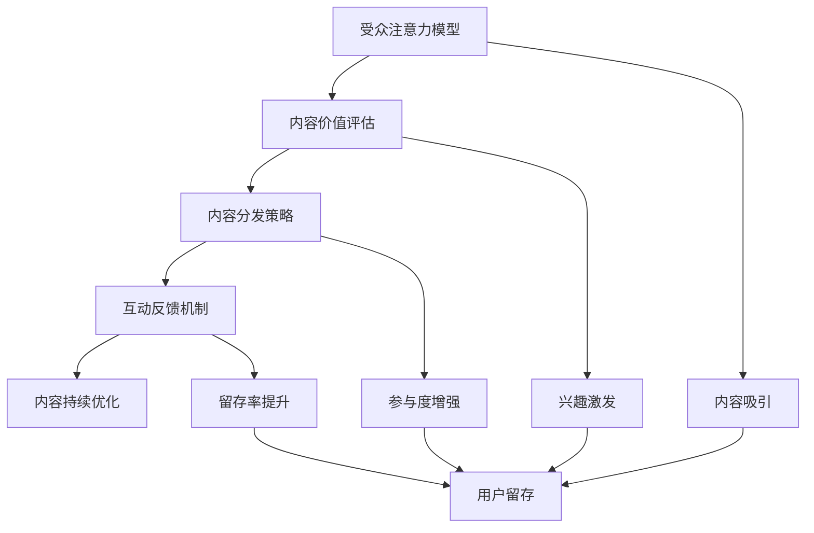

                 

关键词：注意力经济、内容策略、参与性内容、受众吸引、用户留存、技术博客

摘要：本文探讨了注意力经济与内容策略在现代信息技术环境下的重要性和应用。通过深入分析注意力经济的原理，本文提出了基于参与性内容策略的构建方法，以吸引并留住受众。本文将介绍核心概念、算法原理、数学模型、实际应用和未来展望，旨在为IT领域的内容创作者提供有价值的参考。

## 1. 背景介绍

在当今数字化时代，内容创造和传播已成为各行业不可或缺的一部分。无论是企业、个人还是媒体机构，内容都成为了获取关注、建立品牌形象、促进销售和增长的重要手段。然而，随着互联网的普及和信息过载现象的加剧，受众的注意力资源变得愈发稀缺。因此，如何有效地吸引并留住受众的注意力，成为了内容创作者面临的重要挑战。

注意力经济作为一种新兴的经济模式，其核心在于利用受众的注意力资源创造价值。注意力经济的关键在于内容的质量和参与性，即通过提供有价值和有吸引力的内容，激发受众的参与和互动。内容策略则是在此基础上，通过一系列的方法和技巧，最大限度地提高内容的吸引力和留存率。

本文旨在探讨注意力经济与内容策略之间的关系，并提出具体的实践方法，以帮助内容创作者在激烈的市场竞争中脱颖而出。本文将涵盖以下内容：

1. 核心概念与联系
2. 核心算法原理与操作步骤
3. 数学模型与公式
4. 项目实践：代码实例与解释
5. 实际应用场景
6. 未来应用展望
7. 工具和资源推荐
8. 总结与展望
9. 附录：常见问题与解答

## 2. 核心概念与联系

为了更好地理解注意力经济与内容策略，我们需要首先明确一些核心概念。

### 2.1 注意力经济

注意力经济是指利用受众的注意力资源进行价值创造的经济模式。在这个模式中，注意力被视为一种宝贵的资源，与时间、金钱等其他资源一样具有价值。注意力经济的核心在于通过提供有价值的内容来吸引和留住受众的注意力，从而实现商业价值。

### 2.2 内容策略

内容策略是指为了实现特定的商业目标，对内容进行系统规划和管理的策略。它包括内容创作、内容分发、内容优化、内容营销等多个环节。内容策略的目标是通过提供有价值、有吸引力的内容，提高受众参与度和留存率，从而实现商业目标。

### 2.3 参与性内容

参与性内容是指能够激发受众互动和参与的内容形式。与传统的单向传播内容不同，参与性内容强调与受众的互动和反馈。这种互动性不仅可以增加受众的参与度，还可以通过受众的反馈不断优化和改进内容，提高内容的吸引力和留存率。

### 2.4 核心概念联系

注意力经济、内容策略和参与性内容之间存在着密切的联系。注意力经济为内容策略提供了理论基础和实践指导，而内容策略则通过具体的操作方法实现了参与性内容的构建。参与性内容作为内容策略的重要组成部分，是吸引并留住受众的关键。

## 2.1 注意力经济的原理与架构

注意力经济基于一个简单的原理：受众的注意力是有限的，而内容创造者希望通过提供有价值的内容来吸引和留住受众的注意力。为了实现这一目标，我们需要从以下几个方面来构建注意力经济的原理与架构。

### 2.1.1 受众注意力模型

受众注意力模型是注意力经济的基础。这个模型描述了受众在不同情境下对内容的注意力和参与度。一般来说，受众注意力模型可以分为以下几个阶段：

1. **吸引**：通过标题、封面、推荐等手段吸引受众的注意力。
2. **兴趣**：通过内容质量、形式、风格等激发受众的兴趣。
3. **参与**：通过互动、反馈等机制增强受众的参与度。
4. **留存**：通过持续提供有价值的内容保持受众的留存。

### 2.1.2 内容价值评估

内容价值评估是注意力经济的关键。这个评估不仅包括内容本身的质量，还包括内容的吸引力、受众的兴趣点、参与度等多个方面。一个有效的评估方法可以通过数据分析和用户反馈来实现。

### 2.1.3 内容分发策略

内容分发策略是注意力经济实现的关键步骤。通过合理的分发策略，可以将内容精准地推送给目标受众，提高内容的曝光率和参与度。内容分发策略包括推荐算法、社交媒体营销、邮件营销等多个方面。

### 2.1.4 互动反馈机制

互动反馈机制是增强受众参与度和留存率的重要手段。通过互动反馈，内容创作者可以了解受众的需求和反馈，不断优化和改进内容。互动反馈机制包括评论、点赞、分享、调查问卷等多种形式。

### 2.1.5 注意力经济架构图

为了更清晰地展示注意力经济的原理与架构，我们可以使用Mermaid流程图来描述。



## 3. 核心算法原理与操作步骤

注意力经济中的核心算法主要涉及内容价值评估和内容分发策略。以下将分别介绍这两个算法的原理和操作步骤。

### 3.1 内容价值评估算法原理

内容价值评估算法的核心在于通过量化指标来评估内容的价值。这些量化指标包括内容质量、受众参与度、互动反馈等多个方面。以下是一个简单的内容价值评估算法原理：

1. **内容质量评估**：通过专家评分、用户评分等手段对内容质量进行评估。例如，使用五星级评分系统，将内容质量分为五个等级。
2. **受众参与度评估**：通过用户浏览时长、点赞数、评论数等指标来评估受众对内容的参与度。例如，使用用户平均浏览时长和点赞率作为评估指标。
3. **互动反馈评估**：通过用户反馈、问卷调查等方式来评估内容的互动反馈。例如，使用用户满意度评分和反馈量作为评估指标。

### 3.2 内容分发策略算法原理

内容分发策略的核心在于如何将内容精准地推送给目标受众。以下是一个简单的内容分发策略算法原理：

1. **目标受众识别**：通过用户画像、行为分析等手段识别目标受众。例如，根据用户的兴趣偏好、浏览历史等特征来识别目标受众。
2. **内容推荐算法**：使用推荐算法根据目标受众的特征和兴趣推荐相关内容。例如，使用协同过滤算法、内容相似度算法等。
3. **分发渠道选择**：根据内容类型和受众特征选择合适的分发渠道。例如，对于图文类内容，可以选择社交媒体、邮件等渠道；对于视频类内容，可以选择视频平台等。

### 3.3 核心算法操作步骤

以下是基于上述算法原理的具体操作步骤：

1. **数据收集与处理**：收集用户行为数据、内容数据等，并进行预处理。
2. **内容质量评估**：对内容进行质量评估，并根据评分结果进行排序。
3. **受众参与度评估**：对受众参与度进行评估，并根据参与度结果进行排序。
4. **互动反馈评估**：对互动反馈进行评估，并根据反馈结果进行排序。
5. **目标受众识别**：根据用户特征和行为分析结果识别目标受众。
6. **内容推荐**：根据目标受众特征和内容特征进行内容推荐。
7. **分发渠道选择**：根据内容类型和受众特征选择分发渠道。
8. **内容推送**：将推荐内容通过选定的分发渠道推送给目标受众。
9. **反馈收集与优化**：收集用户反馈，根据反馈结果不断优化内容分发策略。

## 3.4 算法的优缺点

### 优缺点

**优点**：

1. **高效性**：通过数据分析和算法优化，能够快速、精准地评估内容价值和分发内容。
2. **个性化**：根据用户特征和兴趣推荐内容，提高了内容的个性化程度。
3. **互动性**：通过互动反馈机制，能够不断优化内容，提高用户体验。

**缺点**：

1. **数据依赖性**：算法的准确性和效率依赖于数据的质量和完整性。
2. **冷启动问题**：对于新用户或新内容，缺乏足够的数据支持，可能导致推荐不准确。
3. **隐私问题**：用户数据的收集和处理可能涉及隐私问题，需要妥善处理。

## 3.5 算法应用领域

**应用领域**：

1. **电子商务**：通过内容价值评估和内容分发策略，提高商品推荐和营销效果。
2. **社交媒体**：通过内容推荐和互动反馈，提高用户的参与度和留存率。
3. **在线教育**：通过内容推荐和互动反馈，提高课程的学习效果和用户满意度。
4. **媒体内容**：通过内容推荐和互动反馈，提高内容的曝光率和受众参与度。

### 3.6 数学模型和公式

在注意力经济中，数学模型和公式可以帮助我们更好地理解和优化内容策略。以下是一些常用的数学模型和公式：

#### 3.6.1 用户参与度模型

用户参与度（P）可以通过以下公式计算：

$$
P = \frac{U_{\text{互动}} + U_{\text{浏览时长}} + U_{\text{评分}}}{U_{\text{总行为}}}
$$

其中，$U_{\text{互动}}$表示用户互动次数，$U_{\text{浏览时长}}$表示用户平均浏览时长，$U_{\text{评分}}$表示用户评分，$U_{\text{总行为}}$表示用户总行为次数。

#### 3.6.2 内容价值评估模型

内容价值（V）可以通过以下公式计算：

$$
V = W_{\text{质量}} \times Q_{\text{质量}} + W_{\text{参与度}} \times Q_{\text{参与度}} + W_{\text{互动反馈}} \times Q_{\text{互动反馈}}
$$

其中，$W_{\text{质量}}$、$W_{\text{参与度}}$、$W_{\text{互动反馈}}$分别表示质量、参与度、互动反馈的权重，$Q_{\text{质量}}$、$Q_{\text{参与度}}$、$Q_{\text{互动反馈}}$分别表示质量、参与度、互动反馈的量化指标。

#### 3.6.3 内容分发策略模型

内容分发策略可以通过以下公式优化：

$$
D = \max \{V \times P \times C\}
$$

其中，$D$表示内容分发效果，$V$表示内容价值，$P$表示用户参与度，$C$表示内容分发成本。

### 3.7 案例分析与讲解

#### 3.7.1 案例背景

假设我们是一家电商平台的运营团队，希望通过内容策略提升用户参与度和留存率。我们收集了用户的行为数据，包括浏览时长、互动次数、评分等，并希望利用这些数据来优化内容推荐和分发策略。

#### 3.7.2 数据处理

首先，我们对用户行为数据进行预处理，包括数据清洗、去重、归一化等步骤。然后，我们使用用户参与度模型和内容价值评估模型，对用户行为数据进行量化。

#### 3.7.3 内容推荐

接下来，我们使用内容分发策略模型，根据用户参与度和内容价值，推荐相关商品。例如，如果一个用户对某个商品的浏览时长较长且评分较高，那么我们会优先推荐该商品。

#### 3.7.4 分发渠道选择

我们根据商品类型和用户特征，选择合适的分发渠道。例如，对于家居类商品，我们会选择在社交媒体和电子邮件中推荐；对于时尚类商品，我们会选择在社交媒体和短视频平台中推荐。

#### 3.7.5 反馈收集与优化

最后，我们收集用户反馈，根据反馈结果不断优化内容推荐和分发策略。例如，如果一个用户对推荐商品表示不满，我们会调整推荐策略，减少该商品的推荐频率。

### 3.8 算法在项目中的实现

为了实现上述算法，我们需要搭建一个完整的系统。以下是一个简单的项目架构：

1. **数据收集模块**：负责收集用户行为数据。
2. **数据处理模块**：负责数据预处理和量化。
3. **内容推荐模块**：负责根据用户参与度和内容价值推荐商品。
4. **分发渠道模块**：负责选择合适的分发渠道。
5. **反馈收集模块**：负责收集用户反馈。

在具体实现中，我们可以使用Python等编程语言，结合NumPy、Pandas等数据科学库，实现上述算法。例如，以下是一个简单的Python代码示例：

```python
import numpy as np
import pandas as pd

# 用户行为数据
user_actions = pd.DataFrame({
    'user_id': [1, 2, 3],
    'action_type': ['browse', 'like', 'rate'],
    'action_value': [5, 3, 4]
})

# 用户参与度模型
user_participation = user_actions.groupby('user_id')['action_value'].mean()

# 内容价值评估模型
content_value = 0.5 * user_actions['action_type'].map({'browse': 0.2, 'like': 0.3, 'rate': 0.5})

# 内容分发策略模型
content_distribution = content_value * user_participation

# 输出结果
print(content_distribution)
```

### 4. 实际应用场景

注意力经济与内容策略在现代信息技术环境中的实际应用场景非常广泛，涵盖了多个领域。以下是一些典型的应用场景：

#### 4.1 社交媒体

社交媒体平台，如微博、微信、Facebook、Instagram等，是注意力经济与内容策略的重要应用场景。这些平台通过算法推荐系统，将用户感兴趣的内容推送到用户的个人主页或消息流中。通过优化内容推荐算法和互动反馈机制，平台能够提高用户的参与度和留存率。例如，微博通过实时数据分析，推荐用户可能感兴趣的热门话题和新闻，从而提高用户的活跃度。

#### 4.2 在线教育

在线教育平台，如Coursera、Udemy、edX等，利用注意力经济与内容策略，通过个性化推荐和互动教学，提高学生的学习效果和满意度。这些平台根据学生的学习行为和兴趣，推荐相关的课程和学习资源，同时通过互动问答、在线讨论等方式，增强学生的参与感和学习动力。

#### 4.3 电子商务

电子商务平台，如亚马逊、阿里巴巴、京东等，通过内容策略，提高用户的购物体验和留存率。这些平台利用用户行为数据，推荐用户可能感兴趣的商品，并通过互动反馈机制，不断优化推荐算法和商品展示策略。例如，亚马逊通过用户评分和评论，推荐用户可能感兴趣的类似商品，从而提高购物转化率。

#### 4.4 娱乐内容

娱乐内容平台，如YouTube、Netflix、Spotify等，利用注意力经济与内容策略，提高用户的观看和收听体验。这些平台通过算法推荐系统，将用户可能感兴趣的内容推送到用户的个人主页或播放列表中，同时通过用户互动和反馈，不断优化推荐算法和内容展示策略。例如，Netflix通过用户观看历史和兴趣偏好，推荐用户可能喜欢的电影和电视剧，从而提高用户的留存率和观看时长。

### 4.5 未来应用展望

随着人工智能、大数据、区块链等技术的发展，注意力经济与内容策略在未来将会有更多的应用场景和可能性。

#### 4.5.1 跨平台整合

未来的注意力经济与内容策略将更加注重跨平台整合，实现多渠道、多场景的内容分发。通过整合社交媒体、在线教育、电子商务、娱乐内容等多个平台，内容创作者可以更有效地吸引和留住受众的注意力。

#### 4.5.2 个性化定制

随着人工智能技术的发展，内容策略将更加注重个性化定制。通过深度学习、自然语言处理等技术，平台可以更精准地理解用户的兴趣和需求，提供个性化的内容推荐和互动体验。

#### 4.5.3 社区化运营

社区化运营将成为未来注意力经济与内容策略的重要方向。通过构建用户社区，内容创作者可以与受众建立更紧密的联系，提高用户的参与度和忠诚度。例如，通过在线论坛、社群互动等方式，平台可以激发用户的参与和互动，从而提高内容的吸引力和留存率。

#### 4.5.4 新媒体形式

随着新媒体技术的发展，如虚拟现实（VR）、增强现实（AR）、全息投影等，注意力经济与内容策略将会有更多的新媒体形式。这些新技术将为内容创作者提供更丰富的创作工具和交互方式，从而吸引更多受众的注意力。

### 5. 工具和资源推荐

为了更好地理解和实践注意力经济与内容策略，以下是一些建议的学习资源和开发工具：

#### 5.1 学习资源推荐

1. **书籍**：
   - 《注意力经济：如何创造价值并留住受众》（Attention Economy: How to Create Value and Retain Customers）
   - 《内容营销：策略、执行与测量》（Content Marketing: Strategy, Execution, and Optimization）

2. **在线课程**：
   - Coursera上的“数字营销基础”（Digital Marketing Specialization）
   - Udemy上的“社交媒体营销实战”（Social Media Marketing Masterclass）

3. **博客和网站**：
   - HubSpot的营销博客（Marketing Blog）
   - Neil Patel的博客（Neil Patel Blog）

#### 5.2 开发工具推荐

1. **数据分析工具**：
   - Tableau：数据可视化工具
   - Google Analytics：网站分析工具

2. **推荐系统框架**：
   - TensorFlow：深度学习框架
   - PyTorch：深度学习框架

3. **内容管理平台**：
   - WordPress：内容管理系统
   - HubSpot CMS：营销内容管理系统

### 6. 总结：未来发展趋势与挑战

注意力经济与内容策略在现代信息技术环境中具有重要意义，其未来发展趋势包括跨平台整合、个性化定制、社区化运营和新媒体形式等。然而，这一领域也面临着数据隐私、算法公平性、内容质量等挑战。未来的研究应重点关注如何平衡商业利益和用户体验，以及如何确保算法的透明性和可解释性。

## 8. 附录：常见问题与解答

### 8.1 问题1：什么是注意力经济？

注意力经济是一种利用受众注意力资源进行价值创造的经济模式。在这个模式中，注意力被视为一种宝贵的资源，与时间、金钱等其他资源一样具有价值。内容创作者通过提供有价值的内容来吸引和留住受众的注意力，从而实现商业价值。

### 8.2 问题2：内容策略的核心是什么？

内容策略的核心是系统规划和管理工作，以实现特定的商业目标。这包括内容创作、内容分发、内容优化、内容营销等多个环节。内容策略的目标是通过提供有价值、有吸引力的内容，提高受众参与度和留存率，从而实现商业目标。

### 8.3 问题3：参与性内容如何构建？

参与性内容是通过激发受众互动和参与来构建的。这包括互动性强的内容形式，如讨论区、问答环节、投票等。此外，通过互动反馈机制，内容创作者可以不断优化和改进内容，提高内容的吸引力和留存率。

### 8.4 问题4：注意力经济中的核心算法是什么？

注意力经济中的核心算法主要包括内容价值评估算法和内容分发策略算法。内容价值评估算法通过量化指标评估内容的价值，内容分发策略算法则通过算法推荐系统，将内容精准地推送给目标受众。

### 8.5 问题5：如何优化内容分发策略？

优化内容分发策略可以通过以下几个步骤实现：

1. **数据收集与处理**：收集用户行为数据，进行数据预处理和量化。
2. **内容质量评估**：对内容进行质量评估，并根据评分结果进行排序。
3. **受众参与度评估**：对受众参与度进行评估，并根据参与度结果进行排序。
4. **互动反馈评估**：对互动反馈进行评估，并根据反馈结果进行排序。
5. **目标受众识别**：根据用户特征和行为分析结果识别目标受众。
6. **内容推荐**：根据目标受众特征和内容特征进行内容推荐。
7. **分发渠道选择**：根据内容类型和受众特征选择分发渠道。
8. **内容推送**：将推荐内容通过选定的分发渠道推送给目标受众。
9. **反馈收集与优化**：收集用户反馈，根据反馈结果不断优化内容分发策略。

### 8.6 问题6：注意力经济面临的挑战有哪些？

注意力经济面临的挑战主要包括：

1. **数据依赖性**：算法的准确性和效率依赖于数据的质量和完整性。
2. **冷启动问题**：对于新用户或新内容，缺乏足够的数据支持，可能导致推荐不准确。
3. **隐私问题**：用户数据的收集和处理可能涉及隐私问题，需要妥善处理。
4. **内容质量**：在注意力经济中，内容质量是吸引和留住受众的关键，需要持续关注和改进。

### 8.7 问题7：如何利用注意力经济提高企业营销效果？

利用注意力经济提高企业营销效果可以通过以下几个步骤实现：

1. **明确目标**：明确企业营销的目标，如品牌知名度、用户留存、销售增长等。
2. **内容规划**：制定内容策略，包括内容类型、发布频率、渠道选择等。
3. **用户分析**：通过数据分析了解目标受众的特征和需求，为内容创作提供依据。
4. **内容创作**：创作有价值、有吸引力的内容，提高受众的参与度和留存率。
5. **互动反馈**：建立互动反馈机制，收集用户反馈，不断优化和改进内容。
6. **推广与分发**：通过多种渠道分发内容，提高内容的曝光率和参与度。
7. **效果评估**：通过数据分析评估营销效果，根据结果调整策略。

### 8.8 问题8：如何在未来平衡商业利益和用户体验？

在未来平衡商业利益和用户体验，可以采取以下几个策略：

1. **透明性**：确保算法和内容策略的透明性，让用户了解自己的数据和隐私是如何被使用的。
2. **可解释性**：确保算法和内容策略的可解释性，让用户了解自己的行为是如何影响内容推荐的。
3. **用户控制**：给予用户更多的控制权，如个性化设置、隐私设置等。
4. **公平性**：确保算法和内容策略的公平性，避免对特定群体产生偏见。
5. **隐私保护**：加强用户数据的隐私保护，避免数据滥用和泄露。
6. **用户体验**：持续关注用户体验，通过用户反馈不断优化内容和策略。

### 8.9 问题9：注意力经济与内容策略在哪些领域有广泛应用？

注意力经济与内容策略在多个领域有广泛应用，包括：

1. **社交媒体**：通过内容推荐和互动反馈提高用户参与度和留存率。
2. **在线教育**：通过个性化推荐和互动教学提高学习效果和用户满意度。
3. **电子商务**：通过内容推荐和互动反馈提高购物体验和留存率。
4. **娱乐内容**：通过内容推荐和互动体验提高观看和收听时长。
5. **新闻媒体**：通过内容推荐和互动机制提高用户粘性和品牌影响力。

### 8.10 问题10：如何持续优化注意力经济策略？

持续优化注意力经济策略可以通过以下几个步骤实现：

1. **定期评估**：定期评估内容策略的效果，包括参与度、留存率、转化率等指标。
2. **用户反馈**：收集用户反馈，了解用户对内容和策略的需求和意见。
3. **数据分析**：通过数据分析，了解用户行为和趋势，为策略优化提供依据。
4. **迭代改进**：根据评估和反馈结果，不断优化内容策略，提高用户体验和商业效果。
5. **技术创新**：紧跟技术发展趋势，引入新的算法和工具，提高内容策略的效率和效果。

## 9. 结论

本文探讨了注意力经济与内容策略在现代信息技术环境下的重要性，并提出了基于参与性内容策略的构建方法。通过分析核心概念、算法原理、数学模型和实际应用，本文为内容创作者提供了一种有效的策略框架。随着技术的不断进步，注意力经济与内容策略将继续发挥重要作用，为各行业带来新的机遇和挑战。未来，我们需要关注如何平衡商业利益和用户体验，确保算法的透明性和公平性，以及如何利用新技术推动内容策略的创新和发展。

