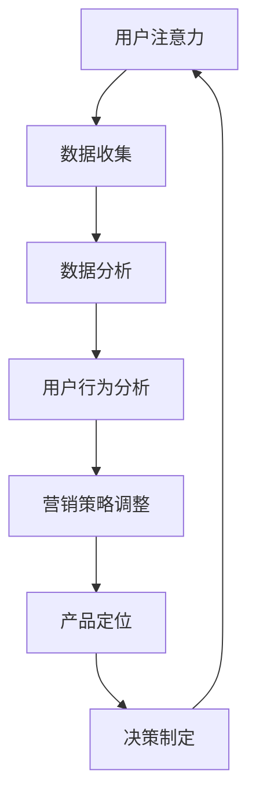

                 

关键词：注意力经济、数据驱动、决策制定、业务洞察、市场洞察

> 摘要：本文将深入探讨注意力经济与数据驱动的决策制定之间的紧密联系，以及如何利用数据来增强业务和市场洞察力。我们将从理论基础、核心概念、算法原理、数学模型、实践案例等多个方面展开讨论，以帮助读者更好地理解和应用这一领域的关键技术。

## 1. 背景介绍

### 注意力经济的崛起

随着互联网和数字技术的发展，注意力已经成为了一种新的经济资源。注意力经济，或称关注经济，指的是通过吸引和维持用户的注意力来创造价值的经济模式。这种模式在社交媒体、在线广告、内容创作等领域尤为突出。

### 数据驱动的决策制定

数据驱动的决策制定是一种基于数据分析的决策方法，它通过收集、处理和分析大量数据来支持决策过程。这种方法在企业管理和市场营销中得到了广泛应用，因为它能够提供更为客观和精确的决策依据。

### 注意力经济与数据驱动的融合

注意力经济与数据驱动的决策制定之间存在紧密的联系。通过对用户行为的分析，企业可以更精确地了解用户的需求和偏好，从而调整其营销策略和产品定位，以最大限度地吸引和保留用户注意力。

## 2. 核心概念与联系

为了更好地理解注意力经济与数据驱动的决策制定，我们首先需要明确以下几个核心概念：

### 用户注意力

用户注意力是指用户在某一时刻所关注的事物。在注意力经济中，用户注意力是企业获取价值的重要资源。

### 数据分析

数据分析是指通过收集、处理和分析数据来获取洞察力和支持决策的过程。

### 用户行为分析

用户行为分析是数据分析的一个子领域，它主要关注用户在网站、应用或其他数字平台上的行为模式。

### 营销策略调整

营销策略调整是指企业根据用户行为分析的结果，对其营销策略进行优化和调整。

### 产品定位

产品定位是指企业确定其产品在市场中的位置，以满足特定用户群体的需求。

### Mermaid 流程图

以下是一个简化的 Mermaid 流程图，展示了注意力经济与数据驱动决策制定之间的关系：



## 3. 核心算法原理 & 具体操作步骤

### 3.1 算法原理概述

注意力经济与数据驱动的决策制定涉及到多种算法原理，包括机器学习、数据挖掘、自然语言处理等。这些算法通过对海量数据进行处理和分析，能够发现用户行为模式、预测用户需求，从而为企业提供决策依据。

### 3.2 算法步骤详解

1. **数据收集**：从各种来源收集用户数据，如网站日志、社交媒体活动、问卷调查等。
2. **数据预处理**：清洗和整合收集到的数据，以便进行进一步分析。
3. **数据分析**：使用统计学方法和机器学习算法对数据进行分析，以发现用户行为模式和趋势。
4. **用户行为分析**：根据数据分析结果，对用户行为进行深入分析，以了解用户需求和行为习惯。
5. **营销策略调整**：根据用户行为分析结果，调整营销策略，以提高用户参与度和转化率。
6. **产品定位**：根据用户行为分析和市场调研结果，重新定位产品，以满足用户需求。
7. **决策制定**：结合用户行为分析和市场趋势，制定切实可行的决策方案。

### 3.3 算法优缺点

- **优点**：数据驱动的决策制定能够提供客观、精确的决策依据，有助于企业更好地了解市场和用户需求。
- **缺点**：算法的准确性和可靠性受到数据质量和算法模型的限制，同时，过度依赖数据分析可能导致决策过程的机械化。

### 3.4 算法应用领域

- **市场营销**：通过用户行为分析优化营销策略，提高广告效果和用户转化率。
- **产品管理**：根据用户需求调整产品功能和服务，以提升用户体验。
- **客户服务**：通过分析客户行为，提供个性化服务，提高客户满意度和忠诚度。
- **人力资源**：利用数据分析优化招聘和培训策略，提高员工绩效和留存率。

## 4. 数学模型和公式 & 详细讲解 & 举例说明

### 4.1 数学模型构建

在注意力经济中，常用的数学模型包括用户行为模型、营销效果模型和用户价值模型。以下是一个简化的用户行为模型：

$$
User\ Behavior\ Model:\ P(b_i|a) = P(a) \cdot P(b_i|a)
$$

其中，$P(b_i|a)$表示用户在某一时刻选择行为$b_i$的概率，$P(a)$表示用户进行某一行为的概率，$P(b_i|a)$表示在用户进行行为$a$的条件下，选择行为$b_i$的条件概率。

### 4.2 公式推导过程

用户行为模型是通过贝叶斯定理推导得到的。贝叶斯定理描述了在已知某些条件概率的情况下，如何计算后验概率。具体推导过程如下：

$$
P(b_i|a) = \frac{P(a|b_i) \cdot P(b_i)}{P(a)}
$$

其中，$P(a|b_i)$表示在用户选择行为$b_i$的条件下，进行行为$a$的概率，$P(b_i)$表示用户选择行为$b_i$的概率。

### 4.3 案例分析与讲解

假设一个电商网站想要了解用户在浏览商品时的行为模式。通过收集用户数据，网站发现：

- $P(\text{浏览商品}| \text{访问网站}) = 0.6$
- $P(\text{购买商品}| \text{浏览商品}) = 0.3$

根据这些数据，我们可以计算出用户在访问网站后选择购买商品的概率：

$$
P(\text{购买商品}| \text{访问网站}) = P(\text{访问网站}) \cdot P(\text{购买商品}| \text{浏览商品}) \cdot P(\text{浏览商品}| \text{访问网站}) = 0.6 \cdot 0.3 \cdot 0.6 = 0.108
$$

这意味着，一个用户在访问网站后选择购买商品的概率约为10.8%。

### 4.4 数学模型应用领域

- **市场营销**：通过用户行为模型，企业可以了解用户的行为特征和偏好，从而制定更有效的营销策略。
- **产品开发**：根据用户价值模型，企业可以确定哪些产品功能对用户最有价值，从而优化产品设计和开发。
- **客户服务**：通过分析用户行为，企业可以提供更个性化的客户服务，提高客户满意度和忠诚度。

## 5. 项目实践：代码实例和详细解释说明

### 5.1 开发环境搭建

为了更好地理解注意力经济与数据驱动的决策制定，我们将使用Python编写一个简单的用户行为分析项目。以下是一个基本的开发环境搭建步骤：

1. 安装Python：在官方网站下载并安装Python。
2. 安装必要的库：使用pip命令安装Numpy、Pandas、Matplotlib等库。

### 5.2 源代码详细实现

以下是一个简单的用户行为分析代码实例：

```python
import numpy as np
import pandas as pd
import matplotlib.pyplot as plt

# 数据集加载
data = pd.read_csv('user_behavior.csv')

# 数据预处理
data['time'] = pd.to_datetime(data['time'])
data['day'] = data['time'].dt.day
data['hour'] = data['time'].dt.hour

# 用户行为统计
behavior_counts = data.groupby(['user_id', 'behavior']).size().reset_index(name='count')

# 用户行为比例
behavior_ratio = behavior_counts.groupby('user_id').apply(lambda x: x / x.sum()).set_index('user_id')

# 可视化用户行为分布
behavior_ratio.plot(kind='bar')
plt.xlabel('User ID')
plt.ylabel('Behavior Ratio')
plt.title('User Behavior Distribution')
plt.show()
```

### 5.3 代码解读与分析

- **数据集加载**：使用Pandas库加载用户行为数据集。
- **数据预处理**：将时间字段转换为日期时间格式，提取日和小时字段。
- **用户行为统计**：使用Pandas的groupby方法对用户行为进行统计，得到每个用户在不同行为上的计数。
- **用户行为比例**：计算每个用户在不同行为上的比例。
- **可视化**：使用Matplotlib库绘制用户行为分布的条形图。

### 5.4 运行结果展示

运行上述代码后，我们会得到一个条形图，显示每个用户在不同行为上的比例。通过分析这个条形图，我们可以了解用户的行为偏好，从而调整营销策略。

## 6. 实际应用场景

### 6.1 市场营销

在市场营销领域，注意力经济与数据驱动的决策制定可以帮助企业更好地了解用户需求和行为，从而制定更有效的营销策略。例如，通过分析用户浏览和购买行为，企业可以优化广告投放，提高广告效果。

### 6.2 产品管理

产品管理领域，数据驱动的决策制定可以帮助企业了解用户对产品功能的偏好，从而优化产品设计和开发。例如，通过对用户反馈和行为分析，企业可以确定哪些功能对用户最有价值，从而进行功能优先级调整。

### 6.3 客户服务

在客户服务领域，注意力经济与数据驱动的决策制定可以帮助企业提供更个性化的客户服务。例如，通过分析用户行为和偏好，企业可以为用户提供定制化的服务和建议，提高客户满意度和忠诚度。

### 6.4 未来应用展望

未来，随着数据技术和人工智能的发展，注意力经济与数据驱动的决策制定将在更多领域得到应用。例如，在医疗健康领域，通过对患者行为和健康数据的分析，可以实现个性化医疗和健康预测。

## 7. 工具和资源推荐

### 7.1 学习资源推荐

- 《Python数据科学手册》
- 《机器学习实战》
- 《大数据之路：阿里巴巴大数据实践》

### 7.2 开发工具推荐

- Jupyter Notebook
- PyCharm
- Tableau

### 7.3 相关论文推荐

- “Attention Is All You Need”（2017）
- “Deep Learning for User Behavior Analysis”（2016）
- “Recurrent Neural Networks for User Sequential Behavior Prediction”（2015）

## 8. 总结：未来发展趋势与挑战

### 8.1 研究成果总结

注意力经济与数据驱动的决策制定在近年来取得了显著成果，包括用户行为分析模型的建立、营销策略优化方法的研究等。

### 8.2 未来发展趋势

未来，注意力经济与数据驱动的决策制定将在更多领域得到应用，例如医疗健康、金融保险等。同时，随着数据技术和人工智能的发展，这一领域的研究将更加深入和多样化。

### 8.3 面临的挑战

- **数据质量和隐私**：高质量的数据是数据驱动的决策制定的基础，但同时也带来了数据隐私和安全的问题。
- **算法可靠性**：算法的准确性和可靠性受到数据质量和算法模型的限制，需要进一步优化和改进。
- **跨领域应用**：在不同领域应用注意力经济与数据驱动的决策制定需要考虑领域特定的问题和挑战。

### 8.4 研究展望

未来，研究者应关注以下几个方面：

- **数据隐私保护**：研究如何在保护用户隐私的前提下，充分利用数据的价值。
- **多模态数据分析**：研究如何整合不同类型的数据（如文本、图像、音频等），以获得更全面的用户洞察。
- **智能决策支持**：研究如何利用人工智能技术，实现自动化、智能化的决策支持系统。

## 9. 附录：常见问题与解答

### 9.1 注意力经济是什么？

注意力经济是指通过吸引和维持用户的注意力来创造价值的经济模式，常见于社交媒体、在线广告、内容创作等领域。

### 9.2 数据驱动的决策制定有哪些优点？

数据驱动的决策制定能够提供客观、精确的决策依据，有助于企业更好地了解市场和用户需求，从而提高决策的质量和效率。

### 9.3 如何保护用户隐私？

在数据驱动的决策制定中，保护用户隐私至关重要。可以通过数据加密、匿名化处理、隐私保护算法等方法来确保用户数据的隐私和安全。

### 9.4 注意力经济与数据驱动的决策制定有哪些应用领域？

注意力经济与数据驱动的决策制定广泛应用于市场营销、产品管理、客户服务、人力资源等领域。

### 9.5 如何提升算法的可靠性？

提升算法的可靠性需要综合考虑数据质量、算法模型、计算能力等因素。可以通过数据预处理、模型优化、交叉验证等方法来提高算法的可靠性。

作者：禅与计算机程序设计艺术 / Zen and the Art of Computer Programming
----------------------------------------------------------------

以上是《注意力经济与数据驱动的决策制定：利用数据增强业务和市场洞察力》的完整文章。文章涵盖了注意力经济的崛起、数据驱动的决策制定、核心算法原理、数学模型、实践案例以及未来发展趋势等多个方面，旨在帮助读者深入了解这一领域的关键技术和应用。

