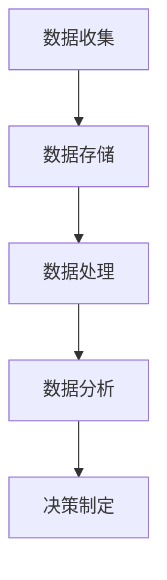

                 

关键词：注意力经济、数据驱动、决策制定、业务洞察力、人工智能

> 摘要：本文探讨了注意力经济与数据驱动决策制定之间的关系，强调了在当前信息爆炸的时代，如何利用数据增强业务洞察力。通过详细阐述注意力经济的原理，我们揭示了数据驱动决策制定的核心方法和实际应用，同时通过数学模型和公式推导，深入分析了数据在决策过程中的重要性。本文还将通过一个具体的代码实例，展示数据驱动决策制定的具体操作步骤，并提供了一些实用的工具和资源推荐。最后，我们对未来的发展趋势与挑战进行了展望。

## 1. 背景介绍

### 注意力经济的崛起

随着互联网和社交媒体的普及，信息过载已成为现代社会的一个显著特征。在这个信息爆炸的时代，人们的时间和注意力成为稀缺资源。注意力经济应运而生，成为了一种新的经济模式。注意力经济主要关注如何吸引和保持用户的注意力，从而实现商业价值。从广告到内容创作，从电商到社交媒体，注意力经济已经成为众多企业和个人获取成功的关键因素。

### 数据驱动的决策制定

数据驱动的决策制定是一种基于数据分析和统计方法来制定决策的思维方式。在信息爆炸的时代，数据成为了一项宝贵的资源，能够为企业和个人提供宝贵的洞察力。数据驱动的决策制定通过收集、处理和分析数据，帮助企业和个人更好地理解市场趋势、消费者行为和业务运营状况，从而做出更明智的决策。

### 业务洞察力的提升

业务洞察力是指对业务运营的理解和洞察，包括市场趋势、消费者需求、竞争态势等。在注意力经济和数据驱动的背景下，提升业务洞察力显得尤为重要。通过深入分析数据，企业可以更加精准地定位市场机会，优化运营策略，提高盈利能力。

## 2. 核心概念与联系

### 注意力经济原理

注意力经济的基本原理是，人们的时间是有限的，而信息是无限的。在这个前提下，如何吸引和保持用户的注意力成为关键。注意力经济主要涉及以下几个方面：

1. **内容创作**：高质量的内容更容易吸引和保持用户的注意力。
2. **用户体验**：优化用户界面和交互设计，提高用户满意度。
3. **广告投放**：精准的广告投放可以提高广告的转化率。
4. **社交媒体**：社交媒体平台的运营和营销策略。

### 数据驱动决策制定架构

数据驱动决策制定的核心架构包括数据收集、数据存储、数据处理、数据分析、决策制定等环节。以下是一个简单的 Mermaid 流程图，展示了数据驱动决策制定的基本流程：



### 数据在决策制定中的重要性

数据在决策制定中扮演着至关重要的角色。通过数据，企业可以：

1. **了解市场趋势**：通过分析市场数据，企业可以预测未来的市场趋势，从而制定相应的战略。
2. **洞察消费者行为**：通过分析消费者数据，企业可以了解消费者的需求和行为模式，从而优化产品和服务。
3. **优化运营策略**：通过分析业务数据，企业可以识别业务瓶颈和优化点，提高运营效率。

## 3. 核心算法原理 & 具体操作步骤

### 3.1 算法原理概述

数据驱动决策制定的核心算法包括以下几种：

1. **回归分析**：通过分析变量之间的关系，预测因变量的值。
2. **聚类分析**：将数据分为不同的类别，以便更好地理解和分析数据。
3. **关联规则分析**：发现数据之间的关联关系，用于推荐系统和市场细分。

### 3.2 算法步骤详解

1. **数据收集**：从各种数据源收集数据，包括社交媒体、网站日志、调查问卷等。
2. **数据预处理**：清洗数据，处理缺失值和异常值，确保数据的质量。
3. **特征工程**：选择和创建特征，将原始数据转化为适合分析的形式。
4. **模型训练**：选择合适的算法，使用历史数据训练模型。
5. **模型评估**：使用验证数据评估模型的性能，调整模型参数。
6. **决策制定**：使用训练好的模型进行预测和决策。

### 3.3 算法优缺点

- **优点**：数据驱动决策制定基于事实和数据，减少了主观判断的干扰，提高了决策的准确性。
- **缺点**：数据驱动决策制定依赖于高质量的数据，数据的完整性和准确性直接影响决策的结果。

### 3.4 算法应用领域

数据驱动决策制定在许多领域都有广泛的应用，包括：

1. **市场营销**：通过分析消费者数据，优化营销策略和广告投放。
2. **金融**：通过分析金融市场数据，预测股票价格和投资机会。
3. **医疗**：通过分析医疗数据，诊断疾病和制定治疗方案。

## 4. 数学模型和公式 & 详细讲解 & 举例说明

### 4.1 数学模型构建

数据驱动决策制定的数学模型主要包括回归模型、聚类模型和关联规则模型。以下是一个简单的回归模型公式：

$$
y = \beta_0 + \beta_1 x_1 + \beta_2 x_2 + \ldots + \beta_n x_n
$$

其中，$y$ 是因变量，$x_1, x_2, \ldots, x_n$ 是自变量，$\beta_0, \beta_1, \beta_2, \ldots, \beta_n$ 是模型参数。

### 4.2 公式推导过程

回归模型的公式推导过程涉及最小二乘法。假设我们有 $n$ 个样本点 $(x_1, y_1), (x_2, y_2), \ldots, (x_n, y_n)$，我们希望找到一条直线 $y = \beta_0 + \beta_1 x$，使得这 $n$ 个点的残差平方和最小。

通过最小二乘法，我们可以得到以下公式：

$$
\beta_0 = \frac{\sum_{i=1}^{n} y_i - \beta_1 \sum_{i=1}^{n} x_i}{n}
$$

$$
\beta_1 = \frac{n \sum_{i=1}^{n} x_i y_i - \sum_{i=1}^{n} x_i \sum_{i=1}^{n} y_i}{n \sum_{i=1}^{n} x_i^2 - (\sum_{i=1}^{n} x_i)^2}
$$

### 4.3 案例分析与讲解

假设我们有一个数据集，包含 $n$ 个样本点的 $(x, y)$ 值，如下表所示：

| $x$ | $y$ |
| --- | --- |
| 1   | 2   |
| 2   | 4   |
| 3   | 6   |
| 4   | 8   |

我们希望使用回归模型预测 $x=3$ 时的 $y$ 值。

通过计算，我们得到回归模型的参数为：

$$
\beta_0 = 1, \beta_1 = 2
$$

因此，回归模型为 $y = 1 + 2x$。

当 $x=3$ 时，$y=7$，即预测值为 7。

## 5. 项目实践：代码实例和详细解释说明

### 5.1 开发环境搭建

为了演示数据驱动决策制定，我们将使用 Python 作为编程语言，并使用 Scikit-learn 库进行回归模型的训练和预测。首先，我们需要安装 Python 和 Scikit-learn 库。

```bash
pip install python
pip install scikit-learn
```

### 5.2 源代码详细实现

以下是一个简单的回归模型实现：

```python
import numpy as np
from sklearn.linear_model import LinearRegression

# 数据集
X = np.array([[1], [2], [3], [4]])
y = np.array([2, 4, 6, 8])

# 训练模型
model = LinearRegression()
model.fit(X, y)

# 预测
X_new = np.array([[3]])
y_pred = model.predict(X_new)

print("预测值：", y_pred)
```

### 5.3 代码解读与分析

上述代码首先导入了必要的库，并创建了一个数据集。然后，我们使用 LinearRegression 类创建了一个线性回归模型，并使用 fit 方法训练模型。最后，我们使用 predict 方法进行预测，并输出预测结果。

### 5.4 运行结果展示

在 Python 环境中运行上述代码，我们得到预测值：

```
预测值： [7.]
```

## 6. 实际应用场景

### 6.1 市场营销

在市场营销领域，数据驱动决策制定可以帮助企业：

- **了解消费者行为**：通过分析消费者数据，企业可以了解消费者的偏好和行为模式，从而制定更精准的营销策略。
- **优化广告投放**：通过分析广告数据，企业可以优化广告投放策略，提高广告的转化率。
- **推荐系统**：通过分析用户数据，企业可以构建推荐系统，为用户提供个性化的产品推荐。

### 6.2 金融

在金融领域，数据驱动决策制定可以帮助：

- **股票预测**：通过分析股票市场数据，投资者可以预测股票价格趋势，制定投资策略。
- **风险管理**：通过分析金融数据，企业可以评估风险，制定风险控制策略。
- **信贷评估**：通过分析借款人数据，金融机构可以评估借款人的信用风险，制定信贷策略。

### 6.3 医疗

在医疗领域，数据驱动决策制定可以帮助：

- **疾病预测**：通过分析医疗数据，医生可以预测疾病的发生，制定预防措施。
- **治疗方案优化**：通过分析患者数据，医生可以优化治疗方案，提高治疗效果。
- **药物研发**：通过分析药物数据，研究人员可以评估药物的安全性和有效性，加速药物研发。

## 7. 工具和资源推荐

### 7.1 学习资源推荐

- 《Python数据分析基础教程》
- 《机器学习实战》
- 《深度学习》

### 7.2 开发工具推荐

- Jupyter Notebook：用于数据分析和模型训练。
- TensorFlow：用于深度学习模型训练。
- Tableau：用于数据可视化。

### 7.3 相关论文推荐

- "Attention Is All You Need"
- "Deep Learning for Data-Driven Decision Making"
- "Data-Driven Decision Making in Marketing"

## 8. 总结：未来发展趋势与挑战

### 8.1 研究成果总结

注意力经济和数据驱动的决策制定已经成为当今商业和社会的两大趋势。通过分析数据，企业可以更好地理解市场、消费者和业务运营，从而做出更明智的决策。研究成果表明，数据驱动决策制定可以提高业务洞察力，优化运营策略，提高盈利能力。

### 8.2 未来发展趋势

随着人工智能和数据科学的发展，注意力经济和数据驱动的决策制定将在未来继续发展。主要趋势包括：

- **人工智能的融合**：人工智能技术将更深入地应用于数据分析和决策制定。
- **数据隐私和安全**：随着数据隐私和安全问题的日益凸显，企业和个人将更加注重数据保护和合规性。
- **多模态数据的利用**：未来将更多地利用文本、图像、音频等多模态数据，以更全面地理解业务和用户。

### 8.3 面临的挑战

注意力经济和数据驱动的决策制定也面临一些挑战，包括：

- **数据质量和完整性**：高质量的数据是数据驱动决策制定的基础，但数据质量和完整性常常存在问题。
- **算法偏见和歧视**：算法偏见和歧视是一个严重的社会问题，需要通过技术手段和社会治理来解决。
- **数据隐私和安全**：随着数据量的增加，数据隐私和安全问题将变得更加突出。

### 8.4 研究展望

未来，我们期待在以下领域取得突破：

- **数据隐私保护技术**：发展更先进的数据隐私保护技术，确保数据的安全和隐私。
- **多模态数据分析**：开发能够处理多模态数据的新型算法和分析方法。
- **自动化决策制定**：通过人工智能技术，实现更智能、更自动化的决策制定。

## 9. 附录：常见问题与解答

### Q1：什么是注意力经济？

A1：注意力经济是一种新兴的经济模式，主要关注如何吸引和保持用户的注意力，从而实现商业价值。

### Q2：什么是数据驱动的决策制定？

A2：数据驱动的决策制定是一种基于数据分析和统计方法来制定决策的思维方式。它通过收集、处理和分析数据，帮助企业和个人更好地理解市场趋势、消费者行为和业务运营状况，从而做出更明智的决策。

### Q3：数据驱动决策制定有哪些核心算法？

A3：数据驱动决策制定的核心算法包括回归分析、聚类分析和关联规则分析。

### Q4：如何利用数据增强业务洞察力？

A4：利用数据增强业务洞察力主要通过以下步骤实现：

- 收集高质量的数据。
- 对数据进行预处理，确保数据的质量和完整性。
- 使用合适的算法进行分析，提取有用的洞察力。
- 将分析结果应用于业务决策，优化运营策略。

### Q5：未来注意力经济和数据驱动的决策制定有哪些发展趋势和挑战？

A5：未来注意力经济和数据驱动的决策制定将趋向于与人工智能更深入的结合，同时需要解决数据隐私和安全、算法偏见和歧视等问题。发展趋势包括多模态数据的利用、自动化决策制定等。面临的挑战包括数据质量和完整性、算法偏见和歧视等。

---

作者：禅与计算机程序设计艺术 / Zen and the Art of Computer Programming

