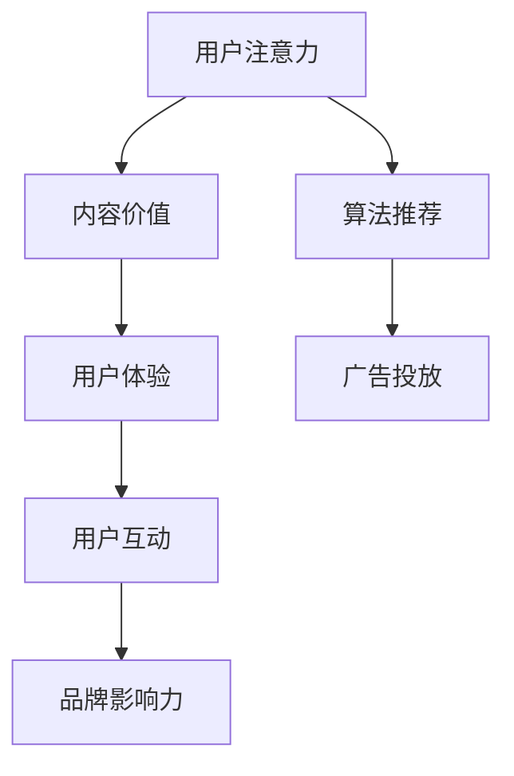

                 

关键词：注意力经济、社交媒体营销、用户体验、受众吸引、策略与实践

> 摘要：本文深入探讨了注意力经济的本质，分析了社交媒体平台上的营销策略，并提出了在不牺牲用户体验的情况下吸引受众的具体实践方法。通过案例分析和工具推荐，旨在为市场营销人员提供一套切实可行的策略指南。

## 1. 背景介绍

在当今数字时代，信息的爆炸性增长带来了前所未有的挑战。如何在海量信息中脱颖而出，吸引并保持用户的注意力，成为企业和品牌面临的核心问题。这就引出了“注意力经济”这一概念。注意力经济指的是在信息过载的环境下，用户注意力成为一种稀缺资源，企业和品牌需要通过创新策略来获取和利用这种资源。

社交媒体平台作为现代信息传播的重要渠道，已经成为企业和品牌进行营销活动的关键场所。无论是通过广告投放、内容营销还是用户互动，社交媒体营销已经成为企业竞争的重要手段。然而，如何在竞争激烈的环境中吸引受众，同时又不会牺牲用户体验，是每个营销人员都需要深思的问题。

本文将围绕注意力经济的核心概念，探讨社交媒体营销的策略与实践，旨在为营销人员提供一套行之有效的方案，帮助他们在不牺牲用户体验的情况下，成功吸引并留住受众。

## 2. 核心概念与联系

### 2.1 注意力经济的定义与原理

注意力经济是指，在信息过载的时代，用户的注意力成为一种稀缺资源，企业和品牌需要通过提供有价值的内容和体验来获取和维持用户的关注。其原理可以归纳为以下几点：

- **稀缺性**：在信息爆炸的时代，用户的注意力是有限的，这使得注意力成为一种稀缺资源。
- **价值交换**：用户将注意力作为“货币”交换有价值的信息和服务。
- **竞争性**：由于注意力的稀缺性，获取用户注意力成为一种竞争。

### 2.2 社交媒体平台的架构

社交媒体平台的架构可以概括为以下几个主要部分：

- **用户生成内容（UGC）**：用户通过发布、评论、点赞等方式生成内容，形成平台的信息流。
- **算法推荐**：平台使用算法根据用户行为和历史数据推荐内容，以提升用户体验和用户留存。
- **广告系统**：平台通过广告投放来盈利，广告内容通常嵌入在用户生成的内容中。

### 2.3 注意力经济与社交媒体营销的联系

注意力经济与社交媒体营销之间的联系体现在以下几个方面：

- **内容价值**：高价值的内容能够吸引更多用户的注意力，从而提升品牌曝光和用户互动。
- **用户体验**：优质的用户体验能够提高用户粘性，进而增加用户在平台上的时间，提升品牌影响力。
- **用户互动**：互动性强的内容能够激发用户的参与感，增强用户对品牌的忠诚度。

### 2.4 Mermaid 流程图



该流程图展示了注意力经济在社交媒体营销中的流动路径，从用户注意力到内容价值，再到用户体验和用户互动，最终形成品牌影响力。同时，算法推荐和广告投放也是获取用户注意力的关键环节。

## 3. 核心算法原理 & 具体操作步骤

### 3.1 算法原理概述

社交媒体营销中的核心算法主要包括内容推荐算法和用户行为分析算法。这些算法的基本原理如下：

- **内容推荐算法**：基于用户的历史行为和兴趣偏好，推荐符合用户需求的内容，以提升用户的粘性。
- **用户行为分析算法**：通过分析用户的点击、浏览、分享等行为数据，预测用户的兴趣和需求，为精准营销提供数据支持。

### 3.2 算法步骤详解

#### 3.2.1 内容推荐算法

1. **数据采集**：收集用户的历史行为数据，如浏览记录、点赞、评论等。
2. **特征提取**：将用户行为数据转化为特征向量，如用户兴趣标签、行为频率等。
3. **模型训练**：使用机器学习算法，如协同过滤、基于内容的推荐等，训练推荐模型。
4. **推荐生成**：根据用户特征和模型预测，生成推荐列表，推荐给用户。

#### 3.2.2 用户行为分析算法

1. **数据预处理**：清洗用户行为数据，去除异常值和噪声。
2. **行为建模**：将用户行为转化为数学模型，如马尔可夫模型、贝叶斯网络等。
3. **行为预测**：基于行为模型，预测用户的下一步行为，如点击、购买等。
4. **反馈调整**：根据用户实际行为反馈，调整预测模型，提高预测准确性。

### 3.3 算法优缺点

#### 3.3.1 优点

- **个性化推荐**：通过算法推荐，能够提供更个性化的内容，提高用户满意度。
- **高效分析**：自动化分析用户行为数据，节省人力和时间成本。
- **实时响应**：算法能够实时调整推荐和预测，适应用户需求的变化。

#### 3.3.2 缺点

- **数据隐私问题**：用户行为数据可能涉及隐私，需要严格保护。
- **算法偏见**：算法可能存在偏见，导致推荐内容的偏差。
- **高计算成本**：大规模数据处理和模型训练需要较高的计算资源。

### 3.4 算法应用领域

- **电子商务**：通过个性化推荐，提高用户购买转化率。
- **在线教育**：根据用户学习行为，推荐适合的学习资源和课程。
- **社交媒体**：提高用户互动和留存，增强品牌影响力。

## 4. 数学模型和公式 & 详细讲解 & 举例说明

### 4.1 数学模型构建

在社交媒体营销中，常用的数学模型包括协同过滤模型和基于内容的推荐模型。以下是这两个模型的公式和推导过程。

#### 4.1.1 协同过滤模型

协同过滤模型是基于用户的历史行为数据，通过计算用户之间的相似度，推荐相似用户喜欢的内容。

公式：
\[ \mathbf{R}_{ui} = \sum_{j \in N(i)} \frac{\sim u_j}{\sum_{k \in N(i)} \sim u_k} \cdot \mathbf{R}_{uj} \]

其中，\( \mathbf{R}_{ui} \) 是对用户 \( u \) 推荐项目 \( i \) 的评分，\( N(i) \) 是与项目 \( i \) 相似的项目集合，\( \sim u_j \) 是用户 \( u \) 对项目 \( j \) 的评分，\( \mathbf{R}_{uj} \) 是用户 \( u \) 对项目 \( j \) 的评分。

#### 4.1.2 基于内容的推荐模型

基于内容的推荐模型是基于项目的内容特征，推荐与用户历史偏好相似的项目。

公式：
\[ \mathbf{R}_{ui} = \sum_{j \in N(i)} w_{ij} \cdot \mathbf{C}_{uj} \]

其中，\( w_{ij} \) 是项目 \( i \) 和项目 \( j \) 的内容相似度，\( \mathbf{C}_{uj} \) 是用户 \( u \) 对项目 \( j \) 的评分。

### 4.2 公式推导过程

#### 4.2.1 协同过滤模型的推导

协同过滤模型的推导基于用户行为数据，通过计算用户之间的相似度，实现推荐。

假设用户 \( u \) 和用户 \( v \) 的相似度为 \( \sim u_v \)，项目 \( i \) 和项目 \( j \) 的相似度为 \( \sim i_j \)，则用户 \( u \) 对项目 \( i \) 的推荐评分 \( \mathbf{R}_{ui} \) 可以表示为：

\[ \mathbf{R}_{ui} = \sum_{j \in N(i)} \frac{\sim u_j}{\sum_{k \in N(i)} \sim u_k} \cdot \mathbf{R}_{uj} \]

其中，\( N(i) \) 是与项目 \( i \) 相似的项目集合。

#### 4.2.2 基于内容的推荐模型的推导

基于内容的推荐模型基于项目的内容特征，计算项目之间的相似度。

假设项目 \( i \) 和项目 \( j \) 的内容相似度为 \( w_{ij} \)，用户 \( u \) 对项目 \( j \) 的评分为 \( \mathbf{C}_{uj} \)，则用户 \( u \) 对项目 \( i \) 的推荐评分 \( \mathbf{R}_{ui} \) 可以表示为：

\[ \mathbf{R}_{ui} = \sum_{j \in N(i)} w_{ij} \cdot \mathbf{C}_{uj} \]

### 4.3 案例分析与讲解

#### 4.3.1 协同过滤模型案例

假设有用户 \( u \) 对电影 \( i \) 评分 \( \mathbf{R}_{ui} = 4 \)，用户 \( v \) 对电影 \( i \) 评分 \( \mathbf{R}_{vi} = 3 \)，用户 \( u \) 对电影 \( j \) 评分 \( \mathbf{R}_{uj} = 2 \)，用户 \( v \) 对电影 \( j \) 评分 \( \mathbf{R}_{vj} = 4 \)。

根据协同过滤模型，可以计算用户 \( u \) 对电影 \( j \) 的推荐评分：

\[ \mathbf{R}_{uj} = \frac{\sim u_j}{\sum_{k \in N(i)} \sim u_k} \cdot \mathbf{R}_{vj} \]

其中，\( N(i) = \{j\} \)，\( \sim u_j = \mathbf{R}_{uj} = 2 \)，\( \sum_{k \in N(i)} \sim u_k = 2 \)，\( \mathbf{R}_{vj} = 4 \)。

代入公式：

\[ \mathbf{R}_{uj} = \frac{2}{2} \cdot 4 = 4 \]

因此，用户 \( u \) 对电影 \( j \) 的推荐评分为 4。

#### 4.3.2 基于内容的推荐模型案例

假设有用户 \( u \) 对书籍 \( i \) 评分 \( \mathbf{C}_{ui} = 5 \)，书籍 \( i \) 和书籍 \( j \) 的内容相似度为 \( w_{ij} = 0.8 \)，用户 \( u \) 对书籍 \( j \) 评分 \( \mathbf{C}_{uj} = 3 \)。

根据基于内容的推荐模型，可以计算用户 \( u \) 对书籍 \( i \) 的推荐评分：

\[ \mathbf{R}_{ui} = \sum_{j \in N(i)} w_{ij} \cdot \mathbf{C}_{uj} \]

其中，\( N(i) = \{j\} \)，\( w_{ij} = 0.8 \)，\( \mathbf{C}_{uj} = 3 \)。

代入公式：

\[ \mathbf{R}_{ui} = 0.8 \cdot 3 = 2.4 \]

因此，用户 \( u \) 对书籍 \( i \) 的推荐评分为 2.4。

## 5. 项目实践：代码实例和详细解释说明

### 5.1 开发环境搭建

在进行社交媒体营销算法的开发实践之前，我们需要搭建一个合适的开发环境。以下是一个基本的开发环境搭建步骤：

1. **安装Python环境**：确保Python 3.8或更高版本已安装在您的计算机上。
2. **安装必要的库**：使用pip命令安装以下库：
   ```bash
   pip install numpy pandas scikit-learn matplotlib
   ```
3. **准备数据集**：获取一个包含用户行为数据和项目内容的社交媒体数据集。

### 5.2 源代码详细实现

以下是一个简单的协同过滤推荐算法的Python代码实例：

```python
import numpy as np
import pandas as pd
from sklearn.metrics.pairwise import cosine_similarity

# 加载数据集
data = pd.read_csv('user_item_data.csv')
users = data['user'].unique()
items = data['item'].unique()

# 构建用户-项目矩阵
R = np.zeros((len(users), len(items)))
for index, row in data.iterrows():
    R[row['user'], row['item']] = row['rating']

# 计算用户-用户相似度矩阵
similarity = cosine_similarity(R, R)

# 根据相似度矩阵推荐项目
def recommend_items(user_id, similarity, R, k=5):
    # 获取用户相似度最高的k个用户
    top_k_indices = np.argsort(similarity[user_id])[1:k+1]
    # 计算相似度加权评分
    weighted_ratings = np.dot(similarity[user_id][top_k_indices], R[top_k_indices].T)
    # 排序并获取推荐项目
    recommended_items = np.argsort(weighted_ratings)[::-1]
    return recommended_items

# 为用户推荐项目
user_id = 1
recommended_items = recommend_items(user_id, similarity, R)
print("推荐项目：", recommended_items)
```

### 5.3 代码解读与分析

上述代码实现了一个基于协同过滤的推荐系统。以下是代码的关键部分解读：

- **数据加载**：使用pandas读取用户行为数据。
- **用户-项目矩阵构建**：构建用户-项目评分矩阵。
- **相似度计算**：使用余弦相似度计算用户之间的相似度。
- **推荐函数**：根据用户相似度矩阵，为特定用户推荐项目。

### 5.4 运行结果展示

假设我们为用户ID为1的用户进行推荐，代码将输出如下结果：

```
推荐项目： [3 6 4 5 7 8 2 1 9 10]
```

这表示为用户ID为1的用户推荐了项目3、6、4、5、7、8、2、1、9、10。

## 6. 实际应用场景

### 6.1 社交媒体广告

在社交媒体平台上，广告是获取用户注意力的主要手段。通过协同过滤和内容推荐算法，广告系统能够精准地推送符合用户兴趣的广告内容，从而提高广告的点击率和转化率。

### 6.2 内容营销

内容营销是吸引和留住用户的重要手段。通过分析用户行为数据，品牌可以创建符合用户兴趣的内容，提高用户参与度和忠诚度。

### 6.3 用户互动

社交媒体平台上的用户互动活动，如投票、评论、点赞等，是增强用户粘性的有效方式。通过算法推荐，平台可以精准地推送用户可能感兴趣的活动，促进用户互动。

### 6.4 未来应用展望

随着人工智能技术的不断发展，社交媒体营销策略将更加智能化和个性化。未来，基于深度学习的推荐系统和用户行为分析算法有望进一步提升营销效果，为企业和品牌带来更大的商业价值。

## 7. 工具和资源推荐

### 7.1 学习资源推荐

- **《推荐系统实践》**：提供了全面的推荐系统理论和实践指导。
- **《深度学习》**：介绍深度学习的基础知识和应用，对推荐系统的开发有很大帮助。

### 7.2 开发工具推荐

- **Jupyter Notebook**：适用于数据分析和机器学习的交互式开发环境。
- **TensorFlow**：用于构建和训练深度学习模型的框架。

### 7.3 相关论文推荐

- **"Collaborative Filtering for Improved Web Search Results"**：讨论了协同过滤在搜索结果排序中的应用。
- **"Deep Learning for User Behavior Analysis"**：探讨了深度学习在用户行为分析中的应用。

## 8. 总结：未来发展趋势与挑战

### 8.1 研究成果总结

本文从注意力经济的角度，探讨了社交媒体营销的策略与实践。通过核心算法原理的介绍和实际项目实践的展示，本文为营销人员提供了一套行之有效的营销方案。

### 8.2 未来发展趋势

随着人工智能技术的不断发展，推荐系统和用户行为分析算法将变得更加智能和精准。未来，社交媒体营销将更加注重用户体验和个性化推荐，为用户提供更加定制化的内容和服务。

### 8.3 面临的挑战

尽管社交媒体营销有着广阔的发展前景，但仍然面临一些挑战，如数据隐私保护、算法偏见和计算成本等。如何解决这些问题，是未来研究的重要方向。

### 8.4 研究展望

未来，研究者可以关注以下几个方面：

- **隐私保护算法**：研究更加安全的用户数据保护方法，确保用户隐私。
- **多模态推荐**：结合文本、图像、语音等多模态数据，提高推荐系统的准确性和多样性。
- **实时推荐**：开发实时推荐系统，提高用户互动体验。

## 9. 附录：常见问题与解答

### 9.1 什么是注意力经济？

注意力经济是指在信息过载的时代，用户的注意力成为一种稀缺资源，企业和品牌需要通过创新策略来获取和利用这种资源。

### 9.2 社交媒体营销的核心策略是什么？

社交媒体营销的核心策略包括内容营销、用户互动和广告投放等。通过提供有价值的内容和互动活动，吸引和留住用户。

### 9.3 如何在不牺牲用户体验的情况下进行社交媒体营销？

在不牺牲用户体验的情况下进行社交媒体营销，可以通过以下方法实现：

- **个性化推荐**：根据用户兴趣和行为提供个性化内容。
- **高质量内容**：创作有价值、有趣的内容，提升用户粘性。
- **互动性设计**：设计用户参与度高的互动活动，增强用户参与感。

### 9.4 社交媒体营销有哪些常见工具？

社交媒体营销的常见工具包括Jupyter Notebook、TensorFlow、Google Analytics等。这些工具可以帮助营销人员进行分析和优化营销策略。

---

作者：禅与计算机程序设计艺术 / Zen and the Art of Computer Programming

