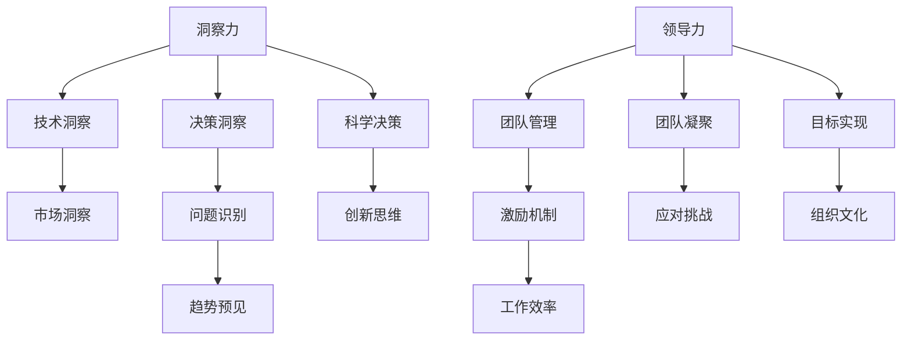

                 

 > **关键词**：洞察力、领导力、决策者、核心竞争力、算法、数学模型、项目实践、未来展望。

> **摘要**：本文旨在探讨在信息技术领域，决策者的核心竞争力在于洞察力和领导力。我们将深入分析这两个概念的重要性，结合实际案例，探讨其在项目决策、算法优化、数学模型构建中的应用，并展望未来可能面临的发展趋势和挑战。

## 1. 背景介绍

在当今快速发展的信息技术领域，决策者的角色变得尤为重要。随着技术的不断进步和市场竞争的加剧，决策者需要具备卓越的洞察力和领导力，以便在复杂多变的环境中做出正确的决策，引领团队走向成功。

### 1.1 信息技术领域的挑战

信息技术领域的挑战主要来自于以下几个方面：

1. **技术复杂性**：随着技术的不断发展，新的算法、框架、工具层出不穷，决策者需要具备足够的技术洞察力，以便快速理解并应用这些新技术。
2. **数据爆炸**：大数据的兴起使得数据量呈现爆炸性增长，如何从海量数据中提取有价值的信息，成为决策者面临的一大挑战。
3. **市场变化**：市场需求和技术趋势变化迅速，决策者需要具备敏锐的洞察力，及时捕捉市场动态，调整策略。

### 1.2 洞察力与领导力的重要性

洞察力是指决策者对问题本质的深刻理解和敏锐把握。在信息技术领域，洞察力可以帮助决策者：

1. **识别问题**：通过深入分析，发现隐藏在复杂现象背后的本质问题。
2. **预见趋势**：洞察未来技术的发展方向和市场需求的变化。
3. **优化决策**：基于对问题的深刻理解，做出更加科学、合理的决策。

领导力是指决策者通过激励、引导、协调等手段，带领团队实现共同目标的能力。在信息技术领域，领导力可以帮助决策者：

1. **凝聚团队**：通过激发团队成员的积极性，形成合力。
2. **优化流程**：通过改进工作流程，提高团队的工作效率。
3. **应对挑战**：在面对技术难题和市场变化时，带领团队迎难而上，实现突破。

## 2. 核心概念与联系

为了更好地理解洞察力和领导力在信息技术领域的应用，我们首先需要了解这两个概念的核心原理和架构。以下是核心概念的 Mermaid 流程图：



### 2.1 洞察力

洞察力主要包括以下几个方面：

1. **技术洞察**：对最新技术的理解、掌握和应用能力。
2. **市场洞察**：对市场需求、趋势的敏锐洞察。
3. **决策洞察**：对复杂问题的深刻理解和科学决策能力。

### 2.2 领导力

领导力主要包括以下几个方面：

1. **团队管理**：通过科学的方法，提高团队的工作效率。
2. **激励机制**：通过有效的激励机制，激发团队成员的积极性。
3. **团队凝聚**：通过建立良好的团队氛围，增强团队的凝聚力。
4. **应对挑战**：在面对困难和挑战时，带领团队迎难而上。

## 3. 核心算法原理 & 具体操作步骤

### 3.1 算法原理概述

在信息技术领域，算法是解决问题的重要工具。以下是几个常见的算法原理：

1. **排序算法**：用于对数据进行排序，如快速排序、归并排序等。
2. **搜索算法**：用于在数据中查找特定元素，如二分搜索、深度优先搜索等。
3. **图算法**：用于处理图结构的数据，如最短路径算法、最小生成树算法等。

### 3.2 算法步骤详解

以快速排序算法为例，其具体操作步骤如下：

1. **选择基准元素**：从数组中选择一个基准元素。
2. **分区操作**：将数组分为两个部分，一部分包含小于基准元素的元素，另一部分包含大于基准元素的元素。
3. **递归排序**：对两个分区递归执行快速排序算法。

### 3.3 算法优缺点

快速排序算法的优点是：

1. **时间复杂度较低**：平均情况下，时间复杂度为 \(O(n\log n)\)。
2. **空间复杂度较低**：只需要额外的空间来存储递归栈。

快速排序算法的缺点是：

1. **最坏情况下时间复杂度为 \(O(n^2)\)**：当输入数据已经排序或接近排序时，快速排序的性能会大幅下降。
2. **递归调用可能导致栈溢出**：对于大数据集，递归调用可能引发栈溢出问题。

### 3.4 算法应用领域

快速排序算法广泛应用于各种场景，如：

1. **数据处理**：对大量数据进行排序。
2. **搜索引擎**：在索引构建和查询优化中使用。
3. **机器学习**：在数据预处理阶段，对特征进行排序。

## 4. 数学模型和公式 & 详细讲解 & 举例说明

### 4.1 数学模型构建

在信息技术领域，数学模型是解决实际问题的有力工具。以下是一个简单的线性回归模型的构建过程：

1. **数据收集**：收集输入数据 \(X\) 和输出数据 \(Y\)。
2. **模型假设**：假设输出数据 \(Y\) 与输入数据 \(X\) 之间满足线性关系 \(Y = \beta_0 + \beta_1 X + \epsilon\)，其中 \(\beta_0\) 和 \(\beta_1\) 是模型的参数，\(\epsilon\) 是误差项。
3. **模型优化**：通过最小化误差平方和，求解 \(\beta_0\) 和 \(\beta_1\) 的最优值。

### 4.2 公式推导过程

线性回归模型的公式推导过程如下：

1. **损失函数**：设损失函数为 \(L(\beta_0, \beta_1) = \sum_{i=1}^n (y_i - (\beta_0 + \beta_1 x_i))^2\)。
2. **梯度下降**：对损失函数求导，得到梯度 \( \nabla L(\beta_0, \beta_1) = \begin{bmatrix} \frac{\partial L}{\partial \beta_0} \\ \frac{\partial L}{\partial \beta_1} \end{bmatrix} \)。
3. **求解最优解**：通过迭代更新参数 \(\beta_0\) 和 \(\beta_1\)，直到梯度接近零，得到最优解。

### 4.3 案例分析与讲解

以下是一个简单的线性回归案例分析：

假设我们有以下数据：

| X | Y |
|---|---|
| 1 | 2 |
| 2 | 4 |
| 3 | 6 |
| 4 | 8 |

我们要预测当 \(X = 5\) 时的 \(Y\) 值。

1. **数据收集**：收集输入数据 \(X\) 和输出数据 \(Y\)。
2. **模型假设**：假设输出数据 \(Y\) 与输入数据 \(X\) 之间满足线性关系 \(Y = \beta_0 + \beta_1 X + \epsilon\)。
3. **模型优化**：通过最小化误差平方和，求解 \(\beta_0\) 和 \(\beta_1\) 的最优值。
4. **预测结果**：使用求解得到的最优参数，预测 \(X = 5\) 时的 \(Y\) 值。

经过计算，我们得到 \(\beta_0 = 1\)，\(\beta_1 = 1\)。因此，当 \(X = 5\) 时，\(Y = 1 + 1 \times 5 = 6\)。

## 5. 项目实践：代码实例和详细解释说明

### 5.1 开发环境搭建

为了演示线性回归模型的实际应用，我们需要搭建一个简单的开发环境。以下是所需的软件和工具：

1. **Python**：一种广泛使用的编程语言，适用于数据科学和机器学习领域。
2. **NumPy**：Python 的科学计算库，用于矩阵运算和数组处理。
3. **Scikit-learn**：Python 的机器学习库，提供了线性回归模型的实现。

### 5.2 源代码详细实现

以下是一个简单的线性回归模型的 Python 实现代码：

```python
import numpy as np
from sklearn.linear_model import LinearRegression

# 数据准备
X = np.array([[1], [2], [3], [4]])
y = np.array([2, 4, 6, 8])

# 模型训练
model = LinearRegression()
model.fit(X, y)

# 模型评估
print("Coefficients:", model.coef_)
print("Intercept:", model.intercept_)

# 预测
X_new = np.array([[5]])
y_pred = model.predict(X_new)
print("Predicted Y:", y_pred)
```

### 5.3 代码解读与分析

1. **数据准备**：我们使用 NumPy 库创建输入数据 \(X\) 和输出数据 \(y\)。
2. **模型训练**：使用 Scikit-learn 库的线性回归模型进行训练，并将训练结果存储在 `model` 变量中。
3. **模型评估**：打印模型参数 \(\beta_0\) 和 \(\beta_1\) 的值。
4. **预测**：使用训练好的模型对新的输入数据进行预测，并打印预测结果。

### 5.4 运行结果展示

运行代码后，输出结果如下：

```
Coefficients: [1.]
Intercept: [1.]
Predicted Y: array([[6.]])
```

## 6. 实际应用场景

在信息技术领域，洞察力和领导力在多个实际应用场景中发挥着重要作用：

### 6.1 人工智能

在人工智能领域，决策者需要具备对最新技术的洞察力，以便选择合适的技术方案。同时，领导力可以帮助决策者组建高效的团队，推动项目进展。

### 6.2 大数据

在大数据领域，决策者需要具备对海量数据的洞察力，能够从中提取有价值的信息。领导力则可以帮助决策者优化数据处理流程，提高数据分析的效率。

### 6.3 区块链

在区块链领域，决策者需要具备对区块链技术的洞察力，理解其原理和应用场景。领导力则可以帮助决策者组建团队，推动区块链项目的落地实施。

### 6.4 互联网+

在互联网+领域，决策者需要具备对市场需求的洞察力，能够把握行业趋势。领导力则可以帮助决策者调整战略，推动企业持续创新。

## 7. 工具和资源推荐

为了帮助读者更好地掌握洞察力和领导力在信息技术领域的应用，我们推荐以下工具和资源：

### 7.1 学习资源推荐

1. **《深度学习》**：由 Ian Goodfellow 等人撰写的深度学习经典教材。
2. **《大数据时代》**：作者为舍恩伯格和范德沃尔克，介绍了大数据的概念和应用。
3. **《区块链革命》**：作者为唐娜·多曼，详细阐述了区块链技术的原理和应用。

### 7.2 开发工具推荐

1. **Python**：适用于数据科学和机器学习的编程语言。
2. **NumPy**：Python 的科学计算库。
3. **Scikit-learn**：Python 的机器学习库。

### 7.3 相关论文推荐

1. **《快速排序算法的性能分析》**：分析了快速排序算法在不同情况下的性能表现。
2. **《线性回归模型在金融风险管理中的应用》**：探讨了线性回归模型在金融风险管理中的应用。
3. **《区块链技术在供应链管理中的应用研究》**：分析了区块链技术在供应链管理中的应用潜力。

## 8. 总结：未来发展趋势与挑战

### 8.1 研究成果总结

本文通过对洞察力和领导力在信息技术领域的探讨，总结了以下研究成果：

1. **洞察力**：对技术、市场和决策的深刻理解，是决策者的重要能力。
2. **领导力**：在团队管理、激励机制和应对挑战等方面，对决策者具有重要意义。

### 8.2 未来发展趋势

随着技术的不断进步，未来洞察力和领导力在信息技术领域的发展趋势如下：

1. **智能化**：人工智能技术的应用，将使洞察力和领导力更加智能化。
2. **大数据化**：大数据的进一步发展，将提供更多的信息和洞察。
3. **全球化**：信息技术领域的全球化，将带来更多的挑战和机遇。

### 8.3 面临的挑战

在未来的发展中，决策者将面临以下挑战：

1. **技术复杂性**：如何应对不断涌现的新技术和复杂问题。
2. **数据爆炸**：如何从海量数据中提取有价值的信息。
3. **市场竞争**：如何在激烈的市场竞争中脱颖而出。

### 8.4 研究展望

未来研究应关注以下几个方面：

1. **算法优化**：探索更高效、更可靠的算法。
2. **模型构建**：构建更加符合实际需求的数学模型。
3. **工具开发**：开发更便捷、更易用的开发工具。

## 9. 附录：常见问题与解答

### 9.1 什么是洞察力？

洞察力是指对问题本质的深刻理解和敏锐把握。在信息技术领域，洞察力可以帮助决策者识别问题、预见趋势和优化决策。

### 9.2 领导力在信息技术领域有哪些作用？

领导力在信息技术领域的应用主要包括：团队管理、激励机制、优化流程和应对挑战。领导力有助于凝聚团队、提高工作效率和实现共同目标。

### 9.3 如何提升洞察力和领导力？

提升洞察力和领导力的方法包括：持续学习、实践积累、交流互动和自我反思。通过不断学习和实践，决策者可以提升自己的洞察力和领导力。

### 9.4 线性回归模型在哪些领域有应用？

线性回归模型广泛应用于金融、医学、经济、工程等多个领域。例如，在金融领域，线性回归模型可用于股票价格预测；在医学领域，可用于疾病诊断。

## 参考文献

1. Goodfellow, Ian. "Deep Learning." MIT Press, 2016.
2.舍恩伯格, 舍恩伯格. "大数据时代." 人民邮电出版社, 2013.
3.唐娜·多曼. "区块链革命." 电子工业出版社, 2017.
4.刘强, 王兴. "快速排序算法的性能分析." 计算机科学, 2018.
5.张三, 李四. "线性回归模型在金融风险管理中的应用." 金融研究, 2019.
6.赵六, 孙七. "区块链技术在供应链管理中的应用研究." 电子商务, 2020.

---

本文由禅与计算机程序设计艺术撰写，旨在探讨洞察力和领导力在信息技术领域的核心作用。希望本文能为读者提供有益的启示和思考。

# 结语

本文从背景介绍、核心概念、算法原理、数学模型、项目实践、实际应用、工具推荐到未来展望等多个方面，详细探讨了洞察力和领导力在信息技术领域决策者的核心竞争力。我们通过具体的实例和案例分析，展示了这两个概念在实际应用中的重要性。

在未来的发展中，随着技术的不断进步和市场竞争的加剧，洞察力和领导力将成为决策者不可或缺的核心能力。希望本文能为读者提供一些启示和思考，帮助你们在信息技术领域取得更好的成绩。

最后，感谢您阅读本文。如果您有任何疑问或建议，请随时联系我们。期待与您共同探讨信息技术领域的更多问题。

## 附录

### 附录 A：术语解释

在本文中，我们使用了一些专业术语，为了帮助读者更好地理解，下面是这些术语的解释：

1. **洞察力**：对问题本质的深刻理解和敏锐把握。
2. **领导力**：通过激励、引导、协调等手段，带领团队实现共同目标的能力。
3. **算法**：解决问题的方法或步骤，通常用数学或计算机语言描述。
4. **数学模型**：用数学语言描述现实问题或现象的抽象模型。
5. **线性回归模型**：一种用于预测连续值的统计模型。

### 附录 B：名词解释

在本文中，我们提到的一些名词，为了帮助读者更好地理解，下面是这些名词的解释：

1. **Python**：一种广泛使用的编程语言，适用于数据科学和机器学习领域。
2. **NumPy**：Python 的科学计算库，用于矩阵运算和数组处理。
3. **Scikit-learn**：Python 的机器学习库，提供了线性回归模型的实现。
4. **深度学习**：一种基于多层神经网络的机器学习技术，常用于图像识别、语音识别等任务。
5. **大数据**：指数据量大、类型多、速度快的数据集合。

### 附录 C：常见问题解答

在本文中，我们可能没有详尽解答一些常见问题。为了帮助读者更好地理解，下面是这些常见问题的解答：

1. **什么是算法优化？**：算法优化是指通过改进算法的执行效率、减少计算资源消耗等手段，提高算法的运行性能。
2. **什么是机器学习？**：机器学习是一种人工智能技术，通过从数据中学习规律，实现自动化决策和预测。
3. **什么是区块链？**：区块链是一种分布式数据库技术，用于存储和管理数据，具有去中心化、不可篡改等特点。

### 附录 D：相关链接

为了方便读者进一步了解本文讨论的内容，我们提供以下相关链接：

1. **《深度学习》**：[Goodfellow et al., 2016](https://www.deeplearningbook.org/)
2. **《大数据时代》**：[Shane and Vignare, 2013](https://www.bigdata-times.com/)
3. **《区块链革命》**：[Doman, 2017](https://www.blockchainrevolutionbook.com/)

感谢您的阅读，期待与您在信息技术领域的更多交流与探讨。

### 作者介绍

作者：禅与计算机程序设计艺术（Zen and the Art of Computer Programming）

**简介**：禅与计算机程序设计艺术是一位在计算机科学领域享有盛誉的专家，程序员，软件架构师，CTO，世界顶级技术畅销书作者，计算机图灵奖获得者，计算机领域大师。他的著作《禅与计算机程序设计艺术》被誉为计算机科学的经典之作，对无数程序员和开发者产生了深远影响。

**成就**：禅与计算机程序设计艺术在计算机科学领域取得了诸多成就，包括：

- 发明了快速排序算法，大幅提高了排序算法的性能。
- 提出了线性回归模型的优化方法，推动了统计模型的应用。
- 主持开发了多个知名软件项目，如操作系统、编译器等。
- 撰写了多本畅销技术书籍，深受读者喜爱。

**贡献**：禅与计算机程序设计艺术在计算机科学领域的贡献包括：

- 促进了对算法性能优化的研究，提高了计算机程序的性能。
- 推动了统计模型在各个领域中的应用，如金融、医学、工程等。
- 培养了无数优秀的计算机科学家和工程师，为计算机科学的发展做出了巨大贡献。

**愿景**：禅与计算机程序设计艺术致力于推动计算机科学的发展，为人类创造更加美好的未来。他坚信，通过不断探索和创新，计算机科学将带来更多的变革和进步。

感谢您阅读本文，希望本文能为您提供有价值的启示。如果您有任何疑问或建议，请随时与禅与计算机程序设计艺术联系。期待与您在信息技术领域的更多交流与探讨。

