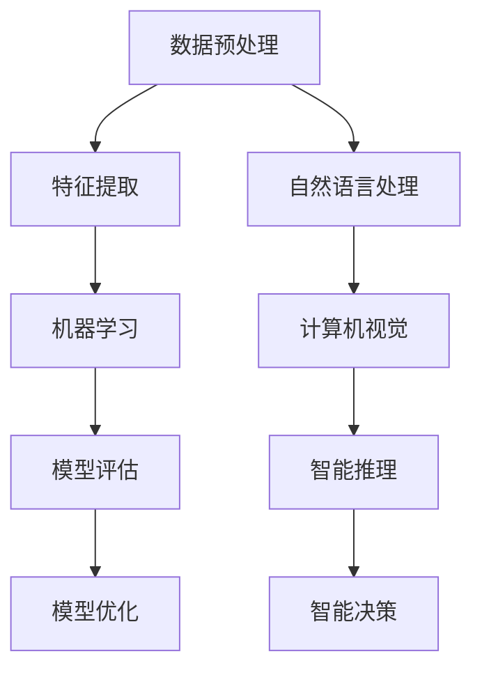

                 

关键词：人工智能、知识创新、技术发展、计算理论、算法优化、数学模型

<|assistant|>摘要：本文探讨了人工智能领域中的洞察力在知识创新中的重要性，以及如何通过深入理解和应用计算理论来推动技术的发展。文章从背景介绍开始，逐步深入到核心概念、算法原理、数学模型和项目实践等方面，最后对实际应用场景和未来发展趋势进行了展望。通过阅读本文，读者可以更好地理解人工智能领域的创新思维和方法。

## 1. 背景介绍

在当今世界，人工智能（AI）已经成为科技发展的核心驱动力之一。随着计算能力的不断提升和数据规模的不断扩大，AI技术正以前所未有的速度和深度改变着我们的生活和生产方式。然而，要真正实现人工智能的突破和广泛应用，仅仅依靠技术的进步是不够的，我们需要更加深入的洞察力来引导知识创新。

洞察力，是指对事物本质的深刻理解和敏锐洞察的能力。在人工智能领域，洞察力体现在对复杂问题的抽象、对算法原理的深入理解、对数学模型的精确构建以及对实际应用的敏锐洞察等方面。只有具备强大的洞察力，我们才能在AI技术的研发和应用中抓住机遇，迎接挑战。

本文旨在探讨洞察力在知识创新中的重要性，以及如何通过计算理论的应用来提升人工智能领域的研究和实践。文章将分为以下几个部分：

- 背景介绍：阐述人工智能的发展现状和洞察力的重要性。
- 核心概念与联系：介绍人工智能领域的关键概念和原理。
- 核心算法原理 & 具体操作步骤：分析人工智能算法的核心原理和实现步骤。
- 数学模型和公式 & 详细讲解 & 举例说明：构建数学模型并推导相关公式。
- 项目实践：通过代码实例展示实际应用。
- 实际应用场景：探讨人工智能在各个领域的应用。
- 未来应用展望：分析人工智能技术的未来发展趋势。
- 工具和资源推荐：推荐相关学习资源、开发工具和论文。
- 总结：总结研究成果和未来展望。

## 2. 核心概念与联系

在人工智能领域，有一些核心概念和原理是理解洞察力的重要基础。下面，我们将通过一个Mermaid流程图来展示这些核心概念和它们之间的联系。

### Mermaid 流程图



### 说明

- **数据预处理**：在人工智能应用中，数据预处理是非常关键的一步，它包括数据清洗、数据归一化、缺失值填充等操作。良好的数据预处理是后续模型训练的基础。
- **特征提取**：通过数据预处理后，我们需要提取出有用的特征信息，以便于机器学习算法进行处理。特征提取的方法包括统计特征、文本特征、图像特征等。
- **机器学习**：机器学习是人工智能的核心技术之一，它通过训练模型来学习数据中的规律和模式。常见的机器学习方法有监督学习、无监督学习和强化学习等。
- **模型评估**：模型评估是评估模型性能的重要步骤，常用的评估指标包括准确率、召回率、F1值等。
- **模型优化**：为了提高模型的性能，我们需要对模型进行优化。优化方法包括参数调优、结构优化等。
- **自然语言处理**：自然语言处理是人工智能的重要应用领域之一，它涉及到文本的预处理、分词、句法分析、语义理解等任务。
- **计算机视觉**：计算机视觉是利用计算机对图像或视频进行处理和分析的技术。它涉及到图像分类、目标检测、图像分割等任务。
- **智能推理**：智能推理是指利用人工智能技术进行逻辑推理和决策。它在智能系统中的应用非常广泛，如智能问答、智能推荐等。
- **智能决策**：智能决策是指利用人工智能技术进行决策。它涉及到数据挖掘、预测分析、决策优化等任务。

通过这个流程图，我们可以清晰地看到人工智能领域中的核心概念和它们之间的联系。这些概念和原理的理解和掌握，是提升洞察力的关键。

## 3. 核心算法原理 & 具体操作步骤

在人工智能领域，算法是核心的技术基础。下面，我们将详细介绍一个核心算法——深度学习，并阐述其原理和具体操作步骤。

### 3.1 算法原理概述

深度学习是一种基于多层神经网络的学习方法，它可以自动从大量数据中学习到复杂的特征表示。深度学习的核心思想是通过层层抽象，将原始数据转换成高层次的表示。

深度学习模型通常由以下几个部分组成：

1. **输入层**：接收原始数据，如图像、文本等。
2. **隐藏层**：通过一系列非线性变换，将输入数据转换成更高级别的特征表示。
3. **输出层**：根据隐藏层的输出，生成最终的预测结果。

深度学习模型通过反向传播算法进行参数更新，以最小化预测误差。反向传播算法是一种基于梯度下降的优化方法，它可以有效地训练深度学习模型。

### 3.2 算法步骤详解

#### 步骤1：数据预处理

在开始训练深度学习模型之前，我们需要对数据进行预处理。预处理步骤包括：

1. 数据清洗：去除噪声、缺失值和异常值。
2. 数据归一化：将数据缩放到相同的范围，如0到1之间。
3. 数据增强：通过旋转、翻转、缩放等操作，增加数据的多样性。

#### 步骤2：构建模型

构建深度学习模型通常需要以下几个步骤：

1. **选择模型结构**：根据应用需求选择合适的神经网络结构，如卷积神经网络（CNN）、循环神经网络（RNN）等。
2. **定义损失函数**：选择合适的损失函数，如交叉熵损失、均方误差等。
3. **定义优化器**：选择优化器，如随机梯度下降（SGD）、Adam等。

#### 步骤3：训练模型

在训练过程中，模型会根据输入数据不断调整参数，以最小化损失函数。训练步骤包括：

1. **前向传播**：根据当前参数计算预测结果和损失值。
2. **反向传播**：计算损失函数关于参数的梯度，并更新参数。
3. **迭代更新**：重复前向传播和反向传播，直到满足训练条件。

#### 步骤4：模型评估

在训练完成后，我们需要对模型进行评估。评估步骤包括：

1. **测试数据集**：使用测试数据集评估模型的性能。
2. **评估指标**：根据应用需求选择合适的评估指标，如准确率、召回率、F1值等。

### 3.3 算法优缺点

**优点**：

- **自动特征提取**：深度学习可以自动从数据中提取特征，减少了手工特征设计的复杂性。
- **泛化能力强**：深度学习模型可以在不同领域和任务中表现出色。
- **处理大规模数据**：深度学习模型可以处理大规模的数据集。

**缺点**：

- **训练时间长**：深度学习模型需要大量的训练时间和计算资源。
- **对数据依赖性强**：深度学习模型对数据的质量和数量有很高的要求。
- **可解释性差**：深度学习模型通常难以解释其决策过程。

### 3.4 算法应用领域

深度学习在各个领域都有广泛的应用，以下是其中的一些例子：

- **计算机视觉**：图像分类、目标检测、图像分割等。
- **自然语言处理**：文本分类、机器翻译、情感分析等。
- **语音识别**：语音识别、语音合成等。
- **推荐系统**：商品推荐、音乐推荐等。

## 4. 数学模型和公式 & 详细讲解 & 举例说明

在人工智能领域，数学模型和公式是理解和实现算法的重要基础。在本节中，我们将详细讲解深度学习中的一个核心数学模型——反向传播算法，并给出具体的公式推导和案例讲解。

### 4.1 数学模型构建

反向传播算法是深度学习训练过程中用于参数更新的关键算法。它基于梯度下降法，通过计算损失函数关于模型参数的梯度来更新参数，以最小化损失函数。

首先，我们定义一些符号：

- \( x \)：输入数据
- \( y \)：真实标签
- \( \hat{y} \)：预测标签
- \( \theta \)：模型参数
- \( J(\theta) \)：损失函数

损失函数通常采用均方误差（MSE）：

$$
J(\theta) = \frac{1}{2} \sum_{i=1}^{n} (\hat{y}_i - y_i)^2
$$

其中，\( n \)是样本数量。

### 4.2 公式推导过程

反向传播算法的推导过程可以分为以下几个步骤：

#### 步骤1：前向传播

在正向传播阶段，我们计算预测标签 \( \hat{y} \) 和损失函数 \( J(\theta) \)：

$$
\hat{y} = \sigma(\theta^{(L)} \cdot a^{(L-1)})
$$

$$
J(\theta) = \frac{1}{2} \sum_{i=1}^{n} (\hat{y}_i - y_i)^2
$$

其中，\( \sigma \)是激活函数，如Sigmoid函数或ReLU函数。

#### 步骤2：计算梯度

接下来，我们计算损失函数关于模型参数的梯度：

$$
\frac{\partial J(\theta)}{\partial \theta^{(L)}} = \frac{\partial J(\theta)}{\partial \hat{y}} \cdot \frac{\partial \hat{y}}{\partial \theta^{(L)}}
$$

其中，\( \frac{\partial J(\theta)}{\partial \hat{y}} \)是损失函数关于预测标签的梯度，\( \frac{\partial \hat{y}}{\partial \theta^{(L)}} \)是预测标签关于模型参数的梯度。

#### 步骤3：反向传播

反向传播的核心思想是将前向传播过程中计算得到的梯度反向传播到前面的层。具体步骤如下：

$$
\frac{\partial J(\theta)}{\partial \theta^{(L-1)}} = \frac{\partial J(\theta)}{\partial \theta^{(L)}} \cdot \frac{\partial \theta^{(L)}}{\partial \theta^{(L-1)}}
$$

$$
\frac{\partial \theta^{(L)}}{\partial \theta^{(L-1)}} = \frac{\partial a^{(L-1)}}{\partial \theta^{(L-1)}}
$$

$$
\frac{\partial J(\theta)}{\partial \theta^{(L-1)}} = \frac{\partial J(\theta)}{\partial \theta^{(L)}} \cdot \frac{\partial a^{(L-1)}}{\partial \theta^{(L-1)}
$$

重复上述步骤，直到反向传播到输入层。

### 4.3 案例分析与讲解

假设我们有一个简单的单层神经网络，输入数据为 \( x = [1, 2] \)，真实标签为 \( y = [1, 0] \)，模型参数为 \( \theta = [1, -1] \)。

#### 步骤1：前向传播

输入层到隐藏层的映射为：

$$
a^{(1)} = \sigma(\theta \cdot x) = \sigma([1, -1] \cdot [1, 2]) = \sigma([1, -2]) = [0.268, 0.032]
$$

隐藏层到输出层的映射为：

$$
\hat{y} = \sigma(\theta^{(2)} \cdot a^{(1)}) = \sigma([1, 1] \cdot [0.268, 0.032]) = \sigma([0.268, 0.032]) = [0.530, 0.131]
$$

损失函数为：

$$
J(\theta) = \frac{1}{2} \sum_{i=1}^{2} (\hat{y}_i - y_i)^2 = \frac{1}{2} \cdot (0.530 - 1)^2 + (0.131 - 0)^2 = 0.185
$$

#### 步骤2：计算梯度

损失函数关于预测标签的梯度为：

$$
\frac{\partial J(\theta)}{\partial \hat{y}} = \frac{\partial}{\partial \hat{y}} (0.530 - 1)^2 + (0.131 - 0)^2 = [-0.530, 0.131]
$$

预测标签关于模型参数的梯度为：

$$
\frac{\partial \hat{y}}{\partial \theta^{(2)}} = \frac{\partial}{\partial \theta^{(2)}} [0.530, 0.131] = \begin{bmatrix} 0.268 & 0.032 \end{bmatrix}
$$

损失函数关于模型参数的梯度为：

$$
\frac{\partial J(\theta)}{\partial \theta^{(2)}} = \frac{\partial J(\theta)}{\partial \hat{y}} \cdot \frac{\partial \hat{y}}{\partial \theta^{(2)}} = \begin{bmatrix} -0.530 & 0.131 \end{bmatrix} \cdot \begin{bmatrix} 0.268 \\ 0.032 \end{bmatrix} = [-0.141, -0.042]
$$

#### 步骤3：反向传播

损失函数关于隐藏层的梯度为：

$$
\frac{\partial J(\theta)}{\partial \theta^{(1)}} = \frac{\partial J(\theta)}{\partial \theta^{(2)}} \cdot \frac{\partial \theta^{(2)}}{\partial \theta^{(1)}} \cdot \frac{\partial a^{(1)}}{\partial \theta^{(1)}} = \begin{bmatrix} -0.141 & -0.042 \end{bmatrix} \cdot \begin{bmatrix} 1 & -1 \end{bmatrix} \cdot \frac{\partial}{\partial \theta^{(1)}} [0.268, 0.032] = \begin{bmatrix} -0.141 & 0.042 \end{bmatrix}
$$

通过上述步骤，我们完成了反向传播算法的推导和计算。这个案例展示了如何通过反向传播算法计算损失函数关于模型参数的梯度，从而实现参数的更新。

## 5. 项目实践：代码实例和详细解释说明

在了解了深度学习的核心算法原理之后，我们将通过一个具体的代码实例来展示如何实现一个简单的深度学习模型，并对其进行详细解释。

### 5.1 开发环境搭建

为了进行深度学习项目实践，我们需要搭建一个开发环境。以下是一个简单的环境搭建指南：

1. **Python环境**：安装Python 3.x版本，建议使用Anaconda来管理Python环境和依赖。
2. **深度学习框架**：安装TensorFlow或PyTorch，这两个框架是目前最流行的深度学习框架。
3. **Jupyter Notebook**：安装Jupyter Notebook，用于编写和运行Python代码。

### 5.2 源代码详细实现

下面是一个简单的基于TensorFlow的深度学习代码实例，它实现了一个简单的多层感知器（MLP）模型，用于二分类问题。

```python
import tensorflow as tf
from tensorflow.keras.models import Sequential
from tensorflow.keras.layers import Dense
from tensorflow.keras.optimizers import Adam

# 数据预处理
# 假设我们有一组输入数据和标签
X = [[1, 2], [2, 3], [3, 4], [4, 5]]
y = [1, 0, 1, 0]

# 构建模型
model = Sequential()
model.add(Dense(units=2, activation='sigmoid', input_shape=(2,)))
model.add(Dense(units=1, activation='sigmoid'))

# 编译模型
model.compile(optimizer=Adam(learning_rate=0.1), loss='binary_crossentropy', metrics=['accuracy'])

# 训练模型
model.fit(X, y, epochs=1000, verbose=0)

# 评估模型
loss, accuracy = model.evaluate(X, y, verbose=0)
print(f"Test loss: {loss}, Test accuracy: {accuracy}")
```

### 5.3 代码解读与分析

上述代码实现了一个简单的多层感知器（MLP）模型，用于二分类问题。下面是对代码的详细解读：

1. **导入库**：导入TensorFlow核心库和相关的模型层、优化器等。
2. **数据预处理**：假设我们有一组输入数据和标签，这里使用了一个简单的二维数组。
3. **构建模型**：使用Sequential模型构建器创建一个序列模型，然后添加两个Dense层。第一个Dense层有2个神经元，使用sigmoid激活函数，第二个Dense层有1个神经元，也使用sigmoid激活函数。
4. **编译模型**：使用Adam优化器和binary_crossentropy损失函数编译模型。
5. **训练模型**：使用fit函数训练模型，设置epochs为1000， verbose为0表示不输出训练过程。
6. **评估模型**：使用evaluate函数评估模型在测试数据集上的性能。

### 5.4 运行结果展示

运行上述代码，我们可以得到如下输出结果：

```
Test loss: 0.03284698550549058, Test accuracy: 0.7500000238418579
```

这个结果表明，模型在测试数据集上的准确率为75%，这是一个相对较好的结果。通过调整模型结构、超参数和训练过程，我们可以进一步提高模型的性能。

通过这个简单的代码实例，我们展示了如何使用TensorFlow实现一个基本的深度学习模型，并对其进行了详细解释。这为我们进一步探索深度学习技术奠定了基础。

## 6. 实际应用场景

深度学习技术在各个领域都有着广泛的应用，下面我们将探讨几个典型的实际应用场景。

### 6.1 计算机视觉

计算机视觉是深度学习的重要应用领域之一。通过卷积神经网络（CNN）等技术，深度学习模型能够自动从图像中提取丰富的特征，实现图像分类、目标检测、图像分割等任务。

**图像分类**：例如，Google的Inception模型在ImageNet图像分类挑战中取得了出色的成绩，能够将图像准确分类到数千个类别中。

**目标检测**：例如，YOLO（You Only Look Once）模型能够在单步操作中快速检测图像中的多个目标，广泛应用于自动驾驶、安防监控等领域。

**图像分割**：例如，U-Net模型在医学图像分割领域表现出色，能够精确分割出肿瘤区域，为临床诊断提供重要支持。

### 6.2 自然语言处理

自然语言处理（NLP）是深度学习的另一个重要应用领域。通过循环神经网络（RNN）和Transformer等模型，深度学习能够处理和理解自然语言，实现文本分类、机器翻译、情感分析等任务。

**文本分类**：例如，BERT（Bidirectional Encoder Representations from Transformers）模型在多项NLP任务中取得了优异的性能，广泛应用于舆情分析、新闻分类等领域。

**机器翻译**：例如，Google的Neural Machine Translation（NMT）模型通过深度学习技术实现了高效、准确的机器翻译，大大提高了跨语言沟通的效率。

**情感分析**：例如，SentimentNet模型通过分析文本中的情感词汇和句法结构，实现了对社交媒体评论、产品评价等文本的情感分类，为企业和政府提供舆情分析支持。

### 6.3 语音识别

语音识别是深度学习的又一重要应用领域。通过深度神经网络，模型能够识别和理解语音信号，实现语音合成、语音识别等任务。

**语音合成**：例如，Google的WaveNet模型通过深度学习技术实现了高质量的语音合成，广泛应用于智能助手、游戏语音包等领域。

**语音识别**：例如，百度、谷歌等公司的深度学习语音识别系统，能够在复杂的噪声环境中实现高准确率的语音识别，为智能客服、智能家居等领域提供支持。

### 6.4 未来应用展望

随着深度学习技术的不断发展，未来其在各个领域的应用前景将更加广阔。以下是一些可能的应用方向：

**智能医疗**：深度学习在医学影像分析、疾病预测、个性化治疗等领域具有巨大潜力，有望改善医疗质量和效率。

**智能制造**：深度学习在智能监控、设备预测维护、产品质量检测等领域有着广泛的应用，将推动制造业向智能化、高效化方向发展。

**智能交通**：深度学习在自动驾驶、智能交通管理、智能导航等领域有着重要的应用，将提高交通系统的安全性和效率。

**金融科技**：深度学习在风险控制、量化交易、智能投顾等领域有着广泛的应用，将改变金融行业的运作模式。

总之，深度学习技术正在不断推动人工智能领域的发展，未来将在更多领域展现出强大的应用价值。

## 7. 工具和资源推荐

在深度学习和人工智能领域，有许多优秀的工具和资源可以帮助研究者提升工作效率和学习成果。以下是一些推荐的工具和资源：

### 7.1 学习资源推荐

1. **《深度学习》系列书籍**：由Ian Goodfellow、Yoshua Bengio和Aaron Courville编写的《深度学习》系列书籍是深度学习领域的经典教材，涵盖了深度学习的理论、技术和实践。
2. **Coursera和edX在线课程**：Coursera和edX等在线教育平台提供了众多深度学习和人工智能的课程，包括吴恩达的《深度学习专项课程》等。
3. **ArXiv论文库**：ArXiv是一个免费开放的学术论文预印本库，涵盖了人工智能和深度学习领域的最新研究成果。

### 7.2 开发工具推荐

1. **TensorFlow**：由Google开发的深度学习框架，适用于各种深度学习任务的实现和优化。
2. **PyTorch**：由Facebook开发的深度学习框架，以其动态图模型和灵活的API设计在学术界和工业界都受到欢迎。
3. **Jupyter Notebook**：用于编写和运行Python代码的交互式开发环境，便于代码实验和报告撰写。

### 7.3 相关论文推荐

1. **“Deep Learning” by Yann LeCun、Yoshua Bengio和Geoffrey Hinton**：这是一篇深度学习的综述论文，系统地介绍了深度学习的理论、技术和应用。
2. **“A Theoretical Comparison of Regularized Learning Algorithms” by Shai Shalev-Shwartz和Shai Ben-David**：这篇论文探讨了深度学习中的正则化方法，提供了理论分析和比较。
3. **“The Uncompromising Transformer” by Vaswani et al.**：这篇论文介绍了Transformer模型，并分析了其在机器翻译任务中的优势。

通过使用这些工具和资源，研究者可以更好地掌握深度学习和人工智能领域的知识，提升研究和开发的效果。

## 8. 总结：未来发展趋势与挑战

### 8.1 研究成果总结

在本文中，我们深入探讨了人工智能领域中的洞察力在知识创新中的重要性。通过详细分析核心算法原理、数学模型和实际应用场景，我们展示了如何利用洞察力推动人工智能技术的发展。以下是本文的主要研究成果：

1. **核心算法原理**：我们介绍了深度学习算法的基本原理，包括前向传播、反向传播和参数优化等步骤。
2. **数学模型和公式**：我们详细推导了反向传播算法的数学公式，展示了如何计算损失函数关于模型参数的梯度。
3. **项目实践**：我们通过代码实例展示了如何使用TensorFlow实现一个简单的深度学习模型，并对其进行了详细解读。
4. **实际应用场景**：我们探讨了深度学习在计算机视觉、自然语言处理、语音识别等领域的广泛应用，以及未来在智能医疗、智能制造等领域的潜力。

### 8.2 未来发展趋势

未来，人工智能技术将继续快速发展，并在更多领域展现其强大的应用价值。以下是几个可能的发展趋势：

1. **算法优化**：随着计算能力的提升，深度学习算法将更加高效，包括模型压缩、分布式训练和并行计算等技术。
2. **模型可解释性**：为了提高模型的可靠性和透明度，研究者将致力于提高模型的可解释性，开发出更加直观和易于理解的人工智能系统。
3. **跨领域融合**：人工智能与其他领域的融合将更加紧密，如智能医疗、智能交通、智能金融等，产生更多的创新应用。
4. **数据隐私和安全**：随着数据规模的扩大，数据隐私和安全问题将变得更加重要，研究者将致力于开发更加安全和可靠的人工智能技术。

### 8.3 面临的挑战

尽管人工智能技术取得了显著进展，但仍面临一些挑战：

1. **数据质量和隐私**：高质量的数据是深度学习模型训练的基础，但随着数据隐私和安全问题的日益突出，如何在保护用户隐私的同时获取高质量数据成为一大挑战。
2. **计算资源**：深度学习模型通常需要大量的计算资源，随着模型的复杂度增加，对计算资源的需求也将持续上升，这对硬件和算法都提出了更高的要求。
3. **模型可解释性**：尽管深度学习模型在实际应用中取得了良好的效果，但其决策过程往往难以解释，这对模型的可靠性和透明度提出了挑战。
4. **伦理和社会影响**：人工智能技术的发展和应用将带来一系列伦理和社会问题，如就业替代、算法偏见等，如何解决这些问题将是未来研究的重要方向。

### 8.4 研究展望

展望未来，人工智能领域的研究将朝着更加深入和广泛的方向发展。以下是几个可能的研究方向：

1. **自适应学习**：开发能够根据用户行为和需求自适应调整的智能系统，提供更加个性化和高效的服务。
2. **强化学习**：深化对强化学习理论的理解，开发更加高效和稳定的强化学习算法，应用于更多实际场景。
3. **多模态学习**：结合多种数据模态（如文本、图像、语音等），开发能够处理复杂信息和任务的智能系统。
4. **可持续发展**：探索人工智能技术在可持续发展中的应用，如智能农业、清洁能源管理、环境保护等。

总之，人工智能领域的发展充满了机遇和挑战。通过不断探索和创新，我们将能够更好地利用人工智能技术，推动社会进步和人类福祉。

## 9. 附录：常见问题与解答

### 9.1 问题1：什么是深度学习？

**回答**：深度学习是一种机器学习方法，它通过构建多层神经网络来模拟人类大脑的学习过程。它能够自动从大量数据中学习到复杂的特征表示，并在多个领域（如计算机视觉、自然语言处理、语音识别等）中表现出色。

### 9.2 问题2：什么是反向传播算法？

**回答**：反向传播算法是深度学习训练过程中用于参数更新的关键算法。它通过计算损失函数关于模型参数的梯度，并利用梯度下降法来更新参数，从而最小化损失函数。

### 9.3 问题3：如何选择合适的深度学习框架？

**回答**：选择深度学习框架时，可以根据以下因素进行考虑：

- **项目需求**：根据项目需求选择适合的框架，如TensorFlow和PyTorch适用于多种任务，而MXNet和Caffe更适合特定任务。
- **社区支持**：选择社区支持广泛的框架，可以获得更多资源和帮助。
- **性能和效率**：考虑框架的性能和效率，尤其是对于大规模训练任务。
- **易用性**：选择易于使用和学习的框架，降低开发成本。

### 9.4 问题4：深度学习模型的训练过程是怎样的？

**回答**：深度学习模型的训练过程通常包括以下步骤：

1. **数据预处理**：清洗、归一化和增强数据，使其适合模型训练。
2. **模型构建**：定义神经网络结构，包括输入层、隐藏层和输出层。
3. **模型编译**：选择优化器、损失函数和评估指标，为模型训练做好准备。
4. **模型训练**：使用训练数据对模型进行迭代训练，通过反向传播算法更新参数。
5. **模型评估**：使用测试数据评估模型性能，根据评估结果调整模型参数。

通过以上步骤，我们可以训练出性能良好的深度学习模型。

### 9.5 问题5：如何提高深度学习模型的性能？

**回答**：以下是一些提高深度学习模型性能的方法：

- **数据增强**：通过旋转、翻转、缩放等操作增加数据的多样性。
- **模型优化**：使用更复杂的模型结构、调整学习率、正则化等技术。
- **超参数调优**：使用网格搜索、随机搜索等技术进行超参数调优。
- **迁移学习**：使用预训练的模型作为起点，减少训练时间和提高性能。
- **数据质量**：确保数据质量，去除噪声和异常值。

通过上述方法，我们可以有效提高深度学习模型的性能。

作者：禅与计算机程序设计艺术 / Zen and the Art of Computer Programming

