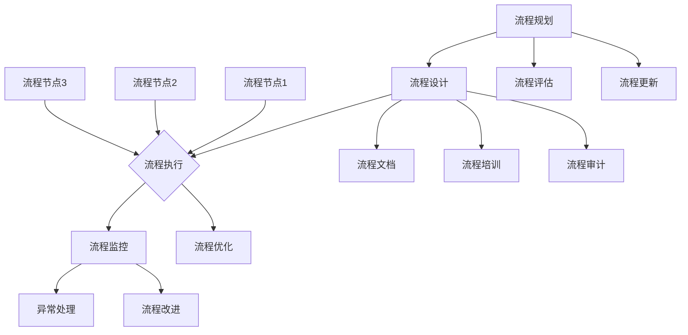

                 

### 关键词 Keywords
- 流程管理
- 业务操作优化
- 敏捷开发
- 业务流程自动化
- 数据分析
- 系统整合
- 云计算
- API集成

<|assistant|>### 摘要 Abstract
本文将深入探讨流程管理的核心概念、技术和方法，以帮助组织简化和优化其业务操作。我们首先介绍了流程管理的定义、重要性及其对业务效率的影响。接着，文章详细阐述了敏捷开发和业务流程自动化的关键原理和实践。随后，我们讨论了数据分析在流程管理中的角色，以及如何通过系统整合和API集成实现流程的透明化和高效化。文章的最后部分，我们探讨了流程管理的未来发展趋势和面临的挑战，并提供了一些实用的工具和资源推荐。通过本文的阅读，读者将能够获得全面而深入的理解，为他们在实际工作中实施流程管理提供有力支持。

## 1. 背景介绍

流程管理，作为现代企业管理的重要组成部分，已经逐渐成为提高组织效率和竞争力的关键手段。随着全球化竞争的加剧和技术的飞速发展，企业面临的环境变得越来越复杂和动态。为了在这种复杂多变的环境中保持竞争优势，企业必须不断寻求创新的解决方案，以提高业务流程的效率和质量。

### 流程管理的定义

流程管理（Process Management）是指对组织内部业务流程的规划、设计、实施、监控和优化的一系列活动的总称。它涉及从流程的起点到终点的整个生命周期，包括流程的识别、分析、设计、实施和改进等环节。通过流程管理，企业可以系统地梳理和优化业务流程，消除冗余环节，提高流程效率，降低成本，提升客户满意度。

### 流程管理的重要性

流程管理在企业管理中的重要性体现在以下几个方面：

1. **提高效率**：通过优化流程，减少不必要的步骤和重复劳动，提高工作效率和响应速度。
2. **降低成本**：通过消除浪费和不必要的开支，降低运营成本，提高资源利用率。
3. **提升质量**：通过标准化流程和监控机制，确保产品和服务的质量，减少缺陷和投诉。
4. **增强灵活性**：通过灵活的流程设计，快速响应市场变化和客户需求，提高企业竞争力。
5. **促进协作**：通过流程管理和跨部门协作，打破部门壁垒，提高团队协作效率。

### 流程管理的发展历程

流程管理的发展历程可以追溯到20世纪末，特别是随着信息技术的迅速发展，流程管理的方法和技术也得到了极大的提升。以下是流程管理发展的几个关键阶段：

1. **传统流程管理**：在20世纪80年代，企业开始意识到流程的重要性，并着手对流程进行初步的管理和优化。
2. **业务流程重构（BPR）**：20世纪90年代，Micheal Hammer和James Champy提出了业务流程重构（Business Process Reengineering，BPR）的理念，主张彻底重新设计和优化业务流程，以实现显著的业务改进。
3. **流程管理软件**：随着计算机技术和信息技术的普及，企业开始使用流程管理软件（如BPMS）来支持流程的自动化和优化。
4. **敏捷流程管理**：进入21世纪，敏捷开发方法在软件开发领域的成功，促使敏捷流程管理（Agile Process Management）成为流程管理的新趋势，强调快速迭代和持续改进。

### 当前流程管理的主要方法和技术

1. **流程自动化**：通过使用自动化工具（如RPA、BPA等），将重复性的手动操作转化为自动化流程，提高效率和质量。
2. **流程优化**：使用数据分析和技术工具对现有流程进行详细分析，找出瓶颈和改进点，提出优化方案。
3. **流程监控**：通过实时监控流程的执行情况，及时发现问题并进行调整，确保流程的顺利进行。
4. **流程标准化**：通过制定标准操作流程（SOP），确保流程的一致性和可重复性，提高管理效率。

总之，流程管理在提升企业效率、降低成本、提高质量和增强竞争力方面发挥着至关重要的作用。随着技术的不断进步，流程管理的方法和技术也在不断创新和发展，为企业提供了更多的机会和挑战。

## 2. 核心概念与联系

### 核心概念原理

流程管理涉及多个核心概念，包括流程、流程节点、流程控制、流程监控等。以下是对这些核心概念的解释及其在流程管理中的重要性。

#### 流程（Process）

流程是组织内完成特定任务或目标的一系列步骤和活动。它可以是一个简单的任务序列，也可以是一个复杂的任务网络。流程是流程管理的基础，通过定义和优化流程，企业可以提高效率和质量。

#### 流程节点（Process Node）

流程节点是流程中的单个操作或任务，可以是手动操作，也可以是自动操作。每个流程节点都需要明确的输入、输出和处理逻辑。流程节点是流程的基本构建块，对流程的执行效率和质量有着直接影响。

#### 流程控制（Process Control）

流程控制是指对流程执行过程的监督和管理，确保流程按照预定计划顺利进行。流程控制包括流程监控、异常处理、流程优化等。通过有效的流程控制，企业可以及时发现和解决问题，确保流程的稳定运行。

#### 流程监控（Process Monitoring）

流程监控是指对流程执行过程的实时监测和记录，以评估流程的性能和效率。流程监控可以提供关键业务指标（KPI）数据，帮助企业分析和改进流程。有效的流程监控是实现流程优化和持续改进的关键。

### 架构的 Mermaid 流程图

为了更好地理解流程管理的核心概念，我们可以使用Mermaid流程图来展示流程、流程节点、流程控制和流程监控之间的关系。以下是流程管理核心概念的Mermaid流程图：



### 流程管理核心概念的联系

流程管理中的各个核心概念紧密相连，共同构成了一个完整的流程管理架构。流程规划是流程管理的起点，通过对业务需求的了解和流程的设计，确保流程的合理性和可行性。流程设计则是对流程的具体定义和划分，明确每个流程节点的操作和逻辑。流程执行是将设计好的流程付诸实践，通过流程控制和流程监控确保流程的顺利进行。流程监控提供了流程执行的数据和反馈，用于流程的优化和改进。流程优化和改进则是持续提升流程效率和质量的关键。

通过上述核心概念及其联系的理解，企业可以更系统地实施流程管理，从而提高业务操作的效率和效果。

### 3. 核心算法原理 & 具体操作步骤

#### 3.1 算法原理概述

流程管理的核心算法主要涉及流程优化、自动化和监控等三个方面。以下是对这些核心算法原理的概述：

1. **流程优化算法**：
   流程优化算法旨在通过分析现有流程的数据和性能指标，找出瓶颈和改进点，提出优化方案。常见的优化算法包括模拟退火算法、遗传算法和蚁群算法等。这些算法通过迭代和优化过程，逐步找到最优或次优的流程配置，以提升流程效率。

2. **流程自动化算法**：
   流程自动化算法主要通过机器人流程自动化（RPA）和业务流程自动化（BPA）实现。RPA利用软件机器人模拟人工操作，自动执行重复性任务；BPA则通过工作流引擎和集成平台，实现复杂业务流程的自动化。常见的自动化算法包括状态机算法、图搜索算法和路径规划算法等。

3. **流程监控算法**：
   流程监控算法主要用于实时监测流程的执行情况，及时发现异常并采取相应措施。常见的监控算法包括实时数据处理算法、机器学习算法和深度学习算法等。这些算法通过对流程数据进行分析和预测，实现流程的智能监控和异常检测。

#### 3.2 算法步骤详解

1. **流程优化算法步骤**：
   - **数据收集**：收集流程执行过程中的各类数据，包括时间、资源消耗、错误率等。
   - **数据预处理**：对收集到的数据进行分析和清洗，确保数据的准确性和完整性。
   - **模型构建**：根据流程的特点和目标，选择合适的优化算法构建优化模型。
   - **迭代优化**：通过算法迭代，逐步优化流程配置，找到最优或次优的流程方案。
   - **验证和调整**：验证优化方案的有效性，并根据实际情况进行调整和改进。

2. **流程自动化算法步骤**：
   - **流程识别**：通过分析业务流程，确定需要自动化的任务和操作。
   - **任务分解**：将复杂任务分解为多个简单步骤，便于自动化实现。
   - **脚本编写**：编写自动化脚本，模拟人工操作，实现任务的自动化执行。
   - **测试和调试**：对自动化脚本进行测试和调试，确保其稳定和高效运行。
   - **部署和监控**：将自动化脚本部署到生产环境中，并对其进行实时监控和优化。

3. **流程监控算法步骤**：
   - **数据采集**：实时采集流程执行过程中的各类数据，包括状态、性能、异常等。
   - **数据处理**：对采集到的数据进行分析和处理，提取关键信息和异常指标。
   - **模型训练**：使用机器学习算法或深度学习算法，构建流程监控模型。
   - **实时监控**：实时监测流程的执行情况，及时发现异常并进行预警。
   - **异常处理**：根据监控结果，采取相应的措施，如自动触发修复流程或通知相关人员。

#### 3.3 算法优缺点

1. **流程优化算法**：
   - **优点**：能够通过数据分析和技术手段，找出流程中的瓶颈和改进点，显著提升流程效率。
   - **缺点**：需要大量数据支持和复杂的算法实现，对技术和资源要求较高。

2. **流程自动化算法**：
   - **优点**：能够大幅减少人工操作，提高工作效率和准确度，降低运营成本。
   - **缺点**：需要大量的前期开发和测试工作，且对系统的稳定性和安全性要求较高。

3. **流程监控算法**：
   - **优点**：能够实时监测流程执行情况，及时发现异常和问题，提高流程的可控性。
   - **缺点**：对算法模型和数据质量要求较高，需要不断进行优化和调整。

#### 3.4 算法应用领域

1. **流程优化算法**：
   - 应用领域：制造业、物流配送、金融服务等。
   - 实际案例：通过优化生产流程，降低生产成本；通过优化物流配送路线，提高运输效率。

2. **流程自动化算法**：
   - 应用领域：客户服务、财务处理、人力资源管理等。
   - 实际案例：通过RPA实现客户订单自动处理，提高订单处理速度；通过BPA实现财务报表自动生成，减少人工错误。

3. **流程监控算法**：
   - 应用领域：生产制造、供应链管理、IT运维等。
   - 实际案例：通过实时监控生产设备的运行状态，提前预警故障；通过监控供应链环节，及时发现物流延迟问题。

总之，核心算法在流程管理中发挥着重要作用，通过合理应用和优化这些算法，企业可以显著提升业务流程的效率和质量。

### 4. 数学模型和公式 & 详细讲解 & 举例说明

在流程管理中，数学模型和公式是理解和优化流程的重要工具。通过数学模型，我们可以定量分析流程的性能，从而提出有效的优化方案。以下我们将详细讲解流程管理中常用的数学模型和公式，并通过具体例子来说明其应用。

#### 4.1 数学模型构建

1. **流程效率模型**：
   流程效率可以通过以下公式进行量化：

   \[
   \text{流程效率} = \frac{\text{实际产出}}{\text{理论产出}} \times 100\%
   \]

   其中，实际产出是指在一定时间内实际完成的任务数量，理论产出是指在理想情况下能够完成的任务数量。通过这个公式，我们可以评估流程的效率，找出瓶颈和改进点。

2. **流程成本模型**：
   流程成本可以通过以下公式进行计算：

   \[
   \text{流程成本} = \text{直接成本} + \text{间接成本}
   \]

   其中，直接成本是指与流程直接相关的成本，如人工成本、材料成本等；间接成本是指与流程间接相关的成本，如管理成本、维护成本等。通过这个公式，我们可以全面了解流程的成本构成，为优化流程提供依据。

3. **流程风险模型**：
   流程风险可以通过以下公式进行评估：

   \[
   \text{流程风险} = \text{风险概率} \times \text{风险影响}
   \]

   其中，风险概率是指风险发生的可能性，风险影响是指风险发生后的影响程度。通过这个公式，我们可以对流程中的潜在风险进行量化评估，从而采取相应的风险管理措施。

#### 4.2 公式推导过程

为了更深入地理解这些数学模型和公式，我们来看一个具体的推导过程。

1. **流程效率模型的推导**：

   流程效率是指流程的实际产出与理论产出的比值。假设我们在一个月内实际完成了1000个任务，而在理想情况下，同样的时间内可以完成1200个任务。那么，流程效率可以计算为：

   \[
   \text{流程效率} = \frac{1000}{1200} \times 100\% = 83.33\%
   \]

   通过这个公式，我们可以看出，流程效率的数值范围在0%到100%之间，越接近100%表示流程越高效。

2. **流程成本模型的推导**：

   假设一个制造流程的直接成本为10000元，间接成本为5000元。那么，流程成本可以计算为：

   \[
   \text{流程成本} = 10000 + 5000 = 15000\text{元}
   \]

   通过这个公式，我们可以清晰地看到流程成本的构成，有助于我们进行成本控制和优化。

3. **流程风险模型的推导**：

   假设一个物流流程的风险概率为20%，风险影响为3天延误。那么，流程风险可以计算为：

   \[
   \text{流程风险} = 20\% \times 3\text{天} = 0.6\text{天}
   \]

   通过这个公式，我们可以量化流程风险的大小，从而采取相应的风险管理措施。

#### 4.3 案例分析与讲解

为了更好地理解这些数学模型和公式的应用，我们来看一个实际案例。

**案例：某制造企业的流程优化**

1. **流程效率分析**：

   该企业在一个月内实际完成了9000个产品，而理论上可以完成10000个产品。根据流程效率模型，我们可以计算出流程效率：

   \[
   \text{流程效率} = \frac{9000}{10000} \times 100\% = 90\%
   \]

   这个结果表明，该企业的流程效率为90%，相对较高，但仍有一些提升空间。

2. **流程成本分析**：

   该企业的直接成本为80000元，间接成本为30000元。根据流程成本模型，我们可以计算出流程成本：

   \[
   \text{流程成本} = 80000 + 30000 = 110000\text{元}
   \]

   这个结果表明，该企业的月度流程成本为110000元。

3. **流程风险分析**：

   该企业的风险概率为15%，风险影响为2天延误。根据流程风险模型，我们可以计算出流程风险：

   \[
   \text{流程风险} = 15\% \times 2\text{天} = 0.3\text{天}
   \]

   这个结果表明，该企业的流程风险为0.3天，风险较低。

通过这个案例，我们可以看到数学模型和公式在流程管理中的应用。通过这些模型和公式，企业可以更科学地评估流程的效率、成本和风险，从而提出有效的优化方案。

### 5. 项目实践：代码实例和详细解释说明

#### 5.1 开发环境搭建

为了演示流程管理中的代码实践，我们将使用Python语言，并结合常用的流程管理库，如`APScheduler`和`Celery`，来构建一个简单的流程管理项目。以下是开发环境的搭建步骤：

1. **安装Python**：
   - 确保你的系统上安装了Python 3.x版本。可以从[Python官网](https://www.python.org/downloads/)下载并安装。

2. **安装依赖库**：
   - 打开终端，执行以下命令安装所需库：
     ```bash
     pip install apscheduler
     pip install celery
     pip install celery-results
     ```

3. **创建项目结构**：
   - 在你的工作目录中创建一个名为`process_management`的项目文件夹，并在其中创建一个名为`main.py`的主程序文件，以及其他必要的子模块和配置文件。

#### 5.2 源代码详细实现

以下是项目的核心代码实现，包括流程任务的定义、调度和监控：

**main.py**：

```python
from apscheduler.schedulers.background import BackgroundScheduler
from celery import Celery
from celery.result import AsyncResult

# 配置Celery
app = Celery('tasks', broker='pyamqp://guest@localhost//')

# 配置定时任务调度
scheduler = BackgroundScheduler()

@app.task
def task1():
    """执行任务1"""
    print("任务1执行中...")
    # 这里可以添加具体的业务逻辑
    return "任务1完成"

@app.task
def task2():
    """执行任务2"""
    print("任务2执行中...")
    # 这里可以添加具体的业务逻辑
    return "任务2完成"

def schedule_tasks():
    """调度任务"""
    scheduler.add_job(task1, 'interval', seconds=10)
    scheduler.add_job(task2, 'cron', day_of_week='mon-fri', hour=10, minute=30)
    scheduler.start()

if __name__ == '__main__':
    schedule_tasks()
```

**tasks.py**：

```python
from celery import shared_task
from celery.utils.log import get_task_logger

logger = get_task_logger(__name__)

@shared_task
def process_data(data):
    """处理数据任务"""
    logger.info(f"处理数据：{data}")
    # 这里可以添加数据处理的业务逻辑
    return f"数据处理完成：{data}"
```

#### 5.3 代码解读与分析

1. **任务定义**：
   - `task1`和`task2`是两个简单的任务，分别通过`@app.task`装饰器定义。`task1`以固定间隔执行，而`task2`每天早上10点30分执行一次。

2. **调度配置**：
   - 使用`BackgroundScheduler`类配置任务调度。`add_job`方法用于添加调度任务，可以指定任务的执行时间和触发条件。

3. **任务执行与监控**：
   - `Celery`提供了异步任务执行的能力，通过`AsyncResult`对象可以监控任务的执行状态和结果。

#### 5.4 运行结果展示

1. **运行`main.py`**：
   - 执行`python main.py`命令，启动流程管理项目。

2. **查看任务执行日志**：
   - 在终端中，你可以看到`task1`和`task2`的执行日志，以及它们的状态和结果。

3. **监控任务状态**：
   - 通过`celery -A tasks status`命令，可以查看任务队列和执行状态。

通过上述代码实例，我们可以看到如何使用Python和相关库实现流程管理任务的定义、调度和监控。实际应用中，可以根据具体需求扩展和优化这些功能，实现更复杂的业务流程管理。

### 6. 实际应用场景

流程管理在实际应用中具有广泛的应用场景，可以帮助不同行业和企业实现业务流程的优化和效率提升。以下是一些典型的实际应用场景：

#### 6.1 制造业

在制造业中，流程管理主要用于生产计划、物料管理、质量控制等环节。通过流程管理，企业可以实现生产线的自动化和优化，减少人为错误，提高生产效率。例如，一家制造公司可以使用流程管理软件来实时监控生产进度，预测生产需求，优化生产计划，从而减少库存成本和缺货风险。

#### 6.2 金融服务

在金融服务领域，流程管理主要用于客户服务、账户管理、交易处理等环节。通过自动化和优化这些流程，银行和金融机构可以提供更快捷、准确和高效的服务。例如，一家银行可以使用RPA技术来自动化客户开户流程，通过机器人处理大量的数据输入和验证工作，提高开户效率。

#### 6.3 物流和供应链

在物流和供应链管理中，流程管理用于运输计划、库存管理、订单处理等环节。通过流程管理，企业可以实现供应链的透明化和高效化，提高物流效率。例如，一家物流公司可以使用流程管理软件来实时跟踪货物状态，优化运输路线，减少运输成本。

#### 6.4 医疗保健

在医疗保健领域，流程管理主要用于预约管理、病历管理、药物配送等环节。通过流程管理，医院和诊所可以提供更便捷和高效的服务。例如，一家医院可以使用流程管理软件来自动化预约系统，通过机器人处理预约请求，减少患者等待时间。

#### 6.5 信息技术

在信息技术领域，流程管理用于软件开发生命周期管理、IT运维、客户支持等环节。通过流程管理，企业可以提高软件开发效率，减少故障和中断。例如，一家科技公司可以使用敏捷开发流程，通过迭代和反馈机制，快速响应市场需求和变化。

#### 6.6 人力资源管理

在人力资源管理中，流程管理用于招聘、培训、绩效考核等环节。通过流程管理，企业可以提高招聘效率，优化培训流程，提高员工绩效。例如，一家公司可以使用流程管理软件来自动化招聘流程，通过机器人筛选简历和面试安排，提高招聘速度和质量。

总之，流程管理在各个行业和企业中都有广泛的应用，通过简化和优化业务操作，企业可以提高效率、降低成本、提升质量，从而增强竞争力。

### 7. 未来应用展望

随着科技的不断进步，流程管理在未来将继续朝着更加智能化、自动化和高效化的方向发展。以下是几个未来流程管理可能的发展趋势：

#### 7.1 人工智能与流程管理的结合

人工智能（AI）技术的发展将深刻影响流程管理。AI算法可以用于流程优化、预测分析、自动化操作等环节，提高流程的智能化水平。例如，机器学习算法可以分析大量历史数据，预测流程中的瓶颈和潜在问题，从而提前采取措施。智能机器人（如Chatbot）也将成为流程管理的重要组成部分，用于自动处理客户服务、订单处理等业务流程。

#### 7.2 物联网与流程管理

物联网（IoT）技术的普及将使得流程管理更加实时和精准。通过传感器和设备联网，企业可以实时监控流程中的各个环节，获取大量实时数据，从而进行精确的流程控制和优化。例如，在制造业中，IoT设备可以实时监控生产设备的状态，提前预警设备故障，减少停机时间。

#### 7.3 区块链在流程管理中的应用

区块链技术具有去中心化、不可篡改和透明性等特点，可以用于流程管理的多个环节，提高流程的安全性和可信度。例如，区块链可以用于供应链管理，确保每个环节的数据真实性和透明性，从而提高供应链的效率。

#### 7.4 云计算与流程管理

云计算提供了弹性、可扩展和低成本的计算资源，使得流程管理变得更加灵活和高效。企业可以通过云计算平台快速部署和管理流程管理应用，无需担心硬件资源限制。此外，云服务提供商通常会提供丰富的流程管理工具和API，方便企业集成和使用。

#### 7.5 5G与流程管理

5G技术的应用将极大地提升数据传输速度和网络稳定性，为流程管理提供更好的基础支持。在需要高速传输大量数据的场景中，如视频监控、远程操作等，5G网络的优势将得到充分发挥，从而提高流程的效率和响应速度。

#### 7.6 多元化和个性化流程管理

随着市场需求的多样化和个性化，流程管理也将朝着多元化和个性化的方向发展。企业可以通过流程定制化工具，根据不同客户的需求和业务场景，设计个性化的流程管理方案，提高客户满意度和竞争力。

总之，未来流程管理将紧密结合新兴技术，实现更加智能化、自动化和高效化的业务操作。企业应积极拥抱这些新技术，结合自身业务特点，探索和应用新的流程管理方法，以保持竞争优势。

### 8. 工具和资源推荐

在流程管理的实践中，选择合适的工具和资源是关键。以下是一些推荐的工具和资源，涵盖了流程设计、自动化、监控和数据分析等方面，帮助您更好地实施流程管理。

#### 8.1 学习资源推荐

1. **《流程管理实战》**：作者：李志华
   - 本书详细介绍了流程管理的基本概念、方法和实践案例，适合初学者和有经验的专业人士。

2. **《流程管理：概念与技术》**：作者：斯蒂芬·罗宾斯
   - 本书从理论和实践两方面全面讲解了流程管理的知识，包括流程设计、优化和实施等。

3. **在线课程：流程管理**：平台：Coursera
   - Coursera上的流程管理课程，涵盖了流程管理的基本原理、方法和工具，适合在线学习和实践。

#### 8.2 开发工具推荐

1. **Apache Airflow**：一个开源的流程调度平台，用于自动化和管理复杂的数据处理工作流。

2. **Celery**：一个分布式任务队列，适用于构建高效的任务分发和执行系统，特别适合需要异步处理任务的应用场景。

3. **JIRA**：一款流行的项目管理工具，可以用于流程监控、任务追踪和团队协作。

4. **Kubernetes**：一个开源的容器编排平台，用于自动化部署、扩展和管理容器化应用程序。

#### 8.3 相关论文推荐

1. **"Business Process Management: A Survey"**：作者：Wieland Kaltenecker等
   - 本文对业务流程管理进行了全面的综述，包括概念、方法和技术。

2. **"Robotic Process Automation: A Theoretical Introduction"**：作者：Sascha Friedrich等
   - 本文介绍了机器人流程自动化的基本概念、原理和应用。

3. **"Using Machine Learning for Predictive Process Monitoring"**：作者：Marco Pecht et al.
   - 本文探讨了如何使用机器学习技术进行预测性流程监控，提高流程管理的智能化水平。

通过这些工具和资源的推荐，您可以在流程管理的实践中获得更全面和深入的支持，从而提升业务操作的效率和质量。

### 9. 总结：未来发展趋势与挑战

流程管理作为现代企业管理的重要组成部分，其发展前景广阔。随着技术的不断进步，流程管理将朝着更加智能化、自动化和高效化的方向迈进。以下是对未来流程管理发展趋势与挑战的总结。

#### 9.1 发展趋势

1. **智能化与自动化**：人工智能、机器学习、RPA等技术的融合，将使流程管理更加智能化和自动化，提高业务操作的效率和准确性。

2. **数据驱动**：数据分析将成为流程管理的重要驱动力，通过实时数据分析和预测，企业可以更加精准地监控和优化业务流程。

3. **云原生与分布式架构**：随着云计算和容器技术的普及，流程管理将逐渐走向云原生和分布式架构，提供更灵活、可扩展和成本效益高的解决方案。

4. **数字化转型**：数字化转型将继续深化，流程管理将与其他数字化工具和平台紧密结合，实现端到端的业务流程自动化和优化。

5. **多元化与个性化**：随着市场需求的变化，流程管理将更加注重个性化定制，满足不同行业和企业的特定需求。

#### 9.2 挑战

1. **技术融合的复杂性**：新兴技术的融合和应用将带来技术复杂性的增加，企业需要具备相应的技术能力和人才储备。

2. **数据隐私与安全**：随着数据处理和分析的深入，数据隐私和安全问题将更加突出，企业需要建立严格的数据保护机制。

3. **跨部门协作**：流程管理涉及多个部门和角色，实现跨部门协作和流程优化将是企业面临的挑战。

4. **持续优化与创新**：流程管理需要持续优化和创新，以应对不断变化的市场环境和需求，这对企业的敏捷性和创新能力提出了较高要求。

#### 9.3 研究展望

未来，流程管理的研究应关注以下几个方面：

1. **智能化流程设计**：开发更加智能的流程设计工具和平台，支持自动化流程优化和调整。

2. **多模态数据分析**：结合不同类型的数据源，开发多模态数据分析方法，提高流程监控和优化的准确性。

3. **跨领域流程集成**：研究跨行业和跨领域的流程集成方法，实现更广泛的业务流程优化。

4. **动态流程适应性**：探索动态流程适应性机制，使流程管理系统能够迅速适应新的业务场景和需求。

总之，未来流程管理将在技术创新和实际应用中不断演进，企业应积极应对挑战，抓住机遇，实现业务流程的持续优化和高效管理。

### 附录：常见问题与解答

在流程管理实践中，企业可能会遇到各种问题。以下列出了一些常见问题及其解答，以帮助读者更好地理解和应用流程管理。

#### 问题1：流程优化后如何确保执行效果？

**解答**：为确保流程优化后的执行效果，企业可以采取以下措施：
1. **制定详细的执行计划**：在优化流程后，制定详细的执行计划，明确每个环节的责任人和时间节点。
2. **培训和沟通**：对相关人员进行培训和沟通，确保他们理解新的流程和操作规范。
3. **持续监控**：通过流程监控工具，实时跟踪流程的执行情况，及时发现和解决潜在问题。
4. **绩效评估**：定期进行绩效评估，评估流程优化效果，并根据评估结果进行相应的调整和改进。

#### 问题2：如何确保流程数据的安全性和隐私性？

**解答**：为了确保流程数据的安全性和隐私性，企业可以采取以下措施：
1. **数据加密**：对敏感数据进行加密处理，确保数据在传输和存储过程中的安全性。
2. **访问控制**：实施严格的访问控制策略，确保只有授权人员可以访问敏感数据。
3. **备份与恢复**：定期备份数据，并建立有效的数据恢复机制，以应对可能的灾难情况。
4. **安全审计**：定期进行安全审计，评估流程数据的安全性，并采取必要的防护措施。

#### 问题3：如何平衡流程优化与创新的关系？

**解答**：平衡流程优化与创新的关系，企业可以采取以下策略：
1. **灵活的流程设计**：在设计流程时，预留一定的灵活性，以应对未来的变化和需求。
2. **持续改进文化**：建立持续改进的文化，鼓励员工不断提出创新的想法和解决方案。
3. **迭代开发**：采用迭代开发的方法，逐步实施流程优化和创新，以减少风险和成本。
4. **风险评估**：在实施创新方案前，进行充分的风险评估，确保创新方案不会对现有流程造成负面影响。

#### 问题4：如何应对流程中的瓶颈和难题？

**解答**：应对流程中的瓶颈和难题，企业可以采取以下策略：
1. **深入分析**：对瓶颈和难题进行深入分析，找出根本原因。
2. **资源调配**：合理调配资源，确保瓶颈环节得到足够的支持。
3. **流程重构**：如果现有流程确实无法解决瓶颈问题，可以考虑对流程进行重构，设计更优的流程方案。
4. **外部合作**：与外部合作伙伴合作，引入外部资源和技术，共同解决流程中的难题。

通过以上解答，企业可以更好地应对流程管理中常见的问题，从而实现流程的持续优化和高效管理。

