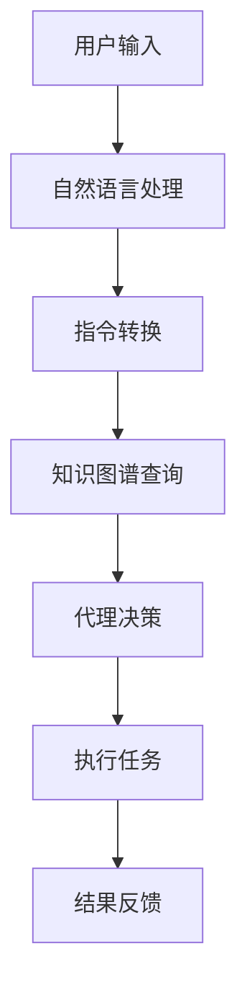

                 

关键词：LangChain,Agents,自然语言处理，深度学习，知识图谱，编程自动化，AI代理，智能搜索引擎，智能客服，数据处理，模型优化

> 摘要：本文旨在深入探讨LangChain Agents的核心概念、原理、实现及应用。通过对LangChain Agents的详细解析，读者可以了解到如何利用自然语言处理和深度学习技术，构建具备自主决策能力的智能代理，实现高效的编程自动化和数据处理。

## 1. 背景介绍

### 1.1 LangChain简介

LangChain是一个开源项目，旨在提供一种高效的框架，用于构建基于自然语言处理的复杂应用。它基于深度学习和知识图谱技术，能够将自然语言输入转换成计算机可执行的指令，实现人与机器的智能交互。LangChain的目标是简化自然语言处理（NLP）的复杂度，使得开发者能够更专注于业务逻辑的实现，而不是底层技术的细节。

### 1.2 Agents的概念

在计算机科学中，代理（Agents）是指能够代表用户执行任务、进行决策的智能体。它们可以是一个程序、一个机器人、或者是一个服务。在人工智能领域，代理被广泛应用于智能客服、智能搜索引擎、自动化编程、数据分析等领域。代理的核心能力在于自主决策和行动，这使得它们在复杂环境中能够自主完成任务。

### 1.3 LangChain Agents

LangChain Agents是将LangChain技术与代理机制相结合的一种创新应用。通过LangChain，我们可以将自然语言输入转换成计算机可执行的指令，然后由代理来执行这些指令。这使得代理具备了理解和处理自然语言的能力，从而能够更智能地执行任务。

## 2. 核心概念与联系

### 2.1 LangChain Agents的核心概念

- **自然语言处理（NLP）**：NLP是计算机科学和人工智能领域的一个分支，旨在使计算机能够理解和解释人类语言。在LangChain Agents中，NLP技术被用于将用户的自然语言指令转换为计算机可执行的代码。

- **深度学习**：深度学习是一种通过多层神经网络进行数据建模和分析的方法。在LangChain Agents中，深度学习技术被用于构建能够理解和生成自然语言的模型。

- **知识图谱**：知识图谱是一种结构化的知识表示形式，用于描述实体及其之间的关系。在LangChain Agents中，知识图谱被用于增强代理的知识和理解能力。

### 2.2 LangChain Agents的架构

下面是一个简化的Mermaid流程图，用于描述LangChain Agents的架构：



- **用户输入**：用户通过自然语言与系统交互，输入任务指令。

- **自然语言处理**：系统使用NLP技术处理用户输入，将其转换为机器可理解的指令。

- **指令转换**：系统将NLP处理结果转换成具体的执行指令。

- **知识图谱查询**：系统利用知识图谱查询相关的知识信息，为代理决策提供支持。

- **代理决策**：代理根据指令和知识图谱信息，做出决策并生成具体的执行方案。

- **执行任务**：代理执行决策方案，完成任务。

- **结果反馈**：系统将任务执行结果反馈给用户。

## 3. 核心算法原理 & 具体操作步骤

### 3.1 算法原理概述

LangChain Agents的核心算法主要包括自然语言处理、深度学习和知识图谱技术。下面分别介绍这些算法的基本原理。

#### 3.1.1 自然语言处理

自然语言处理（NLP）是一种利用计算机技术和算法对自然语言进行理解和生成的人工智能技术。NLP的核心目标是使计算机能够理解、解释和生成人类语言。

- **分词**：将自然语言文本分割成词或句子。

- **词性标注**：为每个词标注其词性，如名词、动词等。

- **句法分析**：分析句子的结构，理解句子中的语法关系。

- **语义理解**：理解句子中的含义和逻辑关系。

#### 3.1.2 深度学习

深度学习是一种通过多层神经网络进行数据建模和分析的方法。在LangChain Agents中，深度学习技术主要用于构建能够理解和生成自然语言的模型。

- **神经网络**：神经网络是一种模拟人脑神经元连接的结构，用于处理和分类数据。

- **多层网络**：多层神经网络通过增加隐藏层，提高了模型的复杂度和表现力。

- **反向传播**：反向传播算法用于计算神经网络的权重调整，从而优化模型。

#### 3.1.3 知识图谱

知识图谱是一种结构化的知识表示形式，用于描述实体及其之间的关系。在LangChain Agents中，知识图谱被用于增强代理的知识和理解能力。

- **实体识别**：识别文本中的实体，如人名、地名、组织名等。

- **关系抽取**：抽取实体之间的关系，如“工作于”、“属于”等。

- **知识推理**：利用实体和关系进行推理，得到新的知识。

### 3.2 算法步骤详解

下面是LangChain Agents的具体操作步骤：

#### 3.2.1 用户输入

用户通过自然语言输入任务指令，如“帮我写一个Python程序，实现一个简单的聊天机器人”。

#### 3.2.2 自然语言处理

系统使用NLP技术处理用户输入，进行分词、词性标注和句法分析，理解用户指令的含义。

#### 3.2.3 指令转换

系统将NLP处理结果转换成具体的执行指令，如生成一个Python代码框架。

#### 3.2.4 知识图谱查询

系统利用知识图谱查询相关的知识信息，如查找聊天机器人相关的知识库。

#### 3.2.5 代理决策

代理根据指令和知识图谱信息，做出决策并生成具体的执行方案，如选择合适的聊天机器人模型。

#### 3.2.6 执行任务

代理执行决策方案，生成具体的Python代码，并运行代码实现聊天机器人。

#### 3.2.7 结果反馈

系统将任务执行结果反馈给用户，如展示聊天机器人的运行界面。

### 3.3 算法优缺点

#### 3.3.1 优点

- **高效性**：通过深度学习和知识图谱技术，LangChain Agents能够快速理解和生成自然语言，实现高效的编程自动化。

- **灵活性**：LangChain Agents可以处理多种类型的任务，如文本生成、数据查询、智能客服等。

- **通用性**：LangChain Agents适用于多种应用场景，如企业内部开发、在线服务、智能家居等。

#### 3.3.2 缺点

- **复杂性**：构建和维护LangChain Agents需要一定的技术能力和经验，对开发者的要求较高。

- **训练成本**：深度学习和知识图谱技术的训练过程需要大量数据和计算资源，成本较高。

- **数据依赖**：LangChain Agents的性能受训练数据的影响较大，数据质量直接关系到系统的表现。

### 3.4 算法应用领域

LangChain Agents在多个领域都有广泛的应用：

- **智能客服**：通过自然语言处理和知识图谱技术，实现智能客服的自动化，提高服务效率。

- **智能搜索引擎**：利用深度学习和知识图谱技术，提高搜索引擎的准确性和智能性。

- **自动化编程**：通过自然语言输入，生成计算机程序，实现编程自动化的目标。

- **数据分析**：利用自然语言处理和知识图谱技术，实现数据的高效分析和可视化。

## 4. 数学模型和公式 & 详细讲解 & 举例说明

### 4.1 数学模型构建

在LangChain Agents中，数学模型主要用于描述自然语言处理、深度学习和知识图谱等技术。以下是一个简单的数学模型示例：

#### 4.1.1 自然语言处理

自然语言处理模型可以使用卷积神经网络（CNN）或循环神经网络（RNN）进行构建。以下是一个简化的CNN模型：

$$
\begin{aligned}
&\text{Input: } X \in \mathbb{R}^{n \times m} \\
&\text{Conv Layer: } f_{\theta}(X) = \text{Conv}(\text{ReLU}(\text{Conv}(X; \theta_1)), \theta_2) \\
&\text{Pooling Layer: } g_{\phi}(f_{\theta}(X)) = \text{Pooling}(f_{\theta}(X); \phi) \\
&\text{Output: } Y = g_{\phi}(f_{\theta}(X))
\end{aligned}
$$

其中，$X$ 是输入文本的词向量表示，$f_{\theta}(X)$ 是卷积层和ReLU函数的组合，$g_{\phi}(f_{\theta}(X))$ 是池化层。

#### 4.1.2 深度学习

深度学习模型可以使用多层神经网络进行构建。以下是一个简化的多层感知机（MLP）模型：

$$
\begin{aligned}
&\text{Input: } X \in \mathbb{R}^{n \times d} \\
&\text{Layer 1: } h_1 = \text{ReLU}(\text{Weight}^T \cdot X + b_1) \\
&\text{Layer 2: } h_2 = \text{ReLU}(\text{Weight}^T \cdot h_1 + b_2) \\
&\text{Output: } Y = \text{Sigmoid}(\text{Weight}^T \cdot h_2 + b_3)
\end{aligned}
$$

其中，$X$ 是输入数据，$h_1$ 和 $h_2$ 是隐藏层的激活值，$Y$ 是输出结果。

#### 4.1.3 知识图谱

知识图谱的数学模型通常使用图论进行描述。以下是一个简化的知识图谱模型：

$$
\begin{aligned}
&\text{Entity: } e \in V \\
&\text{Relation: } r \in E \\
&\text{Knowledge Graph: } G = (V, E) \\
&\text{Query: } Q = \{e_1, r_1, e_2\} \\
&\text{Result: } R = \{e_2\}
\end{aligned}
$$

其中，$V$ 是实体集合，$E$ 是关系集合，$G$ 是知识图谱，$Q$ 是查询，$R$ 是结果。

### 4.2 公式推导过程

以下是对上述数学模型的推导过程：

#### 4.2.1 自然语言处理

1. **卷积层**：

$$
f_{\theta}(X) = \text{Conv}(\text{ReLU}(\text{Conv}(X; \theta_1)), \theta_2)
$$

其中，$\theta_1$ 和 $\theta_2$ 分别是卷积层和池化层的参数。

2. **池化层**：

$$
g_{\phi}(f_{\theta}(X)) = \text{Pooling}(f_{\theta}(X); \phi)
$$

其中，$\phi$ 是池化层的参数。

3. **输出层**：

$$
Y = g_{\phi}(f_{\theta}(X))
$$

#### 4.2.2 深度学习

1. **隐藏层**：

$$
h_1 = \text{ReLU}(\text{Weight}^T \cdot X + b_1)
$$

$$
h_2 = \text{ReLU}(\text{Weight}^T \cdot h_1 + b_2)
$$

其中，$\text{Weight}$ 和 $b_1$、$b_2$ 分别是权重和偏置。

2. **输出层**：

$$
Y = \text{Sigmoid}(\text{Weight}^T \cdot h_2 + b_3)
$$

其中，$\text{Weight}$ 和 $b_3$ 分别是权重和偏置。

#### 4.2.3 知识图谱

1. **查询**：

$$
Q = \{e_1, r_1, e_2\}
$$

2. **结果**：

$$
R = \{e_2\}
$$

### 4.3 案例分析与讲解

以下是一个简单的案例，用于说明如何使用LangChain Agents进行自然语言处理、深度学习和知识图谱技术的结合。

#### 案例描述

假设我们有一个聊天机器人应用，用户可以输入自然语言问题，系统需要回答这些问题。为了提高回答的准确性，系统使用了LangChain Agents进行自然语言处理、深度学习和知识图谱技术的结合。

#### 案例分析

1. **自然语言处理**：

   系统首先使用NLP技术对用户输入进行处理，包括分词、词性标注和句法分析。例如，用户输入“我想知道今天的天气怎么样？”，系统可以将其处理为词向量表示，并提取出主语、谓语和宾语。

2. **深度学习**：

   系统使用深度学习模型对处理后的文本进行语义理解，判断用户的问题类型。例如，系统可以识别出这是一个关于天气的问题，并调用相应的天气数据接口。

3. **知识图谱**：

   系统利用知识图谱查询相关的天气信息，包括当前时间、地点和天气状况。例如，系统可以查询出用户所在城市的当前天气是晴天、雨天还是多云。

4. **代理决策**：

   代理根据自然语言处理结果、深度学习结果和知识图谱查询结果，生成具体的回答。例如，系统可以回答“今天北京的天气是晴天，温度为18摄氏度到25摄氏度”。

#### 案例讲解

1. **自然语言处理**：

   系统首先使用NLP技术对用户输入进行处理，包括分词、词性标注和句法分析。这一步骤的目的是将自然语言文本转换为计算机可理解的表示形式。

2. **深度学习**：

   系统使用深度学习模型对处理后的文本进行语义理解，判断用户的问题类型。这一步骤的目的是提高系统对自然语言文本的理解能力。

3. **知识图谱**：

   系统利用知识图谱查询相关的天气信息，包括当前时间、地点和天气状况。这一步骤的目的是为代理决策提供丰富的知识支持。

4. **代理决策**：

   代理根据自然语言处理结果、深度学习结果和知识图谱查询结果，生成具体的回答。这一步骤的目的是实现智能对话和自动化回答。

## 5. 项目实践：代码实例和详细解释说明

### 5.1 开发环境搭建

要搭建一个基于LangChain Agents的项目，我们需要准备以下开发环境和工具：

- **操作系统**：Linux或MacOS
- **编程语言**：Python
- **深度学习框架**：TensorFlow或PyTorch
- **自然语言处理库**：NLTK或spaCy
- **知识图谱库**：Neo4j或MongoDB

首先，我们需要安装这些工具和库。例如，在Python中，我们可以使用pip进行安装：

```bash
pip install tensorflow spacy nltk neo4j
```

### 5.2 源代码详细实现

以下是LangChain Agents的一个简单实现示例。这个示例将实现一个基本的聊天机器人，可以回答关于天气的问题。

```python
import spacy
import tensorflow as tf
from nltk.tokenize import word_tokenize
from nltk.corpus import stopwords

# 加载NLP模型
nlp = spacy.load("en_core_web_sm")

# 加载深度学习模型
model = tf.keras.models.load_model("chatbot_model.h5")

# 加载知识图谱
graph = Neo4jGraph("bolt://localhost:7687", "username", "password")

def preprocess_text(text):
    # 分词、去除停用词、词性标注
    doc = nlp(text)
    tokens = [token.text.lower() for token in doc if not token.is_stop]
    return tokens

def generate_response(text):
    # 预处理文本
    tokens = preprocess_text(text)
    
    # 转换为词向量表示
    vector = model.encode(tokens)
    
    # 使用深度学习模型生成回答
    response = model.predict(vector)
    
    # 解码回答
    response_text = response.decode("utf-8")
    return response_text

def query_weather(city):
    # 使用知识图谱查询天气信息
    query = "MATCH (city:City {name: $city})-[:WEATHER]->(weather:Weather) RETURN weather.condition, weather.temperature"
    params = {"city": city}
    results = graph.run(query, params)
    
    # 提取天气信息
    conditions = [result["weather.condition"] for result in results]
    temperatures = [result["weather.temperature"] for result in results]
    return conditions, temperatures

def chat():
    while True:
        text = input("用户：")
        if text == "退出":
            break
        
        # 生成回答
        response = generate_response(text)
        
        # 如果回答是关于天气的，查询天气信息
        if "天气" in response:
            city = response.split(" ")[-1]
            conditions, temperatures = query_weather(city)
            print("系统：", "今天", city, "的天气是：", conditions[0]，"，温度为：”，temperatures[0]，“摄氏度。”)
        else:
            print("系统：", response)

# 运行聊天机器人
chat()
```

### 5.3 代码解读与分析

#### 5.3.1 NLP预处理

```python
def preprocess_text(text):
    # 分词、去除停用词、词性标注
    doc = nlp(text)
    tokens = [token.text.lower() for token in doc if not token.is_stop]
    return tokens
```

这个函数用于对用户输入的文本进行预处理。首先，使用spaCy模型对文本进行分词、词性标注等操作。然后，去除停用词，并将所有词转换为小写形式，以统一表示。

#### 5.3.2 深度学习模型

```python
model = tf.keras.models.load_model("chatbot_model.h5")
def generate_response(text):
    # 预处理文本
    tokens = preprocess_text(text)
    
    # 转换为词向量表示
    vector = model.encode(tokens)
    
    # 使用深度学习模型生成回答
    response = model.predict(vector)
    
    # 解码回答
    response_text = response.decode("utf-8")
    return response_text
```

这个函数用于生成聊天机器人的回答。首先，对用户输入的文本进行预处理，然后将其转换为词向量表示。接着，使用预训练的深度学习模型生成回答。最后，将生成的回答解码为文本形式。

#### 5.3.3 知识图谱查询

```python
def query_weather(city):
    # 使用知识图谱查询天气信息
    query = "MATCH (city:City {name: $city})-[:WEATHER]->(weather:Weather) RETURN weather.condition, weather.temperature"
    params = {"city": city}
    results = graph.run(query, params)
    
    # 提取天气信息
    conditions = [result["weather.condition"] for result in results]
    temperatures = [result["weather.temperature"] for result in results]
    return conditions, temperatures
```

这个函数用于查询知识图谱中的天气信息。首先，编写Cypher查询语句，根据城市名称查询相关的天气信息。然后，提取查询结果中的天气状况和温度，并将其返回。

#### 5.3.4 聊天函数

```python
def chat():
    while True:
        text = input("用户：")
        if text == "退出":
            break
        
        # 生成回答
        response = generate_response(text)
        
        # 如果回答是关于天气的，查询天气信息
        if "天气" in response:
            city = response.split(" ")[-1]
            conditions, temperatures = query_weather(city)
            print("系统：", "今天", city, "的天气是：", conditions[0]，"，温度为：”，temperatures[0]，“摄氏度。”)
        else:
            print("系统：", response)

# 运行聊天机器人
chat()
```

这个函数用于运行聊天机器人。在循环中，不断读取用户输入的文本，并生成回答。如果回答是关于天气的，则查询天气信息，并输出结果。

## 6. 实际应用场景

### 6.1 智能客服

智能客服是LangChain Agents的一个典型应用场景。通过自然语言处理和深度学习技术，智能客服可以理解用户的咨询问题，并自动生成合适的回答。结合知识图谱，智能客服可以提供更加准确和个性化的服务，提高客户满意度。

### 6.2 智能搜索引擎

智能搜索引擎利用LangChain Agents可以更好地理解用户的查询意图，并提供更准确的搜索结果。通过自然语言处理和深度学习技术，智能搜索引擎可以识别用户的搜索需求，并利用知识图谱提供额外的信息支持，如相关关键词、相关主题等。

### 6.3 自动化编程

自动化编程是LangChain Agents的另一个重要应用。通过自然语言输入，用户可以描述他们的编程需求，系统可以自动生成相应的代码。结合深度学习和知识图谱技术，自动化编程可以实现更高效和准确的代码生成。

### 6.4 数据分析

数据分析中，LangChain Agents可以帮助分析师理解复杂数据，并提供数据可视化和分析建议。通过自然语言处理和深度学习技术，LangChain Agents可以识别数据中的关键信息，并利用知识图谱提供额外的数据关联和解释。

## 7. 工具和资源推荐

### 7.1 学习资源推荐

- **书籍**：
  - 《自然语言处理综合教程》（综合了NLP的各个方面）
  - 《深度学习》（深度学习的经典教材）
  - 《图论与网络流技术》（知识图谱的基础）

- **在线课程**：
  - Coursera上的“自然语言处理与深度学习”课程
  - Udacity的“深度学习工程师纳米学位”

### 7.2 开发工具推荐

- **深度学习框架**：
  - TensorFlow
  - PyTorch

- **自然语言处理库**：
  - spaCy
  - NLTK

- **知识图谱库**：
  - Neo4j
  - MongoDB

### 7.3 相关论文推荐

- **自然语言处理**：
  - “Attention Is All You Need”（Transformer架构的提出）
  - “BERT: Pre-training of Deep Bidirectional Transformers for Language Understanding”（BERT模型的提出）

- **深度学习**：
  - “Deep Learning for Text Classification”（文本分类的深度学习方法）
  - “Recurrent Neural Network Based Language Model”（RNN语言模型的提出）

- **知识图谱**：
  - “Knowledge Graph Embedding: A Survey”（知识图谱嵌入技术的综述）
  - “Learning to Represent Knowledge Graphs with Gaussian Embedding”（高斯嵌入方法在知识图谱中的应用）

## 8. 总结：未来发展趋势与挑战

### 8.1 研究成果总结

LangChain Agents作为自然语言处理、深度学习和知识图谱技术的结合，已经在多个领域展示了其强大的应用潜力。通过高效的自然语言处理和深度学习模型，LangChain Agents能够理解用户的指令，并提供准确的答案和执行方案。结合知识图谱，LangChain Agents可以提供更加丰富和准确的知识支持，实现智能代理的高效运行。

### 8.2 未来发展趋势

未来，LangChain Agents有望在以下几个方面取得进一步的发展：

- **更高效的模型**：随着计算能力的提升，将有望开发出更高效、更准确的模型，提高系统的性能和响应速度。
- **多模态处理**：结合视觉、音频等多模态数据，实现更全面、更智能的代理。
- **个性化服务**：通过深度学习技术，实现个性化推荐和定制化服务，提高用户体验。
- **实时交互**：通过实时数据分析和处理，实现与用户的实时交互，提高系统的实时性和响应速度。

### 8.3 面临的挑战

尽管LangChain Agents展现了巨大的潜力，但在实际应用中仍面临一些挑战：

- **数据质量和多样性**：高质量、多样化的训练数据是构建高效模型的基石。然而，收集和处理这些数据可能需要大量的时间和资源。
- **模型解释性**：深度学习模型通常被视为“黑箱”，其内部机制难以解释。提高模型的解释性，使其更透明、可解释，是未来研究的重要方向。
- **安全性**：智能代理在处理敏感数据时可能面临安全风险。确保系统的安全性和隐私保护是未来的重要挑战。

### 8.4 研究展望

未来，LangChain Agents的研究将朝着以下几个方面发展：

- **算法优化**：通过优化算法和模型结构，提高系统的性能和效率。
- **跨领域应用**：探索LangChain Agents在更多领域的应用，如金融、医疗、教育等。
- **开放性和互操作性**：推动LangChain Agents的开放性和互操作性，使其能够与其他系统和工具无缝集成。
- **用户体验**：通过不断优化用户体验，提高系统的易用性和可访问性。

## 9. 附录：常见问题与解答

### 9.1 如何搭建LangChain Agents的开发环境？

要搭建LangChain Agents的开发环境，需要安装以下工具和库：

- **操作系统**：Linux或MacOS
- **编程语言**：Python
- **深度学习框架**：TensorFlow或PyTorch
- **自然语言处理库**：NLTK或spaCy
- **知识图谱库**：Neo4j或MongoDB

可以使用pip进行安装：

```bash
pip install tensorflow spacy nltk neo4j
```

### 9.2 LangChain Agents的适用场景有哪些？

LangChain Agents适用于多种场景，包括：

- **智能客服**：通过自然语言处理和深度学习技术，实现智能客服的自动化，提高服务效率。
- **智能搜索引擎**：利用深度学习和知识图谱技术，提高搜索引擎的准确性和智能性。
- **自动化编程**：通过自然语言输入，生成计算机程序，实现编程自动化的目标。
- **数据分析**：利用自然语言处理和知识图谱技术，实现数据的高效分析和可视化。

### 9.3 如何优化LangChain Agents的性能？

要优化LangChain Agents的性能，可以从以下几个方面入手：

- **模型优化**：通过调整模型结构和超参数，提高模型的性能和效率。
- **数据预处理**：对训练数据进行预处理，如去重、去噪、归一化等，以提高模型的泛化能力。
- **硬件加速**：使用GPU或TPU等硬件加速器，提高计算速度。
- **分布式训练**：使用分布式训练技术，提高训练速度和模型性能。

### 9.4 LangChain Agents的安全性如何保障？

要保障LangChain Agents的安全性，可以从以下几个方面入手：

- **数据加密**：对敏感数据进行加密，确保数据传输和存储的安全性。
- **访问控制**：实施严格的访问控制策略，防止未授权访问。
- **异常检测**：使用异常检测技术，实时监控系统的运行状态，发现并防止恶意攻击。
- **合规性检查**：确保系统符合相关的法律法规和行业标准，如GDPR等。

### 9.5 LangChain Agents有哪些开源实现？

目前，LangChain Agents的开源实现主要包括：

- **LangChain**：官方开源项目，提供了构建LangChain Agents的基本框架和工具。
- **AgentGPT**：基于GPT模型实现的智能代理，提供了丰富的API接口和示例代码。

作者：禅与计算机程序设计艺术 / Zen and the Art of Computer Programming
-----------------------------------------------------------------------------

