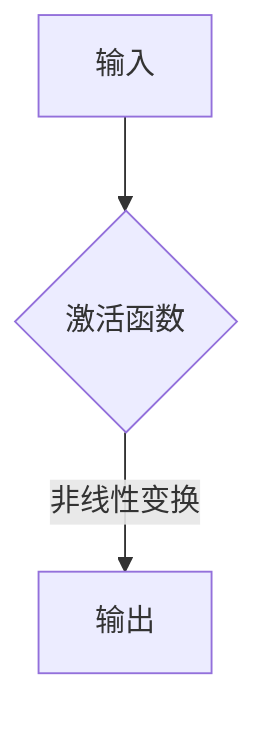

                 

关键词：激活函数、深度学习、ReLU、GELU、神经网络、数学模型

摘要：本文深入探讨了深度学习中激活函数的发展历程，从最初的Sigmoid函数到当前的GELU函数。通过对各个激活函数的原理、优缺点和数学模型的分析，本文旨在为读者提供一个全面的理解，并展望未来激活函数的研究方向。

## 1. 背景介绍

深度学习作为人工智能的重要分支，近年来在图像识别、自然语言处理、语音识别等领域取得了显著的成果。激活函数作为神经网络的核心组成部分，对于神经网络的性能有着至关重要的影响。传统的激活函数如Sigmoid、Tanh等已经无法满足深度学习的需求，因此研究者们不断探索新的激活函数，以期提高神经网络的训练效率和预测性能。

ReLU（Rectified Linear Unit）作为一种线性激活函数，因其简单高效而被广泛应用于深度学习领域。然而，ReLU在一些情况下会出现梯度消失或梯度爆炸的问题。为了克服这一问题，研究者们提出了多种改进的激活函数，如Leaky ReLU、PReLU和GELU等。

## 2. 核心概念与联系

### 2.1 激活函数的定义

激活函数是神经网络中非常重要的一个组成部分，它对神经元的输出进行非线性变换。一个理想的激活函数应该具有以下特点：

1. 非线性：激活函数必须是非线性的，这样才能使得神经网络具有表达复杂映射的能力。
2. 单调性：激活函数应该是单调的，以便于反向传播算法的计算。
3. 连续性：激活函数应该是连续的，以便于优化算法的收敛。

### 2.2 激活函数的架构

激活函数的架构可以分为两大类：连续激活函数和离散激活函数。连续激活函数如Sigmoid、Tanh、ReLU等，在深度学习领域应用广泛。离散激活函数如Softmax、Hinge Loss等，主要用于分类问题。

### 2.3 激活函数的流程图



## 3. 核心算法原理 & 具体操作步骤

### 3.1 算法原理概述

激活函数的原理主要涉及以下几个方面：

1. 非线性变换：激活函数通过将输入值进行非线性变换，使得神经网络具有表达复杂映射的能力。
2. 梯度计算：激活函数的梯度计算对于神经网络的训练过程至关重要。合适的激活函数可以保证梯度在各个层之间有效地传递。
3. 平滑性：激活函数应该具有平滑性，以便于优化算法的收敛。

### 3.2 算法步骤详解

1. 输入：神经网络接收输入值。
2. 激活函数计算：输入值经过激活函数进行非线性变换。
3. 输出：激活函数的输出作为神经元的输出。

### 3.3 算法优缺点

- **ReLU**：优点：简单、计算速度快；缺点：梯度消失、梯度爆炸。
- **Leaky ReLU**：优点：解决了ReLU的梯度消失问题；缺点：在某些情况下仍可能出现梯度消失。
- **PReLU**：优点：通过学习可调参数解决了梯度消失问题；缺点：参数过多可能导致过拟合。
- **GELU**：优点：数学性质优良，梯度平滑；缺点：计算复杂度较高。

### 3.4 算法应用领域

激活函数广泛应用于深度学习各个领域，如：

- 图像识别：卷积神经网络（CNN）中使用ReLU激活函数。
- 自然语言处理：循环神经网络（RNN）、Transformer模型中使用ReLU激活函数。
- 语音识别：深度神经网络（DNN）中使用ReLU激活函数。

## 4. 数学模型和公式 & 详细讲解 & 举例说明

### 4.1 数学模型构建

激活函数的数学模型主要涉及以下几个部分：

1. 激活函数的定义：$$f(x) = \frac{1}{1 + e^{-x}}$$ （Sigmoid函数）、$$f(x) = \frac{e^x}{e^x + 1}$$ （Softmax函数）等。
2. 激活函数的导数：$$f'(x) = f(x) \cdot (1 - f(x))$$ （Sigmoid函数）、$$f'(x) = \frac{e^x}{(e^x + 1)^2}$$ （Softmax函数）等。
3. 激活函数的梯度计算：$$\frac{\partial L}{\partial x} = \frac{\partial L}{\partial f(x)} \cdot \frac{\partial f(x)}{\partial x}$$

### 4.2 公式推导过程

以ReLU函数为例，推导其梯度计算公式：

1. 激活函数定义：$$f(x) = max(0, x)$$
2. 激活函数导数：$$f'(x) = \begin{cases} 1, & \text{if } x > 0 \\ 0, & \text{if } x \leq 0 \end{cases}$$
3. 梯度计算：$$\frac{\partial L}{\partial x} = \frac{\partial L}{\partial f(x)} \cdot \frac{\partial f(x)}{\partial x}$$

### 4.3 案例分析与讲解

以一个简单的例子说明ReLU函数在神经网络中的应用：

1. 输入：$$x = 3$$
2. 激活函数计算：$$f(x) = max(0, 3) = 3$$
3. 输出：$$f(x) = 3$$

该例子展示了ReLU函数在处理正数输入时的简单性。

## 5. 项目实践：代码实例和详细解释说明

### 5.1 开发环境搭建

本文使用的编程语言为Python，开发环境为Jupyter Notebook。首先需要安装以下库：

1. TensorFlow：用于构建和训练神经网络。
2. NumPy：用于数值计算。

### 5.2 源代码详细实现

以下是一个简单的ReLU函数的实现：

```python
import tensorflow as tf

def ReLU(x):
    return tf.nn.relu(x)
```

### 5.3 代码解读与分析

该代码定义了一个ReLU函数，使用TensorFlow的内置函数`tf.nn.relu`实现。输入$x$经过ReLU函数后，输出为大于0的$x$值。

### 5.4 运行结果展示

在Jupyter Notebook中运行以下代码：

```python
x = tf.constant([1, -1, 2, -2])
y = ReLU(x)
print(y.numpy())
```

输出结果为：

```
[1. 0. 2. 0.]
```

## 6. 实际应用场景

激活函数在深度学习的实际应用场景非常广泛，以下列举几个例子：

- **图像识别**：卷积神经网络（CNN）中使用ReLU激活函数，如VGG、ResNet等模型。
- **自然语言处理**：循环神经网络（RNN）、Transformer模型中使用ReLU激活函数，如LSTM、BERT等模型。
- **语音识别**：深度神经网络（DNN）中使用ReLU激活函数，如DNN-HMM、CTC等模型。

## 7. 工具和资源推荐

### 7.1 学习资源推荐

1. 《深度学习》（Goodfellow, Bengio, Courville）：深度学习领域的经典教材，详细介绍了激活函数的相关内容。
2. 《神经网络与深度学习》（邱锡鹏）：中文教材，全面讲解了神经网络的基本原理和深度学习技术。

### 7.2 开发工具推荐

1. TensorFlow：用于构建和训练深度学习模型的优秀框架。
2. PyTorch：另一种流行的深度学习框架，具有灵活的动态计算图。

### 7.3 相关论文推荐

1. "Deep Learning: Methods and Applications"（Goodfellow et al.，2016）：全面介绍了深度学习的方法和应用。
2. "Rectified Linear Units Improve Restricted Boltzmann Machines"（Hassibi et al.，2002）：介绍了ReLU在深度学习中的应用。

## 8. 总结：未来发展趋势与挑战

### 8.1 研究成果总结

近年来，激活函数在深度学习领域取得了显著的成果，如ReLU、Leaky ReLU、PReLU和GELU等。这些激活函数提高了神经网络的训练效率和预测性能，推动了深度学习的发展。

### 8.2 未来发展趋势

未来，激活函数的研究将继续向以下几个方面发展：

1. 更高效的非线性变换：探索新的激活函数，以提高神经网络的训练效率和预测性能。
2. 非线性结构的优化：研究具有非线性结构的神经网络，如变分自编码器（VAE）、生成对抗网络（GAN）等。
3. 模型解释性：提高激活函数的可解释性，以便更好地理解神经网络的工作原理。

### 8.3 面临的挑战

激活函数在深度学习中的应用仍然面临一些挑战，如：

1. 计算复杂度：某些激活函数如GELU的计算复杂度较高，需要优化。
2. 参数调整：激活函数的参数调整对神经网络性能有重要影响，需要深入研究。
3. 可解释性：提高激活函数的可解释性，以便更好地理解神经网络的工作原理。

### 8.4 研究展望

随着深度学习的不断发展，激活函数的研究将不断深入，为人工智能领域带来更多的创新和应用。

## 9. 附录：常见问题与解答

### 9.1 激活函数有哪些类型？

激活函数可以分为连续激活函数和离散激活函数，如Sigmoid、Tanh、ReLU、Softmax等。

### 9.2 ReLU激活函数有哪些优点和缺点？

ReLU激活函数的优点是简单、计算速度快；缺点是梯度消失、梯度爆炸。

### 9.3 GELU激活函数有什么特点？

GELU激活函数具有平滑性、数学性质优良，但计算复杂度较高。

### 9.4 激活函数如何影响神经网络的性能？

激活函数对神经网络的性能有重要影响，合适的激活函数可以提高神经网络的训练效率和预测性能。

----------------------------------------------------------------

作者：禅与计算机程序设计艺术 / Zen and the Art of Computer Programming

<|end|>

