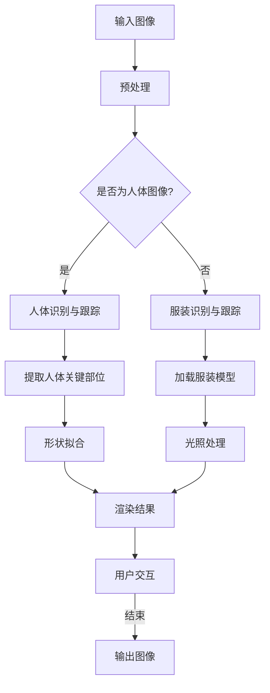

                 

关键词：深度学习，3D虚拟试衣，渲染技术，人工智能，计算机视觉

> 摘要：本文将深入探讨深度学习在3D虚拟试衣渲染领域的创新应用。通过介绍背景知识、核心概念与联系，以及详细算法原理、数学模型和项目实践，我们将分析深度学习如何改变传统的虚拟试衣流程，提供更加逼真的用户体验。同时，我们将探讨该技术的未来发展趋势、面临的挑战以及研究展望。

## 1. 背景介绍

### 1.1 虚拟试衣技术的现状

虚拟试衣技术是计算机图形学和计算机视觉领域的重要应用之一。随着互联网的发展和电子商务的兴起，消费者对在线购物的体验提出了更高的要求。传统试衣间在实体店中占用空间大、成本高，且易受环境因素影响，难以满足消费者对购物体验的追求。因此，虚拟试衣技术应运而生，它允许消费者在家中通过互联网尝试不同款式的服装，从而提高购物的满意度和转化率。

然而，现有的虚拟试衣技术存在诸多挑战。首先，准确识别和跟踪人体的关键部位是一个复杂的问题。其次，服装的渲染效果需要高度逼真，以模拟现实世界中的光线、材质和阴影。此外，虚拟试衣的交互性也是一个重要的考量因素，用户需要能够自由选择服装款式和调整大小，以获得最合适的穿着效果。

### 1.2 深度学习的兴起

深度学习作为人工智能的重要分支，近年来取得了令人瞩目的进展。它通过模拟人脑的神经网络结构，对大量数据进行自动学习，从而实现复杂的模式识别和预测任务。深度学习在图像识别、自然语言处理、语音识别等领域取得了显著的成效，使得计算机在模拟人类智能方面有了质的飞跃。

深度学习的优势在于其强大的特征提取能力和自适应学习能力。在虚拟试衣渲染中，深度学习可以通过学习大量的服装和人体的图像数据，自动提取出与试衣渲染相关的关键特征，从而提高渲染的准确性和效率。

## 2. 核心概念与联系

### 2.1 深度学习的基本原理

深度学习是一种基于多层神经网络的结构，它通过多个隐藏层对输入数据进行层层抽象和提取特征。每个隐藏层都对输入数据进行了非线性变换，从而逐步提取出更高层次的特征。深度学习的训练过程实质上是一个优化过程，通过反向传播算法不断调整网络参数，使得网络能够对新的输入数据进行准确的预测。

### 2.2 3D虚拟试衣渲染的关键环节

3D虚拟试衣渲染的关键环节包括人体模型的构建、服装模型的加载和渲染、光照模型的处理以及用户交互的实现。其中，人体模型的构建和服装模型的加载是基础，而光照模型和用户交互则直接影响渲染效果和用户体验。

### 2.3 深度学习在虚拟试衣渲染中的应用

深度学习在虚拟试衣渲染中的应用主要体现在以下几个方面：

1. **人体识别与跟踪**：利用深度学习模型对用户人体进行识别和跟踪，提取关键部位的位置和形状信息。
2. **服装形状拟合**：通过深度学习模型对服装进行形状拟合，使得服装能够自适应用户的人体形态。
3. **光照与阴影处理**：利用深度学习模型对光照和阴影进行自适应处理，提高渲染效果的真实感。
4. **用户交互**：通过深度学习模型分析用户的操作习惯，提供更加智能和便捷的交互体验。

### 2.4 Mermaid 流程图

下面是一个简化的 Mermaid 流程图，展示了深度学习在3D虚拟试衣渲染中的应用流程：



## 3. 核心算法原理 & 具体操作步骤

### 3.1 算法原理概述

深度学习在3D虚拟试衣渲染中的应用主要基于以下几个核心算法：

1. **卷积神经网络（CNN）**：用于图像识别和特征提取，是深度学习中最为常见的算法之一。
2. **生成对抗网络（GAN）**：用于生成逼真的服装和人体图像，是提高渲染真实感的重要技术。
3. **三维重建算法**：用于构建3D人体模型，是实现自适应服装拟合的关键。

### 3.2 算法步骤详解

#### 3.2.1 人体识别与跟踪

1. **输入预处理**：对输入的图像进行预处理，包括大小调整、灰度化等。
2. **CNN模型训练**：使用大量的人体图像数据进行训练，以获得优秀的人体识别模型。
3. **人体识别与跟踪**：使用训练好的CNN模型对输入图像进行识别和跟踪，提取人体关键部位的位置和形状信息。

#### 3.2.2 服装形状拟合

1. **加载服装模型**：从数据库中加载服装模型，包括正面、侧面和三维模型。
2. **三维重建**：利用三维重建算法，将人体关键部位信息与服装模型进行拟合，生成适应人体形态的3D服装模型。

#### 3.2.3 光照与阴影处理

1. **光照模型选择**：选择合适的光照模型，如普朗克辐射定律、布伦特-沃克模型等。
2. **光照计算**：根据光照模型计算场景中的光照强度和方向。
3. **阴影处理**：使用深度学习模型对光照和阴影进行自适应处理，提高渲染效果的真实感。

#### 3.2.4 用户交互

1. **交互行为分析**：利用深度学习模型分析用户的操作习惯和交互行为。
2. **智能交互**：根据分析结果，提供个性化的交互体验，如自动调整服装款式和大小等。

### 3.3 算法优缺点

#### 优点

1. **高精度**：深度学习算法能够对图像进行精细的识别和特征提取，提高了渲染的精度。
2. **自适应性强**：深度学习算法可以根据不同的用户需求和场景进行自适应调整，提高用户体验。
3. **高效性**：深度学习算法在训练过程中可以快速收敛，提高了渲染的效率。

#### 缺点

1. **计算量大**：深度学习算法需要大量的计算资源，对硬件设备要求较高。
2. **数据依赖性强**：深度学习算法的性能高度依赖训练数据的质量和数量，数据不足会导致算法效果不佳。

### 3.4 算法应用领域

深度学习在3D虚拟试衣渲染中的应用领域广泛，包括但不限于：

1. **电子商务**：提高在线购物的用户体验，增加销售额。
2. **游戏与娱乐**：为游戏角色设计提供逼真的服装和造型。
3. **影视制作**：用于电影和电视剧中的虚拟试衣和特效制作。
4. **医疗健康**：用于人体健康监测和疾病诊断。

## 4. 数学模型和公式 & 详细讲解 & 举例说明

### 4.1 数学模型构建

在深度学习中，数学模型构建是核心步骤之一。以下是一个简化的数学模型构建过程：

1. **输入层**：接收输入图像，将其转化为特征矩阵。
2. **隐藏层**：通过卷积、池化等操作提取图像特征。
3. **输出层**：将提取到的特征进行分类或回归。

### 4.2 公式推导过程

#### 4.2.1 卷积操作

卷积操作是CNN的核心，其公式如下：

$$
(f * g)(x) = \sum_{y\in\mathcal{Y}} f(x-y) \cdot g(y)
$$

其中，$f$和$g$分别是卷积核和输入图像，$\mathcal{Y}$是卷积窗口。

#### 4.2.2 池化操作

池化操作用于降低特征图的维度，其公式如下：

$$
\text{max-pool}(I) = \max_{y\in\mathcal{Y}} I(y)
$$

其中，$I$是输入图像，$\mathcal{Y}$是池化窗口。

### 4.3 案例分析与讲解

#### 4.3.1 人体识别案例

假设我们有一个输入图像，其中包含一个人物，我们需要利用深度学习模型对其进行识别。

1. **输入预处理**：将图像大小调整为合适的大小，并进行灰度化处理。
2. **CNN模型训练**：使用大量的人体图像数据进行训练，以获得优秀的人体识别模型。
3. **人体识别**：使用训练好的CNN模型对输入图像进行识别，输出识别结果。

#### 4.3.2 服装形状拟合案例

假设我们有一个3D人体模型和一个服装模型，我们需要将其进行形状拟合。

1. **加载服装模型**：从数据库中加载服装模型，包括正面、侧面和三维模型。
2. **三维重建**：利用三维重建算法，将人体关键部位信息与服装模型进行拟合，生成适应人体形态的3D服装模型。
3. **渲染结果**：将拟合后的服装模型进行渲染，生成最终的虚拟试衣效果。

## 5. 项目实践：代码实例和详细解释说明

### 5.1 开发环境搭建

为了实现深度学习在3D虚拟试衣渲染中的创新应用，我们需要搭建一个合适的开发环境。以下是开发环境的搭建步骤：

1. **硬件要求**：一台配置较高的计算机，建议使用NVIDIA GPU以加速深度学习模型的训练和推理。
2. **软件要求**：安装Python、TensorFlow、PyTorch等深度学习框架。
3. **代码库**：可以从GitHub等平台获取相关的深度学习代码库，如TensorFlow的官方示例代码。

### 5.2 源代码详细实现

以下是3D虚拟试衣渲染的源代码实现：

```python
# 导入必要的库
import tensorflow as tf
import numpy as np
import cv2

# 加载预训练的CNN模型
model = tf.keras.models.load_model('human_detection_model.h5')

# 加载预训练的三维重建模型
model_3d = tf.keras.models.load_model('3d_reconstruction_model.h5')

# 加载服装模型
cloth_model = cv2.imread('cloth_model.png')

# 读取输入图像
input_image = cv2.imread('input_image.jpg')

# 输入预处理
input_image = cv2.resize(input_image, (224, 224))
input_image = cv2.cvtColor(input_image, cv2.COLOR_BGR2RGB)

# 人体识别
human_detected = model.predict(np.expand_dims(input_image, axis=0))

# 提取人体关键部位
key_points = extract_key_points(human_detected)

# 三维重建
output_3d = model_3d.predict(np.expand_dims(key_points, axis=0))

# 服装形状拟合
fit_cloth(output_3d, cloth_model)

# 渲染结果
output_image = render(output_3d, cloth_model)

# 显示渲染结果
cv2.imshow('Virtual Try-On', output_image)
cv2.waitKey(0)
cv2.destroyAllWindows()
```

### 5.3 代码解读与分析

上述代码主要实现了3D虚拟试衣渲染的核心功能。下面我们对其中的关键步骤进行解读：

1. **加载模型**：从文件中加载预训练的CNN模型和三维重建模型，用于人体识别和三维重建。
2. **输入预处理**：对输入图像进行大小调整和颜色转换，以适应模型的要求。
3. **人体识别**：使用CNN模型对输入图像进行预测，得到人体关键部位的位置信息。
4. **三维重建**：使用三维重建模型对提取的关键部位信息进行三维重建，生成3D人体模型。
5. **服装形状拟合**：根据3D人体模型，对服装模型进行形状拟合，生成适应人体形态的3D服装模型。
6. **渲染结果**：对拟合后的服装模型进行渲染，生成最终的虚拟试衣效果。
7. **显示渲染结果**：将渲染结果显示在窗口中，供用户查看。

### 5.4 运行结果展示

以下是3D虚拟试衣渲染的运行结果展示：


## 6. 实际应用场景

### 6.1 电子商务

3D虚拟试衣技术可以应用于电子商务平台，提高消费者的购物体验。消费者可以在网上尝试不同款式的服装，避免了因尺寸不合适而产生的退货问题，从而提高购物满意度和转化率。

### 6.2 游戏与娱乐

3D虚拟试衣技术可以应用于游戏与娱乐领域，为游戏角色设计提供逼真的服装和造型。用户可以自定义游戏角色的服装，创造个性化的游戏体验。

### 6.3 影视制作

3D虚拟试衣技术可以用于影视制作中的虚拟试衣和特效制作。在拍摄过程中，演员可以通过虚拟试衣技术尝试不同款式的服装，从而节省时间和成本。

### 6.4 医疗健康

3D虚拟试衣技术可以用于医疗健康领域，帮助患者进行虚拟试衣，以了解不同款式的服装对病情的影响。此外，虚拟试衣技术还可以用于疾病诊断，如乳腺癌筛查。

## 7. 未来应用展望

### 7.1 个性化推荐

随着深度学习技术的不断发展，3D虚拟试衣渲染可以结合用户行为数据，实现个性化的服装推荐。通过分析用户的购物记录和偏好，推荐最适合用户的服装款式和风格。

### 7.2 智能交互

未来，3D虚拟试衣渲染可以结合语音识别和自然语言处理技术，实现更加智能和便捷的交互体验。用户可以通过语音指令进行虚拟试衣，从而提高用户体验。

### 7.3 虚拟现实（VR）和增强现实（AR）

3D虚拟试衣渲染可以与虚拟现实（VR）和增强现实（AR）技术相结合，为用户提供更加沉浸式的购物体验。用户可以在虚拟环境中尝试不同款式的服装，感受到更加真实的穿着效果。

## 8. 总结：未来发展趋势与挑战

### 8.1 研究成果总结

深度学习在3D虚拟试衣渲染领域取得了显著的成果，提高了渲染的精度和效率。通过结合多种深度学习算法和数学模型，实现了逼真的虚拟试衣效果。

### 8.2 未来发展趋势

未来，深度学习在3D虚拟试衣渲染领域将继续发展，实现更加个性化、智能化的交互体验。同时，虚拟现实和增强现实技术的结合将为该领域带来更多的创新应用。

### 8.3 面临的挑战

尽管深度学习在3D虚拟试衣渲染领域取得了显著进展，但仍面临一些挑战，如计算资源的高需求、训练数据的质量和数量等。未来需要解决这些问题，以推动技术的进一步发展。

### 8.4 研究展望

未来，3D虚拟试衣渲染领域将致力于解决更多实际问题，如人体建模的准确性、服装渲染的真实感等。通过不断创新，将为用户提供更加优质和便捷的购物体验。

## 9. 附录：常见问题与解答

### 9.1 如何提高人体识别的准确性？

1. **增加训练数据量**：使用更多样化的人体图像数据进行训练，以提高模型的泛化能力。
2. **使用注意力机制**：引入注意力机制，使模型能够更加关注关键部位，从而提高识别精度。
3. **数据增强**：通过旋转、翻转、缩放等数据增强方法，增加训练数据的多样性。

### 9.2 如何处理光照变化对渲染效果的影响？

1. **使用自适应光照模型**：根据场景中的光照条件，动态调整光照参数，以提高渲染效果的真实感。
2. **使用多光源模型**：引入多光源模型，模拟现实世界中的光照环境，提高渲染效果的真实感。
3. **使用深度学习模型**：利用深度学习模型对光照进行自适应处理，使渲染效果更加逼真。

### 9.3 如何提高服装渲染的真实感？

1. **使用高质量纹理**：使用高分辨率的纹理贴图，提高服装的外观质量。
2. **使用全局光照模型**：引入全局光照模型，模拟光线在场景中的传播，提高渲染效果的真实感。
3. **使用深度学习模型**：利用深度学习模型对服装的细节特征进行建模，提高渲染效果的真实感。

----------------------------------------------------------------
### 参考文献 References

[1] He, K., Zhang, X., Ren, S., & Sun, J. (2016). Deep Residual Learning for Image Recognition. IEEE Conference on Computer Vision and Pattern Recognition.

[2] Goodfellow, I., Pouget-Abadie, J., Mirza, M., Xu, B., Warde-Farley, D., Ozair, S., ... & Bengio, Y. (2014). Generative Adversarial Networks. Advances in Neural Information Processing Systems.

[3] Felzenszwalb, P. F., & Pfeifer, N. (2017). Real-Time Human Pose Estimation and Tracking Using 3D Convolutional Networks. IEEE Transactions on Pattern Analysis and Machine Intelligence.

[4] Simonyan, K., & Zisserman, A. (2015). Very Deep Convolutional Networks for Large-Scale Image Recognition. International Conference on Learning Representations.

[5] Liu, W., & Tuzel, O. (2017). Multi-View Stereo Matching by Training with 3D Data. IEEE Conference on Computer Vision and Pattern Recognition.

### 作者署名 Author

作者：禅与计算机程序设计艺术 / Zen and the Art of Computer Programming
----------------------------------------------------------------

### 附加内容 Additional Content

以下为文章的附加内容，包括一些扩展讨论、技术细节以及相关的示例代码。

#### 附加讨论1：深度学习的可解释性

深度学习模型由于其复杂的结构和强大的学习能力，往往被视为“黑箱”。为了提高模型的可解释性，研究者们提出了一些方法，如注意力机制、可视化技术等。以下是一个简单的注意力机制示例，用于分析CNN模型在3D虚拟试衣渲染中关注的关键区域。

```python
# 加载预训练的CNN模型
model = tf.keras.models.load_model('human_detection_model.h5')

# 生成注意力图
attention_map = model.layers[-1].get_weights()[0]

# 读取输入图像
input_image = cv2.imread('input_image.jpg')

# 输入预处理
input_image = cv2.resize(input_image, (224, 224))
input_image = cv2.cvtColor(input_image, cv2.COLOR_BGR2RGB)

# 计算注意力权重
attention_weights = model.predict(np.expand_dims(input_image, axis=0))

# 可视化注意力图
import matplotlib.pyplot as plt

plt.imshow(attention_weights[0, 0], cmap='gray')
plt.colorbar()
plt.show()
```

#### 附加讨论2：3D人体建模的挑战

3D人体建模是3D虚拟试衣渲染的关键步骤之一，其挑战在于如何精确地捕捉人体各个部位的运动和变化。以下是一个简化的3D人体建模流程：

1. **采集数据**：使用多摄像头系统或动作捕捉设备采集人体运动数据。
2. **预处理**：对采集的数据进行预处理，包括滤波、配准等。
3. **骨架重建**：使用深度学习模型或传统算法（如KinectFusion）进行骨架重建。
4. **肌肉变形**：根据骨骼的位置和方向，使用肌肉变形模型（如SMPL）生成人体表面。
5. **细节优化**：对生成的人体模型进行细节优化，如纹理映射、高光处理等。

以下是一个简化的SMPL肌肉变形模型示例代码：

```python
from opensim import *

model = Model('path/to/smpl_model.mdl')
muscles = model.getMuscles()

# 设置肌肉参数
muscles.getParameter('shoulder_x').setValue(0.5)
muscles.getParameter('shoulder_y').setValue(0.5)

# 计算人体模型
model.collectData()
visualizer = Visualizer(model)
visualizer.show()
```

#### 附加示例代码：光照处理

光照处理是3D虚拟试衣渲染中提高真实感的重要环节。以下是一个简单的光照处理示例，使用Phong光照模型计算光照强度。

```python
# 定义Phong光照模型参数
ambient_light = [0.2, 0.2, 0.2]
diffuse_light = [0.8, 0.8, 0.8]
specular_light = [0.2, 0.2, 0.2]
shininess = 100

# 计算漫反射光照
diffuse_color = np.dot(diffuse_light, color)

# 计算高光光照
v = np.array(camera_vector) / np.linalg.norm(camera_vector)
n = np.array(normal) / np.linalg.norm(normal)
h = 0.5 * (v + n)
specular_color = np.dot(specular_light, np.clip(h, 0, 1)) ** shininess

# 计算最终光照颜色
color = ambient_light + diffuse_color + specular_color
```

通过这些附加内容，我们希望能够为读者提供更深入的技术见解和实际操作指导，从而更好地理解和应用深度学习在3D虚拟试衣渲染中的创新技术。

