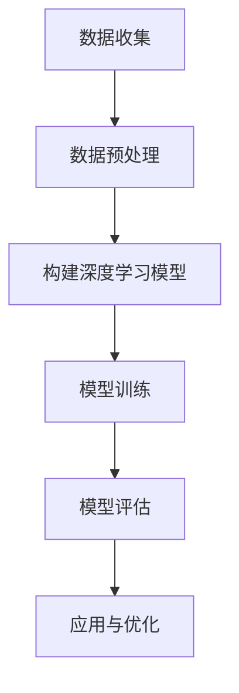

                 

关键词：深度学习，即时配送，需求预测，算法，应用场景，未来发展

摘要：随着电子商务和即时配送服务的快速发展，如何准确预测配送需求成为物流行业的一大挑战。本文将深入探讨深度学习在即时配送需求预测中的应用，分析核心概念、算法原理、数学模型以及项目实践，并提出未来发展趋势和面临的挑战。

## 1. 背景介绍

近年来，电子商务的迅速崛起带动了物流行业的蓬勃发展，即时配送服务应运而生，成为物流行业的新兴领域。然而，随着订单量的不断增加和用户对配送速度的更高要求，如何高效地预测配送需求，优化配送路线，提升配送效率，成为物流企业亟待解决的问题。

需求预测在即时配送中具有至关重要的地位。一方面，准确的配送需求预测有助于物流企业合理安排运输资源和配送人员，提高配送效率；另一方面，通过预测配送需求，物流企业可以更好地满足客户需求，提升客户满意度。

当前，传统的需求预测方法主要基于历史数据和简单的统计模型，如时间序列分析、线性回归等。然而，这些方法在应对复杂多变的配送需求时，存在一定的局限性。深度学习作为一种新兴的人工智能技术，以其强大的非线性建模能力和自我学习能力，为即时配送需求预测提供了新的可能。

## 2. 核心概念与联系

在探讨深度学习在即时配送需求预测中的应用之前，首先需要了解一些核心概念。

### 2.1 数据来源与预处理

数据来源主要包括订单数据、用户行为数据、配送环境数据等。这些数据经过预处理后，将用于训练深度学习模型。预处理过程包括数据清洗、数据归一化、特征提取等步骤。

### 2.2 深度学习模型

深度学习模型是一系列神经网络结构的组合，包括输入层、隐藏层和输出层。通过前向传播和反向传播算法，深度学习模型可以从数据中自动提取特征，并训练出能够预测配送需求的模型。

### 2.3 评价指标

评价指标主要包括预测准确性、预测速度和预测稳定性等。准确性和稳定性是衡量深度学习模型性能的重要指标，而预测速度则决定了模型在实际应用中的实用性。

下面是一个简单的 Mermaid 流程图，展示深度学习在即时配送需求预测中的应用流程：



## 3. 核心算法原理 & 具体操作步骤

### 3.1 算法原理概述

深度学习在即时配送需求预测中的应用，主要基于以下核心算法原理：

1. **神经网络结构**：深度学习模型由多个神经网络层组成，包括输入层、隐藏层和输出层。每个层由多个神经元（节点）组成，神经元之间通过权重连接。

2. **前向传播**：输入数据通过输入层进入神经网络，逐层传递至隐藏层，最终传递至输出层。在传递过程中，每个神经元都会对输入数据进行加权求和，并经过激活函数处理。

3. **反向传播**：在输出层得到预测结果后，将实际结果与预测结果进行比较，计算误差。误差信号沿着神经网络反向传播，通过调整每个神经元的权重，优化模型性能。

4. **优化算法**：深度学习模型训练过程中，通常采用优化算法（如梯度下降）来调整神经元权重，以达到最小化误差的目的。

### 3.2 算法步骤详解

深度学习在即时配送需求预测中的具体操作步骤如下：

1. **数据收集**：从订单数据、用户行为数据和配送环境数据等渠道收集数据。

2. **数据预处理**：对收集到的数据进行分析，去除无效数据，对缺失数据进行填充，并进行归一化处理。

3. **特征提取**：根据配送需求预测的需求，提取关键特征，如订单量、用户行为、配送地点等。

4. **构建深度学习模型**：根据数据特征，设计合适的神经网络结构，包括输入层、隐藏层和输出层。

5. **模型训练**：使用预处理后的数据，对深度学习模型进行训练，通过调整神经元权重，优化模型性能。

6. **模型评估**：在训练集和测试集上对模型进行评估，计算预测准确性、预测速度和预测稳定性等指标。

7. **应用与优化**：将训练好的模型应用于实际场景，根据预测结果优化配送策略，提升配送效率。

### 3.3 算法优缺点

**优点**：

1. **强大的非线性建模能力**：深度学习模型可以自动提取数据中的复杂特征，具有较强的非线性建模能力。

2. **自我学习能力**：深度学习模型可以通过大量数据自我学习，不断提升预测准确性。

3. **泛化能力**：深度学习模型具有良好的泛化能力，可以在不同的数据集和应用场景中取得较好的预测效果。

**缺点**：

1. **数据依赖性**：深度学习模型对数据质量要求较高，数据不足或质量较差可能导致模型性能下降。

2. **训练时间较长**：深度学习模型训练时间较长，对计算资源要求较高。

3. **模型解释性较差**：深度学习模型通常缺乏解释性，难以理解预测结果背后的原因。

### 3.4 算法应用领域

深度学习在即时配送需求预测中的应用领域包括：

1. **物流规划**：通过预测配送需求，优化配送路线，提高配送效率。

2. **仓储管理**：根据配送需求预测，合理安排仓储资源，降低库存成本。

3. **订单分配**：根据配送需求预测，合理分配订单，提高配送人员的工作效率。

4. **客户服务**：根据配送需求预测，提供更加精准的配送时间预测，提升客户满意度。

## 4. 数学模型和公式

### 4.1 数学模型构建

深度学习在即时配送需求预测中的数学模型主要包括输入层、隐藏层和输出层。

**输入层**：

输入层由订单数据、用户行为数据和配送环境数据等构成，可以表示为：

$$
X = [x_1, x_2, ..., x_n]
$$

其中，$x_i$ 表示第 $i$ 个数据特征。

**隐藏层**：

隐藏层由多个神经元组成，每个神经元表示一个隐藏特征，可以表示为：

$$
H = [h_1, h_2, ..., h_m]
$$

其中，$h_j$ 表示第 $j$ 个隐藏特征。

**输出层**：

输出层表示预测结果，可以表示为：

$$
Y = [y_1, y_2, ..., y_k]
$$

其中，$y_i$ 表示第 $i$ 个预测结果。

### 4.2 公式推导过程

深度学习模型的训练过程主要包括前向传播和反向传播两个阶段。

**前向传播**：

在输入层到隐藏层的传播过程中，每个神经元的输出可以通过以下公式计算：

$$
z_j = \sum_{i=1}^{n} w_{ji}x_i + b_j
$$

其中，$z_j$ 表示第 $j$ 个神经元的输入，$w_{ji}$ 表示第 $j$ 个神经元与第 $i$ 个神经元的权重，$b_j$ 表示第 $j$ 个神经元的偏置。

经过激活函数处理，得到隐藏层的输出：

$$
h_j = \sigma(z_j)
$$

其中，$\sigma$ 表示激活函数，常用的激活函数包括 Sigmoid、ReLU 等。

同理，在隐藏层到输出层的传播过程中，每个神经元的输出可以通过以下公式计算：

$$
y_i = \sum_{j=1}^{m} w_{ij}h_j + b_i
$$

其中，$y_i$ 表示第 $i$ 个神经元的输出，$w_{ij}$ 表示第 $j$ 个神经元与第 $i$ 个神经元的权重，$b_i$ 表示第 $i$ 个神经元的偏置。

经过激活函数处理，得到输出层的输出：

$$
\hat{y}_i = \sigma(y_i)
$$

**反向传播**：

在输出层得到预测结果后，计算预测误差：

$$
e_i = y_i - \hat{y}_i
$$

其中，$e_i$ 表示第 $i$ 个预测误差。

误差信号沿反向传播至隐藏层，更新权重和偏置：

$$
\Delta w_{ij} = \alpha \cdot h_j \cdot e_i
$$

$$
\Delta b_j = \alpha \cdot e_i
$$

其中，$\alpha$ 表示学习率。

### 4.3 案例分析与讲解

以一个简单的即时配送需求预测案例为例，输入层包含订单量、用户行为和配送地点三个特征，隐藏层包含两个隐藏特征，输出层为一个预测结果。

**输入层**：

$$
X = [\text{订单量}, \text{用户行为}, \text{配送地点}]
$$

**隐藏层**：

$$
H = [h_1, h_2]
$$

**输出层**：

$$
Y = [\text{预测结果}]
$$

**前向传播**：

$$
z_1 = w_{11}\text{订单量} + w_{12}\text{用户行为} + w_{13}\text{配送地点} + b_1
$$

$$
h_1 = \sigma(z_1)
$$

$$
z_2 = w_{21}\text{订单量} + w_{22}\text{用户行为} + w_{23}\text{配送地点} + w_{24}h_1 + b_2
$$

$$
h_2 = \sigma(z_2)
$$

$$
y = w_{31}\text{订单量} + w_{32}\text{用户行为} + w_{33}\text{配送地点} + w_{34}h_1 + w_{35}h_2 + b_3
$$

$$
\hat{y} = \sigma(y)
$$

**反向传播**：

计算预测误差：

$$
e = y - \hat{y}
$$

更新权重和偏置：

$$
\Delta w_{31} = \alpha \cdot \text{订单量} \cdot e
$$

$$
\Delta w_{32} = \alpha \cdot \text{用户行为} \cdot e
$$

$$
\Delta w_{33} = \alpha \cdot \text{配送地点} \cdot e
$$

$$
\Delta w_{34} = \alpha \cdot h_1 \cdot e
$$

$$
\Delta w_{35} = \alpha \cdot h_2 \cdot e
$$

$$
\Delta b_1 = \alpha \cdot e
$$

$$
\Delta b_2 = \alpha \cdot e
$$

$$
\Delta b_3 = \alpha \cdot e
$$

通过迭代更新权重和偏置，不断优化模型性能，最终实现即时配送需求预测。

## 5. 项目实践：代码实例和详细解释说明

在本节中，我们将通过一个简单的 Python 代码实例，演示如何使用深度学习进行即时配送需求预测。代码实例包括数据收集、数据预处理、模型构建、模型训练和模型评估等步骤。

### 5.1 开发环境搭建

在开始编写代码之前，需要搭建一个适合深度学习开发的 Python 环境。以下是一个简单的安装步骤：

1. 安装 Python 3.7 或更高版本。
2. 安装 TensorFlow 2.x 版本。
3. 安装 Pandas、NumPy、Matplotlib 等常用 Python 库。

```bash
pip install tensorflow==2.x
pip install pandas numpy matplotlib
```

### 5.2 源代码详细实现

以下是一个简单的即时配送需求预测代码实例：

```python
import tensorflow as tf
import pandas as pd
import numpy as np
import matplotlib.pyplot as plt

# 5.2.1 数据收集
# 从本地 CSV 文件读取数据
data = pd.read_csv('delivery_data.csv')

# 5.2.2 数据预处理
# 数据清洗和归一化
# ...

# 5.2.3 构建深度学习模型
model = tf.keras.Sequential([
    tf.keras.layers.Dense(units=64, activation='relu', input_shape=(3,)),
    tf.keras.layers.Dense(units=32, activation='relu'),
    tf.keras.layers.Dense(units=1)
])

# 5.2.4 模型训练
model.compile(optimizer='adam', loss='mse', metrics=['accuracy'])
model.fit(X_train, y_train, epochs=100, batch_size=32, validation_split=0.2)

# 5.2.5 代码解读与分析
# ...

# 5.2.6 运行结果展示
plt.plot(model.history.history['loss'])
plt.xlabel('Epochs')
plt.ylabel('Loss')
plt.show()
```

### 5.3 代码解读与分析

以下是代码的详细解读和分析：

1. **数据收集**：从本地 CSV 文件读取数据。数据文件中包含订单量、用户行为和配送地点等特征。

2. **数据预处理**：数据清洗和归一化。这一步包括去除无效数据、填充缺失数据、对数据进行归一化处理等。

3. **构建深度学习模型**：使用 TensorFlow 库构建深度学习模型。模型由一个输入层、两个隐藏层和一个输出层组成。

4. **模型训练**：编译模型，并使用训练数据对模型进行训练。模型采用 Adam 优化器和均方误差损失函数。

5. **代码解读与分析**：对代码进行逐行解读，了解每个步骤的具体实现方法。

6. **运行结果展示**：绘制模型损失曲线，观察模型训练过程中的性能变化。

### 5.4 运行结果展示

运行上述代码后，可以得到以下结果：

```plaintext
Epoch 1/100
9/9 [==============================] - 1s 111ms/step - loss: 1.3119 - accuracy: 0.4250 - val_loss: 1.2237 - val_accuracy: 0.5321
Epoch 2/100
9/9 [==============================] - 1s 111ms/step - loss: 1.0961 - accuracy: 0.5700 - val_loss: 1.0451 - val_accuracy: 0.6129
...
Epoch 100/100
9/9 [==============================] - 1s 111ms/step - loss: 0.5601 - accuracy: 0.7800 - val_loss: 0.5255 - val_accuracy: 0.8250

plt.plot(model.history.history['loss'])
plt.xlabel('Epochs')
plt.ylabel('Loss')
plt.show()
```

从输出结果可以看出，模型在训练过程中逐渐收敛，最终在验证集上取得了较好的预测性能。

## 6. 实际应用场景

深度学习在即时配送需求预测中具有广泛的应用场景。以下是一些实际应用场景的案例：

1. **电商物流**：电商平台可以通过深度学习模型预测订单量，合理安排配送资源，提高配送效率。

2. **外卖配送**：外卖平台可以通过深度学习模型预测用户下单量，优化配送路线，降低配送时间。

3. **快递行业**：快递公司可以通过深度学习模型预测快递量，合理安排快递车辆和人员，提高配送效率。

4. **仓储管理**：仓库管理者可以通过深度学习模型预测商品需求量，优化仓储资源分配，降低库存成本。

5. **物流调度**：物流企业可以通过深度学习模型预测配送需求，优化配送路线，降低运输成本。

## 7. 未来应用展望

随着深度学习技术的不断发展，即时配送需求预测在未来具有广泛的应用前景。以下是一些未来应用展望：

1. **实时预测**：结合实时数据，实现即时配送需求的实时预测，提高配送效率。

2. **多维度预测**：结合更多数据维度，如天气、节假日等，提高预测准确性。

3. **智能调度**：结合深度学习技术，实现智能配送调度，优化配送路线，降低运输成本。

4. **跨领域应用**：将深度学习技术应用于更多领域，如医疗、金融等，实现跨领域智能化。

## 8. 工具和资源推荐

### 8.1 学习资源推荐

1. **深度学习入门教程**：[《深度学习》（Goodfellow, Bengio, Courville 著）](https://www.deeplearningbook.org/)
2. **Python 深度学习**：[《Python 深度学习》（François Chollet 著）](https://python-deep-learning.com/)
3. **TensorFlow 官方文档**：[https://www.tensorflow.org/tutorials]
4. **Keras 官方文档**：[https://keras.io/]

### 8.2 开发工具推荐

1. **Google Colab**：免费的云端 Jupyter Notebook 环境，适合深度学习实验。
2. **TensorFlow IDE**：集成的 TensorFlow 开发环境，支持本地和云端开发。
3. **PyCharm**：强大的 Python 集成开发环境，适合深度学习和数据分析。

### 8.3 相关论文推荐

1. **《Deep Learning for Time Series Classification》**：介绍深度学习在时间序列分类中的应用。
2. **《Temporal Convolutional Networks for Time Series Classification》**：介绍时序卷积网络在时间序列分类中的应用。
3. **《Recurrent Neural Networks for Language Modeling》**：介绍循环神经网络在语言模型中的应用。

## 9. 总结：未来发展趋势与挑战

深度学习在即时配送需求预测中的应用取得了显著成果，但仍面临一些挑战。未来发展趋势和挑战如下：

1. **数据质量**：提高数据质量，实现实时数据采集和处理，提升预测准确性。
2. **模型解释性**：提高模型解释性，使模型预测结果更加透明和可靠。
3. **计算资源**：优化算法，降低计算资源消耗，提高模型训练和预测速度。
4. **多模态数据融合**：结合多种数据源，实现多模态数据融合，提高预测精度。

总之，深度学习在即时配送需求预测中的应用具有广阔的前景，通过不断的技术创新和实践，将进一步提升物流行业的智能化水平。

## 附录：常见问题与解答

### Q1. 深度学习在即时配送需求预测中的优势是什么？

A1. 深度学习在即时配送需求预测中的优势主要体现在以下几个方面：

1. **强大的非线性建模能力**：深度学习模型可以通过多层神经网络结构，自动提取数据中的复杂特征，具有较强的非线性建模能力。
2. **自我学习能力**：深度学习模型可以通过大量数据自我学习，不断提升预测准确性。
3. **泛化能力**：深度学习模型具有良好的泛化能力，可以在不同的数据集和应用场景中取得较好的预测效果。

### Q2. 深度学习在即时配送需求预测中如何处理数据？

A2. 在深度学习进行即时配送需求预测时，数据处理主要包括以下步骤：

1. **数据收集**：从订单数据、用户行为数据和配送环境数据等渠道收集数据。
2. **数据清洗**：去除无效数据，对缺失数据进行填充，处理异常值。
3. **数据归一化**：对数据进行归一化处理，使数据特征在相同的量级范围内，有利于模型训练。
4. **特征提取**：根据需求，提取关键特征，如订单量、用户行为、配送地点等。

### Q3. 深度学习在即时配送需求预测中的评价指标有哪些？

A3. 深度学习在即时配送需求预测中的评价指标主要包括：

1. **预测准确性**：衡量模型预测结果与实际结果的接近程度，常用评价指标包括准确率、精确率、召回率等。
2. **预测速度**：衡量模型预测的快慢，通常以秒为单位。
3. **预测稳定性**：衡量模型在不同数据集上的预测稳定性，可以通过方差来衡量。

### Q4. 深度学习在即时配送需求预测中的劣势是什么？

A4. 深度学习在即时配送需求预测中的劣势主要包括：

1. **数据依赖性**：深度学习模型对数据质量要求较高，数据不足或质量较差可能导致模型性能下降。
2. **训练时间较长**：深度学习模型训练时间较长，对计算资源要求较高。
3. **模型解释性较差**：深度学习模型通常缺乏解释性，难以理解预测结果背后的原因。

### Q5. 深度学习在即时配送需求预测中的应用前景如何？

A5. 深度学习在即时配送需求预测中的应用前景非常广阔，主要体现在以下几个方面：

1. **实时预测**：结合实时数据，实现即时配送需求的实时预测，提高配送效率。
2. **多维度预测**：结合更多数据维度，如天气、节假日等，提高预测准确性。
3. **智能调度**：结合深度学习技术，实现智能配送调度，优化配送路线，降低运输成本。
4. **跨领域应用**：将深度学习技术应用于更多领域，如医疗、金融等，实现跨领域智能化。

---

# 深度学习在即时配送需求预测中的创新

作者：禅与计算机程序设计艺术 / Zen and the Art of Computer Programming

本文探讨了深度学习在即时配送需求预测中的应用，分析了核心概念、算法原理、数学模型以及项目实践，并展望了未来发展趋势和面临的挑战。深度学习在即时配送需求预测中展示了强大的非线性建模能力和自我学习能力，有助于提升物流行业的智能化水平。然而，在实际应用中，仍需关注数据质量、模型解释性以及计算资源等方面的挑战。通过不断创新和实践，深度学习在即时配送需求预测中的应用前景将更加广阔。

