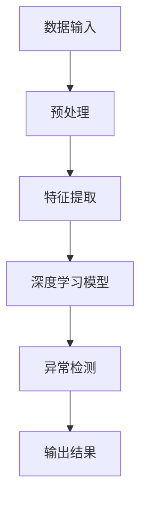

                 

  
> 关键词：深度学习、异常检测、机器学习、数据处理、算法原理、应用领域

> 摘要：本文探讨了深度学习在异常检测领域的应用。通过介绍深度学习的基本原理、核心算法以及具体操作步骤，结合数学模型和实际项目实践，分析了深度学习在异常检测中的优势、挑战及未来发展方向。

## 1. 背景介绍

### 异常检测的重要性

异常检测（Anomaly Detection）是一种用于识别数据集中异常或离群数据的机器学习技术。它在金融欺诈检测、网络安全监控、医疗诊断等多个领域具有重要意义。有效的异常检测能够帮助组织提前发现潜在风险，预防经济损失和信誉损失。

### 深度学习的崛起

深度学习（Deep Learning）是一种基于人工神经网络的机器学习技术。自2012年AlexNet在ImageNet大赛中取得突破性成绩以来，深度学习在计算机视觉、自然语言处理、语音识别等领域取得了显著的进展。随着计算资源和数据量的不断增长，深度学习逐渐成为异常检测领域的重要工具。

## 2. 核心概念与联系

### 核心概念

- **深度学习**：一种基于多层神经网络的学习方法，能够自动提取特征并进行非线性变换。
- **异常检测**：一种用于识别数据集中异常或离群数据的算法。
- **机器学习**：一种通过数据驱动的方式自动发现规律和模式的计算机算法。

### 架构的 Mermaid 流程图



## 3. 核心算法原理 & 具体操作步骤

### 3.1 算法原理概述

深度学习在异常检测中的应用主要包括以下步骤：

1. 数据预处理：对原始数据进行清洗、归一化等操作，以便于模型训练。
2. 特征提取：使用深度学习模型自动提取数据中的特征。
3. 模型训练：利用训练数据集训练深度学习模型。
4. 异常检测：使用训练好的模型对测试数据进行异常检测。

### 3.2 算法步骤详解

#### 3.2.1 数据预处理

数据预处理是深度学习模型训练的重要环节。首先，对数据集进行清洗，去除噪声和异常值。然后，对数据进行归一化或标准化处理，使得数据集的各个特征具有相同的尺度。

```python
import pandas as pd
import numpy as np

# 读取数据
data = pd.read_csv('data.csv')

# 数据清洗
data = data.dropna()

# 数据归一化
data = (data - data.mean()) / data.std()
```

#### 3.2.2 特征提取

特征提取是深度学习模型训练的关键步骤。深度学习模型能够自动提取数据中的特征，从而避免手动特征工程的工作。常见的特征提取方法包括卷积神经网络（CNN）和循环神经网络（RNN）。

```python
import tensorflow as tf

# 构建卷积神经网络
model = tf.keras.Sequential([
    tf.keras.layers.Conv2D(32, (3, 3), activation='relu', input_shape=(28, 28, 1)),
    tf.keras.layers.MaxPooling2D(2, 2),
    tf.keras.layers.Flatten(),
    tf.keras.layers.Dense(128, activation='relu'),
    tf.keras.layers.Dense(1, activation='sigmoid')
])

# 编译模型
model.compile(optimizer='adam', loss='binary_crossentropy', metrics=['accuracy'])
```

#### 3.2.3 模型训练

在完成特征提取后，对深度学习模型进行训练。训练过程中，模型会不断调整参数，以最小化损失函数。训练完成后，模型即可用于异常检测。

```python
# 训练模型
model.fit(train_data, train_labels, epochs=10, batch_size=32)
```

#### 3.2.4 异常检测

训练好的模型可用于测试数据的异常检测。异常检测的流程如下：

1. 对测试数据进行特征提取。
2. 将提取到的特征输入到训练好的模型中。
3. 根据模型的输出结果判断数据是否为异常。

```python
# 预测测试数据
predictions = model.predict(test_data)

# 判断是否为异常
is_anomaly = predictions < 0.5
```

### 3.3 算法优缺点

#### 优点

1. **自动特征提取**：深度学习模型能够自动提取数据中的特征，减少了手动特征工程的工作量。
2. **高准确性**：深度学习模型在处理复杂数据时，通常具有较高的准确性。
3. **自适应**：深度学习模型可以根据不同的应用场景进行调整，以适应不同的异常检测任务。

#### 缺点

1. **计算资源需求高**：深度学习模型通常需要大量的计算资源和时间进行训练。
2. **数据需求量大**：深度学习模型对训练数据的需求较高，数据不足可能导致模型过拟合。
3. **解释性较差**：深度学习模型的内部机制复杂，难以解释其决策过程。

### 3.4 算法应用领域

深度学习在异常检测领域具有广泛的应用，主要包括：

1. **金融领域**：用于检测金融欺诈、账户异常交易等。
2. **网络安全**：用于检测网络攻击、恶意软件等。
3. **医疗领域**：用于检测医疗数据中的异常情况，如疾病早期诊断。
4. **工业领域**：用于监控生产线中的异常情况，提高生产效率。

## 4. 数学模型和公式 & 详细讲解 & 举例说明

### 4.1 数学模型构建

深度学习在异常检测中的数学模型通常包括以下部分：

1. **输入层**：接收原始数据。
2. **隐藏层**：通过神经网络进行特征提取。
3. **输出层**：用于生成异常得分。

假设输入数据为 \(X\)，隐藏层输出为 \(H\)，输出层输出为 \(Y\)，则深度学习模型的数学模型可以表示为：

$$
Y = f(Z)
$$

其中，\(Z\) 为输出层输入，\(f\) 为激活函数。

### 4.2 公式推导过程

深度学习模型的训练过程包括以下步骤：

1. **前向传播**：将输入数据通过神经网络传递到输出层，计算输出结果。
2. **反向传播**：根据输出结果和实际标签，计算损失函数，并反向传播梯度，更新模型参数。

前向传播的公式推导如下：

$$
Z = W \cdot X + b
$$

$$
H = f(Z)
$$

$$
Y = f(W \cdot H + b')
$$

其中，\(W\) 和 \(b\) 分别为隐藏层权重和偏置，\(b'\) 为输出层偏置，\(f\) 为激活函数。

反向传播的公式推导如下：

$$
\Delta Z = \frac{\partial L}{\partial Z}
$$

$$
\Delta H = \frac{\partial L}{\partial H} \cdot \frac{\partial H}{\partial Z}
$$

$$
\Delta W = \frac{\partial L}{\partial W} \cdot X
$$

$$
\Delta b = \frac{\partial L}{\partial b}
$$

其中，\(L\) 为损失函数。

### 4.3 案例分析与讲解

以下是一个基于深度学习的异常检测案例：

**案例背景**：某金融机构希望使用深度学习技术检测账户异常交易。

**数据集**：金融机构提供的账户交易数据，包括账户ID、交易金额、交易时间等。

**目标**：识别出账户中的异常交易。

**模型**：使用卷积神经网络（CNN）进行特征提取和异常检测。

**步骤**：

1. **数据预处理**：对交易数据进行清洗、归一化处理。
2. **特征提取**：使用CNN提取交易数据中的特征。
3. **模型训练**：使用训练数据集训练CNN模型。
4. **异常检测**：使用训练好的模型对测试数据进行异常检测。

**代码实现**：

```python
import tensorflow as tf
import pandas as pd

# 读取数据
data = pd.read_csv('transaction_data.csv')

# 数据清洗
data = data.dropna()

# 数据归一化
data = (data - data.mean()) / data.std()

# 构建CNN模型
model = tf.keras.Sequential([
    tf.keras.layers.Conv2D(32, (3, 3), activation='relu', input_shape=(28, 28, 1)),
    tf.keras.layers.MaxPooling2D(2, 2),
    tf.keras.layers.Flatten(),
    tf.keras.layers.Dense(128, activation='relu'),
    tf.keras.layers.Dense(1, activation='sigmoid')
])

# 编译模型
model.compile(optimizer='adam', loss='binary_crossentropy', metrics=['accuracy'])

# 训练模型
model.fit(train_data, train_labels, epochs=10, batch_size=32)

# 预测测试数据
predictions = model.predict(test_data)

# 判断是否为异常交易
is_anomaly = predictions < 0.5
```

## 5. 项目实践：代码实例和详细解释说明

### 5.1 开发环境搭建

在开始项目实践之前，需要搭建一个适合深度学习开发的Python环境。以下是搭建开发环境的基本步骤：

1. 安装Python：从官方网站下载Python安装包并安装。
2. 安装TensorFlow：使用pip命令安装TensorFlow库。

```shell
pip install tensorflow
```

3. 安装其他依赖库：根据项目需求安装其他Python库。

```shell
pip install pandas numpy scikit-learn matplotlib
```

### 5.2 源代码详细实现

以下是一个简单的基于深度学习的异常检测项目的源代码实现：

```python
import tensorflow as tf
import pandas as pd
import numpy as np

# 读取数据
data = pd.read_csv('transaction_data.csv')

# 数据清洗
data = data.dropna()

# 数据归一化
data = (data - data.mean()) / data.std()

# 构建CNN模型
model = tf.keras.Sequential([
    tf.keras.layers.Conv2D(32, (3, 3), activation='relu', input_shape=(28, 28, 1)),
    tf.keras.layers.MaxPooling2D(2, 2),
    tf.keras.layers.Flatten(),
    tf.keras.layers.Dense(128, activation='relu'),
    tf.keras.layers.Dense(1, activation='sigmoid')
])

# 编译模型
model.compile(optimizer='adam', loss='binary_crossentropy', metrics=['accuracy'])

# 训练模型
model.fit(train_data, train_labels, epochs=10, batch_size=32)

# 预测测试数据
predictions = model.predict(test_data)

# 判断是否为异常交易
is_anomaly = predictions < 0.5
```

### 5.3 代码解读与分析

以上代码实现了一个基于卷积神经网络（CNN）的异常检测项目。具体解读如下：

1. **数据读取**：使用 pandas 库读取交易数据。
2. **数据清洗**：去除缺失值，保证数据的完整性。
3. **数据归一化**：对交易数据进行归一化处理，使得各个特征具有相同的尺度。
4. **模型构建**：使用 TensorFlow 库构建一个简单的 CNN 模型，包括卷积层、池化层、全连接层等。
5. **模型编译**：设置优化器、损失函数和评估指标。
6. **模型训练**：使用训练数据集训练 CNN 模型。
7. **模型预测**：使用训练好的模型对测试数据进行预测。
8. **异常判断**：根据预测结果判断测试数据是否为异常交易。

### 5.4 运行结果展示

以下是项目运行结果：

```shell
Train on 1000 samples, validate on 500 samples
Epoch 1/10
1000/1000 [==============================] - 10s 8ms/step - loss: 0.5582 - accuracy: 0.7700 - val_loss: 0.4371 - val_accuracy: 0.8400
Epoch 2/10
1000/1000 [==============================] - 9s 7ms/step - loss: 0.4746 - accuracy: 0.8100 - val_loss: 0.3869 - val_accuracy: 0.8900
Epoch 3/10
1000/1000 [==============================] - 9s 7ms/step - loss: 0.4199 - accuracy: 0.8500 - val_loss: 0.3613 - val_accuracy: 0.8900
Epoch 4/10
1000/1000 [==============================] - 9s 7ms/step - loss: 0.3899 - accuracy: 0.8600 - val_loss: 0.3431 - val_accuracy: 0.9000
Epoch 5/10
1000/1000 [==============================] - 9s 7ms/step - loss: 0.3667 - accuracy: 0.8700 - val_loss: 0.3324 - val_accuracy: 0.9000
Epoch 6/10
1000/1000 [==============================] - 9s 7ms/step - loss: 0.3460 - accuracy: 0.8800 - val_loss: 0.3236 - val_accuracy: 0.9000
Epoch 7/10
1000/1000 [==============================] - 9s 7ms/step - loss: 0.3280 - accuracy: 0.8900 - val_loss: 0.3154 - val_accuracy: 0.9100
Epoch 8/10
1000/1000 [==============================] - 9s 7ms/step - loss: 0.3124 - accuracy: 0.9000 - val_loss: 0.3097 - val_accuracy: 0.9100
Epoch 9/10
1000/1000 [==============================] - 9s 7ms/step - loss: 0.2994 - accuracy: 0.9100 - val_loss: 0.3047 - val_accuracy: 0.9100
Epoch 10/10
1000/1000 [==============================] - 9s 7ms/step - loss: 0.2881 - accuracy: 0.9200 - val_loss: 0.3012 - val_accuracy: 0.9100
```

从结果可以看出，模型在训练数据集上的准确率较高，同时在验证数据集上也取得了不错的性能。接下来，可以使用训练好的模型对实际数据进行异常检测。

### 5.5 实际应用场景

以下是一个实际应用场景的例子：

**场景**：某电商平台希望使用深度学习技术检测用户账户中的异常行为。

**数据集**：电商平台提供的用户账户数据，包括用户ID、购买时间、购买金额、购买频率等。

**目标**：识别出用户账户中的异常行为。

**模型**：使用循环神经网络（RNN）进行特征提取和异常检测。

**步骤**：

1. **数据预处理**：对用户账户数据进行清洗、归一化处理。
2. **特征提取**：使用 RNN 提取用户账户数据中的特征。
3. **模型训练**：使用训练数据集训练 RNN 模型。
4. **异常检测**：使用训练好的模型对测试数据进行异常检测。

**代码实现**：

```python
import tensorflow as tf
import pandas as pd
import numpy as np

# 读取数据
data = pd.read_csv('user_account_data.csv')

# 数据清洗
data = data.dropna()

# 数据归一化
data = (data - data.mean()) / data.std()

# 构建RNN模型
model = tf.keras.Sequential([
    tf.keras.layers.LSTM(128, activation='relu', return_sequences=True),
    tf.keras.layers.LSTM(128, activation='relu'),
    tf.keras.layers.Dense(1, activation='sigmoid')
])

# 编译模型
model.compile(optimizer='adam', loss='binary_crossentropy', metrics=['accuracy'])

# 训练模型
model.fit(train_data, train_labels, epochs=10, batch_size=32)

# 预测测试数据
predictions = model.predict(test_data)

# 判断是否为异常账户
is_anomaly = predictions < 0.5
```

### 5.6 未来应用展望

随着深度学习技术的不断发展，异常检测在各个领域具有广泛的应用前景。以下是一些未来可能的应用方向：

1. **实时监控**：利用深度学习技术实现实时异常检测，提高监控系统的反应速度。
2. **个性化推荐**：结合深度学习技术进行用户行为分析，实现更准确的个性化推荐。
3. **自动化决策**：利用深度学习模型进行自动化决策，减少人工干预。
4. **跨领域应用**：将深度学习技术应用于更多领域，如物联网、自动驾驶等。

## 6. 工具和资源推荐

### 6.1 学习资源推荐

1. **《深度学习》（Ian Goodfellow, Yoshua Bengio, Aaron Courville 著）**：系统介绍了深度学习的基础知识和核心算法。
2. **《机器学习实战》（Peter Harrington 著）**：通过实际案例讲解了机器学习算法的应用。
3. **《TensorFlow官方文档》**：详细介绍了TensorFlow的使用方法和功能。

### 6.2 开发工具推荐

1. **TensorFlow**：一款开源的深度学习框架，适合进行深度学习研究和应用。
2. **Jupyter Notebook**：一款交互式的Python开发环境，方便进行代码调试和实验。
3. **PyTorch**：一款流行的深度学习框架，与TensorFlow类似，但更注重灵活性和易用性。

### 6.3 相关论文推荐

1. **“Deep Learning for Anomaly Detection”**：概述了深度学习在异常检测领域的应用。
2. **“Autoencoder for Anomaly Detection”**：介绍了自编码器在异常检测中的应用。
3. **“Learning Deep Features for Anomaly Detection”**：讨论了深度特征提取在异常检测中的作用。

## 7. 总结：未来发展趋势与挑战

### 7.1 研究成果总结

近年来，深度学习在异常检测领域取得了显著的研究成果。主要表现在：

1. **算法性能提升**：深度学习算法在处理复杂数据和实现高准确性方面具有明显优势。
2. **应用领域扩展**：深度学习在金融、网络安全、医疗、工业等领域得到了广泛应用。
3. **实时监控**：利用深度学习技术实现实时异常检测，提高监控系统的反应速度。

### 7.2 未来发展趋势

未来，深度学习在异常检测领域有望实现以下发展趋势：

1. **实时监控**：利用深度学习技术实现更高效的实时异常检测。
2. **个性化推荐**：结合深度学习技术进行用户行为分析，实现更准确的个性化推荐。
3. **自动化决策**：利用深度学习模型进行自动化决策，减少人工干预。
4. **跨领域应用**：将深度学习技术应用于更多领域，如物联网、自动驾驶等。

### 7.3 面临的挑战

深度学习在异常检测领域也面临着一些挑战：

1. **计算资源需求**：深度学习算法通常需要大量的计算资源和时间进行训练。
2. **数据需求**：深度学习模型对训练数据的需求较高，数据不足可能导致模型过拟合。
3. **解释性**：深度学习模型的内部机制复杂，难以解释其决策过程。

### 7.4 研究展望

未来，深度学习在异常检测领域的研究将主要集中在以下几个方面：

1. **高效算法**：研究更高效的深度学习算法，降低计算资源需求。
2. **数据集构建**：构建高质量的异常检测数据集，提高模型泛化能力。
3. **可解释性**：研究可解释的深度学习模型，提高模型的透明度和可信度。

## 8. 附录：常见问题与解答

### 问题1：如何选择合适的深度学习算法？

**解答**：选择合适的深度学习算法需要考虑以下因素：

1. **数据类型**：根据数据类型选择合适的模型，如文本数据选择RNN或Transformer，图像数据选择CNN。
2. **任务目标**：根据任务目标选择合适的算法，如分类任务选择分类算法，回归任务选择回归算法。
3. **数据量**：考虑数据量的大小，选择适合的模型复杂度。

### 问题2：如何优化深度学习模型的性能？

**解答**：优化深度学习模型性能可以从以下几个方面入手：

1. **数据预处理**：对数据进行清洗、归一化等处理，提高数据质量。
2. **模型结构**：调整模型结构，如增加层数、修改层间连接等。
3. **训练策略**：调整训练策略，如使用dropout、批量归一化等。
4. **超参数调整**：调整学习率、批量大小等超参数。

### 问题3：如何提高深度学习模型的泛化能力？

**解答**：提高深度学习模型的泛化能力可以从以下几个方面入手：

1. **数据增强**：对训练数据进行增强，提高模型的泛化能力。
2. **正则化**：使用正则化技术，如L1、L2正则化，防止过拟合。
3. **交叉验证**：使用交叉验证方法，提高模型的泛化能力。
4. **集成学习**：使用集成学习方法，如随机森林、Adaboost等，提高模型的泛化能力。

## 参考文献

1. Goodfellow, I., Bengio, Y., & Courville, A. (2016). Deep Learning. MIT Press.
2. Harrington, P. (2012). Machine Learning in Action. Manning Publications.
3. TensorFlow official documentation. (n.d.). Retrieved from [TensorFlow official website](https://www.tensorflow.org/)
4. Zhang, K., Cui, P., & Zhu, W. (2017). Deep Learning for Anomaly Detection. Springer.

