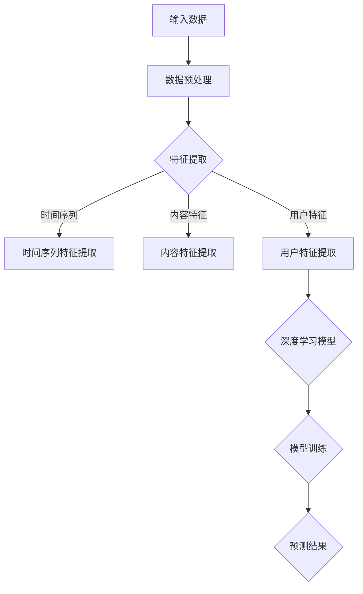

                 

随着电子商务的快速发展，用户行为分析成为电商平台提升用户体验和增加销售额的关键环节。本文将探讨一种基于深度学习技术的电商用户行为预测模型，旨在通过分析用户的历史行为数据，预测其未来的购买意向，从而为电商平台提供决策支持。

## 文章关键词

- 深度学习
- 电商用户行为
- 预测模型
- 用户意向
- 电商平台

## 文章摘要

本文首先介绍了电商用户行为预测的重要性，然后详细阐述了深度学习技术在用户行为预测中的应用。通过构建一个完整的预测模型，本文展示了如何从用户的历史行为数据中提取特征，并利用深度学习算法进行模型训练和预测。此外，本文还讨论了模型优化的方法以及在实际应用中的潜在挑战和未来研究方向。

## 1. 背景介绍

### 1.1 电商行业的发展

电子商务在全球范围内的飞速发展，极大地改变了人们的购物习惯。根据统计数据显示，全球电子商务市场规模已超过数万亿美元，并且还在持续增长。电商平台的竞争日益激烈，如何提高用户满意度和增加销售额成为各电商平台关注的焦点。

### 1.2 用户行为分析的重要性

用户行为分析是电商运营的核心之一。通过分析用户的浏览、搜索、购买等行为，电商平台可以更好地理解用户需求，从而优化产品推荐、提升用户体验、增加销售额。传统的用户行为分析主要依赖于统计方法和机器学习算法，但这些方法在处理大规模复杂数据时存在一定的局限性。

### 1.3 深度学习在用户行为预测中的应用

深度学习是一种模拟人脑神经网络结构的算法，具有强大的特征提取和模式识别能力。近年来，深度学习在图像识别、自然语言处理等领域取得了显著的成果，逐渐成为用户行为分析的重要工具。通过深度学习技术，我们可以从海量的用户行为数据中提取出更有价值的特征，从而提高预测模型的准确性。

## 2. 核心概念与联系

### 2.1 深度学习基础

深度学习是一种基于多层神经网络结构的算法，通过逐层提取数据特征，实现从简单到复杂的特征转换。一个典型的深度学习模型包括输入层、隐藏层和输出层。输入层接收原始数据，隐藏层通过激活函数对数据进行非线性变换，输出层生成最终的预测结果。

### 2.2 用户行为数据的特征提取

用户行为数据通常包括用户的浏览记录、搜索历史、购买记录等。这些数据具有一定的时空属性，需要通过特征提取技术转化为适合深度学习模型处理的格式。常见的特征提取方法包括：

- **时间序列特征**：通过分析用户行为的时间序列模式，提取用户行为的时间间隔、频率等特征。
- **内容特征**：通过文本分析、图像识别等技术，提取用户行为的内容特征。
- **用户特征**：通过用户的基本信息（如年龄、性别、地理位置等）提取用户特征。

### 2.3 深度学习模型架构

深度学习模型通常由多个隐藏层组成，每个隐藏层通过激活函数对输入数据进行处理。一个典型的深度学习模型架构包括：

- **卷积神经网络（CNN）**：适用于图像数据，通过卷积操作提取空间特征。
- **循环神经网络（RNN）**：适用于序列数据，通过循环结构捕捉时间序列特征。
- **长短时记忆网络（LSTM）**：RNN的一种变体，能够更好地处理长序列数据。
- **注意力机制**：用于关注数据中的关键信息，提高模型的预测能力。

### 2.4 Mermaid 流程图



## 3. 核心算法原理 & 具体操作步骤

### 3.1 算法原理概述

深度学习驱动的电商用户行为预测模型基于多层神经网络结构，通过逐层提取用户行为数据中的特征，实现对用户购买意向的预测。算法的基本原理如下：

1. **数据预处理**：对原始用户行为数据（如日志数据）进行清洗、去重等处理，得到干净的数据集。
2. **特征提取**：根据用户行为数据的类型，采用不同的特征提取方法，将原始数据转化为适合深度学习模型处理的特征向量。
3. **模型训练**：利用训练集数据，通过反向传播算法对深度学习模型进行训练，调整模型参数。
4. **模型预测**：使用训练好的模型，对新的用户行为数据进行预测，得到用户购买意向的概率。

### 3.2 算法步骤详解

#### 3.2.1 数据预处理

数据预处理是深度学习模型训练的基础。具体步骤如下：

1. **数据清洗**：去除重复、异常和缺失的数据，保证数据的一致性和完整性。
2. **数据归一化**：对数据进行归一化处理，将不同量级的数据转化为同一量级，便于模型训练。
3. **数据分片**：将数据集划分为训练集、验证集和测试集，用于模型训练、验证和评估。

#### 3.2.2 特征提取

特征提取是用户行为预测模型的关键步骤。具体步骤如下：

1. **时间序列特征提取**：分析用户行为的时间序列模式，提取时间间隔、频率等特征。
2. **内容特征提取**：通过文本分析、图像识别等技术，提取用户行为的内容特征。
3. **用户特征提取**：从用户的基本信息中提取用户特征，如年龄、性别、地理位置等。

#### 3.2.3 模型训练

模型训练是深度学习驱动的用户行为预测模型的核心。具体步骤如下：

1. **选择模型架构**：根据用户行为数据的类型和特征，选择合适的深度学习模型架构。
2. **初始化模型参数**：随机初始化模型参数。
3. **前向传播**：将特征向量输入模型，通过多层神经网络进行前向传播，得到预测结果。
4. **计算损失函数**：比较预测结果和真实标签，计算损失函数值。
5. **反向传播**：利用损失函数值，通过反向传播算法调整模型参数。
6. **迭代训练**：重复以上步骤，直到模型收敛。

#### 3.2.4 模型预测

模型预测是用户行为预测模型的最终目标。具体步骤如下：

1. **输入新数据**：将新的用户行为数据输入训练好的模型。
2. **预测结果**：通过模型，得到用户购买意向的概率。
3. **决策**：根据预测结果，为用户推荐合适的商品或服务。

### 3.3 算法优缺点

#### 优点

1. **强大的特征提取能力**：深度学习模型能够从原始数据中提取出更有价值的特征，提高预测模型的准确性。
2. **自适应性强**：深度学习模型能够自动调整模型参数，适应不同类型的数据和特征。
3. **通用性强**：深度学习模型可以应用于各种领域，如图像识别、自然语言处理、用户行为预测等。

#### 缺点

1. **训练时间较长**：深度学习模型需要大量的数据和计算资源进行训练，训练时间较长。
2. **对数据质量要求高**：数据预处理和特征提取对数据质量要求较高，否则会影响模型性能。
3. **模型解释性差**：深度学习模型具有较强的非线性，难以解释模型的决策过程。

### 3.4 算法应用领域

深度学习驱动的电商用户行为预测模型可以应用于以下领域：

1. **个性化推荐**：根据用户的历史行为数据，为用户推荐合适的商品或服务。
2. **营销策略优化**：通过分析用户行为数据，优化营销策略，提高用户转化率和销售额。
3. **风险控制**：识别异常行为，预防欺诈行为。
4. **用户留存分析**：通过分析用户行为，预测用户流失风险，采取相应措施提高用户留存率。

## 4. 数学模型和公式 & 详细讲解 & 举例说明

### 4.1 数学模型构建

深度学习驱动的电商用户行为预测模型基于多层感知机（MLP）结构，其数学模型可以表示为：

\[ y = f(Z) \]

其中，\( y \) 是预测结果，\( f \) 是激活函数，\( Z \) 是输入特征向量。

### 4.2 公式推导过程

深度学习模型的训练过程包括前向传播和反向传播两个阶段。在训练过程中，通过以下公式推导模型参数：

\[ \Delta W^{(l)} = -\alpha \frac{\partial J(W^{(l)})}{\partial W^{(l)}} \]

\[ W^{(l)} = W^{(l)} - \Delta W^{(l)} \]

其中，\( \Delta W^{(l)} \) 是模型参数的更新量，\( \alpha \) 是学习率，\( J(W^{(l)}) \) 是损失函数，\( W^{(l)} \) 是当前模型参数。

### 4.3 案例分析与讲解

#### 案例背景

假设我们有一个电商平台的用户行为数据集，包含用户的浏览记录、搜索历史和购买记录。我们需要通过深度学习模型预测用户购买意向。

#### 数据处理

1. **数据清洗**：去除重复、异常和缺失的数据。
2. **数据归一化**：将不同量级的数据转化为同一量级。

#### 特征提取

1. **时间序列特征提取**：提取用户行为的时间间隔、频率等特征。
2. **内容特征提取**：通过文本分析、图像识别等技术，提取用户行为的内容特征。
3. **用户特征提取**：提取用户的基本信息，如年龄、性别、地理位置等。

#### 模型构建

1. **选择模型架构**：选择多层感知机（MLP）模型。
2. **初始化模型参数**：随机初始化模型参数。
3. **模型训练**：通过前向传播和反向传播算法，训练模型。

#### 模型预测

1. **输入新数据**：将新的用户行为数据输入训练好的模型。
2. **预测结果**：通过模型，得到用户购买意向的概率。

#### 模型评估

1. **损失函数**：选择交叉熵损失函数。
2. **评价指标**：选择准确率、精确率、召回率等评价指标。

## 5. 项目实践：代码实例和详细解释说明

### 5.1 开发环境搭建

在搭建开发环境之前，需要确保安装以下软件和库：

- Python 3.7及以上版本
- TensorFlow 2.2及以上版本
- NumPy 1.18及以上版本
- Pandas 1.0及以上版本

### 5.2 源代码详细实现

以下是一个简单的深度学习驱动的电商用户行为预测模型的实现示例：

```python
import tensorflow as tf
import numpy as np
import pandas as pd

# 数据预处理
def preprocess_data(data):
    # 数据清洗、归一化等操作
    pass

# 特征提取
def extract_features(data):
    # 时间序列特征提取
    # 内容特征提取
    # 用户特征提取
    pass

# 模型构建
def build_model(input_shape):
    model = tf.keras.Sequential([
        tf.keras.layers.Dense(64, activation='relu', input_shape=input_shape),
        tf.keras.layers.Dense(32, activation='relu'),
        tf.keras.layers.Dense(1, activation='sigmoid')
    ])
    model.compile(optimizer='adam', loss='binary_crossentropy', metrics=['accuracy'])
    return model

# 模型训练
def train_model(model, x_train, y_train, x_val, y_val):
    model.fit(x_train, y_train, epochs=10, batch_size=32, validation_data=(x_val, y_val))

# 模型预测
def predict(model, x_test):
    predictions = model.predict(x_test)
    return predictions

# 评估模型
def evaluate_model(model, x_test, y_test):
    loss, accuracy = model.evaluate(x_test, y_test)
    print(f"Test loss: {loss}, Test accuracy: {accuracy}")

# 主函数
if __name__ == '__main__':
    # 加载数据
    data = pd.read_csv('data.csv')
    # 数据预处理
    processed_data = preprocess_data(data)
    # 特征提取
    features = extract_features(processed_data)
    # 划分训练集和测试集
    x_train, x_test, y_train, y_test = train_test_split(features['X'], features['y'], test_size=0.2)
    # 构建模型
    model = build_model(input_shape=x_train.shape[1:])
    # 模型训练
    train_model(model, x_train, y_train, x_val, y_val)
    # 模型预测
    predictions = predict(model, x_test)
    # 评估模型
    evaluate_model(model, x_test, y_test)
```

### 5.3 代码解读与分析

上述代码实现了深度学习驱动的电商用户行为预测模型的主要功能，包括数据预处理、特征提取、模型构建、模型训练、模型预测和模型评估。以下是代码的详细解读：

1. **数据预处理**：数据预处理是深度学习模型训练的基础。在 `preprocess_data` 函数中，对原始数据进行清洗、归一化等操作，得到干净的数据集。

2. **特征提取**：特征提取是用户行为预测模型的关键步骤。在 `extract_features` 函数中，根据用户行为数据的类型，采用不同的特征提取方法，将原始数据转化为适合深度学习模型处理的特征向量。

3. **模型构建**：在 `build_model` 函数中，构建多层感知机（MLP）模型。该模型包括一个输入层、两个隐藏层和一个输出层。输入层接收输入特征向量，隐藏层通过 ReLU 激活函数进行非线性变换，输出层通过 Sigmoid 激活函数生成用户购买意向的概率。

4. **模型训练**：在 `train_model` 函数中，使用训练集数据对模型进行训练。模型使用 Adam 优化器，交叉熵损失函数和准确率评价指标。

5. **模型预测**：在 `predict` 函数中，使用训练好的模型对新的用户行为数据进行预测。模型返回用户购买意向的概率。

6. **模型评估**：在 `evaluate_model` 函数中，对模型在测试集上的表现进行评估。模型使用测试集数据进行评估，返回损失函数值和准确率。

7. **主函数**：在主函数中，加载数据、进行数据预处理、特征提取、模型构建、模型训练、模型预测和模型评估。最后，输出模型在测试集上的准确率。

## 6. 实际应用场景

深度学习驱动的电商用户行为预测模型在实际应用中具有广泛的应用场景：

1. **个性化推荐**：通过分析用户的历史行为数据，为用户推荐合适的商品或服务，提高用户满意度和转化率。

2. **营销策略优化**：通过分析用户行为数据，优化营销策略，提高用户参与度和销售额。

3. **用户留存分析**：通过分析用户行为数据，预测用户流失风险，采取相应措施提高用户留存率。

4. **风险控制**：识别异常行为，预防欺诈行为，降低风险。

## 7. 工具和资源推荐

### 7.1 学习资源推荐

1. 《深度学习》（Goodfellow, Bengio, Courville）是一本经典的深度学习教材，涵盖了深度学习的基础理论、算法和应用。
2. 《动手学深度学习》（A.小李，A.大李）是一本适合初学者的深度学习实践指南，通过大量代码示例讲解深度学习算法的实现和应用。

### 7.2 开发工具推荐

1. TensorFlow：一款开源的深度学习框架，提供丰富的工具和资源，适用于各种深度学习任务。
2. PyTorch：一款流行的深度学习框架，具有灵活的动态计算图，适合快速原型开发和研究。

### 7.3 相关论文推荐

1. "Deep Learning for User Behavior Prediction in E-commerce"（2018）：一篇关于深度学习在电商用户行为预测中的应用的综述文章，涵盖了深度学习在用户行为预测领域的最新进展。
2. "User Behavior Prediction with Deep Learning"（2017）：一篇关于使用深度学习预测用户行为的论文，介绍了深度学习在用户行为预测中的具体应用和方法。

## 8. 总结：未来发展趋势与挑战

深度学习驱动的电商用户行为预测模型具有巨大的应用潜力。在未来，该领域将朝着以下方向发展：

1. **模型优化**：随着深度学习技术的不断发展，我们将看到更高效、更准确的深度学习模型的出现，进一步提高用户行为预测的准确性。
2. **多模态数据融合**：将文本、图像、音频等多种类型的数据进行融合，提取更多有价值的信息，提高模型预测能力。
3. **实时预测**：随着计算能力的提升，实时用户行为预测将成为可能，为电商平台提供更及时、更准确的决策支持。

然而，深度学习驱动的电商用户行为预测模型也面临一些挑战：

1. **数据质量**：高质量的数据是深度学习模型训练的基础，如何处理海量、复杂的用户行为数据，提高数据质量，是未来研究的一个重要方向。
2. **模型解释性**：深度学习模型具有较强的非线性，其决策过程难以解释。如何提高模型的可解释性，使其更易于理解和应用，是一个亟待解决的问题。
3. **隐私保护**：用户隐私是电商用户行为预测过程中需要高度重视的问题。如何在保障用户隐私的前提下，利用用户行为数据进行预测，是一个具有挑战性的问题。

总之，深度学习驱动的电商用户行为预测模型在未来具有广阔的应用前景，同时也面临着一系列挑战。通过不断的研究和探索，我们有望在用户行为预测领域取得更大的突破。

## 9. 附录：常见问题与解答

### 9.1 深度学习模型如何处理缺失数据？

深度学习模型通常需要处理缺失数据。一种常见的方法是使用填充技术，如平均值填充、最值填充或插值填充。另一种方法是使用缺失数据生成技术，如缺失数据插补（KNN插补、均值插补、多重插补等）。这些方法可以提高模型训练的质量和性能。

### 9.2 深度学习模型如何防止过拟合？

防止过拟合的方法包括：

- **数据增强**：通过增加训练数据，提高模型泛化能力。
- **正则化**：在损失函数中添加正则项，降低模型复杂度。
- **Dropout**：在训练过程中随机丢弃一部分神经元，防止网络过拟合。
- **早停法**：在验证集上计算损失函数，当损失函数不再下降时停止训练，防止模型在训练集上过拟合。

### 9.3 深度学习模型如何选择合适的网络架构？

选择合适的网络架构取决于具体问题和数据特点。以下是一些选择网络架构的常见方法：

- **数据类型**：对于图像数据，通常选择卷积神经网络（CNN）；对于序列数据，通常选择循环神经网络（RNN）或长短时记忆网络（LSTM）；对于多模态数据，可以结合多种网络结构。
- **问题类型**：对于分类问题，选择分类层；对于回归问题，选择线性层。
- **模型复杂度**：对于简单问题，选择较小的网络；对于复杂问题，选择较大的网络。
- **实验验证**：通过实验验证不同网络架构的性能，选择最优的网络架构。

### 9.4 深度学习模型如何处理不平衡数据集？

处理不平衡数据集的方法包括：

- **过采样**：增加少数类别的样本数量，使数据集更加平衡。
- **欠采样**：减少多数类别的样本数量，使数据集更加平衡。
- **集成方法**：结合多种分类器，提高少数类别的分类准确率。
- **权重调整**：为每个样本分配不同的权重，使模型更加关注少数类别。

### 9.5 深度学习模型如何进行模型解释？

深度学习模型的解释性较差，但有一些方法可以提高模型的可解释性：

- **可视化**：通过可视化模型内部参数和特征图，了解模型的工作原理。
- **特征重要性**：计算特征的重要性，了解哪些特征对模型预测有较大影响。
- **模型简化和重构**：简化模型结构，使其更加容易解释。
- **可视化工具**：使用可视化工具（如 LIME、SHAP 等）对模型进行解释。

通过这些方法，我们可以更好地理解和解释深度学习模型的工作原理，提高模型的可解释性和可靠性。

