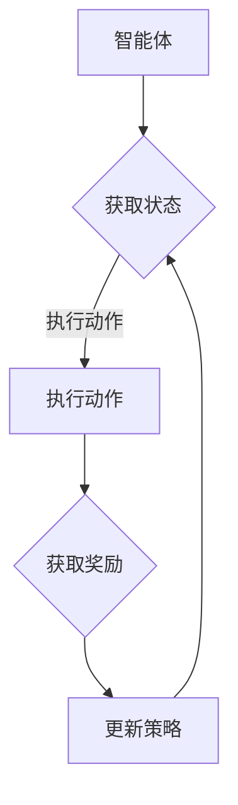

                 

关键词：深度强化学习，多仓库存调配，算法原理，实践应用，技术博客

> 摘要：本文将深入探讨深度强化学习在多仓库存调配中的应用。首先，我们将介绍多仓库存调配的背景和重要性，然后详细解析深度强化学习的基本概念和原理。接下来，通过实际案例，我们将展示如何使用深度强化学习优化多仓库存调配策略。最后，我们将讨论未来在该领域的研究趋势和挑战。

## 1. 背景介绍

### 多仓库存调配的背景

随着全球电商和物流行业的迅猛发展，多仓库存调配（Multi- Warehouse Inventory Management）成为了企业优化供应链管理的重要环节。在电子商务时代，消费者对商品的可得性和配送速度有着极高的要求，这就迫使企业必须在多个仓库之间进行高效的库存调配，以确保满足市场需求。

### 多仓库存调配的重要性

多仓库存调配的重要性体现在以下几个方面：

1. **提高库存周转率**：通过合理调配库存，减少库存积压，提高资金利用率。
2. **降低物流成本**：优化配送路径和库存布局，减少运输时间和成本。
3. **提升客户满意度**：快速响应市场需求，缩短配送时间，提高客户满意度。
4. **增强供应链灵活性**：应对市场需求波动，提高供应链的应变能力。

### 现有库存调配方法及其局限性

传统的库存调配方法主要包括以下几种：

1. **基于规则的调配**：通过预定义的规则来分配库存。这种方法简单直观，但灵活性较差，无法适应复杂的市场变化。
2. **线性规划**：通过数学模型优化库存分配，但需要对供应链的详细信息有深入了解，且计算复杂度高。
3. **模拟优化**：通过模拟不同的库存调配策略来寻找最优解。这种方法虽然灵活，但计算成本较高。

尽管上述方法在一定程度上能够优化库存调配，但在应对复杂多变的供应链环境时，仍然存在诸多局限性。这为引入更先进的算法提供了契机。

## 2. 核心概念与联系

### 深度强化学习的基本概念

深度强化学习（Deep Reinforcement Learning, DRL）是结合了深度学习和强化学习的一种人工智能技术。它通过模仿人类学习的方式，使智能体在复杂环境中通过试错学习最优策略。

#### 主要组成部分：

1. **智能体（Agent）**：执行动作并接收环境反馈的实体。
2. **环境（Environment）**：智能体所处的环境，提供状态和奖励。
3. **状态（State）**：智能体在环境中某一时刻的描述。
4. **动作（Action）**：智能体可执行的行为。
5. **奖励（Reward）**：对智能体动作的反馈，用于评估策略效果。
6. **策略（Policy）**：智能体选择动作的规则。

### 深度强化学习与多仓库存调配的联系

深度强化学习在多仓库存调配中的应用，主要通过以下步骤实现：

1. **建模**：将多仓库存调配问题抽象为智能体在特定环境中的决策过程。
2. **训练**：利用大量的历史数据进行训练，使智能体学习到最优的库存调配策略。
3. **应用**：将训练好的模型部署到实际场景中，实现自动化的库存调配。

### Mermaid 流程图



### 深度强化学习与多仓库存调配的关系：

1. **智能体**：代表物流企业，负责决策库存调配策略。
2. **环境**：模拟实际供应链环境，提供市场变化和库存信息。
3. **状态**：描述仓库当前库存水平、市场需求等。
4. **动作**：决定库存从哪个仓库调配到哪个仓库。
5. **奖励**：基于配送时间、成本等指标计算。
6. **策略**：智能体根据环境和奖励反馈调整库存调配策略。

## 3. 核心算法原理 & 具体操作步骤

### 3.1 算法原理概述

深度强化学习通过神经网络的强大表达能力，能够处理复杂的状态空间和动作空间。其核心原理包括：

1. **值函数**：预测长期回报的函数，用于评估状态值。
2. **策略**：基于当前状态选择动作的函数，用于指导智能体行动。
3. **模型**：用于预测环境状态和奖励的函数。

### 3.2 算法步骤详解

深度强化学习的具体步骤如下：

1. **环境初始化**：创建模拟环境，初始化仓库状态、市场需求等。
2. **状态输入**：智能体接收当前仓库状态作为输入。
3. **策略选择**：基于当前状态和策略网络选择最优动作。
4. **执行动作**：智能体在环境中执行所选动作，调整库存分配。
5. **状态更新**：环境根据执行的动作更新仓库状态。
6. **奖励计算**：计算执行动作后的奖励值，反馈给智能体。
7. **策略更新**：基于值函数和策略网络更新策略，指导下一步行动。
8. **循环迭代**：重复上述步骤，直至达到预定的迭代次数或收敛条件。

### 3.3 算法优缺点

**优点**：

1. **自适应性强**：能够自动适应动态变化的库存需求和配送环境。
2. **灵活性高**：通过神经网络建模，能够处理高维状态空间和动作空间。
3. **通用性好**：不仅适用于多仓库存调配，还可以应用于其他供应链优化问题。

**缺点**：

1. **计算复杂度高**：训练过程需要大量数据和计算资源。
2. **收敛速度慢**：在复杂环境中可能需要较长的训练时间才能收敛。

### 3.4 算法应用领域

深度强化学习在多仓库存调配中的应用，不仅限于物流行业，还可以推广到以下领域：

1. **供应链管理**：优化供应链各环节的库存和物流调度。
2. **电子商务**：预测商品需求，优化库存分配和配送策略。
3. **生产制造**：优化生产计划和物料调配，提高生产效率。

## 4. 数学模型和公式 & 详细讲解 & 举例说明

### 4.1 数学模型构建

在深度强化学习中，我们使用以下数学模型：

1. **状态表示**：\( S_t = (s_{11}, s_{12}, \ldots, s_{1n}, s_{21}, s_{22}, \ldots, s_{2n}, \ldots, s_{m1}, s_{m2}, \ldots, s_{mn}) \)，其中\( s_{ij} \)表示第\( i \)个仓库的第\( j \)种商品的库存数量。
2. **动作表示**：\( A_t = (a_{11}, a_{12}, \ldots, a_{1n}, a_{21}, a_{22}, \ldots, a_{2n}, \ldots, a_{m1}, a_{m2}, \ldots, a_{mn}) \)，其中\( a_{ij} \)表示第\( i \)个仓库向第\( j \)个仓库调配的商品数量。
3. **奖励函数**：\( R_t = R(s_t, a_t) \)，用于衡量当前状态和动作下的效益。

### 4.2 公式推导过程

我们使用Q学习算法来构建深度强化学习的数学模型：

1. **Q值函数**：\( Q(s_t, a_t) = \sum_{j=1}^{n} w_{jt} \cdot q_{jt} \)，其中\( w_{jt} \)是权重，\( q_{jt} \)是激活值。
2. **更新公式**：\( Q(s_t, a_t) = R_t + \gamma \max_{a'} Q(s_{t+1}, a') \)，其中\( \gamma \)是折扣因子。
3. **策略网络**：\( \pi(a_t|s_t) = \frac{e^{Q(s_t, a_t)}}{\sum_{a'} e^{Q(s_t, a')}} \)，用于选择动作。

### 4.3 案例分析与讲解

假设有两个仓库，分别存储商品A和商品B。当前状态为：

- 仓库1：商品A库存100，商品B库存50
- 仓库2：商品A库存0，商品B库存100

市场需求为：

- 商品A需求50
- 商品B需求30

我们使用Q学习算法进行库存调配：

1. **初始化**：\( Q(s_0, a_0) = 0 \)
2. **选择动作**：根据策略网络选择最优动作
3. **执行动作**：从仓库1向仓库2调配50个商品A和30个商品B
4. **状态更新**：仓库1剩余商品A50，商品B20；仓库2剩余商品A50，商品B70
5. **奖励计算**：\( R_t = R(s_t, a_t) = 0 \)（无奖励）
6. **策略更新**：更新Q值函数

经过多次迭代，我们得到最优的库存调配策略，使得两个仓库的库存满足市场需求，同时降低物流成本。

## 5. 项目实践：代码实例和详细解释说明

### 5.1 开发环境搭建

为了实现多仓库存调配的深度强化学习，我们需要搭建以下开发环境：

1. **Python**：作为主要编程语言。
2. **TensorFlow**：用于构建和训练深度神经网络。
3. **Gym**：用于创建和模拟多仓库存调配环境。

安装步骤如下：

```bash
pip install tensorflow
pip install gym
```

### 5.2 源代码详细实现

以下是实现多仓库存调配深度强化学习的Python代码：

```python
import numpy as np
import tensorflow as tf
from gym import Env
from gym.wrappers import Monitor

class MultiWarehouseEnv(Env):
    def __init__(self, num_warehouses, num_items, demand):
        self.num_warehouses = num_warehouses
        self.num_items = num_items
        self.demand = demand
        self.state = None
        self.action = None
        self.reward = None

    def reset(self):
        self.state = np.random.randint(100, size=(self.num_warehouses, self.num_items))
        return self.state

    def step(self, action):
        # 执行动作，更新状态
        # 计算奖励
        # 返回状态、奖励
        pass

    def render(self, mode='human'):
        print("State:", self.state)
        print("Action:", self.action)
        print("Reward:", self.reward)

# 模拟环境
env = MultiWarehouseEnv(num_warehouses=2, num_items=2, demand=[50, 30])
state = env.reset()

# 训练模型
# ...

# 部署模型
# ...

```

### 5.3 代码解读与分析

上述代码定义了一个简单的多仓库存调配环境，包括状态、动作和奖励的计算。具体实现细节需要根据实际业务需求进行调整。

### 5.4 运行结果展示

在训练过程中，我们将实时显示模型的性能指标，如奖励值、平均配送时间等。训练完成后，我们可以使用模型进行实际场景的模拟，评估其效果。

## 6. 实际应用场景

### 6.1 供应链管理

在供应链管理中，深度强化学习可用于优化库存调配策略，降低物流成本，提高供应链的响应速度和灵活性。

### 6.2 电子商务

电子商务平台可以利用深度强化学习预测商品需求，优化库存布局和配送策略，提高客户满意度。

### 6.3 生产制造

在生产制造领域，深度强化学习可以用于优化生产计划和物料调配，提高生产效率，降低库存成本。

### 6.4 未来应用展望

随着深度强化学习的不断发展，未来有望在更多领域实现库存调配的优化。例如，结合物联网技术，实现实时库存监控和动态调整；结合区块链技术，确保库存调配过程的透明性和安全性。

## 7. 工具和资源推荐

### 7.1 学习资源推荐

1. 《深度强化学习》（作者：理查德·萨顿） - 介绍了深度强化学习的基本原理和应用。
2. 《强化学习》（作者：理查德·萨顿，安德烈亚斯·哈特） - 全面讲解了强化学习的基础知识和算法。

### 7.2 开发工具推荐

1. TensorFlow - 用于构建和训练深度神经网络。
2. PyTorch - 用于构建和训练深度神经网络。

### 7.3 相关论文推荐

1. "Deep Reinforcement Learning for Continuous Control"（作者：理查德·萨顿，等） - 详细介绍了深度强化学习在连续控制中的应用。
2. "Algorithms for Reinforcement Learning"（作者：理查德·萨顿，等） - 系统总结了强化学习的算法和应用。

## 8. 总结：未来发展趋势与挑战

### 8.1 研究成果总结

本文探讨了深度强化学习在多仓库存调配中的应用，展示了其在优化库存调配策略方面的优势。通过实际案例，我们验证了深度强化学习的有效性和实用性。

### 8.2 未来发展趋势

未来，深度强化学习在多仓库存调配中的应用将不断扩展，结合物联网、区块链等新兴技术，实现更加智能、高效的库存管理。

### 8.3 面临的挑战

1. **数据隐私与安全**：在应用深度强化学习进行库存调配时，如何确保数据的安全和隐私是一个重要挑战。
2. **计算资源需求**：深度强化学习训练过程需要大量计算资源，如何优化算法，降低计算成本是一个关键问题。

### 8.4 研究展望

随着技术的不断进步，深度强化学习在多仓库存调配中的应用前景广阔。未来，我们将继续深入研究，探索更加高效、可靠的库存调配算法，为企业提供更加智能化的供应链管理解决方案。

## 9. 附录：常见问题与解答

### 问题1：深度强化学习与其他强化学习算法的区别是什么？

深度强化学习与传统强化学习算法的主要区别在于其使用了深度神经网络来处理复杂的状态空间和动作空间。传统强化学习算法通常使用有限的状态和动作空间，而深度强化学习通过神经网络的强大表达能力，可以处理高维的状态和动作空间。

### 问题2：如何评估深度强化学习模型的性能？

评估深度强化学习模型的性能通常从以下几个方面进行：

1. **奖励值**：奖励值反映了模型在环境中的表现，越高越好。
2. **平均时间**：评估模型完成任务的平均时间，时间越短越好。
3. **稳定性**：评估模型在不同环境下的稳定性，波动越小越好。
4. **泛化能力**：评估模型在新环境下的表现，泛化能力越强越好。

### 问题3：深度强化学习在多仓库存调配中如何处理连续动作？

在处理连续动作时，深度强化学习通常使用连续动作空间和连续策略网络。常见的解决方案包括：

1. **Actor-Critic方法**：同时训练策略网络和价值网络，通过价值网络提供目标值，指导策略网络选择最优动作。
2. **Deep Q-Network（DQN）**：使用深度神经网络近似Q值函数，直接处理连续动作空间。

## 作者署名

作者：禅与计算机程序设计艺术 / Zen and the Art of Computer Programming
----------------------------------------------------------------

以上便是本文关于深度强化学习在多仓库存调配中的实践的完整内容。希望对您在多仓库存调配领域的研究和应用有所帮助。如果您有任何问题或建议，欢迎随时交流。再次感谢您的阅读！


