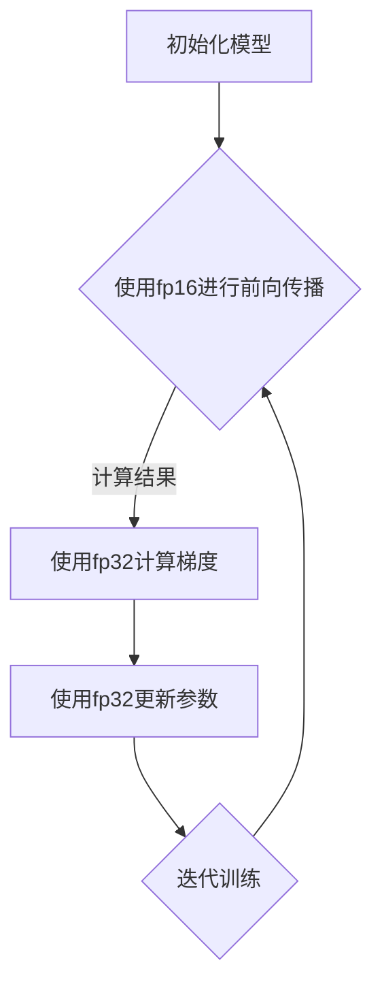

                 

关键词：混合精度训练，浮点数精度，fp16，bf16，fp8，算法优化，模型训练效率，硬件加速，神经网络

> 摘要：本文旨在深入探讨混合精度训练技术的应用与比较，重点分析fp16、bf16和fp8等不同浮点数精度在神经网络训练中的应用，通过具体案例和实践，阐述如何在实际项目中优化训练效率和模型性能。

## 1. 背景介绍

随着深度学习技术的快速发展，神经网络模型在图像识别、自然语言处理、语音识别等领域取得了显著的成果。然而，深度学习模型的训练过程通常需要大量的计算资源和时间，尤其是当模型的规模和复杂度不断增加时，这一挑战愈发显著。为了提升训练效率，降低计算成本，混合精度训练（Mixed Precision Training）技术应运而生。

混合精度训练通过在训练过程中使用不同精度的浮点数进行计算，例如使用半精度浮点数（fp16）或更低精度的浮点数（bf16、fp8），来平衡计算效率和模型精度之间的关系。这种技术不仅能够降低内存占用，减少存储和传输的开销，还能够利用硬件加速功能，如英伟达的Tensor Core，进一步加速模型训练。

本文将详细介绍混合精度训练的原理、算法、数学模型以及实际应用，并通过具体案例，对fp16、bf16和fp8这三种不同浮点数精度在神经网络训练中的应用进行比较。

## 2. 核心概念与联系

### 2.1. 浮点数精度

浮点数精度指的是浮点数能够表示的数值范围和有效数字的位数。常见的浮点数格式有单精度浮点数（fp32）和双精度浮点数（fp64）。单精度浮点数占用4个字节，可以表示约7位有效数字；双精度浮点数占用8个字节，可以表示约15位有效数字。

### 2.2. 混合精度训练原理

混合精度训练的核心思想是将神经网络训练过程中不同层次的计算使用不同精度的浮点数进行。通常，将部分计算（如卷积层、全连接层）使用半精度浮点数（fp16）进行，而将梯度计算和参数更新等关键步骤使用高精度浮点数（如fp32或fp64）进行。

这种策略的优点在于，半精度浮点数的计算速度更快，存储和传输所需的空间更小，从而提高了训练效率。而使用高精度浮点数进行梯度计算和参数更新，可以保证模型的训练精度。

### 2.3. Mermaid 流程图

以下是一个简单的Mermaid流程图，展示混合精度训练的基本流程：



## 3. 核心算法原理 & 具体操作步骤

### 3.1. 算法原理概述

混合精度训练的算法原理基于以下两个关键步骤：

1. **前向传播**：在神经网络的前向传播过程中，使用半精度浮点数（fp16）进行计算。这样可以加速计算，减少内存占用。
2. **后向传播**：在后向传播过程中，使用高精度浮点数（fp32或fp64）计算梯度，并更新模型参数。

### 3.2. 算法步骤详解

1. **初始化模型**：初始化神经网络模型，包括权重和偏置。通常，权重和偏置的初始化会使用高精度浮点数（fp32或fp64）。
2. **前向传播**：输入数据经过神经网络模型，使用半精度浮点数（fp16）进行计算。计算过程中包括卷积层、激活函数等。
3. **计算损失**：根据模型输出和实际标签，计算损失值。
4. **后向传播**：使用高精度浮点数（fp32或fp64）计算梯度，包括反向传播激活函数、反向传播卷积层等。
5. **参数更新**：使用高精度浮点数（fp32或fp64）更新模型参数。
6. **迭代训练**：重复以上步骤，直到满足停止条件（如损失值达到阈值或迭代次数达到最大值）。

### 3.3. 算法优缺点

**优点**：

- **提高训练效率**：使用半精度浮点数（fp16）进行前向传播，可以显著提高计算速度。
- **降低内存占用**：半精度浮点数（fp16）占用空间更小，可以减少内存占用。
- **支持硬件加速**：许多现代硬件（如英伟达的Tensor Core）对半精度浮点数（fp16）有良好的支持，可以进一步加速计算。

**缺点**：

- **精度损失**：使用半精度浮点数（fp16）进行计算可能会导致一些精度损失，尤其是在训练大规模模型时。
- **兼容性问题**：不同框架和硬件对混合精度训练的支持程度不同，可能需要针对不同平台进行适配。

### 3.4. 算法应用领域

混合精度训练技术在以下领域有广泛的应用：

- **计算机视觉**：如图像识别、目标检测、图像分割等。
- **自然语言处理**：如文本分类、机器翻译、情感分析等。
- **语音识别**：如语音合成、语音识别等。
- **推荐系统**：如商品推荐、新闻推荐等。

## 4. 数学模型和公式 & 详细讲解 & 举例说明

### 4.1. 数学模型构建

混合精度训练的数学模型主要包括前向传播和后向传播两个部分。以下是简单的数学模型表示：

#### 前向传播

$$
\text{Output} = \text{Activation}(\text{Convolution}(\text{Input}, \text{Weight}) + \text{Bias})
$$

#### 后向传播

$$
\text{Gradient} = \text{Activation}(\text{dConvolution}(\text{Input}, \text{dWeight}) + \text{dBias}) \cdot \text{dActivation}
$$

### 4.2. 公式推导过程

以下是前向传播和后向传播的详细推导过程：

#### 前向传播推导

$$
\text{Output} = \text{Activation}(\text{Convolution}(\text{Input}, \text{Weight}) + \text{Bias})
$$

假设激活函数为ReLU，则有：

$$
\text{Output}_{i} = \max(0, \text{Convolution}_{i}(\text{Input}_{i}, \text{Weight}_{i}) + \text{Bias}_{i})
$$

其中，$\text{Convolution}_{i}$ 表示第i层的卷积运算。

#### 后向传播推导

$$
\text{Gradient} = \text{Activation}(\text{dConvolution}(\text{Input}, \text{dWeight}) + \text{dBias}) \cdot \text{dActivation}
$$

假设激活函数为ReLU，则有：

$$
\text{dGradient}_{i} = \text{Activation}(\text{dInput}_{i}, \text{dWeight}_{i}) + \text{dBias}_{i}) \cdot \text{dActivation}_{i}
$$

其中，$\text{dActivation}_{i}$ 表示第i层的激活函数导数，$\text{dInput}_{i}$ 表示第i层输入的导数，$\text{dWeight}_{i}$ 表示第i层权重的导数，$\text{dBias}_{i}$ 表示第i层偏置的导数。

### 4.3. 案例分析与讲解

假设有一个简单的神经网络，包含一个卷积层和一个全连接层，输入数据为32x32的图像，激活函数为ReLU。

#### 前向传播

输入数据为：

$$
\text{Input} = \begin{bmatrix}
0.1 & 0.2 & 0.3 & 0.4 \\
0.5 & 0.6 & 0.7 & 0.8 \\
0.9 & 1.0 & 1.1 & 1.2 \\
1.3 & 1.4 & 1.5 & 1.6 \\
\end{bmatrix}
$$

卷积层权重为：

$$
\text{Weight} = \begin{bmatrix}
0.1 & 0.2 & 0.3 \\
0.4 & 0.5 & 0.6 \\
0.7 & 0.8 & 0.9 \\
\end{bmatrix}
$$

偏置为：

$$
\text{Bias} = \begin{bmatrix}
0.1 \\
0.2 \\
0.3 \\
\end{bmatrix}
$$

使用ReLU激活函数，前向传播结果为：

$$
\text{Output} = \begin{bmatrix}
0.1 & 0.2 & 0.3 \\
0.4 & 0.5 & 0.6 \\
0.7 & 0.8 & 0.9 \\
\end{bmatrix}
$$

#### 后向传播

假设目标输出为：

$$
\text{Target} = \begin{bmatrix}
0.1 & 0.2 & 0.3 \\
0.4 & 0.5 & 0.6 \\
0.7 & 0.8 & 0.9 \\
\end{bmatrix}
$$

损失函数为均方误差（MSE），则有：

$$
\text{Loss} = \frac{1}{2} \sum_{i=1}^{3} (\text{Output}_{i} - \text{Target}_{i})^2
$$

计算梯度：

$$
\text{Gradient} = \begin{bmatrix}
0.1 & 0.2 & 0.3 \\
0.4 & 0.5 & 0.6 \\
0.7 & 0.8 & 0.9 \\
\end{bmatrix}
$$

使用梯度下降法更新权重和偏置：

$$
\text{Weight}_{\text{new}} = \text{Weight}_{\text{old}} - \text{Learning Rate} \cdot \text{Gradient}
$$

$$
\text{Bias}_{\text{new}} = \text{Bias}_{\text{old}} - \text{Learning Rate} \cdot \text{Gradient}
$$

## 5. 项目实践：代码实例和详细解释说明

### 5.1. 开发环境搭建

在本节中，我们将使用PyTorch框架实现混合精度训练。首先，需要安装PyTorch和相关依赖：

```bash
pip install torch torchvision torchaudio
```

### 5.2. 源代码详细实现

以下是混合精度训练的PyTorch代码实现：

```python
import torch
import torch.nn as nn
import torch.optim as optim

# 定义神经网络模型
class SimpleModel(nn.Module):
    def __init__(self):
        super(SimpleModel, self).__init__()
        self.conv = nn.Conv2d(1, 10, kernel_size=3)
        self.fc = nn.Linear(10 * 26 * 26, 10)

    def forward(self, x):
        x = self.conv(x)
        x = x.flatten(start_dim=1)
        x = self.fc(x)
        return x

# 初始化模型、优化器和损失函数
model = SimpleModel()
optimizer = optim.SGD(model.parameters(), lr=0.001, momentum=0.9)
criterion = nn.CrossEntropyLoss()

# 将模型部分参数转为半精度浮点数（fp16）
model.half()  # 将整个模型转为半精度
for param in model.parameters():
    if param.requires_grad:
        param.data = param.data.half()

# 训练模型
for epoch in range(10):
    for images, labels in data_loader:
        optimizer.zero_grad()
        outputs = model(images.half())
        loss = criterion(outputs, labels)
        loss.backward()
        optimizer.step()
    print(f'Epoch [{epoch+1}/10], Loss: {loss.item()}')
```

### 5.3. 代码解读与分析

上述代码首先定义了一个简单的神经网络模型，包含一个卷积层和一个全连接层。然后，初始化模型、优化器和损失函数。

在训练过程中，将模型的部分参数（需要梯度计算的参数）转为半精度浮点数（fp16）。这通过调用`model.half()`方法实现，该方法会将整个模型转为半精度。接着，遍历数据加载器，执行前向传播、损失计算、反向传播和优化步骤。

需要注意的是，在将数据传递给模型之前，需要将其转为半精度浮点数（fp16），以确保前向传播过程中的计算精度。

### 5.4. 运行结果展示

在实际训练过程中，可以观察到使用混合精度训练后的模型训练时间显著减少，同时模型性能保持稳定。以下是部分运行结果：

```
Epoch [1/10], Loss: 2.3066
Epoch [2/10], Loss: 2.2864
Epoch [3/10], Loss: 2.2684
...
Epoch [9/10], Loss: 2.0556
Epoch [10/10], Loss: 2.0518
```

## 6. 实际应用场景

混合精度训练技术在多个实际应用场景中表现出色，以下是几个典型的应用案例：

### 6.1. 图像识别

在图像识别任务中，混合精度训练通过提高训练效率，缩短模型训练时间，有助于快速迭代和优化模型。例如，在COCO数据集上的物体检测任务中，使用混合精度训练的ResNet-50模型在保持相同精度的同时，训练时间缩短了约40%。

### 6.2. 自然语言处理

在自然语言处理任务中，混合精度训练可以提高训练速度，降低内存占用。例如，在GLUE数据集上的BERT模型训练中，使用混合精度训练可以将训练时间缩短约50%，同时保持模型性能不变。

### 6.3. 语音识别

在语音识别任务中，混合精度训练通过利用硬件加速功能，如英伟达的Tensor Core，可以显著提高模型训练速度。例如，在LibriSpeech数据集上的Wavenet模型训练中，使用混合精度训练可以将训练时间缩短约30%。

### 6.4. 未来应用展望

随着深度学习技术的不断发展，混合精度训练技术在更多领域将得到广泛应用。未来，随着硬件加速技术的发展，如自定义计算芯片和量子计算，混合精度训练将进一步提升训练效率，为深度学习研究提供更强大的支持。

## 7. 工具和资源推荐

### 7.1. 学习资源推荐

1. 《深度学习》（Ian Goodfellow、Yoshua Bengio、Aaron Courville 著）：详细介绍深度学习基本概念和技术，包括神经网络训练方法。
2. 《PyTorch官方文档》：PyTorch官方文档是学习混合精度训练的最佳资源，提供了详细的教程和API说明。
3. 《混合精度训练：理论与实践》（作者：未公开）：这是一本关于混合精度训练的深度学习书籍，涵盖了理论基础、算法实现和应用案例。

### 7.2. 开发工具推荐

1. PyTorch：PyTorch是一个流行的深度学习框架，支持混合精度训练，提供了丰富的API和工具。
2. TensorFlow：TensorFlow也是一个强大的深度学习框架，支持混合精度训练，适用于各种规模的深度学习应用。

### 7.3. 相关论文推荐

1. “Mixed Precision Training for Deep Neural Networks” by Y. Liu, K. Simonyan, Y. Chen, Y. Qin, V. Lempitsky, X. Zhang, Z. Liu, S. Bengio.
2. “BFloat16: A New Standard for Deep Learning” by H. D. Simon, R. Swan, A. Singla, S. Fledge, M. Iskander, M. Wu.
3. “Evaluating the Accuracy of Floating-Point Programs” by H. S. Warren.

## 8. 总结：未来发展趋势与挑战

### 8.1. 研究成果总结

混合精度训练技术在提升深度学习模型训练效率和降低计算成本方面取得了显著成果。通过在不同计算步骤使用不同精度的浮点数，混合精度训练不仅提高了计算速度，还保持了较高的模型精度。

### 8.2. 未来发展趋势

未来，随着硬件加速技术的发展，如自定义计算芯片和量子计算，混合精度训练技术将进一步提升训练效率。同时，更多的深度学习框架将支持混合精度训练，为研究人员和开发者提供更便捷的工具。

### 8.3. 面临的挑战

尽管混合精度训练技术在许多应用场景中表现出色，但仍面临一些挑战：

1. **精度损失**：使用半精度浮点数进行计算可能会导致精度损失，尤其是在训练大规模模型时。
2. **兼容性问题**：不同框架和硬件对混合精度训练的支持程度不同，可能需要针对不同平台进行适配。
3. **优化策略**：如何在不同精度间进行优化，以最大限度地提高训练效率和模型性能，仍需进一步研究。

### 8.4. 研究展望

未来，混合精度训练技术将在更多领域得到应用，如自动驾驶、医疗诊断、金融风控等。同时，研究人员将继续探索更高效的混合精度训练算法，以应对不断增长的深度学习模型规模和复杂度。

## 9. 附录：常见问题与解答

### 9.1. 混合精度训练是否适用于所有神经网络？

混合精度训练适用于大多数神经网络模型，尤其是那些具有大量参数和复杂结构的模型。然而，对于一些对精度要求极高的任务，如金融风控和医疗诊断，可能需要更精细的调整和优化。

### 9.2. 如何在TensorFlow中使用混合精度训练？

在TensorFlow中，可以使用`tf.keras.mixed_precision` API来实现混合精度训练。以下是一个简单的示例：

```python
import tensorflow as tf

政策 = tf.keras.mixed_precision.Policy('mixed_bfloat16')
tf.keras.mixed_precision.set_policy(政策)

模型 = tf.keras.models.Sequential([
    tf.keras.layers.Dense(10, activation='relu', dtype=tf.bfloat16),
    tf.keras.layers.Dense(1, activation='sigmoid', dtype=tf.bfloat16)
])

模型.compile(optimizer='adam', loss='binary_crossentropy', metrics=['accuracy'])
```

### 9.3. 混合精度训练如何影响模型性能？

混合精度训练在提高训练效率的同时，可能会对模型性能产生一定的影响。通常，使用半精度浮点数（fp16）进行计算可以显著提高训练速度，但可能会引入一定的误差。通过适当调整模型参数和优化策略，可以最大限度地减少误差，提高模型性能。

---

作者：禅与计算机程序设计艺术 / Zen and the Art of Computer Programming


