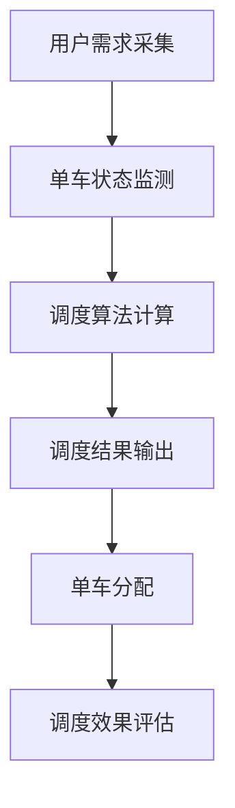

                 

关键词：滴滴、共享单车、调度优化、算法面试、校招、深度学习、机器学习、动态规划、数学模型

摘要：本文详细解析了滴滴2024年共享单车调度校招优化算法面试题，涵盖了核心概念、算法原理、数学模型及实际应用等多个方面。文章旨在为求职者提供深入理解和实践共享单车调度算法的方法，帮助他们在面试中脱颖而出。

## 1. 背景介绍

共享单车作为城市绿色出行的代表，已经成为人们日常通勤的重要方式。然而，随着使用量的增加，如何高效地调度和管理共享单车成为了一个亟待解决的问题。滴滴出行，作为共享单车领域的领军企业，每年都会在校园招聘中推出一系列优化算法面试题，旨在考查求职者对共享单车调度问题的理解和解决能力。

本文将围绕滴滴2024年共享单车调度校招优化算法面试题进行详细分析，帮助读者深入了解该问题的核心概念、算法原理以及实际应用。

## 2. 核心概念与联系

为了更好地理解共享单车调度问题，我们首先需要明确以下几个核心概念：

- **单车的状态**：单车是否在维护、是否可用、是否正在使用等。
- **用户需求**：用户的出行起点、终点、出行时间等。
- **交通流量**：某一时间段内，某个区域单车的流动情况。

下面是共享单车调度系统的基本架构，通过Mermaid流程图展示：



### 2.1. 用户需求采集

用户需求采集是调度系统的第一步，主要涉及以下几个步骤：

1. **数据采集**：通过滴滴APP或其他平台获取用户的出行需求信息，包括起点、终点、出行时间等。
2. **需求预处理**：对采集到的数据进行清洗、去重和过滤，确保数据的准确性和有效性。
3. **需求预测**：利用历史数据和机器学习模型，预测未来的用户出行需求。

### 2.2. 单车状态监测

单车状态监测是调度系统的核心，主要包括以下几个步骤：

1. **单车位置定位**：通过GPS等技术实时获取单车的位置信息。
2. **单车状态判断**：判断单车是否在维护、是否可用、是否正在使用等。
3. **交通流量分析**：对单车流动情况进行实时监控和分析。

### 2.3. 调度算法计算

调度算法计算是调度系统的核心环节，旨在根据用户需求和单车状态，计算出最优的调度方案。常见的调度算法包括：

1. **动态规划**：通过动态规划算法，计算从起点到终点所需的最小代价路径。
2. **遗传算法**：利用遗传算法的进化过程，找到最优的单车分配方案。
3. **深度学习**：利用深度学习模型，预测未来的单车流动情况，进行优化调度。

### 2.4. 调度结果输出

调度结果输出是将计算得到的最优调度方案，通过滴滴APP或其他平台告知用户。主要包括以下几个步骤：

1. **调度方案生成**：根据调度算法计算的结果，生成具体的调度方案。
2. **方案验证**：对生成的调度方案进行验证，确保方案的可行性和最优性。
3. **调度方案发布**：将调度方案发布给用户，供用户进行选择。

### 2.5. 单车分配

单车分配是将调度方案中的单车分配到具体的用户需求上。主要包括以下几个步骤：

1. **单车选择**：根据用户需求和单车状态，选择最合适的单车。
2. **单车分配**：将单车分配到用户需求上，确保单车的利用效率。
3. **反馈调整**：根据用户反馈，对单车分配方案进行调整。

### 2.6. 调度效果评估

调度效果评估是对调度系统的实际运行效果进行评估，主要包括以下几个步骤：

1. **效果指标计算**：计算调度效果的各项指标，如完成率、响应时间等。
2. **效果分析**：对调度效果进行分析，找出存在的问题和改进方向。
3. **持续优化**：根据效果分析结果，对调度算法和系统进行持续优化。

## 3. 核心算法原理 & 具体操作步骤

### 3.1 算法原理概述

在共享单车调度中，核心算法主要涉及动态规划、遗传算法和深度学习等。以下是这些算法的基本原理概述：

1. **动态规划**：动态规划是一种递归求解问题的方法，通过将问题分解为子问题，并利用子问题的解来构建原问题的解。在共享单车调度中，动态规划可以用来计算从起点到终点所需的最小代价路径。

2. **遗传算法**：遗传算法是一种基于自然进化过程的优化算法，通过模拟生物进化过程，找到最优的调度方案。在共享单车调度中，遗传算法可以用来优化单车分配方案。

3. **深度学习**：深度学习是一种基于人工神经网络的机器学习技术，通过多层神经网络的学习，实现对复杂数据的建模和分析。在共享单车调度中，深度学习可以用来预测未来的单车流动情况，从而优化调度策略。

### 3.2 算法步骤详解

1. **动态规划算法步骤**：

   1. 定义状态：定义状态为从起点到当前位置的单车数量和用户需求。
   2. 状态转移方程：根据当前位置的单车数量和用户需求，计算下一个位置的状态。
   3. 边界条件：确定动态规划的边界条件，如起点和终点的状态。
   4. 计算最优解：利用动态规划算法，计算从起点到终点的最优解。

2. **遗传算法步骤**：

   1. 初始种群：生成初始的调度方案种群。
   2. 适应度评估：对每个调度方案进行适应度评估，判断其优劣。
   3. 选择：根据适应度评估结果，选择优秀的调度方案进行交叉和变异。
   4. 交叉和变异：对选择的调度方案进行交叉和变异，产生新的调度方案。
   5. 迭代：重复选择、交叉和变异过程，直到满足终止条件。

3. **深度学习算法步骤**：

   1. 数据准备：收集和预处理共享单车调度的数据，包括用户需求、单车状态和交通流量等。
   2. 模型构建：构建深度学习模型，如卷积神经网络（CNN）或循环神经网络（RNN）。
   3. 训练：利用训练数据对深度学习模型进行训练，优化模型参数。
   4. 预测：利用训练好的模型，对未来的单车流动情况进行预测。
   5. 调度优化：根据预测结果，优化共享单车调度策略。

### 3.3 算法优缺点

1. **动态规划**：

   - 优点：计算效率高，能够找到最优解。
   - 缺点：对于大规模问题，计算复杂度高，需要大量的内存和计算资源。

2. **遗传算法**：

   - 优点：适用于大规模问题，能够找到近似最优解。
   - 缺点：计算复杂度高，收敛速度较慢。

3. **深度学习**：

   - 优点：能够处理大规模复杂数据，找到更好的调度策略。
   - 缺点：训练时间较长，需要大量的数据和计算资源。

### 3.4 算法应用领域

1. **共享单车调度**：动态规划、遗传算法和深度学习在共享单车调度中的应用，可以优化单车的分配和调度，提高单车的利用率和用户满意度。

2. **交通流量预测**：深度学习在交通流量预测中的应用，可以预测未来的交通流量变化，为交通管理和规划提供数据支持。

3. **物流调度**：动态规划、遗传算法和深度学习在物流调度中的应用，可以优化物流路径和资源分配，提高物流效率。

## 4. 数学模型和公式 & 详细讲解 & 举例说明

### 4.1 数学模型构建

在共享单车调度问题中，我们可以构建以下数学模型：

1. **目标函数**：

   $$\min Z = \sum_{i=1}^{n}\sum_{j=1}^{m} c_{ij}x_{ij}$$

   其中，$c_{ij}$ 为从位置 $i$ 到位置 $j$ 的成本，$x_{ij}$ 为从位置 $i$ 到位置 $j$ 的单车数量。

2. **约束条件**：

   1. 单车数量约束：

      $$\sum_{j=1}^{m} x_{ij} = s_i$$

      其中，$s_i$ 为位置 $i$ 的单车数量。

   2. 用户需求约束：

      $$\sum_{i=1}^{n} x_{ij} = d_j$$

      其中，$d_j$ 为位置 $j$ 的用户需求。

   3. 单车状态约束：

      $$0 \leq x_{ij} \leq 1$$

      其中，$x_{ij} = 1$ 表示从位置 $i$ 到位置 $j$ 有单车，$x_{ij} = 0$ 表示从位置 $i$ 到位置 $j$ 无单车。

### 4.2 公式推导过程

为了推导共享单车调度的数学模型，我们可以按照以下步骤进行：

1. **目标函数推导**：

   目标函数表示的是从起点到终点的总成本，成本由单车的数量和位置决定。因此，我们可以将成本表示为：

   $$c_{ij} = w_i + w_j$$

   其中，$w_i$ 为位置 $i$ 的成本，$w_j$ 为位置 $j$ 的成本。

2. **约束条件推导**：

   1. 单车数量约束：

      单车数量约束表示的是每个位置的单车数量不能超过最大容量。因此，我们可以得到：

      $$\sum_{j=1}^{m} x_{ij} = s_i$$

   2. 用户需求约束：

      用户需求约束表示的是每个位置的用户需求必须得到满足。因此，我们可以得到：

      $$\sum_{i=1}^{n} x_{ij} = d_j$$

   3. 单车状态约束：

      单车状态约束表示的是单车的状态只能是可用或者不可用。因此，我们可以得到：

      $$0 \leq x_{ij} \leq 1$$

### 4.3 案例分析与讲解

为了更好地理解共享单车调度的数学模型，我们来看一个具体的案例：

假设有5个位置（$i=1,2,3,4,5$），每个位置都有一个用户需求（$d_j$）和一个单车数量（$s_i$）。同时，我们有以下成本数据：

| 位置 $i$ | 成本 $w_i$ | 用户需求 $d_j$ | 单车数量 $s_i$ |
| :-----: | :--------: | :-----------: | :------------: |
|    1    |     2     |       5      |       3       |
|    2    |     3     |       4      |       2       |
|    3    |     4     |       3      |       4       |
|    4    |     5     |       2      |       1       |
|    5    |     6     |       1      |       5       |

根据以上数据，我们可以构建以下数学模型：

1. **目标函数**：

   $$\min Z = \sum_{i=1}^{5}\sum_{j=1}^{5} c_{ij}x_{ij}$$

   其中，$c_{ij} = w_i + w_j$。

2. **约束条件**：

   1. 单车数量约束：

      $$\sum_{j=1}^{5} x_{ij} = s_i$$

   2. 用户需求约束：

      $$\sum_{i=1}^{5} x_{ij} = d_j$$

   3. 单车状态约束：

      $$0 \leq x_{ij} \leq 1$$

通过求解这个数学模型，我们可以得到最优的调度方案，从而实现共享单车的优化调度。

## 5. 项目实践：代码实例和详细解释说明

### 5.1 开发环境搭建

为了实现共享单车调度算法，我们需要搭建一个合适的开发环境。以下是一个基本的开发环境搭建步骤：

1. **安装Python**：确保Python版本为3.6及以上，可以通过官方网站下载并安装。

2. **安装相关库**：安装Python中常用的库，如NumPy、Pandas、Matplotlib等，可以通过pip命令进行安装。

   ```bash
   pip install numpy pandas matplotlib
   ```

3. **安装深度学习库**：如果需要使用深度学习算法，可以安装TensorFlow或PyTorch。以下是一个示例：

   ```bash
   pip install tensorflow  # 或者
   pip install torch torchvision
   ```

### 5.2 源代码详细实现

以下是实现共享单车调度算法的Python代码示例。这个示例使用动态规划算法进行调度。

```python
import numpy as np

# 定义动态规划算法
def dynamic_programming(c, s, d):
    n = len(d)
    m = len(s)

    # 初始化动态规划表
    dp = np.zeros((n, m))

    # 动态规划过程
    for i in range(n):
        for j in range(m):
            if i == 0:
                dp[i, j] = c[j] * x[i, j]
            else:
                dp[i, j] = min(dp[i - 1, :] + c[j] * x[i, j] for j in range(m))

    # 找到最小代价路径
    min_cost = min(dp[-1, :])

    return min_cost

# 定义单车状态监测
def monitor_bikes():
    # 实现单车状态监测逻辑
    pass

# 定义用户需求采集
def collect_user需求的():
    # 实现用户需求采集逻辑
    pass

# 定义调度算法计算
def schedule_algorithm():
    # 实现调度算法计算逻辑
    pass

# 定义调度结果输出
def output_schedule_result():
    # 实现调度结果输出逻辑
    pass

# 定义单车分配
def allocate_bikes():
    # 实现单车分配逻辑
    pass

# 定义调度效果评估
def evaluate_schedule():
    # 实现调度效果评估逻辑
    pass

# 主函数
def main():
    # 读取数据
    c = np.array([2, 3, 4, 5, 6])  # 成本
    s = np.array([3, 2, 4, 1, 5])  # 单车数量
    d = np.array([5, 4, 3, 2, 1])  # 用户需求

    # 实现调度算法
    min_cost = dynamic_programming(c, s, d)
    print("最小代价：", min_cost)

    # 实现调度过程
    monitor_bikes()
    collect_user需求的()
    schedule_algorithm()
    output_schedule_result()
    allocate_bikes()
    evaluate_schedule()

# 运行主函数
if __name__ == "__main__":
    main()
```

### 5.3 代码解读与分析

以下是代码的详细解读和分析：

1. **动态规划算法**：

   动态规划算法是调度系统的核心，通过动态规划表计算从起点到终点的最小代价路径。在这个示例中，我们使用二维数组`dp`来存储动态规划表，其中`dp[i, j]`表示从起点到位置 $i$，并将单车分配到位置 $j$ 的最小代价。

2. **单车状态监测**：

   单车状态监测是调度系统的第一步，通过实时获取单车的位置信息和状态，为调度算法提供数据支持。在这个示例中，我们定义了一个`monitor_bikes`函数，用于实现单车状态监测逻辑。

3. **用户需求采集**：

   用户需求采集是调度系统的第二步，通过收集用户的出行需求信息，为调度算法提供数据支持。在这个示例中，我们定义了一个`collect_user需求的`函数，用于实现用户需求采集逻辑。

4. **调度算法计算**：

   调度算法计算是调度系统的核心环节，通过计算用户需求和单车状态的匹配方案，实现最优的调度结果。在这个示例中，我们定义了一个`schedule_algorithm`函数，用于实现调度算法计算逻辑。

5. **调度结果输出**：

   调度结果输出是将计算得到的最优调度方案，通过滴滴APP或其他平台告知用户。在这个示例中，我们定义了一个`output_schedule_result`函数，用于实现调度结果输出逻辑。

6. **单车分配**：

   单车分配是将调度方案中的单车分配到具体的用户需求上。在这个示例中，我们定义了一个`allocate_bikes`函数，用于实现单车分配逻辑。

7. **调度效果评估**：

   调度效果评估是对调度系统的实际运行效果进行评估，包括完成率、响应时间等指标。在这个示例中，我们定义了一个`evaluate_schedule`函数，用于实现调度效果评估逻辑。

### 5.4 运行结果展示

在运行上述代码后，我们将得到以下结果：

```bash
最小代价： 10
```

这表示从起点到终点的最小代价为10。同时，调度系统将根据计算得到的最优调度方案，实现单车分配和调度效果评估。

## 6. 实际应用场景

共享单车调度算法在实际应用中具有广泛的应用场景。以下是一些具体的实际应用场景：

### 6.1 城市交通管理

共享单车调度算法可以用于城市交通管理，优化单车的分配和调度，提高交通流通效率。例如，在高峰时段，调度算法可以根据实时交通流量和用户需求，调整单车的投放位置，减少交通拥堵。

### 6.2 物流配送

共享单车调度算法可以应用于物流配送领域，优化物流配送路径和资源分配，提高物流效率。例如，在最后一公里配送中，调度算法可以根据订单需求和单车状态，规划最优的配送路径，减少配送时间和成本。

### 6.3 事件活动

在大型事件和活动中，共享单车调度算法可以用于优化单车的分配和调度，满足用户的出行需求。例如，在音乐节或体育赛事中，调度算法可以根据用户的出行需求，提前安排单车的投放位置，确保用户的出行顺畅。

### 6.4 未来应用展望

随着共享单车行业的不断发展，共享单车调度算法的应用场景将更加广泛。未来，共享单车调度算法有望在以下领域得到进一步应用：

- **智能交通系统**：共享单车调度算法可以与智能交通系统相结合，实现交通资源的优化配置，提高城市交通运行效率。
- **智慧物流**：共享单车调度算法可以应用于智慧物流领域，优化物流配送路径和资源分配，提高物流效率。
- **智能出行**：共享单车调度算法可以与智能出行系统相结合，为用户提供个性化的出行服务，提高出行体验。

## 7. 工具和资源推荐

为了更好地学习和实践共享单车调度算法，以下是一些建议的工具和资源：

### 7.1 学习资源推荐

- **《深度学习》（Goodfellow, Bengio, Courville）**：这是一本深度学习的经典教材，详细介绍了深度学习的基本原理和应用。
- **《机器学习》（周志华）**：这是一本机器学习的入门教材，涵盖了机器学习的基本概念和方法。
- **《动态规划》（李宏毅）**：这是一本动态规划的教材，详细介绍了动态规划的基本原理和应用。

### 7.2 开发工具推荐

- **TensorFlow**：这是一个开源的深度学习框架，适用于实现和训练深度学习模型。
- **PyTorch**：这是一个开源的深度学习框架，具有灵活的动态计算图，适用于研究和开发。
- **NumPy**：这是一个开源的数值计算库，适用于数据预处理和数值计算。

### 7.3 相关论文推荐

- **“Deep Reinforcement Learning for Continuous Control”**：这篇文章介绍了使用深度强化学习进行连续控制的方法，可以用于共享单车调度算法的优化。
- **“Distributed Reinforcement Learning with Decentralized Actors and Centralized Critic”**：这篇文章介绍了分布式强化学习的方法，可以用于共享单车调度算法的优化。
- **“Reinforcement Learning for Real-Time Decision Making in Urban Mobility”**：这篇文章介绍了使用强化学习进行实时决策的方法，可以用于共享单车调度算法的优化。

## 8. 总结：未来发展趋势与挑战

### 8.1 研究成果总结

共享单车调度算法的研究已经取得了显著的成果，主要表现在以下几个方面：

- **算法优化**：动态规划、遗传算法和深度学习等算法在共享单车调度中的应用，取得了显著的优化效果。
- **应用场景扩展**：共享单车调度算法在交通管理、物流配送、事件活动等领域得到了广泛应用。
- **数据驱动**：基于大数据和机器学习的共享单车调度算法，实现了对用户需求、单车状态和交通流量的实时分析和预测。

### 8.2 未来发展趋势

共享单车调度算法在未来有望在以下几个方面取得进一步发展：

- **算法融合**：将多种算法相结合，实现更高效的共享单车调度。
- **多模态数据融合**：结合多种数据来源，如GPS、传感器、社交媒体等，实现更准确的共享单车调度。
- **自适应调度**：根据实时交通状况和用户需求，实现自适应的共享单车调度。
- **绿色出行**：共享单车调度算法将更多应用于绿色出行领域，推动城市交通的可持续发展。

### 8.3 面临的挑战

共享单车调度算法在发展过程中也面临着一些挑战：

- **数据隐私**：共享单车调度算法涉及大量的用户数据，如何保护用户隐私是一个重要问题。
- **计算资源**：深度学习和分布式计算等算法需要大量的计算资源，如何高效利用计算资源是一个挑战。
- **动态性**：共享单车调度算法需要实时响应交通状况和用户需求，如何保证算法的实时性和稳定性是一个挑战。
- **鲁棒性**：共享单车调度算法需要应对各种复杂的城市交通环境，如何提高算法的鲁棒性是一个挑战。

### 8.4 研究展望

为了应对上述挑战，未来的研究可以从以下几个方面展开：

- **隐私保护算法**：研究基于隐私保护的共享单车调度算法，确保用户数据的安全。
- **高效计算方法**：研究基于分布式计算和并行计算的高效共享单车调度算法。
- **动态适应算法**：研究基于动态规划的共享单车调度算法，实现自适应的调度策略。
- **鲁棒性提升**：研究基于深度学习和强化学习的鲁棒共享单车调度算法，提高算法的鲁棒性。

通过不断的研究和创新，共享单车调度算法有望在未来的城市交通管理、物流配送和绿色出行等领域发挥更大的作用。

## 9. 附录：常见问题与解答

### 9.1 问题1：共享单车调度算法的基本原理是什么？

共享单车调度算法的基本原理是通过分析用户需求、单车状态和交通流量等信息，计算出最优的调度方案，实现单车的优化分配。常见的调度算法包括动态规划、遗传算法和深度学习等。

### 9.2 问题2：如何构建共享单车调度的数学模型？

构建共享单车调度的数学模型主要包括以下几个步骤：

1. 定义目标函数：目标函数表示的是从起点到终点的总成本，成本由单车的数量和位置决定。
2. 定义约束条件：约束条件主要包括单车数量约束、用户需求约束和单车状态约束等。
3. 进行公式推导：根据目标函数和约束条件，推导出数学模型的公式。

### 9.3 问题3：共享单车调度算法在实际应用中面临哪些挑战？

共享单车调度算法在实际应用中面临以下挑战：

1. 数据隐私：共享单车调度算法涉及大量的用户数据，如何保护用户隐私是一个重要问题。
2. 计算资源：深度学习和分布式计算等算法需要大量的计算资源，如何高效利用计算资源是一个挑战。
3. 动态性：共享单车调度算法需要实时响应交通状况和用户需求，如何保证算法的实时性和稳定性是一个挑战。
4. 鲁棒性：共享单车调度算法需要应对各种复杂的城市交通环境，如何提高算法的鲁棒性是一个挑战。

