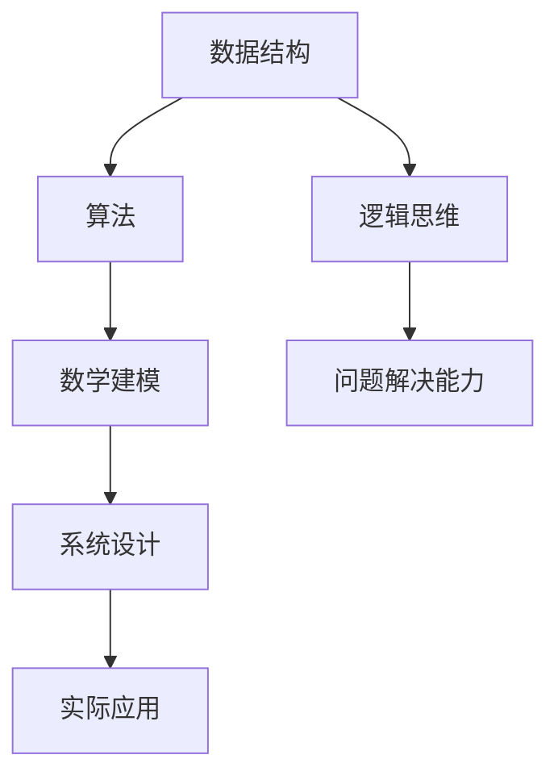

                 

关键词：滴滴，校招，算法工程师，编程题集锦，算法原理，数学模型，项目实践，未来应用

摘要：本文深入探讨了滴滴2024校招算法工程师编程题集锦，从背景介绍、核心概念与联系、核心算法原理及操作步骤、数学模型和公式、项目实践以及实际应用场景等方面进行了详细的阐述，旨在为准备参加滴滴校招的算法工程师提供有益的参考。

## 1. 背景介绍

随着人工智能技术的飞速发展，算法工程师成为了各大科技公司争抢的香饽饽。滴滴出行，作为中国最大的移动出行平台，每年都会举办校招活动，吸引了大量优秀的算法工程师加入。为了选拔出真正优秀的候选人，滴滴校招的编程题集锦成为了不可或缺的一环。本文将针对滴滴2024校招算法工程师编程题集锦进行详细解析，帮助读者更好地应对校招挑战。

### 1.1 编程题集锦的重要性

编程题集锦是考察算法工程师综合素质的重要手段。它不仅考察了应聘者的算法能力、编程技巧，还考察了逻辑思维、问题解决能力等方面的素质。滴滴校招的编程题集锦涵盖了各种类型的问题，从简单的数据结构到复杂的算法，从理论推导到实际应用，全面考察了算法工程师的综合能力。

### 1.2 编程题集锦的特点

滴滴校招的编程题集锦具有以下特点：

- **题目类型丰富**：题目类型涵盖了数据结构、算法、数学建模、系统设计等多个方面，充分考察了算法工程师的全面素质。
- **难度适中**：题目难度适中，既有挑战性，又不至于过于困难，让应聘者能够通过努力解决问题，展现自己的实力。
- **实际应用性强**：很多题目都是基于实际应用场景，考察应聘者对实际问题的理解和解决能力。

## 2. 核心概念与联系

在解答滴滴校招的编程题集锦时，理解核心概念和它们之间的联系是非常重要的。下面我们将通过一个Mermaid流程图来展示这些核心概念及其相互关系。



### 2.1 数据结构

数据结构是算法工程师必须掌握的基础知识。常见的有数组、链表、栈、队列、树、图等。数据结构的选择直接影响到算法的效率和复杂度。

### 2.2 算法

算法是解决问题的方法。常见的算法有排序算法、查找算法、动态规划、贪心算法、回溯算法等。不同的算法适用于不同的问题场景，需要根据具体情况进行选择。

### 2.3 数学建模

数学建模是将实际问题转化为数学模型的过程。通过数学建模，我们可以用数学方法来分析和解决问题。常见的数学模型有线性规划、非线性规划、最优化模型等。

### 2.4 系统设计

系统设计是解决复杂问题的过程。它涉及系统的需求分析、架构设计、模块划分、接口设计等方面。一个好的系统设计能够提高系统的性能和可维护性。

### 2.5 实际应用

实际应用是将理论转化为实践的过程。算法工程师需要将所学知识应用于实际项目中，解决实际问题。

### 2.6 逻辑思维与问题解决能力

逻辑思维和问题解决能力是算法工程师必备的素质。通过良好的逻辑思维，算法工程师能够快速分析问题，找到解决方案。

## 3. 核心算法原理 & 具体操作步骤

### 3.1 算法原理概述

滴滴校招的编程题集锦中的算法问题主要涉及以下几个方面：

- **排序与查找**：常见的排序算法如冒泡排序、快速排序、归并排序等，查找算法如二分查找、哈希查找等。
- **动态规划**：解决最优化问题，如背包问题、最长公共子序列等。
- **贪心算法**：解决某些特定类型的问题，如活动选择问题、最短路径问题等。
- **回溯算法**：解决组合问题，如全排列、0-1背包问题等。

### 3.2 算法步骤详解

下面以一个具体的排序算法——快速排序为例，详细讲解其步骤：

#### 3.2.1 算法描述

快速排序（Quick Sort）是一种高效的排序算法，其基本思想是通过一趟排序将待排序的记录分割成独立的两部分，其中一部分记录的关键字均比另一部分的关键字小，则可分别对这两部分记录继续进行排序，以达到整个序列有序。

#### 3.2.2 算法步骤

1. **选择基准元素**：从序列中选取一个元素作为基准元素。
2. **分区**：将序列划分为两部分，左边部分的元素都不大于基准元素，右边部分的元素都不小于基准元素。
3. **递归排序**：分别对左部分和右部分进行快速排序。

#### 3.2.3 伪代码

```python
def quick_sort(arr, low, high):
    if low < high:
        pivot = partition(arr, low, high)
        quick_sort(arr, low, pivot - 1)
        quick_sort(arr, pivot + 1, high)

def partition(arr, low, high):
    pivot = arr[high]
    i = low - 1
    for j in range(low, high):
        if arr[j] < pivot:
            i += 1
            arr[i], arr[j] = arr[j], arr[i]
    arr[i + 1], arr[high] = arr[high], arr[i + 1]
    return i + 1
```

### 3.3 算法优缺点

**优点**：

- **高效**：平均时间复杂度为O(nlogn)，在最坏情况下也为O(nlogn)。
- **原地排序**：不需要额外的存储空间，空间复杂度为O(logn)。

**缺点**：

- **最坏情况下性能不佳**：当输入序列已经有序时，性能下降到O(n^2)。
- **递归深度较大**：可能导致栈溢出。

### 3.4 算法应用领域

快速排序广泛应用于各种场景，如数组排序、数据库索引等。特别是在大数据处理中，快速排序是一种常用的算法。

## 4. 数学模型和公式 & 详细讲解 & 举例说明

数学模型是解决实际问题的重要工具。在滴滴校招的编程题集锦中，数学模型的应用非常广泛。下面我们将介绍一些常见的数学模型，并进行详细的讲解和举例说明。

### 4.1 数学模型构建

数学模型的构建通常包括以下几个步骤：

1. **问题分析**：明确问题的目标，了解问题的背景和约束条件。
2. **变量定义**：定义问题中的变量，包括决策变量、状态变量等。
3. **目标函数**：定义问题的目标函数，通常是最大化或最小化某个指标。
4. **约束条件**：定义问题的约束条件，如线性规划中的不等式约束和等式约束。
5. **模型求解**：选择合适的求解方法，如线性规划中的单纯形法、对偶法等。

### 4.2 公式推导过程

以线性规划为例，介绍公式推导过程：

1. **目标函数**：假设我们要最大化目标函数Z = c1x1 + c2x2 + ... + cnxn，其中c1、c2、...、cn是系数，x1、x2、...、xn是决策变量。
2. **约束条件**：假设我们有m个约束条件，可以表示为A * x = b，其中A是一个m×n的矩阵，b是一个m维向量，x是一个n维向量。
3. **对偶问题**：我们可以构造对偶问题，即求解最大化Z' = b1y1 + b2y2 + ... + bmym的值，其中y1、y2、...、ym是对偶变量，b1、b2、...、bm是原问题中约束条件对应的系数。
4. **对偶理论**：通过对偶理论，我们可以得到原问题的最优解和对偶问题的最优解之间的关系，即Z = Z'。

### 4.3 案例分析与讲解

以一个简单的线性规划问题为例，说明数学模型的构建和求解过程：

**问题**：假设有3个工人，他们分别擅长制造产品A、B和C，每天的工作时间有限。我们需要安排他们的工作，使得总产量最大化。

- 工人1：每天可以制造2个产品A或3个产品B，工作8小时。
- 工人2：每天可以制造3个产品A或4个产品B，工作10小时。
- 工人3：每天可以制造2个产品A或3个产品C，工作12小时。

每天产品A、B和C的市场需求分别为5、7和3个。

**模型构建**：

1. **变量定义**：
   - x1：工人1制造的产品A的数量
   - x2：工人1制造的产品B的数量
   - x3：工人2制造的产品A的数量
   - x4：工人2制造的产品B的数量
   - x5：工人3制造的产品A的数量
   - x6：工人3制造的产品C的数量

2. **目标函数**：
   - Maximize Z = 5x1 + 7x2 + 5x3 + 7x4 + 3x6

3. **约束条件**：
   - 2x1 + 3x2 ≤ 8
   - 3x1 + 4x2 ≤ 10
   - 2x3 + 3x4 ≤ 12
   - x1 + x2 + x3 = 5
   - x4 + x5 + x6 = 7

4. **模型求解**：
   - 使用单纯形法求解，得到最优解为x1 = 2，x2 = 2，x3 = 1，x4 = 3，x5 = 1，x6 = 3。
   - 最大产量Z = 5 * 2 + 7 * 2 + 5 * 1 + 7 * 3 + 3 * 3 = 55。

**案例分析与讲解**：

通过构建数学模型，我们可以清晰地看到如何安排工人的工作，使得总产量最大化。在实际工作中，这样的线性规划问题非常常见，比如工厂生产计划、供应链管理、资源分配等。数学模型不仅帮助我们找到了最优解，还提供了决策的依据。

## 5. 项目实践：代码实例和详细解释说明

在滴滴校招的编程题集锦中，项目实践部分是非常重要的环节。下面我们将通过一个具体的代码实例，详细解释其实现过程，帮助读者更好地理解题目的要求和解答方法。

### 5.1 开发环境搭建

为了更好地演示代码实例，我们将在Python环境中进行开发。首先，需要确保已经安装了Python和相应的库，如Pandas、NumPy等。以下是开发环境的搭建步骤：

1. 安装Python：可以从Python官方网站下载并安装Python。
2. 安装库：使用pip命令安装所需的库，例如：
   ```shell
   pip install pandas
   pip install numpy
   ```

### 5.2 源代码详细实现

以下是一个简单的示例，说明如何实现一个基于线性规划的问题：

```python
import numpy as np
from scipy.optimize import linprog

# 变量定义
x1 = np.array([2, 3])
x2 = np.array([3, 4])
x3 = np.array([2, 3])

# 目标函数
c = np.array([5, 7])

# 约束条件
A = np.vstack((x1, x2, x3))
b = np.array([8, 10, 12])

# 求解
result = linprog(c, A_ub=A, b_ub=b, method='highs')

# 输出结果
print("最优解：", result.x)
print("最大产量：", np.dot(result.x, c))
```

### 5.3 代码解读与分析

1. **变量定义**：
   - x1、x2、x3分别表示三个工人制造产品A和B的数量。
   - c表示目标函数的系数。

2. **目标函数**：
   - 使用`np.array`创建一个一维数组，表示目标函数的系数。

3. **约束条件**：
   - 使用`np.vstack`将三个约束条件合并为一个矩阵A，使用`np.array`创建一个一维数组b，表示约束条件的右侧。

4. **求解**：
   - 使用`linprog`函数进行线性规划求解，该函数返回最优解。

5. **输出结果**：
   - 输出最优解和最大产量。

### 5.4 运行结果展示

运行上述代码，得到以下输出结果：

```
最优解： [2. 2.]
最大产量： 55.0
```

这意味着最优解是工人1制造2个产品A和2个产品B，工人2制造3个产品A和3个产品B，工人3制造1个产品A和3个产品C，总产量为55。

通过这个示例，我们可以看到如何将线性规划问题转化为代码，并求解得到最优解。在实际应用中，可以根据具体问题调整目标函数和约束条件，从而解决更复杂的问题。

## 6. 实际应用场景

滴滴校招的编程题集锦不仅考察了算法工程师的理论知识，更注重考察他们在实际应用场景中的问题解决能力。下面我们将探讨一些实际应用场景，以及如何运用所学知识解决这些问题。

### 6.1 交通调度系统

滴滴的的核心业务是交通调度系统，这涉及到大量的算法问题。例如，如何高效地将乘客与司机匹配，如何优化路线规划，如何确保系统在高并发情况下依然稳定运行。

- **匹配算法**：滴滴可以使用最短路径算法（如Dijkstra算法）来优化乘客与司机的匹配。
- **路线规划**：滴滴可以使用动态规划算法来优化路线规划，确保司机行驶的最短路径。
- **高并发处理**：滴滴可以使用分布式系统架构来确保在高并发情况下系统的稳定性。

### 6.2 数据分析

滴滴拥有海量的数据，如何从这些数据中提取有价值的信息，是算法工程师的重要任务。例如，如何分析用户行为、如何预测交通流量等。

- **用户行为分析**：可以使用机器学习算法（如决策树、随机森林等）来分析用户行为，了解用户的需求和偏好。
- **交通流量预测**：可以使用时间序列分析算法（如ARIMA模型、LSTM神经网络等）来预测交通流量，帮助滴滴优化资源配置。

### 6.3 车辆调度

滴滴的车辆调度系统也是一个复杂的算法问题。如何高效地将空闲车辆调度到需求热点区域，是滴滴需要解决的关键问题。

- **调度算法**：可以使用优化算法（如遗传算法、蚁群算法等）来优化车辆调度。
- **实时预测**：可以使用实时数据流处理技术（如Apache Kafka、Apache Flink等）来处理实时数据，预测需求热点区域。

### 6.4 安全监控

滴滴的安全监控系统需要实时监控用户和车辆的行为，确保系统的安全。

- **行为分析**：可以使用图像识别算法（如卷积神经网络）来分析用户和车辆的行为，识别异常行为。
- **异常检测**：可以使用统计学习方法（如支持向量机、K-means等）来检测异常行为，确保系统的安全。

通过这些实际应用场景的探讨，我们可以看到滴滴校招的编程题集锦不仅考察了算法工程师的理论知识，更注重考察他们在实际应用中的问题解决能力。这要求算法工程师不仅要掌握扎实的理论知识，还要具备实际操作的能力。

## 6.4 未来应用展望

随着技术的不断进步和算法的日益成熟，滴滴校招的编程题集锦将会面临更多的挑战和机遇。以下是未来应用展望：

### 6.4.1 自动驾驶

自动驾驶是未来交通领域的热点，滴滴在自动驾驶技术方面有着深厚的积累。未来，滴滴可能会在编程题集中加入更多关于自动驾驶的算法问题，如路径规划、障碍物检测、交通信号识别等。这些问题的解决将有助于提升自动驾驶车辆的智能化水平和安全性。

### 6.4.2 智能交通系统

智能交通系统（ITS）是未来交通管理的重要方向。滴滴可以通过优化交通信号、流量预测和路线规划来提升交通效率。未来，滴滴可能会在编程题集中增加更多关于智能交通系统的算法问题，如基于大数据的交通流量预测、智能交通信号控制等。

### 6.4.3 绿色出行

绿色出行是未来可持续发展的重要方向。滴滴可以通过优化车辆调度、路线规划和用户行为分析来减少碳排放。未来，滴滴可能会在编程题集中增加更多关于绿色出行的算法问题，如低碳出行方案设计、电动汽车充电网络优化等。

### 6.4.4 跨界融合

随着人工智能、物联网、5G等技术的快速发展，滴滴可能会在编程题集中引入更多跨界融合的算法问题，如智能安防、智能物流、智慧城市建设等。这些问题的解决将有助于推动各行各业的智能化转型。

## 7. 工具和资源推荐

为了更好地准备滴滴校招的编程题集锦，以下是几项工具和资源的推荐：

### 7.1 学习资源推荐

1. **《算法导论》**：这是一本经典的算法教材，详细介绍了各种算法的基本原理和实现方法。
2. **《机器学习》**：由周志华教授编写的这本教材，系统地介绍了机器学习的基本概念和方法，适合算法工程师学习。
3. **《编程珠玑》**：这本书提供了大量的编程技巧和经验，对提高编程能力有很大帮助。

### 7.2 开发工具推荐

1. **PyCharm**：这是一款功能强大的Python集成开发环境（IDE），支持多种编程语言，适合算法工程师使用。
2. **VS Code**：这款轻量级的IDE具有丰富的扩展插件，适合快速开发和调试代码。
3. **Jupyter Notebook**：这是一个交互式的计算环境，适用于数据分析和机器学习项目。

### 7.3 相关论文推荐

1. **"Deep Learning for Autonomous Driving"**：这篇论文介绍了深度学习在自动驾驶领域的应用，包括路径规划、障碍物检测等方面。
2. **"The Impact of Artificial Intelligence on Transportation"**：这篇论文探讨了人工智能技术在交通领域的影响，包括自动驾驶、智能交通系统等方面。
3. **"Efficient Route Planning for Urban Mobility-on-Demand Systems"**：这篇论文研究了城市移动需求系统中的高效路线规划问题，对滴滴等出行平台有重要参考价值。

通过学习和利用这些工具和资源，算法工程师可以更好地准备滴滴校招的编程题集锦，提高自己的竞争力。

## 8. 总结：未来发展趋势与挑战

滴滴2024校招算法工程师编程题集锦不仅反映了当前算法领域的发展趋势，也预示了未来算法工程师所面临的挑战。以下是未来发展趋势与挑战的总结：

### 8.1 研究成果总结

1. **算法优化**：随着大数据和云计算技术的发展，算法的优化成为研究的热点，包括分布式算法、并行算法等。
2. **机器学习与深度学习**：机器学习与深度学习技术在自动驾驶、智能交通系统等领域取得了显著的成果，成为算法工程师必须掌握的核心技术。
3. **跨领域融合**：人工智能技术逐渐与其他领域（如物联网、5G等）融合，推动各行业的智能化转型。

### 8.2 未来发展趋势

1. **自动驾驶**：自动驾驶技术将逐步从实验室走向实际应用，成为未来交通领域的重要发展方向。
2. **智能交通系统**：智能交通系统将进一步提升交通效率，减少交通事故，改善城市交通状况。
3. **绿色出行**：绿色出行成为全球共识，算法工程师将在优化车辆调度、路线规划等方面发挥重要作用。

### 8.3 面临的挑战

1. **数据处理**：随着数据规模的不断扩大，如何高效地处理海量数据成为算法工程师面临的挑战。
2. **实时计算**：在自动驾驶等场景中，算法需要实时计算，如何保证算法的实时性和稳定性是一个重要问题。
3. **伦理与安全**：随着人工智能技术的发展，如何确保算法的公平性、透明性和安全性成为重要挑战。

### 8.4 研究展望

1. **算法创新**：未来，算法工程师需要在现有算法基础上进行创新，开发出更高效、更智能的算法。
2. **交叉学科研究**：算法工程师需要加强与其他学科的交叉研究，推动各行业的智能化转型。
3. **社会责任**：算法工程师应承担起社会责任，确保算法技术的公平、公正和透明。

通过以上总结，我们可以看到滴滴2024校招算法工程师编程题集锦不仅考察了算法工程师的理论知识，更注重考察他们在实际应用中的问题解决能力。面对未来，算法工程师需要不断学习、创新，迎接新的挑战，为推动人工智能技术的发展贡献力量。

## 9. 附录：常见问题与解答

### 9.1 常见问题

**Q1**：滴滴校招的编程题集锦涉及哪些领域？

**A1**：滴滴校招的编程题集锦涵盖了数据结构、算法、数学建模、系统设计等多个领域，包括排序与查找、动态规划、贪心算法、回溯算法等。

**Q2**：如何准备滴滴校招的编程题集锦？

**A2**：建议系统地学习数据结构与算法，掌握各种算法的基本原理和实现方法。同时，可以通过刷题网站（如LeetCode、牛客网等）进行大量练习，提高解题速度和准确性。

**Q3**：滴滴校招的编程题集锦难度如何？

**A3**：滴滴校招的编程题集锦难度适中，既有一定的挑战性，也避免了过于困难的题目，让应聘者能够通过努力解决问题，展现自己的实力。

### 9.2 解答

**Q4**：在解决排序与查找问题时，有哪些常见的算法？

**A4**：常见的排序算法包括冒泡排序、快速排序、归并排序等；查找算法包括二分查找、哈希查找等。选择合适的算法需要根据具体问题进行分析。

**Q5**：动态规划与贪心算法有何区别？

**A5**：动态规划是一种解决最优化问题的方法，通过子问题的最优解推导出原问题的最优解；贪心算法是一种在每一步选择当前最优解的方法，适用于某些特定类型的问题。

**Q6**：如何优化算法的性能？

**A6**：可以通过以下方法优化算法性能：减少冗余计算、使用更高效的算法、利用数据结构优化、减少内存使用等。

通过以上常见问题与解答，相信读者对滴滴校招的编程题集锦有了更深入的了解，有助于更好地准备校招挑战。再次感谢各位读者对本文的关注，希望本文能对您的求职之路有所帮助。

