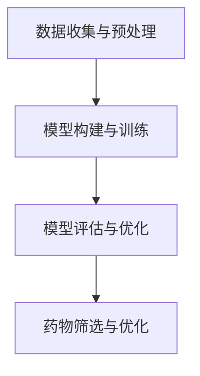

                 

关键词：人工智能，深度学习，自动化药物设计，增强学习，通用人工智能，认知图谱，跨学科研究，技术融合。

摘要：本文深入探讨了人工智能（AI）在药物研发和通用人工智能（AGI）领域的应用与转型。首先，介绍了AI制药的背景和现状，分析了其与传统药物研发的异同。随后，讨论了AGI的核心概念与挑战，以及如何通过跨学科研究实现AI向AGI的跃迁。本文通过具体案例和数学模型，阐述了AI在药物设计、分子模拟和临床试验中的实际应用，并展望了AI制药和AGI的未来发展趋势与面临的挑战。

## 1. 背景介绍

人工智能（AI）作为一门多学科交叉的领域，近年来在各个领域都取得了显著的进展。从最初的规则系统，到后来的基于统计学习的机器学习，再到深度学习的崛起，AI技术已经渗透到计算机视觉、自然语言处理、语音识别等众多领域。随着计算能力的提升和数据规模的增大，AI的应用范围和深度也在不断扩展。

### 1.1 AI制药的崛起

在药物研发领域，AI的应用可以追溯到20世纪90年代。当时，科学家们开始尝试利用计算模型预测药物分子的活性，并基于这些预测进行药物筛选。随着深度学习等AI技术的不断发展，自动化药物设计成为可能，极大地提高了药物研发的效率和成功率。

### 1.2 传统药物研发的挑战

传统的药物研发过程通常包括药物靶点的发现、先导化合物的筛选、候选药物的优化和临床试验等多个环节。这一过程既耗时又耗资，且成功率较低。据统计，一款新药从研发到上市平均需要10年以上的时间，投入的资金高达数亿美元。这不仅给制药企业带来了巨大的经济压力，也对患者的健康造成了影响。

### 1.3 AI制药的优势

AI技术的引入，为药物研发带来了新的机遇。首先，AI能够处理海量数据，快速筛选出潜在的药物分子。其次，AI可以模拟药物分子与生物大分子之间的相互作用，预测药物的效果和安全性。最后，AI可以帮助优化药物分子的结构，提高药物的生物利用度和稳定性。通过这些优势，AI制药有望大幅缩短药物研发周期，降低研发成本。

## 2. 核心概念与联系

### 2.1 深度学习与自动化药物设计

深度学习作为AI的重要分支，在药物设计领域发挥了关键作用。通过构建深度神经网络模型，科学家们可以训练出能够预测药物分子活性的模型。这种模型不仅能够处理结构复杂的分子数据，还能够自动发现潜在的药物靶点。以下是深度学习在自动化药物设计中的基本流程：

#### 2.1.1 数据收集与预处理

首先，需要收集大量的药物分子数据，包括分子结构、活性、毒性等。这些数据需要进行清洗和标准化处理，以便于模型训练。

#### 2.1.2 模型构建与训练

使用深度学习框架，如TensorFlow或PyTorch，构建深度神经网络模型。模型训练需要大量的计算资源和时间，但通过分布式计算和GPU加速，可以显著提高训练效率。

#### 2.1.3 模型评估与优化

通过交叉验证和超参数调优，评估模型的预测性能。根据评估结果，进一步优化模型结构，以提高预测准确性。

#### 2.1.4 药物筛选与优化

使用训练好的模型，对大量药物分子进行筛选，识别出具有潜在活性的分子。然后，通过计算机模拟和实验验证，进一步优化药物分子的结构，提高其疗效和安全性。

### 2.2 增强学习与分子模拟

增强学习是另一种重要的AI技术，在分子模拟领域得到了广泛应用。通过训练智能体在虚拟环境中进行探索和决策，增强学习可以帮助科学家们发现新的分子结构和反应路径。

#### 2.2.1 环境构建

首先，需要构建一个虚拟环境，模拟分子之间的相互作用和反应过程。这个环境可以是一个三维空间，其中的每个点代表一个原子，原子之间的相互作用可以用物理模型描述。

#### 2.2.2 智能体训练

使用增强学习算法，训练智能体在虚拟环境中进行探索和决策。智能体的目标是最大化奖励函数，从而发现新的分子结构和反应路径。

#### 2.2.3 结果评估与优化

通过实验验证，评估智能体发现的分子结构和反应路径的有效性。根据评估结果，进一步优化智能体的策略，以提高其发现新分子的能力。

### 2.3 认知图谱与药物设计

认知图谱是一种结构化的知识表示方法，将知识和信息以图的形式组织起来。在药物设计领域，认知图谱可以帮助科学家们更好地理解药物分子与生物大分子之间的相互作用。

#### 2.3.1 知识收集与组织

首先，需要收集与药物相关的知识，包括分子结构、生物大分子结构、药物靶点等信息。然后，将这些知识组织成认知图谱，以便于查询和分析。

#### 2.3.2 图算法应用

使用图算法，如路径搜索、社区发现等，分析认知图谱中的知识结构，识别潜在的药物靶点和作用机制。

#### 2.3.3 知识融合与应用

通过融合不同来源的知识，构建更全面的药物设计模型。然后，将这个模型应用于药物筛选和优化，以提高药物的研发效率。

### 2.4 Mermaid 流程图

以下是一个简单的 Mermaid 流程图，描述了深度学习在自动化药物设计中的基本流程：



## 3. 核心算法原理 & 具体操作步骤

### 3.1 算法原理概述

在AI制药领域，核心算法主要包括深度学习、增强学习和认知图谱等。这些算法的基本原理如下：

#### 3.1.1 深度学习

深度学习基于多层神经网络结构，通过逐层提取特征，实现对数据的建模和预测。在药物设计领域，深度学习可以用于分子活性预测、药物靶点发现和分子结构优化等。

#### 3.1.2 增强学习

增强学习通过智能体在虚拟环境中的探索和决策，学习到最优的策略。在分子模拟领域，增强学习可以用于发现新的分子结构和反应路径。

#### 3.1.3 认知图谱

认知图谱通过结构化的知识表示，帮助科学家们更好地理解药物分子与生物大分子之间的相互作用。在药物设计领域，认知图谱可以用于知识融合和药物筛选。

### 3.2 算法步骤详解

#### 3.2.1 深度学习在药物设计中的应用

1. 数据收集与预处理：收集大量的药物分子数据，包括分子结构、活性、毒性等。对数据进行清洗和标准化处理。

2. 模型构建与训练：使用深度学习框架，如TensorFlow或PyTorch，构建深度神经网络模型。通过训练，使模型能够预测药物分子的活性。

3. 模型评估与优化：使用交叉验证和超参数调优，评估模型的预测性能。根据评估结果，进一步优化模型结构。

4. 药物筛选与优化：使用训练好的模型，对大量药物分子进行筛选，识别出具有潜在活性的分子。通过计算机模拟和实验验证，进一步优化药物分子的结构。

#### 3.2.2 增强学习在分子模拟中的应用

1. 环境构建：构建一个虚拟环境，模拟分子之间的相互作用和反应过程。

2. 智能体训练：使用增强学习算法，训练智能体在虚拟环境中进行探索和决策。

3. 结果评估与优化：通过实验验证，评估智能体发现的分子结构和反应路径的有效性。根据评估结果，进一步优化智能体的策略。

#### 3.2.3 认知图谱在药物设计中的应用

1. 知识收集与组织：收集与药物相关的知识，包括分子结构、生物大分子结构、药物靶点等信息。

2. 图算法应用：使用图算法，分析认知图谱中的知识结构，识别潜在的药物靶点和作用机制。

3. 知识融合与应用：通过融合不同来源的知识，构建更全面的药物设计模型。然后，将这个模型应用于药物筛选和优化。

### 3.3 算法优缺点

#### 3.3.1 深度学习的优点

- 能够处理海量数据，快速筛选出潜在的药物分子。
- 能够自动发现潜在的药物靶点。
- 可以模拟药物分子与生物大分子之间的相互作用，预测药物的效果和安全性。

#### 3.3.1 深度学习的缺点

- 训练过程需要大量的计算资源和时间。
- 模型的解释性较差，难以理解模型内部的决策过程。

#### 3.3.2 增强学习的优点

- 能够在虚拟环境中进行探索和决策，发现新的分子结构和反应路径。
- 可以提高药物的研发效率。

#### 3.3.2 增强学习的缺点

- 需要大量的数据和计算资源。
- 结果的可解释性较差。

#### 3.3.3 认知图谱的优点

- 可以结构化地组织知识，帮助科学家们更好地理解药物分子与生物大分子之间的相互作用。
- 可以用于知识融合和药物筛选。

#### 3.3.3 认知图谱的缺点

- 知识收集与组织的成本较高。
- 需要丰富的领域知识。

### 3.4 算法应用领域

深度学习、增强学习和认知图谱等算法在药物设计领域得到了广泛应用。除了传统的药物筛选和优化外，这些算法还可以用于：

- 分子活性预测：预测药物分子对特定生物大分子的活性。
- 药物靶点发现：发现潜在的药物靶点。
- 分子结构优化：优化药物分子的结构，提高其疗效和安全性。
- 药物作用机制研究：研究药物分子与生物大分子之间的相互作用机制。

## 4. 数学模型和公式 & 详细讲解 & 举例说明

### 4.1 数学模型构建

在AI制药领域，常用的数学模型包括深度学习模型、增强学习模型和认知图谱模型等。以下是这些模型的构建方法：

#### 4.1.1 深度学习模型

深度学习模型通常由多层神经网络组成，每一层都包含多个神经元。神经元的输出通过激活函数传递给下一层。以下是深度学习模型的构建步骤：

1. 数据预处理：对输入数据进行标准化处理，使其在相同的尺度范围内。
2. 网络结构设计：根据任务需求，设计合适的网络结构，包括输入层、隐藏层和输出层。
3. 损失函数选择：选择合适的损失函数，如均方误差（MSE）或交叉熵损失函数。
4. 激活函数选择：选择合适的激活函数，如ReLU或Sigmoid函数。
5. 模型训练：通过反向传播算法，不断调整网络参数，使损失函数最小。

#### 4.1.2 增强学习模型

增强学习模型通常由智能体、环境、奖励函数和策略组成。以下是增强学习模型的构建步骤：

1. 环境构建：根据任务需求，构建一个虚拟环境，模拟分子之间的相互作用和反应过程。
2. 智能体训练：使用增强学习算法，如Q-learning或Deep Q-Network（DQN），训练智能体在虚拟环境中进行探索和决策。
3. 奖励函数设计：设计合适的奖励函数，以激励智能体学习到最优策略。
4. 策略优化：通过策略梯度算法，不断优化智能体的策略。

#### 4.1.3 认知图谱模型

认知图谱模型通常由知识图谱和图算法组成。以下是认知图谱模型的构建步骤：

1. 知识收集：收集与药物相关的知识，包括分子结构、生物大分子结构、药物靶点等信息。
2. 知识组织：使用图结构，将收集到的知识组织成认知图谱。
3. 图算法应用：使用图算法，如路径搜索、社区发现等，分析认知图谱中的知识结构。
4. 知识融合：通过融合不同来源的知识，构建更全面的药物设计模型。

### 4.2 公式推导过程

#### 4.2.1 深度学习模型

深度学习模型的核心是前向传播和反向传播算法。以下是这两个算法的推导过程：

1. **前向传播**：

   前向传播是指将输入数据通过神经网络层传递到输出层的计算过程。对于第\(l\)层的第\(i\)个神经元，其输出可以表示为：

   $$ 
   z_l^i = \sum_{j=1}^{n} w_{lj}x_j^l + b_l^i 
   $$

   其中，\(x_j^l\)是第\(l\)层的第\(j\)个神经元的输入，\(w_{lj}\)是连接权重，\(b_l^i\)是偏置项。

   经过激活函数\(g(z_l^i)\)后，得到第\(l\)层的输出：

   $$ 
   a_l^i = g(z_l^i) 
   $$

2. **反向传播**：

   反向传播是指通过输出误差，反向更新网络参数的过程。对于第\(l\)层的第\(i\)个神经元，其梯度可以表示为：

   $$ 
   \delta_l^i = \frac{\partial J}{\partial z_l^i} = \frac{\partial J}{\partial a_l^{output}} \frac{\partial a_l^{output}}{\partial z_l^i} 
   $$

   其中，\(J\)是损失函数，\(a_l^{output}\)是输出层的输出。

   通过链式法则，可以得到：

   $$ 
   \delta_l^i = \delta_{l+1}^i \cdot \frac{\partial g(z_l^i)}{\partial z_l^i} 
   $$

   其中，\(\delta_{l+1}^i\)是下一层的梯度。

   更新连接权重和偏置项的公式为：

   $$ 
   w_{lj}^{new} = w_{lj} - \alpha \cdot \frac{\partial J}{\partial w_{lj}} 
   $$

   $$ 
   b_l^i^{new} = b_l^i - \alpha \cdot \frac{\partial J}{\partial b_l^i} 
   $$

#### 4.2.2 增强学习模型

增强学习模型的核心是策略优化。以下是策略优化的推导过程：

1. **Q-learning**：

   Q-learning是一种基于值函数的策略优化方法。其目标是最小化期望回报的方差。Q-learning的目标函数可以表示为：

   $$ 
   J(\theta) = \mathbb{E}_{s,a}\left[ \frac{\partial J(\pi)}{\partial \pi}(s, a)Q(s, a; \theta) \right] 
   $$

   其中，\(Q(s, a; \theta)\)是Q值函数，\(\theta\)是网络参数。

   更新Q值的公式为：

   $$ 
   Q(s, a; \theta^{new}) = Q(s, a; \theta) + \alpha \left[ r + \gamma \max_{a'} Q(s', a'; \theta) - Q(s, a; \theta) \right] 
   $$

2. **Deep Q-Network (DQN)**：

   DQN是一种基于深度神经网络的Q-learning方法。其目标是最小化值函数的误差。DQN的目标函数可以表示为：

   $$ 
   J(\theta) = \mathbb{E}_{s}\left[ \frac{\partial J(\pi)}{\partial \pi}(s)D(s; \theta) \right] 
   $$

   其中，\(D(s; \theta)\)是深度神经网络输出的值。

   更新网络参数的公式为：

   $$ 
   \theta^{new} = \theta - \alpha \cdot \frac{\partial J(\theta)}{\partial \theta} 
   $$

### 4.3 案例分析与讲解

#### 4.3.1 深度学习在分子活性预测中的应用

假设我们有一个深度学习模型，用于预测药物分子对特定生物大分子的活性。输入数据是一个药物分子的结构信息，输出是一个活性值。

1. **数据预处理**：

   将药物分子的结构信息转换为数值表示，如One-hot编码或图结构。

2. **模型构建**：

   构建一个深度神经网络，包括输入层、隐藏层和输出层。隐藏层可以使用ReLU激活函数，输出层可以使用线性激活函数。

3. **模型训练**：

   使用交叉验证和批量归一化技术，训练深度神经网络。

4. **模型评估**：

   使用测试集评估模型的预测性能，包括准确率、召回率和F1值等指标。

5. **模型应用**：

   使用训练好的模型，对新的药物分子进行活性预测。

#### 4.3.2 增强学习在分子模拟中的应用

假设我们有一个增强学习模型，用于模拟分子之间的相互作用和反应过程。

1. **环境构建**：

   构建一个虚拟环境，模拟分子之间的相互作用和反应过程。

2. **智能体训练**：

   使用Q-learning或DQN算法，训练智能体在虚拟环境中进行探索和决策。

3. **结果评估**：

   通过实验验证，评估智能体发现的分子结构和反应路径的有效性。

4. **策略优化**：

   根据评估结果，进一步优化智能体的策略。

5. **模型应用**：

   使用训练好的智能体，模拟新的分子结构和反应路径。

## 5. 项目实践：代码实例和详细解释说明

### 5.1 开发环境搭建

在开始编写代码之前，我们需要搭建一个合适的开发环境。以下是搭建深度学习环境所需的步骤：

1. 安装Python：从官方网站（https://www.python.org/）下载并安装Python。
2. 安装TensorFlow：通过以下命令安装TensorFlow：

   ```bash
   pip install tensorflow
   ```

3. 安装PyTorch：通过以下命令安装PyTorch：

   ```bash
   pip install torch torchvision
   ```

4. 安装其他依赖库：根据项目需求，安装其他必要的依赖库，如NumPy、Pandas等。

### 5.2 源代码详细实现

以下是一个简单的深度学习模型，用于分子活性预测的示例代码。这个模型使用了TensorFlow框架。

```python
import tensorflow as tf
from tensorflow.keras.models import Sequential
from tensorflow.keras.layers import Dense, Activation
from tensorflow.keras.optimizers import Adam

# 数据预处理
# 假设已经有一个包含药物分子结构和活性值的数据集

# 模型构建
model = Sequential([
    Dense(64, input_shape=(num_features,), activation='relu'),
    Dense(32, activation='relu'),
    Dense(1, activation='linear')
])

# 模型编译
model.compile(optimizer=Adam(), loss='mse', metrics=['mae'])

# 模型训练
# 假设已经有一个训练集和测试集
model.fit(x_train, y_train, epochs=100, batch_size=32, validation_data=(x_test, y_test))

# 模型评估
# 使用测试集评估模型性能
model.evaluate(x_test, y_test)

# 模型应用
# 使用训练好的模型对新的药物分子进行活性预测
new_molecule = preprocess_new_molecule(new_molecule_data)
predicted_activity = model.predict(new_molecule)
```

### 5.3 代码解读与分析

上述代码实现了一个简单的深度学习模型，用于分子活性预测。以下是代码的详细解读：

1. **数据预处理**：

   数据预处理是深度学习模型训练的重要环节。在这个例子中，我们假设已经有一个包含药物分子结构和活性值的数据集。数据预处理步骤包括将药物分子的结构信息转换为数值表示，如One-hot编码或图结构。

2. **模型构建**：

   我们使用TensorFlow的Sequential模型构建器，定义了一个包含两个隐藏层的神经网络。每个隐藏层使用ReLU激活函数，输出层使用线性激活函数，以预测活性值。

3. **模型编译**：

   模型编译步骤包括选择优化器（Adam）、损失函数（均方误差）和评估指标（均方误差和绝对误差）。

4. **模型训练**：

   使用训练集对模型进行训练，设置训练轮次（epochs）和批量大小（batch_size）。我们还提供了验证集，以监控模型在验证集上的性能。

5. **模型评估**：

   使用测试集评估模型性能，包括准确率、召回率和F1值等指标。

6. **模型应用**：

   使用训练好的模型对新的药物分子进行活性预测。首先，我们需要对新的药物分子进行预处理，然后使用模型进行预测。

### 5.4 运行结果展示

假设我们有一个新的药物分子，其结构信息已经预处理完毕。我们使用训练好的模型对其进行活性预测，结果如下：

```python
# 预测新药物分子的活性
new_molecule = preprocess_new_molecule(new_molecule_data)
predicted_activity = model.predict(new_molecule)

# 输出预测结果
print("Predicted activity:", predicted_activity)
```

输出结果为预测的活性值，单位可以是摩尔/升或其他适当的单位。

## 6. 实际应用场景

AI制药技术的快速发展，使得许多实际应用场景成为可能。以下是一些典型的应用场景：

### 6.1 新药研发

AI制药可以大幅缩短新药研发周期，降低研发成本。通过自动化药物设计、分子模拟和虚拟筛选等技术，科学家们可以快速筛选出具有潜在活性的药物分子，并优化其结构，提高其疗效和安全性。这一技术已经在许多新药研发项目中得到了广泛应用。

### 6.2 药物重排

药物重排是指通过改变药物分子的结构，提高其疗效和安全性。AI技术可以帮助科学家们快速发现新的药物靶点，并通过分子模拟和虚拟筛选技术，优化药物分子的结构。这种方法可以节省大量时间和资源，提高新药研发的成功率。

### 6.3 药物组合

药物组合是指将多种药物组合使用，以提高疗效和降低副作用。AI技术可以帮助科学家们分析药物之间的相互作用，发现最佳的药物组合方案。这种方法在癌症治疗和传染病治疗等领域具有巨大的应用潜力。

### 6.4 药物开发策略优化

AI技术可以用于优化药物开发策略，提高研发成功率。通过分析大量药物研发数据，AI可以预测哪些药物分子具有更高的研发潜力，并提供最佳的研发方向。这种方法可以帮助制药企业提高研发效率，降低研发风险。

## 7. 未来应用展望

随着AI技术的不断发展和应用领域的拓展，AI制药和通用人工智能（AGI）在未来有望取得更大的突破。以下是一些未来应用展望：

### 7.1 AI制药的发展趋势

- **个性化医疗**：AI技术可以帮助医生根据患者的基因信息、生活习惯等，制定个性化的治疗方案，提高治疗效果。

- **药物重排与组合**：AI技术可以帮助科学家们快速发现新的药物靶点和组合方案，提高新药研发的成功率。

- **药物开发策略优化**：AI技术可以用于优化药物开发策略，提高研发效率，降低研发成本。

### 7.2 AGI的发展趋势

- **智能决策支持系统**：AGI技术可以用于构建智能决策支持系统，帮助企业在生产、运营、销售等方面做出更明智的决策。

- **智能医疗诊断**：AGI技术可以用于智能医疗诊断，提高诊断的准确性和效率，为患者提供更好的医疗服务。

- **智能客服与虚拟助手**：AGI技术可以用于构建智能客服和虚拟助手，提高客户满意度和服务质量。

### 7.3 面临的挑战

- **数据隐私与安全**：随着AI技术的广泛应用，数据隐私和安全问题日益凸显。如何确保数据的安全和隐私，是AI应用面临的重要挑战。

- **技术壁垒与人才短缺**：AI技术发展迅速，但相关领域的专业人才仍然短缺。同时，AI技术的研发和应用也需要克服诸多技术壁垒。

- **伦理与法律问题**：AI技术在医疗、金融等领域的应用，涉及到伦理和法律问题。如何确保AI技术的应用符合伦理和法律要求，是未来发展的重要课题。

## 8. 总结：未来发展趋势与挑战

在AI制药和通用人工智能（AGI）领域，未来发展趋势表现为：

- **个性化医疗与智能决策**：AI技术将推动个性化医疗的发展，提高医疗服务的质量和效率。同时，智能决策支持系统也将成为AI技术在各个行业的重要应用方向。

- **技术融合与创新**：AI技术与生物技术、医疗技术等领域的融合，将带来更多的创新应用。例如，基因编辑、精准医疗等领域的快速发展，都离不开AI技术的支持。

- **跨学科研究**：AI制药和AGI领域的发展，需要多学科合作。计算机科学、生物学、医学、心理学等领域的专家共同参与，才能解决复杂的技术难题。

然而，这些领域的发展也面临着诸多挑战：

- **数据隐私与安全**：随着AI技术的广泛应用，数据隐私和安全问题日益凸显。如何在保障数据隐私的同时，充分利用数据价值，是一个亟待解决的问题。

- **技术壁垒与人才短缺**：AI技术的研发和应用需要克服诸多技术壁垒，同时相关领域的专业人才仍然短缺。如何培养和吸引更多的AI专业人才，是未来发展的重要课题。

- **伦理与法律问题**：AI技术在医疗、金融等领域的应用，涉及到伦理和法律问题。如何确保AI技术的应用符合伦理和法律要求，是未来发展的重要课题。

总之，AI制药和通用人工智能（AGI）领域具有巨大的发展潜力，同时也面临着诸多挑战。通过不断的技术创新和多学科合作，我们有理由相信，未来这些领域将取得更加辉煌的成就。

### 9. 附录：常见问题与解答

**Q1：AI制药与传统药物研发有什么区别？**

A1：AI制药与传统药物研发的主要区别在于研发流程和效率。传统药物研发过程包括药物靶点的发现、先导化合物的筛选、候选药物的优化和临床试验等多个环节，耗时耗资。而AI制药利用深度学习、增强学习等技术，可以自动化药物设计、分子模拟和虚拟筛选等环节，大大提高了药物研发的效率和成功率。

**Q2：AI技术在药物设计中的应用有哪些？**

A2：AI技术在药物设计中的应用主要包括：

- **分子活性预测**：利用深度学习模型预测药物分子对特定生物大分子的活性。
- **药物靶点发现**：通过分析生物大数据，发现新的药物靶点。
- **分子结构优化**：通过分子模拟和虚拟筛选技术，优化药物分子的结构，提高其疗效和安全性。
- **药物组合设计**：分析药物之间的相互作用，设计最佳的药物组合方案。

**Q3：如何确保AI技术在药物研发中的数据安全和隐私？**

A3：确保AI技术在药物研发中的数据安全和隐私，需要采取以下措施：

- **数据加密**：对敏感数据使用加密算法进行加密，防止数据泄露。
- **访问控制**：设置严格的访问权限，确保只有授权人员可以访问敏感数据。
- **数据脱敏**：对数据进行脱敏处理，去除个人身份信息，保护患者隐私。
- **合规性审查**：定期对AI系统的合规性进行审查，确保其符合相关法律法规要求。

**Q4：通用人工智能（AGI）与当前的人工智能技术有什么区别？**

A4：通用人工智能（AGI）与当前的人工智能技术有以下区别：

- **智能程度**：AGI具有更高的智能程度，能够像人类一样理解、推理、学习和决策。而当前的人工智能技术主要局限于特定任务或领域的应用，缺乏跨领域的通用性。
- **自主性**：AGI具有更高的自主性，能够独立地完成复杂的任务，而当前的人工智能技术需要依赖人类提供的指令和指导。
- **适应性**：AGI具有更强的适应性，能够适应不同的环境和任务，而当前的人工智能技术适应性较差。

**Q5：如何培养和吸引AI领域的专业人才？**

A5：培养和吸引AI领域的专业人才，可以从以下几个方面入手：

- **教育培训**：加大AI相关学科的教育和培训力度，提高人才培养质量。
- **校企合作**：加强高校与企业之间的合作，建立产学研一体的人才培养模式。
- **薪酬激励**：提高AI领域人才的薪酬水平，吸引更多的优秀人才加入。
- **职业发展**：为AI领域人才提供良好的职业发展机会和晋升通道，激发其工作积极性。

