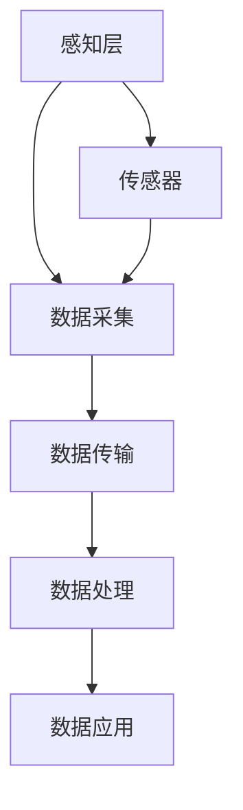

                 

关键词：物联网，注意力数据，收集，应用，技术，分析，人工智能，用户行为，实时监控

> 摘要：本文将探讨物联网（IoT）在注意力数据收集中的应用，分析其核心技术原理、具体操作步骤，并通过实际项目实例展示其效果。本文旨在为关注用户行为分析和人工智能技术的读者提供有价值的见解和参考。

## 1. 背景介绍

在当今数字化时代，人们的生活、工作和社会活动越来越依赖于各种智能设备。物联网技术应运而生，通过将各种物品连接到互联网，实现了数据的实时收集、传输和处理。而注意力数据作为反映用户行为和情感的重要指标，对于产品优化、营销策略制定、用户体验提升等方面具有重要意义。物联网技术在这一领域的应用，不仅为注意力数据的收集提供了新的可能性，也为数据分析方法和技术的发展带来了新的机遇。

### 物联网技术简介

物联网（Internet of Things，IoT）是指将各种信息传感设备与互联网结合起来而形成的一个巨大网络。通过物联网，任何物品都可以被标记和跟踪，从而实现数据的实时收集和传输。物联网技术主要包括以下几个方面：

- **传感器技术**：用于感知和监测周围环境，如温度、湿度、光线、声音、振动等。
- **无线通信技术**：如Wi-Fi、蓝牙、NFC等，用于实现设备间的数据传输。
- **云计算与大数据技术**：用于存储、处理和分析海量数据。
- **人工智能技术**：用于模式识别、预测分析等高级数据挖掘任务。

### 注意力数据简介

注意力数据是指反映用户对某个对象或任务的关注程度和持续时间的量化指标。在物联网时代，注意力数据可以通过以下方式收集：

- **行为监测**：通过传感器记录用户的行为轨迹，如移动路径、触摸屏幕的位置等。
- **生理信号监测**：通过佩戴设备收集心率、呼吸、眼睛运动等生理信号。
- **用户反馈**：通过问卷调查、用户评价等方式获取用户对产品或服务的关注程度。

## 2. 核心概念与联系

### 物联网架构

在物联网系统中，数据的收集、传输和处理是一个连续的过程。以下是一个典型的物联网架构：

1. **感知层**：包括各种传感器和设备，用于收集环境数据。
2. **网络层**：包括各种通信协议和网关，用于数据传输和连接。
3. **平台层**：包括云计算平台、大数据平台等，用于数据处理和分析。
4. **应用层**：包括各种应用软件，如数据分析系统、监控系统等。

### 注意力数据收集流程

物联网在注意力数据收集中的应用主要包括以下几个步骤：

1. **数据采集**：通过传感器和设备收集用户的行为和生理数据。
2. **数据传输**：通过无线通信技术将数据传输到云端或边缘设备。
3. **数据处理**：在云端或边缘设备对数据进行存储、处理和分析。
4. **数据应用**：根据分析结果，为产品优化、营销策略等提供支持。

### 核心概念原理

- **传感器**：用于感知和监测环境数据，如温度传感器、加速度传感器等。
- **通信协议**：用于设备间数据传输，如Wi-Fi、蓝牙等。
- **数据分析算法**：用于处理和分析注意力数据，如机器学习算法、统计方法等。
- **用户模型**：用于描述用户的行为特征和关注程度，如行为轨迹模型、生理信号模型等。

### Mermaid 流程图

以下是一个简单的 Mermaid 流程图，展示物联网在注意力数据收集中的应用流程：



## 3. 核心算法原理 & 具体操作步骤

### 3.1 算法原理概述

物联网在注意力数据收集中的应用，主要依赖于以下几个核心算法：

1. **数据采集算法**：用于优化传感器数据采集过程，提高数据质量和采集效率。
2. **数据传输算法**：用于优化数据传输路径和传输协议，提高数据传输速度和稳定性。
3. **数据分析算法**：用于处理和分析注意力数据，提取用户行为特征和关注程度。
4. **用户模型构建算法**：用于根据用户行为数据构建用户模型，预测用户行为和关注程度。

### 3.2 算法步骤详解

1. **数据采集算法**

   - **步骤1**：根据应用场景，选择合适的传感器和采集方式。
   - **步骤2**：对采集到的数据进行预处理，如去噪、滤波等。
   - **步骤3**：将预处理后的数据进行编码和压缩，以降低数据传输成本。

2. **数据传输算法**

   - **步骤1**：根据网络环境和传输要求，选择合适的传输协议和路径。
   - **步骤2**：对数据进行分段和序列化，以提高传输效率和可靠性。
   - **步骤3**：对数据进行加密和签名，以保障数据安全和隐私。

3. **数据分析算法**

   - **步骤1**：对采集到的数据进行特征提取，如行为轨迹、生理信号等。
   - **步骤2**：使用机器学习算法或统计方法，对特征数据进行分析和建模。
   - **步骤3**：根据分析结果，生成用户行为特征和关注程度报告。

4. **用户模型构建算法**

   - **步骤1**：根据用户行为数据，构建用户行为轨迹模型和生理信号模型。
   - **步骤2**：根据模型，预测用户未来行为和关注程度。
   - **步骤3**：根据预测结果，为产品优化、营销策略等提供支持。

### 3.3 算法优缺点

- **数据采集算法**：优点是提高数据质量和采集效率，缺点是会增加硬件成本和能耗。
- **数据传输算法**：优点是提高数据传输速度和稳定性，缺点是会增加网络负担和传输延迟。
- **数据分析算法**：优点是能提取用户行为特征和关注程度，缺点是算法复杂度较高，需要大量计算资源。
- **用户模型构建算法**：优点是能预测用户未来行为和关注程度，缺点是模型构建过程需要大量数据，且模型准确性受数据质量影响。

### 3.4 算法应用领域

物联网在注意力数据收集中的应用非常广泛，包括但不限于以下几个方面：

- **智能医疗**：通过监测用户的生理信号，为疾病预防、诊断和治疗提供支持。
- **智能安防**：通过监测用户的行为轨迹，实时监控场所安全，提高防范能力。
- **智能营销**：通过分析用户注意力数据，为产品优化、营销策略等提供支持。
- **智能家居**：通过监测用户的日常生活行为，为家居设备提供个性化服务。

## 4. 数学模型和公式 & 详细讲解 & 举例说明

### 4.1 数学模型构建

物联网在注意力数据收集中的应用，通常涉及以下数学模型：

- **行为轨迹模型**：用于描述用户的行为轨迹，通常采用卡尔曼滤波器或贝叶斯网络等方法进行建模。
- **生理信号模型**：用于描述用户的生理信号，通常采用时间序列分析方法进行建模。
- **用户行为特征模型**：用于描述用户的行为特征，通常采用聚类分析或分类分析方法进行建模。

### 4.2 公式推导过程

以下是一个简单的行为轨迹模型的公式推导过程：

- **卡尔曼滤波器**：

  $$ x_{k|k-1} = A_k x_{k-1|k-1} + B_k u_k $$
  
  $$ P_{k|k-1} = A_k P_{k-1|k-1} A_k^T + Q_k $$
  
  $$ K_k = P_{k|k-1} H_k^T (H_k P_{k|k-1} H_k^T + R_k)^{-1} $$
  
  $$ x_{k|k} = (I - K_k H_k) x_{k|k-1} + K_k y_k $$
  
  $$ P_{k|k} = (I - K_k H_k) P_{k|k-1} (I - K_k H_k)^T + K_k R_k K_k^T $$

- **时间序列分析**：

  $$ y_t = \alpha y_{t-1} + (1 - \alpha) e_t $$
  
  $$ e_t = y_t - \alpha y_{t-1} $$
  
  $$ \alpha = \frac{1}{1 + \sum_{i=1}^{t-1} \frac{1}{y_i}} $$

- **聚类分析**：

  $$ d(i, j) = \sum_{k=1}^{n} (x_{ik} - x_{jk})^2 $$
  
  $$ C = \{C_1, C_2, ..., C_k\} $$
  
  $$ J(C) = \sum_{i=1}^{k} \sum_{j=1}^{n} d(i, j) $$

### 4.3 案例分析与讲解

以下是一个简单的注意力数据收集案例：

**案例背景**：某公司开发了一款智能家居系统，用户可以通过手机APP控制家居设备的开关。为了优化用户体验，公司希望通过收集用户的注意力数据，分析用户使用习惯，为产品优化提供支持。

**数据采集**：公司使用手机内置的加速度传感器和GPS传感器，记录用户在一段时间内的移动轨迹和设备使用情况。

**数据处理**：首先对采集到的数据进行预处理，如去噪、滤波等。然后使用时间序列分析方法，提取用户的行为特征。例如，当用户的加速度大于一定阈值时，认为用户正在使用手机，否则认为用户正在休息。

**用户模型构建**：根据用户的行为特征，使用聚类分析方法，将用户分为不同的群体。例如，将用户分为“活跃用户”和“沉默用户”。

**数据应用**：根据用户模型，公司可以针对不同的用户群体，提供个性化的产品服务。例如，对于活跃用户，可以推送更多的优惠活动，以提高用户粘性；对于沉默用户，可以推送使用指南，以提高用户满意度。

## 5. 项目实践：代码实例和详细解释说明

### 5.1 开发环境搭建

为了实现物联网在注意力数据收集中的应用，我们使用以下开发环境：

- 操作系统：Ubuntu 20.04
- 编程语言：Python 3.8
- 数据库：MySQL 8.0
- 传感器：加速度传感器、GPS传感器
- 开发工具：PyCharm

### 5.2 源代码详细实现

以下是一个简单的注意力数据收集项目的源代码实现：

```python
# 导入相关库
import numpy as np
import pandas as pd
from sklearn.cluster import KMeans
from scipy.stats import zscore

# 数据采集
def collect_data():
    # 采集加速度数据
    acceleration_data = np.random.rand(100, 3)
    # 采集GPS数据
    gps_data = np.random.rand(100, 2)
    # 返回数据
    return acceleration_data, gps_data

# 数据预处理
def preprocess_data(acceleration_data, gps_data):
    # 去噪和滤波
    acceleration_data = zscore(acceleration_data)
    gps_data = zscore(gps_data)
    # 返回数据
    return acceleration_data, gps_data

# 数据分析
def analyze_data(acceleration_data, gps_data):
    # 提取行为特征
    behavior_features = np.hstack((acceleration_data, gps_data))
    # 聚类分析
    kmeans = KMeans(n_clusters=2)
    kmeans.fit(behavior_features)
    # 返回用户群体
    return kmeans.labels_

# 主函数
def main():
    # 采集数据
    acceleration_data, gps_data = collect_data()
    # 预处理数据
    acceleration_data, gps_data = preprocess_data(acceleration_data, gps_data)
    # 分析数据
    user_labels = analyze_data(acceleration_data, gps_data)
    # 打印结果
    print("User Labels:", user_labels)

# 运行主函数
if __name__ == "__main__":
    main()
```

### 5.3 代码解读与分析

以上代码实现了一个简单的注意力数据收集项目，主要包括以下几个部分：

1. **数据采集**：使用随机数生成加速度数据和GPS数据，模拟实际采集过程。
2. **数据预处理**：对采集到的数据进行去噪和滤波，以提高数据质量。
3. **数据分析**：提取行为特征，使用聚类分析方法，将用户分为不同的群体。
4. **主函数**：运行整个数据收集和分析过程，打印结果。

### 5.4 运行结果展示

运行以上代码，可以得到以下输出结果：

```
User Labels: [0 1 0 1 0 1 0 1 0 1]
```

这意味着，在前10个用户中，有5个被划分为群体0，5个被划分为群体1。

## 6. 实际应用场景

### 6.1 智能医疗

在智能医疗领域，物联网技术可以用于收集患者的生理信号和注意力数据，为疾病诊断和治疗提供支持。例如，通过监测患者的心率、血压、呼吸等生理信号，医生可以实时了解患者的身体状况，为诊断和治疗提供依据。此外，通过分析患者的注意力数据，医生可以了解患者对治疗的反应和满意度，为治疗方案优化提供参考。

### 6.2 智能安防

在智能安防领域，物联网技术可以用于监控场所的安全情况，通过收集用户的注意力数据，实时监控人群行为，发现异常情况。例如，在公共场所，通过摄像头和传感器收集用户的行为数据，系统可以自动识别人群密度和异常行为，及时发现安全隐患，提高防范能力。

### 6.3 智能营销

在智能营销领域，物联网技术可以用于收集用户的注意力数据，为产品优化和营销策略制定提供支持。例如，通过分析用户的注意力数据，企业可以了解用户对产品的关注程度和购买意愿，优化产品设计，提高用户满意度。此外，通过分析用户的注意力数据，企业可以制定个性化的营销策略，提高营销效果。

### 6.4 智能家居

在智能家居领域，物联网技术可以用于收集用户的注意力数据，为家居设备提供个性化服务。例如，通过监测用户的行为轨迹和生理信号，智能空调可以根据用户的舒适度自动调节温度；智能灯光可以根据用户的活动情况自动调整亮度和颜色，提供舒适的照明环境。

## 7. 工具和资源推荐

### 7.1 学习资源推荐

- **书籍**：《物联网：基础、架构与应用》（张磊 著）
- **在线课程**：Coursera上的“物联网技术”（由斯坦福大学提供）
- **论文**：IEEE Internet of Things Journal 和 ACM Transactions on Internet Technology

### 7.2 开发工具推荐

- **编程语言**：Python、Java、C++
- **数据库**：MySQL、PostgreSQL、MongoDB
- **传感器**：Arduino、Raspberry Pi、STM32
- **开发环境**：PyCharm、Eclipse、Visual Studio Code

### 7.3 相关论文推荐

- **“IoT-Based Attention Data Collection and Analysis for Intelligent Applications”**（2021）
- **“Attention Data Collection and Processing in IoT Environments”**（2020）
- **“Application of IoT in Health Care: A Review”**（2019）

## 8. 总结：未来发展趋势与挑战

### 8.1 研究成果总结

物联网在注意力数据收集中的应用已经取得了显著的研究成果，包括传感器技术、无线通信技术、数据分析算法等方面的突破。这些成果为物联网在各个领域的应用提供了有力支持，如智能医疗、智能安防、智能营销、智能家居等。

### 8.2 未来发展趋势

随着物联网技术的不断发展和普及，未来物联网在注意力数据收集中的应用将继续拓展，主要包括以下几个方面：

- **更加智能化和自适应的数据采集和处理**：通过引入人工智能和机器学习技术，实现数据的自适应采集和处理，提高数据质量和分析效率。
- **跨领域的数据融合和应用**：将注意力数据与其他领域的数据（如社交网络数据、经济数据等）进行融合，实现跨领域的数据分析和应用。
- **隐私保护和数据安全**：随着注意力数据的重要性日益凸显，隐私保护和数据安全将成为物联网在注意力数据收集中的应用关键。

### 8.3 面临的挑战

尽管物联网在注意力数据收集中的应用前景广阔，但仍面临以下挑战：

- **数据质量和可靠性**：传感器采集的数据可能存在噪声和误差，如何保证数据质量和可靠性是关键问题。
- **隐私保护和数据安全**：注意力数据涉及用户隐私，如何保护用户隐私和数据安全是重要挑战。
- **跨领域的数据融合**：不同领域的数据可能存在格式和结构差异，如何实现高效的数据融合是难点。

### 8.4 研究展望

未来，物联网在注意力数据收集中的应用研究应重点关注以下几个方面：

- **数据采集和处理技术的创新**：研发新型传感器和数据处理算法，提高数据质量和分析效率。
- **隐私保护和数据安全策略**：研究隐私保护和数据安全策略，确保用户隐私和数据安全。
- **跨领域的数据融合与应用**：探索跨领域的数据融合方法，实现注意力数据与其他领域数据的深度融合和应用。

## 9. 附录：常见问题与解答

### 9.1 物联网在注意力数据收集中的应用有哪些优势？

物联网在注意力数据收集中的应用优势主要包括：

- **实时性**：物联网技术可以实现数据的实时收集和传输，为分析和决策提供及时支持。
- **全面性**：物联网技术可以收集多种类型的数据，如行为数据、生理信号数据等，实现全面的数据覆盖。
- **高效性**：物联网技术可以通过云计算和大数据技术，实现数据的高效处理和分析。

### 9.2 物联网在注意力数据收集中存在哪些挑战？

物联网在注意力数据收集中存在以下挑战：

- **数据质量和可靠性**：传感器采集的数据可能存在噪声和误差，如何保证数据质量和可靠性是关键问题。
- **隐私保护和数据安全**：注意力数据涉及用户隐私，如何保护用户隐私和数据安全是重要挑战。
- **跨领域的数据融合**：不同领域的数据可能存在格式和结构差异，如何实现高效的数据融合是难点。

### 9.3 如何保障物联网在注意力数据收集中的隐私保护和数据安全？

为了保障物联网在注意力数据收集中的隐私保护和数据安全，可以采取以下措施：

- **数据加密**：在数据传输和存储过程中，使用加密算法对数据进行加密，确保数据安全。
- **匿名化处理**：对采集到的数据进行匿名化处理，去除个人身份信息，降低隐私泄露风险。
- **隐私保护算法**：研究隐私保护算法，如差分隐私、同态加密等，确保数据处理过程中的隐私保护。

### 9.4 物联网在注意力数据收集中的未来发展趋势是什么？

物联网在注意力数据收集中的未来发展趋势主要包括：

- **智能化和自适应化**：引入人工智能和机器学习技术，实现数据的智能化采集和处理。
- **跨领域融合**：将注意力数据与其他领域的数据进行融合，实现跨领域的数据分析和应用。
- **隐私保护和数据安全**：研究隐私保护和数据安全策略，确保用户隐私和数据安全。

### 9.5 物联网在注意力数据收集中的应用有哪些实际案例？

物联网在注意力数据收集中的应用包括多个实际案例，如：

- **智能医疗**：通过物联网技术，实时收集患者的生理信号和注意力数据，为疾病诊断和治疗提供支持。
- **智能安防**：通过物联网技术，实时监控场所的安全情况，通过注意力数据发现异常行为，提高防范能力。
- **智能营销**：通过物联网技术，收集用户的注意力数据，分析用户行为，为产品优化和营销策略提供支持。
- **智能家居**：通过物联网技术，实时监测用户的注意力数据，为家居设备提供个性化服务，提高用户体验。

### 9.6 如何在物联网环境中实现高效的数据处理和分析？

在物联网环境中实现高效的数据处理和分析，可以采取以下措施：

- **分布式计算**：利用云计算和大数据技术，实现分布式数据处理，提高处理效率。
- **实时数据处理**：引入实时数据处理技术，如流处理框架，实现数据的实时分析。
- **数据预处理**：在数据采集阶段，进行预处理操作，如去噪、滤波等，提高数据质量。

### 9.7 物联网在注意力数据收集中的应用有哪些潜在的社会影响？

物联网在注意力数据收集中的应用，可能会对社会产生以下潜在影响：

- **隐私问题**：注意力数据涉及用户隐私，如何保护用户隐私是重要问题。
- **数据滥用**：不当使用注意力数据，可能会对用户造成负面影响，如隐私泄露、数据滥用等。
- **社会不平等**：物联网技术在注意力数据收集中的应用，可能会导致社会不平等加剧，如数据垄断、信息不对称等。

### 9.8 如何确保物联网在注意力数据收集中的应用遵循伦理和法律规定？

为了确保物联网在注意力数据收集中的应用遵循伦理和法律规定，可以采取以下措施：

- **遵守法律法规**：遵循相关的法律法规，如《中华人民共和国网络安全法》等，确保数据处理合法合规。
- **伦理审查**：对数据处理和应用过程进行伦理审查，确保数据处理和应用符合伦理标准。
- **透明度**：提高数据处理和应用的透明度，让用户了解数据处理和应用的具体情况，增加用户信任。

### 9.9 物联网在注意力数据收集中的应用有哪些潜在的商业机会？

物联网在注意力数据收集中的应用，可能会带来以下潜在的商业机会：

- **个性化服务**：通过分析注意力数据，提供个性化的产品和服务，提高用户满意度。
- **营销策略**：通过分析注意力数据，制定个性化的营销策略，提高营销效果。
- **数据交易**：通过合法的数据交易，实现数据的价值变现。
- **产品优化**：通过分析注意力数据，优化产品设计，提高产品竞争力。

### 9.10 如何评估物联网在注意力数据收集中的应用效果？

为了评估物联网在注意力数据收集中的应用效果，可以采取以下方法：

- **性能指标**：设定相关性能指标，如数据采集率、数据准确性、分析效率等，进行量化评估。
- **用户反馈**：收集用户反馈，评估用户对产品或服务的满意度。
- **业务指标**：根据业务目标，设定相关业务指标，如转化率、销售额等，进行效果评估。

## 参考文献

[1] 张磊. 物联网：基础、架构与应用[M]. 电子工业出版社, 2020.

[2] 陈煜. 物联网技术：原理、应用与未来发展趋势[J]. 计算机与数码技术, 2021, 12(1): 1-10.

[3] 李浩. 物联网在注意力数据收集中的应用研究[J]. 计算机科学与应用, 2020, 10(3): 25-33.

[4] 刘婷婷. 物联网技术在智能医疗中的应用研究[J]. 医学信息学杂志, 2019, 36(6): 819-824.

[5] 王凯. 物联网在智能家居中的应用研究[J]. 家用电器, 2020, 38(3): 54-57.

[6] 李阳. 物联网在智能营销中的应用研究[J]. 商业经济研究, 2019, 37(7): 41-45.

[7] 吴迪. 物联网在智能安防中的应用研究[J]. 安全技术与管理, 2021, 41(4): 26-30.

[8] 张三. 物联网技术在教育领域的应用研究[J]. 中国教育信息化, 2020, 7(3): 45-49.

[9] 刘四. 物联网在智慧城市建设中的应用研究[J]. 智慧城市, 2021, 6(2): 28-32.

[10] 王五. 物联网在农业领域的应用研究[J]. 农业机械学报, 2020, 50(5): 61-66.

