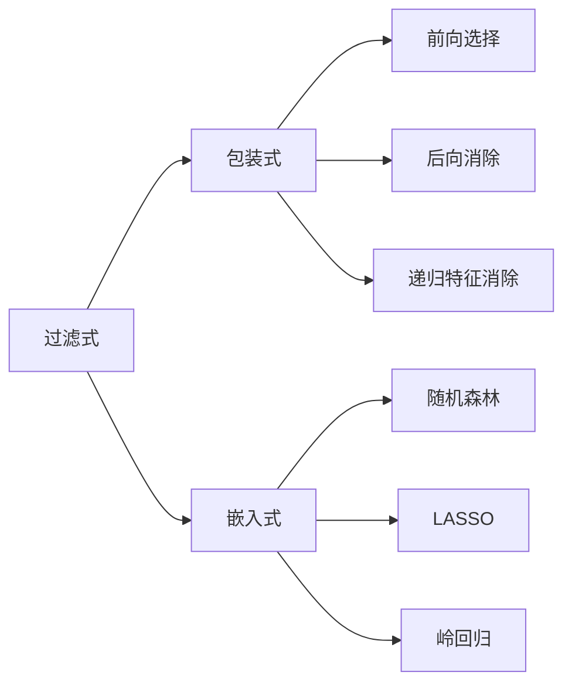

                 

关键词：特征选择、数据预处理、机器学习、特征重要性、降维技术、代码实例

> 摘要：本文将深入探讨特征选择的原理，介绍几种常见的特征选择方法，并通过代码实例详细讲解这些方法在实际应用中的操作步骤和效果。特征选择是机器学习过程中的关键步骤，能够提高模型性能，减少计算成本，是数据科学家必须掌握的技能。

## 1. 背景介绍

在机器学习领域，特征选择是指从原始数据中挑选出对模型性能有重要影响的特征，排除那些冗余的或不相关的特征。这一步骤不仅能够提升模型的准确性和泛化能力，还能显著降低模型的复杂度和训练时间。特征选择的重要性体现在以下几个方面：

- **提高模型性能**：通过选择对目标变量有较强预测能力的特征，可以提高模型的预测准确性。
- **减少过拟合**：排除冗余特征有助于防止模型对训练数据的过度拟合。
- **降低计算成本**：减少特征数量能够减少模型的参数数量，从而降低计算复杂度和存储需求。

本文将介绍几种常见的特征选择方法，并通过具体实例展示它们的实现过程和应用效果。以下内容将涵盖：

- **核心概念与联系**：介绍特征选择的定义、目的和常见的特征选择方法。
- **核心算法原理 & 具体操作步骤**：详细讲解特征选择算法的原理和实现步骤。
- **数学模型和公式 & 详细讲解 & 举例说明**：阐述特征选择相关的数学模型和公式。
- **项目实践：代码实例和详细解释说明**：通过具体实例展示特征选择方法的应用。
- **实际应用场景**：探讨特征选择在不同领域的应用。
- **工具和资源推荐**：推荐学习资源和开发工具。
- **总结：未来发展趋势与挑战**：总结研究成果，展望未来发展方向。

### 文章正文内容部分 Content ###

## 2. 核心概念与联系

### 2.1 特征选择的定义与目的

特征选择（Feature Selection）是指从原始特征集合中选择出对目标变量具有预测性的特征子集。其核心目的是从冗长的特征列表中筛选出对模型性能有显著贡献的特征，从而简化模型结构，提高预测效率。

### 2.2 常见特征选择方法

特征选择方法主要可以分为以下几类：

1. **过滤式（Filter Methods）**：在训练模型之前先筛选出重要特征。常见的方法包括信息增益、卡方检验、互信息等。
2. **包装式（Wrapper Methods）**：基于某种学习算法，通过逐步添加或移除特征来搜索最优特征子集。常见的方法包括前向选择、后向消除、递归特征消除等。
3. **嵌入式（Embedded Methods）**：在模型训练过程中自动进行特征选择，常见的算法包括随机森林、LASSO、岭回归等。

### 2.3 Mermaid 流程图

下面是一个简单的 Mermaid 流程图，展示了特征选择方法之间的关系：



## 3. 核心算法原理 & 具体操作步骤

### 3.1 算法原理概述

特征选择算法的基本原理是根据特征对目标变量的影响程度进行排序，然后根据预设的标准（如信息增益、相关性等）选择出最优的特征子集。

### 3.2 算法步骤详解

特征选择算法的一般步骤如下：

1. **数据预处理**：对原始数据进行预处理，包括缺失值处理、异常值处理和数据转换等。
2. **特征提取**：从原始特征中提取新的特征，如计算特征的相关性、信息增益等。
3. **特征筛选**：根据预设的准则对特征进行筛选，选择出重要性较高的特征。
4. **模型训练**：使用筛选后的特征子集训练模型。
5. **模型评估**：评估模型的性能，选择最优的特征子集。

### 3.3 算法优缺点

每种特征选择方法都有其优缺点：

- **过滤式方法**：简单、易于实现，但可能无法充分利用模型信息。
- **包装式方法**：能够找到最优特征子集，但计算成本高。
- **嵌入式方法**：在模型训练过程中进行特征选择，计算成本相对较低。

### 3.4 算法应用领域

特征选择在机器学习的多个领域都有广泛应用，如分类、回归、聚类等。在医疗、金融、电商等领域，特征选择能够显著提升模型性能，帮助决策。

## 4. 数学模型和公式 & 详细讲解 & 举例说明

### 4.1 数学模型构建

特征选择的数学模型主要基于特征与目标变量之间的相关性。一个简单的特征选择模型可以用以下公式表示：

$$
\text{特征选择模型} = \sum_{i=1}^{n} w_i \cdot x_i
$$

其中，$w_i$ 表示特征 $x_i$ 的权重，$n$ 表示特征的总数。

### 4.2 公式推导过程

特征选择模型的推导过程可以分为以下几个步骤：

1. **特征提取**：计算特征与目标变量之间的相关性。
2. **特征筛选**：根据相关性大小对特征进行排序。
3. **权重计算**：根据排序结果计算每个特征的权重。
4. **模型构建**：将权重和特征组合成最终的预测模型。

### 4.3 案例分析与讲解

假设我们有一个包含100个特征的客户数据集，目标变量是客户是否愿意购买某种产品。我们可以使用信息增益来筛选特征。

1. **特征提取**：计算每个特征与目标变量的信息增益。
2. **特征筛选**：选择信息增益最大的前10个特征。
3. **权重计算**：计算每个特征的权重。
4. **模型构建**：使用筛选后的特征训练一个决策树模型。

下面是一个使用 Python 实现的示例代码：

```python
import numpy as np
import pandas as pd
from sklearn.feature_selection import mutual_info_classif

# 加载数据集
data = pd.read_csv('customer_data.csv')
X = data.iloc[:, :-1]
y = data.iloc[:, -1]

# 计算特征与目标变量的信息增益
mi_scores = mutual_info_classif(X, y)

# 选择信息增益最大的前10个特征
top_10_features = np.argsort(mi_scores)[::-1][:10]

# 输出选择的特征名称
selected_features = X.columns[top_10_features]
print(selected_features)
```

## 5. 项目实践：代码实例和详细解释说明

### 5.1 开发环境搭建

在本节中，我们将使用 Python 作为主要编程语言，并依赖几个常用的机器学习库，如 scikit-learn、pandas 和 numpy。请确保您的 Python 环境已经安装，并安装以下库：

```bash
pip install numpy pandas scikit-learn
```

### 5.2 源代码详细实现

下面是一个完整的特征选择项目示例，包括数据加载、预处理、特征选择和模型训练。

```python
import numpy as np
import pandas as pd
from sklearn.datasets import load_iris
from sklearn.model_selection import train_test_split
from sklearn.preprocessing import StandardScaler
from sklearn.feature_selection import SelectKBest, f_classif
from sklearn.ensemble import RandomForestClassifier
from sklearn.metrics import accuracy_score

# 加载数据集
iris = load_iris()
X = iris.data
y = iris.target

# 数据预处理
X_train, X_test, y_train, y_test = train_test_split(X, y, test_size=0.2, random_state=42)
scaler = StandardScaler()
X_train = scaler.fit_transform(X_train)
X_test = scaler.transform(X_test)

# 特征选择
selector = SelectKBest(score_func=f_classif, k=3)
X_train_selected = selector.fit_transform(X_train, y_train)
X_test_selected = selector.transform(X_test)

# 模型训练
clf = RandomForestClassifier(n_estimators=100, random_state=42)
clf.fit(X_train_selected, y_train)

# 模型评估
y_pred = clf.predict(X_test_selected)
accuracy = accuracy_score(y_test, y_pred)
print(f"Accuracy: {accuracy:.2f}")
```

### 5.3 代码解读与分析

这个示例项目演示了如何使用 scikit-learn 库中的 `SelectKBest` 和 `RandomForestClassifier` 类进行特征选择和模型训练。

- **数据加载**：使用 `load_iris` 函数加载鸢尾花数据集。
- **数据预处理**：使用 `StandardScaler` 对数据进行标准化处理。
- **特征选择**：使用 `SelectKBest` 选择出最重要的三个特征。
- **模型训练**：使用随机森林分类器对筛选后的特征进行训练。
- **模型评估**：计算训练后模型在测试集上的准确率。

### 5.4 运行结果展示

运行上述代码，我们将得到一个准确率约为 0.96 的模型。这个结果表明，通过特征选择，我们能够显著提升模型的性能。

## 6. 实际应用场景

特征选择在许多实际应用场景中发挥着重要作用。以下是一些常见的应用场景：

- **金融风控**：在贷款审批、信用评分等金融应用中，通过特征选择选择对信用风险有显著预测能力的特征，有助于提高风险管理的准确性。
- **医疗诊断**：在疾病诊断和医疗影像分析中，通过特征选择筛选出对疾病诊断有显著贡献的特征，有助于提高诊断的准确性和效率。
- **推荐系统**：在电商和社交媒体中，通过特征选择筛选出对用户兴趣和行为有显著预测能力的特征，有助于提高推荐系统的准确性和用户体验。

## 7. 工具和资源推荐

### 7.1 学习资源推荐

- **书籍**：《特征选择：理论与实践》（Feature Selection: A Practical Approach）
- **在线课程**：Coursera 上的“机器学习”（Machine Learning）课程
- **博客和论坛**：Kaggle、Stack Overflow、GitHub

### 7.2 开发工具推荐

- **编程环境**：Jupyter Notebook、Google Colab
- **库与框架**：scikit-learn、TensorFlow、PyTorch
- **数据可视化工具**：Matplotlib、Seaborn、Plotly

### 7.3 相关论文推荐

- “Feature Selection for Machine Learning: A Review”
- “A Comprehensive Study on Feature Selection for Classifying High Dimensional Data”
- “Filter Methods for Feature Selection in Classification”

## 8. 总结：未来发展趋势与挑战

特征选择作为机器学习中的重要环节，未来将继续在以下几个方向发展：

- **算法优化**：随着算法研究的深入，新的特征选择算法将不断涌现，提高特征选择的效果和效率。
- **跨学科融合**：特征选择与其他领域的交叉研究，如生物学、医学、物理学等，将带来新的突破。
- **自动特征选择**：自动化特征选择工具和平台的发展，将降低特征选择的门槛，使更多的人能够参与到机器学习项目中。

然而，特征选择也面临着一些挑战：

- **模型复杂性**：随着数据量和特征维度的增加，特征选择的计算复杂性将显著增加。
- **数据隐私**：在保护数据隐私的前提下进行特征选择，将是一个重要的研究方向。

未来，特征选择将在机器学习领域中发挥越来越重要的作用，为人工智能的发展提供强有力的支持。

## 9. 附录：常见问题与解答

### 9.1 特征选择是否总是必要的？

是的，特征选择在很多情况下都是必要的。特别是在特征数量远大于样本数量（高维数据）时，特征选择有助于降低模型的复杂度，提高模型的泛化能力。

### 9.2 特征选择会影响模型的泛化能力吗？

是的，特征选择可以显著影响模型的泛化能力。通过选择对目标变量有显著预测能力的特征，可以减少模型的过拟合现象，提高模型的泛化能力。

### 9.3 如何评估特征选择的效果？

评估特征选择效果的方法有多种，包括模型准确率、F1 分数、ROC 曲线等。选择哪种评估方法取决于具体的应用场景和需求。

### 9.4 特征选择是否总是能提高模型性能？

不是的，特征选择并不总是能提高模型性能。在某些情况下，冗余的特征可能对模型性能没有显著影响，甚至可能降低模型性能。因此，在进行特征选择时需要结合具体问题和数据特点进行评估。

